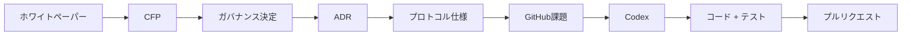
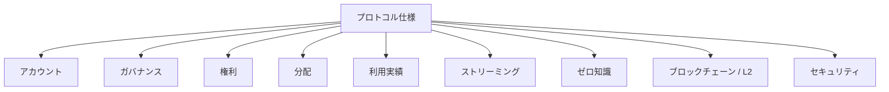
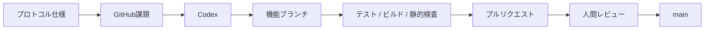
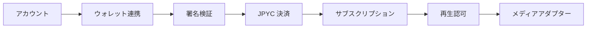
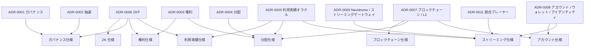

# プロトコル仕様

Creator First Platform のプロトコル仕様は、ホワイトペーパー・CFP・ガバナンス決定・ADR で確定した設計を、**Codexや開発者が実装可能な要件へ変換するための文書群**です。

プロトコル仕様は、人間向けの説明書であると同時に、AIエージェントが実装・テスト・レビューを行うための **実装契約**として利用します。

アカウント・決済・資格証明・権利・ストリーミング・プレーヤー・利用実績・分配の10仕様を一つの利用経路として読む場合は、[エンドツーエンド最小縦断実装](/protocol/vertical-slice)を参照してください。コントラクト仕様変更を統治する11番目の仕様は、[SPEC-GOVERNANCE-001](/protocol/specs/governance-change)として独立させています。モック／テストネットでの作業分解とStage ゲートは[最小縦断実装実装計画](/protocol/implementation-plan)にまとめています。

::: warning 現在の状態: 草案
公開中のプロトコル仕様は設計・レビュー段階です。本番サービスや資金を扱う承認済み仕様ではありません。実装開始前に未解決事項を解決し、法務・セキュリティ・ガバナンスの承認と版更新が必要です。
:::

## 現在の草案

| 仕様 | Domain | 版 | 主な役割 |
| --- | --- | --- | --- |
| [SPEC-ACCOUNT-003 アカウントライフサイクル](/protocol/specs/account-lifecycle) | アカウント / アイデンティティ | 0.1.0 | 登録、認証、セッション、復旧、閉鎖 |
| [SPEC-ACCOUNT-002 ウォレット連携](/protocol/specs/wallet-linking) | アカウント / アイデンティティ | 0.1.0 | ウォレット関連付け、署名、解除、権限分離 |
| [SPEC-ACCOUNT-004 初期サポーター資格証明](/protocol/specs/early-supporter-credential) | アカウント / 資格証明 | 0.1.0 | SBT同意、発行、失効、ウォレット回復、限定特権 |
| [SPEC-BLOCKCHAIN-001 精算資産登録台帳](/protocol/specs/settlement-asset-registry) | ブロックチェーン / 決済 | 0.1.0 | JPYC等の審査、承認、停止、履歴管理 |
| [SPEC-ACCOUNT-001 サブスクリプション精算](/protocol/specs/subscription-settlement) | アカウント / 決済 | 0.1.0 | 決済意思、ファイナリティ、サブスクリプション有効化 |
| [SPEC-RIGHTS-001 権利登録台帳](/protocol/specs/rights-registry) | 権利 / コンテンツ | 0.1.0 | 作業・原盤、権利主張、審査、紛争、権利スナップショット |
| [SPEC-STREAMING-001 再生認可](/protocol/specs/playback-authorization) | ストリーミング / 認可 | 0.1.0 | サブスクリプション・資格証明特権・権利認可、再生セッション、メディアアダプター、配信証跡 |
| [SPEC-STREAMING-002 プレーヤークライアント](/protocol/specs/player-client) | ストリーミング / クライアント | 0.1.0 | ゲートウェイ専用PWA、Navidrome再生、ウォレット・サポーター SBT・コミュニティ統合、クライアントストレージ境界 |
| [SPEC-USAGE-001 再生検証](/protocol/specs/playback-verification) | 利用実績 / プライバシー | 0.1.0 | 再生イベント、重複防止、検証、利用実績スナップショット、異議申立て |
| [SPEC-DISTRIBUTION-001 音楽クリエーター分配](/protocol/specs/creator-distribution) | 分配 / 会計 | 0.1.0 | 収益、ユーザ中心計算、権利分割、保留、配分、資金透明性照合 |
| [SPEC-GOVERNANCE-001 コントラクト変更ガバナンス](/protocol/specs/governance-change) | ガバナンス / コントラクト進化 | 0.1.0 | 二院制、二次投票、レビュー、マニフェスト、タイムロック、アップグレード |

すべての草案は、リポジトリ内の自動検証によって要件IDと不変条件 IDの一意性、国際不変条件参照、関連文書の存在、MUST / MUST NOTとテスト要件の双方向対応、および未解決事項の安定ID・決定責任者・停止中ゲートを検査します。未決定事項は[プロトコル決定一覧](/protocol/open-questions)から確認できます。

---

## プロトコルの位置づけ



各文書の役割は次のとおりです。

| レイヤー | 役割 |
| --- | --- |
| ホワイトペーパー | 何を目指すか、プラットフォームの基本原則 |
| CFP | 何を変更・拡張したいか |
| ガバナンス決定 | 何を採用するか |
| ADR | なぜその設計を採用したか |
| プロトコル仕様 | 何を、どの条件で実装するか |
| GitHub課題 | 今回実装する具体的作業 |
| コード / テスト | 仕様を満たす実装 |

---

## 正本

実装時には、原則として次の順序で上位文書を参照します。

```text
三憲章
      ↓
ホワイトペーパー
      ↓
Accepted CFP / ガバナンス決定
      ↓
ADR
      ↓
プロトコル仕様
      ↓
実装
```

実装コードと承認済みプロトコル仕様が矛盾する場合、原則として仕様を正とします。

---

## 共通プロトコル文書

プロトコル全体で共通して参照する文書です。

### [README](/protocol/foundation/overview)

プロトコル仕様全体の目的、文書階層、AIエージェント向けルールを定義します。

文書階層、開発フロー、仕様一覧、AIエージェント向けルールを公開しています。

### [規約](/protocol/foundation/conventions)

MUST / MUST NOT / SHOULD / MAY、Identifier、Timestamp、トークン Amount、Error コード、版等の共通記法を定義します。

規範キーワード、識別子、時刻、金額、エラー、版の共通規則を公開しています。

### [用語集](/protocol/foundation/glossary)

ユーザ、音楽クリエーター、権利者、ウォレット、ガバナンス議員、利用実績イベント等の用語を統一します。

参加者、アカウント、ウォレット、権利、決済等の共通語彙を公開しています。

### [全体不変条件](/protocol/foundation/invariants)

プラットフォーム全体で破ってはいけない不変条件を定義します。

下位仕様や実装が上書きしてはならないプラットフォーム全体の不変条件を公開しています。

---

## プロトコル領域

プロトコル仕様はドメイン単位に整理します。



---

## アカウント / ウォレット / アイデンティティ

ADR-0008を実装可能な仕様へ落とし込みます。

主な仕様:

```text
protocol/account/
├── account-lifecycle-spec.md         # 草案 v0.1.0
├── wallet-linking-spec.md            # 草案 v0.1.0
├── early-supporter-credential-spec.md # 草案 v0.1.0
└── subscription-settlement-spec.md   # 草案 v0.1.0
```

現在の草案として、[SPEC-ACCOUNT-001 サブスクリプション精算・有効化](/protocol/specs/subscription-settlement) を定義しています。これは、承認済み決済資産、決済意思、ファイナリティ、二重有効化防止、サブスクリプション状態、監査要件を実装可能な要件へ変換したものです。

アカウントとウォレットの関連付け・解除・回復時の安全要件は、[SPEC-ACCOUNT-002 ウォレット連携・Unlinking](/protocol/specs/wallet-linking) が定義します。

初期サポーター SBTの同意、発行、失効、ウォレット回復と、サブスクリプション・権利を置き換えない限定特権は、[SPEC-ACCOUNT-004 初期サポーター資格証明・特権](/protocol/specs/early-supporter-credential) が定義します。

アカウント登録、認証、セッション、復旧、停止・閉鎖の基盤は、[SPEC-ACCOUNT-003 アカウントライフサイクル, 認証・復旧](/protocol/specs/account-lifecycle) が定義します。

決済資産の承認・停止・監視・履歴管理は、[SPEC-BLOCKCHAIN-001 承認済み精算資産登録台帳](/protocol/specs/settlement-asset-registry) が定義します。

最初の最小縦断実装は、

```text
アカウント登録
      ↓
ウォレット連携
      ↓
JPYC 決済認可
      ↓
サブスクリプション精算
      ↓
サブスクリプション有効化
```

です。

### 関連ADR

- ADR-0008 アカウント / ウォレット / アイデンティティ戦略
- ADR-0007 ブロックチェーン / L2 戦略

---

## ガバナンス

音楽クリエーター／ユーザから抽選議会を形成し、熟議からプロトコル決定へつなげる仕様です。

現在の草案と予定仕様:

```text
protocol/governance/
├── contract-change-governance-spec.md # 草案 v0.1.0
├── eligibility-spec.md
├── sortition-spec.md
├── deliberation-spec.md
├── referendum-spec.md
└── emergency-governance-spec.md
```

[SPEC-GOVERNANCE-001 コントラクト変更ガバナンス](/protocol/specs/governance-change)は、音楽クリエータ院議会とユーザ院議会の独立承認、本人単位の二次投票、実行マニフェスト、レビュー、タイムロックおよびアップグレード権限を定義します。議会UIの設計は[二院制議会・ガバナンス](/governance/)を参照してください。

### 関連ADR

- ADR-0001 ガバナンスモデル
- ADR-0002 検証可能抽選
- ADR-0006 ゼロ知識証明戦略
- ADR-0008 アカウント / ウォレット / アイデンティティ戦略
- ADR-0016 コントラクト変更の二院制・二次投票ガバナンス

---

## 権利

作品、音楽クリエーター、権利者、権利主張、検証済み権利、紛争状態を扱います。

予定仕様:

```text
protocol/rights/
├── rights-registry-spec.md
├── rights-verification-spec.md
├── rights-dispute-spec.md
└── rights-versioning-spec.md
```

### 関連ADR

- ADR-0003 権利登録台帳
- ADR-0006 ゼロ知識証明戦略

---

## 分配

サブスクリプション収益を検証済み利用実績と権利状態に基づいて音楽クリエーター／権利者へ分配する仕様です。

予定仕様:

```text
protocol/distribution/
├── revenue-allocation-spec.md
├── distribution-spec.md
├── settlement-spec.md
└── payout-spec.md
```

### 関連ADR

- ADR-0003 権利登録台帳
- ADR-0004 音楽クリエーター分配モデル
- ADR-0005 利用実績オラクル
- ADR-0007 ブロックチェーン / L2 戦略

---

## 利用実績

再生イベントを検証済み利用実績へ変換し、分配へ渡すための仕様です。

予定仕様:

```text
protocol/usage/
├── usage-event-spec.md
├── usage-verification-spec.md
├── usage-aggregation-spec.md
└── fraud-detection-spec.md
```

### 関連ADR

- ADR-0005 利用実績オラクル
- ADR-0006 ゼロ知識証明戦略
- ADR-0009 Navidrome / ストリーミング認可ゲートウェイ

---

## ストリーミング認可

アカウントセッション、サブスクリプション、権利状態を、短時間で失効可能な再生セッションへ変換し、メディアアダプターへの唯一の公開認可境界を定義します。

現在の草案:

- [SPEC-STREAMING-001 ストリーミング認可・再生セッション](/protocol/specs/playback-authorization)
- [SPEC-STREAMING-002 プレーヤークライアント・ゲートウェイ連携](/protocol/specs/player-client)

```text
protocol/streaming/
├── playback-authorization-spec.md   # 草案 v0.1.0
└── player-client-spec.md            # 草案 v0.1.0
```

Navidromeは適合可能なメディアアダプター例ですが、正規楽曲 ID、サブスクリプション、権利、検証済み利用実績または分配の正本にはしません。

公開プレーヤーはゲートウェイ専用APIだけを利用する軽量PWAとし、ウォレット署名を通常再生の重大 Pathへ入れません。一般サポーターと初期サポーターの資格証明状態、コミュニティ Capabilityおよびクライアントストレージの安全境界はSPEC-STREAMING-002が定義します。

### 関連ADR

- ADR-0009 Navidrome / ストリーミング認可ゲートウェイ
- ADR-0011 統合プレーヤークライアント
- ADR-0008 アカウント / ウォレット / アイデンティティ戦略
- ADR-0005 利用実績オラクル

---

## ゼロ知識証明

プライバシーを維持しながらプロトコル計算を検証可能にする証明レイヤーを定義します。

予定仕様:

```text
protocol/zk/
├── zk-proof-interface-spec.md
├── usage-proof-spec.md
├── distribution-proof-spec.md
├── rights-proof-spec.md
└── eligibility-proof-spec.md
```

### 関連ADR

- ADR-0002 検証可能抽選
- ADR-0003 権利登録台帳
- ADR-0004 音楽クリエーター分配モデル
- ADR-0005 利用実績オラクル
- ADR-0006 ゼロ知識証明戦略

---

## ブロックチェーン / L2

現在の草案:

- [SPEC-BLOCKCHAIN-001 承認済み精算資産登録台帳](/protocol/specs/settlement-asset-registry)

スマートコントラクト、ステーブルコイン精算、L2 連携、アップグレード、チェーン状態等を定義します。

予定仕様:

```text
protocol/blockchain/
├── blockchain-interface-spec.md
├── asset-registry-spec.md
├── settlement-contract-spec.md
├── contract-upgrade-spec.md
├── chain-state-spec.md
└── gas-sponsorship-spec.md
```

### 関連ADR

- ADR-0004 音楽クリエーター分配モデル
- ADR-0006 ゼロ知識証明戦略
- ADR-0007 ブロックチェーン / L2 戦略
- ADR-0008 アカウント / ウォレット / アイデンティティ戦略

---

## セキュリティ

プロトコル全体の信頼境界、鍵管理、インシデント対応等を定義します。

予定仕様:

```text
protocol/security/
├── threat-model.md
├── trust-boundaries.md
├── key-management-spec.md
└── incident-response-spec.md
```

各ドメイン仕様はこのセキュリティレイヤーを参照します。

---

## 仕様形式

各プロトコル仕様は共通テンプレートに従います。

```text
protocol/templates/protocol-spec-template.md
```

基本構造:

```text
Goal
範囲
Out of 範囲
Actors
Inputs
Outputs
状態
要件
不変条件
状態 Transitions
Interfaces
Error Conditions
セキュリティ要件
プライバシー要件
障害処理
監査要件
テスト要件
受入基準
未解決事項
```

特にCodexへ実装を依頼する際には、

- MUST
- MUST NOT
- 不変条件
- Error Conditions
- テスト要件
- 受入基準

を明確にします。

---

## AI / Codex 開発フロー

プロトコル仕様から直接mainブランチへ実装を反映しません。



Codexには、まず関連する

1. `AGENTS.md`
2. ADR
3. プロトコル仕様
4. Existing コード
5. Existing テスト

を読むよう指示します。

---

## GitHub課題の単位

1つの仕様を1つの巨大課題として実装するのではなく、小さな受入基準単位に分けます。

例えば `wallet-linking-spec.md` から、

```text
課題: Generate wallet linking challenge
課題: 検証 wallet signature
課題: 拒否 replayed nonce
課題: Add wallet linking API
課題: Add wallet unlinking flow
```

のように分割します。

---

## 最初に実装するプロトコル

最初のCodex実装では、ADR-0008とADR-0009を基礎にアカウント / ウォレット / サブスクリプション / 再生の最小縦断実装を作ります。



最初に作成する仕様:

1. `account/account-lifecycle-spec.md` — 草案 v0.1.0
2. `account/wallet-linking-spec.md` — 草案 v0.1.0
3. `account/subscription-settlement-spec.md` — 草案 v0.1.0
4. `streaming/playback-authorization-spec.md` — 草案 v0.1.0
5. `streaming/player-client-spec.md` — 草案 v0.1.0

---

## プロトコルと ADR の関係



---

## 実装原則

プロトコル仕様は単なる参考文書ではありません。

実装では、

> **仕様 → テスト → コード**

の順序を意識します。

```text
プロトコル Requirement
      ↓
受入基準
      ↓
自動テスト
      ↓
実装
```

これにより、Codexが生成したコードが仕様を満たしているかを人間とCIの両方で確認できるようにします。

---

## 現在の最小縦断実装

最初の実装仕様は次の順序で接続します。

```text
アカウントライフサイクル
↓
ウォレット連携
↓
承認済み精算資産
↓
サブスクリプション精算
```

これにより、

```text
アカウント
↓
ウォレット連携
↓
JPYC サブスクリプション
```

のエンドツーエンド実装へ進むための草案要件が揃います。
