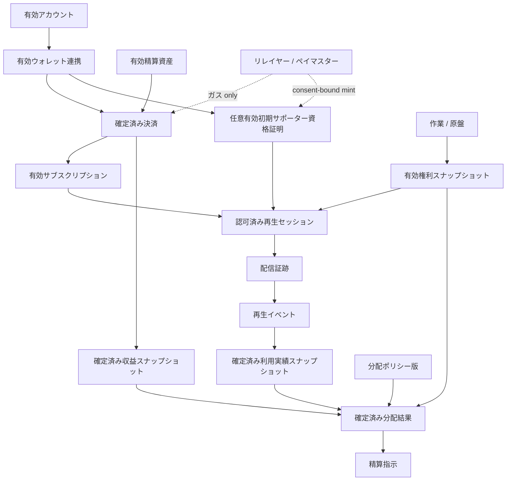

# エンドツーエンド最小縦断実装

現在の10個の草案プロトコル仕様を、Creator First Platformの最初の検証可能な実装経路として接続します。このページは実装順序と境界を示すものであり、サービス、公開決済、分配またはデプロイ済みスマートコントラクトが稼働していることを示すものではありません。

このページはモック／テストネットの最小経路を扱う。本番でユーザ登録、音楽クリエーター登録、配信利用、コミュニティ、ガバナンスおよび分配を接続する追加要件は、[SPEC-PLATFORM-001 本番サービスライフサイクル](/protocol/specs/production-service-lifecycle)を参照する。

::: warning 全体として未成立です
プロトコル仕様はすべて草案です。ローカルプレーヤー、ゲートウェイ、合成音源、限定的なSIWE／EIP-712、Test-only プロフィールに加え、テストネット専用MockJPYC決済とサポーター SBT コントラクトを部分実装し、Polygon Amoyへデプロイしています。しかしコントラクトはゲートウェイ／インデクサーと未接続であり、アカウント lifecycle、権利／資格証明参照モデル、利用実績集計、分配および精算を結ぶエンドツーエンド最小縦断実装は未成立です。各仕様の未解決事項、法人・法務・権利・税務・プライバシー・セキュリティ上の承認、本番実装、監査も完了していません。ここに示す`ACTIVE`や`FINALIZED`は仕様上またはモック内の状態名であり、現実の本番サービス状態ではありません。
:::

## 二つの入力経路

ユーザのアカウント・支払経路と、作品の権利・利用実績経路は独立して検証され、音楽クリエーター分配で初めて合流します。

ウォレットは支払認可手段の一つであり、人間のアイデンティティや権利所有そのものではありません。再生イベントはクライアント申告だけで確定せず、権利スナップショットは利用実績や支払額を決定しません。

## 証拠の連鎖

| Stage | ソース仕様 | 次へ渡す確定成果物 | 必須状態・条件 |
| --- | --- | --- | --- |
| アカウント | [SPEC-ACCOUNT-003](/protocol/specs/account-lifecycle) | アカウントとセッションの版参照 | アカウントが対象操作を許す状態で、セッションが有効 |
| ウォレット | [SPEC-ACCOUNT-002](/protocol/specs/wallet-linking) | 連携 ID、目的、ウォレット証明 | 連携が`ACTIVE`で、署名異議申立てを一度だけ消費 |
| 初期サポーター資格証明 | [SPEC-ACCOUNT-004](/protocol/specs/early-supporter-credential) | 資格証明記録、状態、特権ポリシースナップショット | 利用する場合だけ、同意済み資格証明、ウォレット連携、範囲、ポリシー、鮮度が有効。サブスクリプションと権利を置換しない |
| 精算資産 | [SPEC-BLOCKCHAIN-001](/protocol/specs/settlement-asset-registry) | 資産登録項目と登録台帳スナップショット | 対象ネットワーク・用途・環境・時刻で`ACTIVE`。ネイティブガストークンは支払資産ではない |
| サブスクリプション | [SPEC-ACCOUNT-001](/protocol/specs/subscription-settlement) | 決済参照、収益入力、利用権 | 決済意思が`FINALIZED`、サブスクリプションが`ACTIVE` |
| 権利 | [SPEC-RIGHTS-001](/protocol/specs/rights-registry) | コンテンツごとの権利スナップショット | 必要範囲が`ACTIVE`。紛争・不足範囲を明示 |
| ストリーミング | [SPEC-STREAMING-001](/protocol/specs/playback-authorization) | 認可決定、再生セッション、配信証跡 | サブスクリプション・任意の資格証明特権・権利・計画・地域・期間を固定し、メディアアダプターへの迂回経路なし |
| プレーヤー | [SPEC-STREAMING-002](/protocol/specs/player-client) | 正規カタログリクエスト、再生セッション操作、支援意思、クライアント再生イベント | ゲートウェイ専用APIだけを使用し、通常再生でウォレット署名を要求せず、クライアント状態を権限または検証済み利用実績にしない |
| 利用実績 | [SPEC-USAGE-001](/protocol/specs/playback-verification) | 期間ごとの利用実績スナップショット | スナップショットが`FINALIZED`、イベント重複なし、ポリシー版固定 |
| 分配 | [SPEC-DISTRIBUTION-001](/protocol/specs/creator-distribution) | 分配結果、Held 配分、精算指示 | 収益・利用実績・権利・ポリシーを固定して`FINALIZED` |

各成果物は、後から現在状態を問い合わせ直すのではなく、処理時に使用した正確な版またはスナップショットへ結び付けます。

## 最小シナリオ

1. ユーザがアカウントを作成し、認証済みセッションを得る。
2. 支払に使用するウォレットを、期限付き異議申立てと署名検証によってアカウントへ関連付ける。
3. 対象ネットワークの正確な精算資産登録項目が、法務・技術・セキュリティ審査を経て`ACTIVE`であることを確認する。
4. 決済意思を作成し、JPYC等の承認済み資産・額・受取先・期限を固定する。テスト系では無価値の`MockJPYC`だけを使用する。
5. 必要に応じてリレイヤーまたはペイマスターがガスをスポンサーする。Matching ステーブルコイン転送がファイナリティ条件を満たした後だけ決済を`FINALIZED`、サブスクリプションを`ACTIVE`にし、ネイティブ手数料またはリレイヤー受付を支払として扱わない。
6. 作業と原盤を分離して登録し、権利主張、証憑、審査、Permission、紛争状態を含む権利スナップショットを確定する。
7. 初期サポーター限定機能を要求する場合は、同意済みSBT、ウォレット連携、資格証明状態、音楽クリエーター対象範囲および特権ポリシーの確認済みスナップショットを取得する。確定済み決済を資格判定に使う場合は一回限りの決済参照を検証し、リレイヤー送信後も確定済みMint イベントまで`ACTIVE`にしない。通常再生では資格証明を必須にしない。
8. プレーヤーは正規楽曲 IDだけでゲートウェイへ再生を要求し、通常再生ではウォレット署名を要求しない。
9. 有効サブスクリプション、任意の資格証明特権、権利スナップショット、計画、地域、期間から認可決定と短時間再生セッションを作成する。
10. ゲートウェイだけが非公開メディアアダプターへ接続し、範囲配信を行って配信証跡を生成する。
11. 再生イベントをセッション、認可決定、配信証跡、クライアント等の複数証跡で検証し、重複を排除する。
12. 分配期間を閉じ、異議申立て Windowを経て利用実績スナップショットを`FINALIZED`にする。
13. 法人会計から収益スナップショットを確定し、控除と音楽クリエーター・コミュニティ・プラットフォーム等のプールを明示する。
14. 収益、利用実績、権利、分配ポリシーの正確な版から、整数演算で分配結果を計算する。
15. 権利が不完全・紛争中の額は受取人を推測せずHeld 配分に置き、確定済み部分だけを精算指示へ変換する。

## 失敗時の既定動作

| Failure | 既定動作 | 禁止される代替 |
| --- | --- | --- |
| アカウントまたはセッションが無効 | 新しい認可操作を拒否 | ウォレット保有だけでアカウント認証を代替する |
| ウォレット署名が不一致・再利用 | 連携または支払認可を拒否 | アドレスの提示だけで所有を認める |
| 資産登録項目が不明・停止・古い | 新しい決済意思を拒否 | トークン名やSymbolだけで資産を選ぶ |
| 決済が未確定・重複 | 利用権を有効化しない | Callback受信だけで支払済みにする |
| リレイヤー受付またはネイティブガス支払だけが存在 | 決済と資格証明を未確定のままにする | ガスをJPYC支払、資格またはSBT発行成功として扱う |
| 資格証明が未発行・失効・古い | 限定特権を拒否する。通常計画の許可は独立評価する | SBT保有だけでサブスクリプションまたは権利を代替する |
| 権利範囲が不明・紛争中 | 対象利用または配分を保留 | Uploaderを権利者として全額配分する |
| 再生認可状態が不明・古い | 新規再生セッションを拒否 | RPC停止やキャッシュ欠損を有効とみなす |
| メディアアダプターが直接要求された | 非公開ネットワークとゲートウェイで拒否 | Navidrome等の内部認証をクライアントへ渡す |
| 配信証跡が不整合 | イベントを未確定またはRejectedとして保持 | Byte配信やアダプター再生回数だけで有効利用実績にする |
| 利用実績証跡不足・オラクル停止 | イベントまたは期間を未確定のまま保留 | 不完全データを推計して確定済みにする |
| 収益が未照合 | 分配結果を確定しない | 見込み収益を確定額として配分する |
| 計算・コミットメント不一致 | 確定を中止 | 運用者判断で差額を調整する |
| 精算失敗 | 配分を保持し、指示を冪等に再処理 | 支払失敗を配分消滅として扱う |

## エンドツーエンド成立条件

実装がこの最小縦断実装を満たすと主張するには、少なくとも次を同じテスト環境で証明します。

- すべての成果物が正確な仕様、ポリシー、Schema、スナップショット版を参照する
- 同じ決済、再生イベント、Recipient 配分を再送しても二重有効化・二重算入・二重指示が発生しない
- 再生セッションが別アカウント、楽曲、計画、権利版、地域、期間または品質へ拡張されない
- SBTを持たないユーザの通常計画認可を不当に拒否せず、SBT保有者もサブスクリプションまたは権利を迂回できない
- 資格証明特権が別発行者、音楽クリエーター対象範囲、アカウント、ウォレット連携または特権ポリシーへ拡張されない
- テストネットの`MockJPYC`とMainnet JPYCが資産、チェーン、コントラクトおよび表示で分離され、テスト ETHを持たないユーザでもSponsored フローを完了できる
- ガス代支援、トランザクション送信またはリレイヤー受付だけではサブスクリプションも資格証明も有効にならない
- 公開ネットワークからメディアアダプターへ直接到達できず、偽造アイデンティティ Headerと任意Upstream URLが拒否される
- Navidrome アダプターをモック Signed-object アダプターへ交換しても正規楽曲 IDと証跡 semanticsが変わらない
- ネットワーク停止、RPC不一致、証跡遅延、一覧重複、権利紛争、計算失敗を注入してもfail closedになる
- 収益総額が、控除、各プール、Recipient、保留、Carry、Residualへ整数単位で完全に照合される
- 同じ確定入力から独立実装が同じcanonical resultとcommitmentを生成する
- ユーザの詳細な視聴・支払履歴、個人情報、契約書、税務資料が公開ブロックチェーンや公開ログへ出ない
- 音楽クリエーターは自分の配分を収益、利用実績、権利、保留、精算状態へ遡って説明できる
- 確定後の訂正は旧記録を書き換えず、新版と影響範囲を残す
- 未解決事項を実装者が暗黙に決定せず、決定記録と仕様更新を先に行う

## 現在の部分実装と未実装範囲

リポジトリには、Vue プレーヤー、Node.js ゲートウェイ、SQLiteの認可／配信証跡、合成音源ファイルアダプター、任意の明示対応付け型Navidrome アダプター、短命再生セッション、範囲、SIWE／EIP-712署名検証、モックサポーター状態、Alias限定Test-only プロフィール、テスト音楽クリエータープロフィール／ウォレット／音楽クリエーター・リリースコミットメント UI、およびPolygon Amoy向けテストネット専用MockJPYC／サブスクリプション／資金庫／サポーター SBT／音楽クリエーター登録台帳がある。ただし音楽クリエーター登録台帳は自己申告コミットメントだけを扱い、アイデンティティ、権利、受取人、カタログ、ストリーミングまたは精算の正本ではない。プレーヤーとゲートウェイは固定モックサブスクリプション／権利と自動生成デモ Principalを使用し、コントラクトイベントとは未接続である。これらをプラットフォームアカウント、本番決済、法的権利または検証済み利用実績として扱わない。Test-only プロフィール登録は認可を変更しない。

アカウント state machineと認証器、リレイヤー、インデクサー／参照モデル、権利登録台帳、再生イベント集約、利用実績スナップショット、分配、精算スタブ、運用鍵分離、監視、会計連携および本番運用は未実装である。また、音楽クリエーターへの実際の送金、源泉徴収、請求書、制裁確認、ウォレット変更、失敗回復等を扱う精算実行の詳細仕様は今後必要である。

次に進むには、[プロトコル決定一覧](/protocol/open-questions)のうちMVPを停止している判断を解決し、[最小縦断実装実装計画](/protocol/implementation-plan)に従って小さなテストネット／モック環境で再現します。
