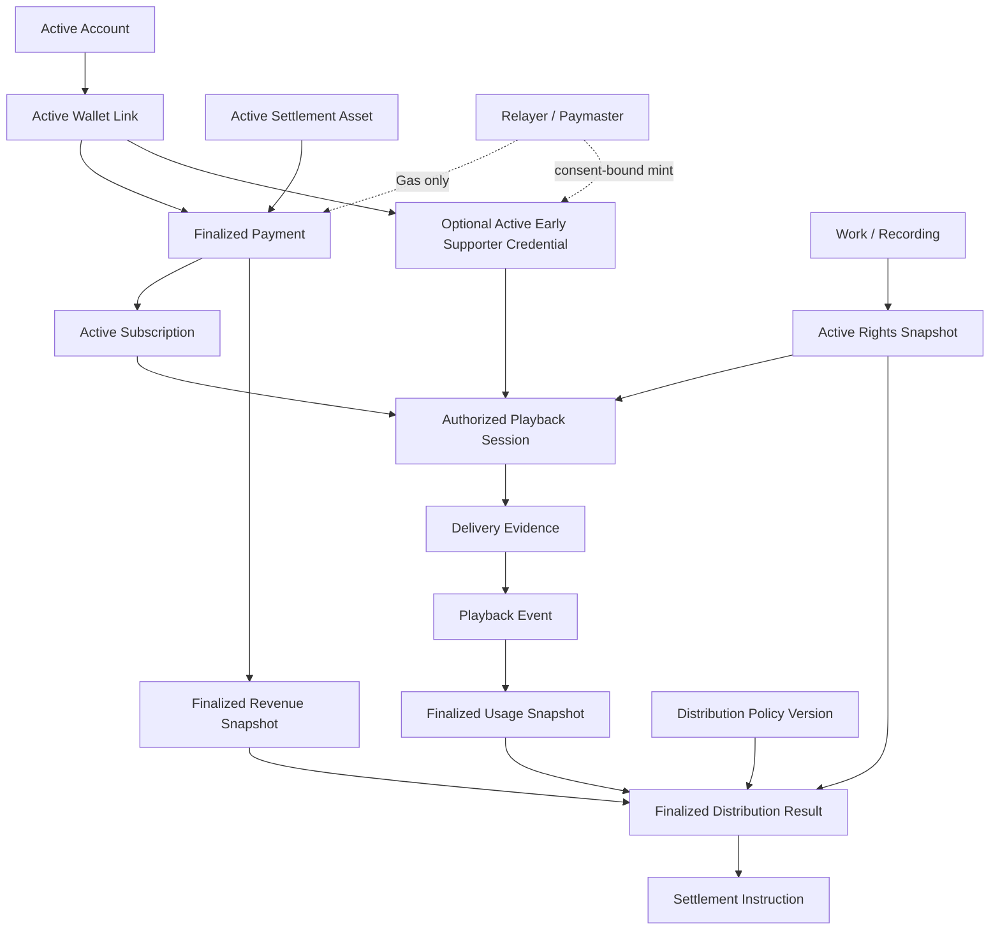

# End-to-End Vertical Slice

現在の10個のDraft Protocol Specificationを、Creator First Platformの最初の検証可能な実装経路として接続します。このページは実装順序と境界を示すものであり、サービス、公開決済、分配またはデプロイ済みSmart Contractが稼働していることを示すものではありません。

::: warning 全体として未成立です
Protocol SpecificationはすべてDraftです。ローカルPlayer、Gateway、合成音源、限定的なSIWE／EIP-712、Test-only Profileに加え、Testnet専用MockJPYC決済とSupporter SBT Contractを部分実装し、Ethereum Sepoliaへデプロイしています。しかしContractはGateway／Indexerと未接続であり、Account lifecycle、Rights／Credential Read Model、Usage集計、分配およびSettlementを結ぶEnd-to-End Vertical Sliceは未成立です。各仕様のOpen Questions、法人・法務・権利・税務・プライバシー・セキュリティ上の承認、本番実装、監査も完了していません。ここに示す`ACTIVE`や`FINALIZED`は仕様上またはMock内の状態名であり、現実の本番サービス状態ではありません。
:::

## 二つの入力経路

利用者のAccount・支払経路と、作品のRights・Usage経路は独立して検証され、Creator Distributionで初めて合流します。

Walletは支払認可手段の一つであり、人間のIdentityやRights Ownershipそのものではありません。Playback EventはClient申告だけで確定せず、Rights Snapshotは利用実績や支払額を決定しません。

## 証拠の連鎖

| Stage | Source Specification | 次へ渡す確定Artifact | 必須状態・条件 |
| --- | --- | --- | --- |
| Account | [SPEC-ACCOUNT-003](/protocol/specs/account-lifecycle) | AccountとSessionのVersion参照 | Accountが対象操作を許す状態で、Sessionが有効 |
| Wallet | [SPEC-ACCOUNT-002](/protocol/specs/wallet-linking) | Link ID、Purpose、Wallet証明 | Linkが`ACTIVE`で、署名Challengeを一度だけ消費 |
| Early Supporter Credential | [SPEC-ACCOUNT-004](/protocol/specs/early-supporter-credential) | Credential Record、Status、Privilege Policy Snapshot | 利用する場合だけ、同意済みCredential、Wallet Link、Scope、Policy、鮮度が有効。SubscriptionとRightsを置換しない |
| Settlement Asset | [SPEC-BLOCKCHAIN-001](/protocol/specs/settlement-asset-registry) | Asset EntryとRegistry Snapshot | 対象Network・用途・環境・時刻で`ACTIVE`。Native Gas Tokenは支払資産ではない |
| Subscription | [SPEC-ACCOUNT-001](/protocol/specs/subscription-settlement) | Payment Reference、Revenue入力、Entitlement | Payment Intentが`FINALIZED`、Subscriptionが`ACTIVE` |
| Rights | [SPEC-RIGHTS-001](/protocol/specs/rights-registry) | ContentごとのRights Snapshot | 必要範囲が`ACTIVE`。紛争・不足範囲を明示 |
| Streaming | [SPEC-STREAMING-001](/protocol/specs/playback-authorization) | Authorization Decision、Playback Session、Delivery Evidence | Subscription・任意のCredential特権・Rights・Plan・地域・期間を固定し、Media Adapterへの迂回経路なし |
| Player | [SPEC-STREAMING-002](/protocol/specs/player-client) | Canonical Catalog Request、Playback Session操作、Support Intent、Client Playback Event | Gateway専用APIだけを使用し、通常再生でWallet署名を要求せず、Client状態を権限またはVerified Usageにしない |
| Usage | [SPEC-USAGE-001](/protocol/specs/playback-verification) | PeriodごとのUsage Snapshot | Snapshotが`FINALIZED`、Event重複なし、Policy Version固定 |
| Distribution | [SPEC-DISTRIBUTION-001](/protocol/specs/creator-distribution) | Distribution Result、Held Allocation、Settlement Instruction | Revenue・Usage・Rights・Policyを固定して`FINALIZED` |

各Artifactは、後から現在状態を問い合わせ直すのではなく、処理時に使用した正確なVersionまたはSnapshotへ結び付けます。

## 最小シナリオ

1. 利用者がAccountを作成し、認証済みSessionを得る。
2. 支払に使用するWalletを、期限付きChallengeと署名検証によってAccountへ関連付ける。
3. 対象Networkの正確なSettlement Asset Entryが、法務・技術・セキュリティ審査を経て`ACTIVE`であることを確認する。
4. Payment Intentを作成し、JPYC等の承認済み資産・額・受取先・期限を固定する。テスト系では無価値の`MockJPYC`だけを使用する。
5. 必要に応じてRelayerまたはPaymasterがGasをスポンサーする。Matching Stablecoin TransferがFinality条件を満たした後だけPaymentを`FINALIZED`、Subscriptionを`ACTIVE`にし、Native FeeまたはRelayer受付を支払として扱わない。
6. WorkとRecordingを分離して登録し、Rights Claim、証憑、審査、Permission、紛争状態を含むRights Snapshotを確定する。
7. Early Supporter限定機能を要求する場合は、同意済みSBT、Wallet Link、Credential Status、Creator ScopeおよびPrivilege Policyの確認済みSnapshotを取得する。確定済みPaymentをQualificationに使う場合は一回限りのPayment Referenceを検証し、Relayer送信後も確定済みMint Eventまで`ACTIVE`にしない。通常再生ではCredentialを必須にしない。
8. PlayerはCanonical Track IDだけでGatewayへ再生を要求し、通常再生ではWallet署名を要求しない。
9. Active Subscription、任意のCredential特権、Rights Snapshot、Plan、地域、期間からAuthorization Decisionと短時間Playback Sessionを作成する。
10. Gatewayだけが非公開Media Adapterへ接続し、Range配信を行ってDelivery Evidenceを生成する。
11. Playback EventをSession、Authorization Decision、Delivery Evidence、Client等の複数Evidenceで検証し、重複を排除する。
12. Distribution Periodを閉じ、Challenge Windowを経てUsage Snapshotを`FINALIZED`にする。
13. 法人会計からRevenue Snapshotを確定し、控除とCreator・Community・Platform等のPoolを明示する。
14. Revenue、Usage、Rights、Distribution Policyの正確なVersionから、整数演算でDistribution Resultを計算する。
15. Rightsが不完全・紛争中の額は受取人を推測せずHeld Allocationに置き、確定済み部分だけをSettlement Instructionへ変換する。

## 失敗時の既定動作

| Failure | 既定動作 | 禁止される代替 |
| --- | --- | --- |
| AccountまたはSessionが無効 | 新しい認可操作を拒否 | Wallet保有だけでAccount認証を代替する |
| Wallet署名が不一致・再利用 | Linkまたは支払認可を拒否 | Addressの提示だけで所有を認める |
| Asset Entryが不明・停止・古い | 新しいPayment Intentを拒否 | Token名やSymbolだけで資産を選ぶ |
| Paymentが未確定・重複 | Entitlementを有効化しない | Callback受信だけで支払済みにする |
| Relayer受付またはNative Gas支払だけが存在 | PaymentとCredentialを未確定のままにする | GasをJPYC支払、資格またはSBT発行成功として扱う |
| Credentialが未発行・失効・古い | 限定特権を拒否する。通常Planの許可は独立評価する | SBT保有だけでSubscriptionまたはRightsを代替する |
| Rights範囲が不明・紛争中 | 対象利用またはAllocationを保留 | UploaderをRights Holderとして全額配分する |
| Playback認可状態が不明・古い | 新規Playback Sessionを拒否 | RPC停止やCache欠損をActiveとみなす |
| Media Adapterが直接要求された | 非公開NetworkとGatewayで拒否 | Navidrome等の内部認証をClientへ渡す |
| Delivery Evidenceが不整合 | Eventを未確定またはRejectedとして保持 | Byte配信やAdapter Play CountだけでValid Usageにする |
| Usage Evidence不足・Oracle停止 | EventまたはPeriodを未確定のまま保留 | 不完全データを推計してFinalizedにする |
| Revenueが未照合 | Distribution Resultを確定しない | 見込み収益を確定額として配分する |
| 計算・Commitment不一致 | Finalizationを中止 | Operator判断で差額を調整する |
| Settlement失敗 | Allocationを保持し、Instructionを冪等に再処理 | 支払失敗をAllocation消滅として扱う |

## End-to-End成立条件

実装がこのVertical Sliceを満たすと主張するには、少なくとも次を同じテスト環境で証明します。

- すべてのArtifactが正確なSpecification、Policy、Schema、Snapshot Versionを参照する
- 同じPayment、Playback Event、Recipient Allocationを再送しても二重有効化・二重算入・二重Instructionが発生しない
- Playback Sessionが別Account、Track、Plan、Rights Version、地域、期間または品質へ拡張されない
- SBTを持たない利用者の通常Plan認可を不当に拒否せず、SBT保有者もSubscriptionまたはRightsを迂回できない
- Credential特権が別Issuer、Creator Scope、Account、Wallet LinkまたはPrivilege Policyへ拡張されない
- Testnetの`MockJPYC`とMainnet JPYCがAsset、Chain、Contractおよび表示で分離され、Test ETHを持たない利用者でもSponsored Flowを完了できる
- Gas Sponsorship、Transaction送信またはRelayer受付だけではSubscriptionもCredentialも有効にならない
- Public NetworkからMedia Adapterへ直接到達できず、偽造Identity Headerと任意Upstream URLが拒否される
- Navidrome AdapterをMock Signed-object Adapterへ交換してもCanonical Track IDとEvidence semanticsが変わらない
- Network停止、RPC不一致、Evidence遅延、Queue重複、Rights紛争、計算失敗を注入してもfail closedになる
- Revenue総額が、控除、各Pool、Recipient、Hold、Carry、Residualへ整数単位で完全に照合される
- 同じ確定入力から独立実装が同じcanonical resultとcommitmentを生成する
- Userの詳細な視聴・支払履歴、個人情報、契約書、税務資料が公開Blockchainや公開ログへ出ない
- Creatorは自分のAllocationをRevenue、Usage、Rights、Hold、Settlement Statusへ遡って説明できる
- 確定後の訂正は旧記録を書き換えず、新Versionと影響範囲を残す
- Open Questionsを実装者が暗黙に決定せず、Decision Recordと仕様更新を先に行う

## 現在の部分実装と未実装範囲

Repositoryには、Vue Player、Node.js Gateway、SQLiteのAuthorization／Delivery Evidence、合成音源File Adapter、任意の明示Mapping型Navidrome Adapter、短命Playback Session、Range、SIWE／EIP-712署名検証、Mock Supporter状態、Alias限定Test-only Profile、およびEthereum SepoliaへデプロイしたTestnet専用MockJPYC／Subscription／Treasury／Supporter SBTがある。ただしPlayerとGatewayは固定Mock Subscription／Rightsと自動生成Demo Principalを使用し、Contract Eventとは未接続である。これらをPlatform Account、本番決済、法的RightsまたはVerified Usageとして扱わない。Test-only Profile登録は認可を変更しない。

Account state machineとAuthenticator、Relayer、Indexer／Read Model、Rights Registry、Playback Event集約、Usage Snapshot、Distribution、Settlement Stub、運用鍵分離、監視、会計連携および本番運用は未実装である。また、Creatorへの実際の送金、源泉徴収、請求書、制裁確認、Wallet変更、失敗回復等を扱うSettlement Executionの詳細仕様は今後必要である。

次に進むには、[Protocol Decision Queue](/protocol/open-questions)のうちMVPを停止している判断を解決し、[Vertical Slice Implementation Plan](/protocol/implementation-plan)に従って小さなTestnet／Mock環境で再現します。
