# 1. ビジョン — Vision

## 1.1 Creator First Platform

Creator First Platform は、音楽を中心とするデジタルコンテンツの流通において、プラットフォーマーの利益最大化を第一目的とするのではなく、**Creatorの権利と持続可能な活動、Userの自由で豊かな利用体験、公正で検証可能なエコシステム**を中心に据えるプラットフォームである。

本プロジェクトが目指すのは、単なる音楽サブスクリプションサービスでも、単なるDAOでも、単なるブロックチェーンアプリケーションでもない。

株式会社が現実社会における法的責任を負いながら、CreatorとUserがプラットフォームのルール形成に参加し、その合意をProtocol Specificationとして明文化し、監査されたSmart Contractによって自動執行する、新しいデジタルプラットフォーム統治モデルを構築する。

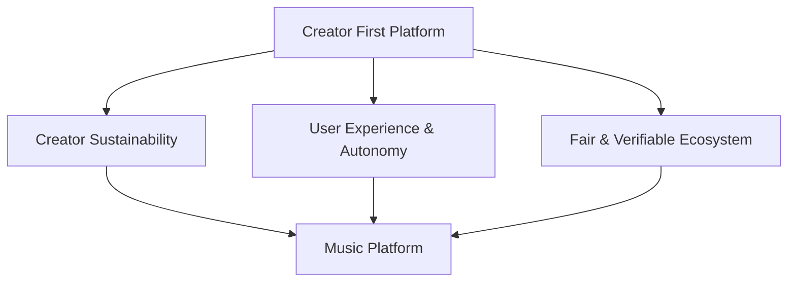

---

## 1.2 なぜCreator Firstなのか

従来のデジタルプラットフォームでは、作品の流通、利用者との接点、推薦、課金、データ、分配ルールがプラットフォーム事業者へ集中しやすい。

その結果、CreatorとUserはサービスの主要な構成主体であるにもかかわらず、プラットフォームのルール形成から切り離されることがある。

Creator First Platformは、この関係を再設計する。

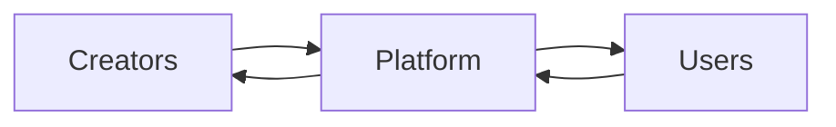

PlatformをCreatorとUserの上位に置くのではなく、両者の活動を支える制度・技術基盤として位置付ける。

---

## 1.3 Creatorの定義

本Whitepaperにおける **Creator** とは、Creator First Platform上で流通する作品またはその創作・制作に実質的に関与し、所定の登録・検証手続きを経た参加者をいう。

音楽の場合には、例えば、

- 作詞者
- 作曲者
- 実演家
- アーティスト
- 音源制作者
- プロデューサー
- その他、作品の創作・制作に実質的に寄与する者

を含み得る。

ただし、

> **Creator と Rights Holder は同一概念ではない。**

Creatorは創作・制作への参加を表すプラットフォーム上の主体概念であり、Rights Holderは著作権、著作隣接権、契約上の利用権その他の法的権利を有する主体である。

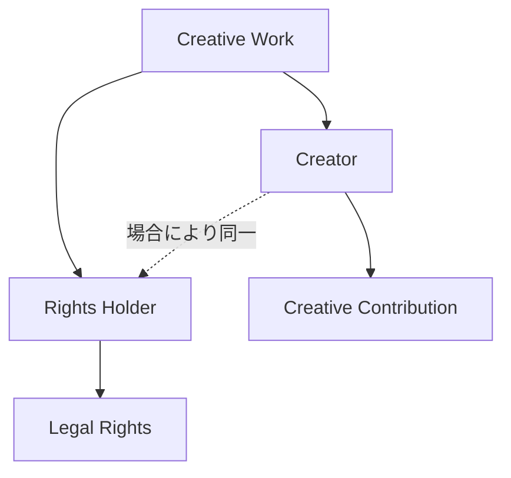

Creator Houseへの参加資格は、単なるアカウント保有ではなく、Creator登録、活動実績、本人性・権利関係等の検証を基礎として定める。

---

## 1.4 Userの定義

本Whitepaperにおける **User** とは、Creator First Platformを利用して音楽その他のコンテンツを聴取、発見、評価、共有、支援その他の方法で利用する者をいう。

Userであることと、Governanceへ直接参加する資格を持つことは区別する。

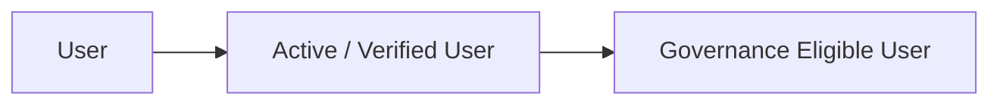

Governance Eligible Userの条件はProtocol Governanceによって定めるが、少なくとも、

- 実際のサービス利用との結び付き
- Sybil Attackへの耐性
- 資本保有量だけに依存しない資格
- プライバシーへの配慮

を満たすものとする。

---

## 1.5 Governance MemberはUserの代表である

User HouseのGovernance Memberは、Userとは別の恒久的な政治階級ではない。

Governance Memberは、

> **Governance Eligible Userの集合から一時的に統治責任を委ねられたUserの代表**

である。

その正統性はPlatform、株式会社、株主、Token保有量からではなく、User Communityから生じる。

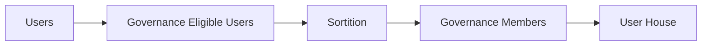

Governance Member自身も原則としてActive Userであり続けることを要求する。

---

## 1.6 抽選による代表

Creator First Platformでは、Creator HouseとUser Houseの構成に**抽選（Sortition）**を重要な方法として導入する。

選挙だけでは、

- 知名度
- 資金力
- 組織力
- 政治活動への時間投入
- コミュニティ内での既存影響力

が代表選出へ過度に影響する可能性がある。

抽選は、通常のCreatorやUserが統治へ参加する機会を制度的に確保する。

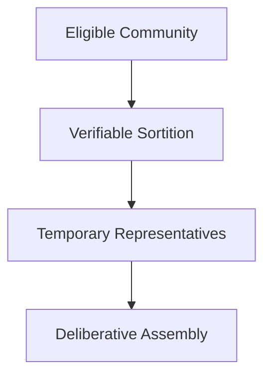

抽選は無条件なランダム選択ではなく、資格確認、任期、辞退、利益相反、地域・利用形態等の代表性を考慮した制度として設計する。

---

## 1.7 主権と代表を分離する

抽選されたGovernance MemberがCreatorやUserに代わって主権そのものを所有するわけではない。

Creator HouseとUser Houseは、日常的なProtocol Governanceを行うための**熟議機関**である。

重要な憲章変更等については、Creator/User Community全体による直接承認を要求できる。

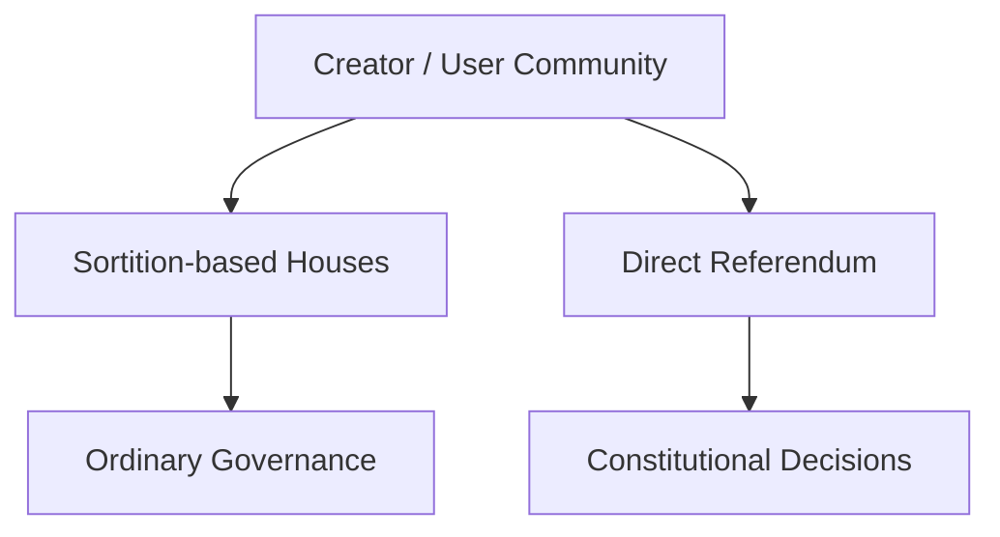

つまり、

> **主権の源泉はCreatorとUserにあり、議会はその統治機能を一時的に委ねられる。**

---

## 1.8 二院制

CreatorとUserは同じPlatformを構成するが、利害は常に一致するとは限らない。

そこで、

- Creator House
- User House

の二院制を採用する。

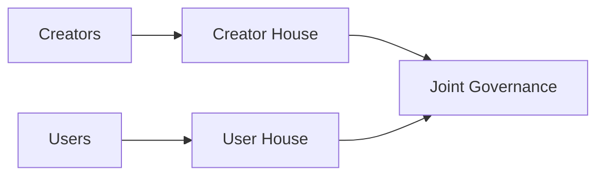

Creator HouseはCreatorの権利、収益、制作環境等を代表し、User Houseは利用体験、プライバシー、発見、コミュニティ等を代表する。

重要なProtocol変更は一方の利益だけで決定しない。

---

## 1.9 Creator/User → 抽選議会 → 熟議

Creator First Platformの統治モデルの中心は次の流れである。

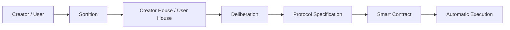

これは単なる投票DAOではない。

CreatorとUserから抽選された代表が情報、影響、代替案を検討し、**熟議によってルールを形成する**。

その結果をProtocol Specificationとして明文化し、実装・テスト・監査を経たSmart Contractへ変換する。

---

## 1.10 Code is Law

Creator First Platformにおける「Code is Law」は、

> プログラムコードが国家法に優越する

という意味ではない。

Creator/Userによって正統に形成されたProtocol Ruleを、Smart Contractが恣意的な運用変更なしに執行することを意味する。

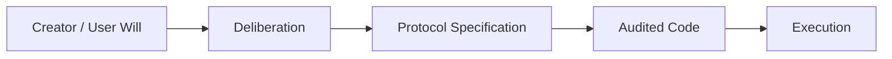

Codeの正統性はコードそのものから生まれるのではない。

**Creator/Userによる統治プロセスから生じる。**

---

## 1.11 3つの憲章

Creator First Platformでは、日常的なGovernanceより上位に、3つの憲章を置く。

### Creator Charter

Creatorの権利、利益、創作の自由、持続可能性を守る。

### User Charter

Userの利用体験、選択、自律性、プライバシー、参加権を守る。

### Ecosystem Charter

透明性、公平性、検証可能性、長期的持続可能性を守る。

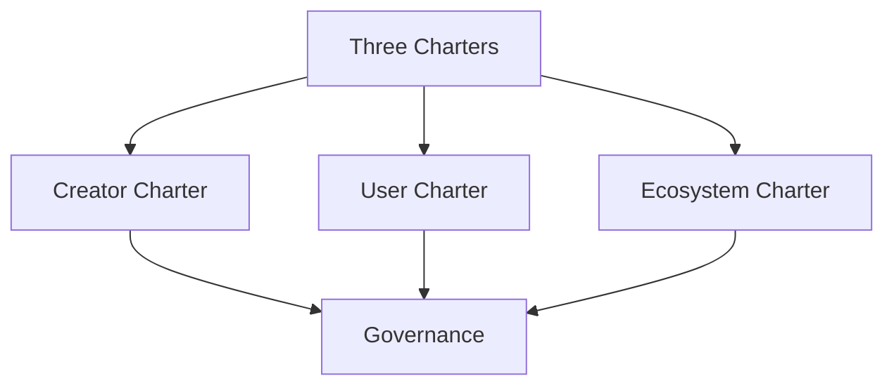

3つの憲章はPlatform内部の最上位規範である。ただし、適用される法令、司法判断、行政規制に優越するものではない。

---

## 1.12 規範の階層

Creator First Platformの規範構造を次のように定義する。

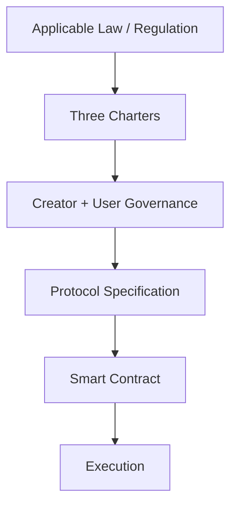

これにより、

> Law > Charters > Governance > Specification > Code

という関係を明確にする。

---

## 1.13 株式会社の役割

Creator First Platformは、DAOが現実社会の法的主体を置き換えるとは考えない。

株式会社は、

- 契約
- 著作権・著作隣接権対応
- 個人情報保護
- 税務・会計
- 雇用
- 決済
- STO
- 規制対応
- 損害賠償その他の法的責任

を負う。

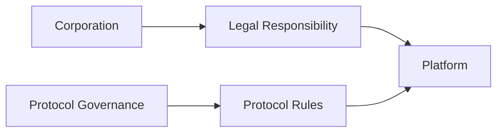

株式会社によるCorporate GovernanceとCreator/UserによるProtocol Governanceは区別する。

---

## 1.14 株式会社は議会の代わりではない

株式会社はProtocol Governanceで決定された政策を自由に拒否できる上位統治者とは位置付けない。

両院で正当に承認されたProtocol Specificationについては、株式会社は原則として実装・執行プロセスを進める。

ただし、

- 違法
- 契約上履行不能
- 重大なセキュリティ危険
- 技術的に安全な実装が不可能

である場合には執行を停止できる。

その場合、

> 理由を公開し、Creator House / User Houseへ差し戻す。

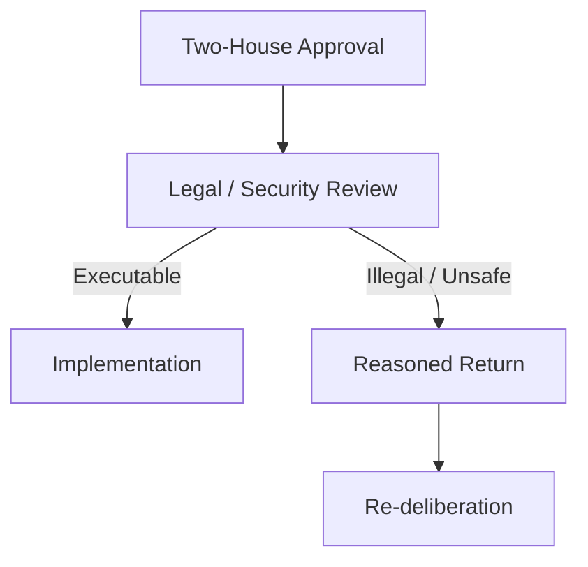

---

## 1.15 株主とProtocol Governance

STOを含む株式保有は株式会社のCorporate Governanceに関係する。

しかし、

> **資本保有量がProtocol Governanceの投票権へ自動的に変換されてはならない。**

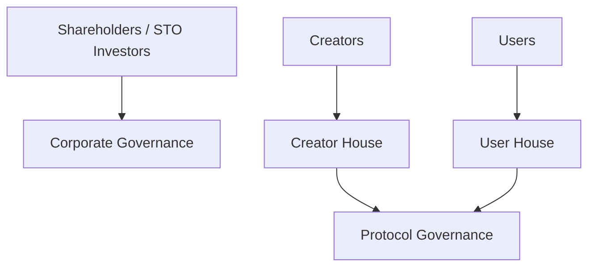

資本とProtocol支配を分離することはCreator Firstの基本原則である。

---

## 1.16 検証可能なPlatform

PlatformはCreator/Userに、

> 「会社を信用してください」

と要求するだけでは不十分である。

Usage、分配、Governance等の重要な処理について、第三者が検証できる仕組みを段階的に導入する。

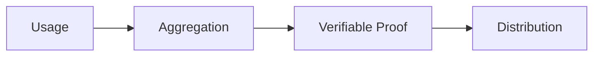

Zero-Knowledge Proofはその実現技術の一つであり、zk-STARKは現時点での有力な候補である。

特定の証明方式そのものを憲章上の目的とはしない。

---

## 1.17 音楽サービスとしての価値

GovernanceやBlockchainは、音楽サービスとしての価値を置き換えない。

Userにとって、

- 速い
- 安定している
- 楽曲を発見できる
- 快適に聴ける

ことが必要である。

Creatorにとって、

- 登録しやすい
- 権利が明確である
- 公正に発見される
- 分配が理解できる
- 持続的に活動できる

ことが必要である。

技術とGovernanceはこれらを実現する手段である。

---

## 1.18 Creator First Platformの社会契約

Creator First Platformへの参加は、単なるサービス利用契約だけではない。

CreatorとUserは、3つの憲章のもとで共通のPlatformを構成し、そのルール形成に参加できる。

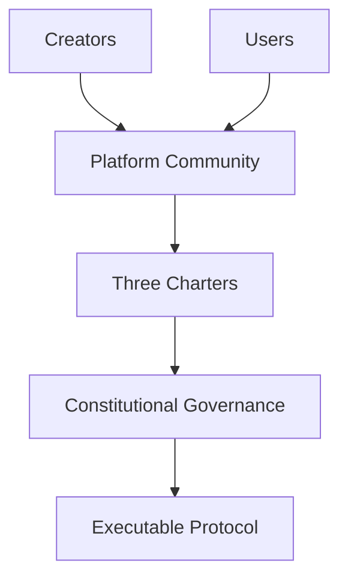

この意味でCreator First Platformは、

> **CreatorとUserが共同で形成するデジタル社会契約を、検証可能なProtocolとして実装する試み**

である。

---

## 1.19 ビジョン

Creator First Platformが目指すのは、

> CreatorがPlatformに従属する世界でも、Userが単なる消費データとして扱われる世界でもない。

CreatorとUserがPlatformの構成主体となり、

> **Creator/User → 抽選議会 → 熟議 → Protocol Specification → Smart Contract → 自動執行**

というプロセスによって、自ら利用するデジタル空間のルールを共同形成する。

株式会社は現実社会で責任を負い、Protocolはそのルールを透明かつ検証可能に執行する。

Creator First Platformは、音楽を出発点として、

> **企業、Creator、User、Codeの関係を再設計するデジタルプラットフォーム**

を目指す。
