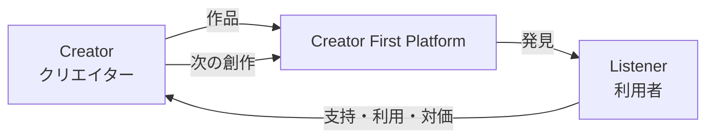
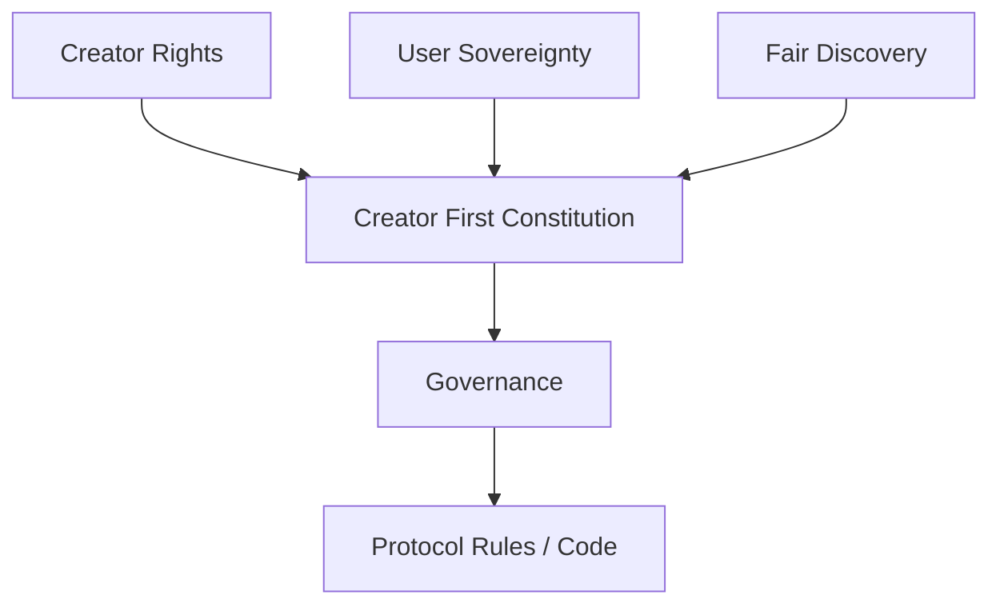
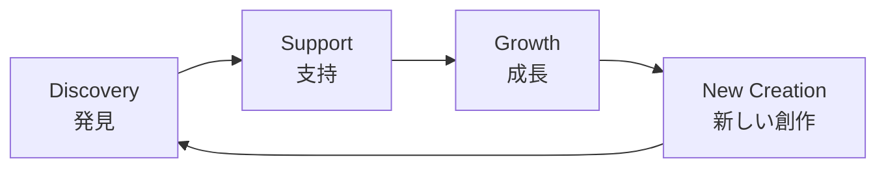
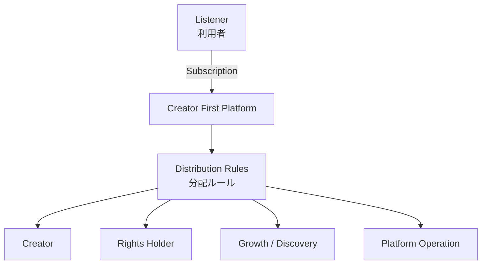
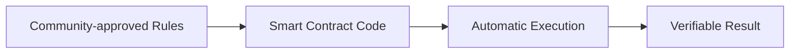
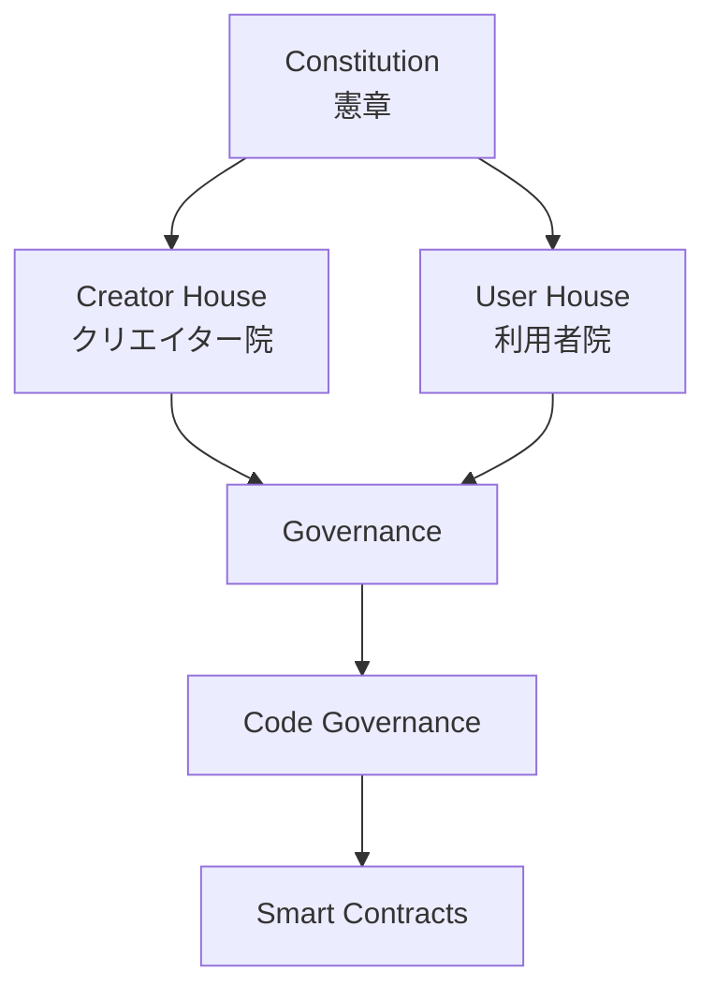
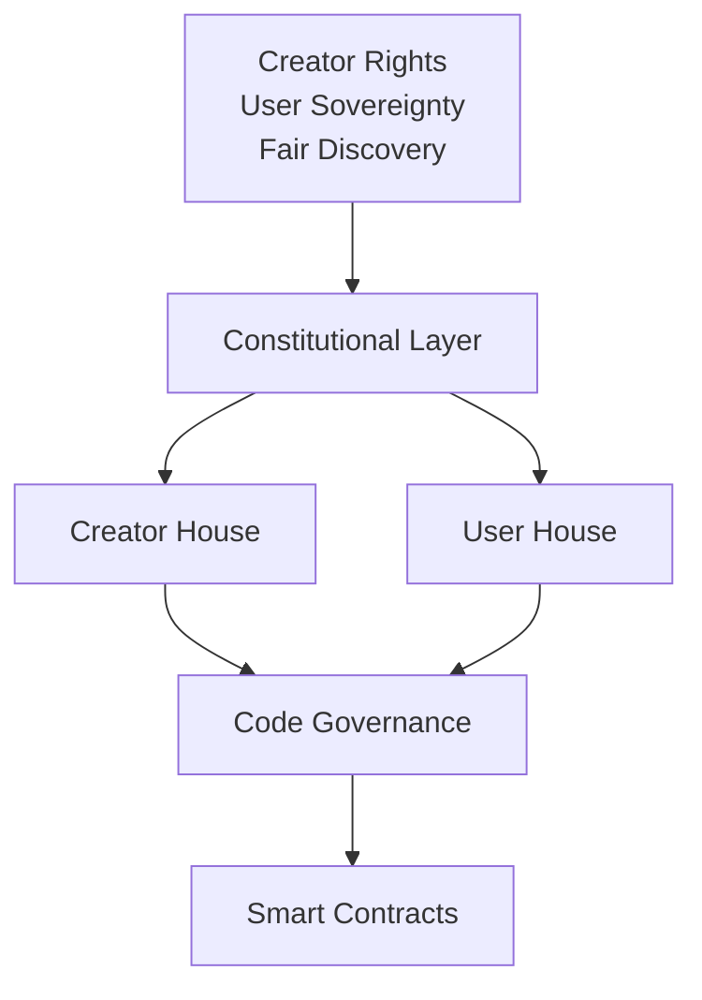
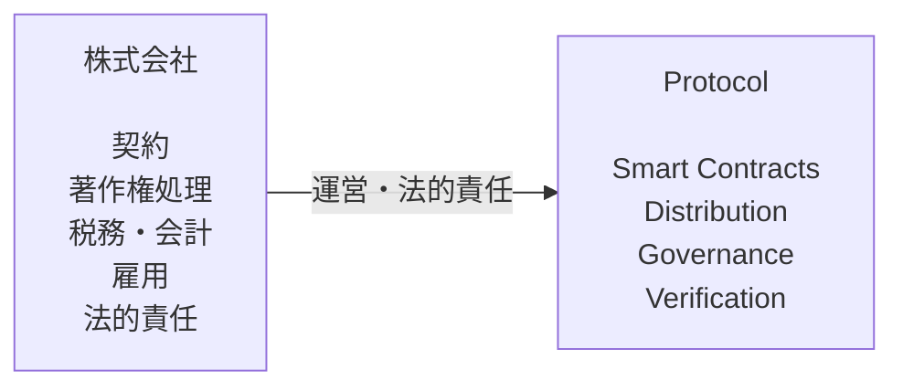
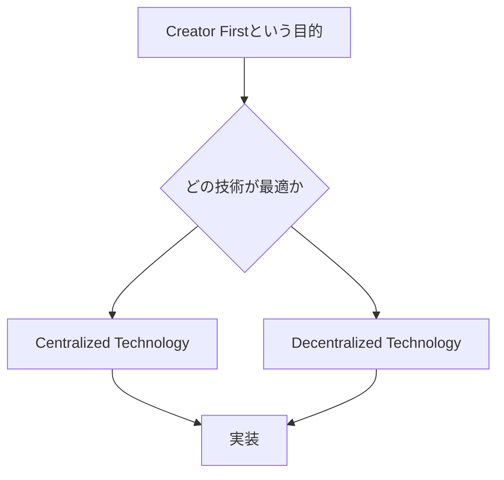
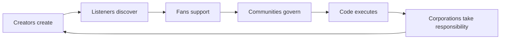

# 1. ビジョン — Creator First Platform

## 1.1 はじめに

音楽ストリーミングは、世界中の音楽へ瞬時にアクセスできる環境を実現し、音楽の流通と消費のあり方を大きく変えた。

しかし、その利便性を支える現在のプラットフォーム構造は、必ずしもクリエイターの持続可能な創作活動を中心に設計されているわけではない。

再生数、推薦アルゴリズム、権利管理、広告、サブスクリプション収入、プラットフォーム手数料など、多数の仕組みを経て価値が分配されるため、利用者が支払った対価が誰に、どのような基準で、どれだけ分配されたのかを理解することは容易ではない。

また、再生実績を中心とした評価は、すでに大きな認知を得ている作品やアーティストへ価値を集中させやすい。

Creator First Platform は、この構造を所与のものとせず、問い直すことから出発する。

> **音楽配信プラットフォームそのものを、クリエイターと利用者のための共通基盤として再設計できないか。**

これが Creator First Platform の出発点である。

---

## 1.2 Creator First

Creator First Platform の中心理念は、その名称が示す通り **Creator First** である。

これは単に「クリエイターへの分配率を高くする」という意味ではない。

プラットフォームの設計、経済モデル、推薦、ガバナンス、技術、権利管理の判断において、クリエイターが持続的に創作できる環境を基本的な設計原則とすることを意味する。

同時に、Creator First は利用者の利益と対立する概念であってはならない。

クリエイターが新しい作品を生み出し、それを利用者が発見し、楽しみ、支持する。その支持が再び創作活動を支える。

Creator First Platform が目指すのは、この循環を持続可能なものにすることである。

---

## 1.3 3つの憲章

Creator First Platform では、プラットフォームの設計と運営が短期的な利益や一時的な多数決によって基本理念から逸脱することを防ぐため、ガバナンスの上位原則として3つの憲章を置く。

### Creator Rights

クリエイターの権利、創作の自由、適正な対価を尊重する。

プラットフォームの成長そのものを目的とするのではなく、その成長がクリエイターの持続可能な活動へ還元されることを求める。

### User Sovereignty

利用者を単なる再生回数や広告価値の源泉として扱わない。

利用者自身の選択、プライバシー、推薦に対する主体性を尊重する。

### Fair Discovery

すでに人気のある作品だけがさらに露出を獲得する自己強化的な推薦構造を避け、多様な作品、新人、独立系クリエイターが発見される機会を確保する。

::: tip 3つの基本原則
**Creator Rights**  
クリエイターの権利と持続可能な創作活動を守る。

**User Sovereignty**  
利用者の選択、プライバシー、主体性を尊重する。

**Fair Discovery**  
知名度だけに依存しない公平な発見機会を提供する。
:::

---

## 1.4 「推し」を発見するプラットフォーム

音楽サービスの価値は、既に知っている音楽を聴けることだけではない。

> **まだ知られていない音楽を発見すること**

にもある。

Creator First Platform では、利用者を単なるコンテンツ消費者としてではなく、クリエイターの成長に参加する存在として捉える。

新人アーティストを発見する。

まだ知られていない曲を聴く。

プレイリストへ追加する。

他の利用者へ紹介する。

クリエイターを継続的に支持する。

そして、自分が早い段階から支持していたクリエイターが、より多くの人に発見されていく。

こうした体験は、日本で「推し活」と呼ばれる文化とも親和性が高い。

ただし、利用者の影響力を単純な人気競争へ変えてしまえば、既存のランキング構造を再生産するだけである。

そのため Creator First Platform では、Creator Rights、User Sovereignty、Fair Discovery の3原則を維持しながら、発見と支援の仕組みを設計する。

---

## 1.5 コードによる透明な分配

Creator First Platform は、サブスクリプション型の音楽配信サービスを想定する。

特徴的なのは、収益分配などの重要なルールを可能な範囲でスマートコントラクトとして表現することである。

誰にどのような基準で価値を分配するのかを、可能な限り検証可能なルールとして表現する。

これは、運営企業が内部ルールを一方的に変更する従来型プラットフォームとは異なる方向性を持つ。

---

## 1.6 Code is Law とコードの統治

スマートコントラクトを利用するだけでは、Creator First は実現しない。

コードを書いた者がルールを決めるのであれば、従来のプラットフォーム運営者をソフトウェア開発者へ置き換えただけだからである。

そこで Creator First Platform では、

> **コードを誰が決めるのか。**

を重要なガバナンス問題として扱う。

スマートコントラクトが経済的なルールを実行するなら、そのコード自体が制度の一部となる。

したがって、

> **Code is Law**

という考え方を採用するためには、

> **Who governs the code?**

という問いに答えなければならない。

Creator First Platform では、クリエイターと利用者がコード統治へ参加する仕組みを構築する。

::: warning Code is Law の意味
Creator First Platform における **Code is Law** は、コードが国家法や契約法より上位にあることを意味しない。

ガバナンスによって承認されたプラットフォーム内のルールを、スマートコントラクトが恣意的な変更なしに実行する、という意味で用いる。
:::

---

## 1.7 二院制ガバナンス

Creator First Platform では、クリエイターと利用者の双方をガバナンスの主体とする。

概念的には、Creator House と User House からなる二院制を想定する。

クリエイターだけでもなく、利用者だけでもなく、双方の合意をコード変更の正当性へ結び付ける。

ただし、多数決そのものが3つの憲章を自由に変更できるわけではない。

憲章は通常のガバナンスより上位に位置する。

ガバナンスの詳細、投票方式、Quadratic Voting 等の採否については、後のガバナンス章で検討する。

---

## 1.8 株式会社とプロトコル

Creator First Platform は、すべてを DAO だけで運営することを想定していない。

音楽配信には、著作権・著作隣接権、クリエイターとの契約、利用者との契約、個人情報、税務、会計、雇用、各国の規制対応など、現実世界で責任主体を必要とする領域が存在する。

そのため、事業運営と法的責任を担う主体として株式会社を置く。

一方、収益分配などの重要なルールについては、スマートコントラクトとガバナンスによって透明性を高める。

つまり、法人と DAO を二者択一として考えるのではなく、

**法人による責任**

と

**プロトコルによる透明性**

を組み合わせる。

---

## 1.9 技術は目的ではない

Creator First Platform では、ブロックチェーン、スマートコントラクト、ゼロ知識証明、ステーブルコインなどの技術利用を検討する。

しかし、これらの技術を使うこと自体を目的とはしない。

技術を採用する基準は、

> **その技術が Creator First という理念の実現に必要か。**

である。

中央集権的な技術の方が安全で合理的な領域では、それを利用する。

分散技術によって透明性や検証可能性を高められる領域では、それを利用する。

Creator First Platform は「分散化の最大化」ではなく、**クリエイターと利用者のための制度を技術によって実装すること**を目的とする。

---

## 1.10 目指すもの

Creator First Platform が目指すのは、もう一つの音楽ストリーミングサービスを作ることだけではない。

目標は、

> **デジタルプラットフォームにおいて、誰がルールを決め、誰が価値を生み、誰に価値が還元されるのかを再設計すること。**

である。

クリエイターが創作する。

利用者が発見する。

ファンが育てる。

コミュニティがルールを決める。

コードがそのルールを透明に実行する。

法人が現実社会に対する責任を負う。

この関係を統合することによって、Creator First Platform は、クリエイター、利用者、技術、企業の新しい関係を構築することを目指す。

---

## Creator First Platform

> **Creators create.**  
> **Listeners discover.**  
> **Communities govern.**  
> **Code executes.**  
> **Corporations take responsibility.**
