# 1. ビジョン

## 1.1 Creator First Platform

Creator First Platform は、音楽を中心とするデジタルコンテンツの流通において、プラットフォーマーの利益最大化を第一目的とするのではなく、**音楽クリエーターの権利と持続可能な活動、ユーザの自由で豊かな利用体験、公正で検証可能なエコシステム**を中心に据えるプラットフォームである。

本プロジェクトが目指すのは、単なる音楽サブスクリプションサービスでも、単なるDAOでも、単なるブロックチェーンアプリケーションでもない。

株式会社が現実社会における法的責任を負いながら、音楽クリエーターとユーザがプラットフォームのルール形成に参加し、その合意をプロトコル仕様として明文化し、監査されたスマートコントラクトによって自動執行する、新しいデジタルプラットフォーム統治モデルを構築する。

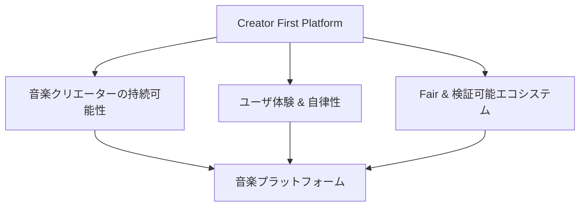

---

## 1.2 なぜ音楽クリエーター中心なのか

従来のデジタルプラットフォームでは、作品の流通、ユーザとの接点、推薦、課金、データ、分配ルールがプラットフォーム事業者へ集中しやすい。

その結果、音楽クリエーターとユーザはサービスの主要な構成主体であるにもかかわらず、プラットフォームのルール形成から切り離されることがある。

Creator First Platformは、この関係を再設計する。

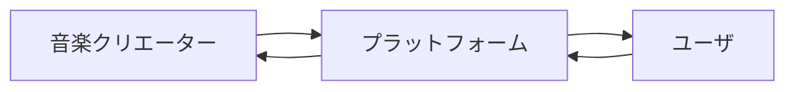

プラットフォームを音楽クリエーターとユーザの上位に置くのではなく、両者の活動を支える制度・技術基盤として位置付ける。

---

## 1.3 音楽クリエーターの定義

本ホワイトペーパーにおける **音楽クリエーター** とは、メジャーレーベルの指揮下に属さない独立系アーティストのうち、作品の制作、流通、マーケティングおよびファンとの関係について、重要な判断をアーティスト本人または本人が統制するチームで行う **アーティストダイレクト型音楽クリエーター** をいう。Creator First Platform上で流通する作品の創作・制作へ実質的に関与し、所定の登録・検証手続きを経ることも必要である。

アーティストダイレクト型であることは、すべての業務を一人で行うことを意味しない。音楽配信代行、著作権管理、出版、制作、宣伝、会計その他の専門サービスを選択して委託しながら、委託先、契約範囲、期間および活動方針を自ら決定できる状態を含む。小規模レーベルやマネジメント会社を利用する場合も、最終的な活動方針をアーティスト側が統制していれば対象になり得る。

音楽の場合には、例えば、

- 作詞者
- 作曲者
- 実演家
- アーティスト
- 音源制作者
- プロデューサー
- その他、作品の創作・制作に実質的に寄与する者

を担う本人またはアーティスト本人が統制するグループを含み得る。ただし、作詞、作曲、実演、制作等へ寄与した者であっても、アーティスト活動の重要判断を担わない場合は、協働者または権利者として尊重されるが、本プロジェクトの中心的な「音楽クリエーター」資格を自動的には得ない。

メジャーレーベルが制作、流通またはマーケティングの主要な意思決定権を持つアーティストは、作品の権利者、実演家、契約当事者またはユーザとして関与し得るが、初期対象であるアーティストダイレクト型音楽クリエーターには含めない。境界事例は、契約名や自己申告だけでなく、実際の決定権、契約上の拘束、原盤・配信許諾の管理範囲および利益相反を確認して判断する。

ただし、

> **音楽クリエーターと権利者は同一概念ではない。**

音楽クリエーターは創作・制作への参加を表すプラットフォーム上の主体概念であり、権利者は著作権、著作隣接権、契約上の利用権その他の法的権利を有する主体である。

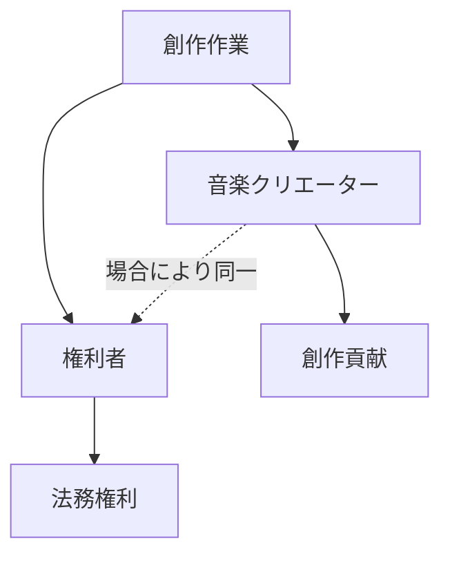

音楽クリエータ院議会への参加資格は、単なるアカウント保有ではなく、アーティストダイレクト型であること、音楽クリエーター登録、活動実績、本人性・権利関係等の検証を基礎として定める。

---

## 1.4 ユーザの定義

本ホワイトペーパーにおける **ユーザ** とは、Creator First Platformを利用して音楽その他のコンテンツを聴取、発見、評価、共有、支援その他の方法で利用する者をいう。

ユーザであることと、ガバナンスへ直接参加する資格を持つことは区別する。

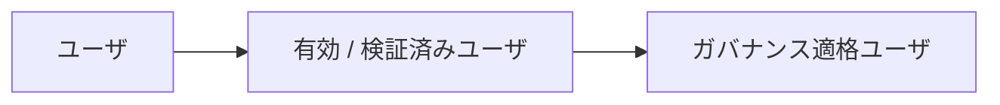

ガバナンス適格ユーザの条件はプロトコルガバナンスによって定めるが、少なくとも、

- 実際のサービス利用との結び付き
- シビル攻撃への耐性
- 資本保有量だけに依存しない資格
- プライバシーへの配慮

を満たすものとする。

---

## 1.5 ガバナンス議員はユーザの代表である

ユーザ院議会のガバナンス議員は、ユーザとは別の恒久的な政治階級ではない。

ガバナンス議員は、

> **ガバナンス適格ユーザの集合から一時的に統治責任を委ねられたユーザの代表**

である。

その正統性はプラットフォーム、株式会社、株主、トークン保有量からではなく、ユーザコミュニティから生じる。

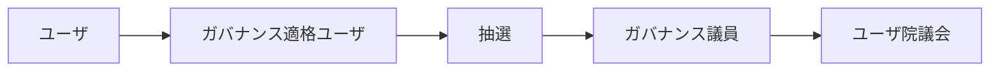

ガバナンス議員自身も原則として有効ユーザであり続けることを要求する。

---

## 1.6 抽選による代表

Creator First Platformでは、音楽クリエータ院議会とユーザ院議会の構成に**抽選（抽選）**を重要な方法として導入する。

選挙だけでは、

- 知名度
- 資金力
- 組織力
- 政治活動への時間投入
- コミュニティ内での既存影響力

が代表選出へ過度に影響する可能性がある。

抽選は、通常の音楽クリエーターやユーザが統治へ参加する機会を制度的に確保する。

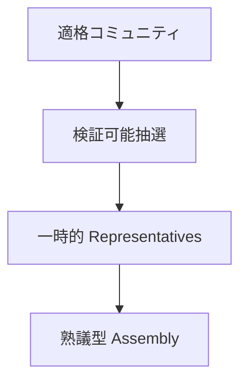

抽選は無条件なランダム選択ではなく、資格確認、任期、辞退、利益相反、地域・利用形態等の代表性を考慮した制度として設計する。

---

## 1.7 主権と代表を分離する

抽選されたガバナンス議員が音楽クリエーターやユーザに代わって主権そのものを所有するわけではない。

音楽クリエータ院議会とユーザ院議会は、日常的なプロトコルガバナンスを行うための**熟議機関**である。

重要な憲章変更等については、音楽クリエーター／ユーザコミュニティ全体による直接承認を要求できる。

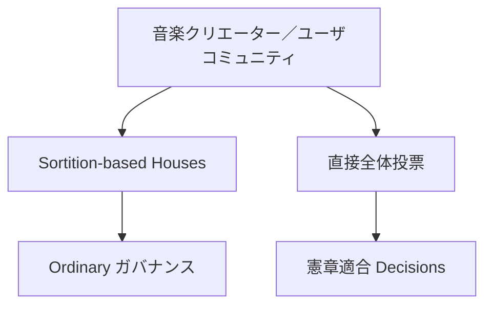

つまり、

> **主権の源泉は音楽クリエーターとユーザにあり、議会はその統治機能を一時的に委ねられる。**

---

## 1.8 二院制

音楽クリエーターとユーザは同じプラットフォームを構成するが、利害は常に一致するとは限らない。

そこで、

- 音楽クリエータ院議会
- ユーザ院議会

の二院制を採用する。

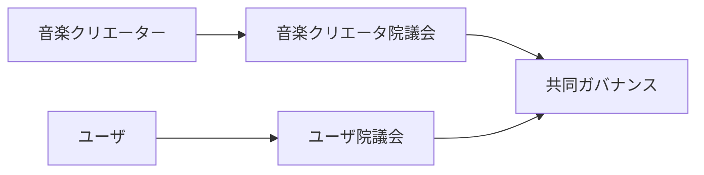

音楽クリエータ院議会は音楽クリエーターの権利、収益、制作環境等を代表し、ユーザ院議会は利用体験、プライバシー、発見、コミュニティ等を代表する。

重要なプロトコル変更は一方の利益だけで決定しない。

---

## 1.9 音楽クリエーター／ユーザ → 抽選議会 → 熟議

Creator First Platformの統治モデルの中心は次の流れである。

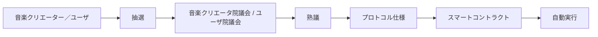

これは単なる投票DAOではない。

音楽クリエーターとユーザから抽選された代表が情報、影響、代替案を検討し、**熟議によってルールを形成する**。

その結果をプロトコル仕様として明文化し、実装・テスト・監査を経たスマートコントラクトへ変換する。

---

## 1.10 コードは法である

Creator First Platformにおける「コードは法である」は、

> プログラムコードが国家法に優越する

という意味ではない。

音楽クリエーター／ユーザによって正統に形成されたプロトコルルールを、スマートコントラクトが恣意的な運用変更なしに執行することを意味する。

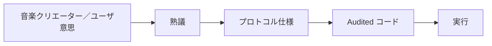

コードの正統性はコードそのものから生まれるのではない。

**音楽クリエーター／ユーザによる統治プロセスから生じる。**

---

## 1.11 3つの憲章

Creator First Platformでは、日常的なガバナンスより上位に、3つの憲章を置く。

### 音楽クリエーター憲章

音楽クリエーターの権利、利益、創作の自由、持続可能性を守る。

### ユーザ憲章

ユーザの利用体験、選択、自律性、プライバシー、参加権を守る。

### エコシステム憲章

透明性、公平性、検証可能性、長期的持続可能性を守る。

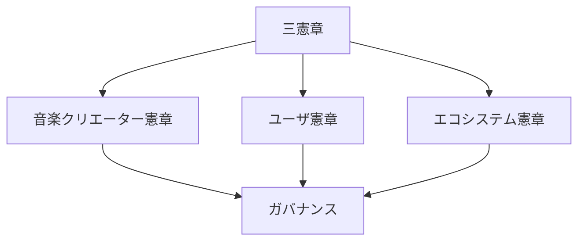

3つの憲章はプラットフォーム内部の最上位規範である。ただし、適用される法令、司法判断、行政規制に優越するものではない。

---

## 1.12 規範の階層

Creator First Platformの規範構造を次のように定義する。

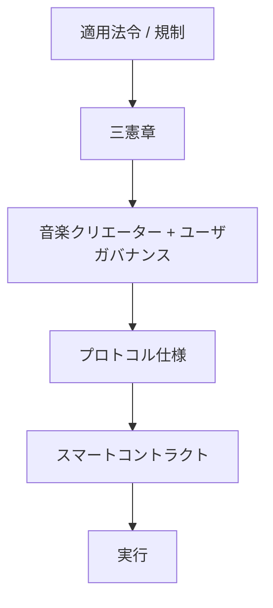

これにより、

> 法令 > Charters > ガバナンス > 仕様 > コード

という関係を明確にする。

---

## 1.13 株式会社の役割

Creator First Platformは、DAOが現実社会の法的主体を置き換えるとは考えない。

株式会社は、

- 契約
- 著作権・著作隣接権対応
- 個人情報保護
- 税務・会計
- 雇用
- 決済
- STO
- 規制対応
- 損害賠償その他の法的責任

を負う。

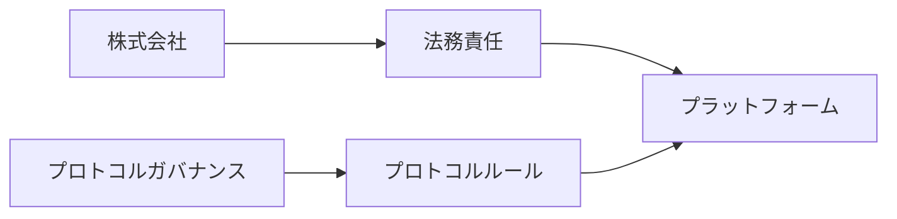

株式会社による法人ガバナンスと音楽クリエーター／ユーザによるプロトコルガバナンスは区別する。

---

## 1.14 株式会社は議会の代わりではない

株式会社はプロトコルガバナンスで決定された政策を自由に拒否できる上位統治者とは位置付けない。

両院で正当に承認されたプロトコル仕様については、株式会社は原則として実装・執行プロセスを進める。

ただし、

- 違法
- 契約上履行不能
- 重大なセキュリティ危険
- 技術的に安全な実装が不可能

である場合には執行を停止できる。

その場合、

> 理由を公開し、音楽クリエータ院議会 / ユーザ院議会へ差し戻す。

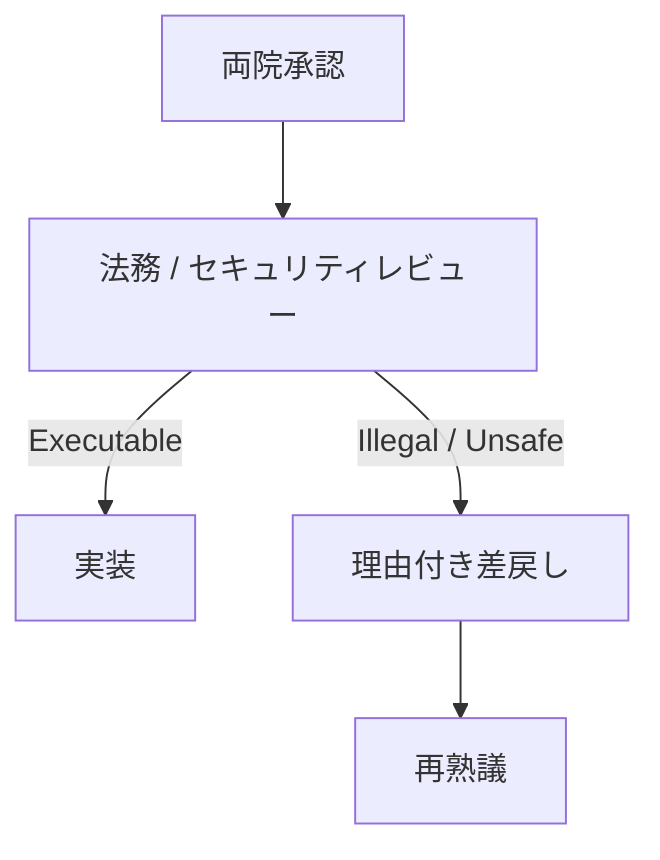

---

## 1.15 株主とプロトコルガバナンス

STOを含む株式保有は株式会社の法人ガバナンスに関係する。

しかし、

> **資本保有量がプロトコルガバナンスの投票権へ自動的に変換されてはならない。**

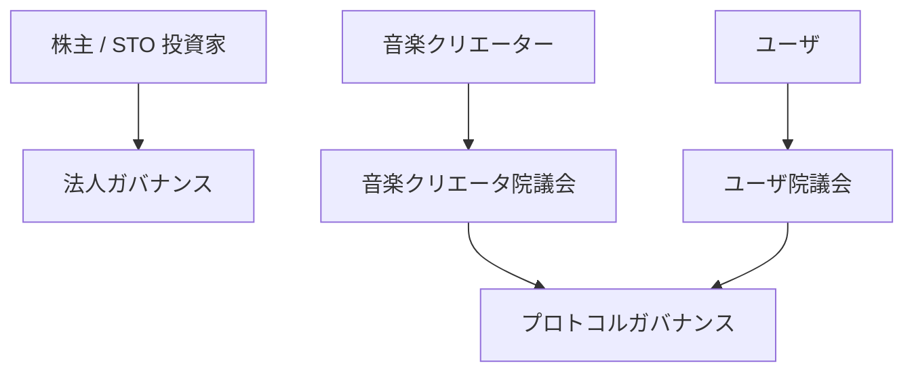

資本とプロトコル支配を分離することは音楽クリエーター中心の基本原則である。

---

## 1.16 検証可能なプラットフォーム

プラットフォームは音楽クリエーター／ユーザに、

> 「会社を信用してください」

と要求するだけでは不十分である。

利用実績、分配、ガバナンス等の重要な処理について、第三者が検証できる仕組みを段階的に導入する。

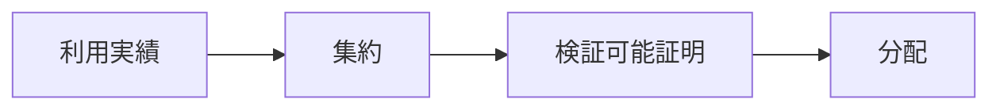

ゼロ知識証明はその実現技術の一つであり、信頼できるセットアップを必要としない**透明型ゼロ知識証明**を優先的な評価対象とする。

特定の証明方式そのものを憲章上の目的とはしない。

---

## 1.17 音楽サービスとしての価値

ガバナンスやブロックチェーンは、音楽サービスとしての価値を置き換えない。

ユーザにとって、

- 速い
- 安定している
- 楽曲を発見できる
- 快適に聴ける

ことが必要である。

音楽クリエーターにとって、

- 登録しやすい
- 権利が明確である
- 公正に発見される
- 分配が理解できる
- 持続的に活動できる

ことが必要である。

技術とガバナンスはこれらを実現する手段である。

---

## 1.18 Creator First Platformの社会契約

Creator First Platformへの参加は、単なるサービス利用契約だけではない。

音楽クリエーターとユーザは、3つの憲章のもとで共通のプラットフォームを構成し、そのルール形成に参加できる。

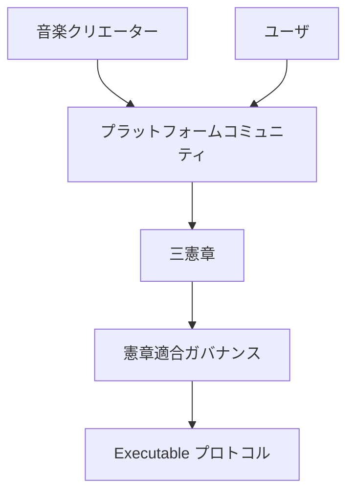

この意味でCreator First Platformは、

> **音楽クリエーターとユーザが共同で形成するデジタル社会契約を、検証可能なプロトコルとして実装する試み**

である。

---

## 1.19 ビジョン

Creator First Platformが目指すのは、

> 音楽クリエーターがプラットフォームに従属する世界でも、ユーザが単なる消費データとして扱われる世界でもない。

音楽クリエーターとユーザがプラットフォームの構成主体となり、

> **音楽クリエーター／ユーザ → 抽選議会 → 熟議 → プロトコル仕様 → スマートコントラクト → 自動執行**

というプロセスによって、自ら利用するデジタル空間のルールを共同形成する。

株式会社は現実社会で責任を負い、プロトコルはそのルールを透明かつ検証可能に執行する。

Creator First Platformは、音楽を出発点として、

> **企業、音楽クリエーター、ユーザ、コードの関係を再設計するデジタルプラットフォーム**

を目指す。
