# 2. 市場と課題 — なぜ Creator First Platform が必要なのか

## 2.1 音楽市場は再び成長している

世界の録音音楽市場は、ストリーミングを中心に再び成長局面に入っている。

IFPI の *Global Music Report 2026* によれば、2025年の世界の録音音楽売上は **317億米ドル**に達し、前年比 **6.4%** 増となった。成長は11年連続で、ストリーミング収入は **220億米ドル**、録音音楽収入全体の **69.6%** を占める。

有料サブスクリプション型ストリーミングだけでも世界市場の **52.4%** を占め、サブスクリプションアカウントのユーザ数は **8億3,700万人**に達している。

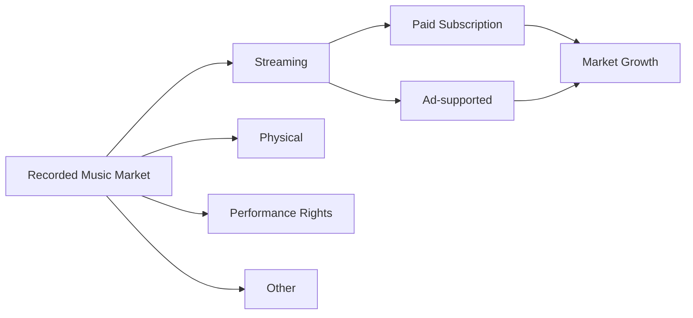

ストリーミングは、音楽産業にとって周辺的な販売経路ではなく、すでに中心的なインフラである。

Creator First Platform は、成長しているストリーミング市場そのものを否定するのではない。

むしろ、

> **ストリーミングによって生まれた巨大な価値を、誰が、どのようなルールで分配するのか。**

という次の問題に焦点を当てる。

---

## 2.2 日本市場でもストリーミングは主要な収益源になった

日本レコード協会によれば、2025年の国内音楽ソフト・音楽配信市場は推計 **3,988億円**であった。

このうち、

- ストリーミング／サブスクリプション：約 **1,377億円**
- ストリーミング／広告収入：約 **202億円**
- ダウンロード：約 **114億円**

となっている。

一方、日本ではCDなどのフィジカル市場も依然として大きく、ストリーミングへ完全に置き換わった市場ではない。

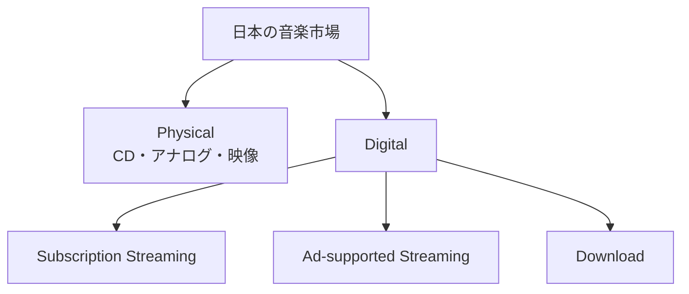

この市場構造は、Creator First Platform にとって重要である。

目標は既存の音楽文化や流通経路を破壊することではなく、デジタル配信領域において、より透明で持続可能な選択肢を追加することである。

---

## 2.3 ストリーミングが解決した問題

現在のストリーミングサービスは、音楽産業の多くの問題を実際に解決してきた。

ユーザは、個々の楽曲やアルバムを購入しなくても、大量の音楽へ合法的かつ即時にアクセスできるようになった。

音楽クリエーターにとっても、物理媒体の製造や店舗流通を経ず、世界中のユーザへ作品を届けることが可能になった。

### ストリーミングがもたらした価値

- 世界規模の音楽アクセス
- 定額制による利用の簡便化
- 違法コピーへの実用的な代替手段
- 新人や独立系音楽クリエーターのグローバル配信
- 利用履歴を利用した音楽発見
- 継続的な収益機会
- 物理的な在庫や流通コストの削減

したがって Creator First Platform の問題意識は、

> **「ストリーミングは失敗した」というものではない。**

むしろ、

> **ストリーミングが成功したからこそ、その次の制度設計が必要になった。**

という立場を取る。

---

## 2.4 課題1 — ユーザが支払った価値の流れが見えにくい

一般的なストリーミングサービスでは、ユーザは月額料金を支払う。

しかし、そのユーザが支払った料金が、自分が聴いた音楽クリエーターへそのまま配分されるとは限らない。

サービス全体の売上や再生シェア、権利関係、契約条件などを経て、複数の権利者へ分配される。

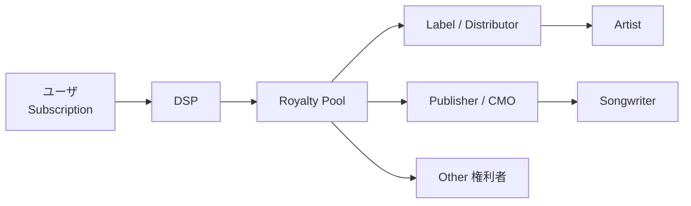

ユーザの視点では、

**自分の支払い**

と

**自分が支持した音楽クリエーターへの還元**

との関係が分かりにくい。

音楽クリエーターの視点でも、最終的な収益が複数の契約関係を経由するため、プラットフォーム上の利用実績と受取額の関係を理解することは容易ではない。

::: info Creator First Platform の問題設定
問題は「中間事業者が存在すること」そのものではない。

著作権管理、配信、マーケティング、制作支援などには実際の機能とコストが存在する。

Creator First Platform が問題とするのは、**価値の流れと分配ルールがユーザや音楽クリエーターから見えにくいこと**である。
:::

---

## 2.5 課題2 — 再生シェア中心の分配は人気集中を強化し得る

多くのストリーミングサービスでは、一定期間の総収益からロイヤリティプールを形成し、全体の再生シェアなどに基づいて権利者へ配分する方式が使われている。

この方式は大規模サービスに適しており、単純で効率的である。

しかし、再生数が中心的な指標になる場合、

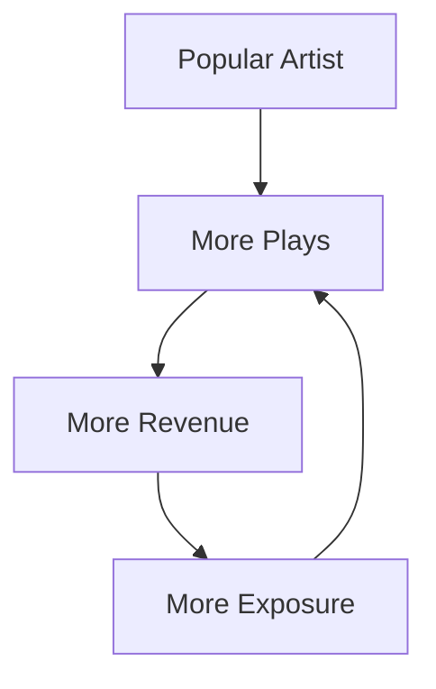

という自己強化ループが生じやすい。

人気があること自体が問題なのではない。

問題は、

> **すでに知られていることが、さらに発見されるための最大の条件になる**

場合である。

この構造では、新人、ローカルアーティスト、ニッチジャンル、実験的な作品などが、作品の質とは別の理由で発見機会を失う可能性がある。

Creator First Platform では、通常の利用報酬とは別に、Growth Pool や Discovery の仕組みを設けることで、この集中を補正できないかを検討する。

---

## 2.6 課題3 — 推薦アルゴリズムが市場そのものを形成する

音楽配信プラットフォームは、単なる「楽曲の倉庫」ではない。

検索、ランキング、プレイリスト、レコメンドによって、

> **何が聴かれるか**

そのものに大きな影響を与える。

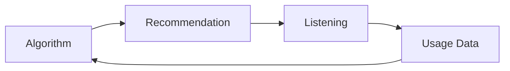

推薦アルゴリズムが利用履歴を学習し、その結果を再び推薦へ使うと、フィードバックループが形成される。

この仕組みはユーザに便利である一方、透明性が低い場合には、

- 人気作品への集中
- 特定ジャンルへの偏り
- 新人の発見機会低下
- プラットフォームの商業的判断による露出差
- ユーザ自身の選択範囲の縮小

につながる可能性がある。

Creator First Platform では、推薦を単一アルゴリズムに固定せず、

- For You
- Discovery
- 新人音楽クリエーター
- Deep Dive
- Following

など、目的の異なる発見モードをユーザが選択できる設計を検討する。

---

## 2.7 課題4 — 「誰がルールを決めるのか」が見えにくい

従来型プラットフォームでは、利用規約、手数料、推薦、収益分配、API、アカウント制限などのルールを、基本的にはプラットフォーム運営企業が決定する。

企業がサービスを運営する以上、一定の中央集権的判断は必要である。

しかし、そのルールが音楽クリエーターの収益や発見可能性そのものを左右する場合、

> **プラットフォーム運営者だけがルール変更権を持つことは適切なのか**

という問題が生じる。

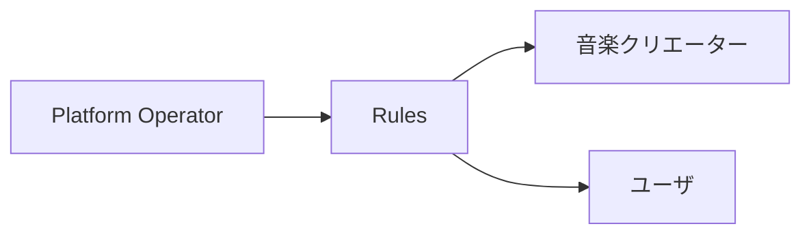

Creator First Platform は、この関係を次のように変えることを目指す。

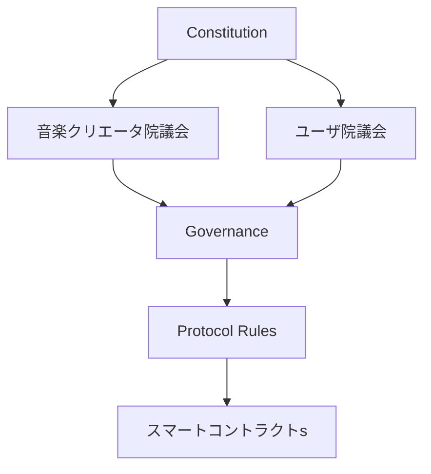

すべての運営判断をDAOへ移すことが目的ではない。

経営、法令遵守、契約、雇用、税務などは法人が責任を持つ。

一方で、収益分配やプロトコルの重要ルールについては、音楽クリエーターとユーザが参加できる制度を設ける。

---

## 2.8 課題5 — 利用データの検証とプライバシー

音楽配信において、再生実績は経済価値を持つ。

再生実績が収益分配に使われる以上、

- 本当に再生されたのか
- ボットではないか
- 同一ユーザによる不正再生ではないか
- 集計データが正しく処理されたか

を検証する必要がある。

一方で、検証可能性を高めるためにユーザの詳細な行動履歴を公開すれば、プライバシーを損なう。

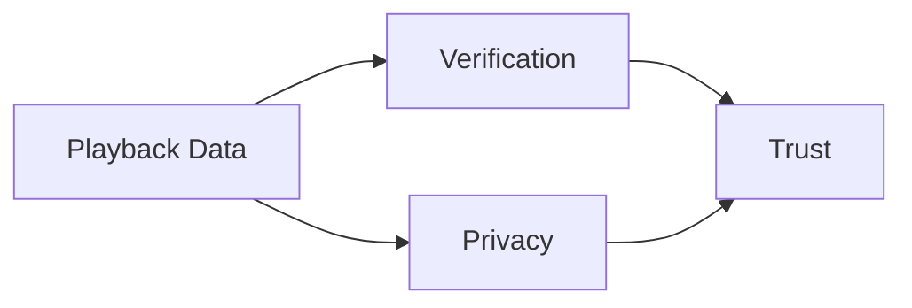

ここには、

> **検証可能性とプライバシーを同時に成立させる**

という技術的課題が存在する。

Creator First Platform では、ゼロ知識証明などを利用し、ユーザの詳細な履歴を公開せずに、分配に必要な利用実績を検証できる Usage Oracle の設計を検討する。

---

## 2.9 課題6 — ストリーミング不正とAI時代のコンテンツ量

ストリーミング市場が成長するほど、再生回数そのものに経済価値が生まれる。

その結果、

- ボットによる再生
- 再生数の人工的な増幅
- 不正アカウント
- 大量コンテンツ投入
- 権利関係が不明なコンテンツ

などへの対策が重要になる。

IFPI も、2026年の市場報告においてストリーミング不正を業界全体で対処すべき重要課題として位置付けている。

生成AIによって楽曲制作のコストが下がれば、供給されるコンテンツ量はさらに増加する可能性がある。

そのときプラットフォームには、

> **作品数を増やすこと**

ではなく、

> **正当な権利を持つ作品と、価値ある発見をどう支えるか**

という役割がより強く求められる。

---

## 2.10 課題7 — 音楽クリエーター支援を「再生後の報酬」だけで考えない

従来のストリーミング経済では、

**再生された後に報酬が発生する**

という考え方が中心である。

しかし、新しい音楽クリエーターほど、

- 録音
- ミキシング
- マスタリング
- ジャケット制作
- プロモーション
- ライブ活動

など、発見される前の段階で資金を必要とする。

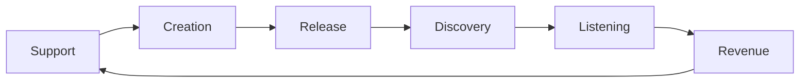

Creator First Platform では、再生報酬だけではなく、

- Growth Pool
- Quadratic Funding
- Early Support
- Community Contribution

などを組み合わせることで、発見前・成長途中の音楽クリエーターも支援できる経済モデルを検討する。

---

## 2.11 Creator First Platform が解こうとする構造

以上の課題は、それぞれ独立しているわけではない。

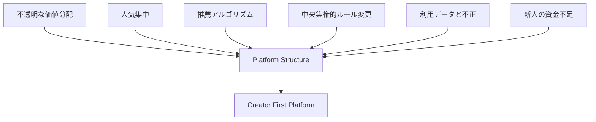

中心にあるのは、

> **プラットフォームが価値の流れ、発見、ルールを同時に支配する構造**

である。

Creator First Platform は、この構造を単純に分散化することを目指さない。

代わりに、

1. **音楽クリエーターの権利を守る**
2. **ユーザの主体性を守る**
3. **発見機会を公平にする**
4. **価値の流れを検証可能にする**
5. **重要なルールの決定に当事者を参加させる**
6. **法人が現実社会での責任を負う**

という複数の仕組みを組み合わせる。

---

## 2.12 市場機会

Creator First Platform が対象とする市場機会は、単に「Spotifyの代替サービス」という意味ではない。

世界のストリーミング市場がすでに巨大な規模へ成長したことで、

> **次の競争軸は曲数やアクセス可能性だけではなく、制度そのものになり得る。**

と考える。

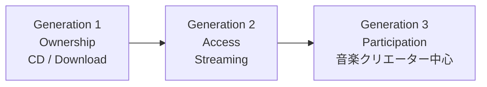

第一世代では音楽を「所有」した。

第二世代では音楽へ「アクセス」するようになった。

Creator First Platform が目指す第三世代では、

**音楽クリエーター、ユーザ、コミュニティが、価値分配と発見とルール形成へ参加する。**

それが本プロジェクトの考える市場機会である。

---

## 2.13 本章のまとめ

ストリーミングは音楽市場を再成長させ、世界規模のアクセスを実現した。

Creator First Platform は、その成果を否定するものではない。

しかし、市場が成熟した現在、次の問いが重要になる。

> **誰が価値を生み出しているのか。**

> **誰がルールを決めているのか。**

> **誰が発見されるのか。**

> **ユーザが支払った価値は誰へ還元されるのか。**

> **その仕組みを当事者自身が検証し、変更に参加できるのか。**

Creator First Platform は、この問いに対する新しい制度設計を提案する。

---

## 参考資料

- IFPI, *Global Music Report 2026 — State of the Industry*, 2026.
- 一般社団法人 日本レコード協会, 「2025年国内レコード市場（音楽ソフト＋音楽配信）は3,988億円と推計」, 2026.
- Spotify, *Loud & Clear — Music Economics and Royalty Data*.
