# 3. 権利と資金 — Rights & Money Flow

## 3.1 本章の目的

Creator First Platform は、音楽配信をスマートコントラクトで実装するだけのサービスではない。

音楽には、楽曲そのものに関する権利、録音された音源に関する権利、実演家の権利、契約上の権利など、複数の権利関係が存在する。また、ユーザが支払うサブスクリプション料金から音楽クリエーターが報酬を受け取るまでには、権利処理、決済、会計、税務、分配など複数の処理が必要になる。

したがって Creator First Platform では、

> **法的な権利関係をスマートコントラクトへ置き換えるのではなく、法的権利を法人が責任を持って管理し、その合意内容に基づく経済的処理をコードによって透明化する。**

という構造を採用する。

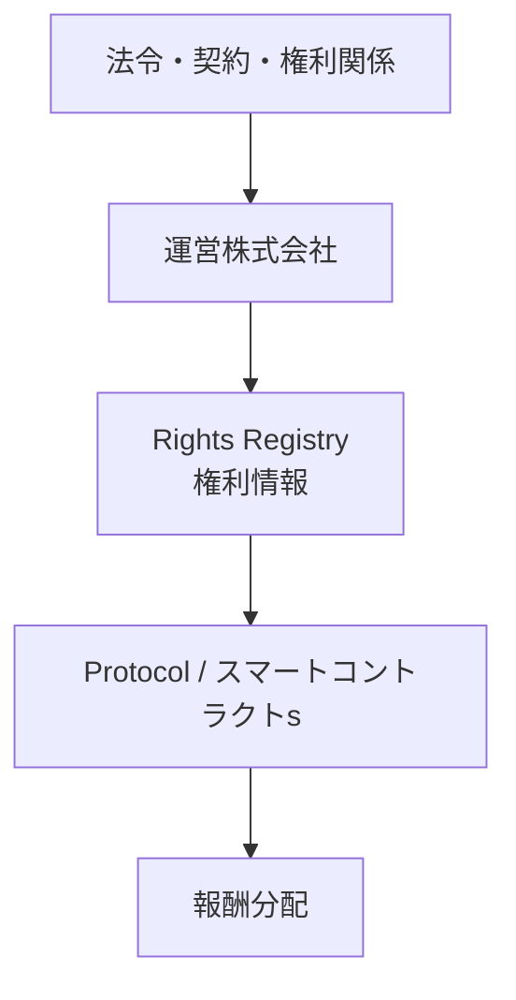

---

## 3.2 音楽には複数の権利が存在する

「1曲」の背後には、単一の権利だけが存在するわけではない。基本設計では、少なくとも **楽曲（Composition）** と **音源（Sound Recording / Master）** を区別する。

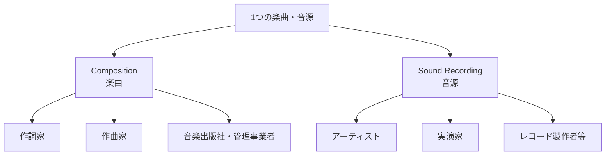

同一人物が複数の立場を兼ねる場合もある。独立系ミュージシャンが自ら作詞・作曲・演奏・録音制作を行い、マスターを保有するケースはその典型である。

Creator First Platform は、独立系音楽クリエーターが参加しやすい仕組みを目指す一方、権利関係そのものを曖昧にはしない。

---

## 3.3 権利はオンチェーンで「発生」するのではない

ブロックチェーンへの登録によって著作権が発生するわけではない。

著作権その他の権利は、法制度、創作・実演・制作の事実、契約、権利移転などによって成立する。ブロックチェーンやスマートコントラクトは、権利そのものの代替ではなく、権利情報や契約状態を参照して経済的処理を実行・検証するレイヤーとして利用する。

主な役割は次のとおりである。

- 権利情報の参照
- 登録・変更履歴の記録
- 契約状態の参照
- 分配条件の実行
- 分配履歴の検証
- ガバナンスによるルール変更履歴の記録

::: warning オンチェーン登録と法的権利
NFT、トークン、スマートコントラクト、ブロックチェーン上の記録そのものを、著作権や著作隣接権と同一視しない。

**Rights before Code** を基本原則とする。
:::

---

## 3.4 運営株式会社の役割

Creator First Platform の事業運営と現実社会における法的責任は、運営株式会社が担う。

- 音楽クリエーターとの利用・配信契約
- ユーザとのサービス契約
- 権利者情報・配信許諾の確認
- 著作権・著作隣接権等の処理
- 権利侵害申立てへの対応
- 決済事業者等との契約
- 会計・税務処理
- 個人情報保護
- 不正利用への対応
- 法令・規制への対応

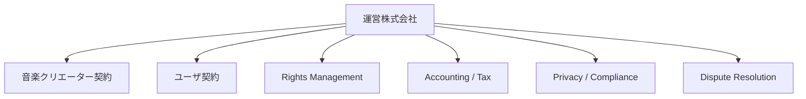

スマートコントラクトの存在によって株式会社の責任が消滅するわけではない。

> **法人が責任主体となり、コードが透明な実行主体となる。**

---

## 3.5 Rights Registry

各楽曲について、分配に必要な権利情報を **Rights Registry** として管理する。

想定する情報には、楽曲ID、音源ID、作品名、アーティスト、作詞・作曲者、マスター権利者、出版・管理情報、分配先、分配比率、契約状態、権利確認状態、対象地域、有効期間、外部識別子などが含まれる。

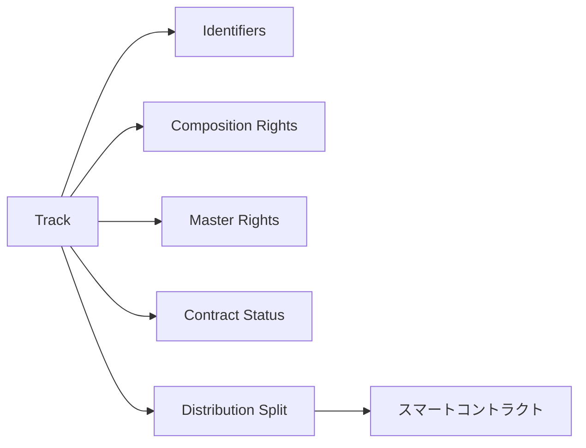

個人情報や契約書全文をパブリックチェーンへ記録することは想定しない。公開情報、ハッシュ等で整合性を証明する情報、法人内部で安全に管理する情報を分離する。

---

## 3.6 既存の権利管理制度との接続

Creator First Platform は、既存の著作権管理制度を排除して独自制度へ置き換えることを目的としない。

日本では、楽曲や契約によって JASRAC、NexTone、音楽出版社、レコード会社、ディストリビューターその他の主体が関与し得る。

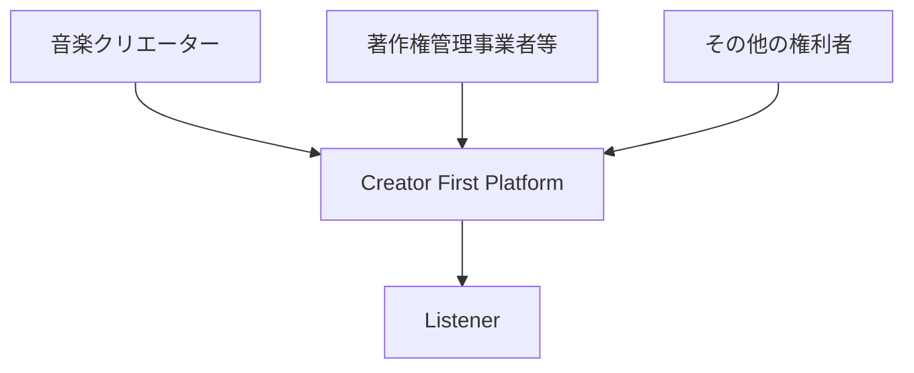

独自性は、

> **既存の法的権利管理と、透明なデジタル分配プロトコルを接続すること**

にある。

---

## 3.7 独立系音楽クリエーターの場合

自ら楽曲と音源の主要な権利を管理する独立系ミュージシャンの場合、関係は比較的単純になる。

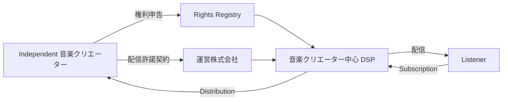

登録から報酬受領までは、本人確認、権利申告、配信許諾契約、楽曲登録、Rights Registry 登録、配信、利用実績集計、報酬分配という流れを想定する。

詳細は第5章「音楽クリエーター登録」で扱う。

---

## 3.8 ユーザから音楽クリエーターへの資金の流れ

ユーザは、JPYC等の`Approved Settlement Asset Registry`で承認された法定通貨連動型ステーブルコインにより、Creator First Platformへサブスクリプション料金を支払う。ETH等の価格変動するネイティブトークンをSubscription Priceとして受け付けない。

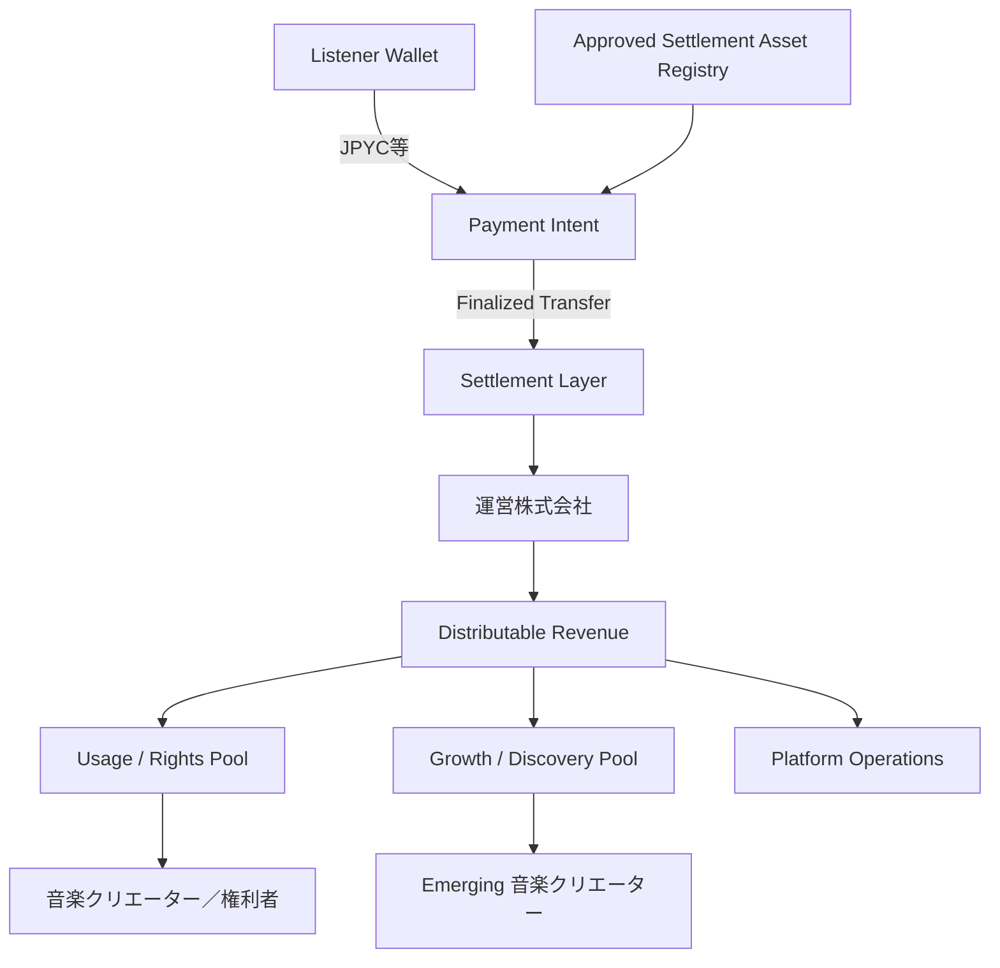

実際には税、決済手数料、権利処理費用、契約上の支払いなどが存在する。

したがって重要なのは、ユーザの支払額全額を機械的に分配することではなく、

> **何を控除し、分配可能額をどのルールで配分するかを透明にすること**

である。

---

## 3.9 ステーブルコイン決済とネットワーク手数料

サブスクリプションのオンチェーン決済経路では、JPYC等の承認済みステーブルコインを支払資産とする。ユーザが認識する料金表示、Payment Intent、領収・会計記録およびSubscription有効化の根拠は、すべて同じ承認済みSettlement Assetと整数額へ結び付ける。

一方、Transaction実行に必要なETH等のネイティブトークンはネットワーク手数料であり、サブスクリプション料金ではない。一般ユーザへGas Tokenの取得を要求せず、Relayer、PaymasterまたはSmart Accountにより手数料を抽象化する。誰がGasを負担した場合でも、支払済みSubscriptionとして認識するのはJPYC等の一致するTransferがFinality条件を満たした場合だけとする。

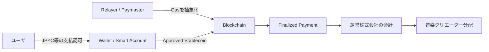

::: info 支払資産とGasを分離する
Creator First Platform の価値は、価格変動する暗号資産で音楽料金を払うことではない。

**JPYC等で表示・確定するサービス料金**、**ネイティブトークンで精算されるネットワーク手数料**、**分配ルールの透明性・検証可能性**を別の概念として設計する。
:::

---

## 3.10 サブスクリプション収入の法的・会計的性質

ユーザから受け取った料金を、単純に「DAOの資金」や「スマートコントラクトの資金」と考えることはできない。

法的位置付けは、契約構造、決済方法、資金の保有方法、払戻しの有無、ステーブルコインの利用方法、第三者への送金方法、国内外の規制などによって変わり得る。

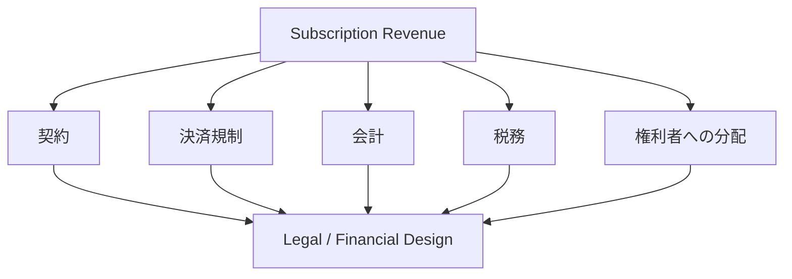

ホワイトペーパー段階では特定の法的分類を技術設計だけから断定せず、サービス開始時の法制度と具体的な資金フローに基づいて確定する。

---

## 3.11 分配モデル

すべての収益を単純な再生回数だけで配分する方式は採用しない。

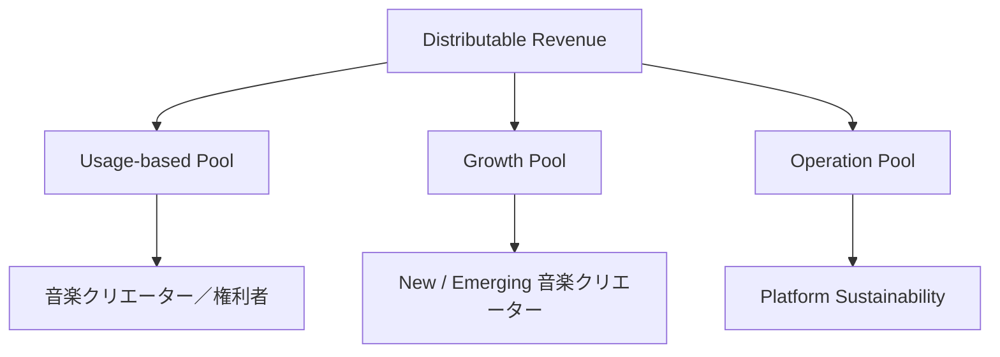

**Usage-based Pool** は実際の音楽利用と権利関係に基づく基本分配を担う。

**Growth Pool** は新人、独立系音楽クリエーター、まだ十分に発見されていない作品などの成長機会を支援する。

**Operation Pool** はインフラ、開発、権利処理、セキュリティ、法務、サポートなど、サービスを持続させるために利用する。

具体的な比率は第6章「経済モデル」とガバナンス設計で詳細化する。

---

## 3.12 「推し」と資金分配

ユーザが「誰を支持しているか」を経済モデルへ一定程度反映する仕組みも検討する。

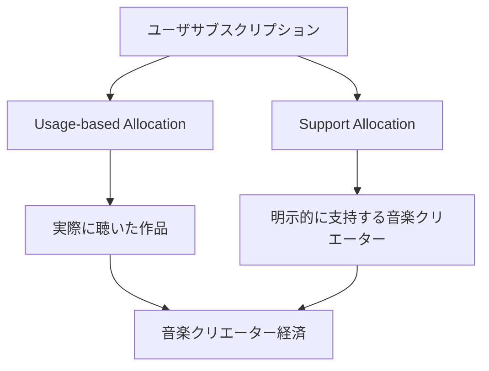

ただし、単純な人気投票では有名アーティストへの集中を再生産し得る。

そのため Growth Pool、Quadratic Funding、発見時期などの要素を組み合わせ、**人気と支援機会を同一視しない**設計を検討する。

---

## 3.13 スマートコントラクトが担う範囲

スマートコントラクトは、分配ルール、分配計算、権利者への支払い、Growth Pool、ガバナンス承認済みパラメータ、分配履歴、監査可能性などを担う。

一方、契約の有効性、本人確認、権利紛争、税務判断などはスマートコントラクトだけでは処理しない。

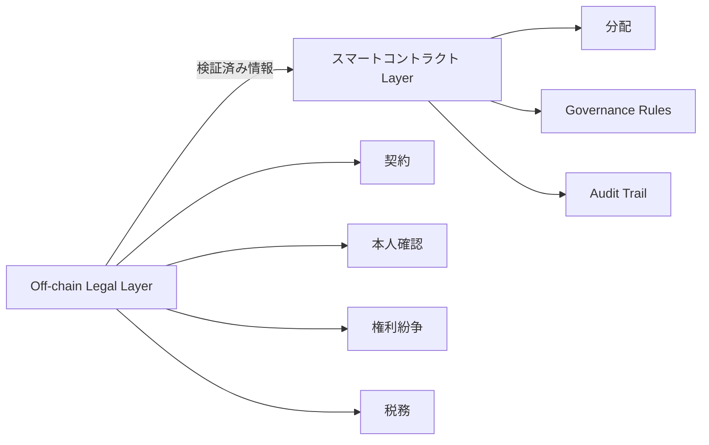

---

## 3.14 Usage Oracle

スマートコントラクトは、ブロックチェーン外で発生した音楽再生を直接知ることができない。

そのため、プレーヤーや配信システムで発生した利用実績を分配プロトコルへ安全に伝える **Usage Oracle** を設ける。

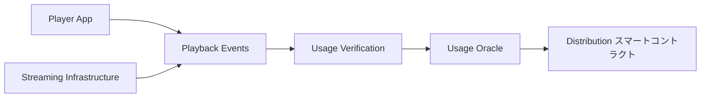

再生実績の正当性、ボット対策、重複排除、プライバシー、改ざん防止を同時に考える。

将来的にはゼロ知識証明などを利用し、

> **誰が何を聴いたかを公開せず、分配に必要な利用実績だけを証明する**

構造を検討する。

---

## 3.15 分配ルールとガバナンス

分配アルゴリズムそのものを運営会社だけの裁量に置かない。

Usage-based Pool や Growth Pool の比率、成長支援の配分方式、不正再生判定、分配頻度、プロトコル手数料など、音楽クリエーターの利益やユーザの支払いに直接関係する重要パラメータはガバナンス対象とする。

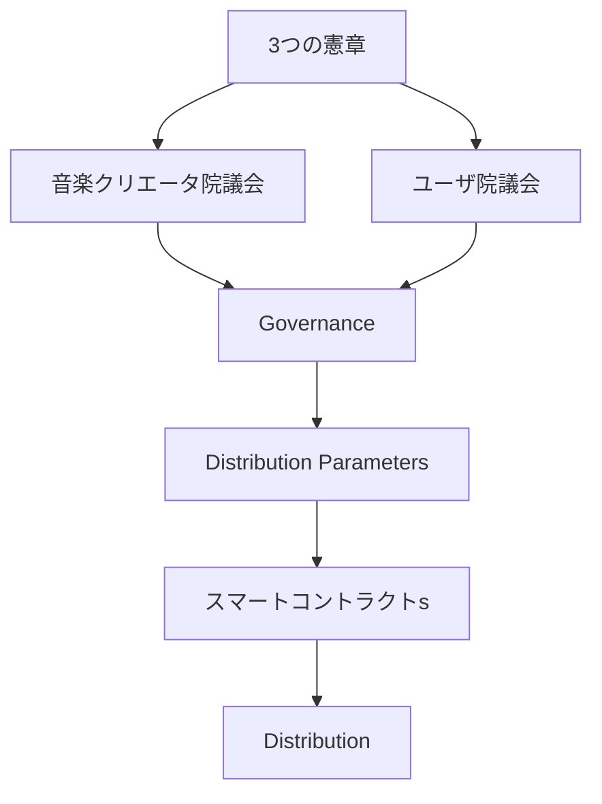

ただし、ガバナンスによって法令や契約上の義務を無効化することはできない。コード統治は法的責任の枠内で行われる。

---

## 3.16 権利紛争と支払い保留

他人の楽曲の無断登録、共同著作者の未申告、マスター権利者の争い、契約終了、権利比率の争いなどが発生し得る。

スマートコントラクトが「先に登録した者」を自動的に権利者として確定する設計にはしない。

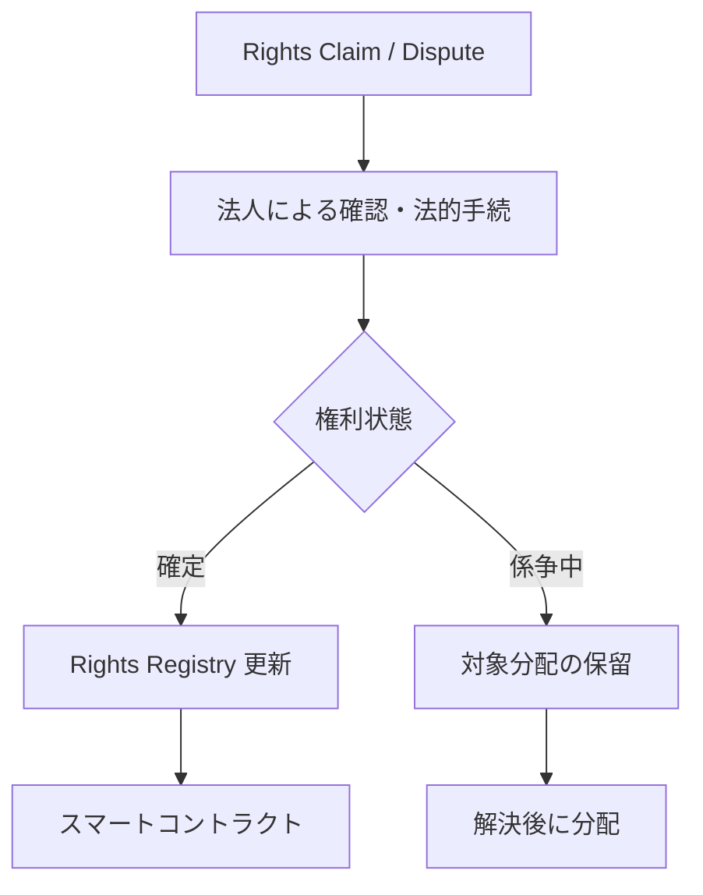

争いのない部分まで不必要に停止しないなど、権利者保護とサービス継続性のバランスを設計する。

---

## 3.17 全体構造

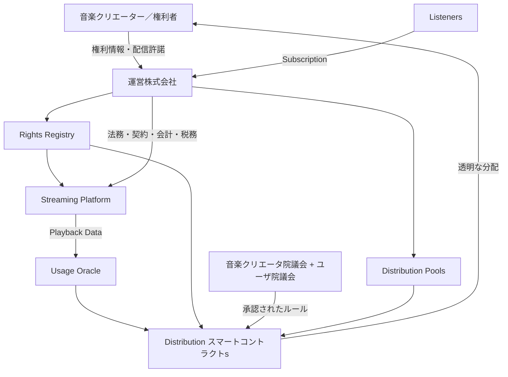

この構造では、**法的権利、法人の責任、利用実績、ガバナンス、スマートコントラクト、資金分配**を一つのシステムとして接続する。

---

## 3.18 設計原則

### Rights before Code
コードより先に法的権利と契約を確認する。

### Transparent Distribution
分配ルールと分配結果を可能な限り検証可能にする。

### 音楽クリエーター中心
経済モデルは音楽クリエーターの持続可能な創作活動を中心に設計する。

### ユーザ主権
ユーザの支払いと支持の意思を尊重し、同時にプライバシーを守る。

### Fair Discovery
再生数だけでは支援されにくい新人や独立系音楽クリエーターにも成長機会を設ける。

### Corporate Responsibility
法的責任をコードやDAOへ転嫁せず、運営株式会社が責任主体となる。

### Governed Code
重要な経済ルールをコード化し、そのコード変更を音楽クリエーターとユーザによるガバナンスの対象とする。

---

## 3.19 本章のまとめ

Creator First Platform は、

> **著作権をブロックチェーンへ置き換えるプロジェクトではない。**

既存の法制度、契約、権利管理を尊重した上で、その経済的な実行部分を透明で検証可能なプロトコルへ接続する。

目指すのは、

> **権利は法律と契約によって守り、責任は法人が負い、価値の分配はコードによって透明化し、そのコードを当事者が統治する。**

という構造である。

---

## 参考資料

本章の法的・制度的詳細は、サービス開始時点の法令、契約形態、権利管理方式、決済方式によって確定する必要がある。詳細な法務・規制・STO・税務については第11章で扱う。

- 著作権法（昭和45年法律第48号）
- 文化庁「著作権制度に関する情報」
- 一般社団法人日本音楽著作権協会（JASRAC）
- 株式会社NexTone
- 資金決済に関する法律
- 金融商品取引法
