# 4. プラットフォーム構成

## 4.1 本章の目的

Creator First Platform は、単一のブロックチェーンアプリケーションとして構築するものではない。

音楽配信には、

- 音源・メタデータ管理
- ストリーミング配信
- ユーザ認証
- 権利管理
- 決済
- 利用実績集計
- 不正検出
- 収益分配
- ガバナンス
- 法務・会計・税務

など、性質の異なる複数の機能が必要になる。

そのため、Creator First Platform では、

> **中央集権型システムが適する領域と、分散・検証可能なシステムが適する領域を分離し、それらを一つのプラットフォームとして統合する。**

という方針を採用する。

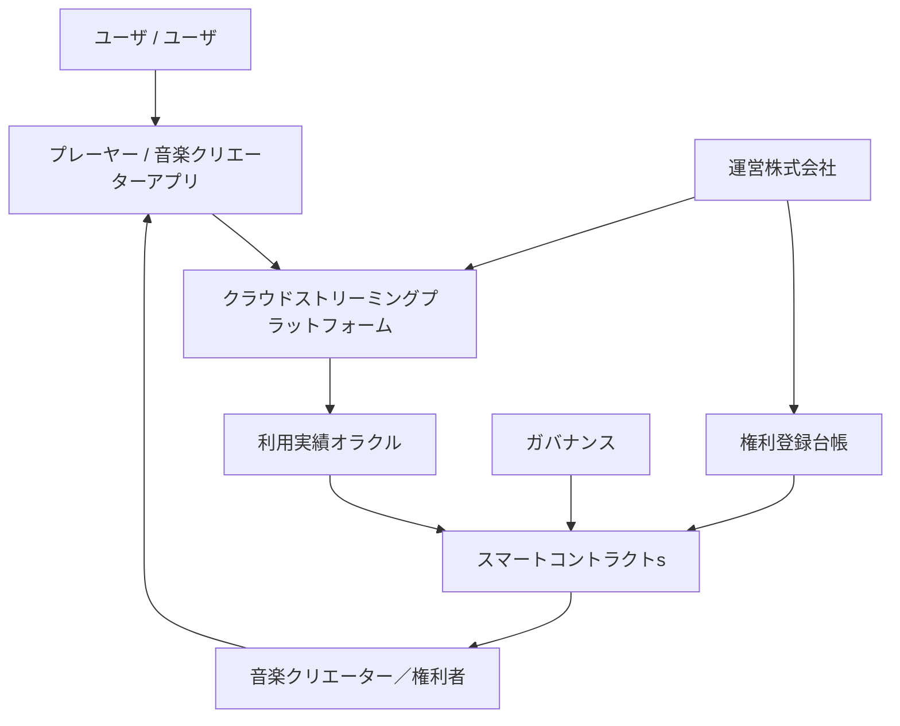

この構成の中心にある考え方は、

**配信は高速で実用的に、分配は透明で検証可能に、責任は法人が負う**

という役割分担である。

---

## 4.2 アーキテクチャ全体像

Creator First Platform は、大きく次の7つのレイヤーから構成する。

1. クライアントレイヤー
2. ストリーミング & コンテンツレイヤー
3. アイデンティティ & 権利レイヤー
4. 利用実績検証レイヤー
5. 決済 & 分配レイヤー
6. ガバナンスレイヤー
7. 法人 & 法令遵守レイヤー

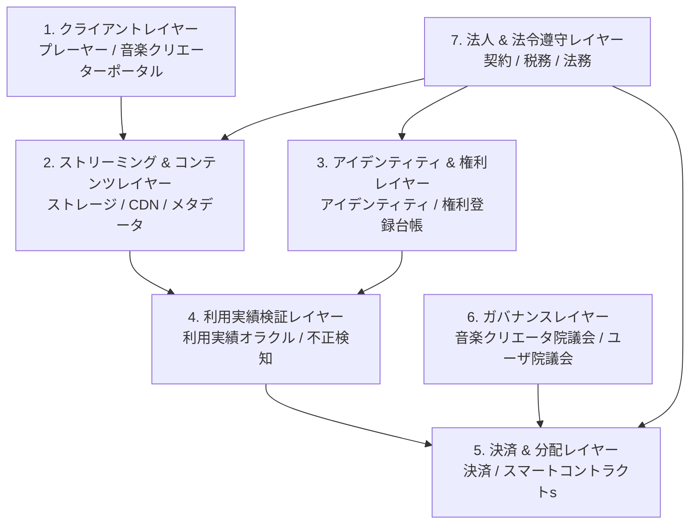

すべてをブロックチェーン上へ置くのではなく、それぞれの目的に適した実装方式を選択する。

### 4.2.1 本番サービスの六つの責任プレーン

本番系は、テストネットの構成を接続先だけ変更して利用するのではなく、アカウント、鍵、データ、コントラクトおよび運用権限を分離して新規構築する。ユーザには一続きの体験を提供する一方、内部では次の責任プレーンを分ける。

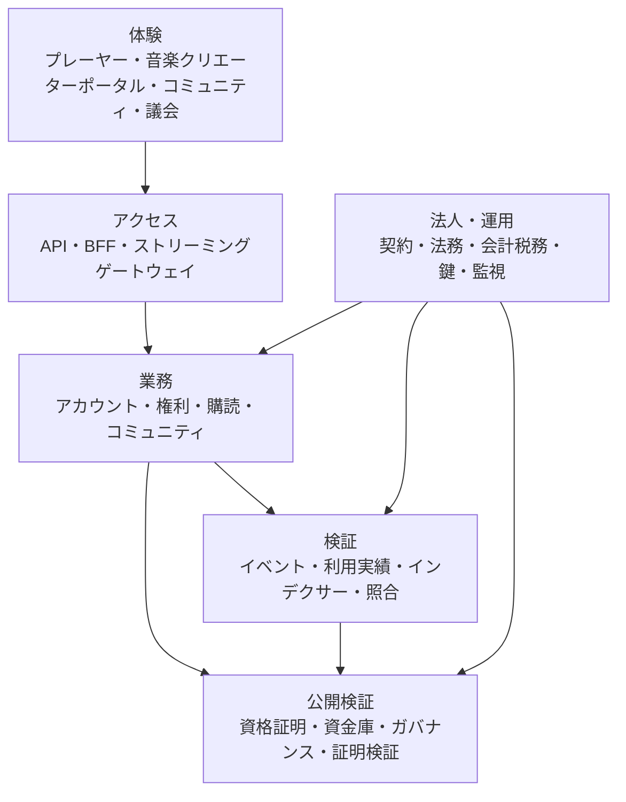

アカウントはアカウントサービス、音楽クリエーター資格は音楽クリエーター審査サービス、配信権は権利登録台帳、購読は決済・購読サービス、コミュニティ会員資格はコミュニティサービス、分配債務と支払は分配台帳・法人会計を正本とする。ウォレット、SBTまたは一つのブロックチェーンイベントを、これらすべての正本として扱わない。

本番の標準経路は、次のように責任境界を横断する。

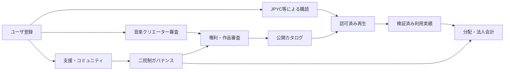

詳細な正本、障害分離および本番成立条件は[ADR-0018](/adr/ADR-0018-production-service-architecture)と[SPEC-PLATFORM-001](/protocol/specs/production-service-lifecycle)で定義する。

---

## 4.3 クライアントレイヤー

クライアントレイヤーは、ユーザと音楽クリエーターが Creator First Platform に接するインターフェースである。

主なクライアントとして、

- 音楽プレーヤーアプリ
- ウェブプレーヤー
- 音楽クリエーターポータル
- ガバナンスポータル
- 管理・権利確認画面

を想定する。

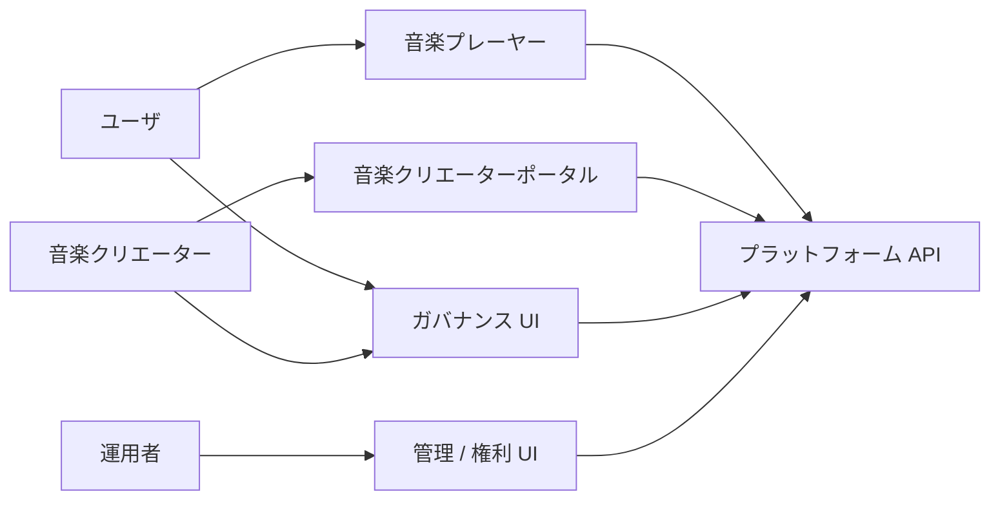

ユーザにブロックチェーン操作を直接要求しないことを基本とする。

ウォレット、ガス代、チェーン切替などを理解しなくても、一般的な音楽ストリーミングサービスと同等のUXで利用できることを目指す。

---

## 4.4 音楽プレーヤー

音楽プレーヤーは単なる再生UIではない。

Creator First Platform では、

- 認証
- 音源取得
- 再生制御
- 推薦表示
- プレイリスト
- 音楽クリエーター支援
- 利用イベント生成
- 利用実績オラクルへの情報提供

など、プラットフォームの重要な接点となる。

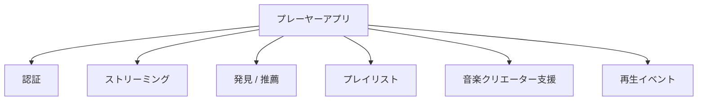

ただし、クライアントが自己申告する再生イベントだけをそのまま分配に利用することはしない。

利用実績検証レイヤーで検証を行う。

---

## 4.5 ストリーミング & コンテンツレイヤー

音楽データは、大容量かつ低遅延で配信する必要がある。

この領域では、成熟したクラウドストレージとCDNを中心に利用する。

概念的には、

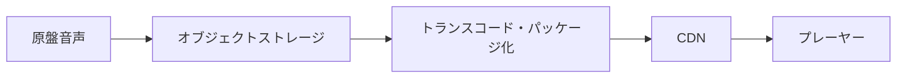

という構成を採る。

ブロックチェーンへ音源本体を格納することは想定しない。

理由は、

- データ量
- 配信性能
- コスト
- 権利侵害時の削除・停止
- DRMやアクセス制御
- 地域制限
- 音源更新

など、音楽配信特有の要件があるためである。

---

## 4.6 AWS等のクラウドとIPFSの役割分担

Creator First Platform では、クラウドと分散ストレージを競合技術として扱わない。

それぞれ異なる目的に利用する。

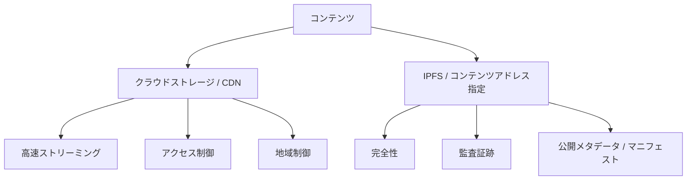

### クラウドが担うもの

- マスター音源
- エンコード済み音源
- CDN配信
- バックアップ
- DRM・署名URL
- 地域・契約に基づくアクセス制御
- ログ・監視

### IPFS等が担い得るもの

- コンテンツハッシュ
- 公開メタデータ
- マニフェスト
- 公開可能なガバナンス資料
- 監査証跡
- 権利登録情報のハッシュ参照

つまり、

> **配信性能はクラウド、真正性と検証性は分散技術**

という役割分担を基本とする。

---

## 4.7 コンテンツメタデータ

音源そのものと、メタデータは分離する。

メタデータには例えば、

- 楽曲 ID
- Title
- アーティスト
- Album
- ジャンル
- Duration
- ISRC等の外部識別子
- 権利登録台帳参照
- 配信地域
- 配信開始・終了
- コンテンツハッシュ

などを持たせる。

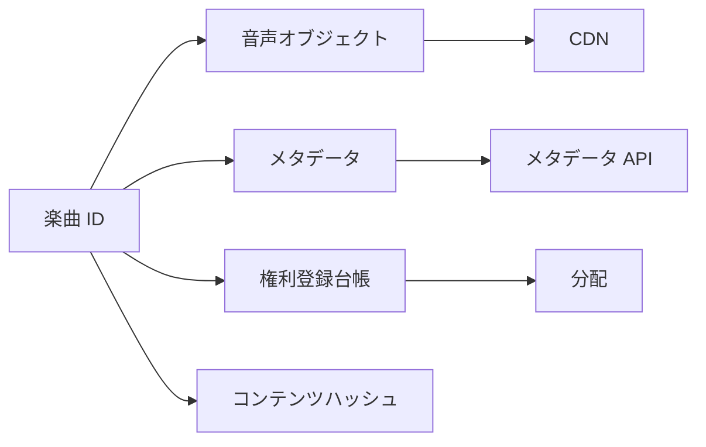

同一の楽曲 IDを中心に、配信、権利、利用実績、分配を接続する。

---

## 4.8 アイデンティティレイヤー

Creator First Platform には複数種類の主体が存在する。

- 一般ユーザ
- 音楽クリエーター
- 権利者
- 法人・レーベル
- 運営スタッフ
- ガバナンス参加者

それぞれ必要な本人確認レベルは異なる。

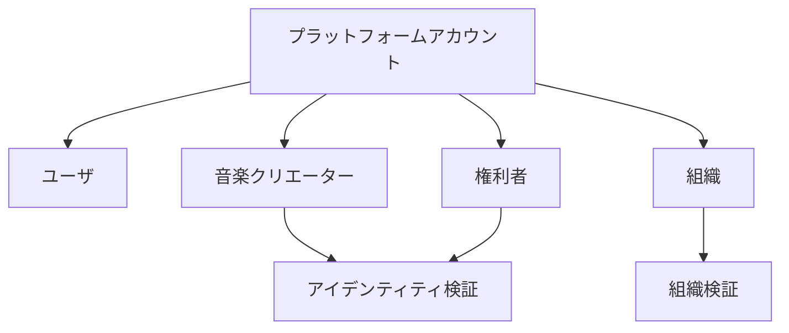

一般の音楽ユーザに過剰な本人確認を要求しない一方、金銭の受取や権利登録を行う主体については、必要な本人・法人確認を行う。

---

## 4.9 ウォレット抽象化

ブロックチェーンを利用する場合でも、ユーザがウォレットを直接管理することを必須としない。

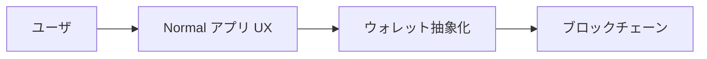

例えば、

- 組込みウォレット
- アカウント抽象化
- Custodial / Non-custodial の選択
- Social Login
- 復旧

などを検討する。

Creator First Platform の利用条件を「暗号資産利用経験があること」にしない。

---

## 4.10 権利登録台帳レイヤー

権利登録台帳は、権利情報をプラットフォーム全体から参照する共通レイヤーである。

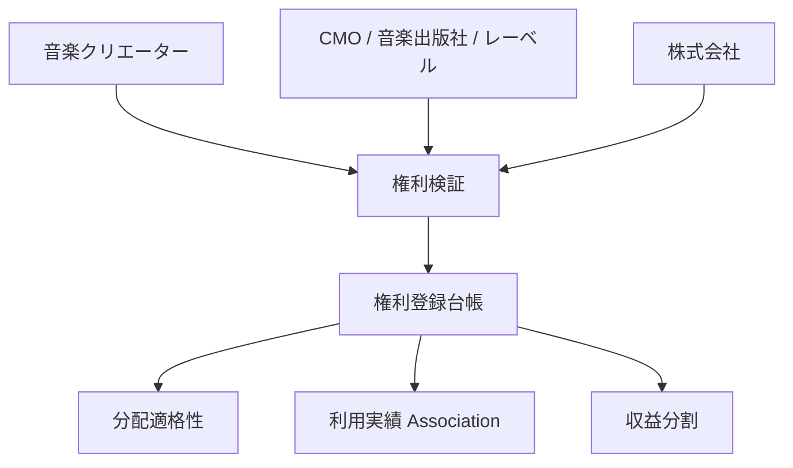

権利登録台帳は、オンチェーンのみで構成する必要はない。

個人情報、契約文書、係争情報などはオフチェーンで安全に保管し、スマートコントラクトには分配に必要な識別子・状態・ハッシュ等のみを渡す。

---

## 4.11 利用実績検証レイヤー

Creator First Platform の経済モデルでは、利用実績が資金分配に影響する。

したがって再生イベントをそのまま信頼せず、検証レイヤーを設ける。

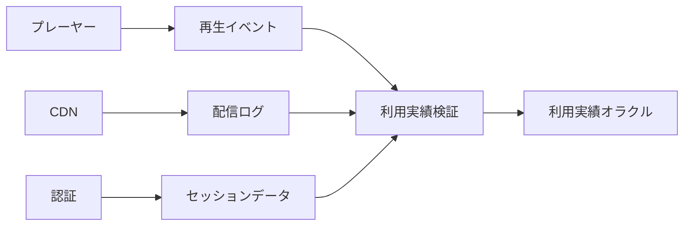

検証要素には、

- セッションの正当性
- 音源取得実績
- 再生時間
- 重複イベント
- ボット / 不正
- レート制限
- 異常パターン

などが含まれる。

---

## 4.12 利用実績オラクル

利用実績オラクルは、オフチェーンで発生した利用実績をスマートコントラクトが利用できる形式へ変換する。

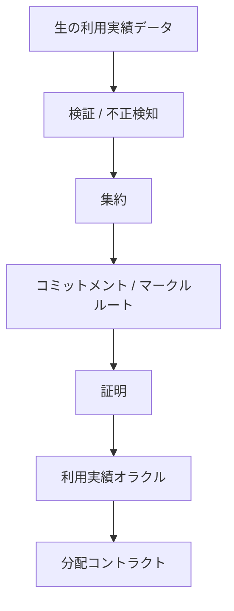

すべての再生イベントを直接ブロックチェーンへ記録することは想定しない。

大量データはオフチェーンで処理し、必要な集計結果・コミットメント・証明をオンチェーンへ渡す。

---

## 4.13 ゼロ知識証明の利用

利用履歴にはプライバシー情報が含まれる。

そのため、将来的にはゼロ知識証明を利用して、

> **詳細な再生履歴を公開せずに、分配対象となる正当な利用実績が存在することを証明する**

構成を検討する。

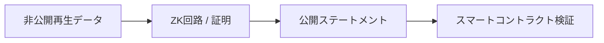

公開する情報は例えば、

- 集計期間
- 楽曲 ID
- 有効利用数
- コミットメント
- 証明

などに限定し、個々のユーザの再生履歴は公開しない。

---

## 4.14 決済レイヤー

ユーザのサブスクリプション決済は、JPYC等の承認済みステーブルコインを使用する。決済レイヤーは、資産登録台帳、決済意思、ウォレット認可、精算アダプターおよびファイナリティ確認を分離し、ETH等のネイティブトークンをサブスクリプション価格として扱わない。

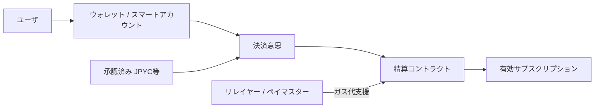

リレイヤーまたはペイマスターはユーザのガス操作を抽象化できるが、料金を支払ったことの正本にはならない。指定された資産、チェーン、コントラクト、Amount、ウォレットおよび決済意思に一致する転送がファイナリティ条件を満たした場合だけサブスクリプションを有効化する。

テスト系では実在JPYCと交換できず金銭的価値を持たない`MockJPYC`を用い、本番系では具体的なJPYC商品・発行者・コントラクトアドレス・ネットワークを法務、技術およびセキュリティ審査後に資産登録台帳へ登録する。

---

## 4.15 精算 & 分配レイヤー

決済された資金から、税・決済コスト・必要な契約上の支払い等を処理した上で、分配可能額を生成する。

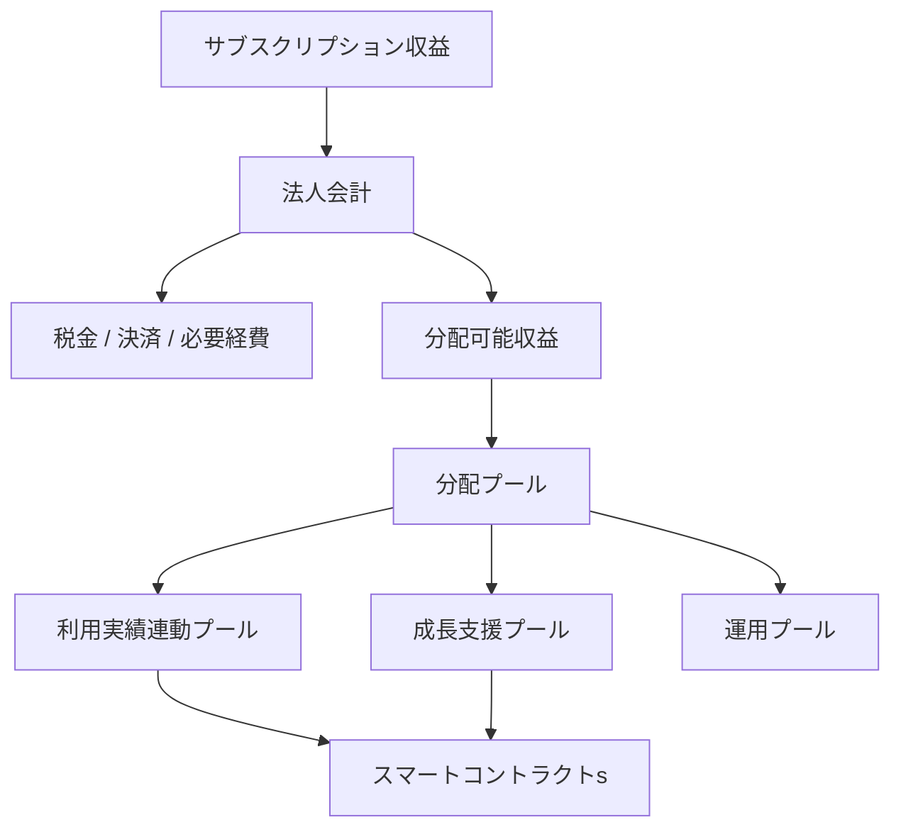

会計上の資金管理と、プロトコル上の分配ロジックを混同しないことが重要である。

---

## 4.16 スマートコントラクトレイヤー

スマートコントラクトレイヤーは Creator First Platform における検証可能な経済ルールを実行する。

主なコントラクト群として、将来的に次を想定する。

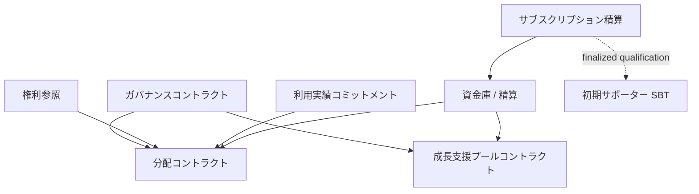

具体的なSolidity実装やチェーン選択は、ホワイトペーパー段階では固定しない。

重要なのは、コントラクト間の責任分離である。

---

## 4.17 ガバナンスレイヤー

Creator First Platform のガバナンスは、単一のトークン投票ではなく、

- 憲章
- 音楽クリエータ院議会
- ユーザ院議会
- 法人責任

を組み合わせる。

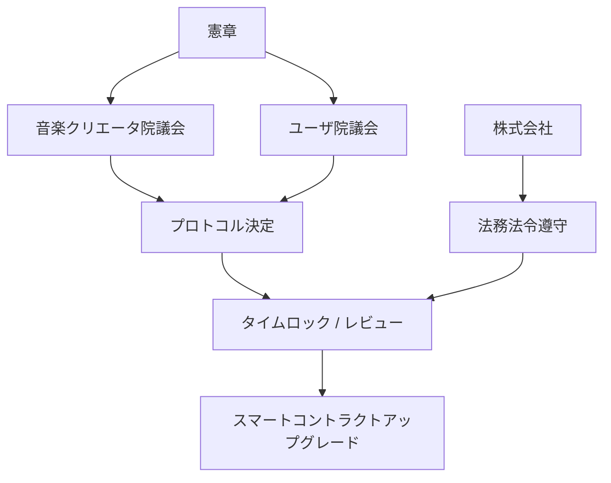

法人がガバナンスを自由に無視することも、DAOが法律を無視することも想定しない。

---

## 4.18 株式会社レイヤー

株式会社はプラットフォーム全体の法的・事業上の責任主体である。

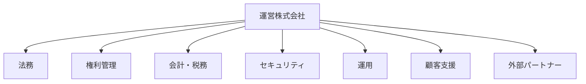

技術レイヤーを運用する主体でもあるが、プロトコルルールについてはガバナンスによる制約を受ける。

---

## 4.19 管理レイヤー

現実のサービスには管理機能も必要になる。

例えば、

- 権利確認
- コンテンツ公開停止
- 権利侵害対応
- 不正アカウント対応
- 決済・返金処理
- 税務情報
- 問い合わせ
- セキュリティインシデント

などである。

ただし、管理者権限によってスマートコントラクト上の分配ルールを任意変更できる設計にはしない。

```mermaid
flowchart LR
    ADMIN[管理]
    ADMIN --> OFFCHAIN[運用事項 Systems]
    ADMIN --> EMERGENCY[緊急制御]

    EMERGENCY --> REVIEW[ガバナンス / 監査]
    REVIEW --> SC[スマートコントラクトs]
```

緊急停止などが必要な場合でも、権限・条件・履歴を明確化する。

---

## 4.20 API レイヤー

各レイヤーを疎結合に保つため、API境界を明確にする。

```mermaid
flowchart LR
    CLIENT[クライアント]
    CLIENT --> API[API ゲートウェイ]

    API --> AUTH[認証サービス]
    API --> META[メタデータサービス]
    API --> RIGHTS[権利サービス]
    API --> DISC[発見サービス]
    API --> PLAY[再生サービス]
    API --> GOV[ガバナンスサービス]
```

スマートコントラクトへ直接アクセスする必要がない機能までオンチェーンAPIに依存させない。

---

## 4.21 イベント駆動アーキテクチャ

再生イベント、楽曲登録、権利変更、分配、ガバナンス決定など、多くの処理はイベント駆動で設計できる。

```mermaid
flowchart LR
    PLAYER[再生]
    RIGHTS[権利更新]
    GOV[ガバナンス]
    PAYMENT[決済]

    PLAYER --> BUS[イベント Bus]
    RIGHTS --> BUS
    GOV --> BUS
    PAYMENT --> BUS

    BUS --> ANALYTICS[分析]
    BUS --> ORACLE[利用実績オラクル]
    BUS --> AUDIT[監査]
    BUS --> NOTIFY[通知]
```

イベント駆動により、各サービスを独立に拡張しやすくする。

---

## 4.22 セキュリティ境界

Creator First Platform では、すべてのコンポーネントを同一の信頼レベルで扱わない。

```mermaid
flowchart TD
    INTERNET[インターネット]
    INTERNET --> EDGE[CDN / WAF / API ゲートウェイ]
    EDGE --> APP[アプリケーションサービス]
    APP --> DATA[非公開データレイヤー]
    APP --> ORACLE[オラクルレイヤー]
    ORACLE --> CHAIN[ブロックチェーン]
```

特に、

- 秘密鍵
- 音楽クリエーター本人情報
- 契約情報
- 決済情報
- 生の利用履歴

は厳格に分離する。

詳細は第10章「セキュリティ」で扱う。

---

## 4.23 可用性とブロックチェーン依存

音楽再生そのものをブロックチェーンの可用性に依存させない。

```mermaid
flowchart LR
    PLAYER[プレーヤー]
    PLAYER --> STREAM[ストリーミングプラットフォーム]
    STREAM --> MUSIC[音楽再生]

    STREAM --> ASYNC[非同期利用実績処理]
    ASYNC --> CHAIN[ブロックチェーン]
```

ブロックチェーンや分配コントラクトが一時停止しても、法的・契約的に許される範囲で音楽再生サービス自体は継続できる設計とする。

これにより、

- チェーン障害
- RPC障害
- 高騰する手数料
- コントラクト更新

などが直接ユーザの音楽体験を停止させない。

---

## 4.24 チェーン選択

利用するブロックチェーンは現時点では固定しない。

評価基準として、

- セキュリティ
- 分散性
- 手数料
- 処理性能
- ステーブルコイン対応
- 開発環境
- アカウント抽象化
- ZK技術との親和性
- 長期的なエコシステム
- 規制・事業リスク

などを考慮する。

```mermaid
flowchart TD
    REQUIRE[要件]
    REQUIRE --> SEC[セキュリティ]
    REQUIRE --> COST[コスト]
    REQUIRE --> SCALE[拡張性]
    REQUIRE --> UX[ユーザ体験]
    REQUIRE --> ECOSYSTEM[エコシステム]

    SEC --> SELECT[チェーン Selection]
    COST --> SELECT
    SCALE --> SELECT
    UX --> SELECT
    ECOSYSTEM --> SELECT
```

EVM互換チェーンを有力候補とするが、ホワイトペーパー段階で特定チェーンへロックインしない。

---

## 4.25 段階的な実装

最初から全機能を分散化しない。

```mermaid
flowchart LR
    P1[フェーズ 1<br/>従来型DSP + 監査可能性]
    P2[フェーズ 2<br/>スマートコントラクト分配]
    P3[フェーズ 3<br/>利用実績オラクル / ZK]
    P4[フェーズ 4<br/>DAO ガバナンス]

    P1 --> P2 --> P3 --> P4
```

### フェーズ 1

- 音楽配信
- 音楽クリエーター登録
- 権利登録台帳
- 利用実績
- 法人による分配
- 監査可能なログ

### フェーズ 2

- スマートコントラクト分配
- オンチェーン監査
- 成長支援プール

### フェーズ 3

- 利用実績オラクル
- 不正検出高度化
- ZK 証明

### フェーズ 4

- 音楽クリエータ院議会
- ユーザ院議会
- プロトコルガバナンス

という段階的導入を想定する。

---

## 4.26 全体データフロー

Creator First Platform の基本的な処理を、一つの流れとして示す。

```mermaid
sequenceDiagram
    participant C as 音楽クリエーター
    participant Corp as 株式会社
    participant R as 権利登録台帳
    participant S as ストリーミングプラットフォーム
    participant U as ユーザ
    participant O as 利用実績オラクル
    participant SC as スマートコントラクト

    C->>Corp: 権利 declaration / contract
    Corp->>R: 登録簿 verified rights
    Corp->>S: 公開 track
    U->>S: リクエスト playback
    S-->>U: 音声 stream
    S->>O: 利用実績 data
    O->>O: 検証 / aggregate
    O->>SC: 利用実績 commitment / proof
    R->>SC: 権利 / split reference
    SC->>C: 分配
```

これは最終実装を固定するものではないが、各レイヤーの責任境界を示す基本モデルとなる。

---

## 4.27 アーキテクチャ原則

Creator First Platform の技術構成は、次の原則に従う。

### 各レイヤーに適した技術

すべてをブロックチェーンへ置かない。

### ストリーミング優先

音楽再生の性能と可用性を最優先する。

### 検証可能な資金

価値分配は可能な限り検証可能にする。

### プライバシー・バイ・デザイン

利用履歴や個人情報を不必要に公開しない。

### 分配より権利を優先

権利確認なしに自動分配しない。

### 重要ルールをガバナンスで統治

重要な経済ルールは運営企業だけで変更しない。

### 法人責任

法人が現実世界での責任を負う。

### 段階的分散化

必要性が確認された部分から段階的に分散化する。

---

## 4.28 本章のまとめ

Creator First Platform の技術設計は、

> **ブロックチェーンを中心にサービスを作るのではなく、音楽クリエーター中心の制度を実現するために必要な技術を組み合わせる**

ことを基本とする。

```mermaid
flowchart LR
    USER[ユーザ体験]
    CLOUD[クラウドストリーミング]
    RIGHTS[権利]
    ORACLE[利用実績検証]
    CHAIN[スマートコントラクトs]
    GOV[ガバナンス]
    CORP[法人責任]

    USER --> CLOUD
    CLOUD --> ORACLE
    RIGHTS --> CHAIN
    ORACLE --> CHAIN
    GOV --> CHAIN
    CORP --> RIGHTS
    CORP --> CLOUD
```

クラウドは音楽を届ける。

権利登録台帳は権利を接続する。

利用実績オラクルは利用を検証する。

スマートコントラクトは価値を分配する。

ガバナンスはコードを統治する。

株式会社は現実社会に対する責任を負う。

これらを統合したハイブリッドアーキテクチャが、Creator First Platform の基本構成である。
