# 4. プラットフォーム構成 — Platform Architecture

## 4.1 本章の目的

Creator First Platform は、単一のブロックチェーンアプリケーションとして構築するものではない。

音楽配信には、

- 音源・メタデータ管理
- ストリーミング配信
- 利用者認証
- 権利管理
- 決済
- 利用実績集計
- 不正検出
- 収益分配
- ガバナンス
- 法務・会計・税務

など、性質の異なる複数の機能が必要になる。

そのため、Creator First Platform では、

> **中央集権型システムが適する領域と、分散・検証可能なシステムが適する領域を分離し、それらを一つのプラットフォームとして統合する。**

という方針を採用する。

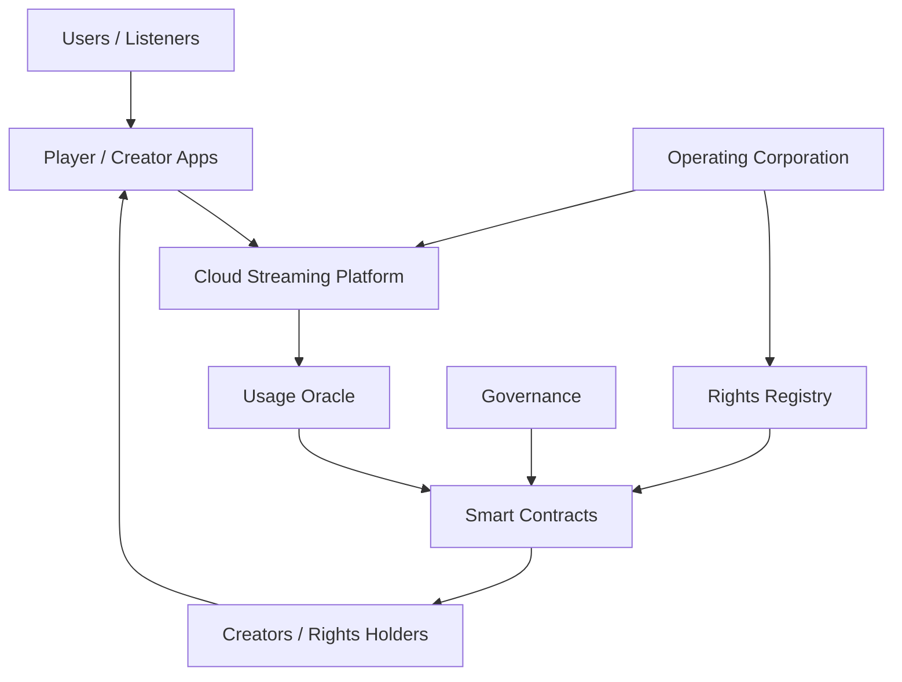

この構成の中心にある考え方は、

**配信は高速で実用的に、分配は透明で検証可能に、責任は法人が負う**

という役割分担である。

---

## 4.2 アーキテクチャ全体像

Creator First Platform は、大きく次の7つのレイヤーから構成する。

1. Client Layer
2. Streaming & Content Layer
3. Identity & Rights Layer
4. Usage Verification Layer
5. Payment & Distribution Layer
6. Governance Layer
7. Corporate & Compliance Layer

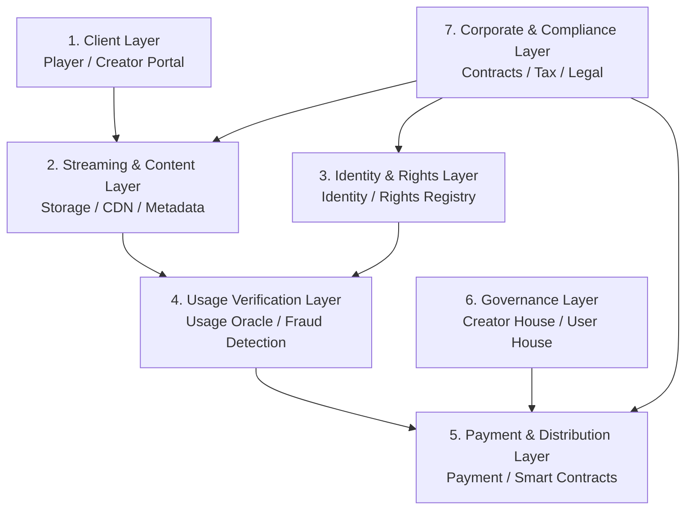

すべてをブロックチェーン上へ置くのではなく、それぞれの目的に適した実装方式を選択する。

---

## 4.3 Client Layer

Client Layer は、利用者とクリエイターが Creator First Platform に接するインターフェースである。

主なクライアントとして、

- 音楽プレーヤーアプリ
- Webプレーヤー
- クリエイターポータル
- ガバナンスポータル
- 管理・権利確認画面

を想定する。

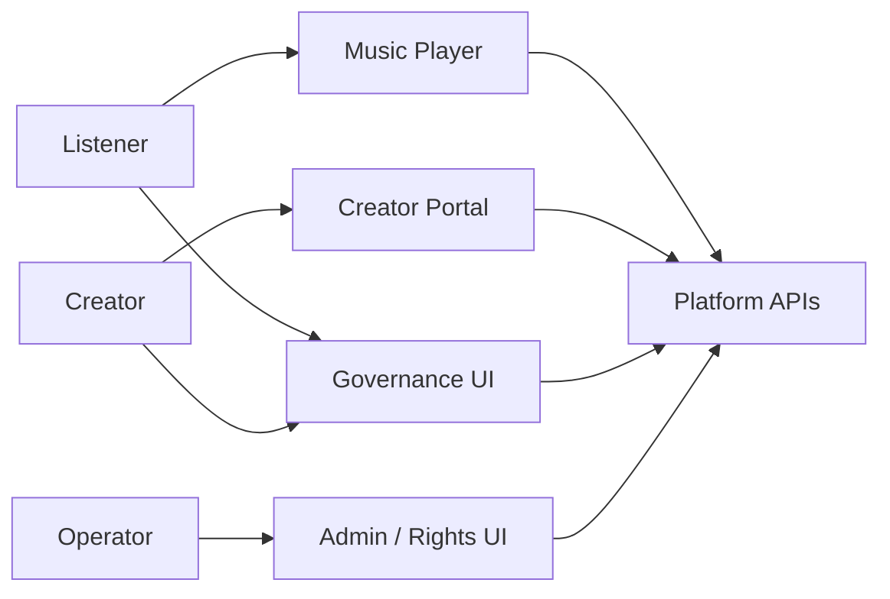

利用者にブロックチェーン操作を直接要求しないことを基本とする。

ウォレット、ガス代、チェーン切替などを理解しなくても、一般的な音楽ストリーミングサービスと同等のUXで利用できることを目指す。

---

## 4.4 音楽プレーヤー

音楽プレーヤーは単なる再生UIではない。

Creator First Platform では、

- 認証
- 音源取得
- 再生制御
- 推薦表示
- プレイリスト
- Creator Support
- 利用イベント生成
- Usage Oracle への情報提供

など、プラットフォームの重要な接点となる。

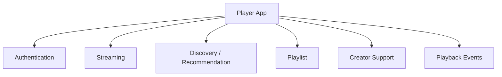

ただし、クライアントが自己申告する再生イベントだけをそのまま分配に利用することはしない。

Usage Verification Layer で検証を行う。

---

## 4.5 Streaming & Content Layer

音楽データは、大容量かつ低遅延で配信する必要がある。

この領域では、成熟したクラウドストレージとCDNを中心に利用する。

概念的には、

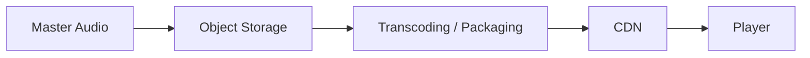

という構成を採る。

ブロックチェーンへ音源本体を格納することは想定しない。

理由は、

- データ量
- 配信性能
- コスト
- 権利侵害時の削除・停止
- DRMやアクセス制御
- 地域制限
- 音源更新

など、音楽配信特有の要件があるためである。

### 4.5.1 Navidromeを利用する初期Streaming Vertical Slice

初期実装では、音源スキャン、検索、Playlist、HTTP RangeおよびTranscodingを早期に検証するため、NavidromeをMedia Server候補として利用する。

2026-08-22時点のRepositoryには、合成音源を使うVue Player、Node.js Gateway、短命Playback Session、Range、SQLite Delivery Evidence、SIWE／EIP-712署名検証、Mock Supporter状態および明示Mapping型Navidrome Adapterが部分実装されている。Account、Subscription、RightsおよびCredentialは固定またはIn-memory Mockであり、Smart Contract、Indexer、Verified Usageおよび本番認証は未実装である。Alias限定Test User登録はUIとNotice確認用のTest-only Profileであり、Platform Accountを作らず、再生、Wallet、SubscriptionまたはSBT認可を変更しない。

ただし、NavidromeをSubscription、RightsまたはCreator DistributionのSource of Truthにはしない。

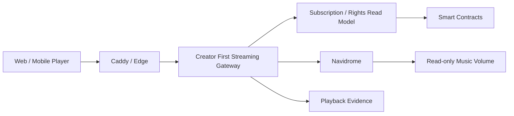

Streaming Authorization Gatewayは、再生開始前に次を検証する。

- Platform Session
- AccountとWalletの関連状態
- On-chain Subscriptionを反映したRead Model
- Trackの公開状態
- Rights Version
- Plan、Territory、License Window
- Concurrent StreamおよびRate Limit

認可後に短時間のPlayback Sessionを発行し、Gatewayだけが非公開Network上のNavidromeへ接続する。ClientへNavidromeのCredential、Internal Media IDまたは任意API Proxyを公開しない。

NavidromeのExternalized Authenticationを利用する場合、GatewayはClient supplied authentication headerを除去し、Gatewayが生成したPseudonymous User IDだけを内部Headerとして付与する。

MVPではGatewayが音声ResponseをBufferせずに中継する。これはStreaming、Subscription、RightsおよびUsageをEnd-to-Endで検証するための段階的構成であり、本番Scaleの最終形を固定するものではない。

Early Supporter SBTによる特権を導入する場合も、NavidromeをToken Gateまたは資格のSource of Truthにしない。Indexerが確認済みSBT Eventから再編成耐性を持つCredential / Privilege Read Modelを構築し、GatewayがPlatform Session、Wallet Link、Active Subscription、Rights Snapshotおよび版管理されたPrivilege Policyと合わせて評価する。

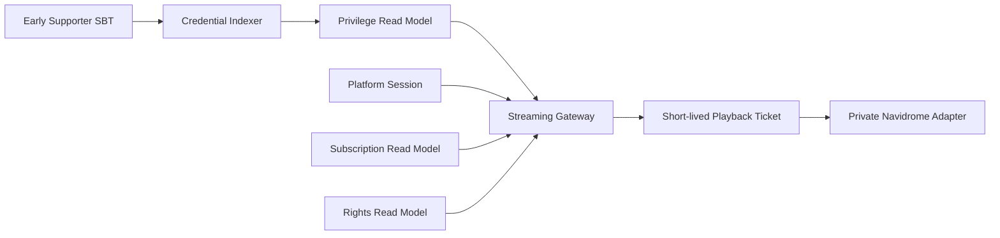

Wallet署名はWallet Controlを、SBTはIssuerによるCredentialを証明するが、いずれも単独では再生を許可しない。Playback Ticketには使用したCredential、Privilege Policy、SubscriptionおよびRightsのVersionをBindingし、短時間かつ失効可能にする。

負荷試験で定義するScale Triggerを超えた場合は、事前Transcode、Object Storage、CDNおよび短時間署名URLへAudio Byte Deliveryを移す。Creator First Track ID、Rights DecisionおよびPlayback Evidenceの境界を維持することで、Navidromeを将来置換可能にする。

詳細な設計判断は[ADR-0009](/adr/ADR-0009-navidrome-streaming-gateway)に記録する。

---

## 4.6 AWS等のクラウドとIPFSの役割分担

Creator First Platform では、クラウドと分散ストレージを競合技術として扱わない。

それぞれ異なる目的に利用する。

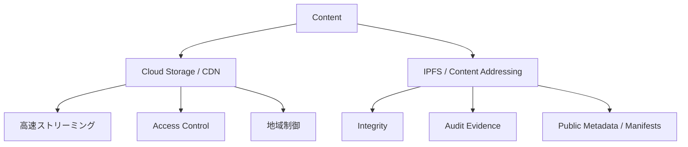

### クラウドが担うもの

- マスター音源
- エンコード済み音源
- CDN配信
- バックアップ
- DRM・署名URL
- 地域・契約に基づくアクセス制御
- ログ・監視

### IPFS等が担い得るもの

- コンテンツハッシュ
- 公開メタデータ
- マニフェスト
- 公開可能なガバナンス資料
- 監査証跡
- 権利登録情報のハッシュ参照

つまり、

> **配信性能はクラウド、真正性と検証性は分散技術**

という役割分担を基本とする。

---

## 4.7 Content Metadata

音源そのものと、メタデータは分離する。

メタデータには例えば、

- Track ID
- Title
- Artist
- Album
- Genre
- Duration
- ISRC等の外部識別子
- Rights Registry 参照
- 配信地域
- 配信開始・終了
- Content Hash

などを持たせる。

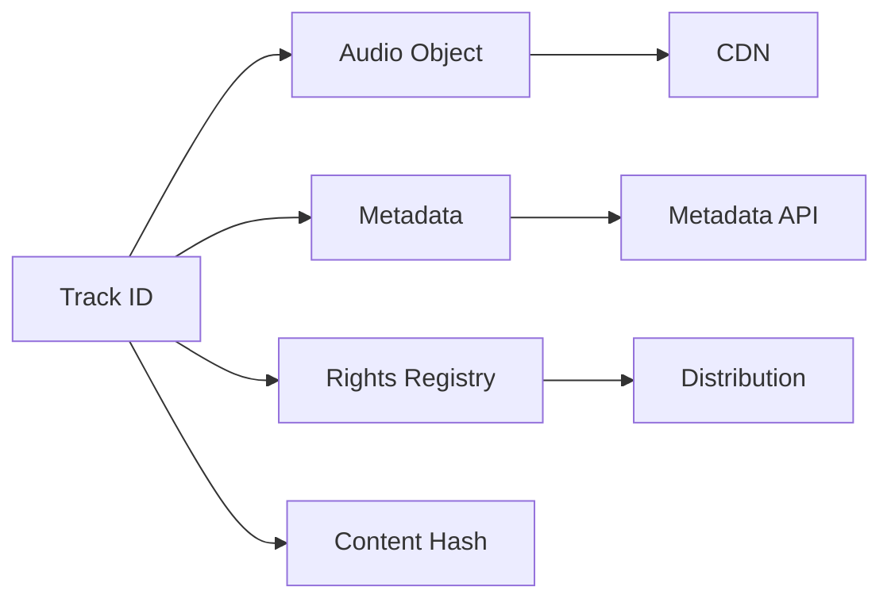

同一のTrack IDを中心に、配信、権利、利用実績、分配を接続する。

---

## 4.8 Identity Layer

Creator First Platform には複数種類の主体が存在する。

- 一般利用者
- クリエイター
- 権利者
- 法人・レーベル
- 運営スタッフ
- ガバナンス参加者

それぞれ必要な本人確認レベルは異なる。

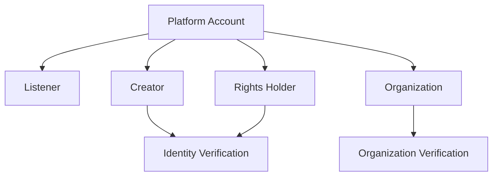

一般の音楽利用者に過剰な本人確認を要求しない一方、金銭の受取や権利登録を行う主体については、必要な本人・法人確認を行う。

---

## 4.9 Wallet Abstraction

ブロックチェーンを利用する場合でも、ユーザーがウォレットを直接管理することを必須としない。

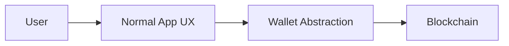

例えば、

- Embedded Wallet
- Account Abstraction
- Custodial / Non-custodial の選択
- Social Login
- Recovery

などを検討する。

Creator First Platform の利用条件を「暗号資産利用経験があること」にしない。

---

## 4.10 Rights Registry Layer

Rights Registry は、権利情報をプラットフォーム全体から参照する共通レイヤーである。

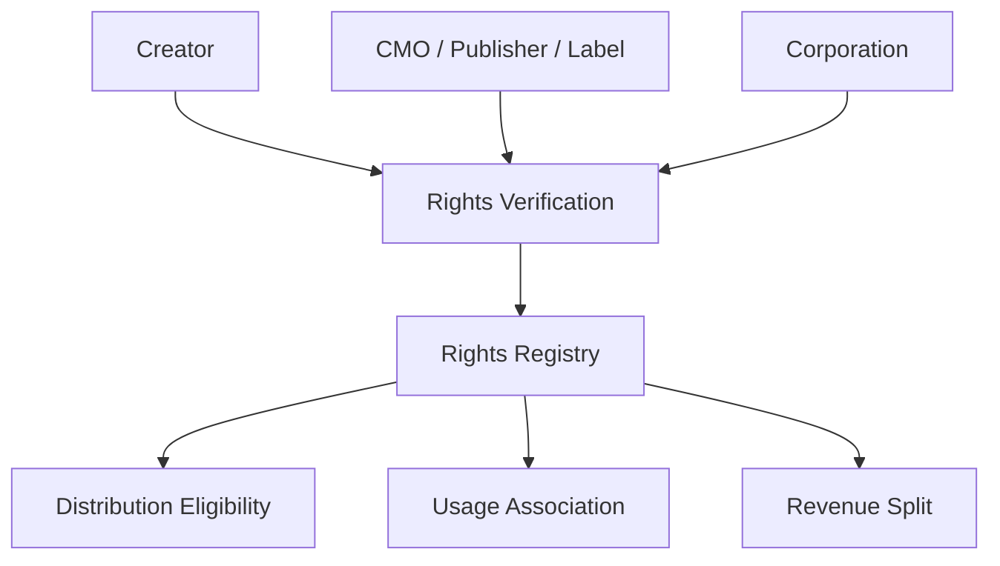

Rights Registry は、オンチェーンのみで構成する必要はない。

個人情報、契約文書、係争情報などはオフチェーンで安全に保管し、スマートコントラクトには分配に必要な識別子・状態・ハッシュ等のみを渡す。

---

## 4.11 Usage Verification Layer

Creator First Platform の経済モデルでは、利用実績が資金分配に影響する。

したがって Playback Event をそのまま信頼せず、検証レイヤーを設ける。

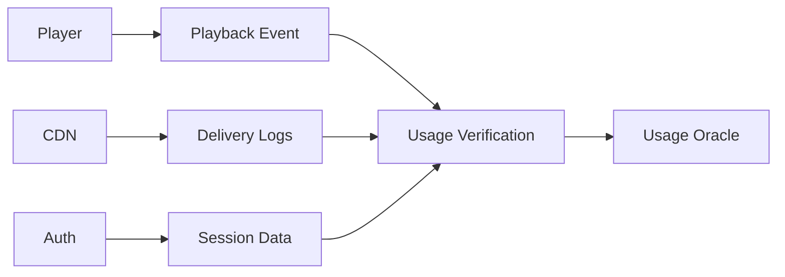

検証要素には、

- セッションの正当性
- 音源取得実績
- 再生時間
- 重複イベント
- Bot / Fraud
- レート制限
- 異常パターン

などが含まれる。

---

## 4.12 Usage Oracle

Usage Oracle は、オフチェーンで発生した利用実績をスマートコントラクトが利用できる形式へ変換する。

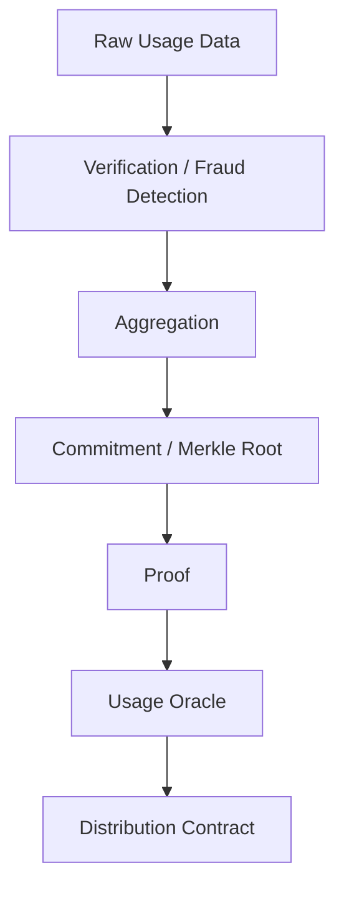

すべての再生イベントを直接ブロックチェーンへ記録することは想定しない。

大量データはオフチェーンで処理し、必要な集計結果・コミットメント・証明をオンチェーンへ渡す。

---

## 4.13 ゼロ知識証明の利用

利用履歴にはプライバシー情報が含まれる。

そのため、将来的にはゼロ知識証明を利用して、

> **詳細な再生履歴を公開せずに、分配対象となる正当な利用実績が存在することを証明する**

構成を検討する。

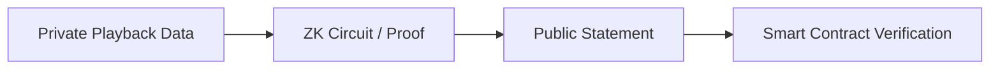

公開する情報は例えば、

- 集計期間
- Track ID
- 有効利用数
- コミットメント
- Proof

などに限定し、個々の利用者の再生履歴は公開しない。

---

## 4.14 Payment Layer

利用者のサブスクリプション決済は、JPYC等の承認済みステーブルコインを使用する。Payment Layerは、Asset Registry、Payment Intent、Wallet Authorization、Settlement AdapterおよびFinality確認を分離し、ETH等のネイティブトークンをSubscription Priceとして扱わない。

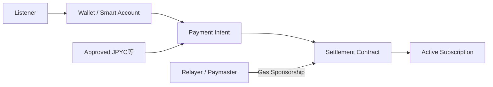

RelayerまたはPaymasterは利用者のGas操作を抽象化できるが、料金を支払ったことのSource of Truthにはならない。指定されたAsset、Chain、Contract、Amount、WalletおよびPayment Intentに一致するTransferがFinality条件を満たした場合だけSubscriptionを有効化する。

テスト系では実在JPYCと交換できず金銭的価値を持たない`MockJPYC`を用い、本番系では具体的なJPYC商品・発行者・Contract Address・Networkを法務、技術およびSecurity審査後にAsset Registryへ登録する。

---

## 4.15 Settlement & Distribution Layer

決済された資金から、税・決済コスト・必要な契約上の支払い等を処理した上で、分配可能額を生成する。

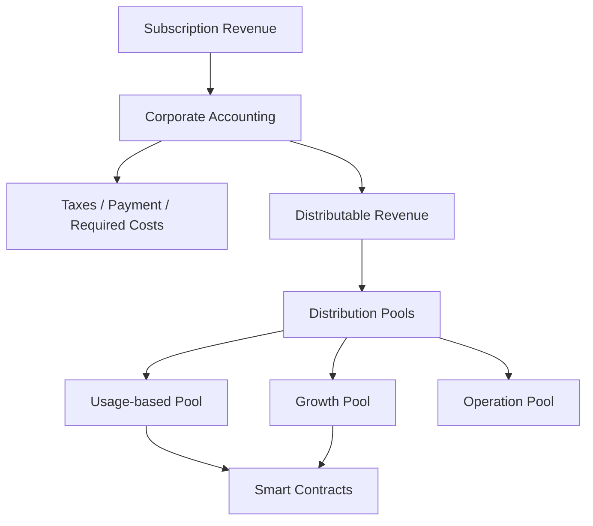

会計上の資金管理と、プロトコル上の分配ロジックを混同しないことが重要である。

---

## 4.16 Smart Contract Layer

Smart Contract Layer は Creator First Platform における検証可能な経済ルールを実行する。

主なコントラクト群として、将来的に次を想定する。

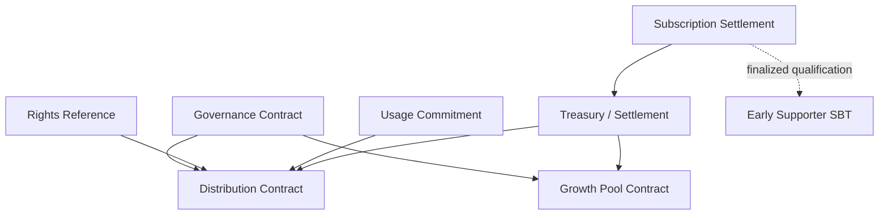

具体的なSolidity実装やチェーン選択は、ホワイトペーパー段階では固定しない。

重要なのは、コントラクト間の責任分離である。

---

## 4.17 Governance Layer

Creator First Platform のガバナンスは、単一のトークン投票ではなく、

- Constitution
- Creator House
- User House
- Corporate Responsibility

を組み合わせる。

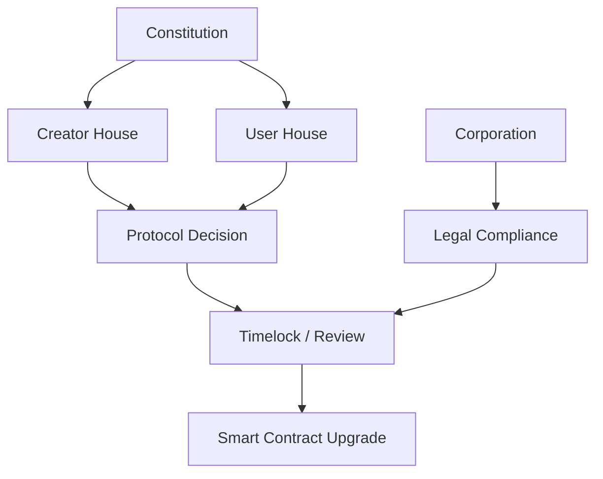

法人がガバナンスを自由に無視することも、DAOが法律を無視することも想定しない。

---

## 4.18 Corporation Layer

株式会社はプラットフォーム全体の法的・事業上の責任主体である。

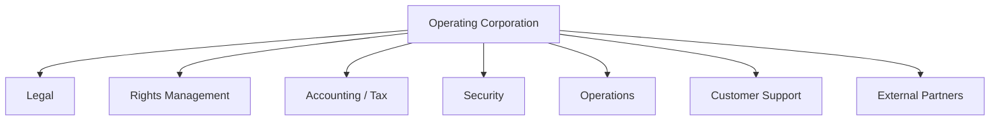

技術レイヤーを運用する主体でもあるが、プロトコルルールについてはガバナンスによる制約を受ける。

---

## 4.19 Admin Layer

現実のサービスには管理機能も必要になる。

例えば、

- 権利確認
- コンテンツ公開停止
- 権利侵害対応
- 不正アカウント対応
- 決済・返金処理
- 税務情報
- 問い合わせ
- セキュリティインシデント

などである。

ただし、管理者権限によってスマートコントラクト上の分配ルールを任意変更できる設計にはしない。

```mermaid
flowchart LR
    ADMIN[Admin]
    ADMIN --> OFFCHAIN[Operational Systems]
    ADMIN --> EMERGENCY[Emergency Controls]

    EMERGENCY --> REVIEW[Governance / Audit]
    REVIEW --> SC[Smart Contracts]
```

緊急停止などが必要な場合でも、権限・条件・履歴を明確化する。

---

## 4.20 API Layer

各レイヤーを疎結合に保つため、API境界を明確にする。

```mermaid
flowchart LR
    CLIENT[Clients]
    CLIENT --> API[API Gateway]

    API --> AUTH[Auth Service]
    API --> META[Metadata Service]
    API --> RIGHTS[Rights Service]
    API --> DISC[Discovery Service]
    API --> PLAY[Playback Service]
    API --> GOV[Governance Service]
```

スマートコントラクトへ直接アクセスする必要がない機能までオンチェーンAPIに依存させない。

---

## 4.21 イベント駆動アーキテクチャ

再生イベント、楽曲登録、権利変更、分配、ガバナンス決定など、多くの処理はイベント駆動で設計できる。

```mermaid
flowchart LR
    PLAYER[Playback]
    RIGHTS[Rights Update]
    GOV[Governance]
    PAYMENT[Payment]

    PLAYER --> BUS[Event Bus]
    RIGHTS --> BUS
    GOV --> BUS
    PAYMENT --> BUS

    BUS --> ANALYTICS[Analytics]
    BUS --> ORACLE[Usage Oracle]
    BUS --> AUDIT[Audit]
    BUS --> NOTIFY[Notifications]
```

イベント駆動により、各サービスを独立に拡張しやすくする。

---

## 4.22 セキュリティ境界

Creator First Platform では、すべてのコンポーネントを同一の信頼レベルで扱わない。

```mermaid
flowchart TD
    INTERNET[Internet]
    INTERNET --> EDGE[CDN / WAF / API Gateway]
    EDGE --> APP[Application Services]
    APP --> DATA[Private Data Layer]
    APP --> ORACLE[Oracle Layer]
    ORACLE --> CHAIN[Blockchain]
```

特に、

- 秘密鍵
- クリエイター本人情報
- 契約情報
- 決済情報
- 生の利用履歴

は厳格に分離する。

詳細は第10章「セキュリティ」で扱う。

---

## 4.23 可用性とブロックチェーン依存

音楽再生そのものをブロックチェーンの可用性に依存させない。

```mermaid
flowchart LR
    PLAYER[Player]
    PLAYER --> STREAM[Streaming Platform]
    STREAM --> MUSIC[Music Playback]

    STREAM --> ASYNC[Async Usage Processing]
    ASYNC --> CHAIN[Blockchain]
```

ブロックチェーンや分配コントラクトが一時停止しても、法的・契約的に許される範囲で音楽再生サービス自体は継続できる設計とする。

これにより、

- チェーン障害
- RPC障害
- 高騰する手数料
- コントラクト更新

などが直接ユーザーの音楽体験を停止させない。

---

## 4.24 チェーン選択

利用するブロックチェーンは現時点では固定しない。

評価基準として、

- セキュリティ
- 分散性
- 手数料
- 処理性能
- ステーブルコイン対応
- 開発環境
- Account Abstraction
- ZK技術との親和性
- 長期的なエコシステム
- 規制・事業リスク

などを考慮する。

```mermaid
flowchart TD
    REQUIRE[Requirements]
    REQUIRE --> SEC[Security]
    REQUIRE --> COST[Cost]
    REQUIRE --> SCALE[Scalability]
    REQUIRE --> UX[User Experience]
    REQUIRE --> ECOSYSTEM[Ecosystem]

    SEC --> SELECT[Chain Selection]
    COST --> SELECT
    SCALE --> SELECT
    UX --> SELECT
    ECOSYSTEM --> SELECT
```

EVM互換チェーンを有力候補とするが、ホワイトペーパー段階で特定チェーンへロックインしない。

---

## 4.25 段階的な実装

最初から全機能を分散化しない。

```mermaid
flowchart LR
    P1[Phase 1<br/>Conventional DSP + Auditability]
    P2[Phase 2<br/>Smart Contract Distribution]
    P3[Phase 3<br/>Usage Oracle / ZK]
    P4[Phase 4<br/>DAO Governance]

    P1 --> P2 --> P3 --> P4
```

### Phase 1

- 音楽配信
- クリエイター登録
- Rights Registry
- 利用実績
- 法人による分配
- 監査可能なログ

### Phase 2

- スマートコントラクト分配
- オンチェーン監査
- Growth Pool

### Phase 3

- Usage Oracle
- 不正検出高度化
- ZK Proof

### Phase 4

- Creator House
- User House
- Protocol Governance

という段階的導入を想定する。

---

## 4.26 全体データフロー

Creator First Platform の基本的な処理を、一つの流れとして示す。

```mermaid
sequenceDiagram
    participant C as Creator
    participant Corp as Corporation
    participant R as Rights Registry
    participant S as Streaming Platform
    participant U as Listener
    participant O as Usage Oracle
    participant SC as Smart Contract

    C->>Corp: Rights declaration / contract
    Corp->>R: Register verified rights
    Corp->>S: Publish track
    U->>S: Request playback
    S-->>U: Audio stream
    S->>O: Usage data
    O->>O: Verify / aggregate
    O->>SC: Usage commitment / proof
    R->>SC: Rights / split reference
    SC->>C: Distribution
```

これは最終実装を固定するものではないが、各レイヤーの責任境界を示す基本モデルとなる。

---

## 4.27 アーキテクチャ原則

Creator First Platform の技術構成は、次の原則に従う。

### Right Tool for the Right Layer

すべてをブロックチェーンへ置かない。

### Streaming First

音楽再生の性能と可用性を最優先する。

### Verifiable Money

価値分配は可能な限り検証可能にする。

### Privacy by Design

利用履歴や個人情報を不必要に公開しない。

### Rights before Distribution

権利確認なしに自動分配しない。

### Governance over Critical Rules

重要な経済ルールは運営企業だけで変更しない。

### Corporate Responsibility

法人が現実世界での責任を負う。

### Progressive Decentralization

必要性が確認された部分から段階的に分散化する。

---

## 4.28 本章のまとめ

Creator First Platform の技術設計は、

> **ブロックチェーンを中心にサービスを作るのではなく、Creator First の制度を実現するために必要な技術を組み合わせる**

ことを基本とする。

```mermaid
flowchart LR
    USER[User Experience]
    CLOUD[Cloud Streaming]
    RIGHTS[Rights]
    ORACLE[Usage Verification]
    CHAIN[Smart Contracts]
    GOV[Governance]
    CORP[Corporate Responsibility]

    USER --> CLOUD
    CLOUD --> ORACLE
    RIGHTS --> CHAIN
    ORACLE --> CHAIN
    GOV --> CHAIN
    CORP --> RIGHTS
    CORP --> CLOUD
```

クラウドは音楽を届ける。

Rights Registry は権利を接続する。

Usage Oracle は利用を検証する。

スマートコントラクトは価値を分配する。

ガバナンスはコードを統治する。

株式会社は現実社会に対する責任を負う。

これらを統合したハイブリッドアーキテクチャが、Creator First Platform の基本構成である。
