# 5. 音楽クリエーター登録

## テストネットで検証する最小音楽クリエーター利用フロー

公開テストネットでは、仮名プロフィールを現在のTabへ保存し、ユーザが明示接続したSepolia ウォレットから音楽クリエーターコミットメントと作品の権利自己申告コミットメントを登録する。公開チェーンへ実名、作品名、音源、契約書、権利資料、税務情報または秘密情報は保存しない。

この登録は本人確認、権利者確認、受取人審査、配信許諾または作品公開ではない。作品状態は常に`SELF_DECLARED_UNVERIFIED`から始まり、将来の法人による証跡確認、権利レビュー、契約および異議申立てを経なければ権利登録台帳の`VERIFIED`／`ACTIVE`へ進まない。音楽クリエーターが指定した分配候補ウォレットも、本人・ウォレット連携・税務・制裁・支払承認が完了するまで報酬送金先として使用しない。

[テスト音楽クリエーター利用フロー](/demo/creator-workspace)ではこの分離を合成データとEthereum Sepoliaで確認できる。

## 5.0 本番系での音楽クリエーター登録

本番では、テストネットの自己申告コミットメントを移行せず、有効なプラットフォームアカウントから別の審査工程を開始する。音楽クリエーター登録は次の状態を分けて管理する。

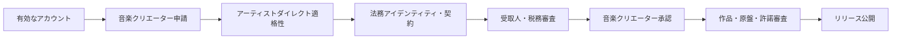

音楽クリエーター承認は、作品の権利保有、配信許諾、分配割合または議会参加資格を自動的に証明しない。作品ごとに著作権、原盤権、実演家、地域、期間、TuneCore等の外部委託範囲および競合する許諾を確認し、有効な権利スナップショットが成立した版だけを公開する。

実名、契約書、本人確認資料、税務情報および口座情報は株式会社の制限領域で扱い、公開チェーンへ保存しない。公開資格証明を使う場合も、失効可能な最小限の参照とし、審査原文を公開しない。本番経路全体は[本番サービスライフサイクル仕様](/protocol/specs/production-service-lifecycle)に従う。

## 5.1 本章の目的

Creator First Platform における音楽クリエーター登録は、単なるアカウント作成ではない。

音楽を配信し、その利用に基づく報酬を受け取るためには、

- 誰が登録しているのか
- 誰が作品の権利を持っているのか
- 誰が配信を許諾できるのか
- 誰へ報酬を分配すべきか

を確認する必要がある。

一方、確認手続を過度に複雑にすれば、新人や独立系音楽クリエーターほど参加しにくくなる。

したがって Creator First Platform では、

> **参加のしやすさと権利確認の厳格さを分離し、段階的な登録・検証モデルを採用する。**

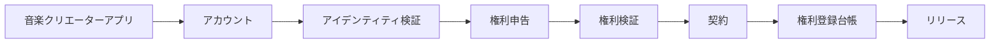

本章では、音楽クリエーターが参加してから作品を公開し、報酬を受け取るまでの基本構造を定義する。

---

## 5.2 音楽クリエーター中心の入口

Creator First Platformが中心対象とする音楽クリエーターは、メジャーレーベルに属さず、制作、流通、マーケティングおよびファンとの関係について重要な判断を自ら行うアーティストダイレクト型の独立系アーティストである。

この適格性を満たす参加形態として、特に、

- 新人・独立系のアーティスト
- アーティスト自身が統制するバンド、グループまたは制作チーム
- 地域またはニッチジャンルで活動するアーティストダイレクト型の音楽クリエーター
- アーティスト自身が統制する小規模独立レーベルを活動形態とする音楽クリエーター

が参加できる環境を重視する。

作詞家、作曲家、実演家であるという役割だけでは、音楽クリエーター登録の適格性を自動的には満たさない。本人がアーティスト活動の重要判断を統制する場合は音楽クリエーターとして登録でき、それ以外の場合は共同制作者または権利者として権利・分配情報に参加する。小規模独立レーベルも、それ自体を音楽クリエーターとはみなさず、アーティストが統制する活動形態または法人上の契約主体として扱う。

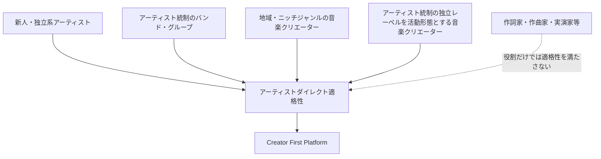

「新人であること」や「再生実績が少ないこと」を登録上の不利益にはしない。

制作会社、マネジメント、音楽出版社、TuneCore等の音楽配信代行・著作権管理サービスその他の専門家を利用していても、それだけで対象外にはならない。重要なのは、業務を内製しているかではなく、アーティストが委託先、契約範囲、リリース方針、マーケティング方針およびファンとの関係を実質的に統制しているかである。

ただし、**参加しやすいことと、権利確認を省略することは別である。**

---

## 5.3 登録の基本原則

音楽クリエーター登録は次の原則に従う。

### 低い参加障壁

参加手続は可能な限り簡潔にする。

### 分配より権利を優先

権利関係を確認できない作品について、自動的に報酬分配を確定しない。

### 段階的検証

最初からすべての確認を要求せず、利用する機能に応じて検証レベルを上げる。

### アーティストダイレクト適格性

メジャーレーベルとの所属・専属関係、制作・流通・マーケティングの決定権、原盤と配信許諾の管理範囲、外部委託契約および利益相反を確認する。自己申告やウォレット所有だけで適格性を確定しない。

### 音楽クリエーター制御

音楽クリエーター自身が登録情報、権利情報、分配情報を確認できるようにする。

### 説明可能なレビュー

登録拒否、保留、権利確認要求などの理由を可能な範囲で説明する。

### 人による異議申立て

自動判定だけで最終的な権利判断を行わず、人による異議申立て経路を設ける。

---

## 5.4 段階的オンボーディング

登録を一度に完了させるのではなく、段階的に行う。

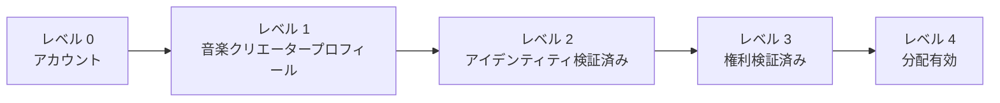

### レベル 0 — アカウント

基本アカウントを作成する。

### レベル 1 — 音楽クリエータープロフィール

アーティスト名、プロフィール、ジャンル等を登録する。

### レベル 2 — アイデンティティ検証済み

本人または法人・団体の確認を行う。

### レベル 3 — 権利検証済み

作品ごとの配信権限や権利情報を確認する。

### レベル 4 — 分配有効

報酬受取に必要な情報を確認し、分配を有効化する。

この方式により、プロフィール作成段階から過剰な書類提出を要求することを避ける。

---

## 5.5 アカウントと公開プロフィール

音楽クリエーターの内部アカウント情報と、ユーザに表示する公開プロフィールは分離する。

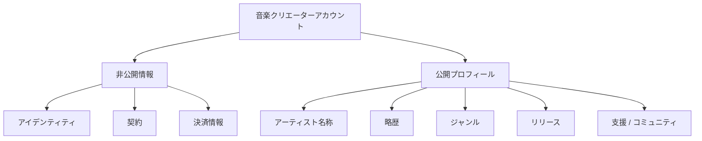

本人確認情報や税務・支払情報を公開プロフィールへ表示しない。

---

## 5.6 本人確認

報酬を受け取る音楽クリエーターについては、法令、決済、税務、不正防止等の要件に応じて本人確認を行う。

登録主体によって必要な確認は異なる。

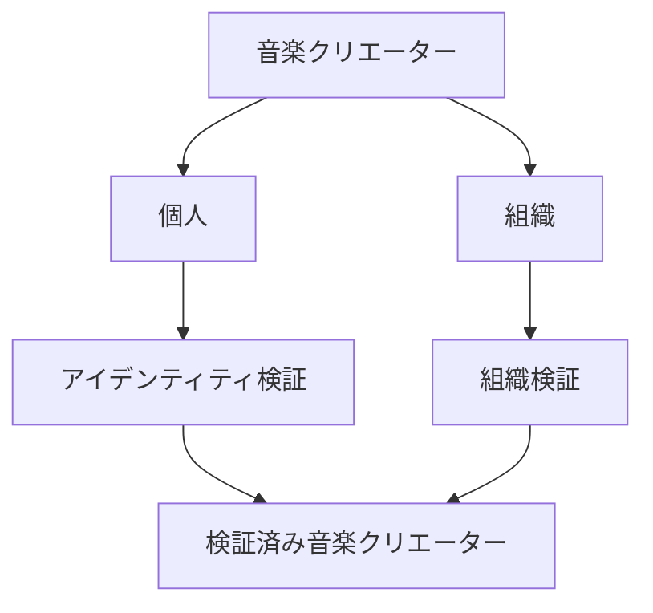

確認情報は必要最小限とし、安全なオフチェーン環境で管理する。

本人確認済みであることと、作品の著作権・マスター権を保有していることは別の問題であるため、次に権利確認を行う。

---

## 5.7 作品登録

音楽クリエーターは作品ごとに基本情報を登録する。

想定する情報には次が含まれる。

- 作品名
- アーティスト名
- 音源
- 作詞者
- 作曲者
- 実演家
- レコード製作者
- 音楽出版社等
- ISRC等の識別子
- リリース情報
- 配信可能地域
- 権利管理状況
- 音楽配信代行・著作権管理サービスと契約範囲
- 分配先
- 分配比率

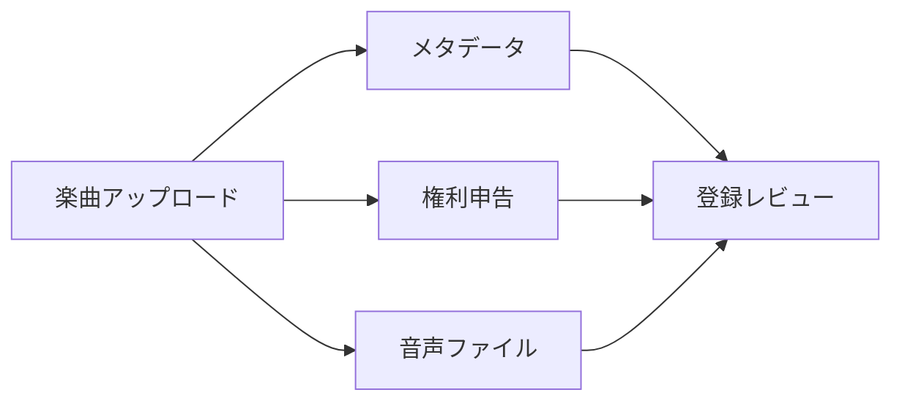

独立系音楽クリエーター向けには、複雑な権利用語を理解していなくても入力できるガイド型UIを用意する。

---

## 5.8 権利申告

作品登録時には、「自分が作者である」という一つの質問だけでは不十分である。

例えば、

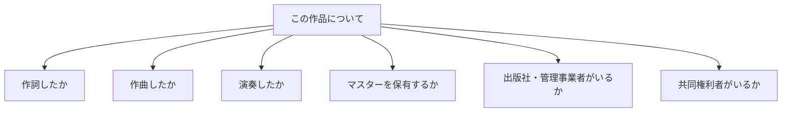

のように、役割を分けて申告する。

これにより、音楽クリエーター自身にも権利構造を理解しやすくする。

---

## 5.9 権利確認

すべての作品について同じ審査を行う必要はない。

リスクに応じた確認方式を採用する。

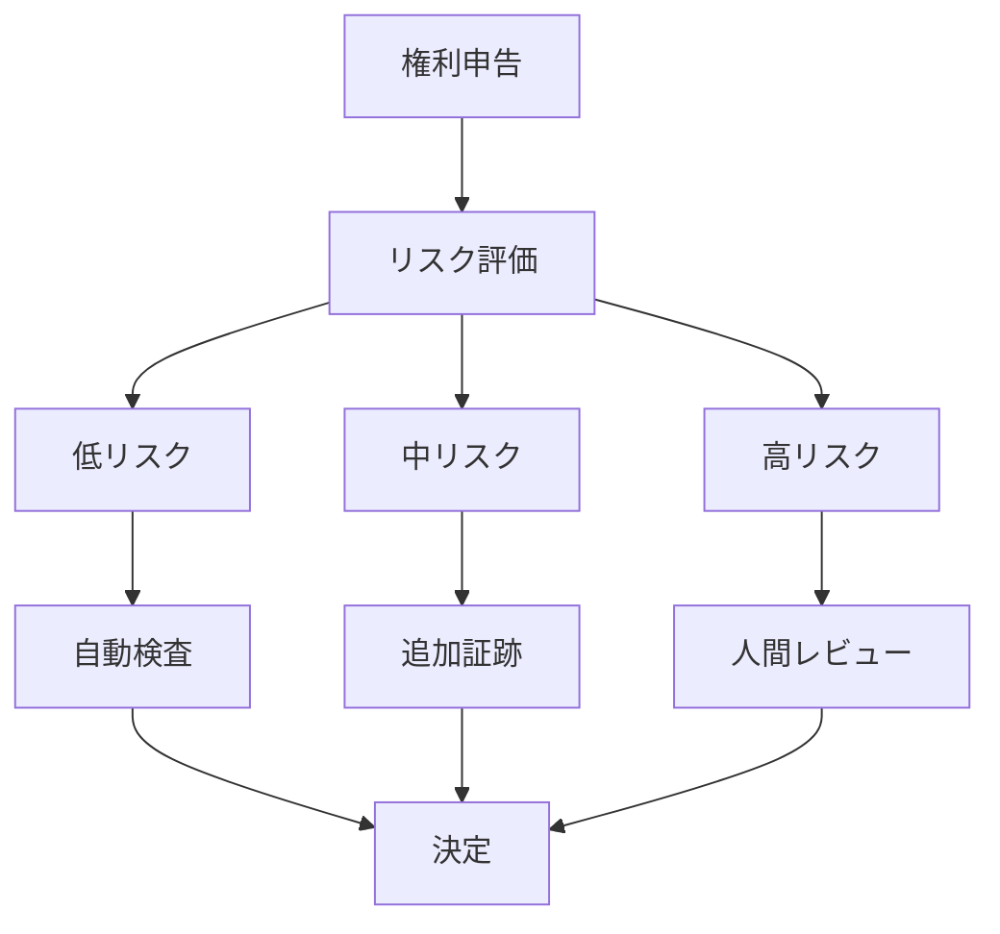

確認には、登録情報、既存識別子、契約資料、外部権利情報、重複登録、権利者からの申立て等を利用できる。

---

## 5.10 権利登録台帳への登録

権利確認が完了した作品は、第3章で定義した権利登録台帳と接続する。

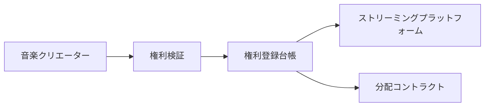

権利登録台帳は「著作権そのもの」を作るものではなく、プラットフォームが配信と分配に利用する検証済み権利情報を管理する。

---

## 5.11 共同制作作品

現代の音楽制作では、複数の音楽クリエーターが一つの作品へ関与することが多い。

そのため、登録者一人の申告だけで全権利を確定する設計にはしない。

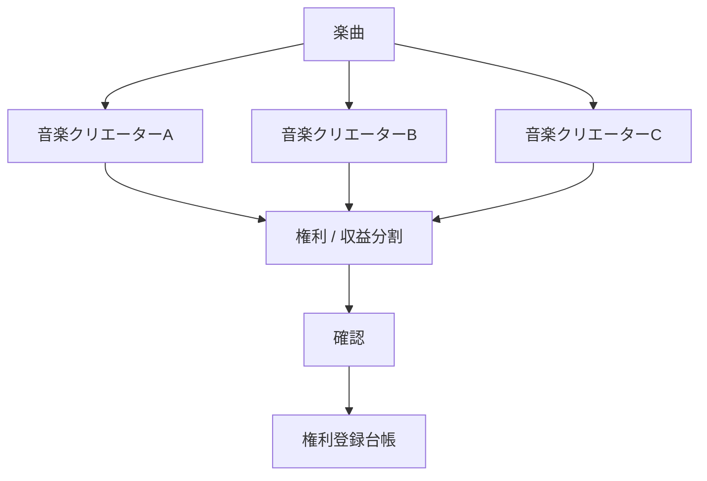

可能な場合には共同権利者へ確認を求め、分配比率を明示する。

未確認の部分が存在する場合には、その状態を登録台帳に記録する。

---

## 5.12 分配先の登録

権利者と実際の支払先が同一とは限らない。

例えば、

- 個人音楽クリエーター
- バンド
- レーベル
- 出版社
- 制作会社
- 共同制作者

など複数の分配先が存在し得る。

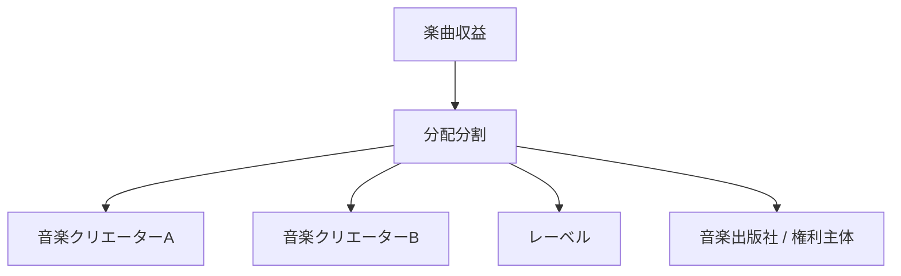

スマートコントラクトを利用する場合でも、分配先変更には適切な認証・確認手続を要求する。

---

## 5.13 配信契約

作品公開前に、運営株式会社と音楽クリエーターまたは権利者との間で配信に必要な契約関係を成立させる。

契約では少なくとも、

- 配信許諾の範囲
- 対象地域
- 契約期間
- 報酬・分配
- 権利保証
- 権利侵害時の対応
- 公開停止
- 契約終了
- 登録情報変更
- ガバナンスとの関係

などを明確化する。

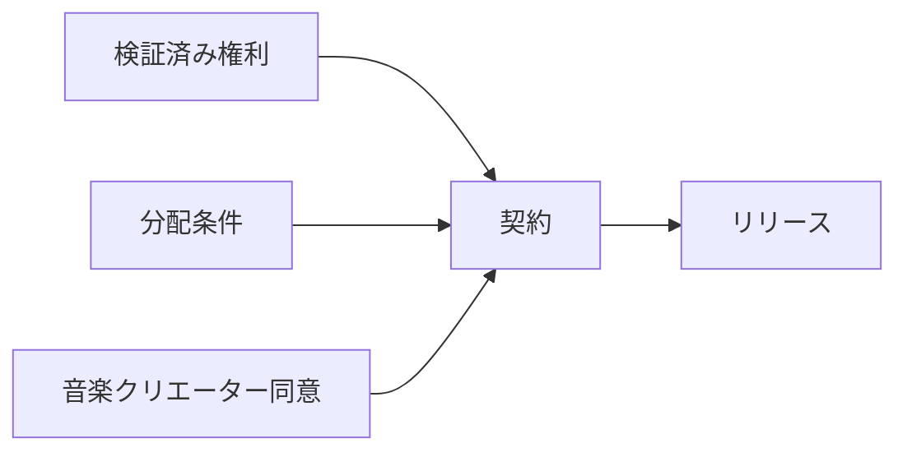

ガバナンスによってプロトコルルールが変更される場合にも、既存契約や法令との整合性を確認する。

---

## 5.14 公開前チェック

作品公開前に、最低限の技術的・権利的チェックを行う。

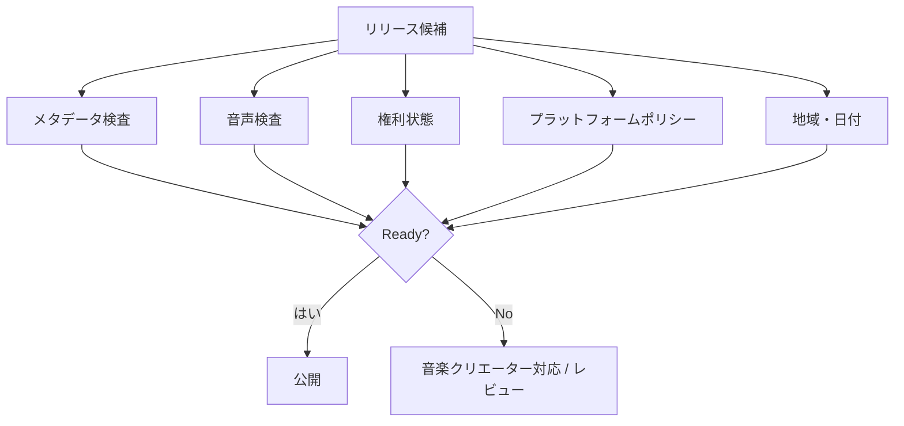

審査は作品の芸術的価値を評価するためのものではない。

原則として、法令、権利、技術要件、プラットフォームの明示的ルールへの適合を確認する。

---

## 5.15 新人を不利にしない審査

過去の再生数、SNSフォロワー数、レーベル所属、知名度などを、権利確認の代替指標にしない。

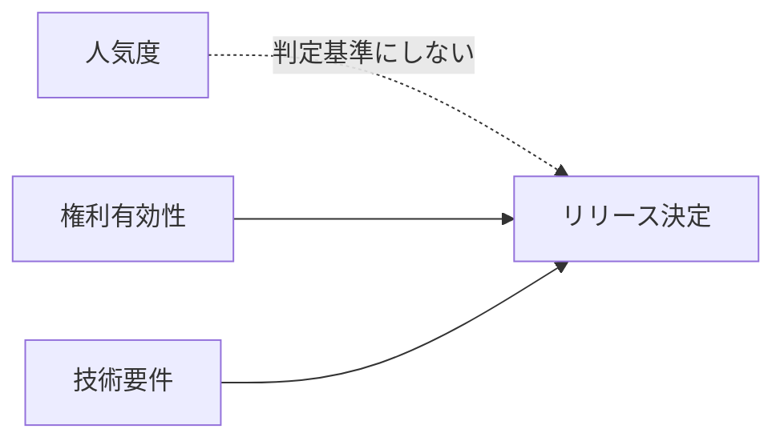

Creator First Platform における登録審査は、

> **人気があるか**

ではなく、

> **正当に配信できる作品か**

を中心に判断する。

---

## 5.16 発見機会への接続

登録された新人音楽クリエーターが、単に巨大なカタログの中へ埋もれるだけでは音楽クリエーター中心とは言えない。

登録後は発見レイヤーと接続する。

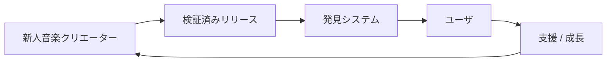

ただし、新人であるという理由だけで強制的にユーザへ推薦するのではなく、ユーザの利便性・選択権と公平な発見機会を両立させる。

詳細は第8章「発見とコミュニティ」で扱う。

---

## 5.17 「推し活」と初期支援

Creator First Platform では、ユーザが新人を発見し、その成長を支える体験を重要な価値の一つとして設計できる。

例えば、

- フォロー
- 初期支援
- 成長支援プール
- コミュニティ推薦
- 新人発見プレイリスト
- 成長履歴の可視化

などが考えられる。

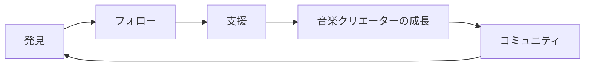

ただし、金銭的支援の大きさが推薦順位やガバナンス権力をそのまま購入できる仕組みにはしない。

---

## 5.18 AI生成音楽への対応

生成AIによって制作された音楽については、単純な全面禁止または無条件許可ではなく、権利・透明性・市場健全性の観点からルールを設計する必要がある。

確認すべき事項には、

- 登録者が配信に必要な権利を持つか
- 第三者の権利を侵害していないか
- AI利用の表示が必要か
- 大量自動生成によるスパムではないか
- なりすましや声の無断利用がないか

などがある。

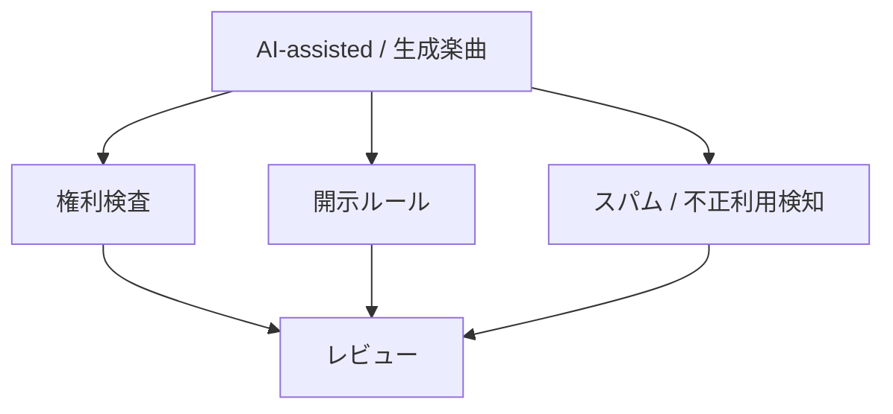

AIを利用したという事実だけで音楽クリエーターを排除するのではなく、権利と透明性を中心に扱う。

---

## 5.19 権利侵害申立て

公開後に第三者から権利侵害の申立てが行われる場合がある。

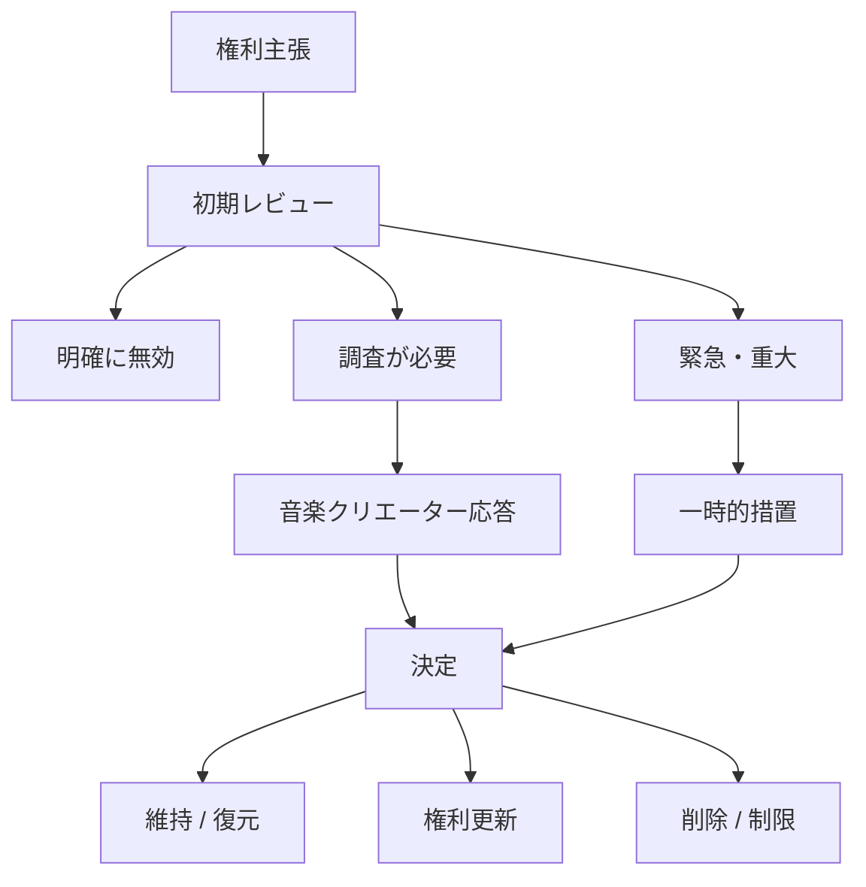

自動申立てだけで恒久的な削除や報酬没収を確定させない。

---

## 5.20 異議申立て

音楽クリエーターは、

- 登録拒否
- 権利確認保留
- 配信停止
- 分配保留
- 不正判定

などについて異議申立てできる。

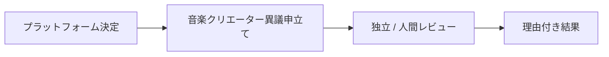

音楽クリエーター中心の理念上、**説明可能性と救済手続**は重要な要素となる。

---

## 5.21 権利情報の変更

作品公開後にも、権利関係が変化する場合がある。

例えば、

- 出版契約の変更
- レーベル契約
- 権利譲渡
- 共同制作者の追加
- 分配比率変更
- 相続

などである。

```mermaid
flowchart LR
    OLD[現在権利状態]
    REQUEST[変更リクエスト]
    VERIFY[検証]
    NEW[新規権利状態]

    OLD --> REQUEST
    REQUEST --> VERIFY
    VERIFY --> NEW
    NEW --> HISTORY[変更不能変更履歴]
```

最新状態を更新しつつ、過去の分配時点でどの権利状態が適用されていたかを追跡できるようにする。

---

## 5.22 アカウントと権利の分離

音楽クリエーターのアカウントが停止・削除された場合でも、作品の法的権利が消えるわけではない。

したがって、

```mermaid
flowchart TD
    ACCOUNT[音楽クリエーターアカウント]
    RIGHTS[法務権利]
    REG[権利登録台帳]

    ACCOUNT --> PROFILE[プラットフォームアクセス]
    RIGHTS --> REG

    PROFILE -.->|削除されても| RIGHTS
```

アカウント、権利、契約、支払債権を別の概念として管理する。

---

## 5.23 プライバシー

本人確認資料、住所、銀行口座、税務情報、契約書などをパブリックチェーンへ保存しない。

```mermaid
flowchart LR
    PRIVATE[非公開音楽クリエーターデータ]
    PRIVATE --> SECURE[安全なオフチェーンストレージ]

    SECURE --> HASH[ハッシュ / 参照]
    HASH --> CHAIN[オンチェーン記録]
```

オンチェーンには必要に応じて、

- ID
- 状態
- 公開鍵
- ハッシュ
- 分配アドレス
- 有効期間

など、最小限の情報のみを記録する。

---

## 5.24 音楽クリエーターダッシュボード

音楽クリエーター自身が、自分の作品と経済状態を確認できるダッシュボードを提供する。

```mermaid
flowchart TD
    DASH[音楽クリエーターダッシュボード]

    DASH --> TRACKS[楽曲]
    DASH --> RIGHTS[権利状態]
    DASH --> USAGE[利用実績]
    DASH --> MONEY[収益 / 分配]
    DASH --> DISC[発見]
    DASH --> GOV[ガバナンス]
```

特に、

> **なぜこの金額になったのか**

を可能な限り追跡できることが重要である。

単なる再生数表示ではなく、利用実績、分配ルール、権利比率、成長支援プール等との関係を説明できる設計を目指す。

---

## 5.25 音楽クリエータ院議会への参加

登録音楽クリエーターが一定の要件を満たした場合、音楽クリエータ院議会のガバナンスへ参加できる。

ただし、

> **楽曲を1曲登録すれば無条件で大量の投票アカウントを作れる**

ような仕組みにはしない。

```mermaid
flowchart LR
    REGISTERED[登録済み音楽クリエーター]
    VERIFIED[検証済み音楽クリエーター]
    ELIGIBLE[ガバナンス適格性]
    HOUSE[音楽クリエータ院議会]

    REGISTERED --> VERIFIED
    VERIFIED --> ELIGIBLE
    ELIGIBLE --> HOUSE
```

本人性、活動実態、シビル耐性、公平性などを考慮して参加条件を設計する。

詳細は第7章「ガバナンス」で扱う。

---

## 5.26 登録から分配までの全体フロー

```mermaid
sequenceDiagram
    participant C as 音楽クリエーター
    participant P as 音楽クリエーターポータル
    participant Corp as 株式会社
    participant R as 権利登録台帳
    participant S as ストリーミングプラットフォーム
    participant O as 利用実績オラクル
    participant SC as スマートコントラクト

    C->>P: 創作 account
    C->>P: 音楽クリエータープロフィール
    C->>Corp: アイデンティティ verification
    C->>P: アップロード track / rights declaration
    P->>Corp: 権利 review
    Corp->>R: 登録簿 verified rights
    Corp->>S: Approve release
    S-->>C: 楽曲 published
    S->>O: 検証済み usage data
    O->>SC: 利用実績 commitment / proof
    R->>SC: 権利 / split data
    SC-->>C: 分配
```

この流れでは、アカウント作成から報酬分配までを一つのブラックボックスにせず、それぞれの段階の状態を音楽クリエーターが確認できるようにする。

---

## 5.27 MVPでの登録方式

初期段階から完全自動の権利判定システムを構築することは現実的ではない。

MVPでは、

```mermaid
flowchart LR
    MVP1[アプリケーション]
    MVP2[アイデンティティ検査]
    MVP3[権利申告]
    MVP4[人間レビュー]
    MVP5[リリース]
    MVP6[分配]

    MVP1 --> MVP2 --> MVP3 --> MVP4 --> MVP5 --> MVP6
```

という比較的単純な構成から開始できる。

初期段階では登録音楽クリエーター数を限定し、人による確認を多く残すことで、実際にどのような権利問題が発生するかを学習する。

その後、定型的な確認から自動化する。

---

## 5.28 将来的な登録方式

プラットフォームが成長した場合には、

- 外部権利データベースとの照合
- ISRC等による自動照合
- 電子署名
- 検証可能資格証明
- 組織アカウント
- 権利 API
- 自動重複検出
- AIによる審査支援
- オンチェーン証明

などを導入できる。

```mermaid
flowchart LR
    HUMAN[人間レビュー]
    AUTO[自動検証]
    VC[検証可能資格証明]
    RIGHTSAPI[権利 API]
    AI[AI 支援]

    HUMAN --> HYBRID[ハイブリッド権利検証]
    AUTO --> HYBRID
    VC --> HYBRID
    RIGHTSAPI --> HYBRID
    AI --> HYBRID
```

ただしAIは審査支援に利用しても、権利紛争の最終的な法的判断主体とはしない。

---

## 5.29 3つの憲章との関係

音楽クリエーター登録制度も、プラットフォームの3つの憲章に従う。

登録者を増やすこと、権利審査を効率化すること、収益を最大化することよりも、憲章上の原則を優先する。

```mermaid
flowchart TD
    CONST[3つの憲章]

    CONST --> ONBOARD[音楽クリエーター登録]
    CONST --> RIGHTS[権利レビュー]
    CONST --> DISC[発見]
    CONST --> MONEY[分配]

    ONBOARD --> PLATFORM[Creator First Platform]
    RIGHTS --> PLATFORM
    DISC --> PLATFORM
    MONEY --> PLATFORM
```

例えば、新人を支援するという目的があっても、第三者の権利を侵害する作品を優遇することはできない。

また、不正防止を理由に、すべての音楽クリエーターへ不必要な監視や過剰な個人情報提出を要求することも避ける。

---

## 5.30 本章のまとめ

Creator First Platform における音楽クリエーター登録は、

> **アカウントを作って音源をアップロードするだけの処理ではない。**

音楽クリエーター、作品、権利、契約、分配、ガバナンスを接続する入口である。

```mermaid
flowchart LR
    CREATOR[音楽クリエーター]
    ID[アイデンティティ]
    RIGHTS[権利]
    CONTRACT[コントラクト]
    RELEASE[リリース]
    DISCOVERY[発見]
    MONEY[分配]
    GOV[ガバナンス]

    CREATOR --> ID
    ID --> RIGHTS
    RIGHTS --> CONTRACT
    CONTRACT --> RELEASE
    RELEASE --> DISCOVERY
    RELEASE --> MONEY
    CREATOR --> GOV
```

目指すのは、

> **新人でも参加しやすく、権利者には安全で、ユーザには信頼でき、音楽クリエーター自身が自分の権利と収益を理解できる登録制度**

である。

このオンボーディングが、Creator First Platform の経済とガバナンスへ参加するための基盤となる。
