# 6. 経済モデル — Economic Model

## 6.1 本章の目的

Creator First Platform の経済モデルは、単に「1再生あたりいくら支払うか」を決めるものではない。

プラットフォームには、

- クリエイターへの公正な還元
- 新人・未発見クリエイターの成長機会
- 利用者の満足度
- 権利者への適切な支払い
- インフラ・法務・運営費用
- 不正利用への耐性
- 長期的な事業継続性

を同時に成立させる必要がある。

したがって本プラットフォームでは、

> **利用実績による基本分配、利用者による明示的な支持、成長支援、持続可能な運営を分離し、複数の経済メカニズムを組み合わせる。**

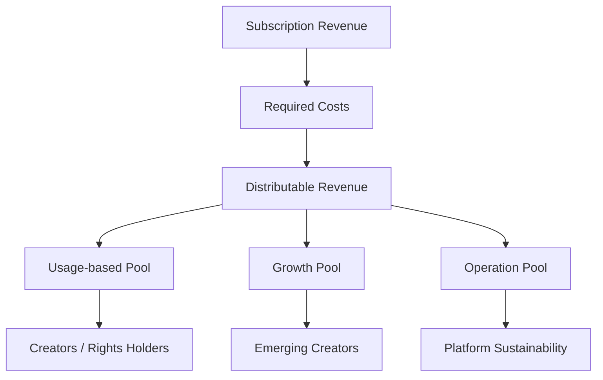

::: info 数式について
本章の数式は、経済モデルの構造を説明するための **概念モデル** である。

現時点で最終的な分配アルゴリズム、係数、比率を確定するものではない。実際のパラメータは、実証データ、法務・会計上の要件、経済シミュレーション、ガバナンスを通じて決定する。
:::

---

## 6.2 経済モデルの基本原則

### Creator Sustainability

クリエイターが継続的に創作できる経済環境を目指す。

### User Value

クリエイター支援のために利用者の利便性や満足度を犠牲にしない。

### Transparent Rules

分配ルール、控除項目、主要パラメータを可能な限り明確にする。

### Fair Opportunity

人気の平等ではなく、発見される機会と参加機会の公平性を重視する。

### Rights First

権利関係を無視して経済的効率だけを追求しない。

### Sustainable Platform

運営費を極端に削減してサービスの品質、安全性、法令遵守を損なわない。

### Governed Economics

重要な経済パラメータを運営企業だけの裁量で変更しない。

---

## 6.3 サブスクリプションモデル

基本的な収益源は月額サブスクリプションを想定する。

利用者にとっては、既存の音楽ストリーミングサービスに近い単純な料金体系を基本とする。

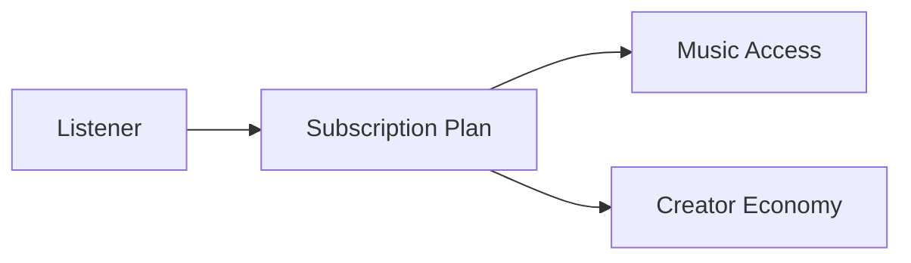

初期段階では複雑な投機的トークン経済を利用者へ要求せず、JPYC等の承認済み法定通貨連動型ステーブルコインによる単純な定額決済を中心とする。ETH等の価格変動するNative Tokenはサービス料金ではなく、必要に応じてRelayerまたはPaymasterが抽象化するNetwork Feeとして扱う。

将来的には複数プランや追加的な Creator Support 機能を検討できるが、基本アクセスと投機的トークン保有を結び付けない。

---

## 6.4 売上と分配可能額

利用者が支払ったサブスクリプション料金全額を、そのままスマートコントラクトへ送るわけではない。

概念的には、分配設計の対象となる純額 $R_d$ を、

$$
R_d = R_g - T - P - C_r - C_o
$$

と表す。

ここで、

- $R_g$：総収入
- $T$：税等
- $P$：決済関連費用
- $C_r$：契約・権利処理上必要な費用
- $C_o$：その他、分配前に必要となる明示的費用
- $R_d$：分配設計の対象となる純額

とする。

::: info 透明性の対象
重要なのは「手数料ゼロ」を約束することではなく、**どの費用が、なぜ、どの段階で控除されるかを説明できること**である。
:::

---

## 6.5 三つの主要プール

分配可能額を、目的の異なる複数のプールへ配分する。

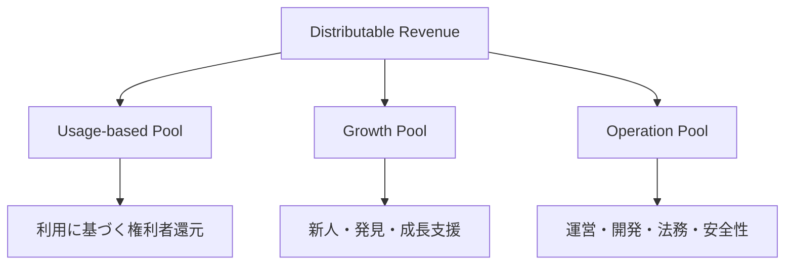

Usage-based Pool、Growth Pool、Operation Pool の比率をそれぞれ $\alpha$、$\beta$、$\gamma$ とすると、

$$
\alpha + \beta + \gamma = 1
$$

である。

各プールの額は、

$$
U = \alpha R_d
$$

$$
G = \beta R_d
$$

$$
O = \gamma R_d
$$

と表せる。

あるいはまとめて、

$$
U = \alpha R_d,\qquad
G = \beta R_d,\qquad
O = \gamma R_d
$$

と表記できる。

$\alpha$、$\beta$、$\gamma$ はホワイトペーパー段階では固定しない。

市場環境、事業コスト、クリエイターへの還元、利用者価値を検証した上で決定し、重要な変更はガバナンス対象とする。

---

## 6.6 Usage-based Pool

Usage-based Pool は、実際に利用された作品と、その権利者への基本的な還元を担う。

最も単純な概念モデルでは、作品 $i$ の有効利用量を $p_i$ とすると、その作品への分配額 $D_i$ を、

$$
D_i =
U
\frac{p_i}
{\sum_j p_j}
$$

と表せる。

ただし Creator First Platform では、生の再生回数をそのまま $p_i$ とすることを前提にしない。

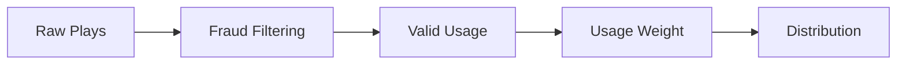

再生時間、不正判定、重複、権利状態などを考慮した **Valid Usage** を利用する。

---

## 6.7 有効利用量

生の再生回数 $n_i$ と、分配計算に使う有効利用量 $p_i$ は区別する。

概念的には、

$$
p_i =
\sum_{e \in E_i}
w_e\,v_e
$$

のように表現できる。

ここで、

- $E_i$：作品 $i$ に関する利用イベント集合
- $v_e$：イベント $e$ が有効であるか、または有効度を表す値
- $w_e$：再生時間等に基づく重み

とする。

例えば不正と判定されたイベントは $v_e = 0$ とすることが考えられる。

ただし、具体的な検証ルールは Usage Oracle と不正対策の仕様で決定する。

---

## 6.8 「1再生 = 固定単価」ではない

サブスクリプション型サービスでは、毎月の収入、利用量、契約条件などが変化する。

そのため、

> **すべての再生に恒久的な固定単価を保証する**

というモデルは採用しない。

例えば、ある期間における作品 $i$ の実効的な1利用単位あたり分配額を $r_i$ とすれば、

$$
r_i =
\frac{D_i}{p_i}
$$

と事後的に計算することはできる。

しかし $r_i$ を事前に固定するわけではない。

クリエイターダッシュボードでは、単に金額だけではなく、計算根拠を確認できるようにする。

---

## 6.9 User-Centric な要素

全利用者の再生を一つの巨大なプールへ集約する方式だけでなく、

> **ある利用者が支払った価値を、その利用者が実際に支持したクリエイターへより強く結び付ける**

User-Centric 的な考え方を導入できる。

利用者 $u$ の分配対象額を $B_u$、その利用者による作品 $i$ の有効利用重みを $w_{u,i}$ とすると、

$$
D_{u,i}
=
B_u
\frac{w_{u,i}}
{\sum_j w_{u,j}}
$$

と表せる。

利用者 $u$ から作品 $i$ への配分 $D_{u,i}$ を全利用者について合計すれば、

$$
D_i =
\sum_u D_{u,i}
$$

となる。

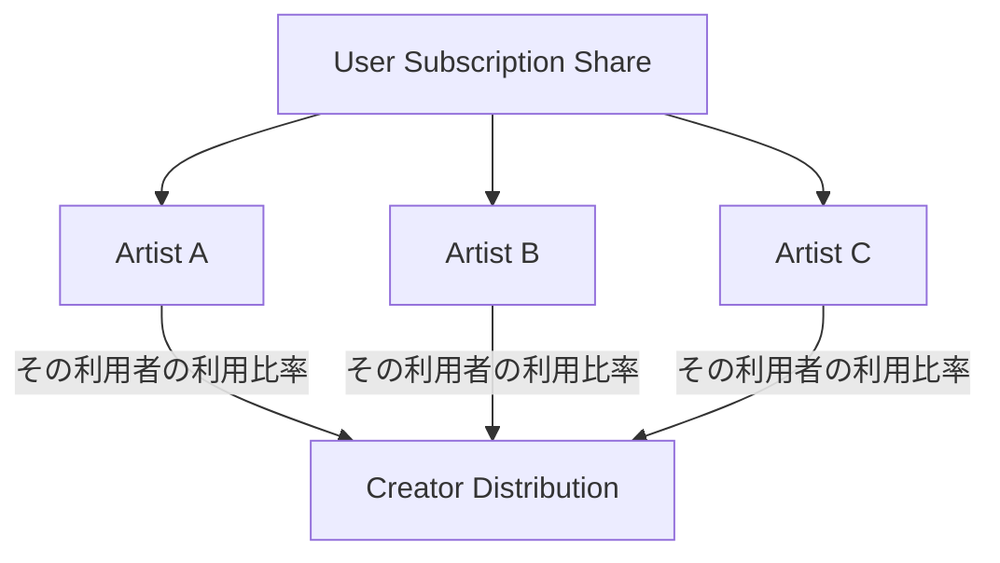

完全な User-Centric 方式が常に最適とは限らないため、実証データをもとに評価する。

---

## 6.10 明示的な「推し」支援

利用者の再生行動だけでなく、

> **このクリエイターを応援したい**

という意思を反映する仕組みを設けることができる。

例えば、利用者 $u$ の分配可能な価値 $B_u$ のうち、明示的支援に利用する割合を $\lambda_u$ とすれば、

$$
0 \leq \lambda_u \leq 1
$$

であり、

$$
B_u^{\mathrm{usage}}
=
(1-\lambda_u)B_u
$$

$$
B_u^{\mathrm{support}}
=
\lambda_u B_u
$$

と分離できる。

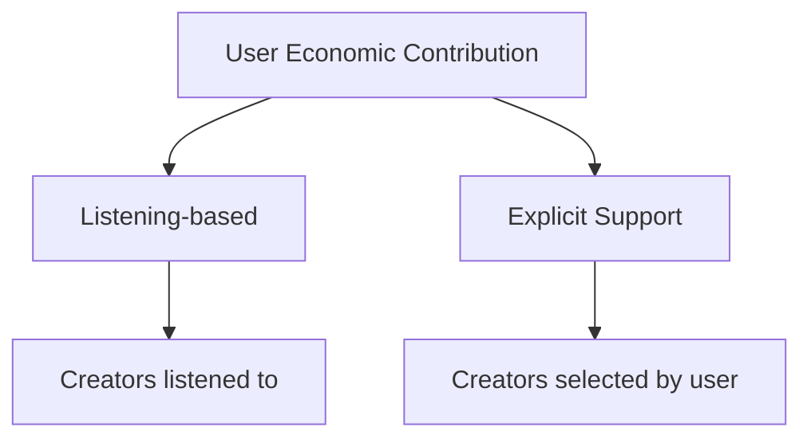

これにより、「たくさん聴いた」と「応援したい」を別のシグナルとして扱える。

---

## 6.11 Growth Pool

再生実績だけで分配すると、すでに大きな利用量を持つ作品へ資金が集中しやすい。

そこで、Usage-based Poolとは別に **Growth Pool** を設ける。

Growth Pool の目的は、

> **人気を人工的に平等化することではなく、まだ十分に発見されていないクリエイターに成長機会を提供すること**

である。

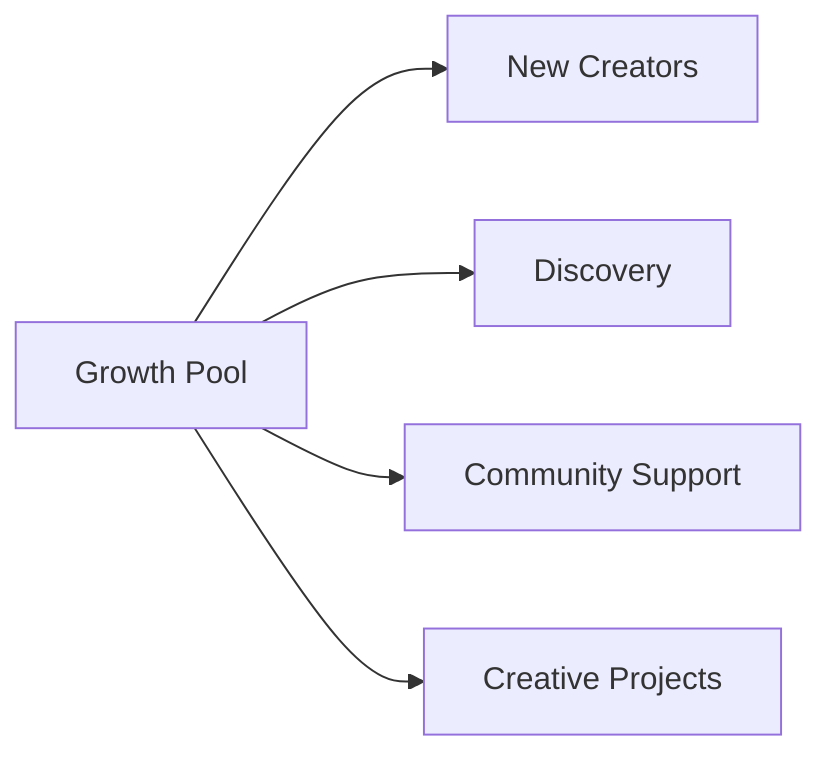

---

## 6.12 Growth Score

Growth Pool の配分に単純な再生数ランキングを使えば、Usage-based Pool と同じ集中が起きる。

そこで、複数の要素を使った Growth Score を検討する。

作品またはクリエイター $i$ の Growth Score を $G_i$ とすると、

$$
G_i =
f\!\left(
S_i,
N_i,
E_i,
C_i,
Q_i
\right)
$$

のような一般形で表せる。

ここで、

- $S_i$：利用者からの支持
- $N_i$：新規性・活動段階
- $E_i$：継続的なエンゲージメント
- $C_i$：コミュニティからの支持
- $Q_i$：不正耐性を含む適格性

などである。

::: warning Growth Score は未確定
関数 $f$ は現時点では定義していない。

これは「どのような情報を考慮し得るか」を示す概念式であり、最終的なランキング式や分配式ではない。
:::

---

## 6.13 Growth Pool の概念的配分

Growth Score が確定したと仮定した場合、単純な正規化モデルとして、

$$
M_i =
G
\frac{G_i}
{\sum_j G_j}
$$

と表せる。

ここで、

- $G$：Growth Pool の総額
- $G_i$：対象 $i$ の Growth Score
- $M_i$：Growth Pool からの配分額

である。

ただし実際には上限、下限、適格条件、カテゴリ別配分などを設ける可能性がある。

---

## 6.14 Quadratic Funding

Growth Pool の一部では、Quadratic Funding の考え方を利用できる。

基本的な発想は、

> **一人の大口支援者から大きな金額を集めたプロジェクトより、多数の独立した利用者から支持されたプロジェクトを強く評価する**

ことである。

クリエイターまたはプロジェクト $i$ への、利用者 $u$ の支援額を $c_{u,i}$ とすると、Quadratic Funding の基礎的なスコアを、

$$
Q_i =
\left(
\sum_u \sqrt{c_{u,i}}
\right)^2
$$

と表せる。

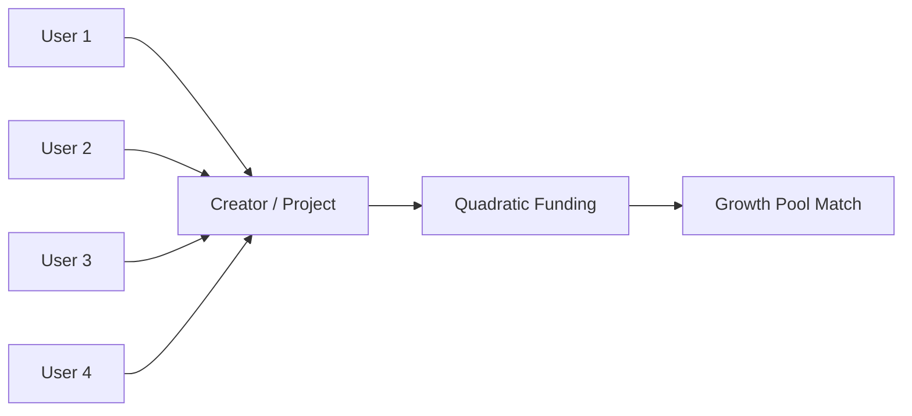

ただし、この $Q_i$ をそのまま配分額とするわけではない。

実際のマッチングでは、直接支援額を除いたマッチング需要、Growth Pool の上限、Sybil Resistance、各種キャップ等を考慮する必要がある。

---

## 6.15 Quadratic Funding のマッチング概念

プロジェクト $i$ への直接支援総額を、

$$
C_i =
\sum_u c_{u,i}
$$

とする。

Quadratic Funding による追加的なマッチング需要の概念値を、

$$
M_i^{*}
=
Q_i - C_i
$$

と置くことができる。

実際の Growth Pool が有限であるため、マッチング需要総額が利用可能額を超える場合には正規化が必要となる。

例えばマッチングに利用できる額を $G_Q$ とすると、

$$
M_i
=
G_Q
\frac{M_i^{*}}
{\sum_j M_j^{*}}
$$

のようなモデルが考えられる。

これは説明用の一例であり、最終仕様ではない。

---

## 6.16 Sybil Resistance

Quadratic Funding では、一人が多数のアカウントへ支援を分割するとスコアを不正に高められる可能性がある。

したがって、利用者 $u$ に対する信頼重み $a_u$ を導入する概念も考えられる。

例えば、

$$
0 \leq a_u \leq 1
$$

として、

$$
Q_i =
\left(
\sum_u
a_u
\sqrt{c_{u,i}}
\right)^2
$$

とする。

ただし、$a_u$ の決定方法が新たな中央集権や差別を生まないよう慎重な設計が必要である。

---

## 6.17 Early Support

利用者が新人クリエイターを早期に発見し、応援すること自体をプラットフォーム体験の一部にする。

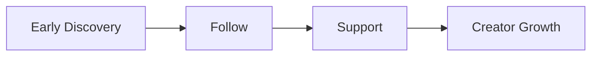

ただし Early Support を金融投資化しない。

「将来人気になれば金銭的リターンが得られる」ことを中心にすると、音楽発見ではなく投機市場になる。

Creator First Platform では、支援と証券的・投機的インセンティブを明確に分離する。

---

## 6.18 Support Reputation

初期から新人を発見した利用者に、金銭ではなくコミュニティ上の評価を与えることは考えられる。

例えば、

- Early Supporter
- Discovery Contributor
- Community Curator

などの履歴である。

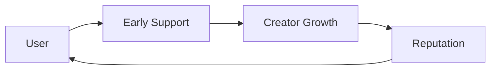

Reputation がガバナンス権力や推薦操作へ直接変換される場合には慎重な設計が必要になる。

---

## 6.19 Operation Pool

Creator First Platform が長期的に存続するには、運営費用が必要である。

Operation Pool は例えば、

- クラウド・CDN
- ソフトウェア開発
- セキュリティ
- 権利管理
- 法務
- 会計・税務
- カスタマーサポート
- 不正対策
- ガバナンス運営
- 監査

などに利用する。

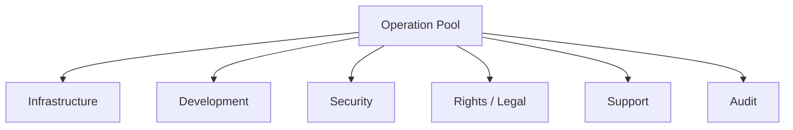

Creator First は「運営会社が利益を得てはいけない」という意味ではない。

重要なのは、

> **プラットフォームの利益最大化が、クリエイターと利用者の利益より常に優先される構造にしないこと**

である。

---

## 6.20 株式会社の利益

運営株式会社には、継続的な事業運営、研究開発、人材採用、リスク負担のための利益が必要である。

したがって、

$$
\mathrm{Corporate\ Profit} \geq 0
$$

を前提とする。

より重要なのは、利益がどの収益レイヤーから生じるのかを明確にすることである。

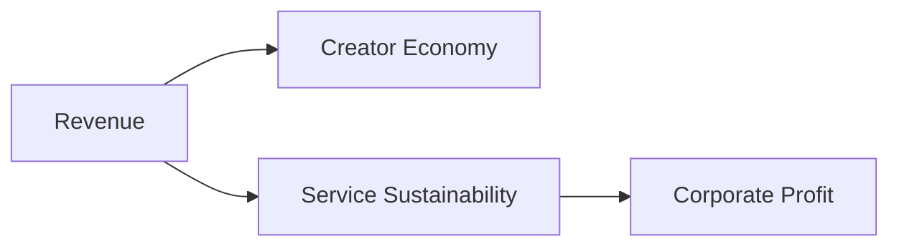

利益率や運営費がブラックボックス化し、クリエイターへの還元を一方的に圧縮できる構造は避ける。

---

## 6.21 Creator Share Floor

Creator First の理念をより強く制度化する場合、一定の分配可能額について Creator Economy に最低比率を設定することも検討できる。

Creator Economyへの最低配分比率を $\alpha_{\min}$ とすると、

$$
\alpha \geq \alpha_{\min}
$$

という制約をプロトコル上に設ける考え方である。

ただし、最低比率を固定しすぎると、法務・セキュリティ・インフラ費用が急増した場合の事業継続性を損なう可能性がある。

そのため実際には、憲章、ガバナンス、財務健全性を組み合わせて設計する。

---

## 6.22 不正再生への経済的耐性

再生数が金銭に変換される以上、不正再生には経済的インセンティブが生じる。

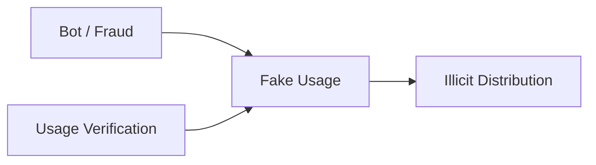

不正イベントの割合を $\phi$ とし、生の利用量を $p_i^{\mathrm{raw}}$ とした単純化例では、

$$
p_i^{\mathrm{valid}}
=
(1-\phi_i)
p_i^{\mathrm{raw}}
$$

のように表現できる。

実際には、不正判定は単一の比率ではなくイベント単位・アカウント単位・ネットワーク単位などで行う。

---

## 6.23 人気集中への対応

人気作品が多くの収益を得ること自体は自然である。

問題は、人気が推薦、再生、収益、さらに推薦という自己強化ループを形成し、新しい作品が参入できなくなることである。

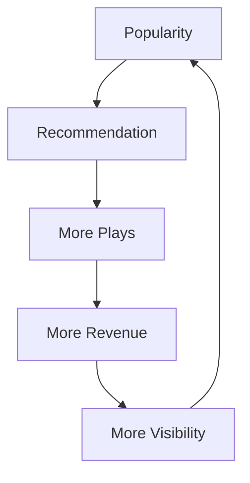

これに対し、

- Usage-based Pool は実利用を尊重する
- Growth Pool は成長機会を補完する
- Discovery は推薦機会を多様化する
- 利用者は推薦モードを選択できる

という複数レイヤーで対応する。

---

## 6.24 推薦と資金分配を完全には同一化しない

推薦アルゴリズムがそのまま収益分配アルゴリズムになると、プラットフォームが推薦を通じて資金配分を操作できる。

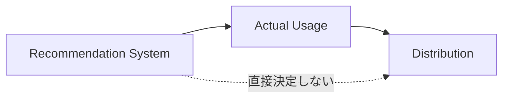

推薦は利用行動へ影響するが、推薦順位そのものを直接の報酬指標にはしない。

---

## 6.25 クリエイターへの追加支払い

サブスクリプション分配とは別に、利用者が任意でクリエイターを支援できる仕組みも検討する。

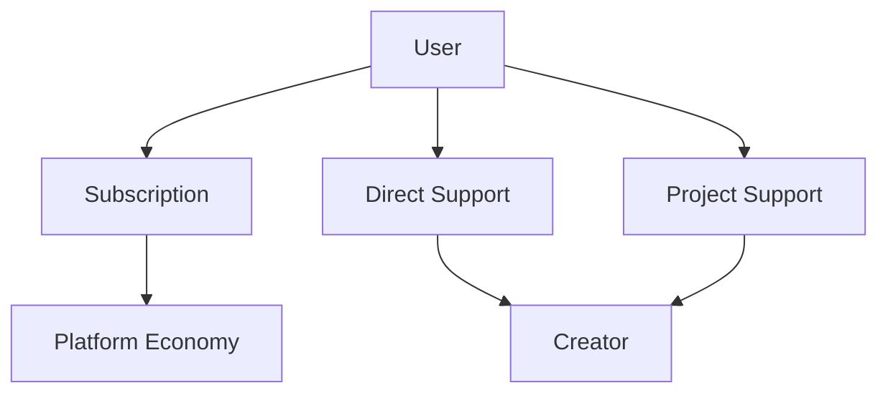

法的・決済上の要件を確認した上で、

- Tip
- Project Support
- Membership的支援
- 限定イベント等

を将来的な機能として検討できる。

---

## 6.26 トークンを経済モデルの前提にしない

Creator First Platform は、独自トークンの価格上昇によって成立する経済モデルを採用しない。

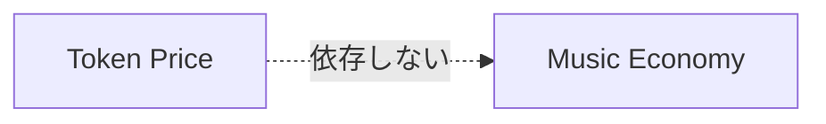

ガバナンスや技術上の必要性からトークンを検討する場合でも、

- 音楽サービスの利用価値
- クリエイター報酬
- 株式会社の事業収益

をトークン価格から分離する。

---

## 6.27 STOとの分離

運営株式会社が将来的に STO によって資金調達する場合でも、STO は音楽利用者への報酬分配とは別のレイヤーで扱う。

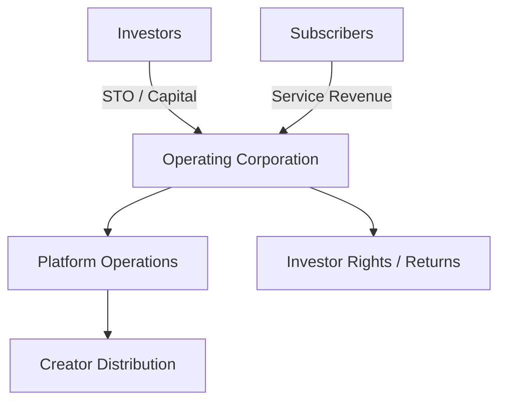

投資家の権利と、利用者・クリエイターによるプロトコルガバナンスを混同しないことが重要である。

詳細は第11章で扱う。

---

## 6.28 ガバナンス可能な経済パラメータ

重要な経済パラメータの一部は、Creator House と User House のガバナンス対象とする。

例えば、

- $\alpha$：Usage-based Pool 比率
- $\beta$：Growth Pool 比率
- $\gamma$：Operation Pool 比率
- Growth Pool の評価方式
- 不正利用に関するプロトコルルール
- 分配頻度
- 最低分配額
- Support Allocation の範囲
- 主要な分配アルゴリズム

などである。

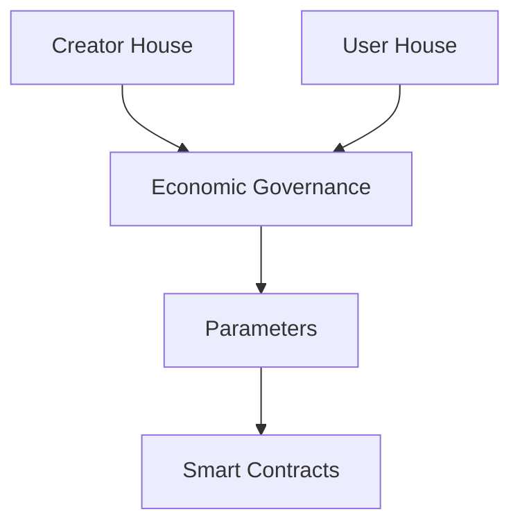

ただし、法定税、既存契約上の義務、法令遵守費用などを多数決で無効化することはできない。

---

## 6.29 経済パラメータの変更

分配ルールを頻繁に変更すると、クリエイターが将来収益を予測できなくなる。

そのため、重要な変更には、

1. 提案
2. シミュレーション
3. 公開レビュー
4. Creator House 審議
5. User House 審議
6. 法務・会計確認
7. Timelock
8. 適用

という手続きを設ける。

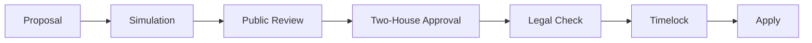

---

## 6.30 経済シミュレーション

経済モデルの変更前には、過去データや合成データを使って影響をシミュレーションする。

例えば、

- 上位1%への収益集中
- 中位クリエイターへの影響
- 新人への分配
- 1利用者あたりの価値
- Operation Pool の持続可能性
- 不正利用時の損失
- Growth Pool の効果

などを評価する。

```mermaid
flowchart TD
    DATA[Usage / Economic Data]
    MODEL[Candidate Model]
    SIM[Simulation]

    DATA --> SIM
    MODEL --> SIM

    SIM --> CREATOR[Creator Impact]
    SIM --> USER[User Impact]
    SIM --> COMPANY[Platform Impact]
    SIM --> RISK[Risk]
```

例えば総分配額に占める上位 $x\%$ のクリエイターのシェアを、

$$
C_x =
\frac{
\sum_{i \in \mathrm{Top}(x)} D_i
}{
\sum_i D_i
}
$$

のように指標化できる。

このような集中度指標を、モデル変更前後で比較する。

---

## 6.31 透明性指標

経済モデルを評価するため、売上額だけではなく複数の指標を公開することを検討する。

例えば、

- クリエイターへの総分配率
- Usage-based Pool の分配
- Growth Pool の分配
- Operation Pool
- 収益集中度
- 新人クリエイターの継続率
- 分配対象クリエイター数
- 利用者の Discovery 利用率
- 不正として除外された利用量

などである。

```mermaid
flowchart LR
    ECON[Platform Economy]
    ECON --> DASH[Transparency Dashboard]

    DASH --> CREATOR[Creator Metrics]
    DASH --> MONEY[Distribution Metrics]
    DASH --> GROWTH[Growth Metrics]
    DASH --> FRAUD[Integrity Metrics]
```

個人情報や企業秘密を無制限に公開するのではなく、制度の健全性を検証できる粒度で公開する。

---

## 6.32 初期段階の経済モデル

MVPでは複雑な数理モデルを最初から導入しない。

```mermaid
flowchart LR
    REV[Revenue]
    REV --> BASIC[Simple Transparent Pools]
    BASIC --> USAGE[Usage Distribution]
    BASIC --> GROWTH[Small Growth Pool]
    BASIC --> OPS[Operations]
```

初期段階では、

- 単純で説明可能
- 会計処理が可能
- クリエイターが理解できる
- 利用者へ説明できる
- 実データを収集できる

ことを優先する。

---

## 6.33 成長段階での経済モデル

利用者とクリエイターが増えた段階で、より高度な仕組みを段階的に導入する。

```mermaid
flowchart LR
    P1[Phase 1<br/>Simple Pools]
    P2[Phase 2<br/>User-Centric Elements]
    P3[Phase 3<br/>Growth / QF]
    P4[Phase 4<br/>Governed Economics]

    P1 --> P2 --> P3 --> P4
```

経済モデルを最初から完成形として固定せず、憲章の範囲内で実証とガバナンスによって改善する。

---

## 6.34 3つの憲章との関係

経済合理性だけで分配ルールを決定しない。

```mermaid
flowchart TD
    CONST[3つの憲章]

    CONST --> CREATOR[Creator Sustainability]
    CONST --> USER[User Value / Autonomy]
    CONST --> FAIR[Fair Discovery]

    CREATOR --> ECON[Economic Model]
    USER --> ECON
    FAIR --> ECON
```

例えば、クリエイターへの分配率を高めるために利用料金を極端に上げ、利用者が離脱すれば持続可能ではない。

逆に、利用料金を下げるためにクリエイター報酬を過度に圧縮すれば Creator First の理念に反する。

Growth Pool を増やしすぎて実際によく聴かれたクリエイターへの還元を大きく損なうことも避ける。

したがって3つの価値の間の緊張関係を、透明なルールとガバナンスによって調整する。

---

## 6.35 経済モデル全体像

```mermaid
flowchart TD
    USER[Listeners]
    USER -->|Subscription| REV[Revenue]

    REV --> REQUIRED[Taxes / Payment / Required Costs]
    REQUIRED --> NET[Distributable Revenue]

    NET --> USAGE[Usage-based Pool]
    NET --> GROWTH[Growth Pool]
    NET --> OPS[Operation Pool]

    USAGE --> ORACLE[Verified Usage]
    ORACLE --> RIGHTS[Rights Splits]
    RIGHTS --> CREATORS[Creators / Rights Holders]

    USER -->|Explicit Support| SUPPORT[Support Signals]
    SUPPORT --> GROWTH

    GROWTH --> EMERGING[Emerging Creators]
    OPS --> PLATFORM[Platform Sustainability]

    GOV[Creator House + User House] --> RULES[Economic Rules]
    RULES --> USAGE
    RULES --> GROWTH
```

この構造では、利用者の支払い、実際の利用、明示的な支持、成長支援、運営費を一つの指標へ押し込めない。

それぞれを分離することで、目的の異なる経済メカニズムを透明に設計する。

---

## 6.36 本章のまとめ

Creator First Platform の経済モデルは、

> **再生回数を最大化するためのモデルではなく、創作・発見・利用・支援が持続的に循環するモデル**

を目指す。

```mermaid
flowchart LR
    CREATE[Create]
    DISCOVER[Discover]
    LISTEN[Listen]
    SUPPORT[Support]
    REWARD[Reward]
    CREATE2[Create Again]

    CREATE --> DISCOVER
    DISCOVER --> LISTEN
    LISTEN --> SUPPORT
    SUPPORT --> REWARD
    REWARD --> CREATE2
```

その中心にあるのは、

- 利用実績に対する正当な還元
- 新人の成長機会
- 利用者の支持の意思
- 持続可能なプラットフォーム
- 検証可能な資金分配
- 当事者による経済ルールの統治

である。

> **Creator First とは、クリエイターだけを最大化することではない。クリエイターが創作を続けられ、利用者が音楽を楽しみ、新しい才能が発見され、その循環を支えるプラットフォームも持続できる経済を設計することである。**

このバランスを、固定された企業内部のアルゴリズムではなく、透明なプロトコルとガバナンスによって維持することが本プラットフォームの経済設計の目標である。
