# 6. 経済モデル

## 6.1 本章の目的

Creator First Platform の経済モデルは、単に「1再生あたりいくら支払うか」を決めるものではない。

プラットフォームには、

- 音楽クリエーターへの公正な還元
- 新人・未発見音楽クリエーターの成長機会
- ユーザの満足度
- 権利者への適切な支払い
- インフラ・法務・運営費用
- 不正利用への耐性
- 長期的な事業継続性

を同時に成立させる必要がある。

したがって本プラットフォームでは、

> **利用実績による基本分配、ユーザによる明示的な支持、成長支援、持続可能な運営を分離し、複数の経済メカニズムを組み合わせる。**

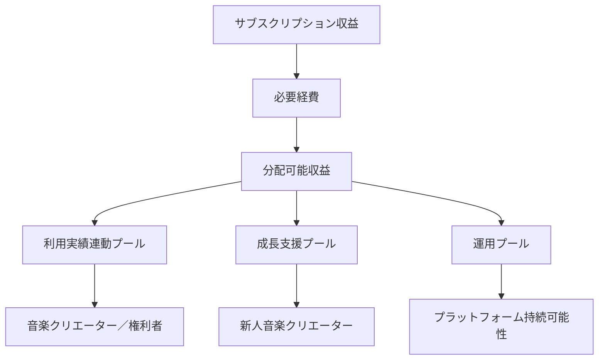

::: info 数式について
本章の数式は、経済モデルの構造を説明するための **概念モデル** である。

現時点で最終的な分配アルゴリズム、係数、比率を確定するものではない。実際のパラメータは、実証データ、法務・会計上の要件、経済シミュレーション、ガバナンスを通じて決定する。
:::

---

## 6.2 経済モデルの基本原則

### 音楽クリエーターの持続可能性

音楽クリエーターが継続的に創作できる経済環境を目指す。

### ユーザ価値

音楽クリエーター支援のためにユーザの利便性や満足度を犠牲にしない。

### 透明なルール

分配ルール、控除項目、主要パラメータを可能な限り明確にする。

### 公正な機会

人気の平等ではなく、発見される機会と参加機会の公平性を重視する。

### 権利優先

権利関係を無視して経済的効率だけを追求しない。

### 持続可能なプラットフォーム

運営費を極端に削減してサービスの品質、安全性、法令遵守を損なわない。

### 統治された経済

重要な経済パラメータを運営企業だけの裁量で変更しない。

---

## 6.3 サブスクリプションモデル

基本的な収益源は月額サブスクリプションを想定する。

ユーザにとっては、既存の音楽ストリーミングサービスに近い単純な料金体系を基本とする。

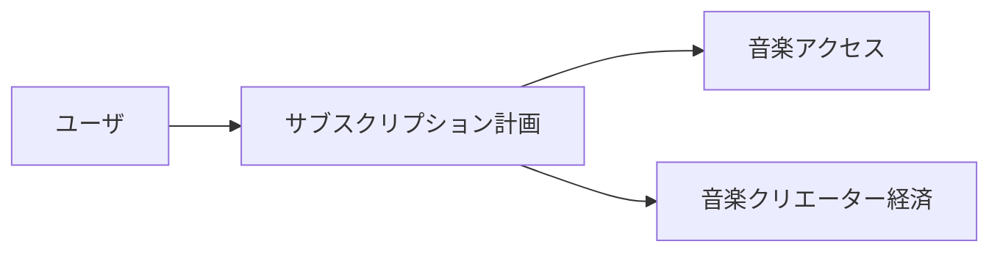

初期段階では複雑な投機的トークン経済をユーザへ要求せず、JPYC等の承認済み法定通貨連動型ステーブルコインによる単純な定額決済を中心とする。ETH等の価格変動するネイティブトークンはサービス料金ではなく、必要に応じてリレイヤーまたはペイマスターが抽象化するネットワーク手数料として扱う。

将来的には複数プランや追加的な音楽クリエーター支援機能を検討できるが、基本アクセスと投機的トークン保有を結び付けない。

### 6.3.1 ネットワーク実行支援を含む定額料金

本番サービスでは、対象となるオンチェーン操作のネットワーク手数料を、株式会社がサービス提供のために負担する運営原価として月額料金の設計へ織り込むことを基本候補とする。ユーザへガストークンを販売し、購入を媒介し、残高として付与し、または実費を事後精算することを意味しない。

ユーザに提示するのは、音楽配信と所定のネットワーク実行支援を含む固定の月額総額である。ネットワーク実行支援の対象操作、回数・金額等の合理的な上限、混雑・障害時の取扱い、更新日、解約・返金条件および料金変更条件を申込み前に明示する。実際のガス単価に応じた不確定額を月末に追加請求せず、料金変更が必要な場合は原則として次の契約期間から適用し、事前通知と解約機会を設ける。

株式会社は自己の名義と計算で必要なネイティブトークンを調達・保有し、承認済みのリレイヤーまたはペイマスターへ供給する。ユーザには当該トークンの所有権、払戻請求権、出金権、翌月繰越残高または交換レートに連動する権利を付与しない。これにより、一般ユーザがガストークンを別途購入しなくても利用できるUXを目指す一方、個別の事業スキームが金融規制、消費者保護、税務・会計その他の法令に適合するかは、サービス開始前に専門家および必要に応じて関係当局・登録事業者へ確認する。

---

## 6.4 売上と分配可能額

ユーザが支払ったサブスクリプション料金全額を、そのままスマートコントラクトへ送るわけではない。

概念的には、分配設計の対象となる純額 $R_d$ を、

$$
R_d = R_g - T - P - C_r - C_o
$$

と表す。

ここで、

- $R_g$：総収入
- $T$：税等
- $P$：決済関連費用
- $C_r$：契約・権利処理上必要な費用
- $C_o$：その他、分配前に必要となる明示的費用
- $R_d$：分配設計の対象となる純額

とする。

::: info 透明性の対象
重要なのは「手数料ゼロ」を約束することではなく、**どの費用が、なぜ、どの段階で控除されるかを説明できること**である。
:::

---

## 6.5 三つの主要プール

分配可能額を、目的の異なる複数のプールへ配分する。

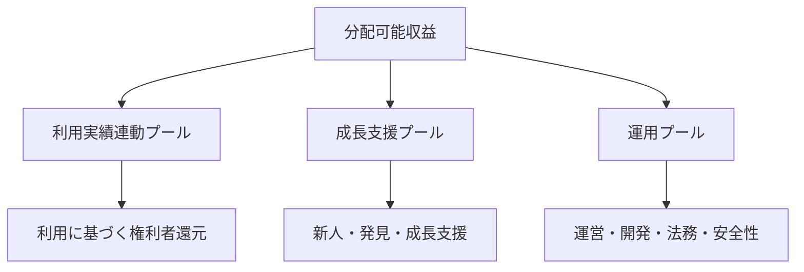

利用実績連動プール、成長支援プール、運用プールの比率をそれぞれ $\alpha$、$\beta$、$\gamma$ とすると、

$$
\alpha + \beta + \gamma = 1
$$

である。

各プールの額は、

$$
U = \alpha R_d
$$

$$
G = \beta R_d
$$

$$
O = \gamma R_d
$$

と表せる。

あるいはまとめて、

$$
U = \alpha R_d,\qquad
G = \beta R_d,\qquad
O = \gamma R_d
$$

と表記できる。

$\alpha$、$\beta$、$\gamma$ はホワイトペーパー段階では固定しない。

市場環境、事業コスト、音楽クリエーターへの還元、ユーザ価値を検証した上で決定し、重要な変更はガバナンス対象とする。

---

## 6.6 利用実績連動プール

利用実績連動プールは、実際に利用された作品と、その権利者への基本的な還元を担う。

最も単純な概念モデルでは、作品 $i$ の有効利用量を $p_i$ とすると、その作品への分配額 $D_i$ を、

$$
D_i =
U
\frac{p_i}
{\sum_j p_j}
$$

と表せる。

ただし Creator First Platform では、生の再生回数をそのまま $p_i$ とすることを前提にしない。


再生時間、不正判定、重複、権利状態などを考慮した **有効利用実績** を利用する。

---

## 6.7 有効利用量

生の再生回数 $n_i$ と、分配計算に使う有効利用量 $p_i$ は区別する。

概念的には、

$$
p_i =
\sum_{e \in E_i}
w_e\,v_e
$$

のように表現できる。

ここで、

- $E_i$：作品 $i$ に関する利用イベント集合
- $v_e$：イベント $e$ が有効であるか、または有効度を表す値
- $w_e$：再生時間等に基づく重み

とする。

例えば不正と判定されたイベントは $v_e = 0$ とすることが考えられる。

ただし、具体的な検証ルールは利用実績オラクルと不正対策の仕様で決定する。

---

## 6.8 「1再生 = 固定単価」ではない

サブスクリプション型サービスでは、毎月の収入、利用量、契約条件などが変化する。

そのため、

> **すべての再生に恒久的な固定単価を保証する**

というモデルは採用しない。

例えば、ある期間における作品 $i$ の実効的な1利用単位あたり分配額を $r_i$ とすれば、

$$
r_i =
\frac{D_i}{p_i}
$$

と事後的に計算することはできる。

しかし $r_i$ を事前に固定するわけではない。

音楽クリエーターダッシュボードでは、単に金額だけではなく、計算根拠を確認できるようにする。

---

## 6.9 ユーザ中心な要素

全ユーザの再生を一つの巨大なプールへ集約する方式だけでなく、

> **あるユーザが支払った価値を、そのユーザが実際に支持した音楽クリエーターへより強く結び付ける**

ユーザ中心的な考え方を導入できる。

ユーザ $u$ の分配対象額を $B_u$、そのユーザによる作品 $i$ の有効利用重みを $w_{u,i}$ とすると、

$$
D_{u,i}
=
B_u
\frac{w_{u,i}}
{\sum_j w_{u,j}}
$$

と表せる。

ユーザ $u$ から作品 $i$ への配分 $D_{u,i}$ を全ユーザについて合計すれば、

$$
D_i =
\sum_u D_{u,i}
$$

となる。

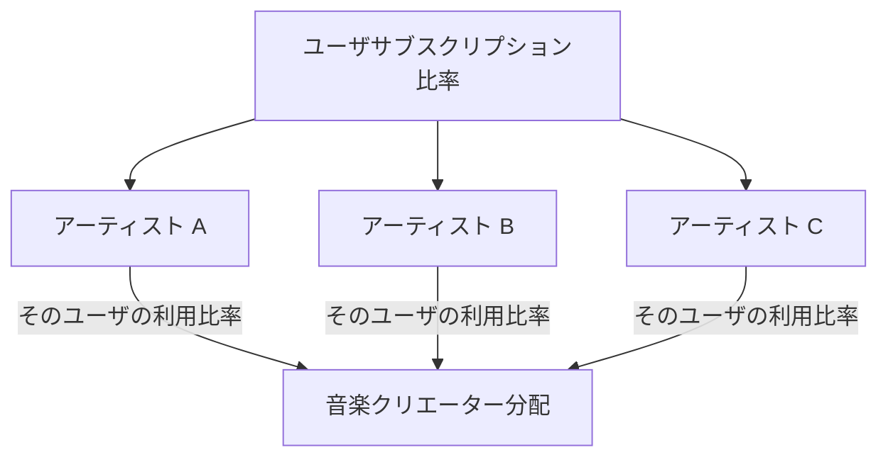

完全なユーザ中心方式が常に最適とは限らないため、実証データをもとに評価する。

---

## 6.10 明示的な「推し」支援

ユーザの再生行動だけでなく、

> **この音楽クリエーターを応援したい**

という意思を反映する仕組みを設けることができる。

例えば、ユーザ $u$ の分配可能な価値 $B_u$ のうち、明示的支援に利用する割合を $\lambda_u$ とすれば、

$$
0 \leq \lambda_u \leq 1
$$

であり、

$$
B_u^{\mathrm{usage}}
=
(1-\lambda_u)B_u
$$

$$
B_u^{\mathrm{support}}
=
\lambda_u B_u
$$

と分離できる。

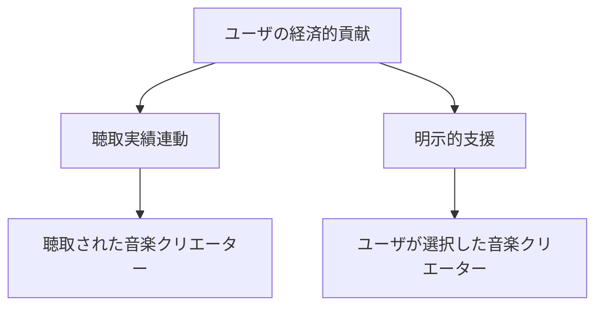

これにより、「たくさん聴いた」と「応援したい」を別のシグナルとして扱える。

---

## 6.11 成長支援プール

再生実績だけで分配すると、すでに大きな利用量を持つ作品へ資金が集中しやすい。

そこで、利用実績連動プールとは別に **成長支援プール** を設ける。

成長支援プールの目的は、

> **人気を人工的に平等化することではなく、まだ十分に発見されていない音楽クリエーターに成長機会を提供すること**

である。

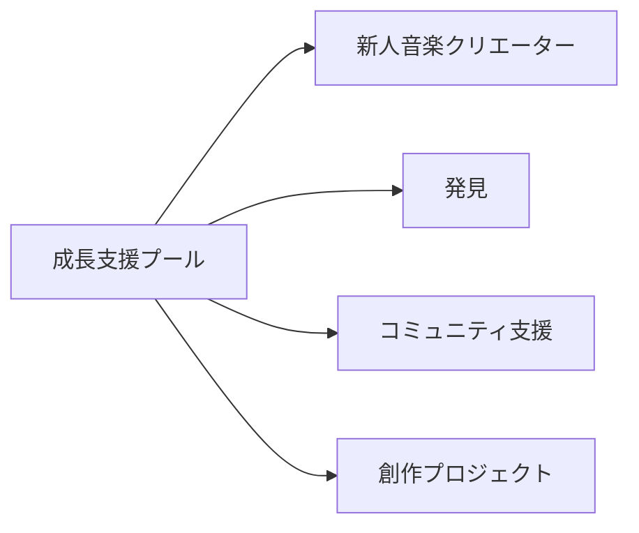

---

## 6.12 成長スコア

成長支援プールの配分に単純な再生数ランキングを使えば、利用実績連動プールと同じ集中が起きる。

そこで、複数の要素を使った成長スコアを検討する。

作品または音楽クリエーター $i$ の成長スコアを $G_i$ とすると、

$$
G_i =
f\!\left(
S_i,
N_i,
E_i,
C_i,
Q_i
\right)
$$

のような一般形で表せる。

ここで、

- $S_i$：ユーザからの支持
- $N_i$：新規性・活動段階
- $E_i$：継続的なエンゲージメント
- $C_i$：コミュニティからの支持
- $Q_i$：不正耐性を含む適格性

などである。

::: warning 成長スコアは未確定
関数 $f$ は現時点では定義していない。

これは「どのような情報を考慮し得るか」を示す概念式であり、最終的なランキング式や分配式ではない。
:::

---

## 6.13 成長支援プールの概念的配分

成長スコアが確定したと仮定した場合、単純な正規化モデルとして、

$$
M_i =
G
\frac{G_i}
{\sum_j G_j}
$$

と表せる。

ここで、

- $G$：成長支援プールの総額
- $G_i$：対象 $i$ の成長スコア
- $M_i$：成長支援プールからの配分額

である。

ただし実際には上限、下限、適格条件、カテゴリ別配分などを設ける可能性がある。

---

## 6.14 二次資金配分

成長支援プールの一部では、二次資金配分の考え方を利用できる。

基本的な発想は、

> **一人の大口支援者から大きな金額を集めたプロジェクトより、多数の独立したユーザから支持されたプロジェクトを強く評価する**

ことである。

音楽クリエーターまたはプロジェクト $i$ への、ユーザ $u$ の支援額を $c_{u,i}$ とすると、二次資金配分の基礎的なスコアを、

$$
Q_i =
\left(
\sum_u \sqrt{c_{u,i}}
\right)^2
$$

と表せる。

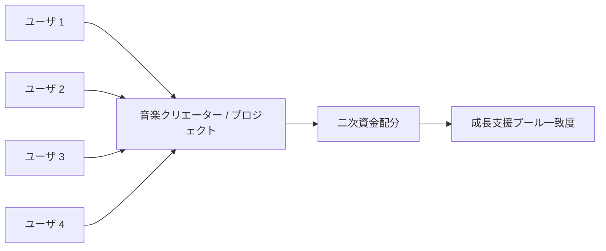

ただし、この $Q_i$ をそのまま配分額とするわけではない。

実際のマッチングでは、直接支援額を除いたマッチング需要、成長支援プールの上限、シビル耐性、各種キャップ等を考慮する必要がある。

---

## 6.15 二次資金配分のマッチング概念

プロジェクト $i$ への直接支援総額を、

$$
C_i =
\sum_u c_{u,i}
$$

とする。

二次資金配分による追加的なマッチング需要の概念値を、

$$
M_i^{*}
=
Q_i - C_i
$$

と置くことができる。

実際の成長支援プールが有限であるため、マッチング需要総額が利用可能額を超える場合には正規化が必要となる。

例えばマッチングに利用できる額を $G_Q$ とすると、

$$
M_i
=
G_Q
\frac{M_i^{*}}
{\sum_j M_j^{*}}
$$

のようなモデルが考えられる。

これは説明用の一例であり、最終仕様ではない。

---

## 6.16 シビル耐性

二次資金配分では、一人が多数のアカウントへ支援を分割するとスコアを不正に高められる可能性がある。

したがって、ユーザ $u$ に対する信頼重み $a_u$ を導入する概念も考えられる。

例えば、

$$
0 \leq a_u \leq 1
$$

として、

$$
Q_i =
\left(
\sum_u
a_u
\sqrt{c_{u,i}}
\right)^2
$$

とする。

ただし、$a_u$ の決定方法が新たな中央集権や差別を生まないよう慎重な設計が必要である。

---

## 6.17 初期支援

ユーザが新人音楽クリエーターを早期に発見し、応援すること自体をプラットフォーム体験の一部にする。


ただし初期支援を金融投資化しない。

「将来人気になれば金銭的リターンが得られる」ことを中心にすると、音楽発見ではなく投機市場になる。

Creator First Platform では、支援と証券的・投機的インセンティブを明確に分離する。

---

## 6.18 支援評価

初期から新人を発見したユーザに、金銭ではなくコミュニティ上の評価を与えることは考えられる。

例えば、

- 初期サポーター
- 発見貢献者
- コミュニティキュレーター

などの履歴である。


評価がガバナンス権力や推薦操作へ直接変換される場合には慎重な設計が必要になる。

---

## 6.19 運用プール

Creator First Platform が長期的に存続するには、運営費用が必要である。

運用プールは例えば、

- クラウド・CDN
- ソフトウェア開発
- セキュリティ
- 権利管理
- 法務
- 会計・税務
- カスタマーサポート
- 不正対策
- ガバナンス運営
- 監査

などに利用する。

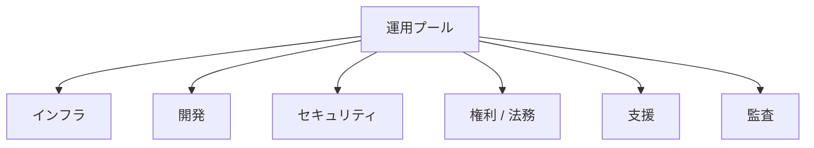

音楽クリエーター中心は「運営会社が利益を得てはいけない」という意味ではない。

重要なのは、

> **プラットフォームの利益最大化が、音楽クリエーターとユーザの利益より常に優先される構造にしないこと**

である。

---

## 6.20 株式会社の利益

運営株式会社には、継続的な事業運営、研究開発、人材採用、リスク負担のための利益が必要である。

したがって、

$$
\mathrm{法人\ Profit} \geq 0
$$

を前提とする。

より重要なのは、利益がどの収益レイヤーから生じるのかを明確にすることである。

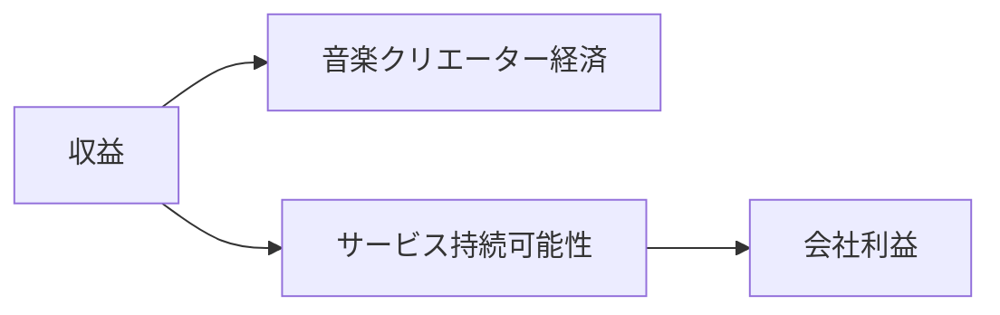

利益率や運営費がブラックボックス化し、音楽クリエーターへの還元を一方的に圧縮できる構造は避ける。

---

## 6.21 音楽クリエーター分配率の下限

音楽クリエーター中心の理念をより強く制度化する場合、一定の分配可能額について音楽クリエーター経済に最低比率を設定することも検討できる。

音楽クリエーター経済への最低配分比率を $\alpha_{\min}$ とすると、

$$
\alpha \geq \alpha_{\min}
$$

という制約をプロトコル上に設ける考え方である。

ただし、最低比率を固定しすぎると、法務・セキュリティ・インフラ費用が急増した場合の事業継続性を損なう可能性がある。

そのため実際には、憲章、ガバナンス、財務健全性を組み合わせて設計する。

---

## 6.22 不正再生への経済的耐性

再生数が金銭に変換される以上、不正再生には経済的インセンティブが生じる。

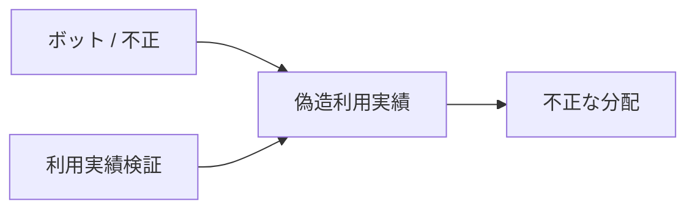

不正イベントの割合を $\phi$ とし、生の利用量を $p_i^{\mathrm{raw}}$ とした単純化例では、

$$
p_i^{\mathrm{valid}}
=
(1-\phi_i)
p_i^{\mathrm{raw}}
$$

のように表現できる。

実際には、不正判定は単一の比率ではなくイベント単位・アカウント単位・ネットワーク単位などで行う。

---

## 6.23 人気集中への対応

人気作品が多くの収益を得ること自体は自然である。

問題は、人気が推薦、再生、収益、さらに推薦という自己強化ループを形成し、新しい作品が参入できなくなることである。

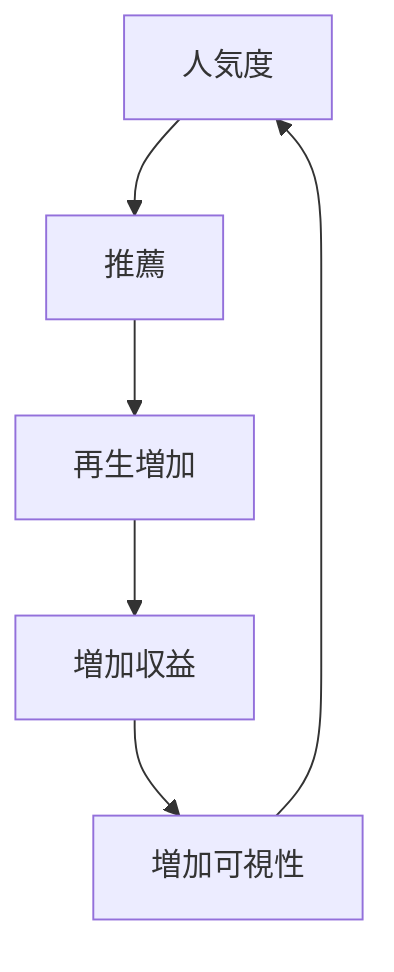

これに対し、

- 利用実績連動プールは実利用を尊重する
- 成長支援プールは成長機会を補完する
- 発見は推薦機会を多様化する
- ユーザは推薦モードを選択できる

という複数レイヤーで対応する。

---

## 6.24 推薦と資金分配を完全には同一化しない

推薦アルゴリズムがそのまま収益分配アルゴリズムになると、プラットフォームが推薦を通じて資金配分を操作できる。

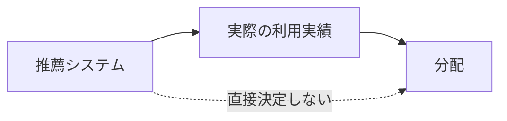

推薦は利用行動へ影響するが、推薦順位そのものを直接の報酬指標にはしない。

---

## 6.25 音楽クリエーターへの追加支払い

サブスクリプション分配とは別に、ユーザが任意で音楽クリエーターを支援できる仕組みも検討する。

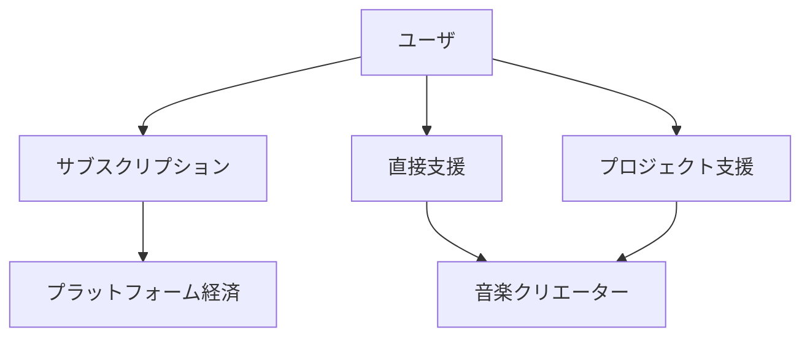

法的・決済上の要件を確認した上で、

- Tip
- プロジェクト支援
- 議員資格的支援
- 限定イベント等

を将来的な機能として検討できる。

---

## 6.26 トークンを経済モデルの前提にしない

Creator First Platform は、独自トークンの価格上昇によって成立する経済モデルを採用しない。


ガバナンスや技術上の必要性からトークンを検討する場合でも、

- 音楽サービスの利用価値
- 音楽クリエーター報酬
- 株式会社の事業収益

をトークン価格から分離する。

---

## 6.27 STOとの分離

運営株式会社が将来的に STO によって資金調達する場合でも、STO は音楽ユーザへの報酬分配とは別のレイヤーで扱う。

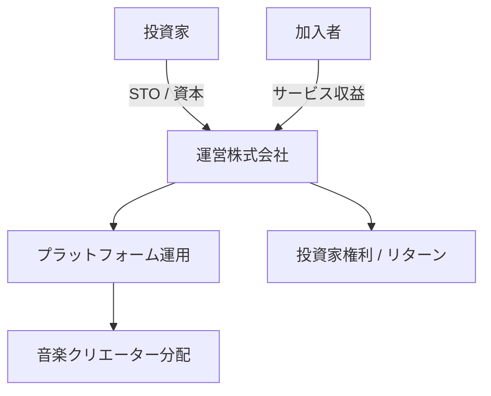

投資家の権利と、ユーザ・音楽クリエーターによるプロトコルガバナンスを混同しないことが重要である。

詳細は第11章で扱う。

---

## 6.28 ガバナンス可能な経済パラメータ

重要な経済パラメータの一部は、音楽クリエータ院議会とユーザ院議会のガバナンス対象とする。

例えば、

- $\alpha$：利用実績連動プール比率
- $\beta$：成長支援プール比率
- $\gamma$：運用プール比率
- 成長支援プールの評価方式
- 不正利用に関するプロトコルルール
- 分配頻度
- 最低分配額
- 支援配分の範囲
- 主要な分配アルゴリズム

などである。

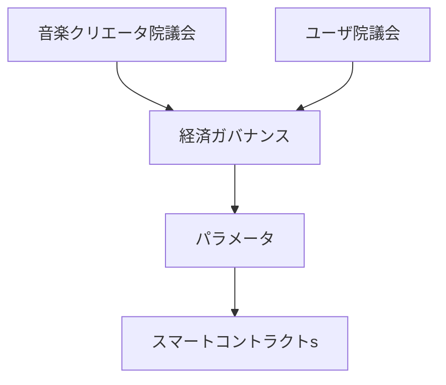

ただし、法定税、既存契約上の義務、法令遵守費用などを多数決で無効化することはできない。

---

## 6.29 経済パラメータの変更

分配ルールを頻繁に変更すると、音楽クリエーターが将来収益を予測できなくなる。

そのため、重要な変更には、

1. 提案
2. シミュレーション
3. 公開レビュー
4. 音楽クリエータ院議会審議
5. ユーザ院議会審議
6. 法務・会計確認
7. タイムロック
8. 適用

という手続きを設ける。


---

## 6.30 経済シミュレーション

経済モデルの変更前には、過去データや合成データを使って影響をシミュレーションする。

例えば、

- 上位1%への収益集中
- 中位音楽クリエーターへの影響
- 新人への分配
- 1ユーザあたりの価値
- 運用プールの持続可能性
- 不正利用時の損失
- 成長支援プールの効果

などを評価する。

```mermaid
flowchart TD
    DATA[利用実績 / 経済データ]
    MODEL[候補モデル]
    SIM[シミュレーション]

    DATA --> SIM
    MODEL --> SIM

    SIM --> CREATOR[音楽クリエーターへの影響]
    SIM --> USER[ユーザへの影響]
    SIM --> COMPANY[プラットフォーム Impact]
    SIM --> RISK[リスク]
```

例えば総分配額に占める上位 $x\%$ の音楽クリエーターのシェアを、

$$
C_x =
\frac{
\sum_{i \in \mathrm{Top}(x)} D_i
}{
\sum_i D_i
}
$$

のように指標化できる。

このような集中度指標を、モデル変更前後で比較する。

---

## 6.31 透明性指標

経済モデルを評価するため、売上額だけではなく複数の指標を公開することを検討する。

例えば、

- 音楽クリエーターへの総分配率
- 利用実績連動プールの分配
- 成長支援プールの分配
- 運用プール
- 収益集中度
- 新人音楽クリエーターの継続率
- 分配対象音楽クリエーター数
- ユーザの発見利用率
- 不正として除外された利用量

などである。

```mermaid
flowchart LR
    ECON[プラットフォーム経済]
    ECON --> DASH[透明性ダッシュボード]

    DASH --> CREATOR[音楽クリエーター指標]
    DASH --> MONEY[分配指標]
    DASH --> GROWTH[成長指標]
    DASH --> FRAUD[完全性指標]
```

個人情報や企業秘密を無制限に公開するのではなく、制度の健全性を検証できる粒度で公開する。

---

## 6.32 初期段階の経済モデル

MVPでは複雑な数理モデルを最初から導入しない。

```mermaid
flowchart LR
    REV[収益]
    REV --> BASIC[単純透明プール]
    BASIC --> USAGE[利用実績分配]
    BASIC --> GROWTH[Small 成長支援プール]
    BASIC --> OPS[運用]
```

初期段階では、

- 単純で説明可能
- 会計処理が可能
- 音楽クリエーターが理解できる
- ユーザへ説明できる
- 実データを収集できる

ことを優先する。

---

## 6.33 成長段階での経済モデル

ユーザと音楽クリエーターが増えた段階で、より高度な仕組みを段階的に導入する。

```mermaid
flowchart LR
    P1[フェーズ 1<br/>単純プール]
    P2[フェーズ 2<br/>ユーザ中心要素]
    P3[フェーズ 3<br/>成長 / QF]
    P4[フェーズ 4<br/>統治された経済]

    P1 --> P2 --> P3 --> P4
```

経済モデルを最初から完成形として固定せず、憲章の範囲内で実証とガバナンスによって改善する。

---

## 6.34 3つの憲章との関係

経済合理性だけで分配ルールを決定しない。

```mermaid
flowchart TD
    CONST[3つの憲章]

    CONST --> CREATOR[音楽クリエーターの持続可能性]
    CONST --> USER[ユーザ価値 / 自律性]
    CONST --> FAIR[Fair 発見]

    CREATOR --> ECON[経済モデル]
    USER --> ECON
    FAIR --> ECON
```

例えば、音楽クリエーターへの分配率を高めるために利用料金を極端に上げ、ユーザが離脱すれば持続可能ではない。

逆に、利用料金を下げるために音楽クリエーター報酬を過度に圧縮すれば音楽クリエーター中心の理念に反する。

成長支援プールを増やしすぎて実際によく聴かれた音楽クリエーターへの還元を大きく損なうことも避ける。

したがって3つの価値の間の緊張関係を、透明なルールとガバナンスによって調整する。

---

## 6.35 経済モデル全体像

```mermaid
flowchart TD
    USER[ユーザ]
    USER -->|サブスクリプション| REV[収益]

    REV --> REQUIRED[税金 / 決済 / 必要経費]
    REQUIRED --> NET[分配可能収益]

    NET --> USAGE[利用実績連動プール]
    NET --> GROWTH[成長支援プール]
    NET --> OPS[運用プール]

    USAGE --> ORACLE[検証済み利用実績]
    ORACLE --> RIGHTS[権利分割]
    RIGHTS --> CREATORS[音楽クリエーター／権利者]

    USER -->|明示的支援| SUPPORT[支援シグナル]
    SUPPORT --> GROWTH

    GROWTH --> EMERGING[新人音楽クリエーター]
    OPS --> PLATFORM[プラットフォーム持続可能性]

    GOV[音楽クリエータ院議会 + ユーザ院議会] --> RULES[経済ルール]
    RULES --> USAGE
    RULES --> GROWTH
```

この構造では、ユーザの支払い、実際の利用、明示的な支持、成長支援、運営費を一つの指標へ押し込めない。

それぞれを分離することで、目的の異なる経済メカニズムを透明に設計する。

---

## 6.36 資金フローと財務透明性

ユーザの課金やサポーター支援が、音楽クリエーターへの還元とサービスの持続可能性へどう使われたかを検証できるよう、期間ごとの **資金庫透明性スナップショット** を公開する。

期間中の動きは、同一の資産・最小単位で次のように照合する。

```text
期首残高 + 確定収入 - 確定支出 ± 承認済み調整 = 期末残高
```

確定収入にはサブスクリプション課金やサポーター支援等を含める。確定支出は少なくとも、音楽クリエーター分配、システム維持、納税・公租公課、プロモーション、コミュニティ運営を区別する。返金、取消、未確定取引または見積額を、確定した収支へ混在させない。

期末残高は二つの見方で再照合する。

- **資産の所在:** スマートコントラクト内資産、法人管理資産、未収金等
- **負担・目的・残余:** 音楽クリエーター未払額、納税準備・未払税金、システム維持準備金、プロモーション予算、コミュニティ運営予算、未配分・純準備金等

```mermaid
flowchart LR
    PAY[課金・支援] --> RECON[財務透明性参照モデル]
    CHAIN[コントラクト残高] --> RECON
    BOOKS[法人会計・資金管理] --> RECON
    DIST[分配・支払台帳] --> RECON
    GOV[承認済み予算・ガバナンス] --> RECON

    RECON --> FLOW[期首 + 収入 - 支出 = 期末]
    RECON --> PLACE[コントラクト / 法人 / 未収]
    RECON --> PURPOSE[音楽クリエーター / 税 / 維持 / プロモーション / コミュニティ / 残余]
```

スマートコントラクトのウォレット残高だけを売上、利益または分配可能額とはみなさない。チェーン上の残高、法人会計、決済台帳、分配結果、支払状態、税務判断およびガバナンスの予算決定は、それぞれ異なる正本を持つ。公開画面はこれらを証憑参照、基準時刻、確定性およびポリシー版とともに突合する参照モデルであり、資金移動を承認する機能ではない。

この表示はプラットフォームの説明責任を補助するが、株式会社が作成・保存する法定の貸借対照表、損益計算書、会計帳簿または税務申告を代替しない。税区分、源泉徴収、収益認識、資産・負債の会計分類および開示範囲は、法人が専門家と決定する。

初期テストネットデモでは固定のMockJPYC合成データを使い、次の一致を機械的に表示する。

1. 期間フローから算出した期末残高と、所在別資産合計が一致すること
2. 所在別資産合計と、負担・準備・残余の合計が一致すること
3. 推定・保留・照合済み・確定・訂正済みを明示し、未確定値を確定値として表示しないこと

詳細な責任分界と訂正規則は[ADR-0013](/adr/ADR-0013-treasury-flow-transparency)、機械可読な要件は[音楽クリエーター分配仕様](/protocol/specs/creator-distribution)で定義する。

---

## 6.37 本章のまとめ

Creator First Platform の経済モデルは、

> **再生回数を最大化するためのモデルではなく、創作・発見・利用・支援が持続的に循環するモデル**

を目指す。

```mermaid
flowchart LR
    CREATE[創作]
    DISCOVER[発見]
    LISTEN[聴取]
    SUPPORT[支援]
    REWARD[報酬]
    CREATE2[創作再び]

    CREATE --> DISCOVER
    DISCOVER --> LISTEN
    LISTEN --> SUPPORT
    SUPPORT --> REWARD
    REWARD --> CREATE2
```

その中心にあるのは、

- 利用実績に対する正当な還元
- 新人の成長機会
- ユーザの支持の意思
- 持続可能なプラットフォーム
- 検証可能な資金分配
- 当事者による経済ルールの統治

である。

> **音楽クリエーター中心とは、音楽クリエーターだけを最大化することではない。音楽クリエーターが創作を続けられ、ユーザが音楽を楽しみ、新しい才能が発見され、その循環を支えるプラットフォームも持続できる経済を設計することである。**

このバランスを、固定された企業内部のアルゴリズムではなく、透明なプロトコルとガバナンスによって維持することが本プラットフォームの経済設計の目標である。
