# 7. ガバナンス

## 7.1 ガバナンスの目的

Creator First Platformのガバナンスは、トークン保有者による単純な多数決ではない。

プラットフォームを実際に構成する音楽クリエーターとユーザが、そのルールを共同形成するための制度である。

基本構造は、

> **音楽クリエーター／ユーザ → 抽選議会 → 熟議 → プロトコル仕様 → スマートコントラクト → 自動執行**

である。

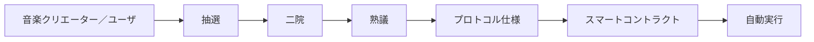

---

## 7.2 ガバナンスの正統性

スマートコントラクトはルールを自動執行できる。

しかし、

> 誰がそのルールを決めるのか

という問題をコード自身は解決できない。

Creator First Platformでは、プロトコルコードの正統性を、

```text
音楽クリエーター／ユーザ
      ↓
正統な代表形成
      ↓
熟議
      ↓
プロトコル仕様
      ↓
監査されたコード
```

から導く。

コードは法であるの前提は、**法令を形成する正統なガバナンス**である。

---

## 7.3 音楽クリエーター

音楽クリエーターとは、プラットフォーム上で流通する作品の創作・制作に実質的に関与し、所定の登録・検証手続きを経た参加者をいう。

音楽クリエーターには、

- 作詞者
- 作曲者
- 実演家
- アーティスト
- 音源制作者
- プロデューサー

等を含み得る。

音楽クリエーターと権利者は区別する。

音楽クリエータ院議会の資格は、資本保有量ではなく音楽クリエーターとしての活動と検証に基づく。

---

## 7.4 ユーザ

ユーザとは、Creator First Platformを利用してコンテンツを聴取、発見、評価、共有、支援等する者をいう。

すべてのユーザが常時ガバナンス議員になるわけではない。

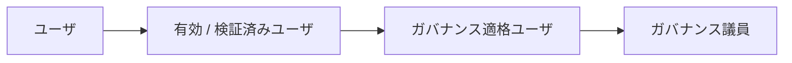

この区別によって、日常利用とガバナンス責任を分離する。

---

## 7.5 ガバナンス適格ユーザ

ガバナンス議員の母集団となるユーザをガバナンス適格ユーザと呼ぶ。

資格条件はプロトコル仕様で定める。

原則として、

- 一定期間の実利用
- 本人性または一人性の適切な確認
- シビル耐性
- 不正利用の不存在
- プライバシー保護

を考慮する。

課金額や株式・トークン保有量を主要な資格基準にはしない。

---

## 7.6 ガバナンス議員

ガバナンス議員はユーザとは別の階級ではない。

> **適格ユーザの集合から一定期間、熟議と意思決定を委ねられた代表ユーザ**

である。

原則として、

- 任期制
- 有効ユーザ資格の維持
- 利益相反開示
- 連続任期制限
- 辞退可能
- 必要に応じた解任・交代

を設ける。

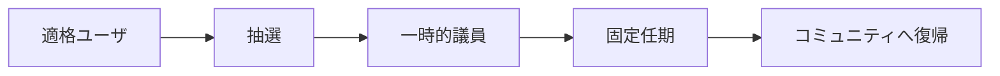

代表を恒久的な政治階級にしない。

---

## 7.7 音楽クリエータ院議会

音楽クリエータ院議会は音楽クリエーターコミュニティを代表する。

主な対象は、

- 音楽クリエーターの権利
- 分配
- 権利登録台帳
- 音楽クリエーター登録
- 音楽クリエーター支援
- 音楽クリエーター経済

である。

音楽クリエータ院議会の代表者も、検証済み音楽クリエーターの母集団から抽選することを基本とする。

---

## 7.8 ユーザ院議会

ユーザ院議会はユーザコミュニティを代表する。

主な対象は、

- ユーザ体験
- プライバシー
- サブスクリプション
- 発見
- 推薦
- コミュニティ
- ユーザの権利

である。

ユーザ院議会のガバナンス議員はガバナンス適格ユーザから抽選される。

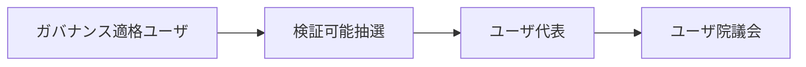

---

## 7.9 なぜ抽選なのか

選挙のみの代表制では、

- 人気
- 資金
- 組織票
- 発信力
- 政治活動への時間

が代表選出に影響しやすい。

抽選は、

> 普通に創作している音楽クリエーター、普通に音楽を利用しているユーザ

がガバナンスへ参加する機会を確保する。

ガバナンスの専門家だけがプロトコルを支配することを防ぐ。

---

## 7.10 抽選は検証可能でなければならない

抽選結果そのものもプラットフォーム運営会社を信頼するだけでは不十分である。

抽選アルゴリズムは、

- 母集団
- 適格性
- 乱数
- 選出アルゴリズム
- 結果

を検証可能にする。

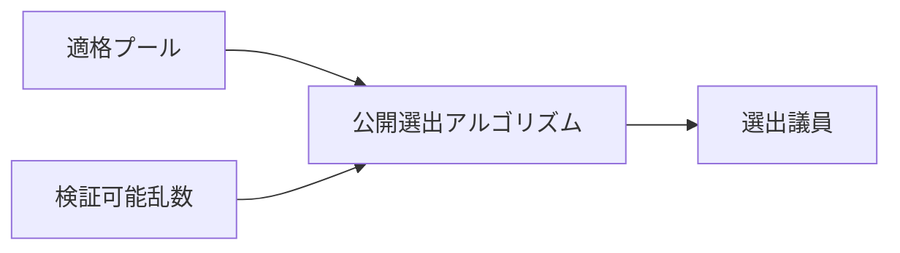

抽選アルゴリズムと適格性ルールはプロトコル仕様として公開する。

---

## 7.10.1 抽選代表制の具体的な流れ

抽選代表制では、すべてのウォレットを直接抽選するのではなく、音楽クリエータ院議会とユーザ院議会について資格確認済みの母集団を別々に形成する。

| 段階 | 基本原則 |
| --- | --- |
| 適格性 | 音楽クリエーター活動またはユーザとしての実利用等に基づき、各Houseの適格集合を作る |
| 一人一資格 | ウォレット数、資産、JPYC支払額、株式、STO、SBT、人気または再生数で選出確率を増やさない |
| 事前固定 | 乱数確定前に適格集合のコミットメントとルール版を公開する |
| 公開乱数 | 運営会社が単独で選べない将来の乱数ソースを使用する |
| 決定論的抽選 | 同じ適格集合、乱数、アルゴリズムおよび議席数から第三者が同じ結果を再計算できるようにする |
| 補欠 | 本議員と同時に補欠順位を抽選し、運営者による恣意的な交代を防ぐ |
| 期間限定代表 | 任期、連続任期制限、利益相反、辞退、資格喪失および交代手続を定める |

一人が複数のアカウントやウォレットを作って選出確率を増やすことを防ぐため、抽選単位はウォレットではなくガバナンスアイデンティティとする。個人情報をブロックチェーンへ公開せずに資格と重複防止を検証する方法として、Privacy-preserving 資格証明やゼロ知識証明を検討する。

抽選後には、適格性スナップショット、コミットメント、乱数、アルゴリズム版、議席数、選出結果、補欠順位および検証情報を公開する。抽選されたMemberは会期ごとのHouse 議員資格スナップショットへ登録され、熟議と院内投票に参加する。

議席数、任期、層化抽選、乱数ソース、本人性確認および補欠人数の具体値は、コミュニティによる検証とテストネット実証を経てプロトコル仕様で決定する。詳細な操作耐性と監査要件はADR-0002に記録する。

---

## 7.11 代表性の補正

完全な単純抽選だけでは、小さな議会で偶然の偏りが生じる可能性がある。

そのため必要に応じて層化抽選を検討する。

ユーザ院議会では例えば、

- 地域
- 利用頻度
- サブスクリプション形態
- 利用ジャンル

等について極端な偏りを防ぐ。

音楽クリエータ院議会では、

- 音楽クリエーターの役割
- 活動規模
- ジャンル
- 地域

等を考慮できる。

ただし属性区分そのものが差別や固定的身分を生まないよう慎重に設計する。

---

## 7.12 熟議

抽選はガバナンスの入口であり、意思決定そのものではない。

ガバナンス議員は、

1. 提案を受け取る
2. 証跡を確認する
3. Stakeholderの意見を聞く
4. 代替案を比較する
5. 影響をシミュレーションする
6. 両院で熟議する
7. 投票する

というプロセスを経る。

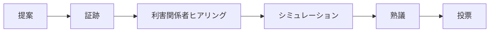

ガバナンスを瞬間的な人気投票にしない。

---

## 7.13 AIによる熟議支援

AIはガバナンス議員に対して、

- 提案要約
- 賛否論点整理
- 過去決定検索
- 経済シミュレーション
- セキュリティリスク分析
- Minority Opinionの抽出
- 法務論点の整理

を支援できる。

ただしAIは投票権を持たない。

AIが提示する分析についても、根拠・前提・不確実性を可能な限り確認可能にする。

実装では、AIによる文章・論点分析と、再現可能な計算およびコントラクトシミュレーションを分離する。料金、音楽クリエーター分配、資金庫、定足数等の数値は決定論的な計算エンジンを正本とし、コントラクト変更はテストネットまたはフォーク上で権限、残高、ストレージ、ガス、MigrationおよびRollbackを検証する。AIはこれらの結果を要約・比較・説明するが、数値や実行結果を生成する唯一の根拠にはしない。

AI分析には、参照資料、ソースコミット、仕様・モデル・Prompt 版、入力期間、仮定、不確実性および人間による確認状態を付ける。AIには、投票、適格性の最終判定、ガバナンス結果の確定、タイムロック登録、コントラクトアップグレードまたは資金庫支出の権限を与えない。

この機能は段階的な実装候補であり、現時点ではガバナンスの判断材料を提供する設計であって、稼働中の意思決定システムではない。

---

## 7.14 二院制

重要なプロトコル変更は音楽クリエータ院議会とユーザ院議会双方の承認を原則とする。

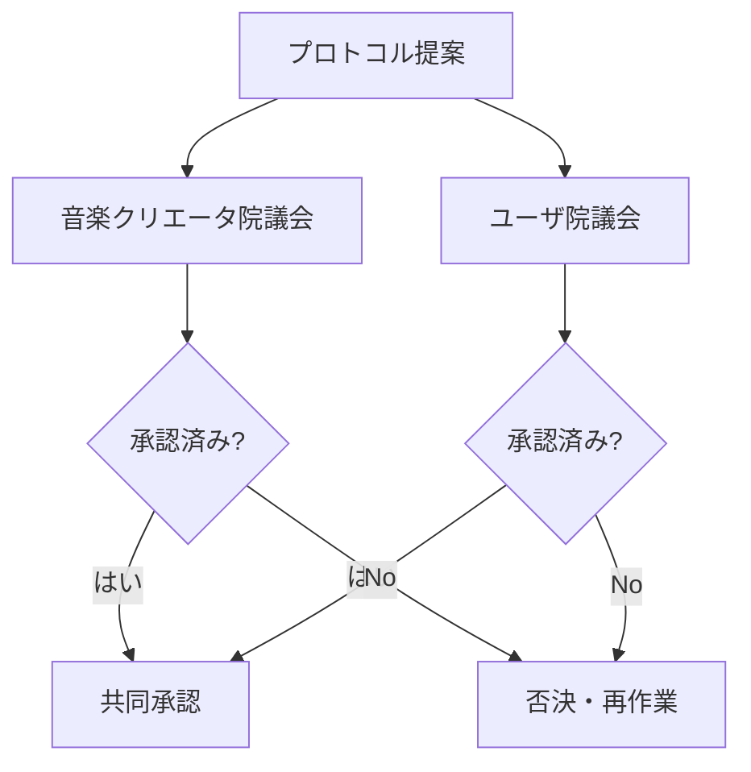

これにより音楽クリエーターの利益だけでもユーザの利益だけでもプロトコルを一方的に変更できない。

---

## 7.15 両院の非対称な専門性

二院は完全に同じ議会ではない。

音楽クリエータ院議会は音楽クリエーター経済と権利に強い関心を持ち、ユーザ院議会はUX、プライバシー、発見等に強い関心を持つ。

しかし重要プロトコルについては、専門領域を理由に一方の院を排除しない。

専門性は審議の役割分担に使い、主権の独占には使わない。

---

## 7.16 提案

提案には最低限、

- 目的
- 現行仕様
- 変更仕様
- 音楽クリエーターへの影響
- ユーザへの影響
- 経済 Impact
- セキュリティ Impact
- プライバシー Impact
- 法務 Issues
- Migration 計画
- Rollback 計画

を含める。

コードだけのプルリクエストをガバナンス提案とはみなさない。

---

## 7.16.1 クアドラティック投票

抽選された議員は、各会期に同量の譲渡不能な投票クレジットを受け取る。提案$p$へ強度$v$の票を投じる費用は$v^2$ Creditとし、複数提案への配分総額を会期予算以内に制限する。

この投票クレジットは通貨やトークンではない。JPYC、株式、STO、SBT、収益、再生数または人気によって購入・増加できず、他者への譲渡、委任、次期繰越もできない。

二次投票は、有限の予算で提案ごとの意思の強さを表すために利用する。ただし純額スコアだけでは可決せず、音楽クリエータ院議会とユーザ院議会がそれぞれ独立した定足数とApproval しきい値を満たさなければならない。

具体的な議会画面、投票計算、変更区分、タイムロックおよびコントラクト境界は、[二院制議会・ガバナンス](../governance/index.md)とプロトコル仕様で定義する。

---

## 7.16.2 コントラクト変更の拘束

投票対象は説明文だけではなく、提案 Revision、仕様 hash、チェーン ID、Target、calldata、ソースコミット、成果物およびコード hashを含む実行マニフェストへ接続する。

投票開始後にこれらが変わった場合、同じ承認で実行せず、新しいRevisionとして再審議する。両院承認後も、変更区分に応じた法務・セキュリティレビュー、テスト、監査およびタイムロックを経て、承認済みマニフェストだけを実行する。

---

## 7.17 プロトコル仕様

ガバナンスが承認する対象は、原則としてスマートコントラクトのソースコードそのものではなく、まず**プロトコル仕様**である。

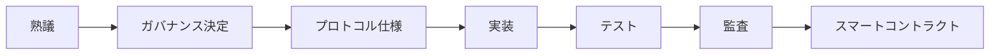

これによって、

> 民主的意思決定

と

> Software エンジニアリング

を適切に分離する。

---

## 7.18 仕様とコードの一致

実装されたコードがガバナンスで承認された仕様と一致していることを検証する。

方法として、

- 自動テスト
- 形式検証
- 独立レビュー
- スマートコントラクト監査
- 再現可能ビルド

等を利用する。

コードが仕様を変更してはならない。

---

## 7.19 自動執行

承認・実装・監査されたコードは、原則としてスマートコントラクトによって自動執行する。

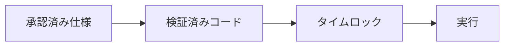

プラットフォーム運営者が個別案件ごとに恣意的に結果を変更する余地を減らす。

---

## 7.20 3つの憲章

ガバナンスは3つの憲章に従う。

- 音楽クリエーター憲章
- ユーザ憲章
- エコシステム憲章

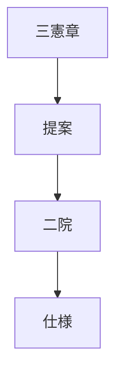

通常の多数決によって憲章を実質的に無効化できないようにする。

---

## 7.21 憲章変更

憲章変更は通常プロトコル変更より高い成立要件を持つ。

例えば、

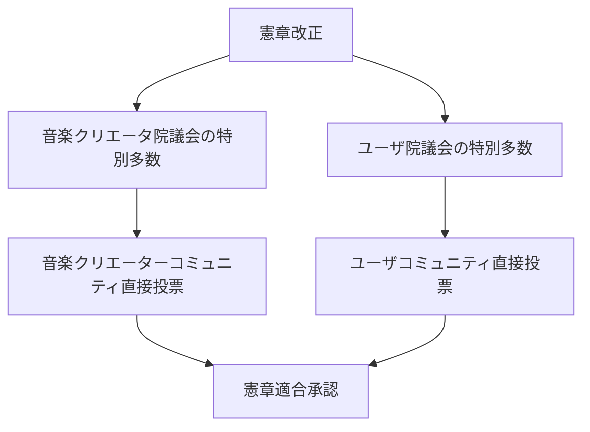

とする。

具体的な特別多数率や定足数はプロトコル仕様で定める。

---

## 7.22 主権の源泉

音楽クリエータ院議会やユーザ院議会そのものを主権者とは定義しない。

> **音楽クリエーターコミュニティとユーザコミュニティが主権の源泉である。**

議会はその統治機能を一定期間委ねられた熟議機関である。

この原則によって、ガバナンス議員の固定的支配を防ぐ。

---

## 7.23 全体投票

重大事項についてはコミュニティ全体の全体投票を利用する。

候補として、

- 憲章変更
- ガバナンス制度の根本変更
- 音楽クリエーター／ユーザの基本権変更
- プロトコルガバナンスの廃止
- 大規模な資金庫構造変更

等がある。

日常的な技術変更まで全ユーザ投票にするとガバナンス Fatigueを生むため、通常案件は抽選議会に委ねる。

---

## 7.24 委任

抽選議員とは別に、コミュニティ Memberが意見形成や全体投票投票を他者へ委任できる仕組みを検討する。

委任は、

- 任意
- 撤回可能
- 期間限定
- ポリシー Domain別

とすることができる。

ただし委任 Concentrationを監視し、少数者への政治力集中を防ぐ。

この委任候補はコミュニティ全体投票または意見形成に関するものであり、抽選議員へ付与された二次投票の投票クレジットは委任・譲渡できない。

---

## 7.25 ガバナンスと資本を分離する

株式、STO、ガバナンストークン等の資本保有量が、そのまま音楽クリエータ院議会/ユーザ院議会の議席や投票力にならないようにする。

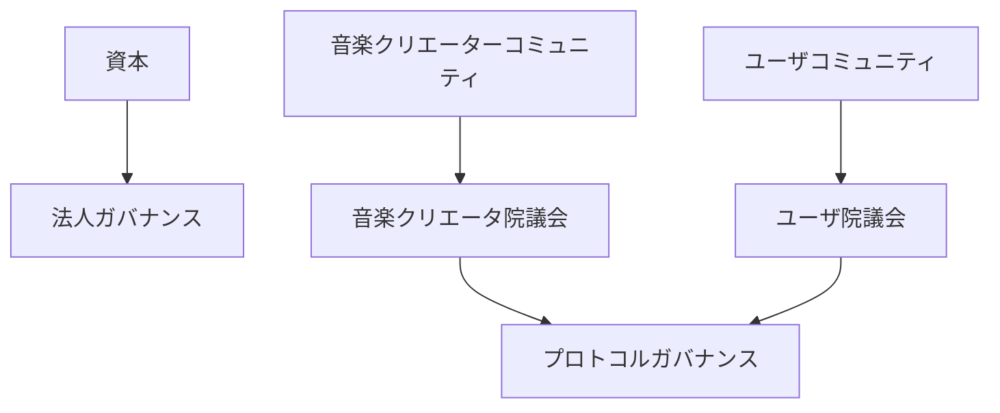

これにより資本 Captureを防ぐ。

---

## 7.26 株式会社との関係

株式会社は、

- 契約
- 権利処理
- 税務
- 会計
- 雇用
- 規制対応
- STO
- 現実社会での責任

を負う。

プロトコルガバナンスは、

- 分配ルール
- 発見ルール
- ガバナンスルール
- プロトコルパラメータ
- スマートコントラクトアップグレード

等を決定する。

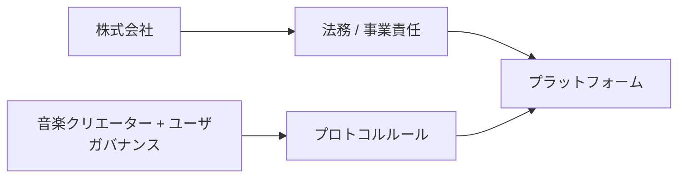

### 7.26.1 憲章・議会と会社法上の機関

3つの憲章は国家の憲法ではなく、プラットフォーム参加者を拘束する私的な基本規範である。利用規約、音楽クリエーター契約、議員規程、プロトコル仕様等へ具体化することで実効性を持たせるが、適用法令、株式会社の定款、株主総会・取締役会等の法定権限または既存契約を上書きしない。

音楽クリエータ院議会とユーザ院議会はプロトコルポリシーを形成する私的な議会であり、原則として会社法上の株主総会または取締役会ではない。ガバナンス議員やそのSBTも、株式会社の取締役、代理人、従業員、株主または会社財産の処分権を自動的に生じさせない。

| 区分 | 主たる決定・責任主体 |
| --- | --- |
| プロトコルルール | 音楽クリエータ院議会 + ユーザ院議会 |
| 定款、株式、会社機関、法定の業務執行 | 株主総会、取締役・取締役会等 |
| 契約、権利、雇用、税務、会計、規制対応 | 株式会社と権限を持つ役員・担当者 |
| 料金、分配、重要アップグレード等の共同領域 | 両院のプロトコル Approvalと株式会社の法務実行 Approval |

共同領域では、議会と株式会社のどちらか一方だけで実行しない。

```text
Two-House プロトコル Approval
        +
法人法務実行 Approval
        ↓
実行マニフェスト → タイムロック → 実行
```

取締役等の会社法上の責任は議会へ移転せず、議会の可決だけを理由に法令・定款・契約上の確認を省略できない。一方、株式会社も適法性を名目に議決を別内容へ置換できず、実行不能時には根拠、対象、証拠および修正経路を示す理由付き差戻しとして差し戻す。詳細な法的責任分界は[11. 法務・STO・税務](./11-legal-sto-tax.md#_11-44-責任分担)で整理する。

---

## 7.27 法務 / セキュリティレビュー

両院の承認後、株式会社および独立した専門レビュー機能は、

- 適法性
- 契約上の履行可能性
- セキュリティ
- 技術安全性

を確認する。

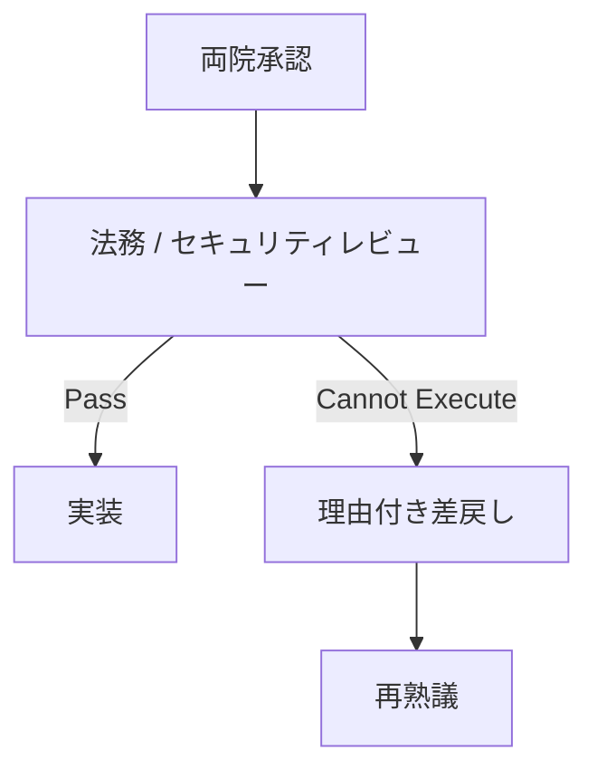

これは株式会社による政策拒否権ではない。

執行不能と判断する場合、理由を公開して議会へ差し戻す。

---

## 7.28 緊急権限

攻撃や重大障害時には限定的な緊急権限を認める。

例えば、

- スマートコントラクト停止
- 分配停止
- 侵害された鍵 Disable
- 重大 API Shutdown

等である。

しかし緊急権限は通常ガバナンスを迂回する恒久権限にしてはならない。

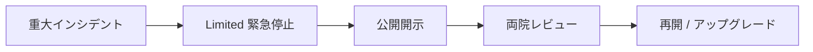

権限者、条件、最大期間、再開条件をプロトコル仕様で定義する。

---

## 7.29 任期

ガバナンス議員には任期を設ける。

目的は、

- 権力固定化防止
- 新しい参加者の導入
- コミュニティとの接続維持

である。

任期、再任、連続任期上限は実証結果を基に決定する。

---

## 7.30 報酬

抽選されたユーザや音楽クリエーターがガバナンスへ参加するには時間的コストがある。

無償参加だけに依存すると、時間・経済的余裕のある人だけが参加できる。

したがって合理的なガバナンス報酬を検討する。

ただし報酬がガバナンス議員になること自体を目的化する水準にはしない。

---

## 7.31 利益相反

ガバナンス議員は関連する利益相反を開示する。

例えば、

- プラットフォーム株式の大量保有
- 特定権利者との契約
- 競合サービスとの関係
- 提案から直接得る経済利益

等である。

重大な利益相反がある提案では、審議参加・投票の制限を検討する。

---

## 7.32 シビル耐性

ユーザ院議会の正統性を守るには、

> 1人が大量アカウントを作成して抽選母集団を支配する

ことを防ぐ必要がある。

ただしシビル耐性のために過剰な個人情報収集を行わない。

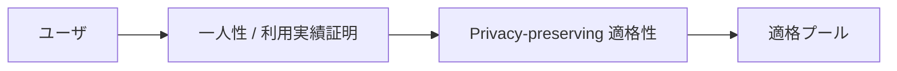

ゼロ知識資格証明等も将来の候補となる。

---

## 7.33 代表性監査

ユーザ院議会が本当にユーザを代表しているかを継続評価する。

指標候補は、

- 適格ユーザ比率
- ガバナンス参加
- 地域的偏り
- 利用形態の偏り
- 委任 Concentration
- Member Turnover
- 提案参加
- 全体投票参加

である。

音楽クリエータ院議会についても同様に代表性を監査する。

---

## 7.34 ガバナンス健全性

ガバナンスの成功を提案数だけで測らない。

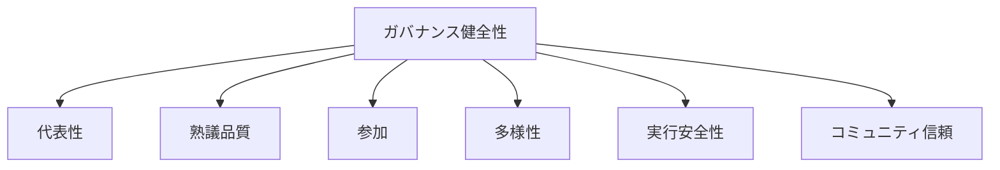

議案が多いことより、必要な議論が適切に行われることを重視する。

---

## 7.35 ガバナンス攻撃

想定する攻撃には、

- シビル攻撃
- Bribery
- Collusion
- 資本 Capture
- 委任 Capture
- ガバナンススパム
- Misinformation
- 悪意ある提案
- 緊急権限不正利用

がある。

セキュリティ Chapterと連携して防御する。

---

## 7.36 ガバナンス透明性

原則として、

- 提案
- 証跡
- 議論
- 投票
- Conflict 開示
- 仕様
- 実装
- 監査
- 実行

を追跡可能にする。

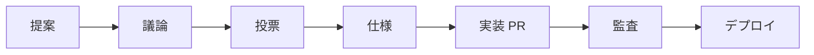

---

## 7.37 GitHubとの接続

プロトコルガバナンスとSoftware 開発をGitHub上で接続する。

```text
governance/
├── proposals/
├── decisions/
├── charters/
└── elections/

protocol/
├── specifications/
└── versions/

contracts/
├── src/
└── test/
```

ガバナンス決定から仕様、コード、テスト、リリースまで追跡できる構造を作る。

---

## 7.38 AI エージェントとの接続

AI エージェントはガバナンス決定を直接本番へデプロイしない。

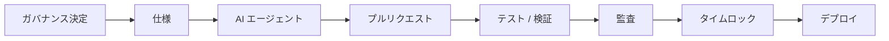

AIは実装を支援するが、正統性を生成する主体ではない。

---

## 7.39 ガバナンスの段階導入

最初から完全な二院制プロトコルガバナンスを稼働させない。

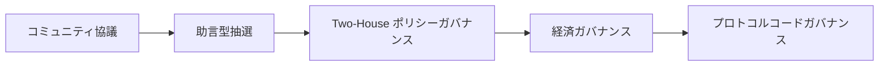

利用実績と制度運用経験を積みながら権限を拡大する。

---

## 7.40 助言型抽選

初期段階では、抽選議会を諮問機関として運用できる。

これにより、

- 抽選方法
- Member 支援
- 熟議方法
- 報酬
- 代表性
- 参加

を実証できる。

その後、実際のプロトコル決定へ権限を移す。

---

## 7.41 ガバナンス議員を育成するのではなく支援する

抽選制の目的は専門政治家を作ることではない。

そのため、Memberには、

- Orientation
- 技術 Explanation
- 法務 Explanation
- 経済シミュレーション
- Neutral Secretariat
- AI 支援

を提供する。

専門知識を参加資格にせず、**必要な知識へアクセスできる制度**を作る。

---

## 7.42 少数意見

多数決で少数意見を消さない。

重要提案では、

- Minority 報告
- Alternative 仕様
- Dissenting Opinion

を記録できるようにする。

将来のプロトコルレビューで参照可能にする。

---

## 7.43 ガバナンス決定の時間軸

すべてを同じ速度で決定しない。

```mermaid
flowchart LR
    OPS[運用事項]
    POLICY[ポリシー]
    PROTOCOL[プロトコル]
    CHARTER[憲章]

    OPS --> FAST[迅速]
    POLICY --> MED[熟議型]
    PROTOCOL --> SLOW[レビュー + タイムロック]
    CHARTER --> VERY[特別多数 + 全体投票]
```

変更の不可逆性と影響が大きいほど、長い熟議を要求する。

---

## 7.44 プロトコル版

ガバナンスで承認された変更はプロトコル版として記録する。

例：

```text
プロトコル v0.1
プロトコル v0.2
プロトコル v1.0
```

各版には、

- ガバナンス決定
- 仕様
- ソースコミット
- テスト
- 監査
- デプロイ

を関連付ける。

---

## 7.45 ガバナンスとコードは法である

Creator First Platformにおけるコードは法であるは、

```mermaid
flowchart LR
    COMMUNITY[音楽クリエーター／ユーザ]
    REPRESENT[抽選代表性]
    DELIB[熟議]
    SPEC[仕様]
    VERIFY[実装検証]
    CODE[コード]
    EXEC[実行]

    COMMUNITY --> REPRESENT --> DELIB --> SPEC --> VERIFY --> CODE --> EXEC
```

という全体を意味する。

コードだけを法令と呼ぶのではない。

> **コードは、正統なガバナンスによって形成されたルールの最終的な執行表現である。**

---

## 7.46 ガバナンスの社会契約

音楽クリエーターは作品を提供するだけのSupplierではない。

ユーザは料金を払うだけの顧客ではない。

両者はプラットフォームを成立させる構成主体である。

そのためCreator First Platformのガバナンスは、

> 音楽クリエーターとユーザが、自ら参加するデジタル空間のルールを共同形成する社会契約

として位置付けられる。

---

## 7.47 全体モデル

```mermaid
flowchart TD
    LAW[適用法令]
    CONST[三憲章]

    LAW --> CONST

    CREATOR[検証済み音楽クリエーター]
    USER[ガバナンス適格ユーザ]

    CREATOR --> CSORT[検証可能抽選]
    USER --> USORT[検証可能抽選]

    CSORT --> CH[音楽クリエータ院議会]
    USORT --> UH[ユーザ院議会]

    CH --> DELIB[共同熟議]
    UH --> DELIB

    CONST --> DELIB

    DELIB --> DECISION[共同承認]
    DECISION --> SPEC[プロトコル仕様]
    SPEC --> LEGAL[法務 / セキュリティレビュー]
    LEGAL --> IMPLEMENT[実装]
    IMPLEMENT --> TEST[テスト / 検証]
    TEST --> TIME[タイムロック]
    TIME --> CODE[スマートコントラクト]
    CODE --> EXEC[自動実行]

    CONST --> REFERENDUM[憲章適合全体投票]
    CREATOR --> REFERENDUM
    USER --> REFERENDUM
```

---

## 7.48 ガバナンス原則

Creator First Platformのガバナンスは次の原則に従う。

1. **音楽クリエーター／ユーザ主権**
   ガバナンスの正統性は音楽クリエーターとユーザから生じる。

2. **抽選**
   通常の音楽クリエーター／ユーザが統治へ参加できるよう、抽選代表制を基本とする。

3. **熟議**
   単純な瞬間投票ではなく、証跡と代替案を検討する。

4. **Bicameralism**
   音楽クリエータ院議会とユーザ院議会の双方が重要なプロトコル変更へ参加する。

5. **Constitutionalism**
   3つの憲章を通常多数決より上位に置く。

6. **資本分離**
   資本保有量とプロトコル支配を分離する。

7. **仕様 before コード**
   ガバナンスはまずルールを仕様として承認する。

8. **検証可能実行**
   仕様、コード、デプロイの対応を検証可能にする。

9. **Limited 法人 Intervention**
   株式会社は法務・安全上必要な場合を除き、ガバナンス決定を恣意的に覆さない。

10. **Reversibility・Accountability**
    タイムロック、監査、緊急 Procedure、公開記録によって変更に責任を持つ。

---

## 7.49 本章のまとめ

Creator First Platformでは、ガバナンス議員をユーザから切り離された専門統治者とは考えない。

ユーザ院議会は、

> **ユーザ → ガバナンス適格ユーザ → 抽選代表 → 熟議**

によって形成される。

音楽クリエータ院議会も同様に、

> **音楽クリエーター → 検証済み音楽クリエーター → 抽選代表 → 熟議**

によって形成される。

両院が共同でプロトコルルールを形成し、

> **音楽クリエーター／ユーザ → 抽選議会 → 熟議 → プロトコル仕様 → スマートコントラクト → 自動執行**

というプロセスへ接続する。

重大な憲章変更については代表議会だけでは完結させず、音楽クリエーター／ユーザコミュニティ全体による全体投票を要求する。

これによって、

- 直接民主制
- 抽選代表制
- 熟議民主制
- 二院制
- 立憲主義
- コードは法である

を組み合わせたデジタルガバナンスを構築する。

Creator First Platformにおいて、スマートコントラクトはガバナンスを置き換えるものではない。

> **音楽クリエーターとユーザが共同形成したルールを、透明かつ検証可能に実行するための制度的・技術的最終層**

である。
