# 7. ガバナンス — Governance

## 7.1 本章の目的

Creator First Platform では、スマートコントラクトによって収益分配などの重要なルールを実行する。

しかし、

> **コードがルールを実行するのであれば、そのコードを誰が決め、誰が変更できるのか**

という問題が生じる。

Creator First Platform は「Code is Law」を、コードが法律より上位にあるという意味では採用しない。

本プロジェクトにおける「Code is Law」とは、

> **合意されたプロトコルルールを、運営者の裁量ではなく、公開されたコードによって一貫して実行する**

という原則を意味する。

そのコード自体は、

1. 3つの憲章
2. クリエイターと利用者による二院制ガバナンス
3. 株式会社による法的責任
4. 公開された変更手続

によって統治される。

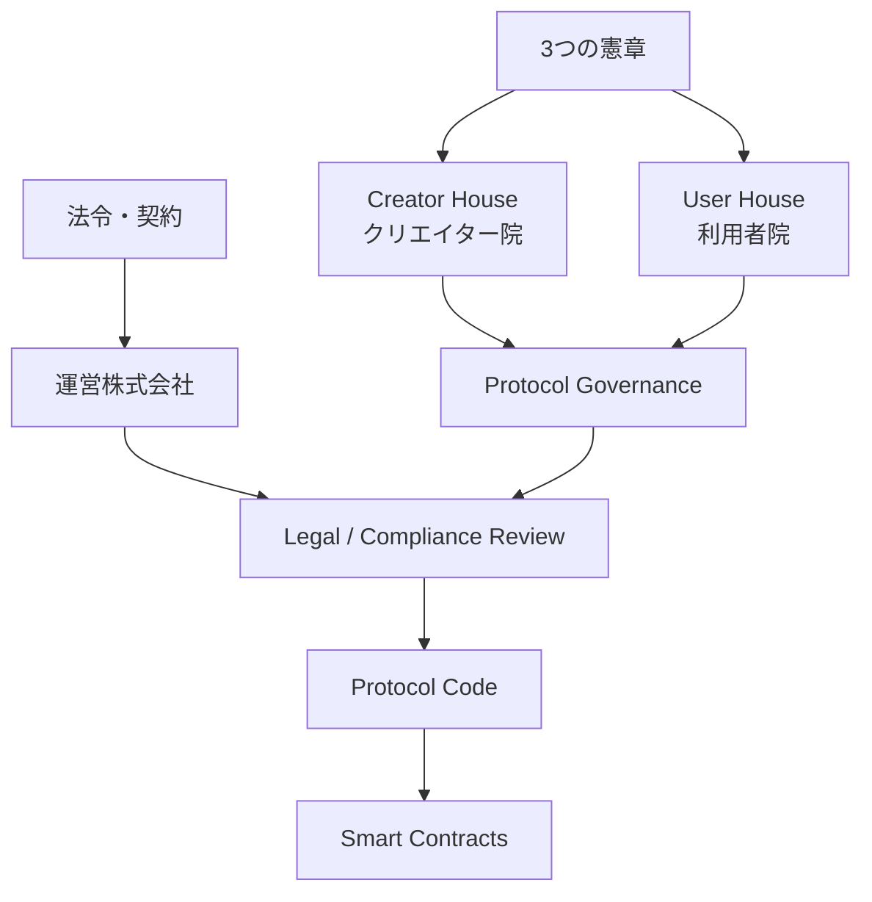

---

## 7.2 なぜガバナンスが必要なのか

従来型プラットフォームでは、収益分配、推薦、手数料、利用条件などの重要ルールを、運営企業が変更できる。

これは迅速な経営判断には適している。

しかし、プラットフォームが巨大化すると、その内部ルールはクリエイターの収入や利用者の音楽体験に大きな影響を与える。

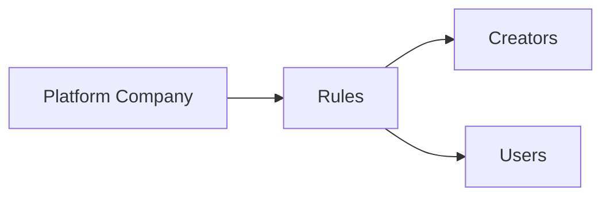

Creator First Platform は、この構造を完全に廃止するのではなく、重要なプロトコルルールについて当事者参加を導入する。

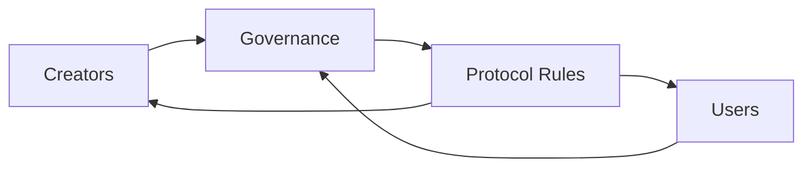

---

## 7.3 3つの憲章を最上位原則とする

日常的な投票によって、プラットフォームの根本理念まで容易に変更できる設計にはしない。

3つの憲章は、通常のプロトコルルールより上位に位置する。

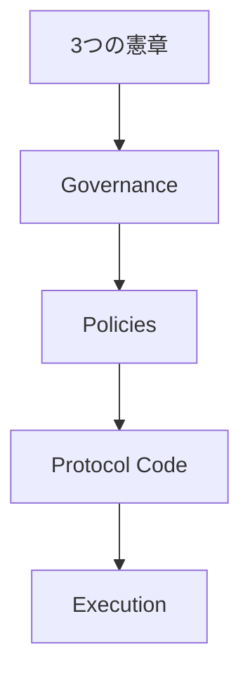

憲章は個別のアルゴリズムや固定的な数値を規定するものではない。

むしろ、

> **ルール変更を評価するための原則**

として機能する。

---

## 7.4 憲章と利用者価値の緊張関係

Creator First の理念を極端に適用すると、利用者の利便性や満足度と衝突する場合がある。

例えば、新人への発見機会を増やすために、利用者が望まない作品を大量に推薦すれば、サービス体験を損なう。

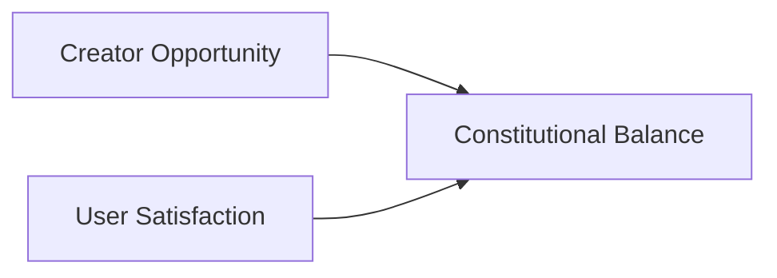

そのため憲章は単純な優先順位ではなく、複数の価値を調整する枠組みとして扱う。

実装上は、

- 利用者が推薦モードを選べる
- Growth Poolと通常分配を分離する
- 推薦と資金分配を完全には同一化しない
- 変更前に影響評価を行う

などによって緊張関係を緩和する。

---

## 7.5 二院制ガバナンス

Creator First Platform のプロトコルガバナンスは、基本的に二院制とする。

- **Creator House — クリエイター院**
- **User House — 利用者院**

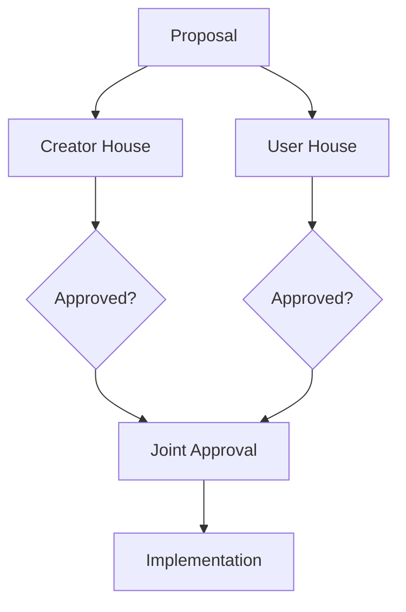

原則として、重要なプロトコル変更には両院の承認を要求する。

---

## 7.6 なぜ二院制なのか

クリエイターと利用者には共通利益もあるが、利害が一致しない場合もある。

例えば、

- クリエイターは高い分配率を望む
- 利用者は低い利用料金を望む
- 新人は発見機会を望む
- 利用者は自分の好みに合う推薦を望む
- 人気クリエイターは実績比例を重視する
- 新人は成長支援を重視する

といった緊張関係がある。

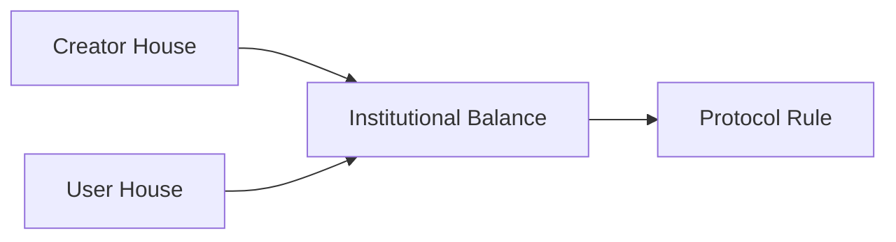

一つのトークン投票へすべての利害を集約するのではなく、異なる立場を制度的に分離する。

---

## 7.7 Creator House

Creator House は、検証されたクリエイターを中心とする議会である。

対象には、

- アーティスト
- 作詞家
- 作曲家
- 実演家
- 独立系制作主体
- その他、定義されたCreator資格を満たす者

などを想定する。

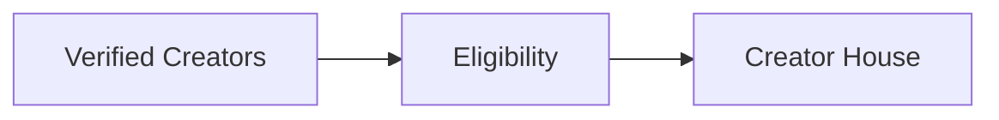

単純に登録楽曲数や売上額だけで投票権を決定しない。

---

## 7.8 User House

User House は、実際にサービスを利用する利用者を中心とする議会である。

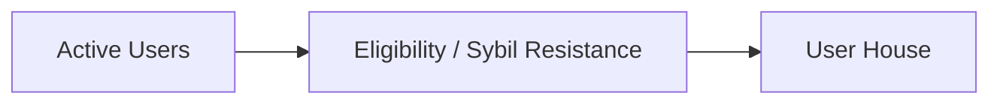

大量の偽アカウント作成によって意思決定を操作できないよう、Sybil Resistanceを設計する。

一方、利用者へ過剰な本人確認を要求しないことも重要である。

---

## 7.9 「1トークン = 1票」を基本にしない

Creator First Platform のガバナンスを、資金力で購入できる仕組みにはしない。

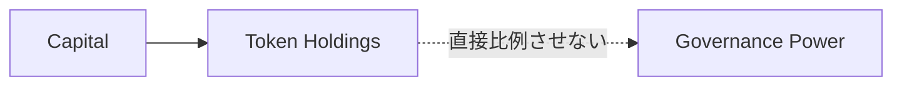

独自トークンを導入する場合でも、トークン保有量をそのまま政治的権力へ変換することは避ける。

---

## 7.10 投票方式

すべての議題に同じ投票方式を使う必要はない。

議題に応じて、

- 1人1票
- Delegation
- Ranked Choice
- Quadratic Voting
- 委員会審査
- Consensusに近い高い承認閾値

などを組み合わせることができる。

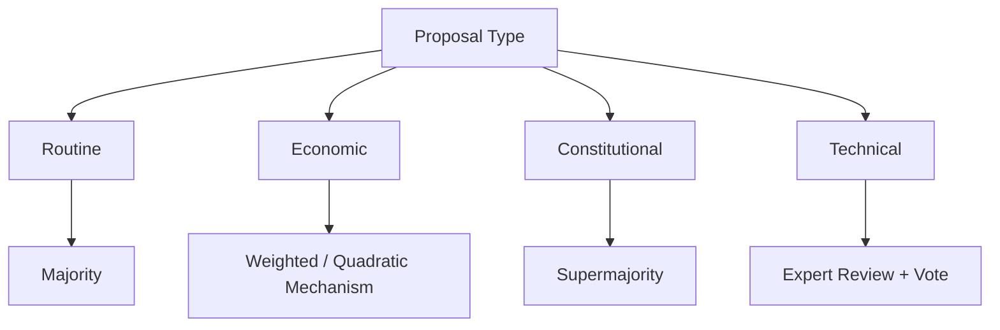

---

## 7.11 Quadratic Voting

選択肢に対する支持の強さを表現する方法としてQuadratic Votingを検討できる。

投票者がある選択肢へ \(v\) 票を投じるために必要なクレジットを、

\[
c = v^2
\]

とする。

これにより、強い関心を表現できる一方、一人が無制限に影響力を集中させるコストは急速に増加する。

ただし、Quadratic Votingだけで公平性が保証されるわけではない。

Sybil Resistanceや投票クレジットの配布方式が重要になる。

---

## 7.12 委任投票

すべての利用者やクリエイターが、すべての技術議題を理解して投票することは現実的ではない。

そこで、投票権を信頼する参加者へ委任できる仕組みを検討する。

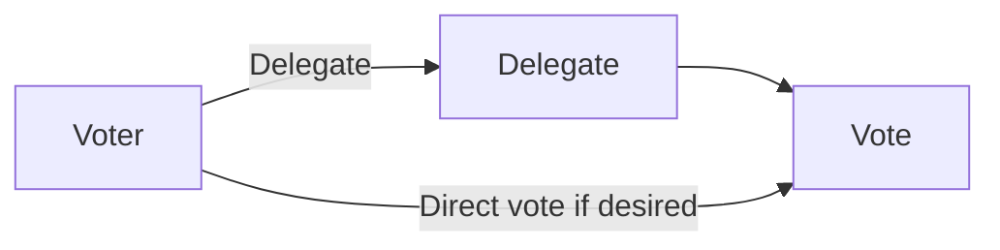

委任は撤回可能とし、恒久的な政治階級を作らない。

---

## 7.13 ガバナンス対象

ガバナンスで決定する対象と、株式会社の経営判断を分離する。

### プロトコルガバナンスの対象例

- Usage-based Pool の基本ルール
- Growth Pool の基本ルール
- 主要な分配パラメータ
- Discovery原則
- 不正利用に関するプロトコルルール
- スマートコントラクト更新
- ガバナンス制度自体
- 憲章に関係するプロトコルポリシー

### 原則として株式会社が担うもの

- 雇用
- 日常的なクラウド運用
- 法務対応
- 税務・会計
- 権利者との契約実務
- 顧客サポート
- セキュリティ運用
- 法令遵守
- 通常の事業執行

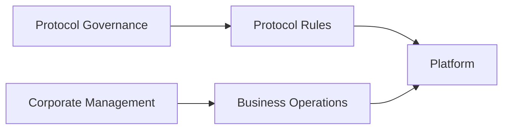

---

## 7.14 法律とガバナンス

DAO投票によって法律や契約上の義務を無効化することはできない。

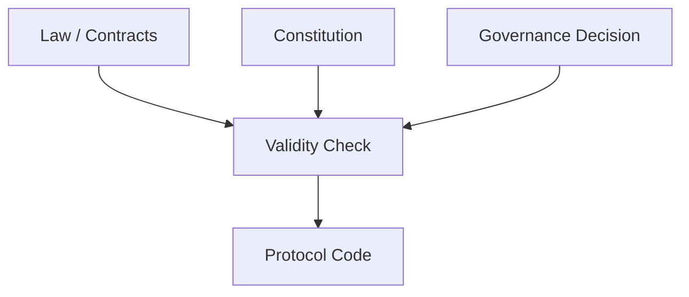

例えばガバナンスが、

- 著作権使用料を支払わない
- 税を支払わない
- 違法コンテンツを配信する
- 契約上の権利を無視する

と決議しても、株式会社はそれを実行できない。

この場合は、拒否理由を公開し、必要に応じて再提案へ戻す。

---

## 7.15 株式会社による拒否権を無制限にしない

法令遵守を理由に運営株式会社がすべてのガバナンス決定を拒否できるなら、二院制は形式的なものになる。

そのため、株式会社が実施を拒否できる理由を限定する。

例えば、

- 法令違反
- 契約違反
- 明白なセキュリティ危機
- 技術的に実行不能
- 重大な財務継続性リスク

などである。


拒否理由は記録し、可能な範囲で公開する。

---

## 7.16 提案プロセス

重要な変更を、投票画面に突然出して即日決定することは避ける。

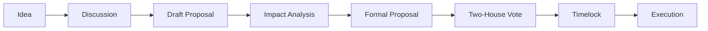

提案には少なくとも、

- 目的
- 現状
- 変更内容
- 影響範囲
- メリット
- リスク
- 経済的影響
- 利用者への影響
- クリエイターへの影響
- 技術仕様
- ロールバック方針

を含める。

---

## 7.17 シミュレーションと影響評価

経済モデルや推薦ルールの変更では、投票前にシミュレーションを行う。

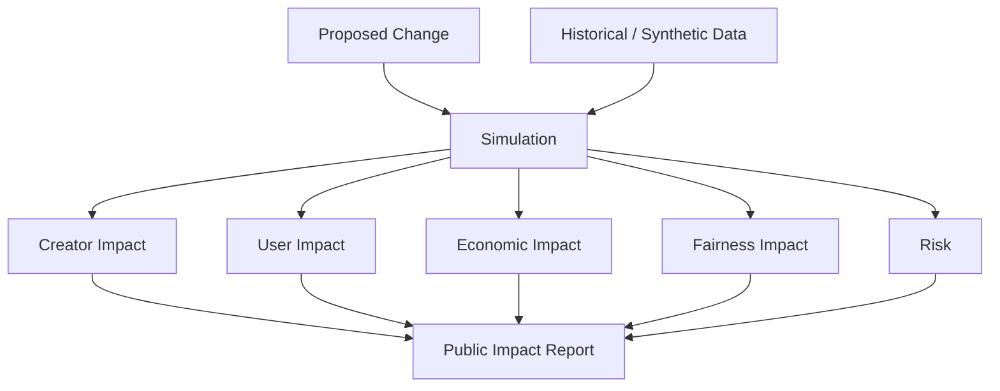

「良さそうだから投票する」だけではなく、変更が誰にどのような影響を与えるかを可視化する。

---

## 7.18 Code Governance

承認されたルールをスマートコントラクトへ反映する場合、ガバナンス決定と実際のコード変更を結び付ける。

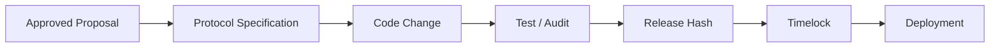

「投票で承認された内容」と「実際にデプロイされたコード」が一致していることを検証可能にする。

---

## 7.19 Timelock

重要なスマートコントラクト変更は、承認直後に実行しない。

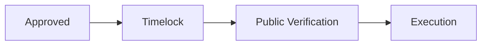

Timelock期間中に、

- コード確認
- 権利者への通知
- 利用者への通知
- セキュリティ確認
- 法的問題の確認

を行えるようにする。

---

## 7.20 緊急時ガバナンス

脆弱性や攻撃が発生した場合、通常の長い投票プロセスを待てないことがある。

そのため限定的なEmergency Mechanismを設ける。

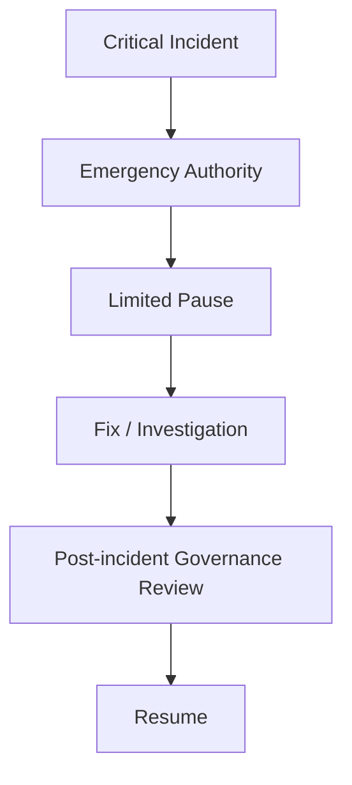

Emergency Authorityは、

- 権限範囲を限定する
- 期限を設ける
- 監査ログを残す
- 事後承認を要求する
- 資金を自由に移動できない

などの制約を設ける。

---

## 7.21 憲章違反審査

両院が承認した提案でも、3つの憲章に明白に反する可能性がある。

そこで、重要提案にはConstitutional Reviewを設ける。

```mermaid
flowchart LR
    VOTE[Two-House Approval]
    REVIEW[Constitutional Review]
    PASS[Proceed]
    RETURN[Return for Revision]

    VOTE --> REVIEW
    REVIEW -->|Compatible| PASS
    REVIEW -->|Conflict| RETURN
```

この審査機関自体が恒久的な最高権力にならないよう、権限を「憲章との整合性確認」に限定する。

---

## 7.22 憲章そのものの変更

憲章は絶対に変更不能とする必要はないが、通常のパラメータ変更と同じ手続では変更できないようにする。

例えば、

- 両院の特別多数
- 長い公開議論期間
- 複数回の投票
- 法務確認
- 長いTimelock

などを要求する。

```mermaid
flowchart LR
    PROPOSE[Constitution Amendment]
    DISCUSS[Extended Discussion]
    CH[Creator Supermajority]
    UH[User Supermajority]
    REVIEW[Legal / Constitutional Review]
    TIME[Extended Timelock]
    AMEND[Amendment]

    PROPOSE --> DISCUSS
    DISCUSS --> CH
    DISCUSS --> UH
    CH --> REVIEW
    UH --> REVIEW
    REVIEW --> TIME --> AMEND
```

---

## 7.23 少数派保護

多数決だけでは、小規模ジャンル、新人、障害のある利用者、少数言語コミュニティなどの利益が継続的に無視される可能性がある。

そのため、

- 影響評価
- 公開コメント
- 異議申立て
- 特定議題の高い承認閾値
- 少数派意見の記録

などを制度化する。

```mermaid
flowchart TD
    MAJ[Majority Decision]
    IMPACT[Minority Impact Review]
    RIGHTS[Constitutional Principles]

    MAJ --> FINAL[Final Decision]
    IMPACT --> FINAL
    RIGHTS --> FINAL
```

---

## 7.24 人気クリエイターによる支配を防ぐ

Creator House が再生数や収益だけで投票力を決めると、一部の大規模アーティストが議会を支配する可能性がある。

```mermaid
flowchart LR
    POPULAR[High Popularity]
    MONEY[High Revenue]
    POWER[Political Power]

    POPULAR --> MONEY
    MONEY -.->|直接比例させない| POWER
```

Creator House は経済的成功を否定する制度ではない。

しかし、音楽市場での成功がそのままルール決定権の独占につながらないよう設計する。

---

## 7.25 Sybil Resistance

User HouseやQuadratic Votingでは、複数アカウントによる投票操作が大きな問題になる。

```mermaid
flowchart TD
    HUMAN[One Participant]
    HUMAN --> A1[Account 1]
    HUMAN --> A2[Account 2]
    HUMAN --> A3[Account 3]

    A1 --> ATTACK[Sybil Attack]
    A2 --> ATTACK
    A3 --> ATTACK
```

対策として、

- アカウント継続期間
- 有料利用実績
- Proof of Personhood的手法
- Verifiable Credentials
- 不正検出
- Reputation
- Rate Limit

などを組み合わせる。

プライバシーを損なわずに「一人が大量の政治的人格を作れない」ことを目指す。

---

## 7.26 ガバナンス参加へのインセンティブ

参加者に過度な金銭報酬を与えると、音楽コミュニティではなく報酬獲得目的の投票者を増やす可能性がある。

そのため、

- Reputation
- Contributor Recognition
- Delegate評価
- コミュニティ上の役割
- 必要な場合の限定的な実費・貢献報酬

などを中心に検討する。

---

## 7.27 投票率が低い場合

ガバナンスの最大の問題の一つは、制度が存在しても誰も参加しないことである。

そのため、

```mermaid
flowchart LR
    USERS[Participants]
    INFO[Simple Explanation]
    DELEGATE[Delegation]
    NOTIFY[Relevant Notifications]
    VOTE[Governance Participation]

    USERS --> INFO --> VOTE
    USERS --> DELEGATE --> VOTE
    USERS --> NOTIFY --> VOTE
```

とし、すべての議題への参加を要求しない。

利用者が自分に関係する重要議題を理解しやすくする。

---

## 7.28 AIによるガバナンス支援

AIは、ガバナンスを支援するために利用できる。

例えば、

- 長い提案の要約
- 賛否論点の整理
- 過去提案との比較
- 経済シミュレーションの説明
- コード変更と提案内容の差分確認
- 多言語翻訳

などである。

```mermaid
flowchart LR
    PROPOSAL[Proposal]
    AI[AI Assistance]
    HUMAN[Human Participants]
    DECISION[Decision]

    PROPOSAL --> AI
    AI --> HUMAN
    HUMAN --> DECISION
```

ただしAI自身に投票権を与えたり、AIの判定だけで提案を可決・拒否したりすることは想定しない。

---

## 7.29 透明性

ガバナンスの信頼性には、意思決定履歴の透明性が必要である。

公開対象として、

- 提案
- 議論
- 影響評価
- 投票結果
- 委任状況
- 実装コード
- 監査結果
- Timelock
- 実際のデプロイ

などを想定する。

```mermaid
flowchart LR
    PROPOSAL[Proposal]
    VOTE[Vote]
    CODE[Code]
    DEPLOY[Deployment]

    PROPOSAL --> HISTORY[Governance History]
    VOTE --> HISTORY
    CODE --> HISTORY
    DEPLOY --> HISTORY
```

---

## 7.30 株主とDAOガバナンスの分離

運営株式会社がSTO等で資金調達する場合、株主・投資家とCreator House / User Houseは異なる役割を持つ。

```mermaid
flowchart TD
    COMPANY[Operating Corporation]

    SHARE[Shareholders / Investors] --> COMPANY
    BOARD[Board / Management] --> COMPANY

    CH[Creator House] --> PROTOCOL[Protocol Governance]
    UH[User House] --> PROTOCOL

    COMPANY --> PLATFORM[Platform Operations]
    PROTOCOL --> PLATFORM
```

株主は株式会社法上・金融商品上の権利を持ち、Creator HouseとUser Houseはプロトコルルールを統治する。

両者を同一の投票制度に統合しない。

---

## 7.31 四層ガバナンスモデル

Creator First Platform の統治構造は、最終的に次の四層として整理できる。

```mermaid
flowchart TD
    L1[Layer 1<br/>Constitution]
    L2[Layer 2<br/>Creator House + User House]
    L3[Layer 3<br/>Protocol / Smart Contracts]
    L4[Layer 4<br/>Operating Corporation]

    L1 --> L2
    L2 --> L3
    L4 --> L3

    LAW[Law / Contracts] --> L4
```

### Layer 1 — Constitution

変更困難な根本原則。

### Layer 2 — Democratic Governance

クリエイターと利用者による二院制。

### Layer 3 — Code Governance

承認されたルールをスマートコントラクトとして実行する。

### Layer 4 — Corporate Responsibility

株式会社が法務、契約、会計、運営上の責任を負う。

この四層は競合するのではなく、相互に制約し合う。

---

## 7.32 ガバナンスの全体フロー

```mermaid
sequenceDiagram
    participant P as Proposer
    participant C as Community
    participant CH as Creator House
    participant UH as User House
    participant Corp as Corporation
    participant Dev as Protocol Developers
    participant SC as Smart Contract

    P->>C: Draft proposal
    C->>C: Discussion / Impact Review
    C->>CH: Formal proposal
    C->>UH: Formal proposal
    CH->>CH: Deliberation / Vote
    UH->>UH: Deliberation / Vote
    CH-->>Corp: Approval
    UH-->>Corp: Approval
    Corp->>Corp: Legal / Contract Review
    Corp->>Dev: Approved specification
    Dev->>Dev: Code / Test / Audit
    Dev->>C: Release candidate
    C->>C: Timelock / Verification
    Dev->>SC: Deploy / Execute
```

---

## 7.33 初期段階のガバナンス

サービス開始時点から完全なDAOを運用することは現実的ではない。

初期段階では、

```mermaid
flowchart LR
    P1[Phase 1<br/>Advisory Governance]
    P2[Phase 2<br/>Formal Houses]
    P3[Phase 3<br/>On-chain Governance]
    P4[Phase 4<br/>Mature Constitutional Governance]

    P1 --> P2 --> P3 --> P4
```

と段階的に移行する。

### Phase 1

クリエイター・利用者コミュニティによる公開レビューと諮問。

### Phase 2

Creator House / User Houseを正式制度化。

### Phase 3

重要なプロトコル変更をオンチェーン承認と接続。

### Phase 4

憲章審査、委任、二院制、Timelock、コード実行を統合した成熟モデル。

---

## 7.34 Progressive Decentralization

分散化そのものを目的にしない。

> **当事者が統治すべき領域を、技術とコミュニティの成熟に合わせて段階的に移譲する。**

```mermaid
flowchart LR
    COMPANY[Company-led]
    SHARED[Shared Governance]
    PROTOCOL[Protocol Governance]

    COMPANY --> SHARED --> PROTOCOL
```

権利処理や法的責任など、法人が担うべき領域まで無理にDAO化しない。

---

## 7.35 ガバナンスの成功指標

ガバナンスの成功を「投票数」だけで評価しない。

例えば、

- 参加者の多様性
- Creator Houseの集中度
- User Houseの参加率
- 委任の集中度
- 提案から実装までの期間
- 憲章違反による差戻し
- 緊急権限の利用回数
- ガバナンス決定と実装コードの一致
- 少数派への影響
- クリエイター・利用者双方の満足度

などを継続的に評価する。

---

## 7.36 本章のまとめ

Creator First Platform のガバナンスは、

> **DAOに会社を置き換える仕組みではない。**

また、

> **トークン保有者にプラットフォームを支配させる仕組みでもない。**

目指すのは、クリエイター、利用者、コード、法人、法制度の役割を分離しながら、一つの統治構造として接続することである。

```mermaid
flowchart TD
    CONST[3つの憲章]

    CONST --> CH[Creator House]
    CONST --> UH[User House]

    CH --> GOV[Democratic Governance]
    UH --> GOV

    GOV --> CODE[Code Governance]
    CODE --> SC[Smart Contracts]

    CORP[Operating Corporation] --> RESPONSIBILITY[Legal / Corporate Responsibility]
    RESPONSIBILITY --> SC

    LAW[Law / Contracts] --> RESPONSIBILITY
```

基本原則は、

> **憲章が方向を定め、クリエイターと利用者がルールを決め、コードがそのルールを実行し、株式会社が現実社会に対する責任を負う。**

という構造である。

Creator First Platform における「Code is Law」は、コードへの無条件な服従を意味しない。

> **コードを法のように扱うからこそ、そのコードを民主的・透明・検証可能に統治する制度が必要である。**

これが本プラットフォームのガバナンス設計の中心思想である。
