# 7. ガバナンス — Governance

## 7.1 ガバナンスの目的

Creator First PlatformのGovernanceは、Token保有者による単純な多数決ではない。

Platformを実際に構成するCreatorとUserが、そのルールを共同形成するための制度である。

基本構造は、

> **Creator/User → 抽選議会 → 熟議 → Protocol Specification → Smart Contract → 自動執行**

である。

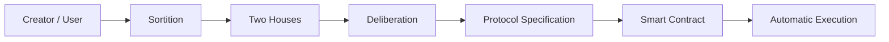

---

## 7.2 Governanceの正統性

Smart Contractはルールを自動執行できる。

しかし、

> 誰がそのルールを決めるのか

という問題をコード自身は解決できない。

Creator First Platformでは、Protocol Codeの正統性を、

```text
Creator / User
      ↓
正統な代表形成
      ↓
熟議
      ↓
Protocol Specification
      ↓
監査されたCode
```

から導く。

Code is Lawの前提は、**Lawを形成する正統なGovernance**である。

---

## 7.3 Creator

Creatorとは、Platform上で流通する作品の創作・制作に実質的に関与し、所定の登録・検証手続きを経た参加者をいう。

Creatorには、

- 作詞者
- 作曲者
- 実演家
- アーティスト
- 音源制作者
- プロデューサー

等を含み得る。

CreatorとRights Holderは区別する。

Creator Houseの資格は、資本保有量ではなくCreatorとしての活動と検証に基づく。

---

## 7.4 User

Userとは、Creator First Platformを利用してコンテンツを聴取、発見、評価、共有、支援等する者をいう。

すべてのUserが常時Governance Memberになるわけではない。

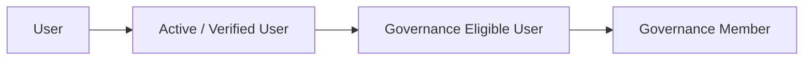

この区別によって、日常利用とGovernance責任を分離する。

---

## 7.5 Governance Eligible User

Governance Memberの母集団となるUserをGovernance Eligible Userと呼ぶ。

資格条件はProtocol Specificationで定める。

原則として、

- 一定期間の実利用
- 本人性またはPersonhoodの適切な確認
- Sybil耐性
- 不正利用の不存在
- プライバシー保護

を考慮する。

課金額や株式・Token保有量を主要な資格基準にはしない。

---

## 7.6 Governance Member

Governance MemberはUserとは別の階級ではない。

> **Eligible Userの集合から一定期間、熟議と意思決定を委ねられた代表User**

である。

原則として、

- 任期制
- Active User資格の維持
- 利益相反開示
- 連続任期制限
- 辞退可能
- 必要に応じた解任・交代

を設ける。

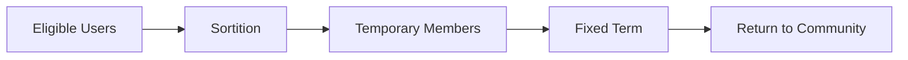

代表を恒久的な政治階級にしない。

---

## 7.7 Creator House

Creator HouseはCreator Communityを代表する。

主な対象は、

- Creator Rights
- Distribution
- Rights Registry
- Creator Onboarding
- Creator Support
- Creator Economy

である。

Creator Houseの代表者も、Verified Creatorの母集団から抽選することを基本とする。

---

## 7.8 User House

User HouseはUser Communityを代表する。

主な対象は、

- User Experience
- Privacy
- Subscription
- Discovery
- Recommendation
- Community
- User Rights

である。

User HouseのGovernance MemberはGovernance Eligible Userから抽選される。


---

## 7.9 なぜ抽選なのか

選挙のみの代表制では、

- 人気
- 資金
- 組織票
- 発信力
- 政治活動への時間

が代表選出に影響しやすい。

抽選は、

> 普通に創作しているCreator、普通に音楽を利用しているUser

がGovernanceへ参加する機会を確保する。

Governanceの専門家だけがProtocolを支配することを防ぐ。

---

## 7.10 抽選は検証可能でなければならない

抽選結果そのものもPlatform運営会社を信頼するだけでは不十分である。

抽選アルゴリズムは、

- 母集団
- Eligibility
- Randomness
- Selection Algorithm
- Result

を検証可能にする。

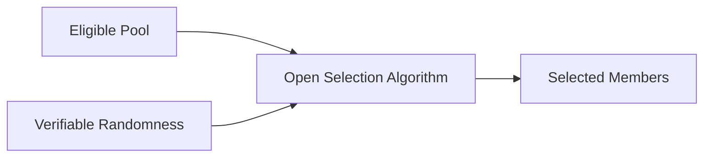

抽選アルゴリズムとEligibility RuleはProtocol Specificationとして公開する。

---

## 7.11 代表性の補正

完全な単純抽選だけでは、小さな議会で偶然の偏りが生じる可能性がある。

そのため必要に応じて層化抽選を検討する。

User Houseでは例えば、

- 地域
- 利用頻度
- Subscription形態
- 利用ジャンル

等について極端な偏りを防ぐ。

Creator Houseでは、

- Creatorの役割
- 活動規模
- ジャンル
- 地域

等を考慮できる。

ただし属性区分そのものが差別や固定的身分を生まないよう慎重に設計する。

---

## 7.12 熟議

抽選はGovernanceの入口であり、意思決定そのものではない。

Governance Memberは、

1. Proposalを受け取る
2. Evidenceを確認する
3. Stakeholderの意見を聞く
4. 代替案を比較する
5. 影響をSimulationする
6. 両院で熟議する
7. 投票する

というプロセスを経る。

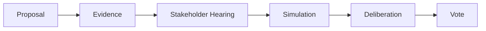

Governanceを瞬間的な人気投票にしない。

---

## 7.13 AIによる熟議支援

AIはGovernance Memberに対して、

- Proposal要約
- 賛否論点整理
- 過去Decision検索
- Economic Simulation
- Security Risk分析
- Minority Opinionの抽出
- 法務論点の整理

を支援できる。

ただしAIは投票権を持たない。

AIが提示する分析についても、根拠・前提・不確実性を可能な限り確認可能にする。

---

## 7.14 二院制

重要なProtocol変更はCreator HouseとUser House双方の承認を原則とする。

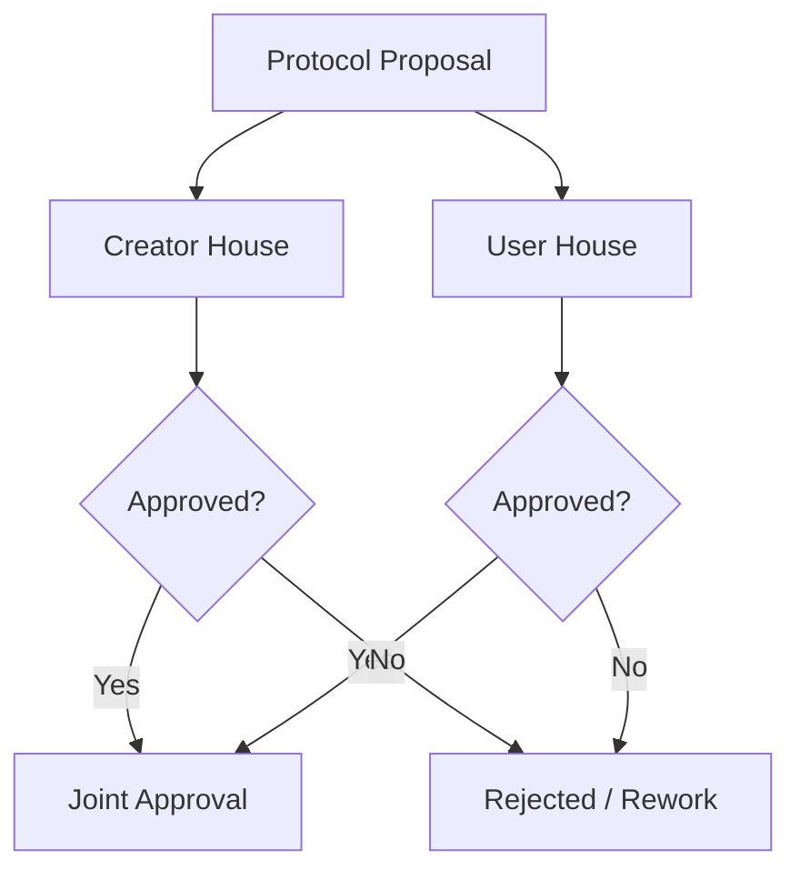

これによりCreatorの利益だけでもUserの利益だけでもProtocolを一方的に変更できない。

---

## 7.15 両院の非対称な専門性

二院は完全に同じ議会ではない。

Creator HouseはCreator EconomyとRightsに強い関心を持ち、User HouseはUX、Privacy、Discovery等に強い関心を持つ。

しかし重要Protocolについては、専門領域を理由に一方の院を排除しない。

専門性は審議の役割分担に使い、主権の独占には使わない。

---

## 7.16 Proposal

Proposalには最低限、

- 目的
- 現行仕様
- 変更仕様
- Creatorへの影響
- Userへの影響
- Economic Impact
- Security Impact
- Privacy Impact
- Legal Issues
- Migration Plan
- Rollback Plan

を含める。

コードだけのPull RequestをGovernance Proposalとはみなさない。

---

## 7.16.1 クアドラティック投票

抽選された議員は、各会期に同量の譲渡不能なVoice Creditを受け取る。提案$p$へ強度$v$の票を投じる費用は$v^2$ Creditとし、複数提案への配分総額を会期予算以内に制限する。

このVoice Creditは通貨やTokenではない。JPYC、株式、STO、SBT、収益、再生数または人気によって購入・増加できず、他者への譲渡、委任、次期繰越もできない。

Quadratic Votingは、有限の予算で提案ごとの意思の強さを表すために利用する。ただしNet Scoreだけでは可決せず、Creator HouseとUser Houseがそれぞれ独立したQuorumとApproval Thresholdを満たさなければならない。

具体的な議会画面、投票計算、変更区分、TimelockおよびContract境界は、[二院制議会・Governance](../governance/index.md)とProtocol Specificationで定義する。

---

## 7.16.2 Contract変更の拘束

投票対象は説明文だけではなく、Proposal Revision、Specification hash、Chain ID、Target、calldata、Source Commit、ArtifactおよびCode hashを含むExecution Manifestへ接続する。

投票開始後にこれらが変わった場合、同じ承認で実行せず、新しいRevisionとして再審議する。両院承認後も、変更区分に応じた法務・Security Review、Test、AuditおよびTimelockを経て、承認済みManifestだけを実行する。

---

## 7.17 Protocol Specification

Governanceが承認する対象は、原則としてSmart ContractのSource Codeそのものではなく、まず**Protocol Specification**である。

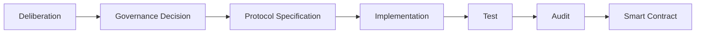

これによって、

> 民主的意思決定

と

> Software Engineering

を適切に分離する。

---

## 7.18 SpecificationとCodeの一致

実装されたCodeがGovernanceで承認されたSpecificationと一致していることを検証する。

方法として、

- Automated Tests
- Formal Verification
- Independent Review
- Smart Contract Audit
- Reproducible Build

等を利用する。

CodeがSpecificationを変更してはならない。

---

## 7.19 自動執行

承認・実装・監査されたCodeは、原則としてSmart Contractによって自動執行する。

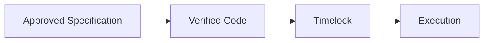

Platform運営者が個別案件ごとに恣意的に結果を変更する余地を減らす。

---

## 7.20 3つの憲章

Governanceは3つの憲章に従う。

- Creator Charter
- User Charter
- Ecosystem Charter

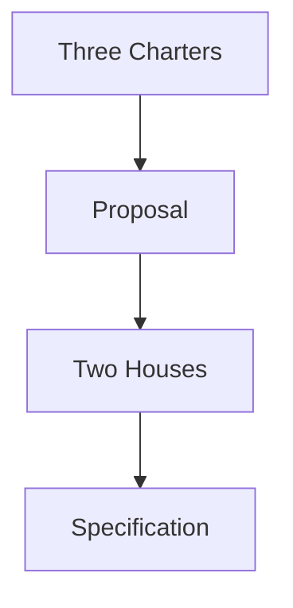

通常の多数決によって憲章を実質的に無効化できないようにする。

---

## 7.21 憲章変更

憲章変更は通常Protocol変更より高い成立要件を持つ。

例えば、

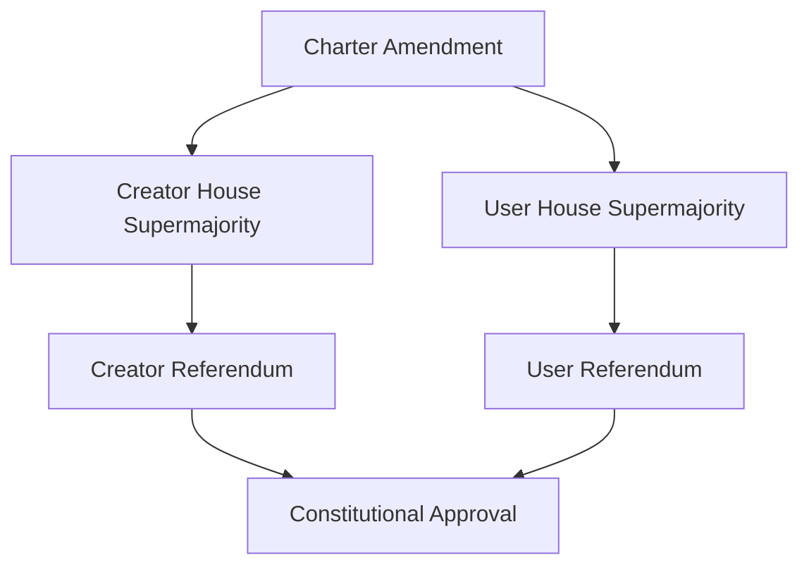

とする。

具体的な特別多数率やQuorumはProtocol Specificationで定める。

---

## 7.22 主権の源泉

Creator HouseやUser Houseそのものを主権者とは定義しない。

> **Creator CommunityとUser Communityが主権の源泉である。**

議会はその統治機能を一定期間委ねられた熟議機関である。

この原則によって、Governance Memberの固定的支配を防ぐ。

---

## 7.23 Referendum

重大事項についてはCommunity全体のReferendumを利用する。

候補として、

- 憲章変更
- Governance制度の根本変更
- Creator/Userの基本権変更
- Protocol Governanceの廃止
- 大規模なTreasury構造変更

等がある。

日常的な技術変更まで全User投票にするとGovernance Fatigueを生むため、通常案件は抽選議会に委ねる。

---

## 7.24 Delegation

抽選議員とは別に、Community Memberが意見形成やReferendum投票を他者へ委任できる仕組みを検討する。

委任は、

- 任意
- 撤回可能
- 期間限定
- Policy Domain別

とすることができる。

ただしDelegation Concentrationを監視し、少数者への政治力集中を防ぐ。

このDelegation候補はCommunity Referendumまたは意見形成に関するものであり、抽選議員へ付与されたQuadratic VotingのVoice Creditは委任・譲渡できない。

---

## 7.25 Governanceと資本を分離する

株式、STO、Governance Token等の資本保有量が、そのままCreator House/User Houseの議席や投票力にならないようにする。

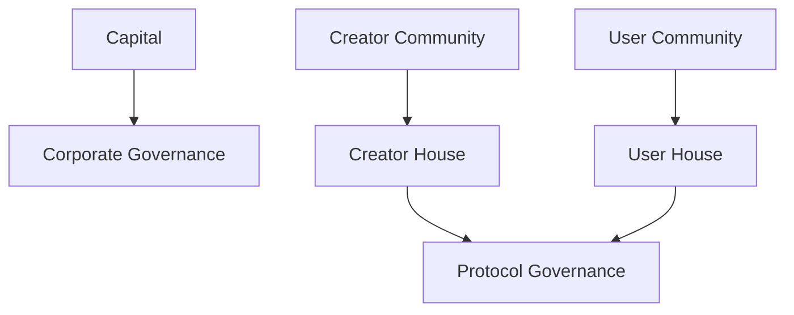

これによりCapital Captureを防ぐ。

---

## 7.26 株式会社との関係

株式会社は、

- 契約
- 権利処理
- 税務
- 会計
- 雇用
- 規制対応
- STO
- 現実社会での責任

を負う。

Protocol Governanceは、

- Distribution Rules
- Discovery Rules
- Governance Rules
- Protocol Parameters
- Smart Contract Upgrade

等を決定する。

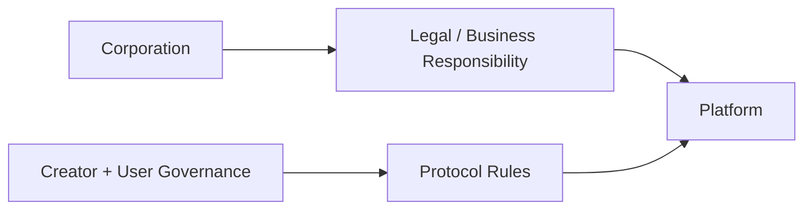

---

## 7.27 Legal / Security Review

両院の承認後、株式会社および独立した専門レビュー機能は、

- 適法性
- 契約上の履行可能性
- Security
- Technical Safety

を確認する。

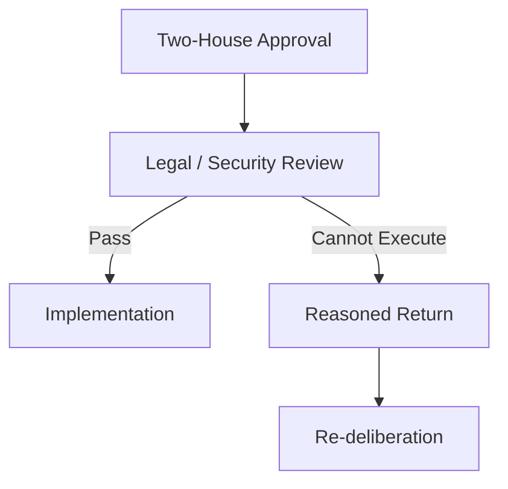

これは株式会社による政策拒否権ではない。

執行不能と判断する場合、理由を公開して議会へ差し戻す。

---

## 7.28 Emergency Authority

攻撃や重大障害時には限定的なEmergency Authorityを認める。

例えば、

- Smart Contract Pause
- Distribution Pause
- Compromised Key Disable
- Critical API Shutdown

等である。

しかしEmergency Authorityは通常Governanceを迂回する恒久権限にしてはならない。

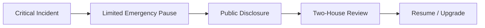

権限者、条件、最大期間、再開条件をProtocol Specificationで定義する。

---

## 7.29 任期

Governance Memberには任期を設ける。

目的は、

- 権力固定化防止
- 新しい参加者の導入
- Communityとの接続維持

である。

任期、再任、連続任期上限は実証結果を基に決定する。

---

## 7.30 Compensation

抽選されたUserやCreatorがGovernanceへ参加するには時間的コストがある。

無償参加だけに依存すると、時間・経済的余裕のある人だけが参加できる。

したがって合理的なGovernance Compensationを検討する。

ただし報酬がGovernance Memberになること自体を目的化する水準にはしない。

---

## 7.31 利益相反

Governance Memberは関連する利益相反を開示する。

例えば、

- Platform株式の大量保有
- 特定Rights Holderとの契約
- 競合サービスとの関係
- Proposalから直接得る経済利益

等である。

重大な利益相反があるProposalでは、審議参加・投票の制限を検討する。

---

## 7.32 Sybil Resistance

User Houseの正統性を守るには、

> 1人が大量アカウントを作成して抽選母集団を支配する

ことを防ぐ必要がある。

ただしSybil Resistanceのために過剰な個人情報収集を行わない。

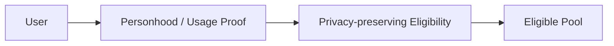

Zero-Knowledge Credential等も将来の候補となる。

---

## 7.33 Representation Audit

User Houseが本当にUserを代表しているかを継続評価する。

指標候補は、

- Eligible User比率
- Governance Participation
- 地域的偏り
- 利用形態の偏り
- Delegation Concentration
- Member Turnover
- Proposal Participation
- Referendum Participation

である。

Creator Houseについても同様に代表性を監査する。

---

## 7.34 Governance Health

Governanceの成功をProposal数だけで測らない。

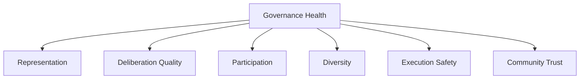

議案が多いことより、必要な議論が適切に行われることを重視する。

---

## 7.35 Governance Attack

想定する攻撃には、

- Sybil Attack
- Bribery
- Collusion
- Capital Capture
- Delegation Capture
- Governance Spam
- Misinformation
- Malicious Proposal
- Emergency Authority Abuse

がある。

Security Chapterと連携して防御する。

---

## 7.36 Governance Transparency

原則として、

- Proposal
- Evidence
- Discussion
- Vote
- Conflict Disclosure
- Specification
- Implementation
- Audit
- Execution

を追跡可能にする。

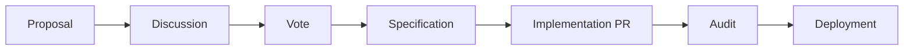

---

## 7.37 GitHubとの接続

Protocol GovernanceとSoftware DevelopmentをGitHub上で接続する。

```text
governance/
├── proposals/
├── decisions/
├── charters/
└── elections/

protocol/
├── specifications/
└── versions/

contracts/
├── src/
└── test/
```

Governance DecisionからSpecification、Code、Test、Releaseまで追跡できる構造を作る。

---

## 7.38 AI Agentとの接続

AI AgentはGovernance Decisionを直接本番へDeployしない。


AIは実装を支援するが、正統性を生成する主体ではない。

---

## 7.39 Governanceの段階導入

最初から完全な二院制Protocol Governanceを稼働させない。

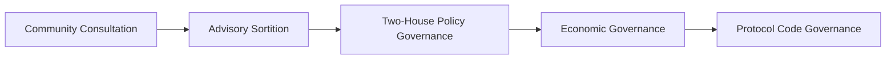

利用実績と制度運用経験を積みながら権限を拡大する。

---

## 7.40 Advisory Sortition

初期段階では、抽選議会を諮問機関として運用できる。

これにより、

- 抽選方法
- Member Support
- 熟議方法
- Compensation
- 代表性
- Participation

を実証できる。

その後、実際のProtocol Decisionへ権限を移す。

---

## 7.41 Governance Memberを育成するのではなく支援する

抽選制の目的は専門政治家を作ることではない。

そのため、Memberには、

- Orientation
- Technical Explanation
- Legal Explanation
- Economic Simulation
- Neutral Secretariat
- AI Assistance

を提供する。

専門知識を参加資格にせず、**必要な知識へアクセスできる制度**を作る。

---

## 7.42 少数意見

多数決で少数意見を消さない。

重要Proposalでは、

- Minority Report
- Alternative Specification
- Dissenting Opinion

を記録できるようにする。

将来のProtocol Reviewで参照可能にする。

---

## 7.43 Governance Decisionの時間軸

すべてを同じ速度で決定しない。

```mermaid
flowchart LR
    OPS[Operational]
    POLICY[Policy]
    PROTOCOL[Protocol]
    CHARTER[Charter]

    OPS --> FAST[Fast]
    POLICY --> MED[Deliberative]
    PROTOCOL --> SLOW[Review + Timelock]
    CHARTER --> VERY[Supermajority + Referendum]
```

変更の不可逆性と影響が大きいほど、長い熟議を要求する。

---

## 7.44 Protocol Version

Governanceで承認された変更はProtocol Versionとして記録する。

例：

```text
Protocol v0.1
Protocol v0.2
Protocol v1.0
```

各Versionには、

- Governance Decision
- Specification
- Source Commit
- Tests
- Audit
- Deployment

を関連付ける。

---

## 7.45 GovernanceとCode is Law

Creator First PlatformにおけるCode is Lawは、

```mermaid
flowchart LR
    COMMUNITY[Creator / User]
    REPRESENT[Sortition Representation]
    DELIB[Deliberation]
    SPEC[Specification]
    VERIFY[Implementation Verification]
    CODE[Code]
    EXEC[Execution]

    COMMUNITY --> REPRESENT --> DELIB --> SPEC --> VERIFY --> CODE --> EXEC
```

という全体を意味する。

CodeだけをLawと呼ぶのではない。

> **Codeは、正統なGovernanceによって形成されたRuleの最終的な執行表現である。**

---

## 7.46 Governanceの社会契約

Creatorは作品を提供するだけのSupplierではない。

Userは料金を払うだけのCustomerではない。

両者はPlatformを成立させる構成主体である。

そのためCreator First PlatformのGovernanceは、

> CreatorとUserが、自ら参加するデジタル空間のルールを共同形成する社会契約

として位置付けられる。

---

## 7.47 全体モデル

```mermaid
flowchart TD
    LAW[Applicable Law]
    CONST[Three Charters]

    LAW --> CONST

    CREATOR[Verified Creators]
    USER[Governance Eligible Users]

    CREATOR --> CSORT[Verifiable Sortition]
    USER --> USORT[Verifiable Sortition]

    CSORT --> CH[Creator House]
    USORT --> UH[User House]

    CH --> DELIB[Joint Deliberation]
    UH --> DELIB

    CONST --> DELIB

    DELIB --> DECISION[Joint Approval]
    DECISION --> SPEC[Protocol Specification]
    SPEC --> LEGAL[Legal / Security Review]
    LEGAL --> IMPLEMENT[Implementation]
    IMPLEMENT --> TEST[Test / Verification]
    TEST --> TIME[Timelock]
    TIME --> CODE[Smart Contract]
    CODE --> EXEC[Automatic Execution]

    CONST --> REFERENDUM[Constitutional Referendum]
    CREATOR --> REFERENDUM
    USER --> REFERENDUM
```

---

## 7.48 ガバナンス原則

Creator First PlatformのGovernanceは次の原則に従う。

1. **Creator/User Sovereignty**  
   Governanceの正統性はCreatorとUserから生じる。

2. **Sortition**  
   通常のCreator/Userが統治へ参加できるよう、抽選代表制を基本とする。

3. **Deliberation**  
   単純な瞬間投票ではなく、Evidenceと代替案を検討する。

4. **Bicameralism**  
   Creator HouseとUser Houseの双方が重要なProtocol変更へ参加する。

5. **Constitutionalism**  
   3つの憲章を通常多数決より上位に置く。

6. **Capital Separation**  
   資本保有量とProtocol支配を分離する。

7. **Specification before Code**  
   GovernanceはまずRuleをSpecificationとして承認する。

8. **Verifiable Execution**  
   Specification、Code、Deploymentの対応を検証可能にする。

9. **Limited Corporate Intervention**  
   株式会社は法務・安全上必要な場合を除き、Governance Decisionを恣意的に覆さない。

10. **Reversibility and Accountability**  
    Timelock、Audit、Emergency Procedure、公開記録によって変更に責任を持つ。

---

## 7.49 本章のまとめ

Creator First Platformでは、Governance MemberをUserから切り離された専門統治者とは考えない。

User Houseは、

> **User → Governance Eligible User → 抽選代表 → 熟議**

によって形成される。

Creator Houseも同様に、

> **Creator → Verified Creator → 抽選代表 → 熟議**

によって形成される。

両院が共同でProtocol Ruleを形成し、

> **Creator/User → 抽選議会 → 熟議 → Protocol Specification → Smart Contract → 自動執行**

というプロセスへ接続する。

重大な憲章変更については代表議会だけでは完結させず、Creator/User Community全体によるReferendumを要求する。

これによって、

- 直接民主制
- 抽選代表制
- 熟議民主制
- 二院制
- 立憲主義
- Code is Law

を組み合わせたデジタルガバナンスを構築する。

Creator First Platformにおいて、Smart ContractはGovernanceを置き換えるものではない。

> **CreatorとUserが共同形成したルールを、透明かつ検証可能に実行するための制度的・技術的最終層**

である。
