# 8. 発見とコミュニティ — Discovery & Community

## 8.1 本章の目的

Creator First Platform における「発見」は、単なる推薦アルゴリズムの問題ではない。

既存の音楽ストリーミングサービスでは、利用者が好みの音楽を素早く見つけられることが重要である一方、過去の再生実績や人気が推薦に強く反映されると、

> **人気があるから推薦され、推薦されるからさらに人気になる**

という自己強化ループが生じやすい。

Creator First Platform は、利用者の利便性を維持しながら、

- まだ知られていない作品
- 新人クリエイター
- 小規模なジャンル
- 地域的な音楽文化
- 新しい表現

に発見される機会を提供する。

さらに、利用者が単なる「消費者」ではなく、

> **自分が見つけたクリエイターの成長を見守り、応援し、他の利用者へ紹介できる参加者**

となるコミュニティを設計する。

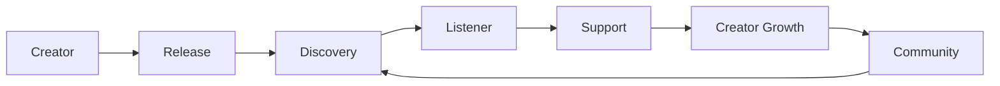

---

## 8.2 Discovery の基本原則

Discovery Layer は次の原則に従う。

### User Autonomy

利用者自身が何を聴くかを決める。

### Fair Opportunity

人気の平等ではなく、発見される機会の公平性を重視する。

### Transparency

なぜ推薦されたのかを可能な範囲で説明する。

### Diversity

人気、ジャンル、地域、活動段階などが異なる作品に接触できる余地を設ける。

### Creator Independence

広告費や資本力だけで推薦枠を独占できる構造にしない。

### Resistance to Manipulation

Bot、偽アカウント、組織的な再生操作などによる推薦操作を抑制する。

### Constitutional Alignment

Discovery のルールも3つの憲章に従う。

---

## 8.3 利用者の満足と発見機会

Creator First だからといって、利用者が望まない新人作品を強制的に大量表示することは適切ではない。

利用者価値と発見機会の両方を成立させる必要がある。

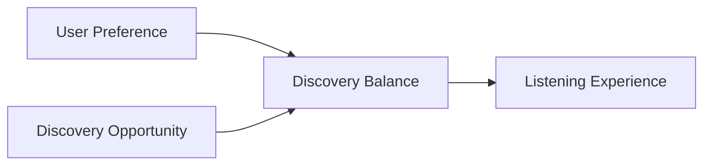

このため、推薦システムを単一のランキングとして設計せず、複数の目的を分離する。

---

## 8.4 複数の Discovery Mode

利用者は、その時の目的に応じて発見方法を選択できる。

例えば、

- **For You** — 好みに基づく推薦
- **Explore** — 好みの周辺を広げる
- **New Voices** — 新人・新規登録作品
- **Rising** — 成長し始めたクリエイター
- **Community Picks** — コミュニティ推薦
- **Local / Scene** — 地域・シーンから探す
- **Random Discovery** — 意図的な偶然性

などである。

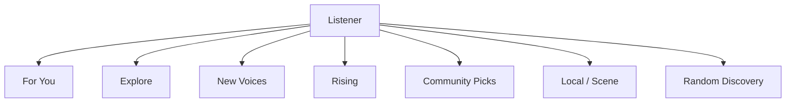

利用者が「いつも通り聴きたい」と「新しい音楽を探したい」を明示的に切り替えられることを重視する。

---

## 8.5 推薦を一つのスコアに閉じ込めない

単一の総合スコアですべての作品を順位付けすると、そのスコアを最適化する行動が生まれる。

そこで Discovery Layer は、

- Preference
- Novelty
- Diversity
- Community
- Context
- Freshness

などの異なるシグナルを保持し、利用目的に応じて組み合わせる。

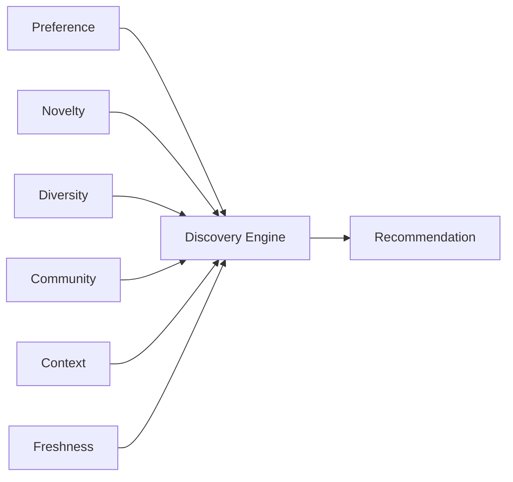

推薦式を永久に固定するのではなく、その設計原則と主要パラメータを監査可能にする。

---

## 8.6 人気と発見機会の分離

人気作品は利用者にとって価値があり、人気であること自体を否定しない。

しかし「人気だから表示される」枠と「まだ知られていない作品を発見する」枠を分ける。

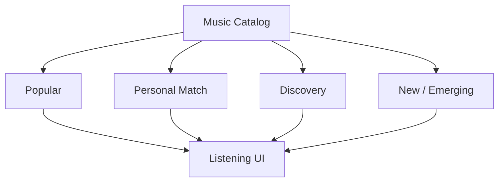

これにより、新人を優遇するために人気作品を不自然に排除する必要がなくなる。

---

## 8.7 Cold Start

新人クリエイターには過去の再生履歴がない。

通常の協調フィルタリングでは、データが少ない作品ほど推薦されにくいという Cold Start 問題が生じる。

Creator First Platform では、初期段階から、

- ジャンル
- 音響特徴
- クリエイター自身の説明
- 関連アーティスト
- 地域・シーン
- コミュニティタグ
- 編集的キュレーション

などを利用できる。

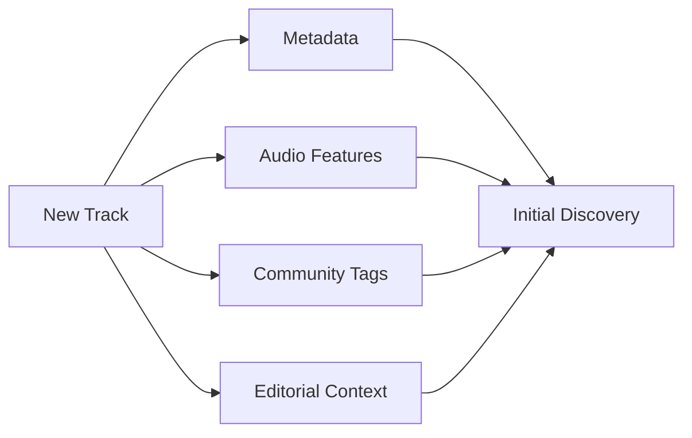

再生数がゼロだから推薦確率もゼロ、という構造を避ける。

---

## 8.8 Discovery Budget

推薦画面のすべてを新人作品にするのではなく、一定の範囲を探索に利用する考え方を導入できる。

概念的に推薦機会を、

$$
R = R_{\mathrm{preference}} + R_{\mathrm{discovery}}
$$

と分ける。

Discovery 比率を $\delta$ とすると、

$$
0 \leq \delta \leq 1
$$

として、

$$
R_{\mathrm{discovery}} = \delta R
$$

$$
R_{\mathrm{preference}} = (1-\delta)R
$$

と表現できる。

::: info 概念モデル
$\delta$ は固定仕様ではない。利用者の選択、Discovery Mode、実証データ、ガバナンス等によって調整する。
:::

---

## 8.9 Serendipity

推薦精度を高め続けると、利用者が既に好む音楽だけが表示される可能性がある。

音楽には、

> **予想していなかった作品に偶然出会う**

価値がある。

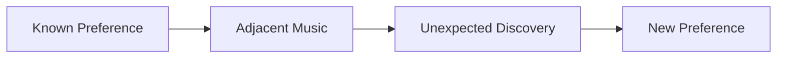

Discovery Layer は精度だけではなく、Serendipity を品質指標として扱う。

---

## 8.10 利用者による発見

アルゴリズムだけでなく、人が人へ音楽を紹介する経路を重視する。

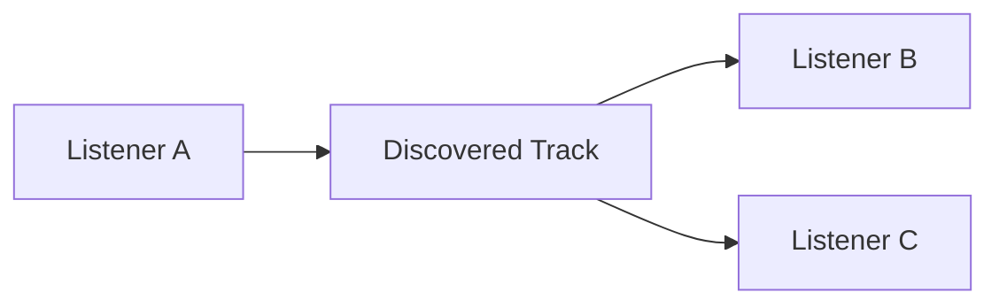

例えば、

- プレイリスト
- おすすめコメント
- Follow
- Share
- Community Picks
- Curator Profile

などを提供できる。

---

## 8.11 「推し活」と Creator First

Creator First Platform と特に相性が良い利用者体験の一つが、

> **自分がまだ知られていないクリエイターを発見し、その成長に参加する**

という体験である。

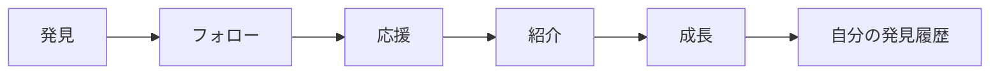

重要なのは、利用者に「人気を買わせる」ことではなく、発見と応援の履歴をコミュニティ体験として残すことである。

---

## 8.12 Early Supporter

クリエイターがまだ小規模だった時期から支援していた利用者を、Early Supporter として記録することができる。

例えば、

- 初期フォロー
- 初期プレイリスト追加
- 初期Community Recommendation
- 初期Support
- 初期イベント参加

などである。

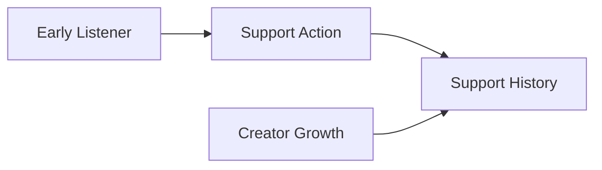

これは原則として「投資証明」ではなく、コミュニティ上の履歴である。

### Early Supporter SBTとサービス特権

Early Supporterの履歴は、本人の同意に基づいて譲渡不能なSBTとして発行できる。SBTは投資商品、将来収益への請求権、Creator Revenueの分配権またはProtocol Governanceの議決権ではなく、正規Issuerが特定の基準と時点に基づいて発行したCommunity Credentialとする。

JPYC等による初期SubscriptionまたはSupportをQualification Policyの入力にする場合、金額そのものではなく、承認済みPayment IntentがFinality条件を満たしたという版管理済みEvidenceを参照する。未確定、誤Asset、誤Chainまたは重複PaymentからSBTを発行しない。テスト系では`MockJPYC`以外の資産を受け付けず、実在JPYC、実在資金またはMainnet Walletを使用しない。

SBTに対応する特権は、通常のSubscriptionへ追加される限定的な利用権としてPolicyで定義する。例えば、CreatorとRights Holderが許諾した先行試聴、限定音源、イベント、Beta機能またはCommunity表示を対象にできる。

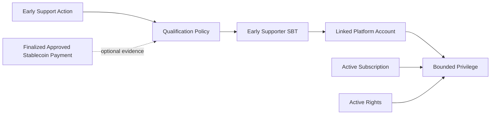

SBT保有だけで全楽曲、全地域、全期間または全品質の再生を許可しない。再生時にはPlatform Account、Wallet Link、Subscription、Rights State、対象Creator、特権Policy、失効状態およびRead Modelの鮮度をGatewayが評価する。

発行Contract、Chain、Issuer、Qualification Policy、Creator Scope、発行時点、StatusおよびLifecycleを版管理する。Wallet紛失や変更、不正発行、資格取消し、利用者からの削除要求に備え、Burn、Revocationおよび監査可能な再発行手順を用意する。個人情報、支援金額および詳細な視聴履歴はPublic Blockchainへ記録しない。

一般利用者へSBT発行用Gas Tokenを要求しない。明示的な受領同意とWallet署名を得た後、限定権限を持つRelayerまたはPaymasterがTestnet Transactionを送信できる。ただしGas Sponsorshipは資格、支払完了または特権を証明せず、発行の冪等性、Issuer権限および確定済みChain Eventを別に検証する。

SBTの発行基準と利用特権はSTOの購入額、Security Token保有量、将来のCreator人気または収益に連動させない。STO投資家向けの付帯利益として設計する場合は、このCommunity Credentialとは別の制度として法務、会計、税務および開示の確認を必要とする。

---

## 8.13 金銭的リターンを中心にしない

Early Supporter がクリエイターの将来人気に応じて金銭的利益を得る仕組みにすると、

> 「好きだから応援する」

から、

> 「値上がりしそうだから買う」

へインセンティブが変化する。

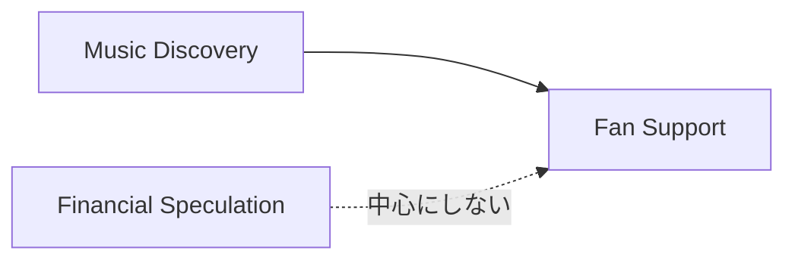

Creator First Platform は、ファン活動と金融投機を分離する。

---

## 8.14 Support Reputation

Early Support を金銭ではなく Reputation として可視化できる。

例えば、

- Early Supporter
- Discovery Contributor
- Community Curator
- Scene Explorer

などである。

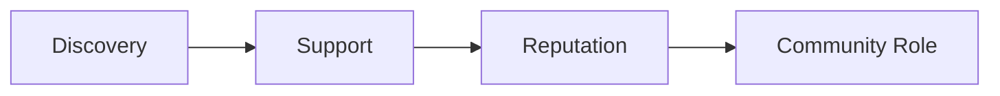

Reputation は譲渡可能な金融資産ではなく、原則として活動履歴に基づく。

---

## 8.15 Curator

利用者の中には、自分で音楽を制作しなくても、新しい音楽を見つけることに優れた人がいる。

その役割を Curator として認識する。

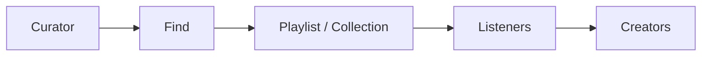

Curator は新しい音楽文化を形成する重要な参加者となり得る。

---

## 8.16 Curator Reputation

Curator の評価を単純なフォロワー数だけで決めない。

例えば、

- 新しい作品の発見
- 推薦後の継続視聴
- 推薦の多様性
- コミュニティ評価
- 不正の少なさ

などを考慮できる。

ただし、評価指標そのものをゲーム化して不自然な推薦行動を生まないよう注意する。

---

## 8.17 Community Playlist

プレイリストを個人だけでなくコミュニティで編集できるようにすることも考えられる。

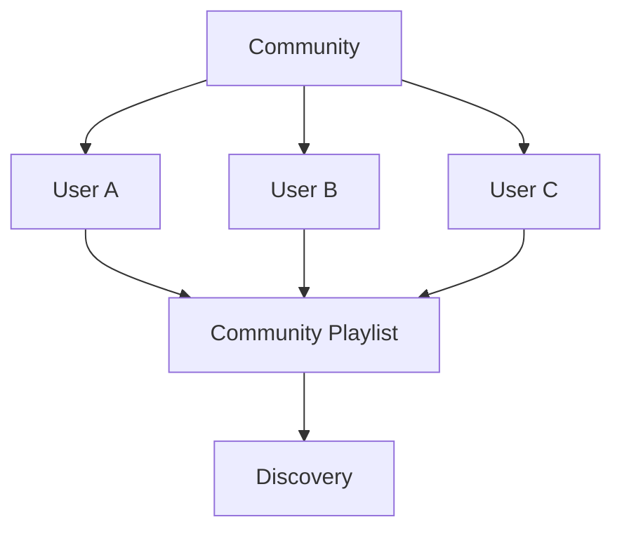

テーマ例として、

- 福岡インディーズ
- 新人ジャズ
- Experimental
- 今週発見した曲
- まだ1000再生未満の作品

などが考えられる。

---

## 8.18 地域とシーン

世界規模のランキングだけでは、地域的な音楽文化が埋もれる可能性がある。

Discovery Layer では、

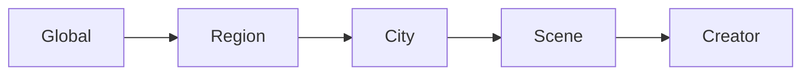

のように、地域・シーン単位で音楽を探索できるようにする。

ただし、位置情報の利用は利用者の明示的な選択とプライバシー保護を前提とする。

---

## 8.19 Community と Growth Pool

コミュニティからの支持は、第6章の Growth Pool と接続できる。

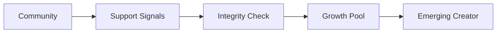

ただし、SNS的な「いいね」の数をそのまま金銭へ変換すると操作インセンティブが生じる。

したがって Community Signal と資金配分の間に、

- 不正検証
- 上限
- 多様性
- Sybil Resistance
- ガバナンス

を置く。

---

## 8.20 Community Support と Quadratic Funding

多数の独立した利用者による支持を Growth Pool に反映する場合、Quadratic Funding 的な仕組みを利用できる。

利用者 $u$ がクリエイター $i$ へ行う支援を $c_{u,i}$ とすると、概念的な支持スコアは、

$$
Q_i =
\left(
\sum_u \sqrt{c_{u,i}}
\right)^2
$$

と表現できる。

これにより、一人の大口支援より、多数の利用者からの小さな支援を強く評価できる。

詳細は第6章「経済モデル」で扱う。

---

## 8.21 推薦と経済的利益の分離

クリエイターが Growth Pool から資金を得るために推薦アルゴリズムを攻略するようになると、Discovery の品質が低下する。

そのため、

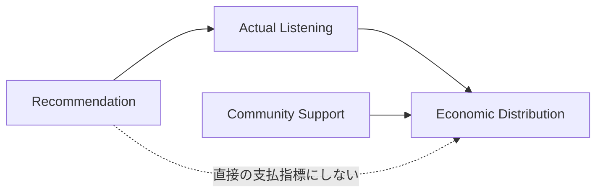

推薦順位そのものを直接の報酬指標にしない。

---

## 8.22 Pay-to-Play を避ける

資金力のあるクリエイターやレーベルが推薦枠を購入し、それが通常推薦と区別できない状態を避ける。

有料プロモーションを将来導入する場合でも、

- 明示的に広告であることを表示
- Organic Recommendation と分離
- Discovery Score を購入できない
- ガバナンス対象となる透明なルール

を原則とする。

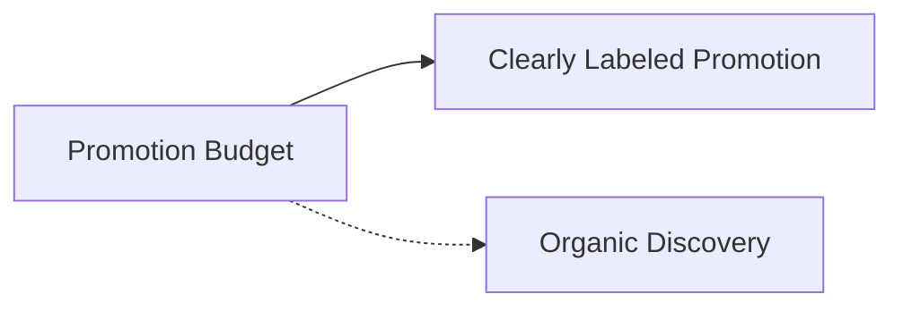

---

## 8.23 Bot と推薦操作

推薦が価値を持つと、偽再生、偽Follow、偽Supportなどで順位を操作するインセンティブが生じる。

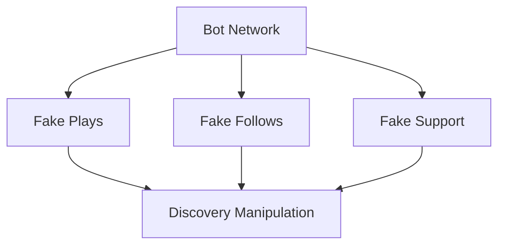

Usage Oracle、不正検出、Sybil Resistance、Rate Limitなどを組み合わせて対応する。

---

## 8.24 Echo Chamber を避ける

コミュニティ機能が強くなると、同じ趣味・価値観の利用者だけが集まり、新しい音楽との接触が減る可能性がある。

そこで、

- Adjacent Discovery
- Cross-Genre Discovery
- Random Discovery
- Guest Curator
- Regional Exchange

などを設ける。

```mermaid
flowchart LR
    SCENEA[Scene A]
    BRIDGE[Discovery Bridge]
    SCENEB[Scene B]

    SCENEA --> BRIDGE --> SCENEB
    SCENEB --> BRIDGE --> SCENEA
```

---

## 8.25 フィルターバブルへの利用者コントロール

利用者が推薦システムの状態を理解し、必要に応じて調整できるようにする。

例えば、

- 「もっと似た曲」
- 「もっと未知の曲」
- 「新人を増やす」
- 「このジャンルを減らす」
- 「地域を広げる」
- 「推薦履歴をリセット」

などである。

```mermaid
flowchart LR
    USER[User]
    CONTROL[Discovery Controls]
    ENGINE[Recommendation Engine]
    RESULT[Results]

    USER --> CONTROL --> ENGINE --> RESULT
```

---

## 8.26 なぜ推薦されたか

完全なアルゴリズム内部情報を毎回表示する必要はないが、主要な理由は説明できるようにする。

例：

> 「あなたがフォローしている3人のCuratorが推薦しています」

> 「最近聴いたアーティストと同じ福岡のシーンで活動しています」

> 「New Voicesモードで選ばれた新規登録作品です」

> 「普段聴かないジャンルからのDiscovery枠です」

これにより、推薦が広告なのか、人気順なのか、探索なのかを利用者が理解できる。

---

## 8.27 利用者の拒否権

利用者は推薦を受け入れる義務を負わない。

- Not Interested
- Hide Artist
- Hide Track
- Reduce Genre
- Disable Community Recommendation

などを提供する。

Creator First は、クリエイターに「聴かれる権利」を与えるものではない。

> **発見される機会を改善することと、利用者の選択を尊重することを両立する。**

---

## 8.28 クリエイター側の透明性

クリエイターには、

- どのDiscovery経路から聴かれたか
- New Voicesからの流入
- Curatorからの流入
- Community Playlistからの流入
- Organic Searchからの流入

などを可能な範囲で提供する。

```mermaid
flowchart LR
    DISC[Discovery Sources]
    DISC --> DASH[Creator Dashboard]

    DASH --> ANALYZE[Understand Audience]
    ANALYZE --> CREATE[Creative Activity]
```

ただし、個々の利用者のプライバシーを侵害する情報は提供しない。

---

## 8.29 コミュニティとガバナンス

コミュニティ活動と User House のガバナンスは関連するが、同一ではない。

```mermaid
flowchart LR
    COMMUNITY[Community Activity]
    REP[Reputation]
    GOV[User House]

    COMMUNITY --> REP
    REP -.->|自動的な政治権力にはしない| GOV
```

人気Curatorがそのまま大きな政治権力を持つ構造を避ける。

ガバナンス参加資格や投票方式は第7章で定義する。

---

## 8.30 クリエイターとファンの関係

クリエイターが利用者へ直接情報を届けられる機能を設けることができる。

例えば、

- Release Update
- Creator Note
- 制作背景
- Event
- Community Post

などである。

```mermaid
flowchart LR
    CREATOR[Creator]
    POST[Creator Update]
    FOLLOWER[Followers]

    CREATOR --> POST --> FOLLOWER
```

ただし、プラットフォームを大量広告・スパム配信の場にしないため、通知頻度等を利用者が制御できるようにする。

---

## 8.31 ファンコミュニティ

クリエイター単位またはジャンル単位のコミュニティを構築できる。

```mermaid
flowchart TD
    CREATOR[Creator]
    COMMUNITY[Community]

    CREATOR --> COMMUNITY
    U1[Fan A] --> COMMUNITY
    U2[Fan B] --> COMMUNITY
    U3[Fan C] --> COMMUNITY

    COMMUNITY --> DISC[Discovery]
    COMMUNITY --> SUPPORT[Support]
```

コミュニティはクリエイターの所有物ではなく、参加者が交流する場として設計する。

---

## 8.32 モデレーション

コミュニティには、

- ハラスメント
- スパム
- なりすまし
- 詐欺
- 権利侵害
- Bot
- 組織的操作

などへの対応が必要である。

```mermaid
flowchart TD
    CONTENT[Community Content]
    REPORT[Report]
    REVIEW[Moderation Review]
    ACTION[Action]
    APPEAL[Appeal]

    CONTENT --> REPORT --> REVIEW --> ACTION
    ACTION --> APPEAL
```

自動モデレーションだけで最終判断を完結させず、重大な措置には人によるレビューと異議申立てを用意する。

---

## 8.33 コミュニティの安全と表現

コミュニティを安全にするために過度な内容統制を行えば、音楽文化に必要な表現の自由を損なう可能性がある。

そのため、

- 違法性
- 権利侵害
- ハラスメント
- スパム・操作
- 単なる意見や芸術表現

を区別する。

モデレーションポリシーは公開し、重要な変更はガバナンスとの関係を明確にする。

---

## 8.34 AIによるDiscovery

AIは、

- 音響特徴分析
- プレイリスト生成
- 自然言語による音楽探索
- 類似作品探索
- 新しいジャンルとの接続

などに利用できる。

例えば利用者が、

> 「夜に歩きながら聴ける、まだあまり知られていない福岡のアーティスト」

のように自然言語で探索できる。

```mermaid
flowchart LR
    USER[User Intent]
    AI[AI Discovery]
    CATALOG[Music Catalog]
    RESULT[Explainable Suggestions]

    USER --> AI
    CATALOG --> AI
    AI --> RESULT
```

AIの目的は、人気ランキングをより効率的に再生産することではなく、カタログとの新しい接点を作ることである。

---

## 8.35 AIと透明性

AI推薦がブラックボックス化しないよう、

- 利用した主なシグナル
- SponsoredかOrganicか
- Discovery Mode
- Personalizationの有無

などを説明可能にする。

AIモデルそのものの全パラメータ公開ではなく、

> **推薦ルールを社会的に監査できる透明性**

を目指す。

---

## 8.36 Discovery Algorithm のガバナンス

推薦アルゴリズムの細かなモデル更新すべてを投票対象にすることは現実的ではない。

そこで、

### ガバナンス対象

- Discovery Budget の原則
- Pay-to-Play禁止原則
- 新人発見枠
- 透明性要件
- 利用者コントロール
- 経済分配との接続ルール

### 運用・開発対象

- モデルの学習方法
- 検索性能改善
- 推論速度
- 小規模なランキング調整
- UI改善

のように分離する。

```mermaid
flowchart TD
    GOV[Governance]
    DEV[Development Team]

    GOV --> PRINCIPLE[Discovery Principles]
    DEV --> IMPLEMENT[Algorithm Implementation]

    PRINCIPLE --> ENGINE[Discovery Engine]
    IMPLEMENT --> ENGINE
```

---

## 8.37 Discovery変更の影響評価

大きな推薦変更では、導入前後に、

- 新人の露出
- 人気集中度
- 利用者満足度
- Skip率
- 新規Follow
- ジャンル多様性
- 継続利用
- 不正操作

などを評価する。

単に「再生時間が増えた」ことだけを成功指標にしない。

---

## 8.38 Discovery の成功指標

Creator First Platform では、Discovery の品質を複数の軸で測る。

```mermaid
flowchart TD
    QUALITY[Discovery Quality]

    QUALITY --> SAT[User Satisfaction]
    QUALITY --> NEW[New Creator Discovery]
    QUALITY --> DIV[Diversity]
    QUALITY --> RET[Retention]
    QUALITY --> SUPPORT[Meaningful Support]
    QUALITY --> FAIR[Opportunity]
```

例えば、

- 利用者が新しくフォローしたクリエイター数
- 新人作品から継続視聴へ進んだ割合
- Discovery経由のSupport
- 発見されたジャンルの多様性
- 新規クリエイターの継続活動率

などを利用できる。

---

## 8.39 初期段階

MVPでは巨大なAI推薦システムを最初から構築しない。

```mermaid
flowchart LR
    P1[Editorial]
    P2[Metadata]
    P3[Community]
    P4[Simple Personalization]

    P1 --> DISC[Initial Discovery]
    P2 --> DISC
    P3 --> DISC
    P4 --> DISC
```

初期段階では、

- 新着
- ジャンル
- 編集プレイリスト
- Community Playlist
- Follow
- 簡単な類似推薦

から開始できる。

---

## 8.40 成長段階

利用データとコミュニティが成長した後に、

```mermaid
flowchart LR
    P1[Phase 1<br/>Editorial + Metadata]
    P2[Phase 2<br/>Community Discovery]
    P3[Phase 3<br/>Personalized AI]
    P4[Phase 4<br/>Governed Discovery Ecosystem]

    P1 --> P2 --> P3 --> P4
```

と段階的に高度化する。

アルゴリズムを先に作り、そのアルゴリズムにコミュニティを合わせるのではなく、実際の利用者・クリエイターの行動から設計を進化させる。

---

## 8.41 3つの憲章との関係

Discovery と Community は3つの憲章が最も直接的に衝突し得る領域の一つである。

```mermaid
flowchart TD
    CONST[3つの憲章]

    CONST --> CREATOR[Creator Opportunity]
    CONST --> USER[User Autonomy]
    CONST --> FAIR[Fair Ecosystem]

    CREATOR --> DISC[Discovery & Community]
    USER --> DISC
    FAIR --> DISC
```

新人の発見機会を増やすために利用者の選択を奪わない。

利用者のクリック率を最大化するために、新人が永遠に発見されない構造を作らない。

コミュニティの人気をそのまま経済的・政治的権力へ変換しない。

この三者のバランスを制度として維持する。

---

## 8.42 全体構造

```mermaid
flowchart TD
    CREATOR[Creators]
    TRACK[Music]
    CATALOG[Catalog]

    CREATOR --> TRACK --> CATALOG

    CATALOG --> DISC[Discovery Engine]

    PREF[User Preference] --> DISC
    COMMUNITY[Community Signals] --> DISC
    NOVEL[Novelty / Diversity] --> DISC
    CURATOR[Curators] --> DISC

    DISC --> USER[Listeners]

    USER --> LISTEN[Listening]
    USER --> FOLLOW[Follow]
    USER --> SUPPORT[Support]
    USER --> SHARE[Share / Playlist]

    LISTEN --> ORACLE[Usage Oracle]
    SUPPORT --> GROWTH[Growth Pool]
    SHARE --> COMMUNITY
    FOLLOW --> COMMUNITY

    GROWTH --> CREATOR
    ORACLE --> ECON[Creator Economy]
    ECON --> CREATOR

    GOV[Creator House + User House] --> RULES[Discovery Principles]
    RULES --> DISC
```

---

## 8.43 本章のまとめ

Creator First Platform の Discovery は、

> **「あなたが好きそうな曲」を当てるだけの推薦システムではない。**

利用者が自分の好みを楽しみながら、未知の作品に出会い、クリエイターを発見し、その成長に参加できる環境を作る。

```mermaid
flowchart LR
    LISTEN[Listen]
    DISCOVER[Discover]
    SUPPORT[Support]
    SHARE[Share]
    GROW[Grow]
    CULTURE[New Culture]

    LISTEN --> DISCOVER --> SUPPORT --> SHARE --> GROW --> CULTURE
    CULTURE --> DISCOVER
```

特に Creator First Platform が目指すのは、

> **「有名だから聴く」だけではなく、「自分が見つけたクリエイターが成長していくこと自体が楽しい」という音楽体験**

である。

そのためには、アルゴリズムだけでは不十分である。

クリエイター、ファン、Curator、コミュニティ、経済モデル、ガバナンスを接続しながら、

- 発見機会
- 利用者の自由
- 多様性
- 透明性
- 不正耐性
- コミュニティ参加

を同時に成立させる必要がある。

Creator First Platform において、Discovery は単なる機能ではない。

> **新しい音楽文化が生まれるための公共的なインターフェースである。**
