# 8. 発見とコミュニティ

## 8.1 本章の目的

Creator First Platform における「発見」は、単なる推薦アルゴリズムの問題ではない。

既存の音楽ストリーミングサービスでは、ユーザが好みの音楽を素早く見つけられることが重要である一方、過去の再生実績や人気が推薦に強く反映されると、

> **人気があるから推薦され、推薦されるからさらに人気になる**

という自己強化ループが生じやすい。

Creator First Platform は、ユーザの利便性を維持しながら、

- まだ知られていない作品
- 新人音楽クリエーター
- 小規模なジャンル
- 地域的な音楽文化
- 新しい表現

に発見される機会を提供する。

さらに、ユーザが単なる「消費者」ではなく、

> **自分が見つけた音楽クリエーターの成長を見守り、応援し、他のユーザへ紹介できる参加者**

となるコミュニティを設計する。

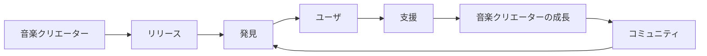

---

## 8.2 発見の基本原則

発見レイヤーは次の原則に従う。

### ユーザの自律性

ユーザ自身が何を聴くかを決める。

### 公正な機会

人気の平等ではなく、発見される機会の公平性を重視する。

### 透明性

なぜ推薦されたのかを可能な範囲で説明する。

### 多様性

人気、ジャンル、地域、活動段階などが異なる作品に接触できる余地を設ける。

### 音楽クリエーターの独立性

広告費や資本力だけで推薦枠を独占できる構造にしない。

### 耐性 to 操作

ボット、偽アカウント、組織的な再生操作などによる推薦操作を抑制する。

### 憲章適合適合性

発見のルールも3つの憲章に従う。

---

## 8.3 ユーザの満足と発見機会

音楽クリエーター中心だからといって、ユーザが望まない新人作品を強制的に大量表示することは適切ではない。

ユーザ価値と発見機会の両方を成立させる必要がある。

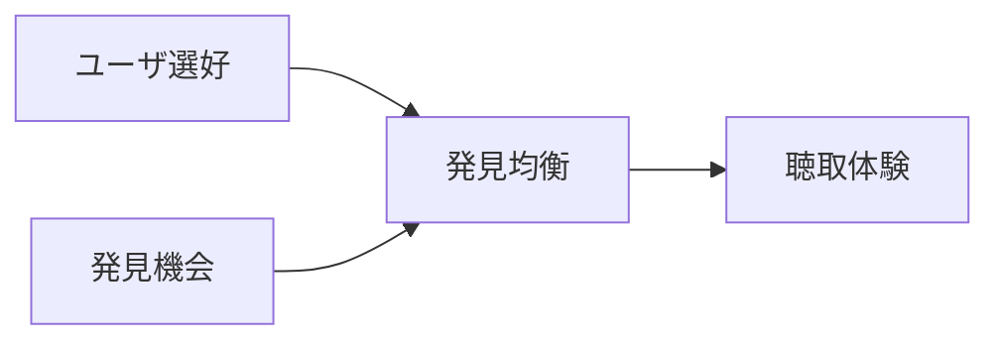

このため、推薦システムを単一のランキングとして設計せず、複数の目的を分離する。

---

## 8.4 複数の発見モード

ユーザは、その時の目的に応じて発見方法を選択できる。

例えば、

- **あなた向け** — 好みに基づく推薦
- **探索** — 好みの周辺を広げる
- **新規参加者** — 新人・新規登録作品
- **注目上昇中** — 成長し始めた音楽クリエーター
- **コミュニティ推薦選出** — コミュニティ推薦
- **ローカル / シーン** — 地域・シーンから探す
- **無作為発見** — 意図的な偶然性

などである。

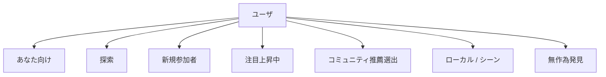

ユーザが「いつも通り聴きたい」と「新しい音楽を探したい」を明示的に切り替えられることを重視する。

---

## 8.5 推薦を一つのスコアに閉じ込めない

単一の総合スコアですべての作品を順位付けすると、そのスコアを最適化する行動が生まれる。

そこで発見レイヤーは、

- 選好
- 新規性
- 多様性
- コミュニティ
- 背景
- 鮮度

などの異なるシグナルを保持し、利用目的に応じて組み合わせる。

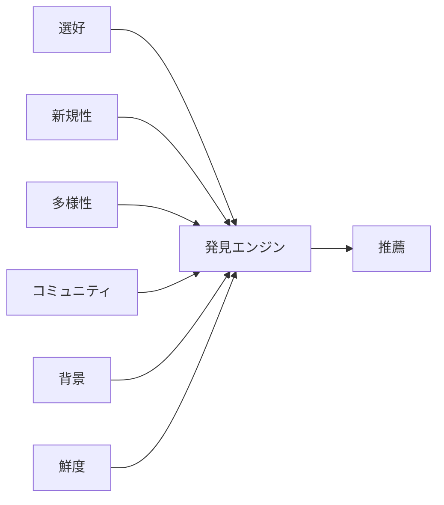

推薦式を永久に固定するのではなく、その設計原則と主要パラメータを監査可能にする。

---

## 8.6 人気と発見機会の分離

人気作品はユーザにとって価値があり、人気であること自体を否定しない。

しかし「人気だから表示される」枠と「まだ知られていない作品を発見する」枠を分ける。

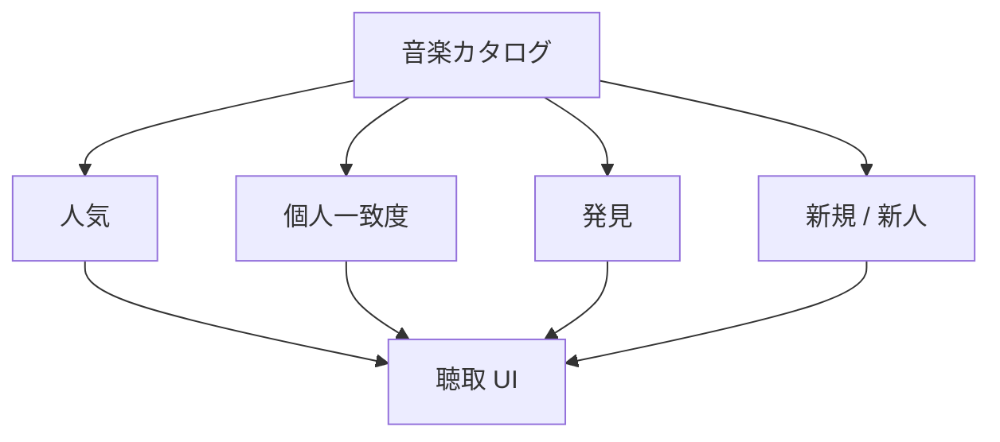

これにより、新人を優遇するために人気作品を不自然に排除する必要がなくなる。

---

## 8.7 コールド開始

新人音楽クリエーターには過去の再生履歴がない。

通常の協調フィルタリングでは、データが少ない作品ほど推薦されにくいというコールド開始問題が生じる。

Creator First Platform では、初期段階から、

- ジャンル
- 音響特徴
- 音楽クリエーター自身の説明
- 関連アーティスト
- 地域・シーン
- コミュニティタグ
- 編集的キュレーション

などを利用できる。

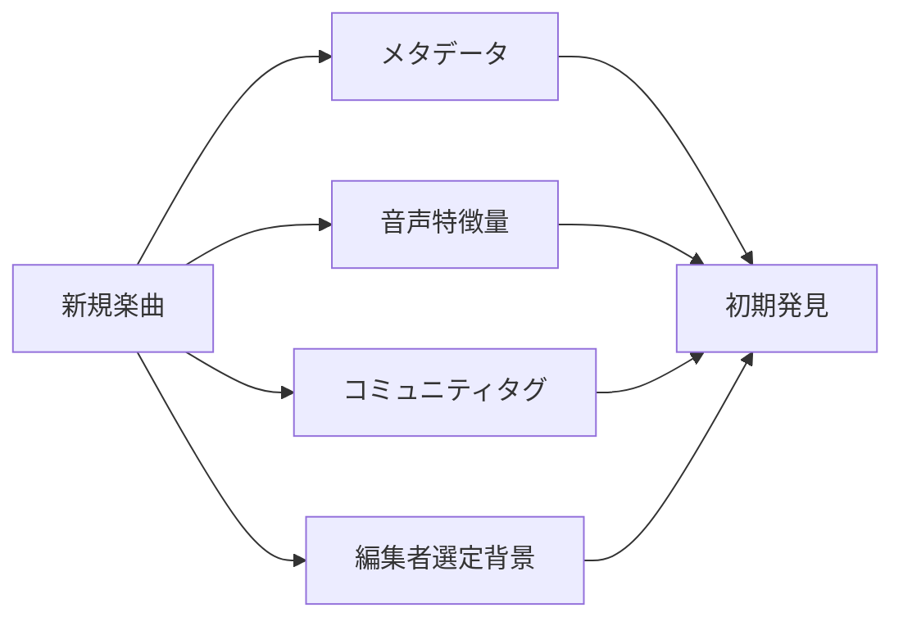

再生数がゼロだから推薦確率もゼロ、という構造を避ける。

---

## 8.8 発見予算

推薦画面のすべてを新人作品にするのではなく、一定の範囲を探索に利用する考え方を導入できる。

概念的に推薦機会を、

$$
R = R_{\mathrm{preference}} + R_{\mathrm{discovery}}
$$

と分ける。

発見比率を $\delta$ とすると、

$$
0 \leq \delta \leq 1
$$

として、

$$
R_{\mathrm{discovery}} = \delta R
$$

$$
R_{\mathrm{preference}} = (1-\delta)R
$$

と表現できる。

::: info 概念モデル
$\delta$ は固定仕様ではない。ユーザの選択、発見モード、実証データ、ガバナンス等によって調整する。
:::

---

## 8.9 偶然の発見

推薦精度を高め続けると、ユーザが既に好む音楽だけが表示される可能性がある。

音楽には、

> **予想していなかった作品に偶然出会う**

価値がある。

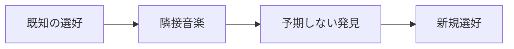

発見レイヤーは精度だけではなく、偶然の発見を品質指標として扱う。

---

## 8.10 ユーザによる発見

アルゴリズムだけでなく、人が人へ音楽を紹介する経路を重視する。

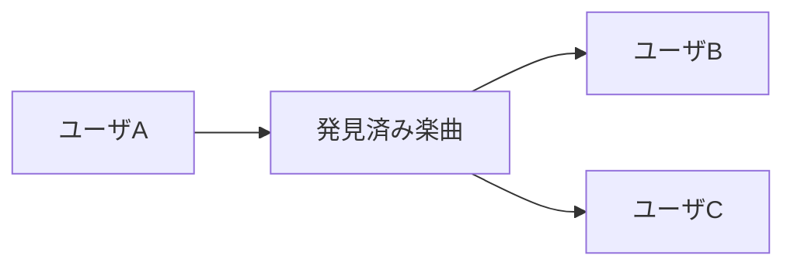

例えば、

- プレイリスト
- おすすめコメント
- フォロー
- 比率
- コミュニティ推薦選出
- キュレータープロフィール

などを提供できる。

---

## 8.11 「推し活」と音楽クリエーター中心

Creator First Platform と特に相性が良いユーザ体験の一つが、

> **自分がまだ知られていない音楽クリエーターを発見し、その成長に参加する**

という体験である。

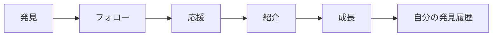

重要なのは、ユーザに「人気を買わせる」ことではなく、発見と応援の履歴をコミュニティ体験として残すことである。

---

## 8.12 初期サポーター

音楽クリエーターがまだ小規模だった時期から支援していたユーザを、初期サポーターとして記録することができる。

例えば、

- 初期フォロー
- 初期プレイリスト追加
- 初期コミュニティ推薦
- 初期支援
- 初期イベント参加

などである。

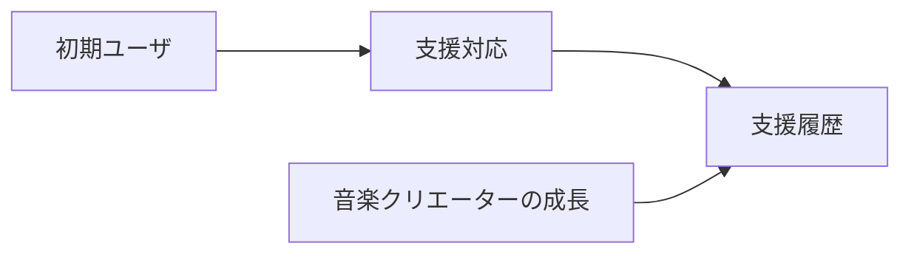

これは原則として「投資証明」ではなく、コミュニティ上の履歴である。

### サポーター / 初期サポーター SBTの表示例

ユーザが音楽プレーヤーから特定の音楽クリエーターを応援する意思を明示すると、一般のサポーターとして記録できる。本人が公開資格証明の受領に同意した場合は、譲渡不能なサポーター SBTを発行し、ファンコミュニティへの参加資格やサポーター表示へ利用できる。

その支援対応が、版管理された初期資格判定ポリシーの対象期間、音楽クリエーター対象範囲および条件を満たす場合は、初期サポーターという追加の履歴をSBTで表現できる。一般サポーターは継続的な応援を、初期サポーターは音楽クリエーターの初期段階から応援した履歴を示し、両者を同じ資格として扱わない。

以下は架空の`CREATOR A`に対するコミュニティ資格証明の表示例である。実際のトークンメタデータ、音楽クリエーター名、発行時点、コントラクト、チェーン、発行者、ポリシー版および状態は、確定した実装とユーザの同意に従って表示する。

#### 一般サポーター SBT


*複数の葉へ育った植物と青緑の音声波形は、音楽クリエーターへの継続的な支援とコミュニティへの参加を表す。*

#### 初期サポーター SBT


*芽吹きと最初の光は、音楽クリエーターがまだ初期段階だった時期の発見と支援を表す。*

これらの画像は資格証明の視覚表現例であり、画像の所持、複製、URLまたはクライアント表示だけでは資格を証明しない。ゲートウェイとコミュニティサービスは、正規コントラクトの確定済みイベント、ウォレット連携、資格証明状態、ポリシー版および参照モデルの鮮度を検証する。

### 初期サポーター SBTとサービス特権

初期サポーターの履歴は、本人の同意に基づいて譲渡不能なSBTとして発行できる。SBTは投資商品、将来収益への請求権、音楽クリエーター収益の分配権またはプロトコルガバナンスの議決権ではなく、正規発行者が特定の基準と時点に基づいて発行したコミュニティ資格証明とする。

JPYC等による初期サブスクリプションまたは支援を資格判定ポリシーの入力にする場合、金額そのものではなく、承認済み決済意思がファイナリティ条件を満たしたという版管理済み証跡を参照する。未確定、誤資産、誤チェーンまたは重複決済からSBTを発行しない。テスト系では`MockJPYC`以外の資産を受け付けず、実在JPYC、実在資金またはMainnet ウォレットを使用しない。

SBTに対応する特権は、通常のサブスクリプションへ追加される限定的な利用権としてポリシーで定義する。例えば、音楽クリエーターと権利者が許諾した先行試聴、限定音源、イベント、Beta機能またはコミュニティ表示を対象にできる。

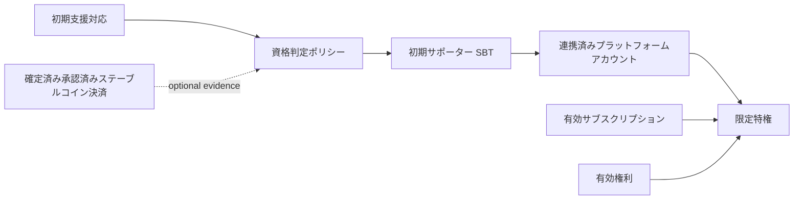

SBT保有だけで全楽曲、全地域、全期間または全品質の再生を許可しない。再生時にはプラットフォームアカウント、ウォレット連携、サブスクリプション、権利状態、対象音楽クリエーター、特権ポリシー、失効状態および参照モデルの鮮度をゲートウェイが評価する。

発行コントラクト、チェーン、発行者、資格判定ポリシー、音楽クリエーター対象範囲、発行時点、状態およびライフサイクルを版管理する。ウォレット紛失や変更、不正発行、資格取消し、ユーザからの削除要求に備え、Burn、失効および監査可能な再発行手順を用意する。個人情報、支援金額および詳細な視聴履歴は公開ブロックチェーンへ記録しない。

一般ユーザへSBT発行用ガストークンを要求しない。明示的な受領同意とウォレット署名を得た後、限定権限を持つリレイヤーまたはペイマスターがテストネットトランザクションを送信できる。ただしガス代支援は資格、支払完了または特権を証明せず、発行の冪等性、発行者権限および確定済みチェーンイベントを別に検証する。

SBTの発行基準と利用特権はSTOの購入額、セキュリティトークン保有量、将来の音楽クリエーター人気または収益に連動させない。STO投資家向けの付帯利益として設計する場合は、このコミュニティ資格証明とは別の制度として法務、会計、税務および開示の確認を必要とする。

---

## 8.13 金銭的リターンを中心にしない

初期サポーターが音楽クリエーターの将来人気に応じて金銭的利益を得る仕組みにすると、

> 「好きだから応援する」

から、

> 「値上がりしそうだから買う」

へインセンティブが変化する。

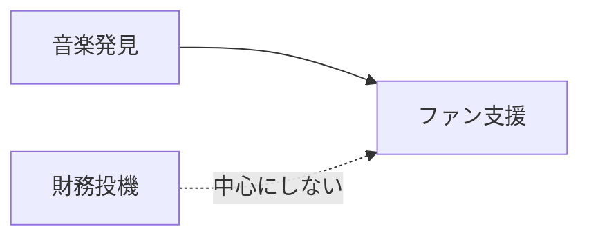

Creator First Platform は、ファン活動と金融投機を分離する。

---

## 8.14 支援評価

初期支援を金銭ではなく評価として可視化できる。

例えば、

- 初期サポーター
- 発見貢献者
- コミュニティキュレーター
- シーン Explorer

などである。

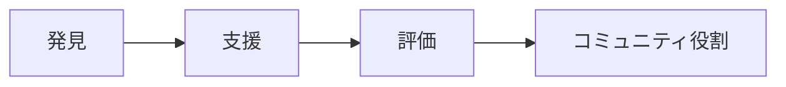

評価は譲渡可能な金融資産ではなく、原則として活動履歴に基づく。

---

## 8.15 キュレーター

ユーザの中には、自分で音楽を制作しなくても、新しい音楽を見つけることに優れた人がいる。

その役割をキュレーターとして認識する。

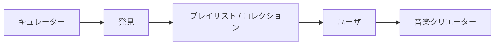

キュレーターは新しい音楽文化を形成する重要な参加者となり得る。

---

## 8.16 キュレーター評価

キュレーターの評価を単純なフォロワー数だけで決めない。

例えば、

- 新しい作品の発見
- 推薦後の継続視聴
- 推薦の多様性
- コミュニティ評価
- 不正の少なさ

などを考慮できる。

ただし、評価指標そのものをゲーム化して不自然な推薦行動を生まないよう注意する。

---

## 8.17 コミュニティプレイリスト

プレイリストを個人だけでなくコミュニティで編集できるようにすることも考えられる。

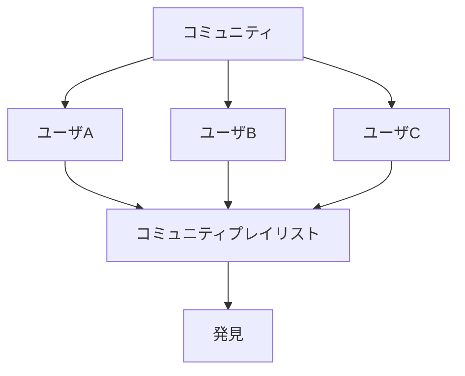

テーマ例として、

- 福岡インディーズ
- 新人ジャズ
- Experimental
- 今週発見した曲
- まだ1000再生未満の作品

などが考えられる。

---

## 8.18 地域とシーン

世界規模のランキングだけでは、地域的な音楽文化が埋もれる可能性がある。

発見レイヤーでは、

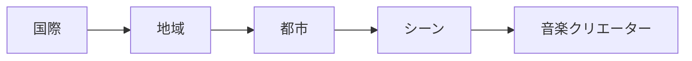

のように、地域・シーン単位で音楽を探索できるようにする。

ただし、位置情報の利用はユーザの明示的な選択とプライバシー保護を前提とする。

---

## 8.19 コミュニティと成長支援プール

コミュニティからの支持は、第6章の成長支援プールと接続できる。

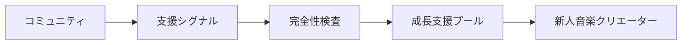

ただし、SNS的な「いいね」の数をそのまま金銭へ変換すると操作インセンティブが生じる。

したがってコミュニティ Signal と資金配分の間に、

- 不正検証
- 上限
- 多様性
- シビル耐性
- ガバナンス

を置く。

---

## 8.20 コミュニティ支援と二次資金配分

多数の独立したユーザによる支持を成長支援プールに反映する場合、二次資金配分的な仕組みを利用できる。

ユーザ $u$ が音楽クリエーター $i$ へ行う支援を $c_{u,i}$ とすると、概念的な支持スコアは、

$$
Q_i =
\left(
\sum_u \sqrt{c_{u,i}}
\right)^2
$$

と表現できる。

これにより、一人の大口支援より、多数のユーザからの小さな支援を強く評価できる。

詳細は第6章「経済モデル」で扱う。

---

## 8.21 推薦と経済的利益の分離

音楽クリエーターが成長支援プールから資金を得るために推薦アルゴリズムを攻略するようになると、発見の品質が低下する。

そのため、

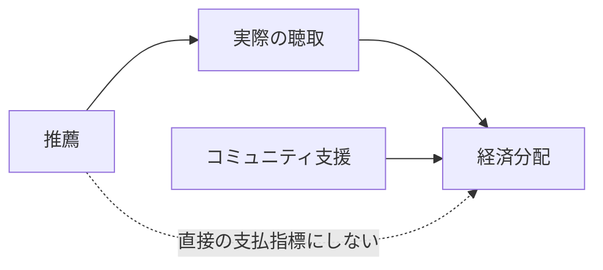

推薦順位そのものを直接の報酬指標にしない。

---

## 8.22 支払による露出獲得を避ける

資金力のある音楽クリエーターやレーベルが推薦枠を購入し、それが通常推薦と区別できない状態を避ける。

有料プロモーションを将来導入する場合でも、

- 明示的に広告であることを表示
- 自然な推薦と分離
- 発見スコアを購入できない
- ガバナンス対象となる透明なルール

を原則とする。

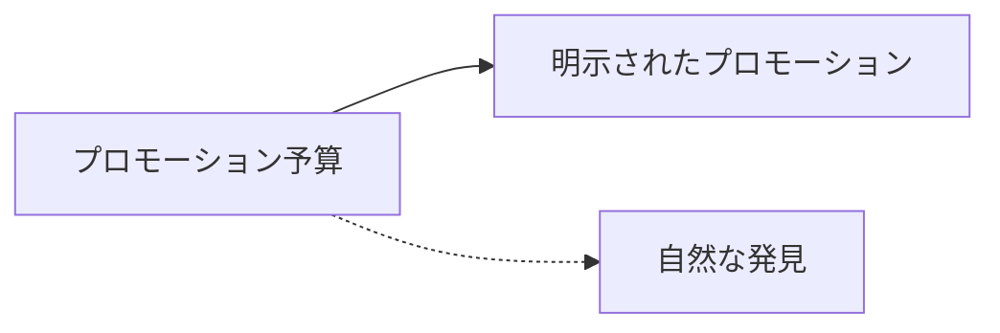

---

## 8.23 ボットと推薦操作

推薦が価値を持つと、偽再生、偽フォロー、偽支援などで順位を操作するインセンティブが生じる。

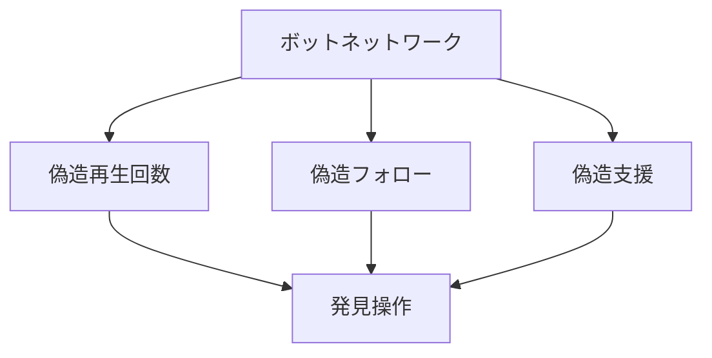

利用実績オラクル、不正検出、シビル耐性、率制限などを組み合わせて対応する。

---

## 8.24 エコーチェンバーを避ける

コミュニティ機能が強くなると、同じ趣味・価値観のユーザだけが集まり、新しい音楽との接触が減る可能性がある。

そこで、

- 隣接発見
- Cross-Genre 発見
- 無作為発見
- Guest キュレーター
- 地域 Exchange

などを設ける。

```mermaid
flowchart LR
    SCENEA[シーン A]
    BRIDGE[発見ブリッジ]
    SCENEB[シーン B]

    SCENEA --> BRIDGE --> SCENEB
    SCENEB --> BRIDGE --> SCENEA
```

---

## 8.25 フィルターバブルへのユーザコントロール

ユーザが推薦システムの状態を理解し、必要に応じて調整できるようにする。

例えば、

- 「もっと似た曲」
- 「もっと未知の曲」
- 「新人を増やす」
- 「このジャンルを減らす」
- 「地域を広げる」
- 「推薦履歴をリセット」

などである。

```mermaid
flowchart LR
    USER[ユーザ]
    CONTROL[発見制御]
    ENGINE[推薦エンジン]
    RESULT[結果]

    USER --> CONTROL --> ENGINE --> RESULT
```

---

## 8.26 なぜ推薦されたか

完全なアルゴリズム内部情報を毎回表示する必要はないが、主要な理由は説明できるようにする。

例：

> 「あなたがフォローしている3人のキュレーターが推薦しています」

> 「最近聴いたアーティストと同じ福岡のシーンで活動しています」

> 「新規参加者モードで選ばれた新規登録作品です」

> 「普段聴かないジャンルからの発見枠です」

これにより、推薦が広告なのか、人気順なのか、探索なのかをユーザが理解できる。

---

## 8.27 ユーザの拒否権

ユーザは推薦を受け入れる義務を負わない。

- Not Interested
- Hide アーティスト
- Hide 楽曲
- Reduce ジャンル
- Disable コミュニティ推薦

などを提供する。

音楽クリエーター中心は、音楽クリエーターに「聴かれる権利」を与えるものではない。

> **発見される機会を改善することと、ユーザの選択を尊重することを両立する。**

---

## 8.28 音楽クリエーター側の透明性

音楽クリエーターには、

- どの発見経路から聴かれたか
- 新規参加者からの流入
- キュレーターからの流入
- コミュニティプレイリストからの流入
- 自然な検索からの流入

などを可能な範囲で提供する。

```mermaid
flowchart LR
    DISC[発見情報源]
    DISC --> DASH[音楽クリエーターダッシュボード]

    DASH --> ANALYZE[オーディエンス理解]
    ANALYZE --> CREATE[創作活動]
```

ただし、個々のユーザのプライバシーを侵害する情報は提供しない。

---

## 8.29 コミュニティとガバナンス

コミュニティ活動とユーザ院議会のガバナンスは関連するが、同一ではない。

```mermaid
flowchart LR
    COMMUNITY[コミュニティ活動]
    REP[評価]
    GOV[ユーザ院議会]

    COMMUNITY --> REP
    REP -.->|自動的な政治権力にはしない| GOV
```

人気キュレーターがそのまま大きな政治権力を持つ構造を避ける。

ガバナンス参加資格や投票方式は第7章で定義する。

---

## 8.30 音楽クリエーターとファンの関係

音楽クリエーターがユーザへ直接情報を届けられる機能を設けることができる。

例えば、

- リリース更新
- 音楽クリエーター注記
- 制作背景
- イベント
- コミュニティ Post

などである。

```mermaid
flowchart LR
    CREATOR[音楽クリエーター]
    POST[音楽クリエーター更新]
    FOLLOWER[フォロワー]

    CREATOR --> POST --> FOLLOWER
```

ただし、プラットフォームを大量広告・スパム配信の場にしないため、通知頻度等をユーザが制御できるようにする。

---

## 8.31 ファンコミュニティ

音楽クリエーター単位またはジャンル単位のコミュニティを構築できる。

```mermaid
flowchart TD
    CREATOR[音楽クリエーター]
    COMMUNITY[コミュニティ]

    CREATOR --> COMMUNITY
    U1[ファン A] --> COMMUNITY
    U2[ファン B] --> COMMUNITY
    U3[ファン C] --> COMMUNITY

    COMMUNITY --> DISC[発見]
    COMMUNITY --> SUPPORT[支援]
```

コミュニティは音楽クリエーターの所有物ではなく、参加者が交流する場として設計する。

---

## 8.32 モデレーション

コミュニティには、

- ハラスメント
- スパム
- なりすまし
- 詐欺
- 権利侵害
- ボット
- 組織的操作

などへの対応が必要である。

```mermaid
flowchart TD
    CONTENT[コミュニティコンテンツ]
    REPORT[報告]
    REVIEW[モデレーションレビュー]
    ACTION[対応]
    APPEAL[異議申立て]

    CONTENT --> REPORT --> REVIEW --> ACTION
    ACTION --> APPEAL
```

自動モデレーションだけで最終判断を完結させず、重大な措置には人によるレビューと異議申立てを用意する。

---

## 8.33 コミュニティの安全と表現

コミュニティを安全にするために過度な内容統制を行えば、音楽文化に必要な表現の自由を損なう可能性がある。

そのため、

- 違法性
- 権利侵害
- ハラスメント
- スパム・操作
- 単なる意見や芸術表現

を区別する。

モデレーションポリシーは公開し、重要な変更はガバナンスとの関係を明確にする。

---

## 8.34 AIによる発見

AIは、

- 音響特徴分析
- プレイリスト生成
- 自然言語による音楽探索
- 類似作品探索
- 新しいジャンルとの接続

などに利用できる。

例えばユーザが、

> 「夜に歩きながら聴ける、まだあまり知られていない福岡のアーティスト」

のように自然言語で探索できる。

```mermaid
flowchart LR
    USER[ユーザ意思]
    AI[AI 発見]
    CATALOG[音楽カタログ]
    RESULT[説明可能な提案]

    USER --> AI
    CATALOG --> AI
    AI --> RESULT
```

AIの目的は、人気ランキングをより効率的に再生産することではなく、カタログとの新しい接点を作ることである。

---

## 8.35 AIと透明性

AI推薦がブラックボックス化しないよう、

- 利用した主なシグナル
- Sponsoredか自然なか
- 発見モード
- 個人最適化の有無

などを説明可能にする。

AIモデルそのものの全パラメータ公開ではなく、

> **推薦ルールを社会的に監査できる透明性**

を目指す。

---

## 8.36 発見アルゴリズムのガバナンス

推薦アルゴリズムの細かなモデル更新すべてを投票対象にすることは現実的ではない。

そこで、

### ガバナンス対象

- 発見予算の原則
- 支払による露出獲得禁止原則
- 新人発見枠
- 透明性要件
- ユーザコントロール
- 経済分配との接続ルール

### 運用・開発対象

- モデルの学習方法
- 検索性能改善
- 推論速度
- 小規模なランキング調整
- UI改善

のように分離する。

```mermaid
flowchart TD
    GOV[ガバナンス]
    DEV[開発チーム]

    GOV --> PRINCIPLE[発見原則]
    DEV --> IMPLEMENT[アルゴリズム実装]

    PRINCIPLE --> ENGINE[発見エンジン]
    IMPLEMENT --> ENGINE
```

---

## 8.37 発見変更の影響評価

大きな推薦変更では、導入前後に、

- 新人の露出
- 人気集中度
- ユーザ満足度
- Skip率
- 新規フォロー
- ジャンル多様性
- 継続利用
- 不正操作

などを評価する。

単に「再生時間が増えた」ことだけを成功指標にしない。

---

## 8.38 発見の成功指標

Creator First Platform では、発見の品質を複数の軸で測る。

```mermaid
flowchart TD
    QUALITY[発見品質]

    QUALITY --> SAT[ユーザ満足度]
    QUALITY --> NEW[新人音楽クリエーター発見]
    QUALITY --> DIV[多様性]
    QUALITY --> RET[保存期間]
    QUALITY --> SUPPORT[意味のある支援]
    QUALITY --> FAIR[機会]
```

例えば、

- ユーザが新しくフォローした音楽クリエーター数
- 新人作品から継続視聴へ進んだ割合
- 発見経由の支援
- 発見されたジャンルの多様性
- 新規音楽クリエーターの継続活動率

などを利用できる。

---

## 8.39 初期段階

MVPでは巨大なAI推薦システムを最初から構築しない。

```mermaid
flowchart LR
    P1[編集者選定]
    P2[メタデータ]
    P3[コミュニティ]
    P4[単純個人最適化]

    P1 --> DISC[初期発見]
    P2 --> DISC
    P3 --> DISC
    P4 --> DISC
```

初期段階では、

- 新着
- ジャンル
- 編集プレイリスト
- コミュニティプレイリスト
- フォロー
- 簡単な類似推薦

から開始できる。

---

## 8.40 成長段階

利用データとコミュニティが成長した後に、

```mermaid
flowchart LR
    P1[フェーズ 1<br/>編集者選定 + メタデータ]
    P2[フェーズ 2<br/>コミュニティ発見]
    P3[フェーズ 3<br/>個人最適化AI]
    P4[フェーズ 4<br/>統治された発見エコシステム]

    P1 --> P2 --> P3 --> P4
```

と段階的に高度化する。

アルゴリズムを先に作り、そのアルゴリズムにコミュニティを合わせるのではなく、実際のユーザ・音楽クリエーターの行動から設計を進化させる。

---

## 8.41 3つの憲章との関係

発見とコミュニティは3つの憲章が最も直接的に衝突し得る領域の一つである。

```mermaid
flowchart TD
    CONST[3つの憲章]

    CONST --> CREATOR[音楽クリエーターの機会]
    CONST --> USER[ユーザの自律性]
    CONST --> FAIR[公正なエコシステム]

    CREATOR --> DISC[発見 & コミュニティ]
    USER --> DISC
    FAIR --> DISC
```

新人の発見機会を増やすためにユーザの選択を奪わない。

ユーザのクリック率を最大化するために、新人が永遠に発見されない構造を作らない。

コミュニティの人気をそのまま経済的・政治的権力へ変換しない。

この三者のバランスを制度として維持する。

---

## 8.42 全体構造

```mermaid
flowchart TD
    CREATOR[音楽クリエーター]
    TRACK[音楽]
    CATALOG[カタログ]

    CREATOR --> TRACK --> CATALOG

    CATALOG --> DISC[発見エンジン]

    PREF[ユーザ選好] --> DISC
    COMMUNITY[コミュニティシグナル] --> DISC
    NOVEL[新規性 / 多様性] --> DISC
    CURATOR[キュレーター] --> DISC

    DISC --> USER[ユーザ]

    USER --> LISTEN[聴取]
    USER --> FOLLOW[フォロー]
    USER --> SUPPORT[支援]
    USER --> SHARE[比率 / プレイリスト]

    LISTEN --> ORACLE[利用実績オラクル]
    SUPPORT --> GROWTH[成長支援プール]
    SHARE --> COMMUNITY
    FOLLOW --> COMMUNITY

    GROWTH --> CREATOR
    ORACLE --> ECON[音楽クリエーター経済]
    ECON --> CREATOR

    GOV[音楽クリエータ院議会 + ユーザ院議会] --> RULES[発見原則]
    RULES --> DISC
```

---

## 8.42.1 本番コミュニティサービス

本番コミュニティは、プレーヤーの表示機能やSBT一覧だけではなく、対象音楽クリエーターまたはテーマごとの会員資格、役割、投稿、イベント、モデレーション、異議申立て、退出およびガバナンス適格性への入力を管理する独立サービスとする。

```mermaid
flowchart LR
    INTENT[支援意思・説明・同意]
    CREDENTIAL[一般／初期サポーター資格証明]
    POLICY[版管理されたコミュニティ方針]
    MEMBER[会員状態]
    CAP[投稿・限定再生・イベント等の能力]
    MOD[モデレーション・異議申立て]
    GOVELIG[ガバナンス適格性審査への入力]

    INTENT --> CREDENTIAL
    CREDENTIAL --> MEMBER
    POLICY --> MEMBER
    MEMBER --> CAP
    MEMBER --> MOD
    MEMBER --> GOVELIG
```

SBTは支援履歴を可視化する資格証明であり、公開プロフィール表示、限定コンテンツ、投稿、イベント参加または議決権を一括して付与する万能鍵ではない。コミュニティサービスが、資格証明の対象範囲・階層・失効状態、アカウント状態、モデレーション状態およびポリシー版から個別の能力を判定する。ユーザには表示範囲、退出、異議申立ておよびデータ取扱いを説明する。

コミュニティの参加実績を推薦やガバナンス適格性へ利用する場合は、目的外利用と横断追跡を避け、集約・仮名化・透明なポリシーおよび不正対策を適用する。詳細は[SPEC-PLATFORM-001](/protocol/specs/production-service-lifecycle)で定義する。

## 8.43 本章のまとめ

Creator First Platform の発見は、

> **「あなたが好きそうな曲」を当てるだけの推薦システムではない。**

ユーザが自分の好みを楽しみながら、未知の作品に出会い、音楽クリエーターを発見し、その成長に参加できる環境を作る。

```mermaid
flowchart LR
    LISTEN[聴取]
    DISCOVER[発見]
    SUPPORT[支援]
    SHARE[比率]
    GROW[成長]
    CULTURE[新規文化]

    LISTEN --> DISCOVER --> SUPPORT --> SHARE --> GROW --> CULTURE
    CULTURE --> DISCOVER
```

特に Creator First Platform が目指すのは、

> **「有名だから聴く」だけではなく、「自分が見つけた音楽クリエーターが成長していくこと自体が楽しい」という音楽体験**

である。

そのためには、アルゴリズムだけでは不十分である。

音楽クリエーター、ファン、キュレーター、コミュニティ、経済モデル、ガバナンスを接続しながら、

- 発見機会
- ユーザの自由
- 多様性
- 透明性
- 不正耐性
- コミュニティ参加

を同時に成立させる必要がある。

Creator First Platform において、発見は単なる機能ではない。

> **新しい音楽文化が生まれるための公共的なインターフェースである。**
