# 9. 技術 — Technology

## 9.1 本章の目的

Creator First Platform の技術設計は、ブロックチェーンを使うこと自体を目的としない。

中心となる要件は、

- 音楽配信として十分な性能と使いやすさ
- 権利情報と収益分配ルールの明確化
- 利用実績の検証可能性
- クリエイターへの透明な分配
- 利用者のプライバシー保護
- ガバナンス決定と実行コードの一致
- 法制度・契約・会計との接続
- 将来の世界展開に耐えられる拡張性

である。

したがって、すべてをオンチェーン化するのではなく、

> **大量データ処理はオフチェーン、検証すべき状態とルールはオンチェーン、両者の間を暗号学的証明で接続する**

というハイブリッド構造を基本とする。

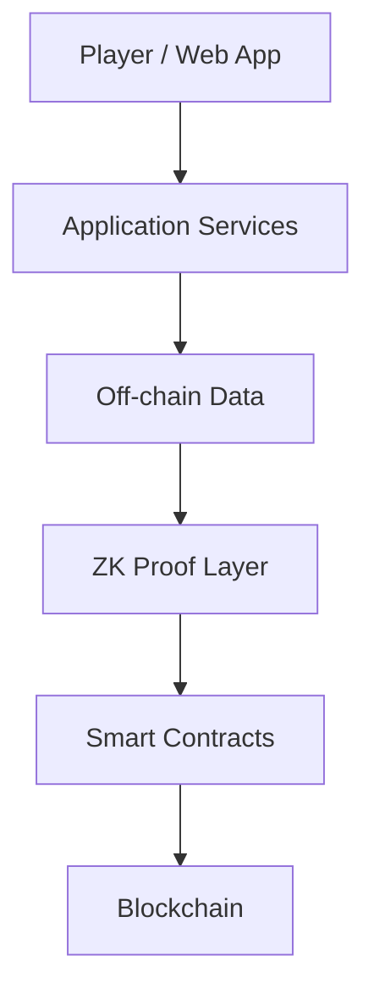

---

## 9.2 技術設計の原則

### Appropriate Decentralization

分散化が価値を持つ部分だけを分散化する。

### Verifiability

重要な計算結果を第三者が検証できるようにする。

### Privacy by Design

再生履歴などの個人データを不用意に公開しない。

### Open Protocol

重要なプロトコル仕様とスマートコントラクトを公開する。

### Upgradeability with Governance

アップグレード可能性を残しつつ、一企業が自由に変更できる構造にはしない。

### Technology Neutrality

特定のブロックチェーンやクラウドへ永久に依存しない。

---

## 9.3 システム全体構成

Creator First Platform は大きく次のレイヤーから構成する。

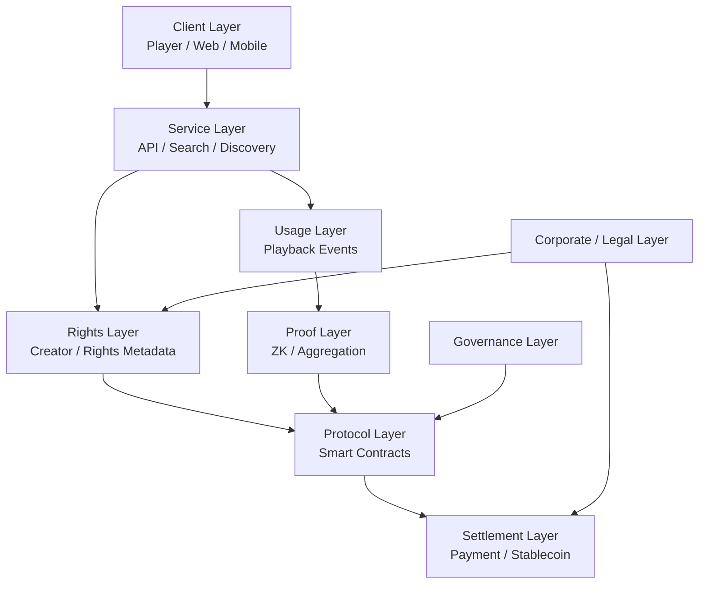

各レイヤーを分離することで、将来一部の技術を変更してもシステム全体を作り直さずに済む構造を目指す。

---

## 9.4 Client Layer

利用者はブロックチェーンを意識せず音楽を利用できることが望ましい。

Client Layer は、

- Web Player
- Mobile App
- Desktop App
- Creator Dashboard
- Governance UI

などから構成する。

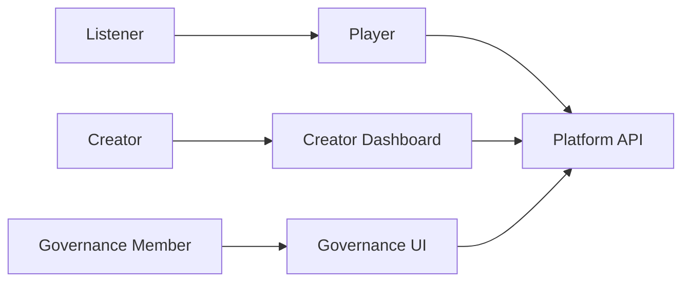

ウォレット操作やGas Feeを通常の音楽再生ごとに要求しない。

---

## 9.5 音楽データをオンチェーン保存しない

音声ファイルは大容量であり、ブロックチェーンへ直接保存する用途には適さない。

音楽コンテンツは、

- Object Storage
- CDN
- 必要に応じた分散ストレージ

などを利用する。

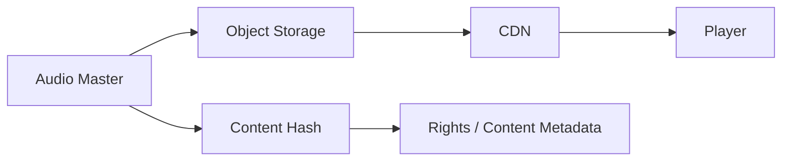

オンチェーンには必要に応じてコンテンツハッシュや識別子を記録し、データと権利情報の対応を検証できるようにする。

---

## 9.6 Content Identifier

作品・録音・権利情報を単純なファイル名だけで管理しない。

概念的には、コンテンツ $m$ に対して、

$$
h_m = H(m)
$$

という暗号学的ハッシュを計算できる。

ここで、

- $m$：コンテンツまたは正規化された対象データ
- $H$：暗号学的ハッシュ関数
- $h_m$：コンテンツ識別に利用できるハッシュ値

である。

ただし、実際の音楽権利管理では ISRC 等の既存識別子、契約情報、バージョン管理も必要になる。

---

## 9.7 Rights Layer

Rights Layer は、

> **誰が、どの作品について、どの権利を持ち、どの比率で分配を受けるか**

を管理する。

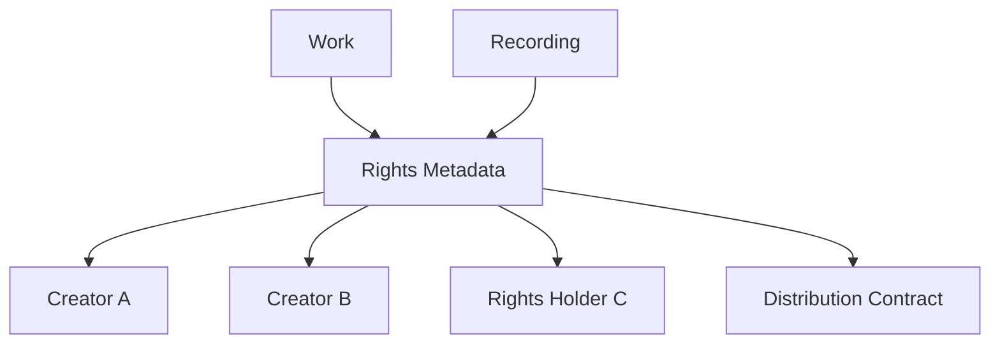

権利情報そのものをすべてオンチェーンへ公開する必要はない。

個人情報・契約上の秘密を保護しながら、分配に必要な状態を検証可能にする。

---

## 9.8 Rights Split

作品 $i$ の分配対象額を $D_i$ とし、権利者 $k$ の分配比率を $s_{i,k}$ とする。

$$
\sum_k s_{i,k} = 1
$$

とすれば、権利者 $k$ への分配額は、

$$
D_{i,k} = s_{i,k}D_i
$$

と表せる。

実際には著作権、著作隣接権、契約、管理事業者等の関係があるため、この式は分配エンジンの概念モデルである。

---

## 9.9 Usage Layer

音楽再生を一回ごとにブロックチェーンへ記録する方式は採用しない。

世界規模ではイベント数が非常に大きくなり、

- コスト
- スループット
- プライバシー
- レイテンシ

の問題が生じるためである。

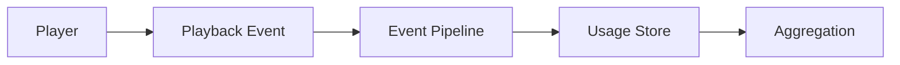

再生イベントはオフチェーンで処理し、一定期間ごとに集計する。

---

## 9.10 Playback Event

再生イベントには例えば、

- Track ID
- 匿名化・仮名化された利用主体情報
- 再生開始
- 再生時間
- 完了率
- Client Integrity 情報
- Event ID

などを含めることができる。

ただし、

> **分配のために必要だからといって、利用者の詳細な行動履歴を永久保存することは正当化されない。**

データ最小化と保持期間を設計する。

---

## 9.11 Usage Oracle

スマートコントラクトは、現実世界で誰がどの曲を聴いたかを直接知ることができない。

そのため Usage Oracle が必要になる。

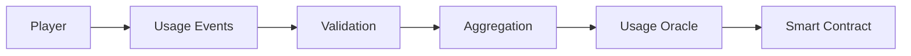

しかし、一つの中央サーバーが、

> 「今月はこの曲が100万回再生された」

と宣言するだけなら、スマートコントラクトを利用する意義が弱くなる。

そこで暗号学的証明を導入する。

---

## 9.12 Commitments

大量の利用データそのものをオンチェーンへ送る代わりに、データ集合への Commitment を作る。

例えば利用イベント集合を Merkle Tree にまとめ、そのRootを、

$$
R = \operatorname{MerkleRoot}(e_1,e_2,\ldots,e_n)
$$

とする。

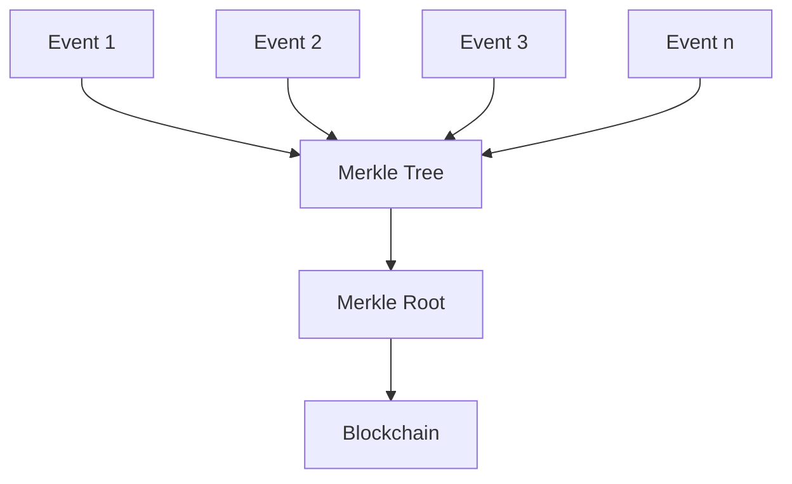

Rootを記録すれば、後から特定データがコミットされた集合に含まれていたことを証明できる。

ただし、Merkle Rootだけでは「集計計算が正しかった」ことまでは証明できない。

---

## 9.13 Zero-Knowledge Proof

Zero-Knowledge Proof（ZKP）は、ある命題が正しいことを、その根拠となる秘密情報をすべて公開せずに証明する技術である。

Creator First Platform では、

> **個々の利用者の再生履歴を公開せずに、分配に使われた利用集計が定義されたルールを満たすことを証明する**

用途が考えられる。

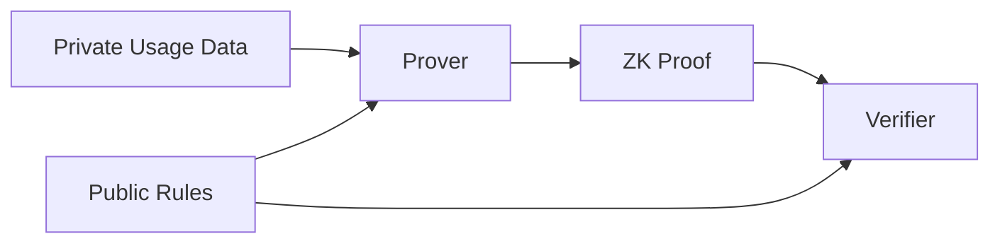

---

## 9.14 ZKで証明したいこと

例えば、ある期間の集計結果について、

- 対象イベントがコミット済み集合から生成された
- 同じイベントを二重計上していない
- 最低再生時間等のルールを適用した
- 不正として無効化されたイベントを除外した
- 作品ごとの集計値が正しい
- 集計値から分配式を正しく計算した

ことを証明対象にできる。

重要なのは、

> **ZKは入力データそのものが現実に正しいことを魔法のように保証する技術ではない**

という点である。

端末やアカウントが偽のイベントを生成する問題には、別途 Client Integrity、不正検出、Sybil Resistance 等が必要である。

---

## 9.15 zk-SNARK と zk-STARK

代表的なZK証明系には zk-SNARK と zk-STARK がある。

両者とも、巨大な計算を毎回検証者が再実行せず、その計算結果の正しさを短い証明によって確認するという目的に利用できる。

概念的には、

$$
y = F(x,w)
$$

という計算について、

- $x$：公開入力
- $w$：秘密のWitness
- $y$：公開される結果

が正しく計算されたことを証明する。

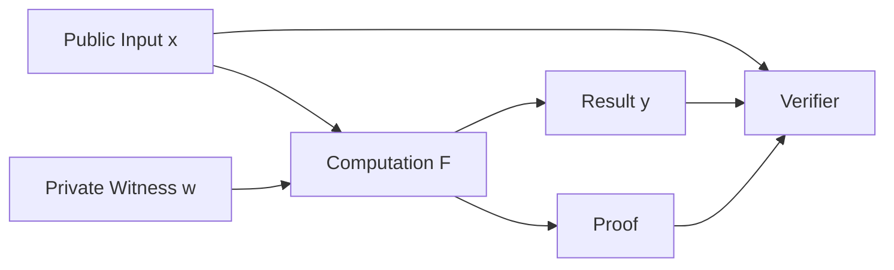

---

## 9.16 zk-STARK

zk-STARK は、

**Zero-Knowledge Scalable Transparent Argument of Knowledge**

の略である。

Creator First Platform にとって重要な特徴は、

1. 大規模計算に適した証明方式
2. Trusted Setupを必要としない
3. ハッシュ関数を中心とした構成が可能
4. 将来的な耐量子性の観点でも有力

という点にある。

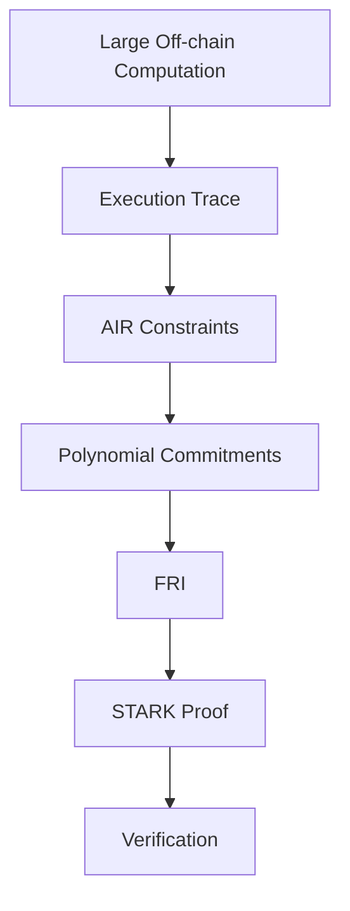

---

## 9.17 STARK の基本的な考え方

STARKでは、プログラムの実行を巨大な **Execution Trace** として表現する。

例えば再生イベントを集計する計算が、

$$
S_{t+1} = S_t + v_t
$$

という状態更新で表されるとする。

ここで、

- $S_t$：時刻 $t$ までの集計状態
- $v_t$：イベント $t$ が有効なら加算される値

である。

大量のイベントについて、この状態遷移が正しく行われたことを証明したい。

---

## 9.18 Execution Trace

単純な例として、

| Step | Valid Play | Total |
| ---: | ---: | ---: |
| 0 | — | 0 |
| 1 | 1 | 1 |
| 2 | 0 | 1 |
| 3 | 1 | 2 |
| 4 | 1 | 3 |

という計算を考える。

状態遷移は、

$$
S_{t+1} - S_t - v_t = 0
$$

をすべてのステップで満たす。

実際の Creator First Platform では、作品ごとのカウンタ、不正判定、再生時間、期間境界など、より複雑な状態を持つ。

---

## 9.19 AIR — Algebraic Intermediate Representation

STARKでは、計算が正しいことを代数的な制約として表現する。

これを **AIR — Algebraic Intermediate Representation** と呼ぶ。

例えば、

$$
S_{t+1} = S_t + v_t
$$

というルールは、

$$
S_{t+1} - S_t - v_t = 0
$$

という多項式制約へ変換できる。

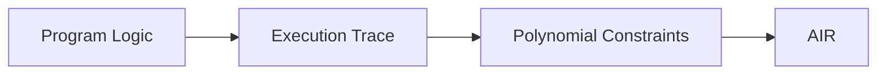

STARKは、Execution Trace全体を公開する代わりに、この制約が正しく満たされていることを確率的・暗号学的に検証可能にする。

---

## 9.20 多項式としてのExecution Trace

Execution Trace の各列を有限体上の多項式として扱う。

ある列の値、

$$
a_0,a_1,\ldots,a_{n-1}
$$

に対して、それらを所定の点で取る多項式 $A(X)$ を補間する。

$$
A(\omega^i)=a_i
$$

という関係を利用し、計算の正しさを多項式恒等式の検証へ変換する。

これにより、巨大な計算履歴の全行を検証者が逐一再計算する必要がなくなる。

---

## 9.21 Merkle Commitment

証明者は、多項式の評価値などを Merkle Tree にコミットする。

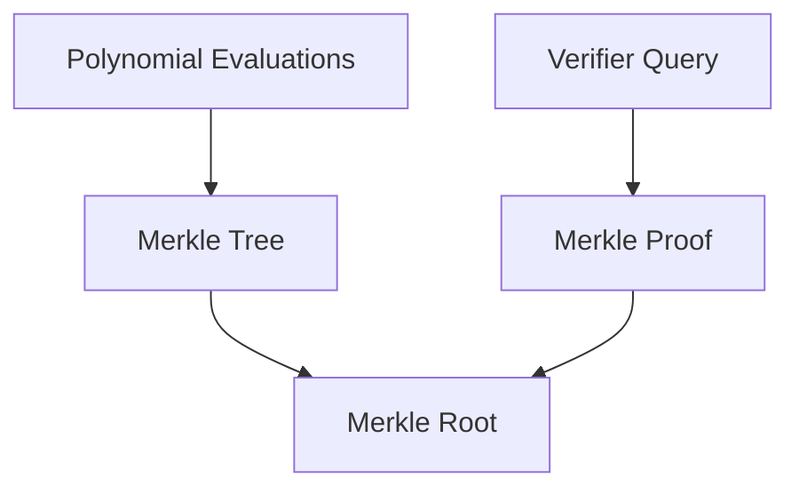

証明者は後から都合の良い値へ変更できず、検証者は一部の値だけを問い合わせてCommitmentとの整合性を確認できる。

---

## 9.22 FRI

STARKの中心技術の一つが **FRI — Fast Reed-Solomon Interactive Oracle Proof of Proximity** である。

FRIは、大まかに言えば、

> **コミットされた評価値が、本当に低次数多項式から生成されたものに近いか**

を効率的に検証する仕組みである。

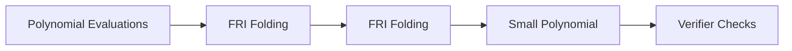

各ラウンドで問題を縮約し、最終的に小さな多項式へ落とし込む。

検証者は全データを見るのではなく、ランダムに選ばれた少数の位置を検査する。

---

## 9.23 Fiat–Shamir変換

STARKの元となるプロトコルでは、証明者と検証者の対話を利用する。

実際のブロックチェーンでは、非対話型証明として扱えることが望ましい。

そこで Fiat–Shamir変換を用い、検証者のランダムチャレンジをハッシュ値から生成する。

概念的には、

$$
r = H(C_1,C_2,\ldots,C_k)
$$

のように、これまでのCommitmentからチャレンジ $r$ を導出する。

これにより、

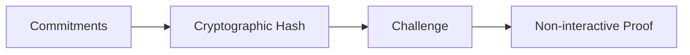

という非対話型の証明を構成できる。

---

## 9.24 なぜ STARK が Creator First Platform に適するのか

Usage Oracle では、月間・日次などで非常に大量のイベントを処理する可能性がある。

すべてのイベントをスマートコントラクトで再計算するのは非現実的である。

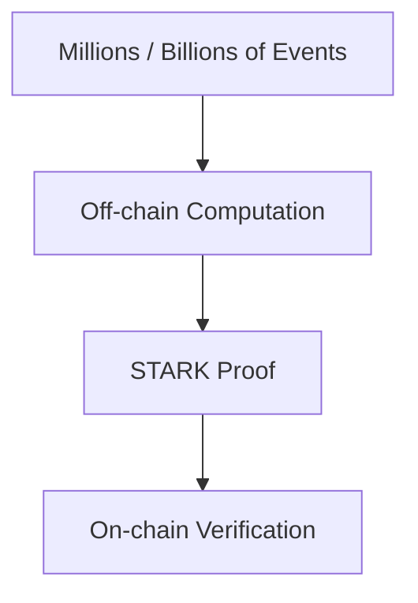

STARKを利用すれば、

> **大量計算はオフチェーンで行い、その計算がルール通りだったことだけを暗号学的に検証する**

という構造を実現できる。

---

## 9.25 Trusted Setup を必要としない

一部のZK証明系では、初期パラメータ生成に Trusted Setup が必要になる場合がある。

STARKは基本的にそのような秘密パラメータ生成を必要としない。

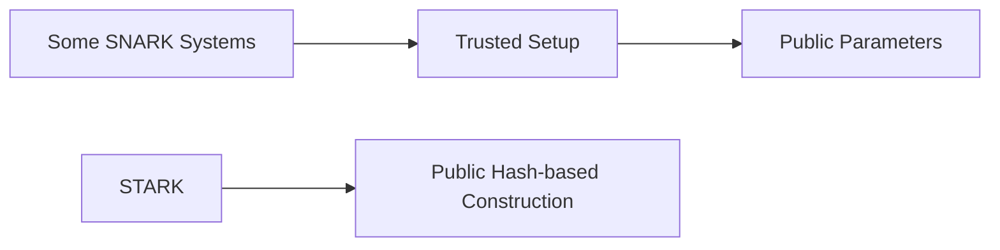

長期間利用する公共的なプロトコルでは、

> **「初期設定時の秘密が安全に破棄されたことを信頼する」必要がない**

ことは重要な設計上の利点となる。

なお、SNARKにもTrusted Setupを必要としない方式が存在するため、これはSNARK一般との絶対的な差ではない。

---

## 9.26 耐量子性

STARKは、楕円曲線ペアリングではなく主に暗号学的ハッシュ関数に安全性を依存する構成を取れる。

そのため、大規模量子計算機を想定した場合にも有力な証明方式と考えられる。

ただし、

> **STARKを採用すればシステム全体が自動的に耐量子化されるわけではない。**

ブロックチェーンの署名方式、ウォレット、TLS、鍵管理などが量子攻撃に弱ければ、別途移行が必要である。

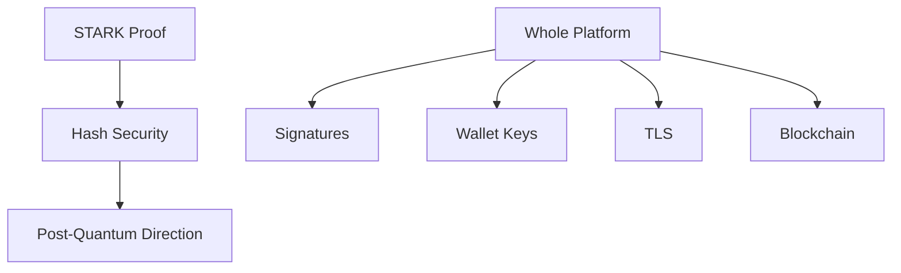

---

## 9.27 STARK のトレードオフ

STARKには利点だけでなく課題もある。

一般に、

- 証明サイズが大きくなりやすい
- Prover計算量が大きい
- 実装が複雑
- 証明生成インフラが必要
- オンチェーン検証コストは対象チェーンに依存する

といった点を考慮する必要がある。

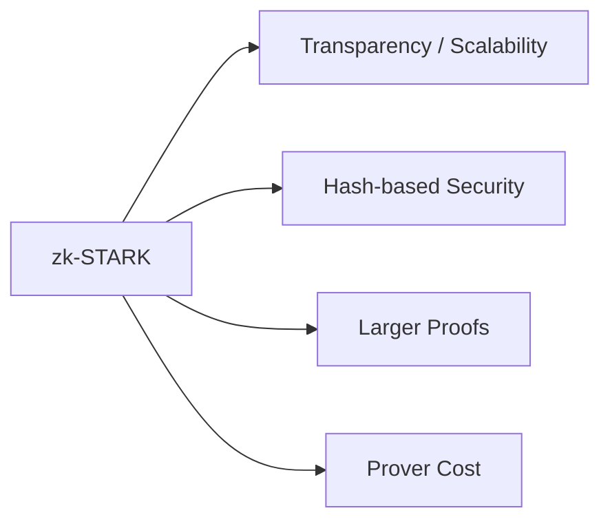

したがって「STARKだから採用」ではなく、SNARK等と実測比較した上で選択する。

---

## 9.28 SNARK と STARK の使い分け

Creator First Platform は証明方式をホワイトペーパー段階で固定しない。

概念的には、

| 観点 | zk-SNARK | zk-STARK |
| --- | --- | --- |
| 証明サイズ | 小さい方式が多い | 比較的大きい |
| 検証 | 非常に効率的な方式がある | 効率的 |
| Trusted Setup | 方式による | 原則不要 |
| Prover | 方式による | 大規模計算向けだが重い |
| 主な暗号要素 | 楕円曲線等を使う方式が多い | ハッシュ中心 |
| 耐量子性 | 方式依存 | 有力 |
| 適用 | オンチェーン検証等 | 大規模計算・透明性 |

といった比較ができる。

最終的には、

- 証明生成時間
- 証明サイズ
- 検証Gas
- 開発成熟度
- 監査可能性
- ライブラリの安全性
- 対象チェーン

で評価する。

---

## 9.29 Usage Proof の構造

Creator First Platform で想定するUsage Proofを概念化すると、

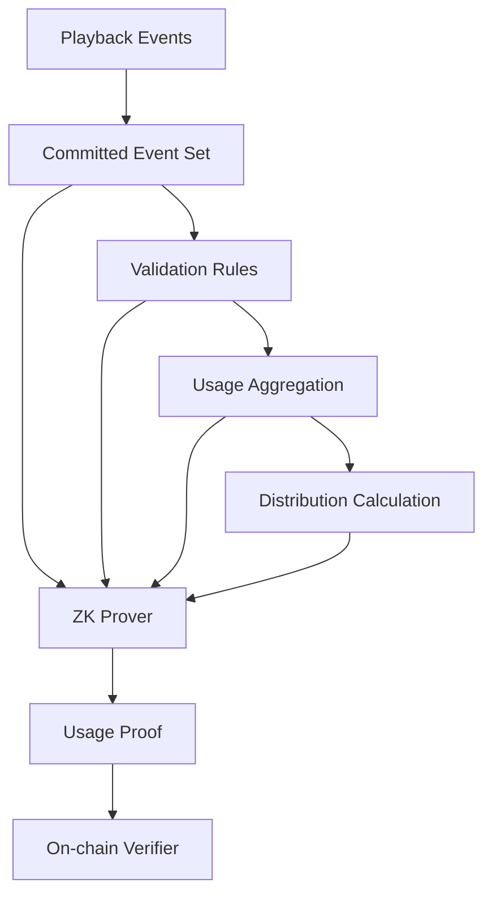

となる。

証明対象は段階的に拡張できる。

---

## 9.30 Public Input と Private Witness

Usage Proof の設計では、何を公開し、何を秘密にするかが重要である。

### Public Input の例

- 集計期間
- Usage Dataset Commitment
- 集計結果Root
- 分配Root
- Protocol Version
- Rule Hash

### Private Witness の例

- 個々の再生イベント
- 仮名化された利用者情報
- 中間集計データ
- 不正判定に必要な非公開情報

```mermaid
flowchart LR
    PUBLIC[Public Inputs]
    PRIVATE[Private Witness]
    CIRCUIT[Proof Program]
    PROOF[Proof]

    PUBLIC --> CIRCUIT
    PRIVATE --> CIRCUIT
    CIRCUIT --> PROOF
```

---

## 9.31 Rule Hash

どのルールで計算された証明なのかを明確にする。

プロトコル仕様または証明プログラムに対して、

$$
h_{\mathrm{rule}} = H(\mathrm{RuleVersion})
$$

のような識別値を持たせる。

```mermaid
flowchart LR
    GOV[Governance]
    SPEC[Approved Specification]
    CODE[Proof Program]
    HASH[Rule Hash]
    PROOF[Usage Proof]

    GOV --> SPEC --> CODE --> HASH
    HASH --> PROOF
```

これにより、古いルールで生成された証明を新しいルールの結果として扱うことを防ぐ。

---

## 9.32 分配Root

作品・権利者ごとの分配額を大量にオンチェーン保存する代わりに、分配表をMerkle Treeへまとめることができる。

```mermaid
flowchart TD
    D1[Creator A : Amount]
    D2[Creator B : Amount]
    D3[Creator C : Amount]

    D1 --> TREE[Distribution Merkle Tree]
    D2 --> TREE
    D3 --> TREE

    TREE --> ROOT[Distribution Root]
    ROOT --> CONTRACT[Smart Contract]
```

各権利者は自分の分配額とMerkle Proofを提示してClaimする方式を検討できる。

---

## 9.33 Smart Contract Layer

スマートコントラクトは、

- 分配ルール
- Pool管理
- Rights Split
- Governance Execution
- Treasury
- Claim

などをモジュール化する。

```mermaid
flowchart TD
    TREASURY[Treasury]
    DIST[Distribution]
    RIGHTS[Rights Registry]
    GOV[Governance]
    VERIFY[Proof Verifier]

    GOV --> TREASURY
    GOV --> DIST
    GOV --> RIGHTS

    VERIFY --> DIST
    RIGHTS --> DIST
    TREASURY --> DIST
```

巨大な一枚のコントラクトへ全機能を集約しない。

---

## 9.34 Upgradeability

サービス初期からコードを完全に不変にすると、バグ修正や法制度変更への対応が困難になる。

一方、運営会社が管理者鍵一本で自由にアップグレードできるなら、Code Governanceの意味がなくなる。

```mermaid
flowchart LR
    PROPOSAL[Governance Proposal]
    APPROVE[Two-House Approval]
    REVIEW[Legal / Security Review]
    TIME[Timelock]
    UPGRADE[Contract Upgrade]

    PROPOSAL --> APPROVE --> REVIEW --> TIME --> UPGRADE
```

アップグレード権限自体をガバナンスの対象とする。

---

## 9.35 Emergency Pause

重大な脆弱性が発見された場合には限定的なPause機能が必要になる可能性がある。

ただし、

- 誰が実行できるか
- 何を停止できるか
- 何日間有効か
- 資金移動権限を持つか
- 事後レビュー

を明確にする。

Emergency Keyを「何でもできる管理者鍵」にしない。

---

## 9.36 Stablecoin Settlement

クリエイターへの分配には、価格変動の大きい暗号資産より、法定通貨連動型ステーブルコインを利用する構成を検討する。

日本国内では、法令・事業者要件を満たすステーブルコインや決済経路を選択する。

```mermaid
flowchart LR
    FIAT[Subscription Payment]
    PSP[Payment Provider]
    TREASURY[Treasury]
    STABLE[Stablecoin Settlement]
    CREATOR[Creator]

    FIAT --> PSP --> TREASURY
    TREASURY --> STABLE --> CREATOR
```

利用者が暗号資産を保有しなくてもサービスを利用できる構造を基本とする。

---

## 9.37 Blockchain Abstraction

利用者に、

- Network
- Gas
- Nonce
- Bridge
- RPC

などを意識させない。

```mermaid
flowchart LR
    USER[User]
    APP[Music App]
    ABSTRACTION[Blockchain Abstraction]
    CHAIN[Blockchain]

    USER --> APP --> ABSTRACTION --> CHAIN
```

ブロックチェーンはUXではなく、検証・決済・ガバナンスを支える基盤として利用する。

---

## 9.38 Chain Selection

対象チェーンは、

- セキュリティ
- 分散性
- Gas Cost
- ZK Verification Cost
- Stablecoin Ecosystem
- 開発環境
- 長期的継続性
- 法的・事業上の利用可能性

で評価する。

Ethereum L1だけでなくL2の利用も有力である。

```mermaid
flowchart TD
    PROTOCOL[Creator First Protocol]
    PROTOCOL --> L2[Ethereum L2]
    L2 --> L1[Ethereum Settlement]
```

ホワイトペーパー段階では特定L2へ永久固定しない。

---

## 9.39 オフチェーンとオンチェーンの境界

### オフチェーン

- 音楽配信
- 検索
- 推薦
- 再生イベント
- AI
- 不正検出
- 大規模集計
- ZK Proof生成

### オンチェーン

- Proof Verification
- Distribution Root
- Treasury Rules
- Governance Execution
- Protocol Version
- 必要な権利状態Commitment

```mermaid
flowchart LR
    OFF[Off-chain]
    BRIDGE[Cryptographic Proof / Commitment]
    ON[On-chain]

    OFF --> BRIDGE --> ON
```

この境界を明確にすることが、コストと検証可能性の両立に重要である。

---

## 9.40 クラウド基盤

初期段階では、運用成熟度の高いクラウドサービスを利用する。

主な構成は、

```mermaid
flowchart TD
    CDN[CDN]
    API[API Gateway / Load Balancer]
    APP[Application Services]
    DB[Database]
    OBJ[Object Storage]
    QUEUE[Event Queue]
    ANALYTICS[Analytics / Usage]
    PROVER[ZK Prover Cluster]

    CDN --> API --> APP
    APP --> DB
    APP --> OBJ
    APP --> QUEUE
    QUEUE --> ANALYTICS
    ANALYTICS --> PROVER
```

となる。

規模の拡大に応じて、証明生成基盤を独立してスケールできるようにする。

---

## 9.41 Prover Infrastructure

ZK証明生成は通常のWeb APIとは異なる計算特性を持つ。

そこで、

```mermaid
flowchart LR
    EVENTS[Aggregated Events]
    JOB[Proof Job]
    QUEUE[Prover Queue]
    WORKER[Prover Workers]
    PROOF[Proof]
    STORE[Proof Store]

    EVENTS --> JOB --> QUEUE --> WORKER --> PROOF --> STORE
```

のように非同期ジョブとして扱う。

将来的にはCPU/GPU等の実測値をもとに最適化する。

---

## 9.42 データベース

一つのデータベースですべてを管理するのではなく、用途に応じて分離する。

- Transactional DB
- Search Index
- Event Store
- Analytics Store
- Object Storage
- Blockchain State

などである。

```mermaid
flowchart TD
    API[Application]
    API --> TX[Transactional DB]
    API --> SEARCH[Search]
    API --> OBJ[Object Storage]

    EVENTS[Usage Events] --> EVENT[Event Store]
    EVENT --> ANALYTICS[Analytics]
    ANALYTICS --> PROOF[Proof System]
```

---

## 9.43 Privacy

再生履歴は利用者の嗜好や生活パターンを推測し得る情報である。

したがって、

> **ブロックチェーンの透明性を利用者データへ直接適用しない。**

```mermaid
flowchart LR
    USER[User Activity]
    PRIVATE[Private Data Layer]
    AGG[Aggregation]
    ZK[Zero-Knowledge Proof]
    PUBLIC[Public Verification]

    USER --> PRIVATE --> AGG --> ZK --> PUBLIC
```

公開するのは必要な集計結果、Commitment、Proofを中心とする。

---

## 9.44 鍵管理

スマートコントラクトを利用する場合、秘密鍵管理は重大なセキュリティ要件となる。

- Treasury Key
- Deployment Key
- Emergency Authority
- Governance Executor
- Oracle Signer

などを分離する。

```mermaid
flowchart TD
    KEYS[Key Management]
    KEYS --> HSM[HSM / Secure Signing]
    KEYS --> MULTI[Multisig]
    KEYS --> GOV[Governance]
    KEYS --> ROTATE[Rotation]
```

単一の開発者PCの秘密鍵で本番資金を管理しない。

---

## 9.45 セキュリティ境界

```mermaid
flowchart TD
    CLIENT[Client]
    EDGE[Edge / CDN]
    API[API]
    DATA[Data]
    PROVER[ZK Prover]
    CHAIN[Blockchain]

    CLIENT --> EDGE --> API --> DATA
    DATA --> PROVER --> CHAIN
```

各境界で、

- Authentication
- Authorization
- Encryption
- Rate Limit
- Audit Log
- Integrity Check

を設ける。

詳細は第10章「セキュリティ」で扱う。

---

## 9.46 Open Source

プロトコルの信頼性に直接関係するコードは、可能な範囲でオープンソース化する。

特に、

- Smart Contracts
- Proof Program
- Verifier
- Governance Logic
- Distribution Logic

は公開を基本とする。

```mermaid
flowchart LR
    SPEC[Specification]
    CODE[Open Source Code]
    TEST[Test]
    AUDIT[Audit]
    DEPLOY[Deployment]

    SPEC --> CODE --> TEST --> AUDIT --> DEPLOY
```

サービス運用の全内部コードを公開することとは区別する。

---

## 9.47 Reproducible Build

ガバナンスで承認されたソースコードと実際にデプロイされたバイトコードが一致することを確認できる仕組みを目指す。

```mermaid
flowchart LR
    SOURCE[Approved Source]
    BUILD[Reproducible Build]
    BYTE[Bytecode]
    DEPLOY[Deployed Contract]

    SOURCE --> BUILD --> BYTE --> DEPLOY
```

これにより、

> 「投票されたコードと別のコードがデプロイされた」

という問題を検証できる。

---

## 9.48 Protocol Version

分配、Proof、Rights、Governanceなどの仕様にはVersionを持たせる。

例えば、

```text
Protocol: CFP
Version: 1.0
Usage Proof: 1
Distribution: 1
Rights Schema: 1
```

のように、どのルールで処理されたデータかを追跡できるようにする。

---

## 9.49 技術とガバナンス

技術仕様のすべてを投票で決めるわけではない。

```mermaid
flowchart TD
    GOV[Governance]
    ARCH[Protocol Architecture]
    DEV[Engineering]
    IMPLEMENT[Implementation]

    GOV --> RULES[Protocol Rules]
    RULES --> ARCH
    ARCH --> DEV --> IMPLEMENT
```

例えばデータベースのインデックス方式まで二院制投票する必要はない。

一方、

- 分配式
- Proofで保証する性質
- Upgrade権限
- Treasury権限
- Privacy原則

などはガバナンス対象となり得る。

---

## 9.50 段階的導入

最初からSTARKベースの完全なUsage Oracleを構築する必要はない。

```mermaid
flowchart LR
    P1[Phase 1<br/>Auditable Off-chain]
    P2[Phase 2<br/>Commitments]
    P3[Phase 3<br/>ZK Usage Proof]
    P4[Phase 4<br/>Scalable STARK Infrastructure]

    P1 --> P2 --> P3 --> P4
```

### Phase 1

通常のクラウド基盤で利用実績を集計し、監査ログと透明な分配レポートを提供する。

### Phase 2

Usage Datasetや分配表へMerkle Commitmentを導入する。

### Phase 3

重要な集計・分配計算へZK Proofを導入する。

### Phase 4

大規模な利用実績をSTARK等で証明し、世界規模へ拡張する。

---

## 9.51 技術選択を固定しない理由

ZK技術は急速に進化している。

現在最適な、

- Proof System
- Blockchain
- L2
- Data Availability
- Prover Hardware

が数年後にも最適とは限らない。

したがってホワイトペーパーでは、

> **特定製品ではなく、検証可能性・プライバシー・透明性という技術要件を固定する。**

```mermaid
flowchart LR
    PRINCIPLE[Stable Principles]
    TECH[Replaceable Technology]

    PRINCIPLE --> ZK[ZK System]
    PRINCIPLE --> CHAIN[Blockchain]
    PRINCIPLE --> CLOUD[Infrastructure]

    ZK --> TECH
    CHAIN --> TECH
    CLOUD --> TECH
```

---

## 9.52 技術ロードマップ

```mermaid
flowchart LR
    MVP[MVP]
    AUDIT[Auditable Platform]
    COMMIT[Commitment Layer]
    ZK[ZK Proof]
    SCALE[Global Scale]

    MVP --> AUDIT --> COMMIT --> ZK --> SCALE
```

MVPでは音楽サービスとしての成立を優先する。

その後、透明性と検証可能性を段階的に暗号学的保証へ置き換える。

---

## 9.53 本章のまとめ

Creator First Platform の技術的な中心思想は、

> **Trust the company**

から、

> **Verify the protocol**

へ徐々に移行することである。

```mermaid
flowchart TD
    MUSIC[Music Service]
    OFF[Scalable Off-chain Systems]
    ZK[Zero-Knowledge Proofs]
    SC[Smart Contracts]
    GOV[Governance]
    CORP[Corporate Responsibility]

    MUSIC --> OFF
    OFF --> ZK
    ZK --> SC
    GOV --> SC
    CORP --> MUSIC
```

ただし、これは会社を不要にすることを意味しない。

株式会社は、

- 権利契約
- 法令遵守
- 会計
- 運営
- セキュリティ
- 利用者対応

について現実社会で責任を負う。

一方、スマートコントラクトとZK Proofは、

> **会社が定められたルール通りに重要な処理を行ったことを、会社自身を信頼するだけでなく第三者が検証できる状態**

を作る。

特に zk-STARK は、大量の利用イベントを扱う Creator First Platform において、

> **大量計算をオフチェーンで実行し、個々の利用履歴を公開せず、その計算が正しかったことだけを検証する**

ための有力な技術候補である。

Creator First Platform が目指すのは「ブロックチェーン音楽サービス」ではない。

> **音楽サービスとして使いやすく、その背後にある権利・分配・コード統治だけが必要な範囲で暗号学的に検証可能なプラットフォーム**

である。
