# 9. 技術

## 9.1 本章の目的

Creator First Platform の技術設計は、ブロックチェーンを使うこと自体を目的としない。

中心となる要件は、

- 音楽配信として十分な性能と使いやすさ
- 権利情報と収益分配ルールの明確化
- 利用実績の検証可能性
- 音楽クリエーターへの透明な分配
- ユーザのプライバシー保護
- ガバナンス決定と実行コードの一致
- 法制度・契約・会計との接続
- 将来の世界展開に耐えられる拡張性

である。

したがって、すべてをオンチェーン化するのではなく、

> **大量データ処理はオフチェーン、検証すべき状態とルールはオンチェーン、両者の間を暗号学的証明で接続する**

というハイブリッド構造を基本とする。

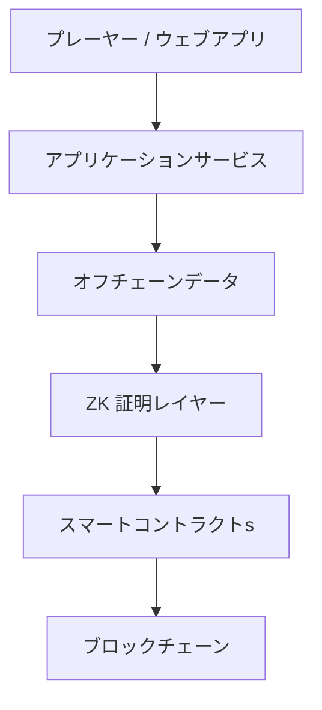

---

## 9.2 技術設計の原則

### 適切な分散化

分散化が価値を持つ部分だけを分散化する。

### 検証可能性

重要な計算結果を第三者が検証できるようにする。

### プライバシー・バイ・デザイン

再生履歴などの個人データを不用意に公開しない。

### オープンプロトコル

重要なプロトコル仕様とスマートコントラクトを公開する。

### ガバナンスを伴うアップグレード可能性

アップグレード可能性を残しつつ、一企業が自由に変更できる構造にはしない。

### 技術的中立性

特定のブロックチェーンやクラウドへ永久に依存しない。

---

## 9.3 システム全体構成

Creator First Platform は大きく次のレイヤーから構成する。

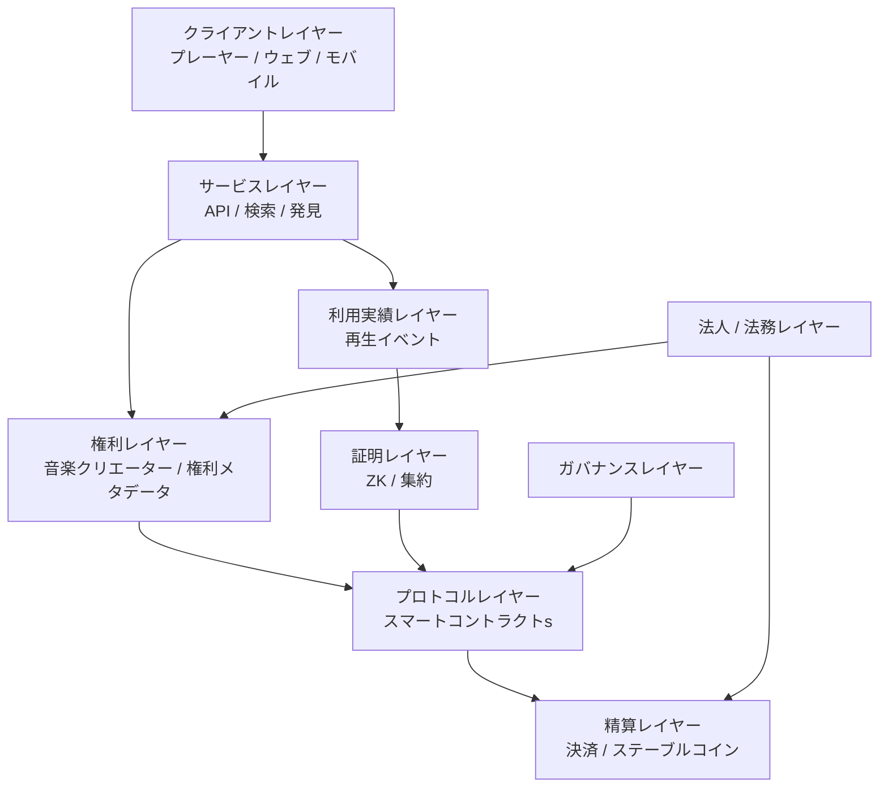

各レイヤーを分離することで、将来一部の技術を変更してもシステム全体を作り直さずに済む構造を目指す。

---

## 9.4 クライアントレイヤー

ユーザはブロックチェーンを意識せず音楽を利用できることが望ましい。

クライアントレイヤーは、

- ウェブプレーヤー
- モバイルアプリ
- Desktop アプリ
- 音楽クリエーターダッシュボード
- ガバナンス UI

などから構成する。

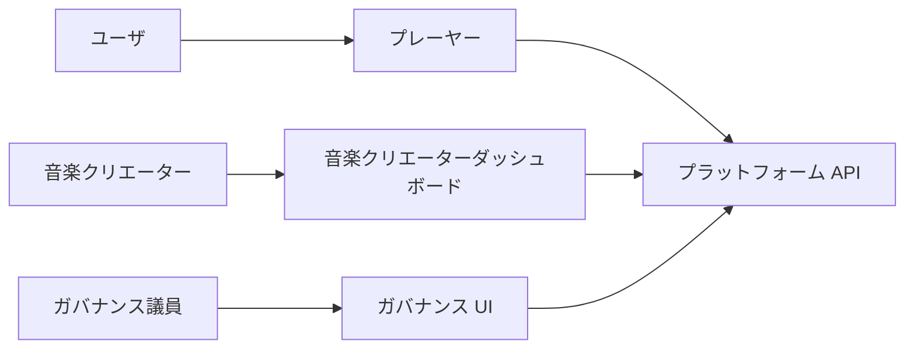

ウォレット操作やガス手数料を通常の音楽再生ごとに要求しない。

---

## 9.5 音楽データをオンチェーン保存しない

音声ファイルは大容量であり、ブロックチェーンへ直接保存する用途には適さない。

音楽コンテンツは、

- オブジェクトストレージ
- CDN
- 必要に応じた分散ストレージ

などを利用する。

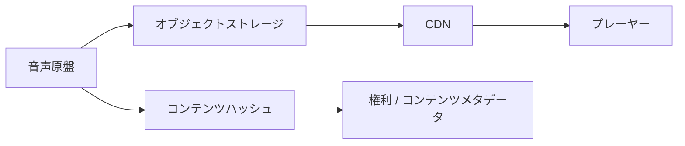

オンチェーンには必要に応じてコンテンツハッシュや識別子を記録し、データと権利情報の対応を検証できるようにする。

---

## 9.6 コンテンツ識別子

作品・録音・権利情報を単純なファイル名だけで管理しない。

概念的には、コンテンツ $m$ に対して、

$$
h_m = H(m)
$$

という暗号学的ハッシュを計算できる。

ここで、

- $m$：コンテンツまたは正規化された対象データ
- $H$：暗号学的ハッシュ関数
- $h_m$：コンテンツ識別に利用できるハッシュ値

である。

ただし、実際の音楽権利管理では ISRC 等の既存識別子、契約情報、バージョン管理も必要になる。

---

## 9.7 権利レイヤー

権利レイヤーは、

> **誰が、どの作品について、どの権利を持ち、どの比率で分配を受けるか**

を管理する。

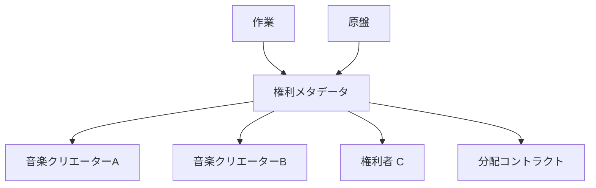

権利情報そのものをすべてオンチェーンへ公開する必要はない。

個人情報・契約上の秘密を保護しながら、分配に必要な状態を検証可能にする。

---

## 9.8 権利分割

作品 $i$ の分配対象額を $D_i$ とし、権利者 $k$ の分配比率を $s_{i,k}$ とする。

$$
\sum_k s_{i,k} = 1
$$

とすれば、権利者 $k$ への分配額は、

$$
D_{i,k} = s_{i,k}D_i
$$

と表せる。

実際には著作権、著作隣接権、契約、管理事業者等の関係があるため、この式は分配エンジンの概念モデルである。

---

## 9.9 利用実績レイヤー

音楽再生を一回ごとにブロックチェーンへ記録する方式は採用しない。

世界規模ではイベント数が非常に大きくなり、

- コスト
- スループット
- プライバシー
- レイテンシ

の問題が生じるためである。

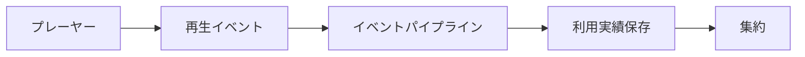

再生イベントはオフチェーンで処理し、一定期間ごとに集計する。

---

## 9.10 再生イベント

再生イベントには例えば、

- 楽曲 ID
- 匿名化・仮名化された利用主体情報
- 再生開始
- 再生時間
- 完了率
- クライアント完全性情報
- イベント ID

などを含めることができる。

ただし、

> **分配のために必要だからといって、ユーザの詳細な行動履歴を永久保存することは正当化されない。**

データ最小化と保持期間を設計する。

---

## 9.11 利用実績オラクル

スマートコントラクトは、現実世界で誰がどの曲を聴いたかを直接知ることができない。

そのため利用実績オラクルが必要になる。

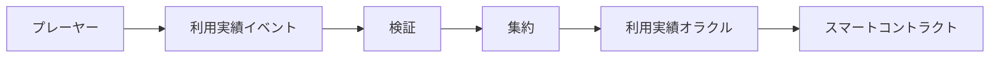

しかし、一つの中央サーバーが、

> 「今月はこの曲が100万回再生された」

と宣言するだけなら、スマートコントラクトを利用する意義が弱くなる。

そこで暗号学的証明を導入する。

---

## 9.12 コミットメント

大量の利用データそのものをオンチェーンへ送る代わりに、データ集合へのコミットメントを作る。

例えば利用イベント集合を Merkle Tree にまとめ、そのルートを、

$$
R = \operatorname{MerkleRoot}(e_1,e_2,\ldots,e_n)
$$

とする。

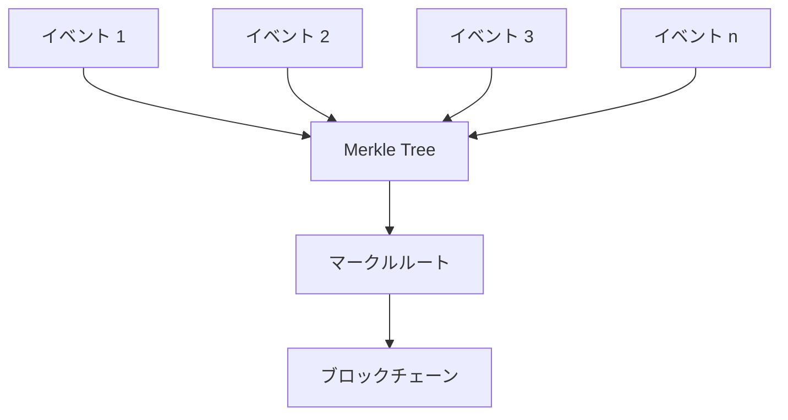

ルートを記録すれば、後から特定データがコミットされた集合に含まれていたことを証明できる。

ただし、マークルルートだけでは「集計計算が正しかった」ことまでは証明できない。

---

## 9.13 ゼロ知識証明

ゼロ知識証明（ZKP）は、ある命題が正しいことを、その根拠となる秘密情報をすべて公開せずに証明する技術である。

Creator First Platform では、

> **個々のユーザの再生履歴を公開せずに、分配に使われた利用集計が定義されたルールを満たすことを証明する**

用途が考えられる。

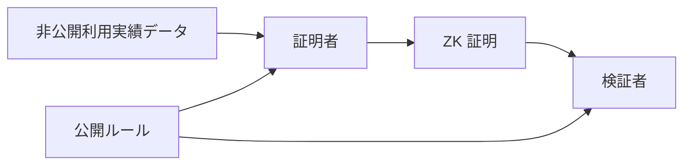

---

## 9.14 ZKで証明したいこと

例えば、ある期間の集計結果について、

- 対象イベントがコミット済み集合から生成された
- 同じイベントを二重計上していない
- 最低再生時間等のルールを適用した
- 不正として無効化されたイベントを除外した
- 作品ごとの集計値が正しい
- 集計値から分配式を正しく計算した

ことを証明対象にできる。

重要なのは、

> **ZKは入力データそのものが現実に正しいことを魔法のように保証する技術ではない**

という点である。

端末やアカウントが偽のイベントを生成する問題には、別途クライアント完全性、不正検出、シビル耐性等が必要である。

---

## 9.15 zk-SNARK と zk-STARK

代表的なZK証明系には zk-SNARK と zk-STARK がある。

両者とも、巨大な計算を毎回検証者が再実行せず、その計算結果の正しさを短い証明によって確認するという目的に利用できる。

概念的には、

$$
y = F(x,w)
$$

という計算について、

- $x$：公開入力
- $w$：秘密のWitness
- $y$：公開される結果

が正しく計算されたことを証明する。

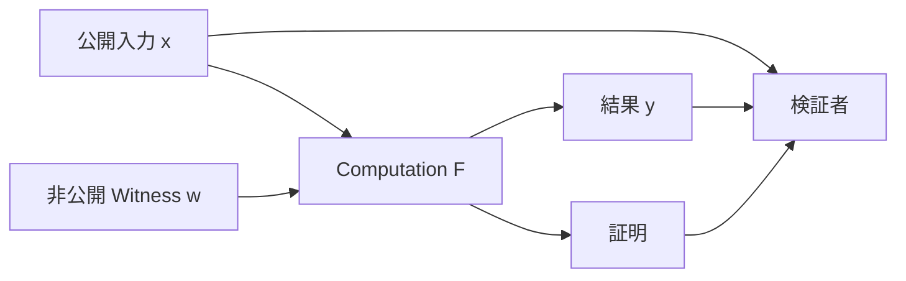

---

## 9.16 zk-STARK

zk-STARK は、

**ゼロ知識拡張可能透明 Argument of Knowledge**

の略である。

Creator First Platform にとって重要な特徴は、

1. 大規模計算に適した証明方式
2. 信頼された Setupを必要としない
3. ハッシュ関数を中心とした構成が可能
4. 将来的な耐量子性の観点でも有力

という点にある。

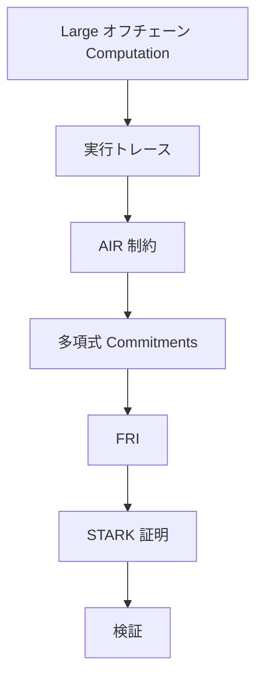

---

## 9.17 STARK の基本的な考え方

STARKでは、プログラムの実行を巨大な **実行トレース** として表現する。

例えば再生イベントを集計する計算が、

$$
S_{t+1} = S_t + v_t
$$

という状態更新で表されるとする。

ここで、

- $S_t$：時刻 $t$ までの集計状態
- $v_t$：イベント $t$ が有効なら加算される値

である。

大量のイベントについて、この状態遷移が正しく行われたことを証明したい。

---

## 9.18 実行トレース

単純な例として、

| Step | 有効 Play | Total |
| ---: | ---: | ---: |
| 0 | — | 0 |
| 1 | 1 | 1 |
| 2 | 0 | 1 |
| 3 | 1 | 2 |
| 4 | 1 | 3 |

という計算を考える。

状態遷移は、

$$
S_{t+1} - S_t - v_t = 0
$$

をすべてのステップで満たす。

実際の Creator First Platform では、作品ごとのカウンタ、不正判定、再生時間、期間境界など、より複雑な状態を持つ。

---

## 9.19 AIR — 代数的中間表現

STARKでは、計算が正しいことを代数的な制約として表現する。

これを **AIR — Algebraic Intermediate 代表性** と呼ぶ。

例えば、

$$
S_{t+1} = S_t + v_t
$$

というルールは、

$$
S_{t+1} - S_t - v_t = 0
$$

という多項式制約へ変換できる。

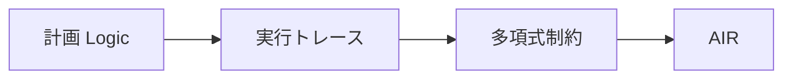

STARKは、実行トレース全体を公開する代わりに、この制約が正しく満たされていることを確率的・暗号学的に検証可能にする。

---

## 9.20 多項式としての実行トレース

実行トレースの各列を有限体上の多項式として扱う。

ある列の値、

$$
a_0,a_1,\ldots,a_{n-1}
$$

に対して、それらを所定の点で取る多項式 $A(X)$ を補間する。

$$
A(\omega^i)=a_i
$$

という関係を利用し、計算の正しさを多項式恒等式の検証へ変換する。

これにより、巨大な計算履歴の全行を検証者が逐一再計算する必要がなくなる。

---

## 9.21 Merkle コミットメント

証明者は、多項式の評価値などを Merkle Tree にコミットする。

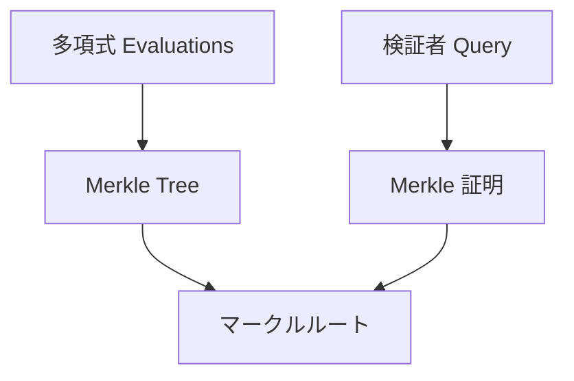

証明者は後から都合の良い値へ変更できず、検証者は一部の値だけを問い合わせてコミットメントとの整合性を確認できる。

---

## 9.22 FRI

STARKの中心技術の一つが **FRI — 迅速 Reed-Solomon Interactive オラクル証明 of Proximity** である。

FRIは、大まかに言えば、

> **コミットされた評価値が、本当に低次数多項式から生成されたものに近いか**

を効率的に検証する仕組みである。

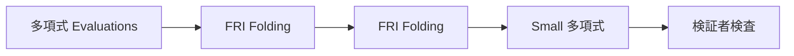

各ラウンドで問題を縮約し、最終的に小さな多項式へ落とし込む。

検証者は全データを見るのではなく、ランダムに選ばれた少数の位置を検査する。

---

## 9.23 Fiat–Shamir変換

STARKの元となるプロトコルでは、証明者と検証者の対話を利用する。

実際のブロックチェーンでは、非対話型証明として扱えることが望ましい。

そこで Fiat–Shamir変換を用い、検証者のランダムチャレンジをハッシュ値から生成する。

概念的には、

$$
r = H(C_1,C_2,\ldots,C_k)
$$

のように、これまでのコミットメントからチャレンジ $r$ を導出する。

これにより、

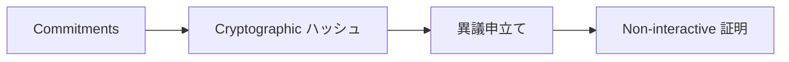

という非対話型の証明を構成できる。

---

## 9.24 なぜ STARK が Creator First Platform に適するのか

利用実績オラクルでは、月間・日次などで非常に大量のイベントを処理する可能性がある。

すべてのイベントをスマートコントラクトで再計算するのは非現実的である。

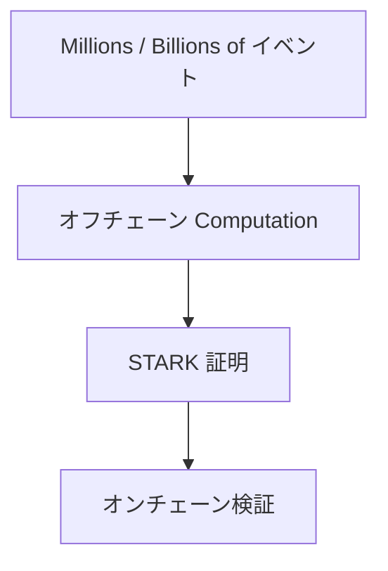

STARKを利用すれば、

> **大量計算はオフチェーンで行い、その計算がルール通りだったことだけを暗号学的に検証する**

という構造を実現できる。

---

## 9.25 信頼されたセットアップを必要としない

一部のZK証明系では、初期パラメータ生成に信頼された Setup が必要になる場合がある。

STARKは基本的にそのような秘密パラメータ生成を必要としない。

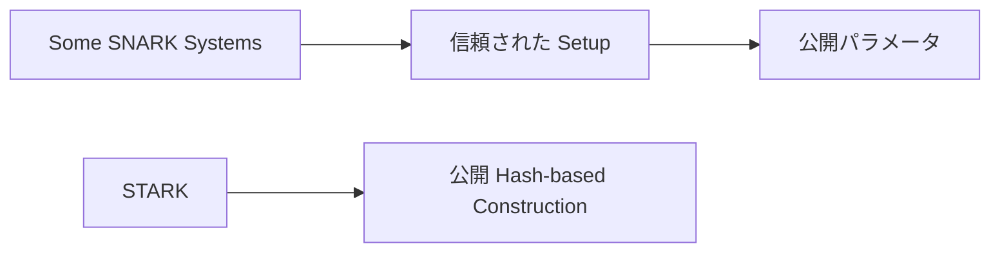

長期間利用する公共的なプロトコルでは、

> **「初期設定時の秘密が安全に破棄されたことを信頼する」必要がない**

ことは重要な設計上の利点となる。

なお、SNARKにも信頼された Setupを必要としない方式が存在するため、これはSNARK一般との絶対的な差ではない。

---

## 9.26 耐量子性

STARKは、楕円曲線ペアリングではなく主に暗号学的ハッシュ関数に安全性を依存する構成を取れる。

そのため、大規模量子計算機を想定した場合にも有力な証明方式と考えられる。

ただし、

> **STARKを採用すればシステム全体が自動的に耐量子化されるわけではない。**

ブロックチェーンの署名方式、ウォレット、TLS、鍵管理などが量子攻撃に弱ければ、別途移行が必要である。

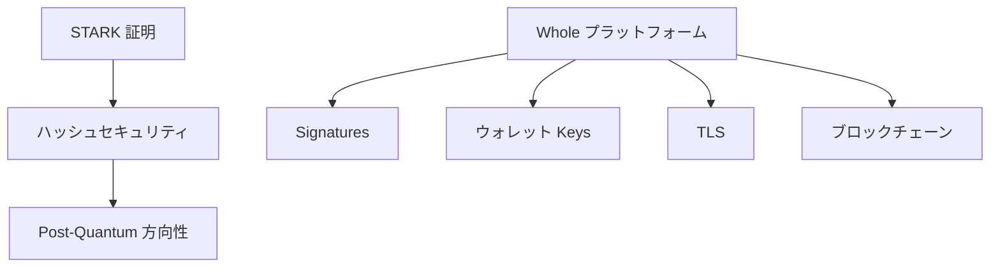

---

## 9.27 STARK のトレードオフ

STARKには利点だけでなく課題もある。

一般に、

- 証明サイズが大きくなりやすい
- 証明者計算量が大きい
- 実装が複雑
- 証明生成インフラが必要
- オンチェーン検証コストは対象チェーンに依存する

といった点を考慮する必要がある。

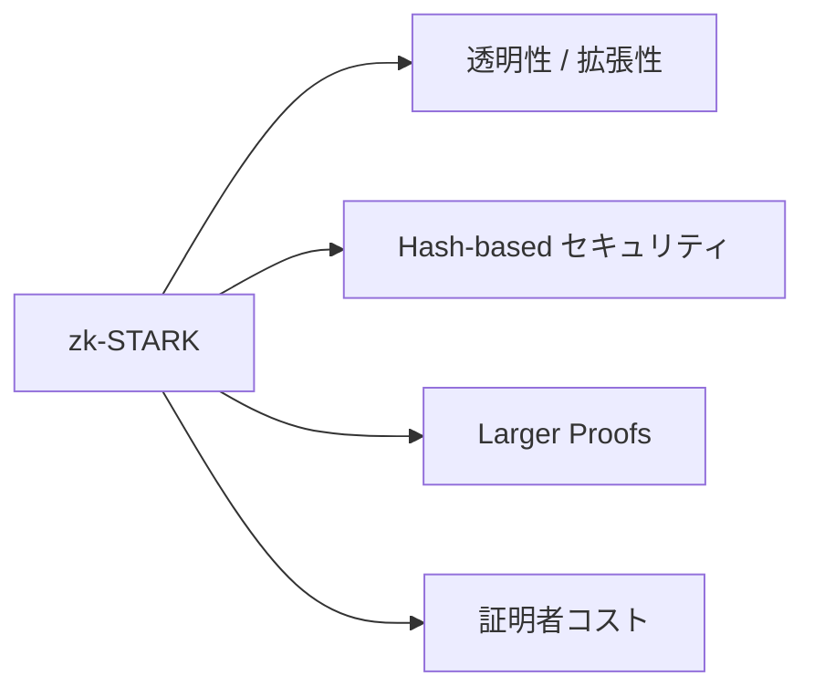

したがって「STARKだから採用」ではなく、SNARK等と実測比較した上で選択する。

---

## 9.28 SNARK と STARK の使い分け

Creator First Platform は証明方式をホワイトペーパー段階で固定しない。

概念的には、

| 観点 | zk-SNARK | zk-STARK |
| --- | --- | --- |
| 証明サイズ | 小さい方式が多い | 比較的大きい |
| 検証 | 非常に効率的な方式がある | 効率的 |
| 信頼された Setup | 方式による | 原則不要 |
| 証明者 | 方式による | 大規模計算向けだが重い |
| 主な暗号要素 | 楕円曲線等を使う方式が多い | ハッシュ中心 |
| 耐量子性 | 方式依存 | 有力 |
| 適用 | オンチェーン検証等 | 大規模計算・透明性 |

といった比較ができる。

最終的には、

- 証明生成時間
- 証明サイズ
- 検証ガス
- 開発成熟度
- 監査可能性
- ライブラリの安全性
- 対象チェーン

で評価する。

---

## 9.29 利用実績証明の構造

Creator First Platform で想定する利用実績証明を概念化すると、

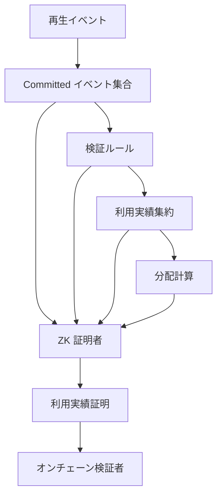

となる。

証明対象は段階的に拡張できる。

---

## 9.30 公開入力と秘密入力

利用実績証明の設計では、何を公開し、何を秘密にするかが重要である。

### 公開入力の例

- 集計期間
- 利用実績 Dataset コミットメント
- 集計結果ルート
- 分配ルート
- プロトコル版
- ルールハッシュ

### 秘密入力の例

- 個々の再生イベント
- 仮名化されたユーザ情報
- 中間集計データ
- 不正判定に必要な非公開情報

```mermaid
flowchart LR
    PUBLIC[公開 Inputs]
    PRIVATE[非公開 Witness]
    CIRCUIT[証明プログラム]
    PROOF[証明]

    PUBLIC --> CIRCUIT
    PRIVATE --> CIRCUIT
    CIRCUIT --> PROOF
```

---

## 9.31 ルールハッシュ

どのルールで計算された証明なのかを明確にする。

プロトコル仕様または証明プログラムに対して、

$$
h_{\mathrm{rule}} = H(\mathrm{RuleVersion})
$$

のような識別値を持たせる。

```mermaid
flowchart LR
    GOV[ガバナンス]
    SPEC[承認済み仕様]
    CODE[証明プログラム]
    HASH[ルールハッシュ]
    PROOF[利用実績証明]

    GOV --> SPEC --> CODE --> HASH
    HASH --> PROOF
```

これにより、古いルールで生成された証明を新しいルールの結果として扱うことを防ぐ。

---

## 9.32 分配ルート

作品・権利者ごとの分配額を大量にオンチェーン保存する代わりに、分配表をMerkle Treeへまとめることができる。

```mermaid
flowchart TD
    D1[音楽クリエーターA : Amount]
    D2[音楽クリエーターB : Amount]
    D3[音楽クリエーターC : Amount]

    D1 --> TREE[分配 Merkle Tree]
    D2 --> TREE
    D3 --> TREE

    TREE --> ROOT[分配ルート]
    ROOT --> CONTRACT[スマートコントラクト]
```

各権利者は自分の分配額とMerkle 証明を提示して主張する方式を検討できる。

---

## 9.33 スマートコントラクトレイヤー

スマートコントラクトは、

- 分配ルール
- プール管理
- 権利分割
- ガバナンス実行
- 資金庫
- 主張

などをモジュール化する。

```mermaid
flowchart TD
    TREASURY[資金庫]
    DIST[分配]
    RIGHTS[権利登録台帳]
    GOV[ガバナンス]
    VERIFY[証明検証者]

    GOV --> TREASURY
    GOV --> DIST
    GOV --> RIGHTS

    VERIFY --> DIST
    RIGHTS --> DIST
    TREASURY --> DIST
```

巨大な一枚のコントラクトへ全機能を集約しない。

---

## 9.34 アップグレード可能性

サービス初期からコードを完全に不変にすると、バグ修正や法制度変更への対応が困難になる。

一方、運営会社が管理者鍵一本で自由にアップグレードできるなら、コードガバナンスの意味がなくなる。

```mermaid
flowchart LR
    PROPOSAL[ガバナンス提案]
    APPROVE[両院承認]
    REVIEW[法務 / セキュリティレビュー]
    TIME[タイムロック]
    UPGRADE[コントラクトアップグレード]

    PROPOSAL --> APPROVE --> REVIEW --> TIME --> UPGRADE
```

アップグレード権限自体をガバナンスの対象とする。

---

## 9.35 緊急停止

重大な脆弱性が発見された場合には限定的な停止機能が必要になる可能性がある。

ただし、

- 誰が実行できるか
- 何を停止できるか
- 何日間有効か
- 資金移動権限を持つか
- 事後レビュー

を明確にする。

緊急鍵を「何でもできる管理者鍵」にしない。

---

## 9.36 ステーブルコイン精算

ユーザのサブスクリプション支払いと音楽クリエーターへの分配には、価格変動の大きいETH等ではなく、JPYC等の承認済み法定通貨連動型ステーブルコインを使用する。

日本国内では、法令・事業者要件を満たすステーブルコインや決済経路を選択する。

```mermaid
flowchart LR
    USER[Subscriber ウォレット]
    INTENT[決済意思]
    STABLE[承認済み JPYC等]
    FINAL[確定済み精算]
    TREASURY[資金庫 / 会計]
    CREATOR[音楽クリエーター]

    USER --> INTENT
    STABLE --> INTENT --> FINAL --> TREASURY --> CREATOR
```

支払資産はチェーン、コントラクトアドレス、発行者、プロダクト、Decimals、利用目的および有効期間を登録台帳で固定する。テストネットでは金銭的価値を持たない`MockJPYC`を使用し、実在JPYCとの交換可能性や償還請求権を表示しない。

---

## 9.37 ブロックチェーン抽象化

ユーザに、

- ネットワーク
- ガス
- Nonce
- ブリッジ
- RPC

などを意識させない。

特にサブスクリプション決済とSBT発行では、リレイヤー、ペイマスターまたはスマートアカウントがガスをスポンサーできる。ネイティブトークンはネットワーク手数料にだけ使用し、サブスクリプション価格、初期サポーター資格または音楽クリエーター分配額へ算入しない。

```mermaid
flowchart LR
    USER[ユーザ]
    APP[音楽アプリ]
    ABSTRACTION[ブロックチェーン抽象化]
    CHAIN[ブロックチェーン]

    USER --> APP --> ABSTRACTION --> CHAIN
```

ブロックチェーンはUXではなく、検証・決済・ガバナンスを支える基盤として利用する。

---

## 9.38 チェーン選定

対象チェーンは、

- セキュリティ
- 分散性
- ガスコスト
- ZK 検証コスト
- ステーブルコインエコシステム
- 開発環境
- 長期的継続性
- 法的・事業上の利用可能性

で評価する。

Ethereum L1だけでなくL2の利用も有力である。

```mermaid
flowchart TD
    PROTOCOL[音楽クリエーター中心プロトコル]
    PROTOCOL --> L2[Ethereum L2]
    L2 --> L1[Ethereum 精算]
```

ホワイトペーパー段階では特定L2へ永久固定しない。

---

## 9.39 オフチェーンとオンチェーンの境界

### オフチェーン

- 音楽配信
- 検索
- 推薦
- 再生イベント
- AI
- 不正検出
- 大規模集計
- ZK 証明生成

### オンチェーン

- 証明検証
- 分配ルート
- 資金庫ルール
- ガバナンス実行
- プロトコル版
- 必要な権利状態コミットメント

```mermaid
flowchart LR
    OFF[オフチェーン]
    BRIDGE[Cryptographic 証明 / コミットメント]
    ON[オンチェーン]

    OFF --> BRIDGE --> ON
```

この境界を明確にすることが、コストと検証可能性の両立に重要である。

---

## 9.40 クラウド基盤

初期段階では、運用成熟度の高いクラウドサービスを利用する。

主な構成は、

```mermaid
flowchart TD
    CDN[CDN]
    API[API ゲートウェイ / 負荷分散器]
    APP[アプリケーションサービス]
    DB[データベース]
    OBJ[オブジェクトストレージ]
    QUEUE[イベント一覧]
    ANALYTICS[分析 / 利用実績]
    PROVER[ZK 証明者 Cluster]

    CDN --> API --> APP
    APP --> DB
    APP --> OBJ
    APP --> QUEUE
    QUEUE --> ANALYTICS
    ANALYTICS --> PROVER
```

となる。

規模の拡大に応じて、証明生成基盤を独立してスケールできるようにする。

### 9.40.1 ストリーミングゲートウェイとNavidrome アダプター

最初のストリーミング最小縦断実装では、音楽クリエーター中心 APIの一部としてストリーミング認可ゲートウェイを配置し、Navidromeを非公開メディアアダプターとして接続する。

```mermaid
flowchart LR
    CLIENT[プレーヤー]
    GATEWAY[ストリーミング認可ゲートウェイ]
    CACHE[Redis ポリシーキャッシュ]
    INDEXER[ブロックチェーンインデクサー]
    NAVI[Navidrome アダプター]
    EVENT[再生イベント一覧]

    CLIENT --> GATEWAY
    GATEWAY --> CACHE
    INDEXER --> CACHE
    GATEWAY --> NAVI
    GATEWAY --> EVENT
```

ゲートウェイはTypeScript / Node.js等で実装できるが、言語とFrameworkはADR採択後の実装決定とする。プロトコル上必要なのは特定Frameworkではなく、次のInterfaceと不変条件である。

- 公開楽曲 IDとNavidrome メディア IDを分離する
- 再生セッションをアカウント、楽曲、計画、権利版およびExpiryへ結付けする
- 範囲対応をバッファせずBackpressure付きで転送する
- クライアント Disconnect時にUpstreamを中断する
- Navidrome固有のCookie、Passwordおよび認可を外部へ出さない
- サブスクリプションまたは権利判定不能時の新規再生をFail Closedとする
- 再生ごとの同期ブロックチェーン RPCを避ける
- Navidrome 再生回数だけを有効利用実績にしない

ブロックチェーンインデクサーは確認済みイベントからサブスクリプション / 権利参照モデルを構築する。参照モデルはchain ID、block number、block hash、transaction hashおよびlog indexを保持し、チェーン Reorganizationへ対応する。

ゲートウェイの公開APIは専用のカタログ API、再生セッション APIおよびストリーム APIに限定し、任意のNavidrome Pathを中継する汎用プロキシにはしない。

[ADR-0009](/adr/ADR-0009-navidrome-streaming-gateway)はこの構成を`Proposed`として記録し、負荷、障害、セキュリティおよびOSS License検証をAcceptedへのゲートとする。

---

## 9.41 証明者インフラ

ZK証明生成は通常のウェブ APIとは異なる計算特性を持つ。

そこで、

```mermaid
flowchart LR
    EVENTS[集約イベント]
    JOB[証明 Job]
    QUEUE[証明者一覧]
    WORKER[証明者 Workers]
    PROOF[証明]
    STORE[証明保存]

    EVENTS --> JOB --> QUEUE --> WORKER --> PROOF --> STORE
```

のように非同期ジョブとして扱う。

将来的にはCPU/GPU等の実測値をもとに最適化する。

---

## 9.42 データベース

一つのデータベースですべてを管理するのではなく、用途に応じて分離する。

- Transactional DB
- 検索索引
- イベント保存
- 分析保存
- オブジェクトストレージ
- ブロックチェーン状態

などである。

```mermaid
flowchart TD
    API[アプリケーション]
    API --> TX[Transactional DB]
    API --> SEARCH[検索]
    API --> OBJ[オブジェクトストレージ]

    EVENTS[利用実績イベント] --> EVENT[イベント保存]
    EVENT --> ANALYTICS[分析]
    ANALYTICS --> PROOF[証明システム]
```

---

## 9.43 プライバシー

再生履歴はユーザの嗜好や生活パターンを推測し得る情報である。

したがって、

> **ブロックチェーンの透明性をユーザデータへ直接適用しない。**

```mermaid
flowchart LR
    USER[ユーザ活動]
    PRIVATE[非公開データレイヤー]
    AGG[集約]
    ZK[ゼロ知識証明]
    PUBLIC[公開検証]

    USER --> PRIVATE --> AGG --> ZK --> PUBLIC
```

公開するのは必要な集計結果、コミットメント、証明を中心とする。

---

## 9.44 鍵管理

スマートコントラクトを利用する場合、秘密鍵管理は重大なセキュリティ要件となる。

- 資金庫鍵
- デプロイ鍵
- 緊急権限
- ガバナンス実行者
- オラクル Signer

などを分離する。

```mermaid
flowchart TD
    KEYS[鍵管理]
    KEYS --> HSM[HSM / 安全な Signing]
    KEYS --> MULTI[マルチシグ]
    KEYS --> GOV[ガバナンス]
    KEYS --> ROTATE[ローテーション]
```

単一の開発者PCの秘密鍵で本番資金を管理しない。

---

## 9.45 セキュリティ境界

```mermaid
flowchart TD
    CLIENT[クライアント]
    EDGE[エッジ / CDN]
    API[API]
    DATA[データ]
    PROVER[ZK 証明者]
    CHAIN[ブロックチェーン]

    CLIENT --> EDGE --> API --> DATA
    DATA --> PROVER --> CHAIN
```

各境界で、

- 認証
- 認可
- 暗号化
- 率制限
- 監査 Log
- 完全性検査

を設ける。

詳細は第10章「セキュリティ」で扱う。

---

## 9.46 オープンソース

プロトコルの信頼性に直接関係するコードは、可能な範囲でオープンソース化する。

特に、

- スマートコントラクトs
- 証明プログラム
- 検証者
- ガバナンス Logic
- 分配 Logic

は公開を基本とする。

```mermaid
flowchart LR
    SPEC[仕様]
    CODE[オープンソースコード]
    TEST[テスト]
    AUDIT[監査]
    DEPLOY[デプロイ]

    SPEC --> CODE --> TEST --> AUDIT --> DEPLOY
```

サービス運用の全内部コードを公開することとは区別する。

---

## 9.47 再現可能ビルド

ガバナンスで承認されたソースコードと実際にデプロイされたバイトコードが一致することを確認できる仕組みを目指す。

```mermaid
flowchart LR
    SOURCE[承認済みソース]
    BUILD[再現可能ビルド]
    BYTE[Bytecode]
    DEPLOY[Deployed コントラクト]

    SOURCE --> BUILD --> BYTE --> DEPLOY
```

これにより、

> 「投票されたコードと別のコードがデプロイされた」

という問題を検証できる。

---

## 9.48 プロトコル版

分配、証明、権利、ガバナンスなどの仕様には版を持たせる。

例えば、

```text
プロトコル: CFP
版: 1.0
利用実績証明: 1
分配: 1
権利 Schema: 1
```

のように、どのルールで処理されたデータかを追跡できるようにする。

---

## 9.49 技術とガバナンス

技術仕様のすべてを投票で決めるわけではない。

```mermaid
flowchart TD
    GOV[ガバナンス]
    ARCH[プロトコルアーキテクチャ]
    DEV[エンジニアリング]
    IMPLEMENT[実装]

    GOV --> RULES[プロトコルルール]
    RULES --> ARCH
    ARCH --> DEV --> IMPLEMENT
```

例えばデータベースのインデックス方式まで二院制投票する必要はない。

一方、

- 分配式
- 証明で保証する性質
- アップグレード権限
- 資金庫権限
- プライバシー原則

などはガバナンス対象となり得る。

---

## 9.50 段階的導入

最初からSTARKベースの完全な利用実績オラクルを構築する必要はない。

```mermaid
flowchart LR
    P1[フェーズ 1<br/>監査可能オフチェーン]
    P2[フェーズ 2<br/>Commitments]
    P3[フェーズ 3<br/>ZK 利用実績証明]
    P4[フェーズ 4<br/>拡張可能 STARK インフラ]

    P1 --> P2 --> P3 --> P4
```

### フェーズ 1

通常のクラウド基盤で利用実績を集計し、監査ログと透明な分配レポートを提供する。

### フェーズ 2

利用実績 Datasetや分配表へMerkle コミットメントを導入する。

### フェーズ 3

重要な集計・分配計算へZK 証明を導入する。

### フェーズ 4

大規模な利用実績をSTARK等で証明し、世界規模へ拡張する。

---

## 9.51 技術選択を固定しない理由

ZK技術は急速に進化している。

現在最適な、

- 証明システム
- ブロックチェーン
- L2
- データ可用性
- 証明者 Hardware

が数年後にも最適とは限らない。

したがってホワイトペーパーでは、

> **特定製品ではなく、検証可能性・プライバシー・透明性という技術要件を固定する。**

```mermaid
flowchart LR
    PRINCIPLE[Stable 原則]
    TECH[Replaceable Technology]

    PRINCIPLE --> ZK[ZK システム]
    PRINCIPLE --> CHAIN[ブロックチェーン]
    PRINCIPLE --> CLOUD[インフラ]

    ZK --> TECH
    CHAIN --> TECH
    CLOUD --> TECH
```

---

## 9.52 技術ロードマップ

```mermaid
flowchart LR
    MVP[MVP]
    AUDIT[監査可能プラットフォーム]
    COMMIT[コミットメントレイヤー]
    ZK[ZK 証明]
    SCALE[国際規模拡大]

    MVP --> AUDIT --> COMMIT --> ZK --> SCALE
```

MVPでは音楽サービスとしての成立を優先する。

その後、透明性と検証可能性を段階的に暗号学的保証へ置き換える。

---

## 9.53 本章のまとめ

Creator First Platform の技術的な中心思想は、

> **信頼 the company**

から、

> **検証 the protocol**

へ徐々に移行することである。

```mermaid
flowchart TD
    MUSIC[音楽サービス]
    OFF[拡張可能オフチェーン Systems]
    ZK[ゼロ知識 Proofs]
    SC[スマートコントラクトs]
    GOV[ガバナンス]
    CORP[法人責任]

    MUSIC --> OFF
    OFF --> ZK
    ZK --> SC
    GOV --> SC
    CORP --> MUSIC
```

ただし、これは会社を不要にすることを意味しない。

株式会社は、

- 権利契約
- 法令遵守
- 会計
- 運営
- セキュリティ
- ユーザ対応

について現実社会で責任を負う。

一方、スマートコントラクトとZK 証明は、

> **会社が定められたルール通りに重要な処理を行ったことを、会社自身を信頼するだけでなく第三者が検証できる状態**

を作る。

特に zk-STARK は、大量の利用イベントを扱う Creator First Platform において、

> **大量計算をオフチェーンで実行し、個々の利用履歴を公開せず、その計算が正しかったことだけを検証する**

ための有力な技術候補である。

Creator First Platform が目指すのは「ブロックチェーン音楽サービス」ではない。

> **音楽サービスとして使いやすく、その背後にある権利・分配・コード統治だけが必要な範囲で暗号学的に検証可能なプラットフォーム**

である。
