# 10. セキュリティ

## 10.1 本章の目的

Creator First Platform は、音楽配信サービス、権利管理、収益分配、スマートコントラクト、ガバナンスを一つのシステムとして接続する。

そのためセキュリティ上の対象は、単なるウェブサービスより広い。

保護すべきものには、

- 音源と未公開コンテンツ
- ユーザアカウント
- 再生履歴とプライバシー
- 音楽クリエーターの本人・権利情報
- 売上と分配資金
- スマートコントラクト
- 利用実績オラクル
- ZK 証明生成基盤
- ガバナンス
- 法人内部の管理システム

が含まれる。

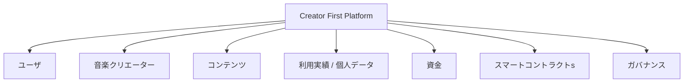

本プラットフォームの基本原則は、

> **「ブロックチェーンを使っているから安全」ではなく、各レイヤーの信頼境界を明確にし、侵害されることを前提に被害を限定する**

ことである。

---

## 10.2 セキュリティの基本原則

### ゼロトラスト

ネットワーク内部だから安全とはみなさない。

### 最小権限

必要最小限の権限だけを付与する。

### 多層防御

一つの防御機構が破られても、直ちに全システムが侵害されないようにする。

### 職務分離

開発、資金管理、デプロイ、法務、ガバナンスなどの権限を分離する。

### プライバシー・バイ・デザイン

個人データを「集めてから守る」のではなく、不要なデータを最初から集めない。

### 検証可能性

重要な状態変更や分配計算を監査・検証可能にする。

### 復旧可能性

侵害を完全に防ぐことだけでなく、検知、停止、復旧を設計する。

---

## 10.3 脅威モデル

Creator First Platform では、攻撃者を単一の種類として扱わない。

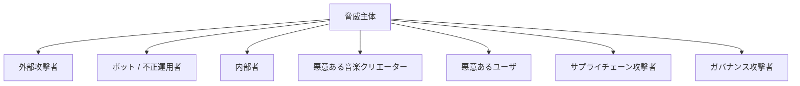

想定する攻撃には、

- アカウント乗っ取り
- 音源の不正取得
- API攻撃
- DDoS
- ボットによる再生水増し
- 権利者なりすまし
- 分配先アドレスの改ざん
- 秘密鍵窃取
- スマートコントラクト脆弱性
- オラクル改ざん
- ZK 証明者侵害
- ガバナンス乗っ取り
- 依存ライブラリへのサプライチェーン攻撃

などがある。

---

## 10.4 信頼境界

システムを複数の信頼境界へ分割する。

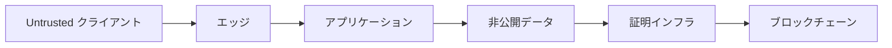

特に、

> **クライアントから送られてくる情報を、そのまま事実として信頼しない**

ことが重要である。

音楽プレーヤーが「10分再生した」と送信しただけでは、そのイベントを有効利用として扱わない。

---

## 10.5 アイデンティティと認証

ユーザ、音楽クリエーター、運営者では必要な本人確認レベルが異なる。

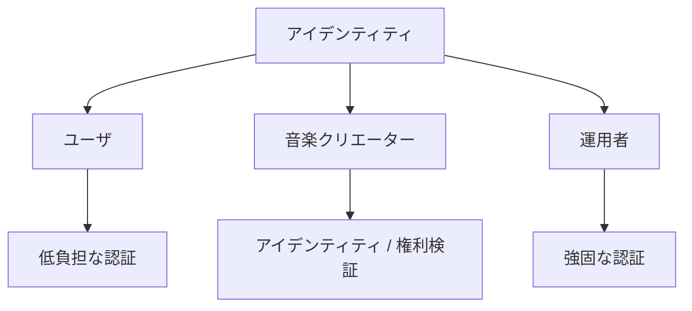

通常ユーザには過剰な本人確認を要求しない。

一方、

- 音楽クリエーター登録
- 分配先変更
- 運営管理
- 資金庫操作

などはより強い認証を要求する。

---

## 10.6 アカウントセキュリティ

アカウント保護には、

- Passkey
- MFA
- セッション管理
- 異常ログイン検出
- 率制限
- 資格証明 Stuffing対策

などを利用する。

特に管理者アカウントでは、パスワードだけの認証を原則として避ける。

---

## 10.7 音楽クリエーター本人性

音楽クリエーターへの分配が発生する以上、

> **「誰が作品をアップロードしたか」だけでなく、「その人物・組織が分配を受ける権限を持つか」**

を確認する必要がある。

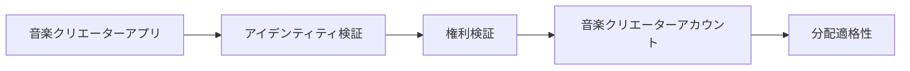

本人確認と著作権確認は別の問題である。

本人であることが確認できても、その人物が対象楽曲の全権利を持つとは限らない。

---

## 10.8 権利者なりすまし

攻撃者が他人の楽曲を登録し、分配先を自分に設定する攻撃を想定する。

対策として、

- 権利情報確認
- 既存識別子との照合
- 重複コンテンツ検出
- 異議申立て
- 分配保留
- 変更履歴

などを組み合わせる。

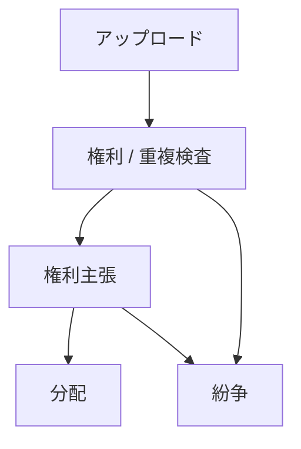

---

## 10.9 分配先アドレスの保護

分配先アドレス変更は非常に高リスクな操作である。

アカウントを一時的に乗っ取られただけで、次回分配先を攻撃者へ変更できてはならない。

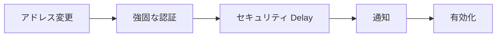

一定額以上の分配先変更では追加確認を要求することも検討する。

---

## 10.10 音源の保護

音楽ストリーミングでは、ユーザ端末で最終的に音声を再生する以上、完全なコピー防止は不可能である。

したがって、

> **「絶対にコピーできない」ことではなく、大規模・自動化された不正取得を困難にする**

ことを目標とする。

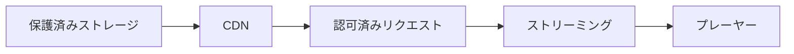

署名付きURL、短い有効期限、アクセス制御、率制限等を利用する。

---

## 10.11 未公開音源

リリース前の音源は特に機密性が高い。

公開コンテンツと同じアクセス権で管理しない。

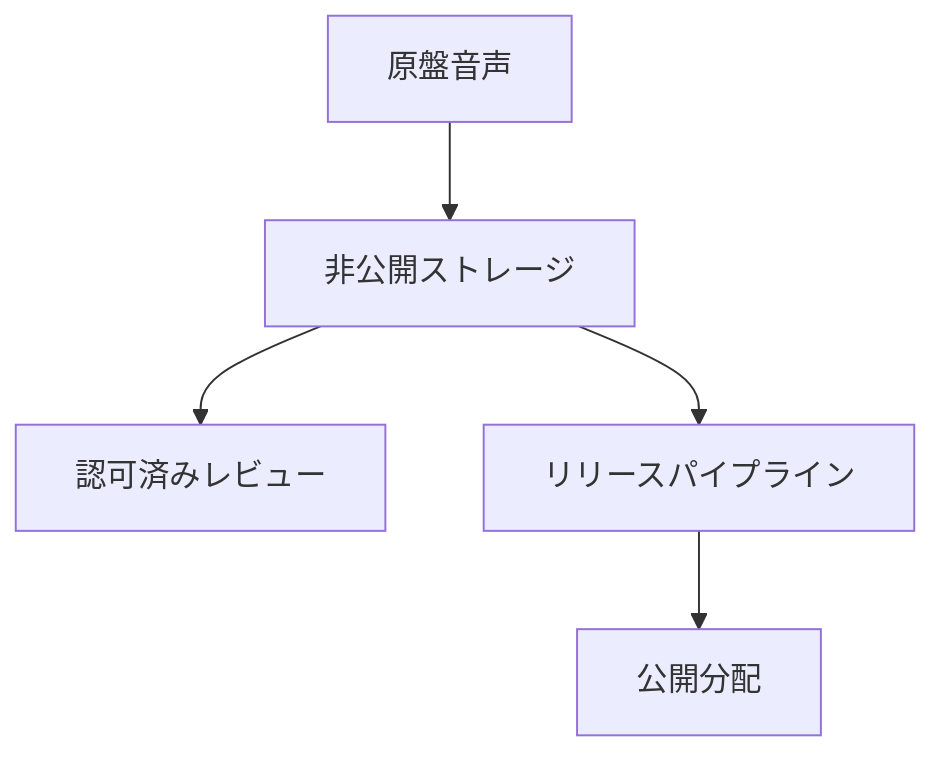

---

## 10.12 DRM の位置付け

DRMを採用する場合でも、それをシステム全体の安全性の中心に置かない。

DRMは、

- ライセンス制御
- オフライン再生
- 大規模コピーの抑制

には利用できるが、権利侵害を完全に防止する技術ではない。

ユーザ体験、対応端末、運用コストとのバランスで判断する。

---

## 10.13 API セキュリティ

APIでは、

- 認証
- 認可
- 入力検証
- 率 Limiting
- Replay Protection
- 監査 Logging

を基本とする。

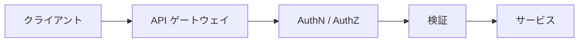

内部APIも「内部だから認証不要」としない。

### 10.13.1 ストリーミングゲートウェイの信頼境界

交換可能なメディア配信基盤は公開インターネットへ直接公開せず、エッジ、ストリーミング認可ゲートウェイ、メディア配信基盤を異なる信頼境界へ配置する。

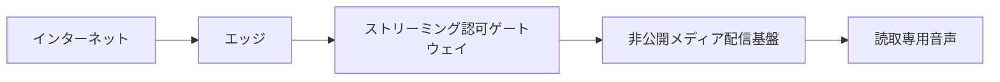

ゲートウェイは配信基盤向けの内部アイデンティティや認証情報をクライアント入力から引き継がず、認証済みプラットフォームアカウントと認可済み再生セッションから生成する。

最低限、次をセキュリティ不変条件とする。

- 公開ネットワークから内部配信インターフェースへ到達できない
- ゲートウェイ以外を配信基盤の信頼された呼出元にしない
- 内部アイデンティティまたは認証情報をクライアントが指定できない
- 公開を意図しない配信・管理機能を露出しない
- 任意の接続先または内部経路を中継できる汎用プロキシにしない
- 接続先を許可済み設定へ固定し、サーバーサイドリクエストフォージェリを防止する
- 範囲、応答サイズ、タイムアウト、同時ストリームおよび変換処理を制限する
- 内部認証情報とエラー詳細をクライアントへ漏らさない
- 再生URLを取消し可能な短命セッションへ結び付ける

外部認証のHeader 信頼とネットワーク Isolationは別々の防御ではなく、同時に成立させる一つの制御として検証する。

再生証跡についても、クライアントの生存通知、ゲートウェイのデータ配信およびメディア配信基盤の応答のいずれか一つを単独で金銭分配の根拠にしない。複数証拠の整合、重複排除、不正判定および権利版確認を経て有効利用実績とする。

詳細は[ADR-0009](/adr/ADR-0009-navidrome-streaming-gateway)に記録する。

---

## 10.14 DDoS と可用性

音楽配信サービスでは、攻撃だけでなくイベントや話題化による急激なアクセス増加も想定する。

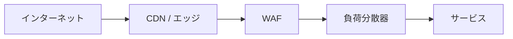

CDN、WAF、Auto Scaling、率制限等を利用し、アプリケーション本体へ直接トラフィックを集中させない。

---

## 10.15 再生イベントの不正

経済モデルが再生実績と接続されるため、再生不正は重大な脅威となる。

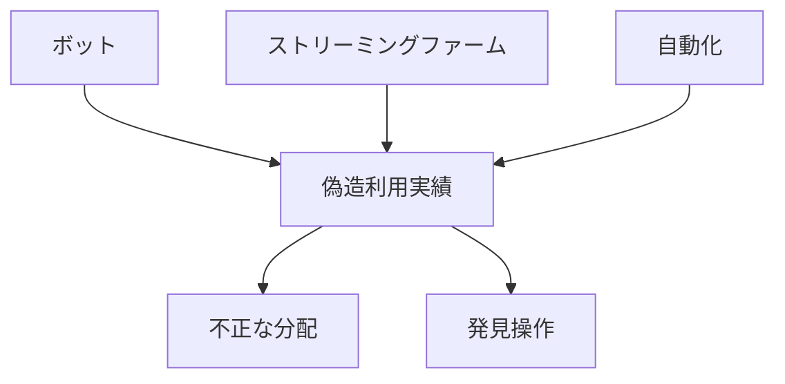

不正再生は単なる分析データの誤差ではなく、

> **資金の不正取得**

につながる可能性がある。

---

## 10.16 不正再生検知

単一の指標だけで不正判定しない。

例えば、

- 異常な再生頻度
- 不自然な時間分布
- 同一端末・ネットワーク
- アカウント生成パターン
- 曲間遷移
- 再生完了率
- 複数アカウント間の相関

などを組み合わせる。

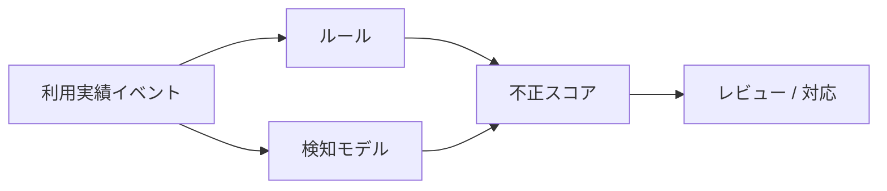

---

## 10.17 AI不正検出の限界

AIモデルが「不正」と判定しただけで、自動的に音楽クリエーターの資金を永久没収する設計にはしない。

重大な措置では、

- 根拠
- 再検証
- 人によるレビュー
- 異議申立て

を設ける。

AIは意思決定支援として利用し、法的・経済的な重大処分を完全自動化しない。

---

## 10.18 利用実績オラクルセキュリティ

利用実績オラクルが侵害されると、正しいスマートコントラクトでも誤ったデータに基づいて資金を分配する。

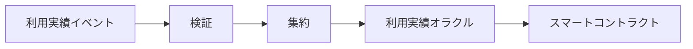

したがってオラクルを一つの秘密鍵と一つのサーバーに依存させない。

---

## 10.19 コミットメントと監査

利用イベント集合をMerkle Tree等へコミットすることで、後から集計対象を都合よく差し替えることを困難にする。

$$
R_t = \operatorname{MerkleRoot}(E_t)
$$

ここで、

- $E_t$：期間 $t$ の対象イベント集合
- $R_t$：そのコミットメント

である。

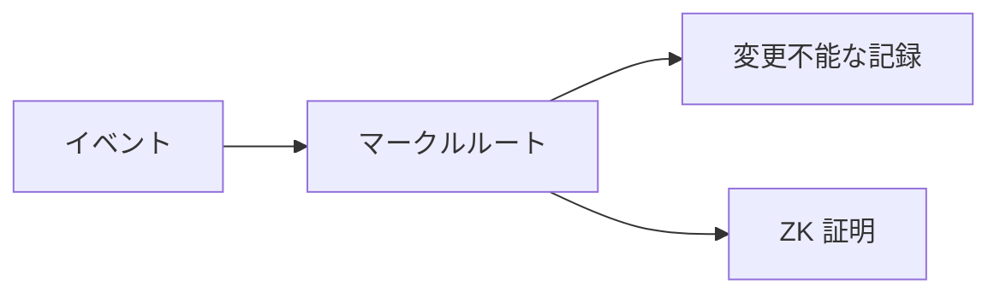

---

## 10.20 ZK 証明とセキュリティ

ZK 証明は、

> **証明された計算が定義された制約を満たす**

ことを保証する。

しかし、

- 元データが現実の再生を表しているか
- 端末が侵害されていないか
- 不正判定ルールが適切か

までは自動的に保証しない。

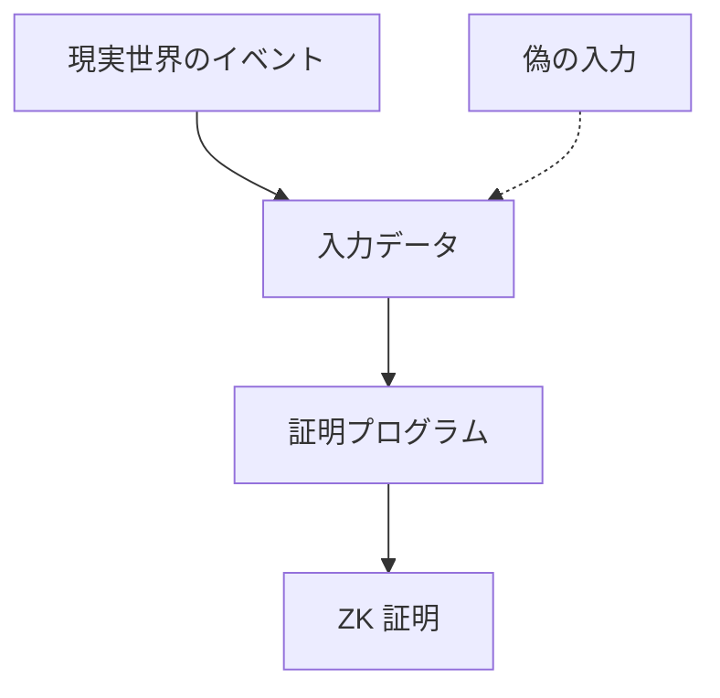

このため、ZKはオラクルセキュリティを置き換えるものではなく、その一部を強化する技術として扱う。

---

## 10.21 透明型ゼロ知識証明のセキュリティ

透明型ゼロ知識証明を利用する場合、主に次を保護する必要がある。

- 証明プログラム
- 回路・実行制約
- 公開入力
- Witness生成
- 証明者インフラ
- 検証者コントラクト
- プロトコル版

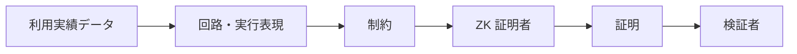

特に、採用方式の回路または実行制約が意図した仕様を正しく表現していることが重要である。透明性はセットアップ時の秘密への依存を減らすが、証明プログラム、暗号仮定、実装および運用の安全性までは自動的に保証しない。

---

## 10.22 証明プログラムバグ

ZKシステムが暗号学的に安全でも、証明するプログラム自体にバグがあれば、誤った計算を「正しく証明」する可能性がある。

例えば、本来、

$$
v_t \in \{0,1\}
$$

であるべき値に制約がなく、

$$
S_{t+1}=S_t+v_t
$$

だけを証明している場合、不正な値を加算できる可能性がある。

したがって、

> **ZK セキュリティ = Cryptography + Correct 制約 + Correct 実装**

である。

---

## 10.23 証明プログラムの監査

証明プログラムはスマートコントラクトと同様に重要なコードとして扱う。

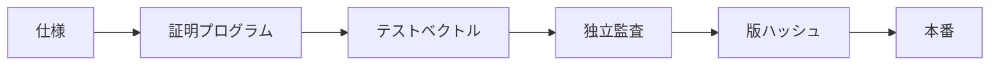

ガバナンスで承認された仕様と証明プログラムの対応を確認可能にする。

---

## 10.24 証明者の侵害

証明者サーバーが侵害された場合でも、無効な証明を検証者が受理しないことがZKの重要な利点である。

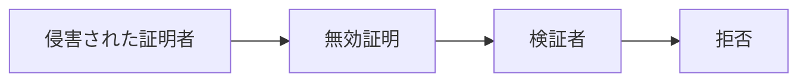

ただし、証明者が秘密データを扱う場合には機密性侵害のリスクが残る。

証明者を「信頼不要」ではなく、

> **計算結果の正しさについては信頼を減らせるが、秘密データ保護については依然として防御が必要**

と位置付ける。

---

## 10.25 スマートコントラクトセキュリティ

スマートコントラクトは一度デプロイすると、通常のウェブアプリより修正が困難である。

主な対策は、

- 小さなモジュール
- 明確な権限
- テスト
- Static Analysis
- Fuzzing
- 不変条件 Testing
- 外部監査
- タイムロック

である。

```mermaid
flowchart LR
    SPEC[仕様]
    CODE[コントラクト]
    TEST[テスト]
    FUZZ[ファズ / 不変条件]
    AUDIT[監査]
    TIME[タイムロック]
    DEPLOY[デプロイ]

    SPEC --> CODE --> TEST --> FUZZ --> AUDIT --> TIME --> DEPLOY
```

---

## 10.26 スマートコントラクト不変条件

重要な性質を不変条件として定義する。

例えば、ある分配期間で、

$$
\sum_i D_i \leq R_d
$$

すなわち、分配総額が利用可能額を超えないこと。

権利分割については、

$$
\sum_k s_{i,k}=1
$$

を満たすこと。

これらをテストだけでなく、可能な範囲で不変条件 Testingや形式検証へ利用する。

---

## 10.27 再入と外部呼び出し

資金を扱うコントラクトでは、再入等の典型的な脆弱性を考慮する。

基本的には、

- Checks-Effects-Interactions
- Pull 決済
- 再入 Guard
- 外部呼び出し最小化

などを利用する。

分配では、一度に全権利者へPush送金するより、主張方式が安全性・ガスの面で有利な場合がある。

---

## 10.28 アップグレードセキュリティ

Upgradeable コントラクトを利用する場合、アップグレード権限は極めて高い権限になる。

```mermaid
flowchart LR
    GOV[ガバナンス]
    EXEC[実行者]
    TIME[タイムロック]
    PROXY[プロキシ]
    IMPL[新規実装]

    GOV --> EXEC --> TIME --> PROXY --> IMPL
```

単一EOAが即時に実装を変更できる構造は避ける。

---

## 10.29 タイムロック

重要な変更にはタイムロックを設ける。

```mermaid
flowchart LR
    APPROVE[承認済み変更]
    TIME[タイムロック]
    OBSERVE[公開レビュー]
    EXEC[実行]

    APPROVE --> TIME --> OBSERVE --> EXEC
```

これにより、ユーザ、音楽クリエーター、監査者が変更内容を確認する時間を確保する。

---

## 10.30 資金庫セキュリティ

資金庫はプラットフォームの最重要資産の一つである。

```mermaid
flowchart TD
    TREASURY[資金庫]
    TREASURY --> MULTI[マルチシグ]
    TREASURY --> LIMIT[送金上限]
    TREASURY --> TIME[タイムロック]
    TREASURY --> MONITOR[監視]
```

一つの秘密鍵で全資金を移動できる設計を避ける。

---

## 10.31 ホット / ウォーム / コールド

資金を用途に応じて分離する。

```mermaid
flowchart LR
    HOT[ホット<br/>日常運用]
    WARM[ウォーム<br/>定期的分配]
    COLD[コールド<br/>予備]

    COLD --> WARM --> HOT
```

日常運用に必要な資金だけを即時アクセス可能な環境へ置く。

---

## 10.32 鍵管理

秘密鍵はソースコード、GitHub、CIログ、開発者PCへ平文保存しない。

- HSM
- クラウド KMS
- Hardware ウォレット
- マルチシグ
- 鍵ローテーション

などを用途に応じて利用する。

```mermaid
flowchart TD
    KEY[重大鍵]
    KEY --> KMS[KMS / HSM]
    KEY --> MULTI[マルチシグ]
    KEY --> ROTATE[ローテーション]
    KEY --> AUDIT[アクセス監査]
```

---

## 10.33 鍵ローテーション

鍵は永久に同じものを利用しない。

侵害が確認されなくても、役割変更や一定期間でローテーションできる設計を持つ。

特にオラクル Signer、CI/CD 資格証明、運営者資格情報は交換可能にする。

---

## 10.34 ガバナンスセキュリティ

二院制ガバナンスそのものも攻撃対象になる。

```mermaid
flowchart TD
    ATTACK[ガバナンス攻撃]
    ATTACK --> SYBIL[シビル]
    ATTACK --> BUY[票の買収]
    ATTACK --> ACCOUNT[アカウント乗っ取り]
    ATTACK --> DELEGATE[代表者掌握]
    ATTACK --> FLASH[一時的経済権力]
```

「オンチェーン投票だから安全」とは限らない。

---

## 10.35 シビル攻撃

ユーザ院議会では、一人が大量のアカウントを作成して投票する攻撃を考慮する。

```mermaid
flowchart LR
    HUMAN[一人の攻撃者]
    HUMAN --> A1[アカウント A]
    HUMAN --> A2[アカウント B]
    HUMAN --> A3[アカウント C]

    A1 --> VOTE[投票]
    A2 --> VOTE
    A3 --> VOTE
```

対策はプライバシーとのバランスを取りながら、

- アカウント継続性
- 利用実績
- 検証可能資格証明
- 評価
- 証明 of 一人性的手法

などを検討する。

---

## 10.36 音楽クリエータ院議会の乗っ取り

音楽クリエータ院議会でも、偽音楽クリエーター登録や一組織による多数アカウント取得を防ぐ必要がある。

音楽クリエーター適格性を、

- 本人確認
- 権利確認
- 活動実績
- 重複主体検出

などと接続する。

---

## 10.37 委任リスク

委任投票では、少数の有力代表者へ権力が集中する可能性がある。

```mermaid
flowchart LR
    USERS[多数の投票者]
    D1[代表者 A]
    POWER[集中した権力]

    USERS --> D1 --> POWER
```

委任集中度を可視化し、委任をいつでも撤回できるようにする。

---

## 10.38 ガバナンス提案セキュリティ

提案文と実際に実行されるトランザクションが異なる攻撃を防ぐ。

```mermaid
flowchart LR
    TEXT[人間可読提案]
    SPEC[仕様]
    CALL[実行可能な呼出し]
    HASH[提案ハッシュ]
    VOTE[投票]

    TEXT --> SPEC --> CALL --> HASH --> VOTE
```

投票者が「何を承認すると、どのコード・パラメータが変わるか」を確認できるUIを設計する。

---

## 10.39 緊急ガバナンス

重大な攻撃時には、通常の長い投票手続では間に合わない場合がある。

限定的な緊急権限を設ける場合、

- 停止のみ
- 資金移動不可
- 短い期限
- 複数主体承認
- 事後公開
- 事後ガバナンス審査

などの制約を設ける。

```mermaid
flowchart LR
    INCIDENT[重大インシデント]
    AUTH[緊急権限]
    PAUSE[限定停止]
    FIX[調査・修正]
    GOV[ガバナンスレビュー]
    RESUME[再開]

    INCIDENT --> AUTH --> PAUSE --> FIX --> GOV --> RESUME
```

---

## 10.40 サプライチェーンセキュリティ

現代のソフトウェアでは、自作コードだけでなく依存パッケージが大きな攻撃面になる。

```mermaid
flowchart TD
    APP[アプリケーション]
    APP --> NPM[npm パッケージ]
    APP --> ACTION[GitHub Actions]
    APP --> IMAGE[コンテナイメージ]
    APP --> SDK[ブロックチェーン SDK]
```

対策として、

- Lockfile
- Dependency 更新レビュー
- Vulnerability Scan
- SBOM
- Pinning
- CI権限最小化

などを利用する。

---

## 10.41 GitHub セキュリティ

ソースコード管理では、

- Branch Protection
- プルリクエストレビュー
- CODEOWNERS
- 必要検査
- Secret Scanning
- Dependabot等
- Signed リリース

を検討する。

```mermaid
flowchart LR
    DEV[開発者]
    PR[プルリクエスト]
    REVIEW[レビュー]
    CI[CI / セキュリティ検査]
    MAIN[保護されたmain]
    RELEASE[リリース]

    DEV --> PR --> REVIEW --> CI --> MAIN --> RELEASE
```

プロトコルコードを直接mainへPushして本番デプロイする運用は避ける。

---

## 10.42 CI/CD セキュリティ

CI/CDは本番環境やデプロイ鍵へアクセスするため、高価値な攻撃対象である。

長期秘密鍵をCI環境へ保存するより、

- OIDC
- Short-lived 資格証明
- 環境 Protection
- Approval
- 最小権限

を利用する。

---

## 10.43 再現可能ビルド

スマートコントラクトや証明検証者では、

> **レビューされたソースコードとデプロイされた実体が一致する**

ことを検証可能にする。

```mermaid
flowchart LR
    SOURCE[レビュー済みソース]
    BUILD[決定論的ビルド]
    ARTIFACT[成果物ハッシュ]
    DEPLOY[デプロイ]

    SOURCE --> BUILD --> ARTIFACT --> DEPLOY
```

---

## 10.44 データセキュリティ

保存データは分類する。

### 公開

公開作品情報、公開ガバナンス情報など。

### 内部

内部運用情報。

### 機密

契約、権利者情報、未公開音源など。

### 極秘

秘密鍵、本人確認情報、認証秘密等。

分類ごとにアクセス制御、暗号化、保持期間を設定する。

---

## 10.45 暗号化

データは、

- In Transit
- At Rest

の双方で暗号化する。

```mermaid
flowchart LR
    CLIENT[クライアント]
    TLS[TLS]
    SERVICE[サービス]
    ENC[暗号化ストレージ]

    CLIENT --> TLS --> SERVICE --> ENC
```

ただし「暗号化して保存している」だけでは不十分であり、鍵へのアクセス権限を管理する必要がある。

---

## 10.46 個人データ最小化

再生履歴を利用する場合、

> **技術的に収集できる情報と、収集すべき情報を区別する。**

例えば分配計算に個人の氏名が不要なら、利用実績パイプラインへ氏名を渡さない。

```mermaid
flowchart LR
    USER[ユーザ]
    ID[アイデンティティデータ]
    PSEUDO[仮名ID]
    USAGE[利用実績システム]

    USER --> ID
    USER --> PSEUDO --> USAGE

    ID -.-> USAGE
```

---

## 10.47 ログとプライバシー

セキュリティログは重要だが、ログ自体が個人情報の巨大な蓄積になる可能性がある。

ログには、

- 必要最小限の識別子
- マスキング
- アクセス制御
- 保持期間
- 削除方針

を設定する。

---

## 10.48 バックアップ

ランサムウェア、操作ミス、クラウド障害等に備え、バックアップを持つ。

```mermaid
flowchart TD
    PROD[本番データ]
    B1[主バックアップ]
    B2[独立バックアップ]
    TEST[復元テスト]

    PROD --> B1
    PROD --> B2
    B1 --> TEST
    B2 --> TEST
```

バックアップが存在するだけでなく、実際に復元できることを定期的に確認する。

---

## 10.49 災害復旧

重大障害時の目標を、

- RPO — 復旧 Point Objective
- RTO — 復旧 Time Objective

として定義する。

全サービスを同じRPO/RTOにせず、

- 音楽再生
- 権利データ
- 分配
- ガバナンス

の重要度に応じて設定する。

---

## 10.50 監視

セキュリティ監視では、

- 認証 anomalies
- API attacks
- 不正 spikes
- 資金庫 movement
- コントラクト events
- ガバナンス changes
- 証明者 failures
- インフラ anomalies

などを統合的に監視する。

```mermaid
flowchart TD
    APP[アプリケーション]
    CLOUD[クラウド]
    CHAIN[ブロックチェーン]
    GOV[ガバナンス]
    PROVER[証明者]

    APP --> MON[セキュリティ監視]
    CLOUD --> MON
    CHAIN --> MON
    GOV --> MON
    PROVER --> MON

    MON --> ALERT[警告・対応]
```

---

## 10.51 インシデント対応

セキュリティ事故を完全に防げる前提には立たない。

```mermaid
flowchart LR
    DETECT[検知]
    TRIAGE[初動評価]
    CONTAIN[封じ込め]
    ERADICATE[根絶]
    RECOVER[復旧]
    REVIEW[事後検証]

    DETECT --> TRIAGE --> CONTAIN --> ERADICATE --> RECOVER --> REVIEW
```

事前に、

- 責任者
- 連絡経路
- 停止権限
- 法務対応
- ユーザ通知
- 復旧手順

を定義する。

---

## 10.52 セキュリティインシデントと株式会社

セキュリティ責任をDAOへ曖昧に分散させない。

運営株式会社が、

- インシデント対応
- 個人情報保護
- 権利者対応
- ユーザ対応
- 法令上必要な報告
- ベンダー管理

の実務責任を負う。

```mermaid
flowchart LR
    INCIDENT[インシデント]
    CORP[運営株式会社]
    TECH[技術対応]
    LEGAL[法務対応]
    USERS[ユーザ / 音楽クリエーター通知]

    INCIDENT --> CORP
    CORP --> TECH
    CORP --> LEGAL
    CORP --> USERS
```

---

## 10.53 責任ある脆弱性開示

外部研究者が脆弱性を発見した場合の窓口を設ける。

成熟段階では、

- セキュリティ Contact
- Vulnerability 開示ポリシー
- バグ Bounty

などを検討する。

善意の報告者が安全に問題を報告できる環境を作る。

---

## 10.54 セキュリティ監査

監査対象はスマートコントラクトだけではない。

```mermaid
flowchart TD
    AUDIT[セキュリティ監査]

    AUDIT --> CONTRACT[スマートコントラクトs]
    AUDIT --> ZK[ZK プログラム]
    AUDIT --> CLOUD[クラウド]
    AUDIT --> APP[アプリケーション]
    AUDIT --> GOV[ガバナンス]
    AUDIT --> PROCESS[運用事項手続]
```

重大なプロトコル変更時には再監査を行う。

---

## 10.55 形式検証

特に資金分配や資金庫については、可能な範囲で形式的検証を利用する。

例えば、

$$
\sum_i D_i \leq R_d
$$

や、

$$
D_i \geq 0
$$

など、常に満たすべき性質を明示する。

形式的検証だけでシステム全体の安全性が保証されるわけではないが、重要な不変条件の検証には有効である。

---

## 10.56 セキュリティとガバナンス

セキュリティポリシーのすべてを投票で変更できるようにはしない。

例えば、

- TLSを無効にする
- 監査を廃止する
- 秘密鍵を公開する

といった提案は、単純多数決で正当化できない。

```mermaid
flowchart TD
    CONST[憲章]
    SEC[セキュリティ基準]
    GOV[ガバナンス]
    IMPL[実装]

    CONST --> SEC
    SEC --> GOV
    GOV --> IMPL
```

最低限の安全性は憲章、法令、セキュリティ基準によって制約される。

---

## 10.57 セキュリティ変更の透明性

重要な権限変更については、

- 誰が
- 何を
- いつ
- どの提案に基づき
- どのコードへ

変更したかを追跡可能にする。

```mermaid
flowchart LR
    PROPOSAL[提案]
    APPROVAL[Approval]
    CHANGE[Security-sensitive 変更]
    LOG[監査 Trail]

    PROPOSAL --> APPROVAL --> CHANGE --> LOG
```

ただし、公開すると攻撃を助ける秘密情報まで公開しない。

---

## 10.58 セキュリティ成熟度

MVPから世界展開まで、同じセキュリティ体制では不十分である。

```mermaid
flowchart LR
    P1[フェーズ 1<br/>MVP 基準]
    P2[フェーズ 2<br/>本番強化]
    P3[フェーズ 3<br/>独立監査]
    P4[フェーズ 4<br/>国際セキュリティ計画]

    P1 --> P2 --> P3 --> P4
```

### フェーズ 1

- MFA
- クラウド IAM
- 暗号化
- バックアップ
- Dependency Scan
- Basic 監視

### フェーズ 2

- WAF
- SIEM
- 鍵管理強化
- 不正検知
- インシデント対応訓練

### フェーズ 3

- スマートコントラクト監査
- ZK 監査
- Penetration テスト
- バグ Bounty
- 災害復旧テスト

### フェーズ 4

- 24/7 監視
- 地域冗長化
- サプライチェーンセキュリティ
- 高度な不正対策
- 継続的監査

---

## 10.59 セキュリティ by 段階的分散化

分散化によって攻撃面が減る場合もあれば、逆に増える場合もある。

```mermaid
flowchart LR
    CENTRAL[中央集権]
    SHARED[共同管理]
    DECENT[分散化]

    CENTRAL --> SHARED --> DECENT
```

例えば資金庫を単一管理者からマルチシグ、さらにガバナンス + タイムロックへ移行することは安全性を高め得る。

一方、未成熟なオンチェーンガバナンスを急いで導入すると、新しい攻撃面を作る。

したがって、分散化はセキュリティ成熟度に合わせて段階的に進める。

---

## 10.60 3つの憲章との関係

セキュリティは3つの憲章を実現するための基盤である。

```mermaid
flowchart TD
    CONST[3つの憲章]

    CONST --> CREATOR[音楽クリエーターの権利 / 持続可能性]
    CONST --> USER[ユーザの自律性 / プライバシー]
    CONST --> FAIR[公正なエコシステム]

    CREATOR --> SECURITY[セキュリティ]
    USER --> SECURITY
    FAIR --> SECURITY
```

音楽クリエーターの分配資金が盗まれれば音楽クリエーター中心は成立しない。

ユーザの再生履歴が無制限に公開されればユーザの自律性は成立しない。

ボットが推薦やガバナンスを支配すれば公正なエコシステムは成立しない。

---

## 10.61 全体セキュリティ構造

```mermaid
flowchart TD
    USER[ユーザ]
    CREATOR[音楽クリエーター]

    USER --> EDGE[エッジセキュリティ]
    CREATOR --> EDGE

    EDGE --> APP[アプリケーションセキュリティ]
    APP --> ID[アイデンティティ / 認可]
    APP --> DATA[データセキュリティ]
    APP --> USAGE[利用実績完全性]

    USAGE --> FRAUD[不正検知]
    USAGE --> ZK[ZK 証明]

    ZK --> CONTRACT[スマートコントラクトs]
    CONTRACT --> TREASURY[資金庫]

    GOV[ガバナンスセキュリティ] --> CONTRACT
    KEY[鍵管理] --> CONTRACT
    KEY --> TREASURY

    MON[監視] --> APP
    MON --> ZK
    MON --> CONTRACT
    MON --> TREASURY

    CORP[運営株式会社] --> IR[インシデント対応]
    MON --> IR
```

---

### 10.61.1 本番系の障害・侵害範囲

本番系では、認証、権利、決済、配信、コミュニティ、ガバナンス、分配および法人会計を別権限・別サービスとして分離する。業務イベントは冪等キー、状態版、相関IDおよび永続的な送信記録を持ち、再送を前提に重複排除する。インデクサーや参照モデルが遅延・不確実な場合はその状態を表示し、確定性を必要とする処理を停止する。

通常再生については、認証済み短命セッションの安全な猶予を限定的に設計できる。一方、新規決済、権利公開、分配確定、資金移動およびガバナンス実行は、正本または照合結果が不確実なとき必ずfail closedとする。単独運用者がコントラクト変更と資金移動を完結できない鍵・職務分離を要求する。

本番開始前に、アカウント乗っ取り、鍵漏えい、権利侵害・削除、決済取消し、二重イベント、インデクサー再構築、リージョン障害、バックアップ復元、誤分配および提案置換を含む演習を行う。成立条件は[ADR-0018](/adr/ADR-0018-production-service-architecture)に集約する。

## 10.62 本章のまとめ

Creator First Platform のセキュリティは、

> **外部からシステムを守るための壁**

だけではない。

権限、コード、データ、資金、ガバナンスを相互に制約し、

> **一つの主体、一つの鍵、一つのサーバー、一つのアルゴリズムが侵害されても、プラットフォーム全体を支配できない構造**

を作ることが目的である。

```mermaid
flowchart LR
    PREVENT[防止]
    DETECT[検知]
    LIMIT[制限]
    VERIFY[検証]
    RECOVER[復旧]

    PREVENT --> DETECT --> LIMIT --> VERIFY --> RECOVER
```

特に重要なのは、

- ユーザデータの最小化
- 音楽クリエーターと権利者の本人・権利確認
- 再生不正対策
- 利用実績オラクルの検証可能性
- ZK 証明プログラムの監査
- スマートコントラクト不変条件
- 資金庫と秘密鍵の分散管理
- ガバナンス攻撃への耐性
- サプライチェーンセキュリティ
- インシデント対応

である。

Creator First Platform は、会社への信頼を完全になくすことを目指すのではない。

> **会社が責任を負いながら、重要な処理については「信頼してください」だけでなく、「検証できます」と言えるシステムを作る。**

これが本プラットフォームのセキュリティ設計の基本方針である。
