# 10. セキュリティ — Security

## 10.1 本章の目的

Creator First Platform は、音楽配信サービス、権利管理、収益分配、スマートコントラクト、ガバナンスを一つのシステムとして接続する。

そのためセキュリティ上の対象は、単なるWebサービスより広い。

保護すべきものには、

- 音源と未公開コンテンツ
- 利用者アカウント
- 再生履歴とプライバシー
- クリエイターの本人・権利情報
- 売上と分配資金
- スマートコントラクト
- Usage Oracle
- ZK Proof生成基盤
- ガバナンス
- 法人内部の管理システム

が含まれる。

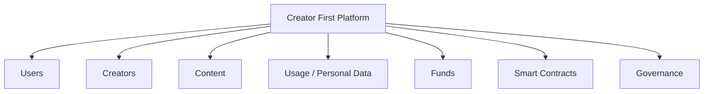

本プラットフォームの基本原則は、

> **「ブロックチェーンを使っているから安全」ではなく、各レイヤーの信頼境界を明確にし、侵害されることを前提に被害を限定する**

ことである。

---

## 10.2 セキュリティの基本原則

### Zero Trust

ネットワーク内部だから安全とはみなさない。

### Least Privilege

必要最小限の権限だけを付与する。

### Defense in Depth

一つの防御機構が破られても、直ちに全システムが侵害されないようにする。

### Separation of Duties

開発、資金管理、デプロイ、法務、ガバナンスなどの権限を分離する。

### Privacy by Design

個人データを「集めてから守る」のではなく、不要なデータを最初から集めない。

### Verifiability

重要な状態変更や分配計算を監査・検証可能にする。

### Recoverability

侵害を完全に防ぐことだけでなく、検知、停止、復旧を設計する。

---

## 10.3 脅威モデル

Creator First Platform では、攻撃者を単一の種類として扱わない。

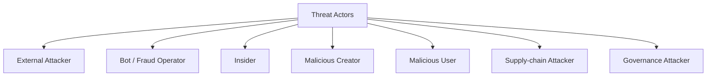

想定する攻撃には、

- アカウント乗っ取り
- 音源の不正取得
- API攻撃
- DDoS
- Botによる再生水増し
- 権利者なりすまし
- 分配先アドレスの改ざん
- 秘密鍵窃取
- スマートコントラクト脆弱性
- Oracle改ざん
- ZK Prover侵害
- ガバナンス乗っ取り
- 依存ライブラリへのSupply Chain Attack

などがある。

---

## 10.4 Trust Boundary

システムを複数の信頼境界へ分割する。

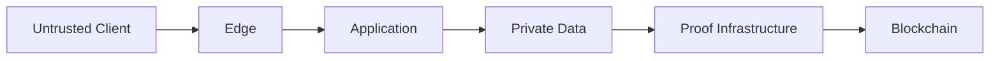

特に、

> **クライアントから送られてくる情報を、そのまま事実として信頼しない**

ことが重要である。

音楽プレーヤーが「10分再生した」と送信しただけでは、そのイベントを有効利用として扱わない。

---

## 10.5 Identity と Authentication

利用者、クリエイター、運営者では必要な本人確認レベルが異なる。

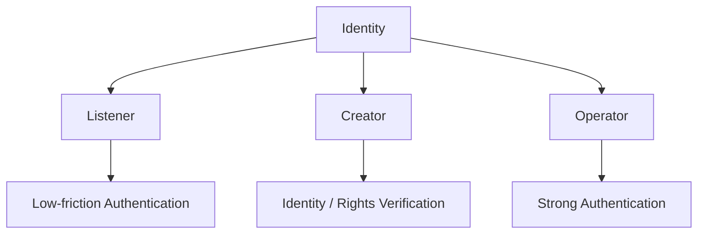

通常利用者には過剰な本人確認を要求しない。

一方、

- クリエイター登録
- 分配先変更
- 運営管理
- Treasury操作

などはより強い認証を要求する。

---

## 10.6 Account Security

アカウント保護には、

- Passkey
- MFA
- セッション管理
- 異常ログイン検出
- Rate Limit
- Credential Stuffing対策

などを利用する。

特に管理者アカウントでは、パスワードだけの認証を原則として避ける。

---

## 10.7 Creator Identity

クリエイターへの分配が発生する以上、

> **「誰が作品をアップロードしたか」だけでなく、「その人物・組織が分配を受ける権限を持つか」**

を確認する必要がある。

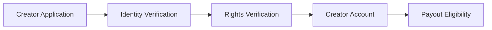

本人確認と著作権確認は別の問題である。

本人であることが確認できても、その人物が対象楽曲の全権利を持つとは限らない。

---

## 10.8 権利者なりすまし

攻撃者が他人の楽曲を登録し、分配先を自分に設定する攻撃を想定する。

対策として、

- 権利情報確認
- 既存識別子との照合
- 重複コンテンツ検出
- 異議申立て
- 分配保留
- 変更履歴

などを組み合わせる。

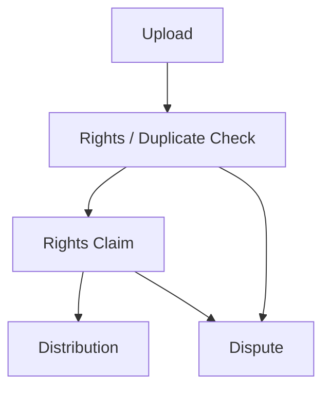

---

## 10.9 Payout Address の保護

分配先アドレス変更は非常に高リスクな操作である。

アカウントを一時的に乗っ取られただけで、次回分配先を攻撃者へ変更できてはならない。

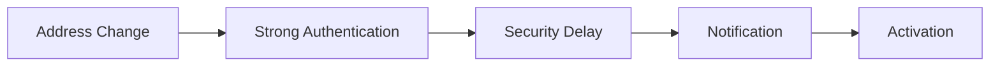

一定額以上の分配先変更では追加確認を要求することも検討する。

---

## 10.10 音源の保護

音楽ストリーミングでは、利用者端末で最終的に音声を再生する以上、完全なコピー防止は不可能である。

したがって、

> **「絶対にコピーできない」ことではなく、大規模・自動化された不正取得を困難にする**

ことを目標とする。

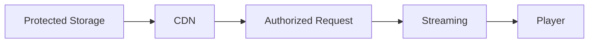

署名付きURL、短い有効期限、アクセス制御、Rate Limit等を利用する。

---

## 10.11 未公開音源

リリース前の音源は特に機密性が高い。

公開コンテンツと同じアクセス権で管理しない。

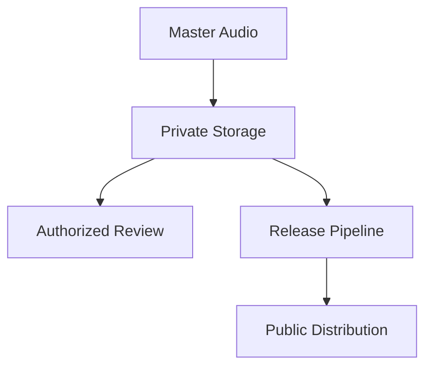

---

## 10.12 DRM の位置付け

DRMを採用する場合でも、それをシステム全体の安全性の中心に置かない。

DRMは、

- ライセンス制御
- オフライン再生
- 大規模コピーの抑制

には利用できるが、権利侵害を完全に防止する技術ではない。

ユーザー体験、対応端末、運用コストとのバランスで判断する。

---

## 10.13 API Security

APIでは、

- Authentication
- Authorization
- Input Validation
- Rate Limiting
- Replay Protection
- Audit Logging

を基本とする。

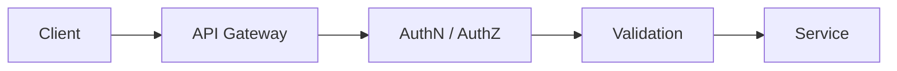

内部APIも「内部だから認証不要」としない。

---

## 10.14 DDoS と可用性

音楽配信サービスでは、攻撃だけでなくイベントや話題化による急激なアクセス増加も想定する。

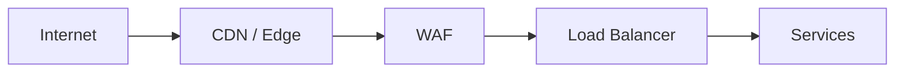

CDN、WAF、Auto Scaling、Rate Limit等を利用し、アプリケーション本体へ直接トラフィックを集中させない。

---

## 10.15 再生イベントの不正

経済モデルが再生実績と接続されるため、Playback Fraud は重大な脅威となる。

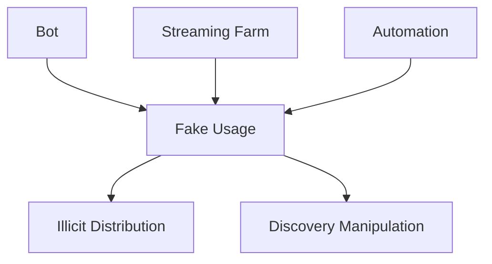

不正再生は単なる分析データの誤差ではなく、

> **資金の不正取得**

につながる可能性がある。

---

## 10.16 Playback Fraud Detection

単一の指標だけで不正判定しない。

例えば、

- 異常な再生頻度
- 不自然な時間分布
- 同一端末・ネットワーク
- アカウント生成パターン
- 曲間遷移
- 再生完了率
- 複数アカウント間の相関

などを組み合わせる。

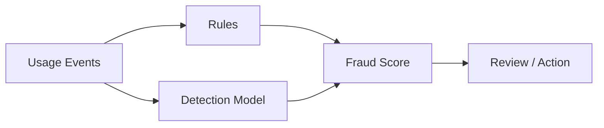

---

## 10.17 AI不正検出の限界

AIモデルが「不正」と判定しただけで、自動的にクリエイターの資金を永久没収する設計にはしない。

重大な措置では、

- 根拠
- 再検証
- 人によるレビュー
- 異議申立て

を設ける。

AIは意思決定支援として利用し、法的・経済的な重大処分を完全自動化しない。

---

## 10.18 Usage Oracle Security

Usage Oracle が侵害されると、正しいスマートコントラクトでも誤ったデータに基づいて資金を分配する。

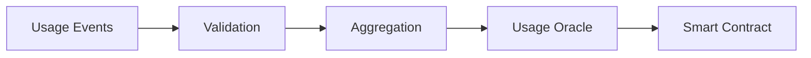

したがってOracleを一つの秘密鍵と一つのサーバーに依存させない。

---

## 10.19 Commitment と監査

利用イベント集合をMerkle Tree等へコミットすることで、後から集計対象を都合よく差し替えることを困難にする。

$$
R_t = \operatorname{MerkleRoot}(E_t)
$$

ここで、

- $E_t$：期間 $t$ の対象イベント集合
- $R_t$：そのCommitment

である。

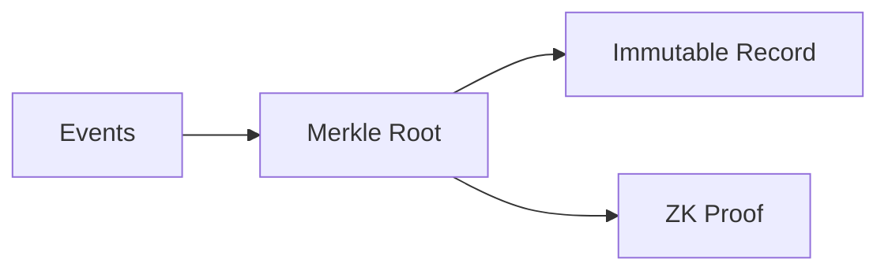

---

## 10.20 ZK Proof とセキュリティ

ZK Proofは、

> **証明された計算が定義された制約を満たす**

ことを保証する。

しかし、

- 元データが現実の再生を表しているか
- 端末が侵害されていないか
- 不正判定ルールが適切か

までは自動的に保証しない。

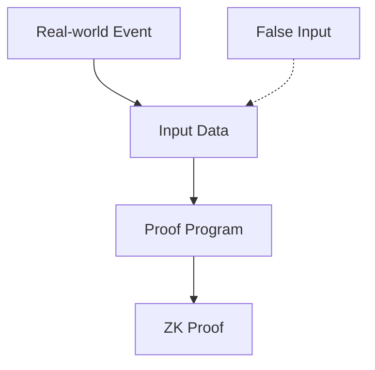

このため、ZKはOracle Securityを置き換えるものではなく、その一部を強化する技術として扱う。

---

## 10.21 zk-STARK のセキュリティ

zk-STARKを利用する場合、主に次を保護する必要がある。

- Proof Program
- AIR Constraints
- Public Input
- Witness生成
- Prover Infrastructure
- Verifier Contract
- Protocol Version

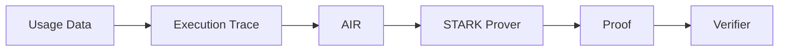

特に、AIRが意図した仕様を正しく表現していることが重要である。

---

## 10.22 Proof Program Bug

ZKシステムが暗号学的に安全でも、証明するプログラム自体にバグがあれば、誤った計算を「正しく証明」する可能性がある。

例えば、本来、

$$
v_t \in \{0,1\}
$$

であるべき値に制約がなく、

$$
S_{t+1}=S_t+v_t
$$

だけを証明している場合、不正な値を加算できる可能性がある。

したがって、

> **ZK Security = Cryptography + Correct Constraints + Correct Implementation**

である。

---

## 10.23 Proof Program の監査

Proof Programはスマートコントラクトと同様に重要なコードとして扱う。

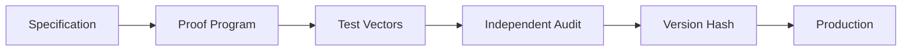

ガバナンスで承認された仕様とProof Programの対応を確認可能にする。

---

## 10.24 Prover の侵害

Prover Serverが侵害された場合でも、無効な証明をVerifierが受理しないことがZKの重要な利点である。

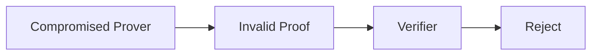

ただし、Proverが秘密データを扱う場合には機密性侵害のリスクが残る。

Proverを「信頼不要」ではなく、

> **計算結果の正しさについては信頼を減らせるが、秘密データ保護については依然として防御が必要**

と位置付ける。

---

## 10.25 Smart Contract Security

スマートコントラクトは一度デプロイすると、通常のWebアプリより修正が困難である。

主な対策は、

- 小さなモジュール
- 明確な権限
- テスト
- Static Analysis
- Fuzzing
- Invariant Testing
- 外部監査
- Timelock

である。

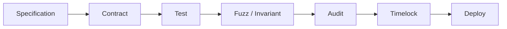

---

## 10.26 Smart Contract Invariants

重要な性質をInvariantとして定義する。

例えば、ある分配期間で、

$$
\sum_i D_i \leq R_d
$$

すなわち、分配総額が利用可能額を超えないこと。

Rights Splitについては、

$$
\sum_k s_{i,k}=1
$$

を満たすこと。

これらをテストだけでなく、可能な範囲でInvariant TestingやFormal Verificationへ利用する。

---

## 10.27 Reentrancy と外部呼び出し

資金を扱うコントラクトでは、Reentrancy等の典型的な脆弱性を考慮する。

基本的には、

- Checks-Effects-Interactions
- Pull Payment
- Reentrancy Guard
- 外部呼び出し最小化

などを利用する。

分配では、一度に全権利者へPush送金するより、Claim方式が安全性・Gasの面で有利な場合がある。

---

## 10.28 Upgrade Security

Upgradeable Contractを利用する場合、アップグレード権限は極めて高い権限になる。

```mermaid
flowchart LR
    GOV[Governance]
    EXEC[Executor]
    TIME[Timelock]
    PROXY[Proxy]
    IMPL[New Implementation]

    GOV --> EXEC --> TIME --> PROXY --> IMPL
```

単一EOAが即時にImplementationを変更できる構造は避ける。

---

## 10.29 Timelock

重要な変更にはTimelockを設ける。

```mermaid
flowchart LR
    APPROVE[Approved Change]
    TIME[Timelock]
    OBSERVE[Public Review]
    EXEC[Execution]

    APPROVE --> TIME --> OBSERVE --> EXEC
```

これにより、利用者、クリエイター、監査者が変更内容を確認する時間を確保する。

---

## 10.30 Treasury Security

Treasuryはプラットフォームの最重要資産の一つである。

```mermaid
flowchart TD
    TREASURY[Treasury]
    TREASURY --> MULTI[Multisig]
    TREASURY --> LIMIT[Transfer Limits]
    TREASURY --> TIME[Timelock]
    TREASURY --> MONITOR[Monitoring]
```

一つの秘密鍵で全資金を移動できる設計を避ける。

---

## 10.31 Hot / Warm / Cold

資金を用途に応じて分離する。

```mermaid
flowchart LR
    HOT[Hot<br/>Daily Operations]
    WARM[Warm<br/>Periodic Distribution]
    COLD[Cold<br/>Reserve]

    COLD --> WARM --> HOT
```

日常運用に必要な資金だけを即時アクセス可能な環境へ置く。

---

## 10.32 Key Management

秘密鍵はソースコード、GitHub、CIログ、開発者PCへ平文保存しない。

- HSM
- Cloud KMS
- Hardware Wallet
- Multisig
- Key Rotation

などを用途に応じて利用する。

```mermaid
flowchart TD
    KEY[Critical Key]
    KEY --> KMS[KMS / HSM]
    KEY --> MULTI[Multisig]
    KEY --> ROTATE[Rotation]
    KEY --> AUDIT[Access Audit]
```

---

## 10.33 Key Rotation

鍵は永久に同じものを利用しない。

侵害が確認されなくても、役割変更や一定期間でRotationできる設計を持つ。

特にOracle Signer、CI/CD Credential、運営者資格情報は交換可能にする。

---

## 10.34 Governance Security

二院制ガバナンスそのものも攻撃対象になる。

```mermaid
flowchart TD
    ATTACK[Governance Attack]
    ATTACK --> SYBIL[Sybil]
    ATTACK --> BUY[Vote Buying]
    ATTACK --> ACCOUNT[Account Takeover]
    ATTACK --> DELEGATE[Delegate Capture]
    ATTACK --> FLASH[Temporary Economic Power]
```

「オンチェーン投票だから安全」とは限らない。

---

## 10.35 Sybil Attack

User Houseでは、一人が大量のアカウントを作成して投票する攻撃を考慮する。

```mermaid
flowchart LR
    HUMAN[One Attacker]
    HUMAN --> A1[Account A]
    HUMAN --> A2[Account B]
    HUMAN --> A3[Account C]

    A1 --> VOTE[Votes]
    A2 --> VOTE
    A3 --> VOTE
```

対策はプライバシーとのバランスを取りながら、

- アカウント継続性
- 利用実績
- Verifiable Credentials
- Reputation
- Proof of Personhood的手法

などを検討する。

---

## 10.36 Creator House の乗っ取り

Creator Houseでも、偽クリエイター登録や一組織による多数アカウント取得を防ぐ必要がある。

Creator Eligibilityを、

- 本人確認
- 権利確認
- 活動実績
- 重複主体検出

などと接続する。

---

## 10.37 Delegation Risk

委任投票では、少数の有力Delegateへ権力が集中する可能性がある。

```mermaid
flowchart LR
    USERS[Many Voters]
    D1[Delegate A]
    POWER[Concentrated Power]

    USERS --> D1 --> POWER
```

委任集中度を可視化し、委任をいつでも撤回できるようにする。

---

## 10.38 Governance Proposal Security

提案文と実際に実行されるトランザクションが異なる攻撃を防ぐ。

```mermaid
flowchart LR
    TEXT[Human-readable Proposal]
    SPEC[Specification]
    CALL[Executable Calls]
    HASH[Proposal Hash]
    VOTE[Vote]

    TEXT --> SPEC --> CALL --> HASH --> VOTE
```

投票者が「何を承認すると、どのコード・パラメータが変わるか」を確認できるUIを設計する。

---

## 10.39 Emergency Governance

重大な攻撃時には、通常の長い投票手続では間に合わない場合がある。

限定的なEmergency Authorityを設ける場合、

- Pauseのみ
- 資金移動不可
- 短い期限
- 複数主体承認
- 事後公開
- 事後ガバナンス審査

などの制約を設ける。

```mermaid
flowchart LR
    INCIDENT[Critical Incident]
    AUTH[Emergency Authority]
    PAUSE[Limited Pause]
    FIX[Investigation / Fix]
    GOV[Governance Review]
    RESUME[Resume]

    INCIDENT --> AUTH --> PAUSE --> FIX --> GOV --> RESUME
```

---

## 10.40 Supply Chain Security

現代のソフトウェアでは、自作コードだけでなく依存パッケージが大きな攻撃面になる。

```mermaid
flowchart TD
    APP[Application]
    APP --> NPM[npm Packages]
    APP --> ACTION[GitHub Actions]
    APP --> IMAGE[Container Images]
    APP --> SDK[Blockchain SDK]
```

対策として、

- Lockfile
- Dependency Update Review
- Vulnerability Scan
- SBOM
- Pinning
- CI権限最小化

などを利用する。

---

## 10.41 GitHub Security

ソースコード管理では、

- Branch Protection
- Pull Request Review
- CODEOWNERS
- Required Checks
- Secret Scanning
- Dependabot等
- Signed Release

を検討する。

```mermaid
flowchart LR
    DEV[Developer]
    PR[Pull Request]
    REVIEW[Review]
    CI[CI / Security Checks]
    MAIN[Protected Main]
    RELEASE[Release]

    DEV --> PR --> REVIEW --> CI --> MAIN --> RELEASE
```

プロトコルコードを直接mainへPushして本番デプロイする運用は避ける。

---

## 10.42 CI/CD Security

CI/CDは本番環境やデプロイ鍵へアクセスするため、高価値な攻撃対象である。

長期秘密鍵をCI環境へ保存するより、

- OIDC
- Short-lived Credentials
- Environment Protection
- Approval
- Least Privilege

を利用する。

---

## 10.43 Reproducible Build

スマートコントラクトやProof Verifierでは、

> **レビューされたソースコードとデプロイされた実体が一致する**

ことを検証可能にする。

```mermaid
flowchart LR
    SOURCE[Reviewed Source]
    BUILD[Deterministic Build]
    ARTIFACT[Artifact Hash]
    DEPLOY[Deployment]

    SOURCE --> BUILD --> ARTIFACT --> DEPLOY
```

---

## 10.44 Data Security

保存データは分類する。

### Public

公開作品情報、公開ガバナンス情報など。

### Internal

内部運用情報。

### Confidential

契約、権利者情報、未公開音源など。

### Highly Sensitive

秘密鍵、本人確認情報、認証秘密等。

分類ごとにアクセス制御、暗号化、保持期間を設定する。

---

## 10.45 Encryption

データは、

- In Transit
- At Rest

の双方で暗号化する。

```mermaid
flowchart LR
    CLIENT[Client]
    TLS[TLS]
    SERVICE[Service]
    ENC[Encrypted Storage]

    CLIENT --> TLS --> SERVICE --> ENC
```

ただし「暗号化して保存している」だけでは不十分であり、鍵へのアクセス権限を管理する必要がある。

---

## 10.46 Personal Data Minimization

再生履歴を利用する場合、

> **技術的に収集できる情報と、収集すべき情報を区別する。**

例えば分配計算に個人の氏名が不要なら、Usage Pipelineへ氏名を渡さない。

```mermaid
flowchart LR
    USER[User]
    ID[Identity Data]
    PSEUDO[Pseudonymous ID]
    USAGE[Usage System]

    USER --> ID
    USER --> PSEUDO --> USAGE

    ID -.-> USAGE
```

---

## 10.47 ログとプライバシー

セキュリティログは重要だが、ログ自体が個人情報の巨大な蓄積になる可能性がある。

ログには、

- 必要最小限の識別子
- マスキング
- アクセス制御
- 保持期間
- 削除方針

を設定する。

---

## 10.48 Backup

ランサムウェア、操作ミス、クラウド障害等に備え、バックアップを持つ。

```mermaid
flowchart TD
    PROD[Production Data]
    B1[Primary Backup]
    B2[Independent Backup]
    TEST[Restore Test]

    PROD --> B1
    PROD --> B2
    B1 --> TEST
    B2 --> TEST
```

バックアップが存在するだけでなく、実際に復元できることを定期的に確認する。

---

## 10.49 Disaster Recovery

重大障害時の目標を、

- RPO — Recovery Point Objective
- RTO — Recovery Time Objective

として定義する。

全サービスを同じRPO/RTOにせず、

- 音楽再生
- 権利データ
- 分配
- ガバナンス

の重要度に応じて設定する。

---

## 10.50 Monitoring

セキュリティ監視では、

- Authentication anomalies
- API attacks
- Fraud spikes
- Treasury movement
- Contract events
- Governance changes
- Prover failures
- Infrastructure anomalies

などを統合的に監視する。

```mermaid
flowchart TD
    APP[Application]
    CLOUD[Cloud]
    CHAIN[Blockchain]
    GOV[Governance]
    PROVER[Prover]

    APP --> MON[Security Monitoring]
    CLOUD --> MON
    CHAIN --> MON
    GOV --> MON
    PROVER --> MON

    MON --> ALERT[Alert / Response]
```

---

## 10.51 Incident Response

セキュリティ事故を完全に防げる前提には立たない。

```mermaid
flowchart LR
    DETECT[Detect]
    TRIAGE[Triage]
    CONTAIN[Contain]
    ERADICATE[Eradicate]
    RECOVER[Recover]
    REVIEW[Postmortem]

    DETECT --> TRIAGE --> CONTAIN --> ERADICATE --> RECOVER --> REVIEW
```

事前に、

- 責任者
- 連絡経路
- 停止権限
- 法務対応
- 利用者通知
- 復旧手順

を定義する。

---

## 10.52 Security Incident と株式会社

セキュリティ責任をDAOへ曖昧に分散させない。

運営株式会社が、

- インシデント対応
- 個人情報保護
- 権利者対応
- 利用者対応
- 法令上必要な報告
- ベンダー管理

の実務責任を負う。

```mermaid
flowchart LR
    INCIDENT[Incident]
    CORP[Operating Corporation]
    TECH[Technical Response]
    LEGAL[Legal Response]
    USERS[User / Creator Communication]

    INCIDENT --> CORP
    CORP --> TECH
    CORP --> LEGAL
    CORP --> USERS
```

---

## 10.53 Responsible Disclosure

外部研究者が脆弱性を発見した場合の窓口を設ける。

成熟段階では、

- Security Contact
- Vulnerability Disclosure Policy
- Bug Bounty

などを検討する。

善意の報告者が安全に問題を報告できる環境を作る。

---

## 10.54 Security Audit

監査対象はスマートコントラクトだけではない。

```mermaid
flowchart TD
    AUDIT[Security Audit]

    AUDIT --> CONTRACT[Smart Contracts]
    AUDIT --> ZK[ZK Programs]
    AUDIT --> CLOUD[Cloud]
    AUDIT --> APP[Applications]
    AUDIT --> GOV[Governance]
    AUDIT --> PROCESS[Operational Process]
```

重大なプロトコル変更時には再監査を行う。

---

## 10.55 Formal Verification

特に資金分配やTreasuryについては、可能な範囲で形式的検証を利用する。

例えば、

$$
\sum_i D_i \leq R_d
$$

や、

$$
D_i \geq 0
$$

など、常に満たすべき性質を明示する。

形式的検証だけでシステム全体の安全性が保証されるわけではないが、重要な不変条件の検証には有効である。

---

## 10.56 セキュリティとガバナンス

セキュリティポリシーのすべてを投票で変更できるようにはしない。

例えば、

- TLSを無効にする
- 監査を廃止する
- 秘密鍵を公開する

といった提案は、単純多数決で正当化できない。

```mermaid
flowchart TD
    CONST[Constitution]
    SEC[Security Baseline]
    GOV[Governance]
    IMPL[Implementation]

    CONST --> SEC
    SEC --> GOV
    GOV --> IMPL
```

最低限の安全性は憲章、法令、セキュリティ基準によって制約される。

---

## 10.57 セキュリティ変更の透明性

重要な権限変更については、

- 誰が
- 何を
- いつ
- どの提案に基づき
- どのコードへ

変更したかを追跡可能にする。

```mermaid
flowchart LR
    PROPOSAL[Proposal]
    APPROVAL[Approval]
    CHANGE[Security-sensitive Change]
    LOG[Audit Trail]

    PROPOSAL --> APPROVAL --> CHANGE --> LOG
```

ただし、公開すると攻撃を助ける秘密情報まで公開しない。

---

## 10.58 セキュリティ成熟度

MVPから世界展開まで、同じセキュリティ体制では不十分である。

```mermaid
flowchart LR
    P1[Phase 1<br/>MVP Baseline]
    P2[Phase 2<br/>Production Hardening]
    P3[Phase 3<br/>Independent Audits]
    P4[Phase 4<br/>Global Security Program]

    P1 --> P2 --> P3 --> P4
```

### Phase 1

- MFA
- Cloud IAM
- Encryption
- Backup
- Dependency Scan
- Basic Monitoring

### Phase 2

- WAF
- SIEM
- Key Management強化
- Fraud Detection
- Incident Response訓練

### Phase 3

- Smart Contract Audit
- ZK Audit
- Penetration Test
- Bug Bounty
- Disaster Recovery Test

### Phase 4

- 24/7 Monitoring
- 地域冗長化
- Supply Chain Security
- 高度なFraud対策
- 継続的監査

---

## 10.59 Security by Progressive Decentralization

分散化によって攻撃面が減る場合もあれば、逆に増える場合もある。

```mermaid
flowchart LR
    CENTRAL[Centralized]
    SHARED[Shared Control]
    DECENT[Decentralized]

    CENTRAL --> SHARED --> DECENT
```

例えばTreasuryを単一管理者からMultisig、さらにGovernance + Timelockへ移行することは安全性を高め得る。

一方、未成熟なオンチェーンガバナンスを急いで導入すると、新しい攻撃面を作る。

したがって、分散化はセキュリティ成熟度に合わせて段階的に進める。

---

## 10.60 3つの憲章との関係

セキュリティは3つの憲章を実現するための基盤である。

```mermaid
flowchart TD
    CONST[3つの憲章]

    CONST --> CREATOR[Creator Rights / Sustainability]
    CONST --> USER[User Autonomy / Privacy]
    CONST --> FAIR[Fair Ecosystem]

    CREATOR --> SECURITY[Security]
    USER --> SECURITY
    FAIR --> SECURITY
```

クリエイターの分配資金が盗まれれば Creator First は成立しない。

利用者の再生履歴が無制限に公開されれば User Autonomy は成立しない。

Botが推薦やガバナンスを支配すれば Fair Ecosystem は成立しない。

---

## 10.61 全体セキュリティ構造

```mermaid
flowchart TD
    USER[Users]
    CREATOR[Creators]

    USER --> EDGE[Edge Security]
    CREATOR --> EDGE

    EDGE --> APP[Application Security]
    APP --> ID[Identity / Authorization]
    APP --> DATA[Data Security]
    APP --> USAGE[Usage Integrity]

    USAGE --> FRAUD[Fraud Detection]
    USAGE --> ZK[ZK Proof]

    ZK --> CONTRACT[Smart Contracts]
    CONTRACT --> TREASURY[Treasury]

    GOV[Governance Security] --> CONTRACT
    KEY[Key Management] --> CONTRACT
    KEY --> TREASURY

    MON[Monitoring] --> APP
    MON --> ZK
    MON --> CONTRACT
    MON --> TREASURY

    CORP[Operating Corporation] --> IR[Incident Response]
    MON --> IR
```

---

## 10.62 本章のまとめ

Creator First Platform のセキュリティは、

> **外部からシステムを守るための壁**

だけではない。

権限、コード、データ、資金、ガバナンスを相互に制約し、

> **一つの主体、一つの鍵、一つのサーバー、一つのアルゴリズムが侵害されても、プラットフォーム全体を支配できない構造**

を作ることが目的である。

```mermaid
flowchart LR
    PREVENT[Prevent]
    DETECT[Detect]
    LIMIT[Limit]
    VERIFY[Verify]
    RECOVER[Recover]

    PREVENT --> DETECT --> LIMIT --> VERIFY --> RECOVER
```

特に重要なのは、

- 利用者データの最小化
- クリエイターと権利者の本人・権利確認
- Playback Fraud対策
- Usage Oracleの検証可能性
- ZK Proof Programの監査
- Smart Contract Invariant
- Treasuryと秘密鍵の分散管理
- ガバナンス攻撃への耐性
- Supply Chain Security
- インシデント対応

である。

Creator First Platform は、会社への信頼を完全になくすことを目指すのではない。

> **会社が責任を負いながら、重要な処理については「信頼してください」だけでなく、「検証できます」と言えるシステムを作る。**

これが本プラットフォームのセキュリティ設計の基本方針である。
