# 11. 法務・STO・税務

> [!IMPORTANT]
> 本章は Creator First Platform の制度設計を整理するためのホワイトペーパー案であり、個別案件についての法律・税務上の助言ではない。サービス開始、STO実施、ステーブルコイン決済、海外展開に際しては、弁護士、公認会計士・税理士、金融規制の専門家、関係事業者との確認を前提とする。
>
> また、金融・税制は改正が続いているため、本章は **2026年8月25日時点で確認できる公的情報を基準にしつつ、変更可能な制度層と恒久的な設計原則を分離する**。

## 11.1 本章の目的

Creator First Platform は、単なるソフトウェア・プロトコルではない。

音楽配信、著作権・著作隣接権、サブスクリプション料金、音楽クリエーターへの収益分配、ステーブルコイン、スマートコントラクト、STO、二院制ガバナンスが接続するため、技術設計と同時に現実社会で責任を負う法的主体が必要になる。

本プロジェクトでは、その主体を **株式会社** とする。

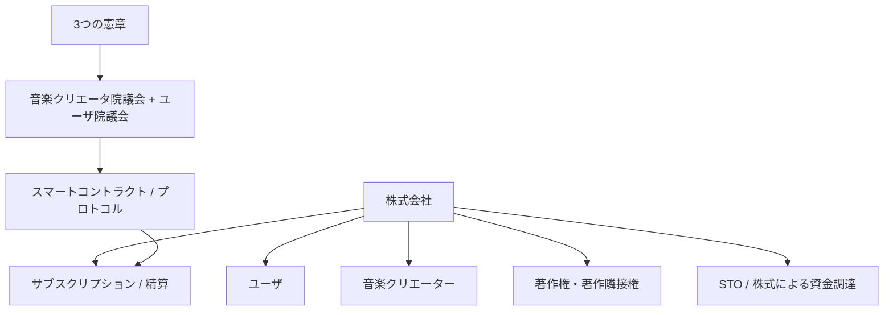

ここで重要なのは、

> **DAOが株式会社を置き換えるのではなく、株式会社の法的責任と、プロトコルのコード統治を組み合わせる**

という構造である。

---

## 11.2 法的主体としての株式会社

株式会社は、現実社会との接点を引き受ける。

主な役割は、

- 利用規約・契約
- 音楽クリエーター契約
- 著作権・著作隣接権処理
- 決済事業者との契約
- 従業員・業務委託契約
- 税務・会計
- 個人情報保護
- セキュリティ事故対応
- 規制当局・裁判所への対応
- STOによる資金調達
- 知的財産・商標等の保有

である。

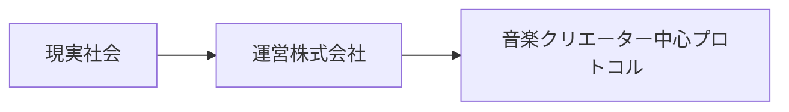

スマートコントラクトには法人格も法的責任能力もない。

したがって、

> **コード = 法令は「国家法をコードが置き換える」という意味ではなく、プラットフォーム内部の分配・資金庫・プロトコル変更について、承認されたコードを規範として実行する**

という意味で用いる。

---

## 11.3 法律とコードの階層

Creator First Platform の規範構造は次のように整理する。

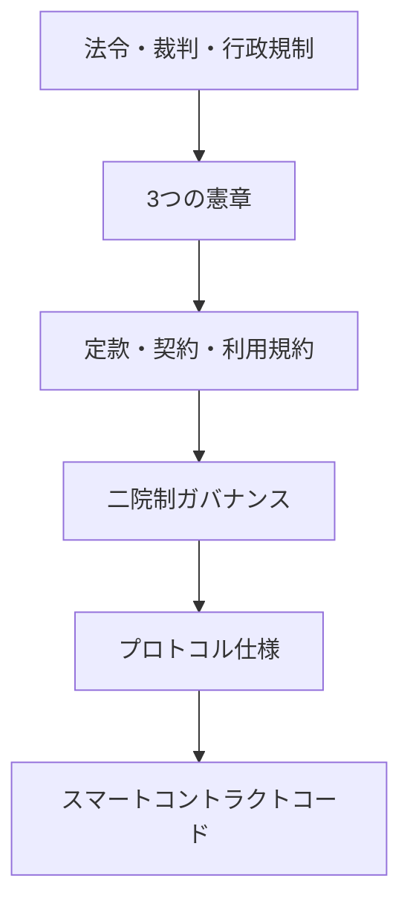

上位の法令に反するコードは、ガバナンスで承認されても正当化されない。

同様に、3つの憲章に反する通常提案を単純多数決で実行できない制度を目指す。

---

## 11.4 音楽配信と著作権

音楽配信では「一つの曲」に一つの権利だけが存在するわけではない。

概念的には、

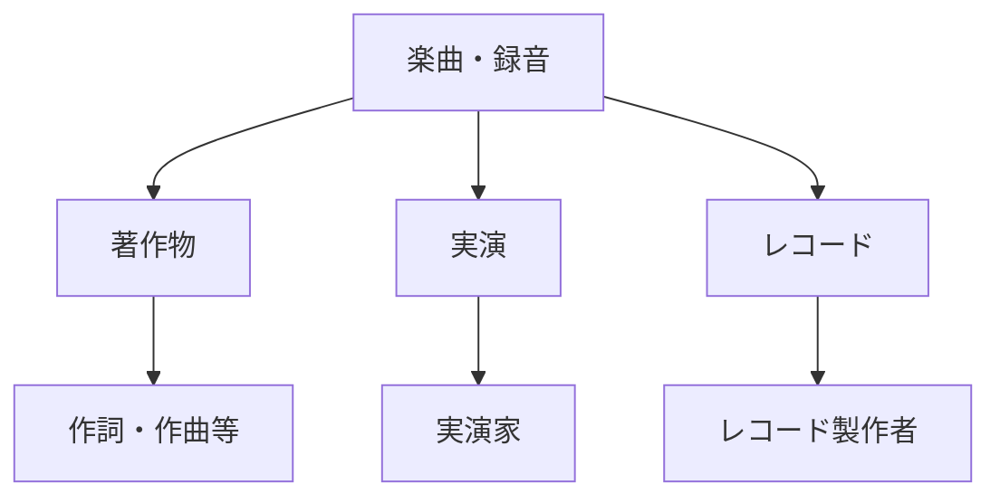

という複数の権利関係が存在する。

したがって、音楽クリエーター登録時に、

> 「この曲をアップロードした人 = 全権利者」

とはみなさない。

---

## 11.5 著作権と著作隣接権

Creator First Platform は少なくとも、

- 作詞・作曲等に関する著作権
- 実演家の著作隣接権
- レコード製作者の著作隣接権

を区別して権利メタデータを管理する。

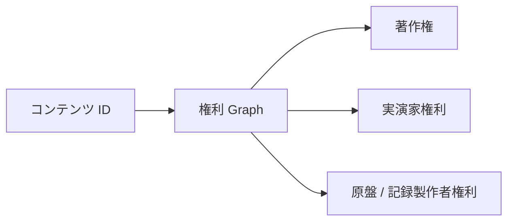

スマートコントラクト上の `Creator` という単一アドレスへ全収益を送るだけでは、現実の権利関係を十分に表現できない。

---

## 11.6 権利登録台帳と法的権利

オンチェーンの権利登録台帳は、法的権利そのものを自動的に創設するものではない。

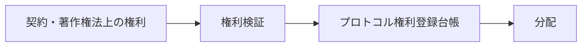

登録台帳は、

> **確認された権利・契約状態をプロトコルが処理できる形で表現する**

ための技術レイヤーと位置付ける。

---

## 11.7 音楽クリエーター登録と契約

音楽クリエーター登録では、

1. 本人・法人確認
2. 作品情報
3. 権利情報
4. 分配比率
5. 既存管理事業者との関係
6. 表明保証
7. 分配先

を確認する。

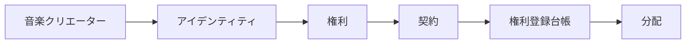

権利紛争が生じた場合には、スマートコントラクトの自動実行だけで処理せず、分配保留・異議申立て・法的手続を接続する。

---

## 11.8 著作権等管理事業との境界

Creator First Platform が第三者から著作権・著作隣接権の管理を委託され、利用許諾や使用料管理を業として行う構造を採る場合、著作権等管理事業法との関係を検討する必要がある。

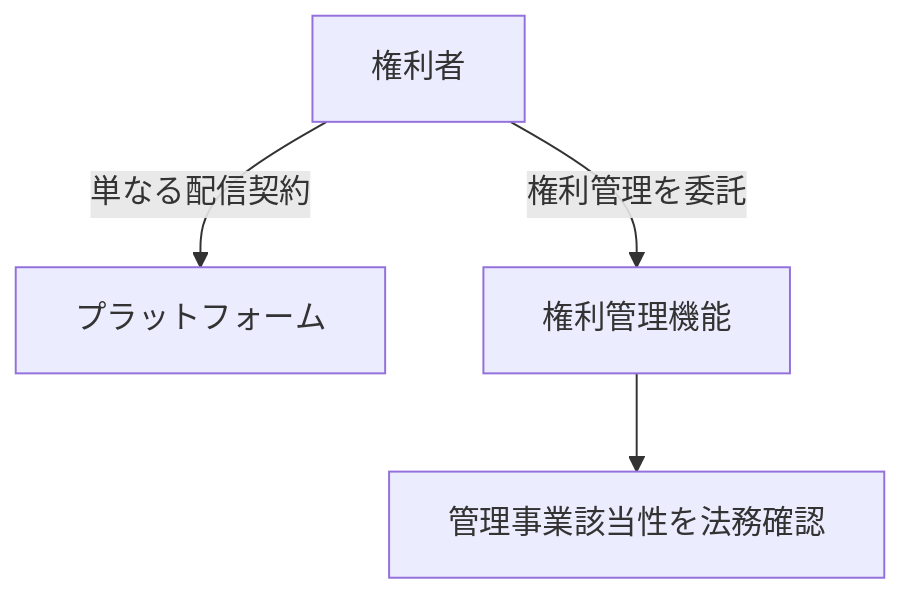

したがって初期設計では、

> **プラットフォーム自身が権利管理事業者になるのか、既存の管理事業者と連携するのか**

を明確に分離する。

---

## 11.9 権利管理事業者との連携

現実的な初期モデルとして、

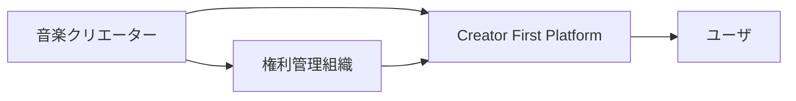

のように、既存の著作権等管理事業者と連携しつつ、Creator First Platformは独自の音楽クリエーター経済と権利メタデータを構築する方法が考えられる。

これにより、既存の権利処理インフラを無視してゼロから作り直す必要がない。

---

## 11.10 サブスクリプション料金の法的性質

ユーザから受け取る料金が、

- 直ちにサービス利用の対価となるのか
- 前払式の残高として保持されるのか
- 他者への送金が可能なのか
- 換金できるのか

によって法的評価が変わり得る。

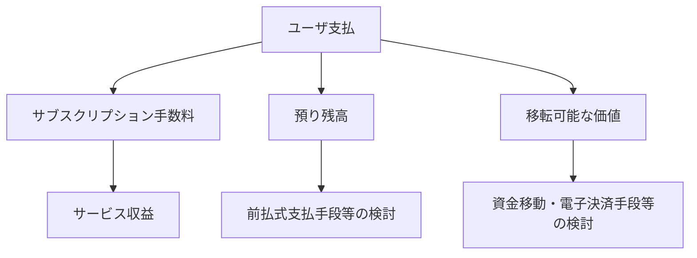

したがって、

> **「ステーブルコインを使うか」より先に、誰が誰の資金を、いつ、どの法的根拠で保有・移転するのか**

を定義する。

---

## 11.11 ステーブルコイン

日本では、法定通貨価値と連動する一定のデジタル資産は、資金決済法上の「電子決済手段」に関する規制体系と接続する。

Creator First Platform が、

- 電子決済手段を自ら発行する
- 売買・交換を行う
- 仲介する
- ユーザのために管理する

のか、それとも、

- 登録済み事業者の決済サービスを利用するだけ

なのかで規制上の位置付けが大きく異なる。

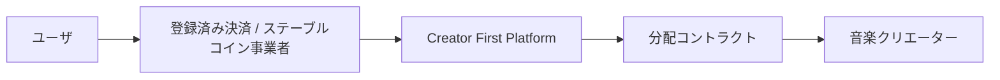

初期段階では、

> **プラットフォーム自身が金融仲介機能を抱え込まず、必要な登録を有する事業者と接続する**

構造を基本候補とする。

オンチェーンサブスクリプションではJPYC等の承認済みステーブルコインをサービス料金とし、ETH等のネイティブトークンはネットワーク手数料として分離する。リレイヤーまたはペイマスターがガスを負担しても、それ自体をユーザの支払い、売上、寄附、SBT資格または音楽クリエーターへの分配額として扱わない。テスト系の`MockJPYC`は金銭的価値、償還請求権および実在JPYCとの交換可能性を持たないことを明示する。

---

## 11.12 JPYC等を利用する場合

JPYC等の円建てステーブルコインを採用候補とする場合でも、

> 「トークンなので暗号資産」

とは限らない。

日本法ではトークンの法的性質を機能と制度上の定義で判断する。

実装前に、

- 発行主体
- 償還構造
- 保管主体
- 移転方法
- プラットフォームが行う行為
- ユーザ資金の保有主体

を確認する。

同じブランド名でも、商品・発行時期・契約条件によって法的性質や利用可能な機能が異なり得る。したがって、`JPYC` という名称だけをプロトコルの承認条件にせず、採用するトークンごとに、コントラクトアドレス、発行者、商品名、利用規約、償還可能性、対応ネットワーク、適用される登録・規制を確認する。

確認結果は `Approved Settlement Asset Registry` に証拠資料と確認日を付して登録し、制度・商品仕様の変更時には利用停止または再審査ができる設計とする。

---

## 11.13 カストディを避ける設計

可能であれば、ユーザ・音楽クリエーターの資産をプラットフォームが長期間保管しない。

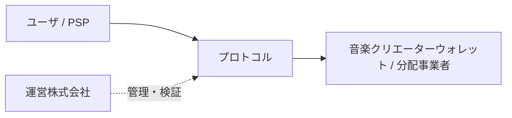

ただし、スマートコントラクトに資金を置けば自動的に「プラットフォームは資金を管理していない」と評価されるわけではない。

管理鍵、アップグレード権限、実質的支配、契約関係を含めて法的評価する。

### 11.13.1 月額料金に含めるネットワーク実行支援

一般ユーザへガストークンの購入を要求せず、株式会社がリレイヤーまたはペイマスターを通じて所定のオンチェーン操作を支援する。現時点の基本候補は、ガスをユーザへ再販売・移転するのではなく、**音楽配信サービスを提供する株式会社自身の運営原価**として負担し、その原価を音楽配信その他の役務と一体の固定月額料金へ織り込む構成である。

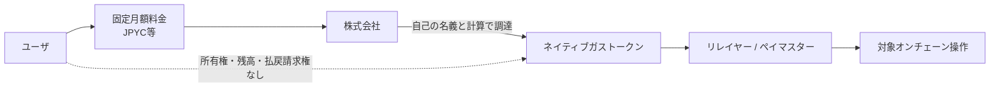

法的整合性を高めるため、少なくとも次の境界を設ける。

- ユーザへPOL、ETH等のガストークンを付与せず、ユーザ別の換金可能残高、出金、譲渡、翌月繰越または払戻しを設けない。
- 月額料金をガストークンの数量または交換レートへ連動させず、ガスの実費をユーザごとに事後精算しない。
- ペイマスターの対象を、承認済みチェーン、コントラクトおよび関数に限定し、任意送金、DEX取引、ブリッジその他の汎用的な資産操作を支援しない。
- 対象操作、利用上限、不正利用時の停止、障害・混雑時の取扱いを公開ポリシーと利用規約で定める。
- 申込みの最終確認画面では、税込の月額総額、支払時期・方法、役務の提供期間、自動更新、解約・返金条件、ネットワーク実行支援の範囲と上限を容易に確認できる形で表示する。
- 料金改定は原則として次の契約期間から適用し、適用前に通知して解約機会を確保する。予測不能なガス高騰を理由とする事後の追加請求は行わない。

株式会社は、受領した月額料金、消費税等、ガストークンの取得、ペイマスターへの供給、ネットワーク手数料、失敗・返金、対象操作およびトランザクション参照を照合可能に記録する。月額料金全額を売上とするか、各支出をどの勘定で処理するかは、契約内容と会計上の本人・代理人評価を踏まえて公認会計士・税理士が確認する。

この構成は登録不要または適法であることを自動的に保証しない。株式会社がユーザのためにガストークンを管理・移転できる実態、売買・交換を行う実態、登録事業者とユーザの取引成立を媒介する実態、または料金とは別の換金可能な価値を発行する実態を持つ場合には、暗号資産交換業、電子決済手段等取引業、電子決済手段・暗号資産サービス仲介業その他の規制該当性を個別に再評価する。外部事業者からJPYCとガストークンを同時取得させる導線を設ける場合も、画面の所在だけで判断せず、勧誘、契約成立への関与、資産管理および手数料の実態について登録事業者・弁護士・金融規制専門家と確認する。

ガス代支援予算や対象操作はガバナンスによる提案・監視の対象にできるが、株式会社の取締役・役員の法令遵守、表示、会計、セキュリティおよびユーザ保護上の責任を議会の議決で免除しない。

---

## 11.14 STO の目的

Creator First Platform の資金調達では、STOを、

> **サービス利用トークンの販売**

ではなく、

> **株式会社への投資をデジタル証券として実現する資金調達手段**

として位置付ける。

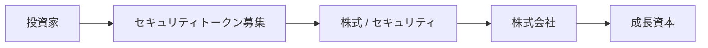

これにより、サービス利用権、ガバナンス参加、株主としての権利を不用意に混同しない。

---

## 11.15 セキュリティトークン

セキュリティトークンは、ブロックチェーン上に記録されるから証券になるのではない。

基礎となる権利が株式、社債、集団投資スキーム持分等の金融商品としての性質を持つ場合に、金融商品取引法上の規制を検討する。

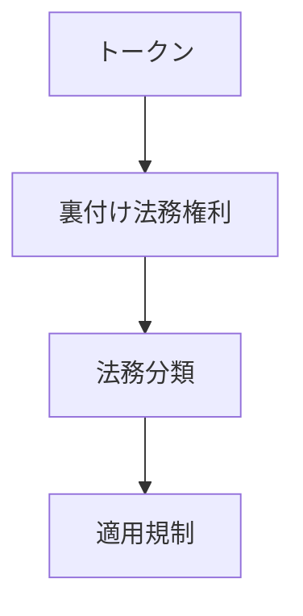

技術形式ではなく、権利内容から法的分類を行う。

---

## 11.16 STO と電子記録移転有価証券表示権利等

日本のSTOでは、電子的な仕組みによって権利の移転・記録を行う有価証券について、金融商品取引法上の規制体系が存在する。

そのため、

- 発行
- 勧誘
- 取扱い
- 移転
- Custody
- 投資家への説明
- AML/CFT

等を含め、登録金融商品取引業者等との連携を前提に設計する。

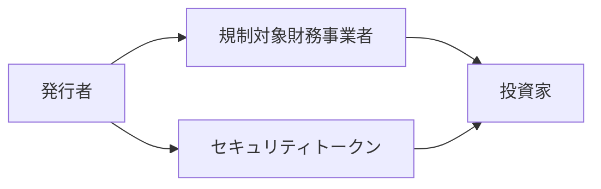

---

## 11.17 STOを自前販売しない

初期段階では、運営会社が独力で一般投資家へセキュリティトークンを販売する構造を前提にしない。

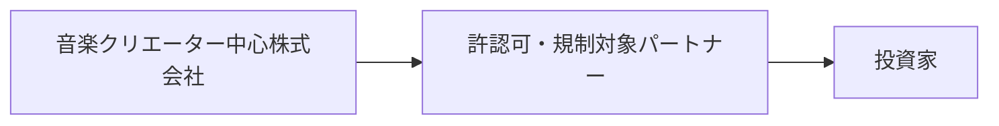

金融商品としての勧誘・取扱いには専門的な規制対応が必要だからである。

---

### 11.17.1 初期サポーター SBTとSTOの分離

初期サポーター SBTは、初期の発見、支援またはコミュニティ参加を示す譲渡不能な資格証明として設計できる。ただし、その名称や非譲渡性だけで法的性質が決まるものではなく、発行対価、対象者、付与されるサービス、投資との関係および実際の経済的価値を含む実態を確認する。

コミュニティ資格証明としてのSBTは、次のものから明確に分離する。

- セキュリティトークンおよび株主権
- 投資元本または将来収益への請求権
- 音楽クリエーター収益または分配プールへの参加権
- セキュリティトークン保有量に応じた特典
- プロトコルガバナンスの議決権

SBTがストリーミングサービスの特権を表す場合、通常のサブスクリプション契約、対象コンテンツの権利、利用地域、期間、品質および取消条件を利用規約と特権ポリシーで明示する。SBT保有だけを無制限または永久の再生権とせず、株式会社が消費者対応、表示、会計・税務、権利許諾、失効およびウォレット回復の責任を負う。

特にSTOの申込者または投資家だけにSBTを付与する場合、SBTが募集条件、現物での利益、投資家への付帯サービスまたは開示対象となる可能性を、募集前に金融規制、会計・税務および消費者保護の専門家と個別に確認する。その確認が完了するまで、初期サポーター SBTの資格をSTOへの出資額またはセキュリティトークン保有へ連動させない。

## 11.18 STO と株主権

STOを株式会社の株式と接続する場合、

- 配当
- 議決権
- 残余財産
- 株主名簿
- 譲渡制限
- 会社法上の手続

との整合が必要になる。

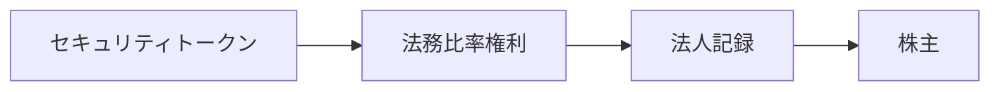

「トークンを持っているから自動的に会社法上の株主である」という単純な設計にはしない。

---

## 11.19 株主ガバナンスとプロトコルガバナンス

Creator First Platform では、二つのガバナンスを区別する。

### 法人ガバナンス

株主、取締役、株主総会等による株式会社の統治。

### プロトコルガバナンス

音楽クリエータ院議会とユーザ院議会によるコード・プロトコルの統治。

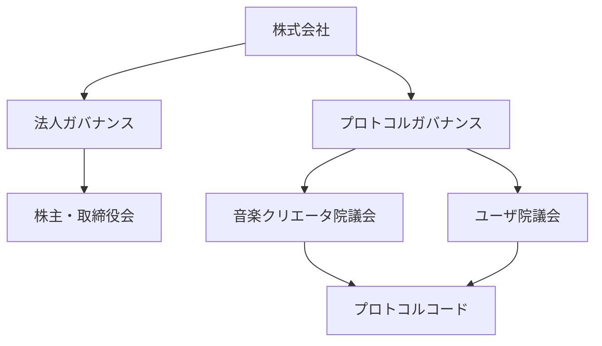

STO投資家が多額の資本を持つことと、音楽プラットフォームのコードを支配することを直結させない。

---

## 11.20 資本とコード統治の分離

Creator First Platform の重要な原則の一つは、

> **資本を多く持つ者が、そのまま文化・推薦・分配ルールを支配しない**

ことである。

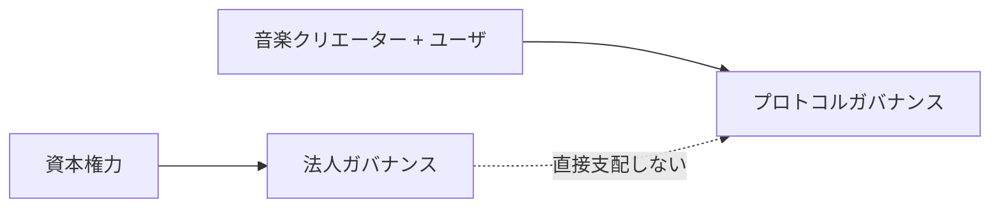

ただし、株式会社の取締役には会社法上の義務があるため、プロトコルガバナンスの決定を無条件に実行できるとは限らない。

この衝突を定款・契約・憲章・ガバナンス仕様で事前に整理する。

---

## 11.21 「コードは法である」と法的責任

スマートコントラクトが自動的に実行したとしても、

> **「コードがそう動いたので誰にも責任がない」**

とはしない。

```mermaid
flowchart TD
    GOV[ガバナンス決定]
    CODE[スマートコントラクト]
    EFFECT[法務 / 経済効果]
    RESPONSIBILITY[法務責任]

    GOV --> CODE --> EFFECT
    EFFECT --> RESPONSIBILITY
```

バグ、不正アップグレード、違法な分配、権利侵害などが発生した場合に備え、株式会社の対応責任、緊急停止、補償・紛争処理等を定義する。

---

## 11.22 税務の基本構造

税務では、少なくとも、

- 株式会社
- 音楽クリエーター
- ユーザ
- STO投資家
- 海外権利者

を分けて考える。

```mermaid
flowchart TD
    TAX[税務構造]

    TAX --> CORP[株式会社]
    TAX --> CREATOR[音楽クリエーター]
    TAX --> USER[ユーザ]
    TAX --> INVESTOR[投資家]
    TAX --> CROSS[国境を越える取引]
```

スマートコントラクトで自動分配しても課税関係が消えるわけではない。

---

## 11.23 株式会社の収益認識

サブスクリプション料金の全額を会社の売上とするのか、音楽クリエーター分を預り・代理回収的に扱うのかは、契約と会計上のPrincipal / エージェント評価等に依存する。

概念的に、

$$
S = C + P + O
$$

と表現できる。

- $S$：ユーザからの料金
- $C$：音楽クリエーター等への分配原資
- $P$：プラットフォーム収益
- $O$：その他の費用・プール

しかし、この経済モデル上の分解と会計上の売上認識は同一とは限らない。

```mermaid
flowchart LR
    SUB[サブスクリプション]
    ACCOUNTING[会計評価]
    REV[収益]
    LIABILITY[債務 / 未払金]
    POOL[その他配分]

    SUB --> ACCOUNTING
    ACCOUNTING --> REV
    ACCOUNTING --> LIABILITY
    ACCOUNTING --> POOL
```

---

## 11.24 音楽クリエーターへの分配と税務

音楽クリエーターへの支払は、受領者の属性、契約、権利の種類、居住国等により税務上の扱いが変わる。

検討項目には、

- 所得区分
- 源泉徴収
- 消費税
- 適格請求書
- 法人・個人の別
- 非居住者への支払

などがある。

```mermaid
flowchart LR
    DIST[分配]
    CLASS[税務分類]
    WITHHOLD[必要な場合の源泉徴収]
    PAY[純額決済]
    REPORT[税務 / 会計記録]

    DIST --> CLASS --> WITHHOLD --> PAY
    CLASS --> REPORT
```

スマートコントラクトで「総額 Amountを即時送金」する設計は、源泉徴収等が必要な場合に実務と衝突し得る。

---

## 11.25 税務考慮型分配

したがって、分配エンジンは単純な、

$$
\text{ウォレット}_i \leftarrow D_i
$$

ではなく、

$$
N_i = G_i - W_i - A_i
$$

のような構造を扱える必要がある。

- $G_i$：総額分配
- $W_i$：必要な源泉徴収等
- $A_i$：その他の調整
- $N_i$：純額分配

```mermaid
flowchart LR
    GROSS[総額分配]
    TAX[税務 / 源泉徴収ロジック]
    NET[純額決済]
    RECORD[会計記録]

    GROSS --> TAX --> NET
    TAX --> RECORD
```

具体的税率をスマートコントラクトへ永久固定せず、法令変更に対応できる制度層を設ける。

---

## 11.26 ステーブルコインと会計

ステーブルコインで決済しても、会計・税務上、

> 「1 トークン = 1円だから何も記録しなくてよい」

とはならない。

少なくとも、

- 取得
- 保有
- 移転
- 償還
- 手数料
- 時点ごとの帳簿価額
- ウォレット / トランザクション ID

を会計システムと照合可能にする。

```mermaid
flowchart LR
    CHAIN[ブロックチェーントランザクション]
    LEDGER[内部台帳]
    ACCOUNT[会計]
    RECON[照合]

    CHAIN --> RECON
    LEDGER --> RECON
    RECON --> ACCOUNT
```

---

## 11.27 暗号資産税制との区別

Creator First Platform では、

- セキュリティトークン
- 電子決済手段としてのステーブルコイン
- 暗号資産

を同一カテゴリとして扱わない。

```mermaid
flowchart TD
    TOKEN[デジタルトークン]

    TOKEN --> ST[セキュリティトークン]
    TOKEN --> STABLE[ステーブルコイン / 電子決済手段]
    TOKEN --> CRYPTO[暗号資産資産]

    ST --> RULE1[財務商品ルール]
    STABLE --> RULE2[決済サービスルール]
    CRYPTO --> RULE3[暗号資産資産ルール]
```

暗号資産および電子決済手段の税務上の取扱いは、改正法令・通達・国税庁FAQの更新を確認する。将来暗号資産を利用する場合には、取引時点の適用法令、対象資産、取引主体、取引類型を個別に確認する。

---

## 11.28 STO 投資家の税務

STOの税務は、トークンという名称ではなく基礎となる証券・権利の性質に従って整理する。

例えば株式型であれば、

- 配当
- 譲渡
- 相続・贈与
- 法人保有

等について既存の証券税制との関係を確認する。

```mermaid
flowchart LR
    ST[セキュリティトークン]
    RIGHT[裏付けセキュリティ]
    TAX[税務取扱い]

    ST --> RIGHT --> TAX
```

ホワイトペーパーで「STOなら税率は○%」のような固定的説明をしない。

---

## 11.29 国際展開

音楽配信は初日からインターネットを通じて国境を越える可能性がある。

```mermaid
flowchart TD
    JP[日本株式会社]
    JP --> U1[日本ユーザ]
    JP --> U2[EU ユーザ]
    JP --> U3[US ユーザ]
    JP --> C1[日本音楽クリエーター]
    JP --> C2[Overseas 音楽クリエーター]
```

国際展開では、

- 著作権
- 消費者法
- 個人情報保護
- 金融規制
- 税務
- 源泉徴収
- VAT等
- 制裁・AML/CFT

を地域ごとに確認する。

---

## 11.30 地域別ローンチ

最初から全世界へ同一仕様でサービス提供するのではなく、

```mermaid
flowchart LR
    JP[フェーズ 1<br/>日本]
    REGION[フェーズ 2<br/>選定市場]
    GLOBAL[フェーズ 3<br/>国際]

    JP --> REGION --> GLOBAL
```

と段階展開する。

技術的にアクセス可能であることと、法的にサービス提供可能であることを区別する。

---

## 11.31 AML/CFT・制裁対応

STO、ステーブルコイン、国際的な資金移転を扱う場合、AML/CFTや制裁対応が重要になる。

```mermaid
flowchart LR
    USER[参加者]
    VERIFY[必要検証]
    SCREEN[Sanctions / リスク審査]
    TX[トランザクション]
    MON[監視]

    USER --> VERIFY --> SCREEN --> TX --> MON
```

ただし、すべての音楽ユーザに金融取引と同じKYCを要求するのではなく、行為とリスクに応じて認証レベルを分ける。

---

## 11.32 個人情報保護

Creator First Platform が扱う情報には、

- 氏名
- 連絡先
- 決済情報
- 音楽クリエーター本人確認情報
- 再生履歴
- 検索・推薦履歴
- コミュニティ活動

などが含まれる。

```mermaid
flowchart TD
    DATA[個人データ]
    DATA --> MIN[データ最小化]
    DATA --> PURPOSE[目的限定]
    DATA --> ACCESS[アクセス制御]
    DATA --> RETAIN[保存期間]
    DATA --> DELETE[削除]
```

ブロックチェーンへ個人情報を直接記録すると削除・訂正が困難になるため、原則として避ける。

---

## 11.33 ブロックチェーンと個人情報

オンチェーンには、

- ハッシュ
- コミットメント
- 証明
- プロトコル状態

など、必要最小限の検証情報を置く。

```mermaid
flowchart LR
    PERSONAL[個人 / 利用実績データ]
    OFF[オフチェーン保護済みストレージ]
    ZK[ZK / コミットメント]
    CHAIN[ブロックチェーン]

    PERSONAL --> OFF --> ZK --> CHAIN
```

「ハッシュ化したから必ず匿名情報になる」とはみなさず、再識別可能性を含めて評価する。

---

## 11.34 消費者保護

ユーザには、

- 料金
- 解約条件
- 自動更新
- サービス内容
- 返金条件
- 推薦・広告の区別
- 利用規約変更

を明確に表示する。

```mermaid
flowchart LR
    TERMS[条件]
    PRICE[価格]
    CONSENT[ユーザ同意]
    SERVICE[サブスクリプション]

    TERMS --> CONSENT
    PRICE --> CONSENT
    CONSENT --> SERVICE
```

スマートコントラクトのコード公開だけでは、一般ユーザへの説明義務を果たしたことにはならない。

サブスクリプションの申込みでは、最終確認画面で税込の支払総額、支払時期・方法、役務の提供期間、自動更新、解約・返金条件および利用可能回数等の制限を明確に表示する。ネットワーク実行支援を月額料金へ含める場合も、「ガス代無料」だけを強調せず、支援対象と上限、対象外操作、混雑・障害時の取扱いおよび追加請求の有無を同じ確認導線で示す。

---

## 11.35 利用規約とスマートコントラクト

利用規約とコードが矛盾しないようにする。

```mermaid
flowchart TD
    TERMS[人間可読条件]
    SPEC[プロトコル仕様]
    CODE[スマートコントラクト]
    UI[ユーザインターフェース]

    TERMS --> SPEC --> CODE
    TERMS --> UI
```

例えば規約では「いつでも返金可能」と書きながら、コントラクトでは返金不能という状態を避ける。

---

## 11.36 雇用と業務委託

Creator First Platform には、

- 役員
- 従業員
- 開発者
- コミュニティ貢献者
- キュレーター
- 外部専門家

などが参加する。

```mermaid
flowchart TD
    PEOPLE[参加者]
    PEOPLE --> EMP[従業員]
    PEOPLE --> CONTRACTOR[業務委託者]
    PEOPLE --> COMMUNITY[コミュニティ貢献者]
    PEOPLE --> DIRECTOR[取締役]
```

DAO的な貢献者であっても、実態によって雇用・業務委託等の法的評価が必要になる。

---

## 11.37 貢献者報酬

コミュニティ貢献者への報酬をトークンで支払う場合でも、

- 給与
- 業務委託報酬
- 賞金・謝礼
- その他の対価

のどれに該当するかを確認する。

「DAOからのトークンだから税務上の報酬ではない」という扱いにはしない。

---

## 11.38 知的財産

運営会社自身が保有する知的財産には、

- 商標
- ロゴ
- ソフトウェア
- プロトコル仕様
- ウェブ Design
- 文書

等がある。

一方、プロトコルコードをオープンソース化する場合は、ライセンスを明確にする。

```mermaid
flowchart LR
    IP[知的財産]
    IP --> BRAND[ブランド・商標]
    IP --> CODE[ソースコード]
    IP --> DOC[文書]

    CODE --> LICENSE[オープンソースライセンス]
```

音楽クリエーターの音楽権利とプラットフォームのソフトウェア権利を混同しない。

---

## 11.39 紛争処理

すべての紛争をオンチェーン投票で解決しない。

```mermaid
flowchart TD
    DISPUTE[紛争]

    DISPUTE --> RIGHTS[権利紛争]
    DISPUTE --> USER[ユーザ紛争]
    DISPUTE --> GOV[ガバナンス紛争]
    DISPUTE --> SECURITY[セキュリティインシデント]

    RIGHTS --> LEGAL[法務 / コントラクト手続]
    USER --> SUPPORT[支援 / ADR etc.]
    GOV --> GOVPROC[ガバナンス手続]
    SECURITY --> IR[インシデント対応]
```

特に著作権帰属のような法的事実を、多数決だけで確定しない。

---

## 11.40 スマートコントラクトと紛争

自動分配済みの資金を後から取り戻すことが困難な場合がある。

そのため、権利紛争中の作品には、

```mermaid
flowchart LR
    CLAIM[権利主張]
    DISPUTE[紛争]
    HOLD[分配保留]
    RESOLVE[解決]
    PAY[分配]

    CLAIM --> DISPUTE --> HOLD --> RESOLVE --> PAY
```

という保留機構を設けることが考えられる。

---

## 11.41 3つの憲章と法務

3つの憲章は、法律そのものではない。

しかし、

- 定款
- 利用規約
- 音楽クリエーター契約
- プロトコルガバナンス
- スマートコントラクト仕様

へ具体化することで、実効性を持たせる。

```mermaid
flowchart TD
    CHARTER[3つの憲章]

    CHARTER --> ARTICLES[定款]
    CHARTER --> TERMS[利用規約]
    CHARTER --> CREATOR[音楽クリエーター契約]
    CHARTER --> GOV[ガバナンスルール]
    CHARTER --> CODE[プロトコルコード]
```

理念だけで終わらせず、契約とコードへ落とし込む。

---

## 11.42 法令変更への対応

金融・税務・デジタル資産規制は変更が速い。

したがって、法律上変化しやすいパラメータをスマートコントラクトへ永久固定しない。

```mermaid
flowchart LR
    LAW[法令 / 規制変更]
    LEGAL[法務レビュー]
    GOV[ガバナンス]
    VERSION[プロトコル版]
    CODE[更新済みコード]

    LAW --> LEGAL --> GOV --> VERSION --> CODE
```

ただし、「法律が変わった」という理由で運営会社がガバナンスを無視して自由にコードを書き換えるのではなく、緊急性と法的義務を考慮した手続をあらかじめ定義する。

---

## 11.43 法務オラクルという考え方

税率、制裁対象、法的資格等の現実世界情報をコードが必要とする場合、その入力はオラクル問題になる。

```mermaid
flowchart LR
    LAW[法務 / 規制上の状態]
    REVIEW[認可済み法務手続]
    DATA[検証済みパラメータ]
    ORACLE[法務 / 法令遵守オラクル]
    CONTRACT[スマートコントラクト]

    LAW --> REVIEW --> DATA --> ORACLE --> CONTRACT
```

ただし、法律解釈を完全自動化するものではない。

> **法的判断をコードへ反映するための統制されたインターフェース**

として考える。

---

## 11.44 責任分担

全体の責任分担は概念的に次のようになる。

| 領域 | 主たる責任主体 |
| --- | --- |
| 法令遵守 | 株式会社 |
| 著作権契約 | 株式会社 + 権利者 + 管理事業者 |
| 音楽サービス運営 | 株式会社 |
| 個人情報保護 | 株式会社 |
| 税務・会計 | 株式会社 / 各受領者 |
| STO | 株式会社 + 規制事業者 |
| コード仕様 | プロトコルガバナンス |
| コード実装 | 開発チーム |
| コード承認 | 音楽クリエータ院議会 + ユーザ院議会 |
| セキュリティ事故対応 | 株式会社 |
| 法的紛争 | 契約・司法・ADR等 |

プロトコルガバナンスが存在しても、株式会社の法的責任を消滅させない。

### 11.44.1 法的地位の分離

プラットフォーム憲章、プロトコル議会および株式会社の法的地位を次のように分離する。

```text
適用法令・行政処分・裁判
        ↓
株式会社の定款・法定機関・契約上の義務
        ↓
プラットフォーム憲章
        ↓
音楽クリエータ院議会 / ユーザ院議会の議決
        ↓
プロトコル仕様 / スマートコントラクト
```

プラットフォーム憲章は私的な基本規範であり、法律または株式会社の定款そのものではない。音楽クリエータ院議会とユーザ院議会も、別途会社法上の構成を採らない限り、株主総会、取締役会その他の法定機関ではない。したがって、議員資格またはガバナンス議員資格SBTだけで、会社の代表権、業務執行権、株主権、雇用関係または会社財産の処分権は生じない。

### 11.44.2 取締役・株式会社の責任

株式会社と取締役等は、議会の可決後も、法令、定款、既存契約、会社財産、支払能力、セキュリティおよび内部統制を確認する。議会の決定は取締役等の会社法上の責任を議員へ移転せず、取締役等は「DAOが承認した」ことだけを理由に法的・業務上の確認を省略できない。会社法上の機関、取締役の職務および役員等の責任は、[会社法](https://laws.e-gov.go.jp/law/417AC0000000086)に従う。

会社が承認済み提案を実行できない場合は、単なる政策拒否または非公開の拒絶ではなく、少なくとも次を含む理由付き差戻しとして両院へ差し戻す。

- 対象提案 Revisionと実行マニフェスト
- 法令、定款、契約、財務またはセキュリティ上の阻却理由
- 根拠となる証拠と確認主体
- 修正可能な範囲と再審議経路
- 回答・再評価期限

株式会社は理由付き差戻しを利用して別のトランザクションへ黙って置換できず、議会も違法・履行不能な実行を役員へ強制できない。

### 11.44.3 ガバナンス議員の責任

ガバナンス議員は、完全な技術的無欠陥または将来損害の不存在を保証するものではない。議員は、開示された証跡、テスト、独立レビュー、利益相反および未解決リスクを合理的に検討し、誠実に議決し、その理由を記録するガバナンス上・契約上の責任を負う。

議員との関係を委任として構成する場合には、契約内容に応じて受任者の注意義務・報告義務等を検討する必要がある。日本法上の一般的な委任規定は[民法](https://laws.e-gov.go.jp/law/129AC0000000089)に置かれている。

故意の証跡改ざん、贈収賄、本人以外の投票、重大な利益相反の隠蔽、秘密情報の不正開示等は、議員資格停止、SBT失効、報酬返還、契約責任その他の法的手続の対象として議員規程に定める。一方、未知のバグが後から発見されたことだけで、賛成議員に無制限の個人責任を負わせない。

### 11.44.4 共同承認と最終責任

料金、音楽クリエーター分配、権利ポリシー、個人情報利用、資金庫支出および重要なコントラクトアップグレード等は、プロトコル Approvalと法人法務実行 Approvalの両方を要求する共同領域とする。

| 段階 | 責任主体 | 責任内容 |
| --- | --- | --- |
| ポリシー形成 | 音楽クリエータ院議会 + ユーザ院議会 | 憲章適合性、音楽クリエーター／ユーザへの影響、議決理由 |
| テスト・専門評価 | 開発者、プロトコル Reviewer、Auditor | 定められた範囲の実装・テスト・専門評価 |
| 法的実行判断 | 株式会社の法定機関・権限者 | 法令、定款、契約、財務、権利、税務等 |
| オンチェーン実行 | タイムロック / デプロイ検証者 | 承認済みマニフェストとの一致と実行証拠 |

この二重ゲートは、株式会社による無制限の政策拒否権でも、議会による役員責任の免除でもない。双方の判断、根拠、差戻し、再審議および最終実行を追跡可能にする責任分界である。

---

## 11.45 初期事業モデル

MVPでは、規制対象機能をできるだけ自前で抱え込まない。

```mermaid
flowchart TD
    CFP[音楽クリエーター中心株式会社]

    CFP --> MUSIC[音楽サービス]
    CFP --> RIGHTS[音楽クリエーター契約]
    CFP --> GOV[プロトコルガバナンス]

    PSP[決済事業者] --> CFP
    CMO[権利管理パートナー] --> CFP
    FIN[STO / 財務パートナー] --> CFP
```

初期段階では、

- 決済 → 登録・適格な決済事業者
- 権利処理 → 必要に応じ既存管理事業者
- STO → 金融商品取引業者等
- 税務 → 専門家・会計システム

と接続する。

---

## 11.46 段階的な法務設計

```mermaid
flowchart LR
    P1[フェーズ 1<br/>法務基盤]
    P2[フェーズ 2<br/>音楽クリエーター経済]
    P3[フェーズ 3<br/>STO / プロトコルガバナンス]
    P4[フェーズ 4<br/>国際展開]

    P1 --> P2 --> P3 --> P4
```

### フェーズ 1

- 株式会社設立
- 定款
- 利用規約
- プライバシーポリシー
- 音楽クリエーター契約
- 権利処理方式

### フェーズ 2

- 自動分配
- ステーブルコイン決済
- 税務・会計連携
- 権利登録台帳

### フェーズ 3

- STO
- 二院制ガバナンス
- スマートコントラクトガバナンス
- 資金庫ガバナンス

### フェーズ 4

- 海外権利者
- 海外ユーザ
- 国際税務
- 各地域の金融・個人情報規制

---

## 11.47 STO と事業ロードマップを分離する

STOはサービス開始の必須条件ではない。

```mermaid
flowchart LR
    MVP[MVP]
    MARKET[プロダクト / 市場検証]
    GOVERNANCE[ガバナンス検証]
    STO[STO]
    SCALE[規模拡大]

    MVP --> MARKET --> GOVERNANCE --> STO --> SCALE
```

STOのためにサービス設計を歪めるのではなく、

> **事業としての価値、音楽クリエーター経済、ガバナンスの実効性を確認した上で、成長資金調達手段としてSTOを利用する**

ことを基本方針とする。

---

## 11.48 本章のまとめ

Creator First Platform は、DAO的ガバナンスと株式会社を対立概念として扱わない。

```mermaid
flowchart TD
    LAW[法令]
    CORP[株式会社]
    CHARTER[3つの憲章]
    PARL[音楽クリエータ院議会 + ユーザ院議会]
    CODE[スマートコントラクト]
    SERVICE[音楽プラットフォーム]

    LAW --> CORP
    LAW --> SERVICE

    CHARTER --> PARL --> CODE
    CORP --> SERVICE
    CODE --> SERVICE
```

株式会社は、

> **現実社会で責任を負う主体**

である。

二院制ガバナンスは、

> **音楽クリエーターとユーザがプロトコルのルールを決定する制度**

である。

スマートコントラクトは、

> **承認されたルールを検証可能な形で実行するコード**

である。

STOは、

> **株式会社の成長資金を調達する金融手段**

であり、サービス内ガバナンストークンとは分離する。

そして3つの憲章は、

> **会社、ガバナンス、コードのすべてが守るべき最上位のプロジェクト原則**

として位置付ける。

Creator First Platform が目指すのは、法律の外にDAOを作ることではない。

> **法律上の責任主体を明確にした上で、従来は企業内部だけで決定されていた重要なプラットフォームルールを、音楽クリエーターとユーザが透明かつ検証可能な形で共同統治することである。**

---

## 11.49 制度確認のための主要な公的情報

本章の更新時には、少なくとも次の一次資料を継続確認する。リンクと確認日は、制度の正確性を保証するものではなく、法務・税務レビューの起点を示す。

| 分野 | 一次資料 | 本章で確認する事項 |
| --- | --- | --- |
| 電子決済手段 | [金融庁：電子決済手段等取引業・電子決済等取扱業を行うみなさまへ](https://www.fsa.go.jp/common/shinsei/dendai/dentori.html) | 登録制度、適用法令、事務ガイドライン |
| 資金決済法改正 | [金融庁：令和7年資金決済法改正に係る政令の公布等](https://www.fsa.go.jp/news/r7/sonota/20260522/20260522.html) | 電子決済手段、仲介業、資産保全等の改正内容と施行状況 |
| 電子決済手段・暗号資産の仲介 | [金融庁：電子決済手段・暗号資産サービス仲介業を行うみなさまへ](https://www.fsa.go.jp/common/shinsei/denanchuukai/index.html) | 売買・交換の媒介、所属業者との関係、登録制度 |
| 金融規制の事前相談 | [金融庁：FinTechサポートデスクについて](https://www.fsa.go.jp/news/27/sonota/20151214-2.html) | 暗号資産・電子決済手段の管理、売買・交換・媒介の個別相談 |
| STO | [金融庁：金融商品取引業者等向けの総合的な監督指針 IV-3-7](https://www.fsa.go.jp/common/law/guide/kinyushohin/04a.html#04-03-07) | 電子記録移転有価証券表示権利等、投資者保護、システム審査 |
| 著作隣接権 | [文化庁：著作隣接権](https://www.bunka.go.jp/seisaku/chosakuken/seidokaisetsu/gaiyo/chosaku_rinsetsuken.html) | 実演家・レコード製作者等の権利 |
| 著作権等管理事業 | [文化庁：著作権等管理事業法の概要](https://www.bunka.go.jp/seisaku/chosakuken/seidokaisetsu/kanrijigyoho/gaiyou.html) | 管理委託契約、事業該当性、登録義務 |
| 音楽配信 | [文化庁：使用料規程における利用区分の表現例](https://www.bunka.go.jp/seisaku/chosakuken/seidokaisetsu/kanrijigyoho/yakkan/shiyoryo_hyogenrei.html) | インタラクティブ配信に関係する複製・公衆送信 |
| 通信販売・サブスクリプション | [消費者庁：インターネット通販の定期購入トラブルには御注意を](https://www.caa.go.jp/policies/policy/consumer_transaction/amendment/2021/notice03/index.html) | 最終確認画面、支払総額、提供期間、自動更新、解約条件 |
| 消費税の価格表示 | [国税庁：No.6902「総額表示」の義務付け](https://www.nta.go.jp/taxes/shiraberu/taxanswer/shohi/6902.htm) | 消費者向け価格の税込総額表示 |
| 税務 | [国税庁：暗号資産等に関する税務上の取扱いについて（FAQ）](https://www.nta.go.jp/law/joho-zeikaishaku/shotoku/shinkoku/shinkoku.htm) | 暗号資産・電子決済手段の税目別取扱いと基準日 |

このほか、会社法、個人情報保護法、法人税・所得税・消費税・源泉徴収、各年度の税制改正、および国際展開先の著作権・金融・税務・個人情報保護制度を確認する。

**最終確認日：2026年8月25日**

制度変更をホワイトペーパーのコード設計へ直結させず、**法務レビュー → ガバナンス → プロトコル版** の順で反映する。
