# 12. インフラ・コスト — Infrastructure, Performance & Cost

> [!NOTE]
> 本章の金額は、特定クラウド事業者の価格表を固定的に採用するものではなく、事業計画を更新可能にするための**コストモデル**として示す。実際の予算策定時には、CDN、クラウド、L2、ZK基盤、決済事業者等の最新料金を入力して再計算する。

## 12.1 本章の目的

Creator First Platform のインフラ設計では、単に「サーバーを動かす」ことを目的としない。

同時に満たすべきものは、

- 音楽サービスとして快適なユーザー体験
- クリエイターへの正確で検証可能な分配
- Usage Oracle と ZK Proof の検証可能性
- スマートコントラクトの安全な実行
- 成長に応じたスケーラビリティ
- 事業として持続可能なコスト構造

である。

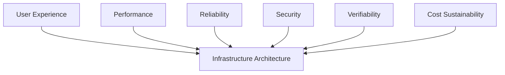

本章では、技術性能を事業計画と切り離さず、

> **1ユーザー、1再生、1クリエイター、1分配あたりのコストを把握できるインフラ**

を目標とする。

---

## 12.2 インフラの基本方針

Creator First Platform は、すべてをブロックチェーン上で実行するシステムではない。

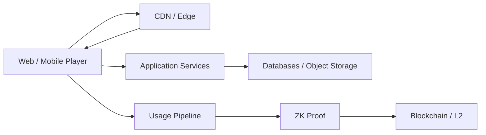

大量・低遅延の処理はオフチェーンで行い、

- Commitment
- Proof
- Distribution State
- Governance State

など、検証可能性が必要な情報をオンチェーンへ接続する。

---

## 12.3 User Experience を性能要件の起点にする

性能目標はサーバー側の都合ではなく、利用者が感じる品質から逆算する。

音楽サービスで重要なのは、

1. ページが速く開く
2. 検索結果がすぐ出る
3. 再生ボタンを押すとすぐ音が出る
4. 曲の途中で止まらない
5. 次曲への遷移が自然
6. 障害時にも可能な範囲で再生を継続できる

ことである。


ブロックチェーン確認時間やZK Proof生成時間を音楽再生のクリティカルパスへ入れない。

---

## 12.4 Performance SLO

初期のサービス目標として以下を設定する。

| 指標 | 目標 |
| --- | ---: |
| API Read p50 | 100 ms以下 |
| API Read p95 | 300 ms以下 |
| API Read p99 | 1 s以下 |
| 検索 p95 | 500 ms以下 |
| Playback Start p50 | 500 ms以下 |
| Playback Start p95 | 1.5 s以下 |
| Playback Start p99 | 3 s以下 |
| Track Transition | 500 ms以下を目標 |
| Playback Availability | 99.95%以上 |
| Core API Availability | 99.9%以上 |
| Governance / Creator Console | 99.9%以上 |

これらは初期設計値であり、実測に基づいて改訂する。

---

## 12.5 p95 と p99

平均値だけではUXを評価しない。

例えば100回のAPIアクセスのうち95回が300 ms以内なら、

$$
L_{p95} \leq 300\text{ ms}
$$

と表す。

平均が速くても、一部のユーザーが数秒待たされるサービスは快適ではない。

したがって、

> **p50 / p95 / p99**

を継続監視する。

---

## 12.6 Playback Start Time

再生開始時間を、

$$
T_{play}
=
T_{UI}
+
T_{auth}
+
T_{manifest}
+
T_{network}
+
T_{buffer}
+
T_{decode}
$$

と分解する。

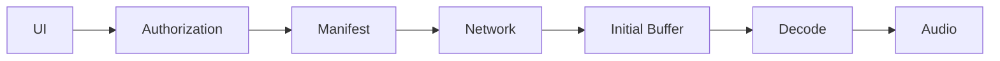

どの要素が遅延を生んでいるかを測定可能にする。

---

## 12.7 音源配信

音源ファイルをApplication Serverから直接配信しない。


Object Storage + CDNを基本構成とする。

これにより、

- Application Server負荷
- 帯域コスト
- 世界各地への遅延

を抑える。

---

## 12.8 Adaptive Streaming

通信環境に応じて複数の品質を提供する。

例として、

- 96 kbps
- 160 kbps
- 256 kbps
- Lossless

等を用意し、ネットワーク状況や契約プランに応じて選択する。

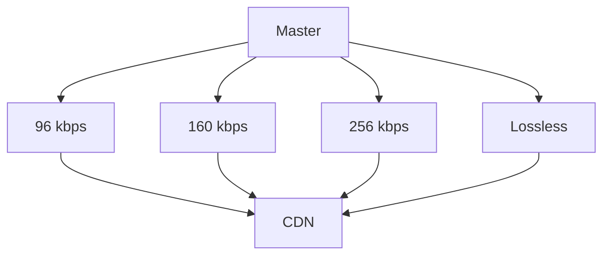

---

## 12.9 1再生あたりのデータ量

平均ビットレートを $b$ bit/s、平均再生時間を $t$ 秒とすると、

$$
D_{play}
=
\frac{b t}{8}
$$

である。

例えば160 kbpsで4分再生する場合、

$$
D_{play}
=
\frac{160,000 \times 240}{8}
=
4.8\text{ MB}
$$

程度になる。

100万再生なら単純計算で、

$$
4.8\text{ MB} \times 10^6
=
4.8\text{ TB}
$$

となる。

音楽サービスでは、APIより**音声転送量**がコストの大きな要素になり得る。

---

## 12.10 CDN Cache Hit Ratio

CDNのCache Hit Ratioを、

$$
H
=
\frac{R_{cache}}{R_{total}}
$$

とする。

$H$ を高くすることで、

- Origin負荷
- Origin帯域
- レイテンシ

を削減する。

人気曲だけでなくLong Tail作品も扱うCreator First Platformでは、キャッシュ戦略が重要になる。

---

## 12.11 Long Tail とコスト

Creator First Platform は有名曲だけでなく、新人・小規模クリエイターの作品発見を重視する。

そのため、

> 人気上位1%の曲だけを効率良く配信できる設計

では不十分である。

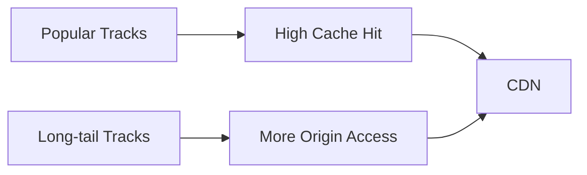

Long Tail比率を事業KPIと同時にインフラKPIとして監視する。

---

## 12.12 API Architecture

初期段階では、必要以上にMicroservices化しない。

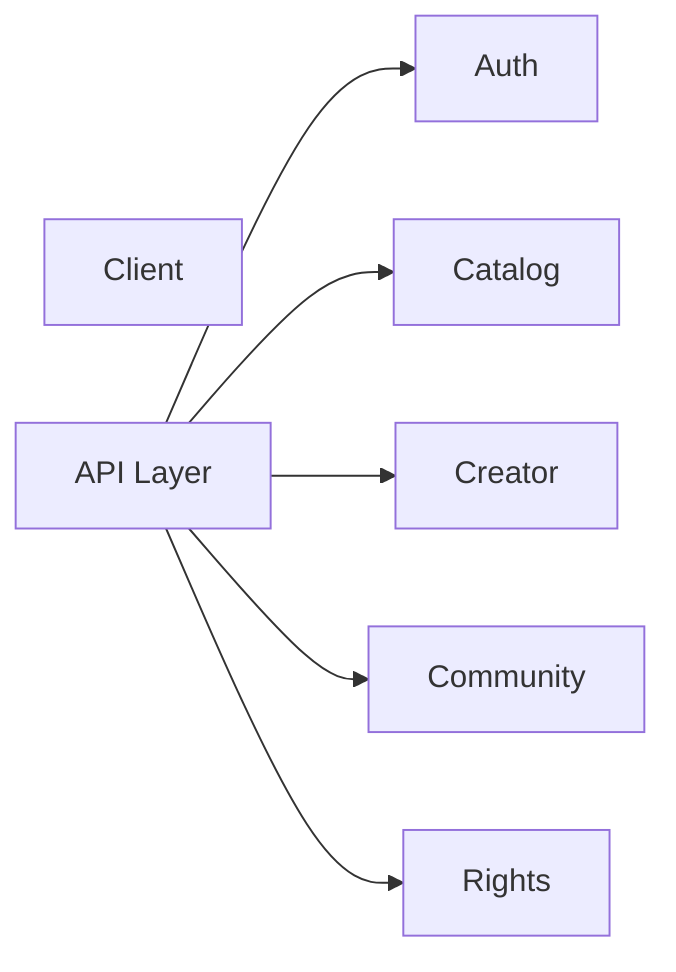

MVPではModular Monolithまたは少数サービスから開始し、負荷特性や組織規模に応じて分割する。

> **Microservicesはスケーラビリティ技術であると同時に、運用コストを増加させる技術でもある。**

---

## 12.13 Database

用途に応じてデータを分離する。

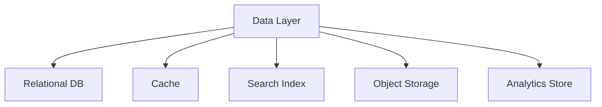

### Relational DB

- User
- Creator
- Rights
- Subscription
- Contract Metadata

### Cache

- Session
- Hot Metadata
- Recommendation Cache

### Search Index

- Artist
- Track
- Album
- Community Content

### Object Storage

- Audio
- Artwork
- Documents

### Analytics Store

- Playback Events
- Aggregated Usage

---

## 12.14 Playback Event Pipeline

再生イベントを同期的にDBへ書き込んでから音楽を再生する設計にはしない。

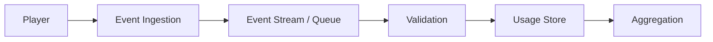

イベント処理を非同期化することで、Usage Pipeline障害がPlaybackへ波及するのを防ぐ。

---

## 12.15 Event Throughput

同時利用者数を $U_c$、1ユーザーあたり平均イベント発生率を $r_e$ events/s とすると、

$$
TPS_{event}
=
U_c r_e
$$

である。

例えば同時利用者10万人が平均30秒に1イベント送信するなら、

$$
TPS_{event}
=
100,000 \times \frac{1}{30}
\approx 3,333
$$

events/sとなる。

ピーク設計では平均ではなくPeak Factor $k_p$ を掛け、

$$
TPS_{peak}
=
k_p TPS_{event}
$$

を容量計画に用いる。

---

## 12.16 Usage Event をオンチェーンへ直接送らない

各再生イベントをブロックチェーンへ送る構造は採用しない。

仮に1日1億再生なら、

$$
10^8
$$

件/日のオンチェーントランザクションが必要になる。

代わりに、

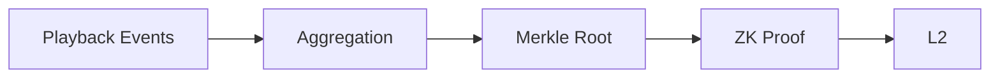

とする。

---

## 12.17 Batch Processing

期間 $t$ のイベント集合を、

$$
E_t = \{e_1,e_2,\ldots,e_n\}
$$

とする。

そこから、

$$
R_t = \operatorname{MerkleRoot}(E_t)
$$

を生成し、集計結果とProofをまとめてオンチェーンへ提出する。

Batch Sizeを大きくすると1イベントあたりのBlockchain Costは低下する。

---

## 12.18 ZK/STARK Infrastructure

ZK Proof生成は、通常のWeb APIとは異なる計算負荷を持つ。

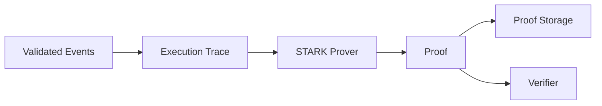

ProverはCPU、RAM、場合によってはGPUを多く使用するため、常時最大構成で稼働させるのではなく、Batch Jobとしてスケールさせる。

---

## 12.19 Proof Latency

ZK Proofは再生開始に必要ない。

したがって、

$$
T_{proof} \notin T_{play}
$$

とする。

Proof生成には数分以上かかっても、分配周期内に完了すればよい。

例えば、

- Playback：1秒単位
- Usage Aggregation：分〜時間単位
- Proof：時間単位
- Distribution：日次〜月次

という異なる時間軸を許容する。

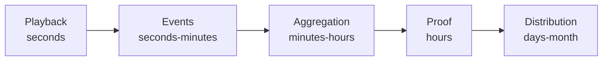

---

## 12.20 Progressive ZK Deployment

MVPから完全なSTARK基盤を構築する必要はない。

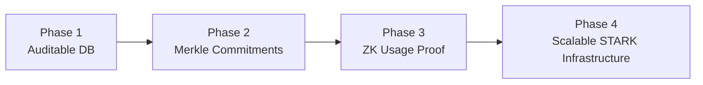

これにより、事業検証前にZK Infrastructureへ過剰投資することを避ける。

---

## 12.21 Blockchain / L2

オンチェーン処理は、

- Distribution Root
- Claim
- Treasury
- Governance
- Protocol Version
- ZK Verification

等へ限定する。

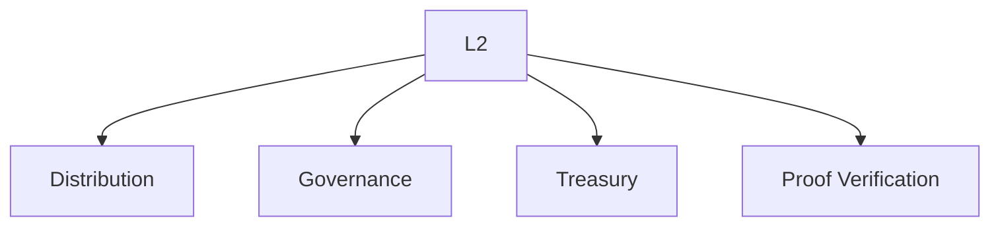

Ethereum Mainnetへすべて直接書き込むのではなく、要件に応じてL2を利用する。

---

## 12.22 Gas Cost Model

期間あたりのオンチェーンコストを、

$$
C_{chain}
=
N_{tx}
\cdot
G_{avg}
\cdot
P_{gas}
$$

とする。

- $N_{tx}$：Transaction数
- $G_{avg}$：平均Gas使用量
- $P_{gas}$：Gas単価を通貨換算した値

Batch化によって $N_{tx}$ を抑えることが重要である。

---

## 12.23 Claim型分配

多数のCreatorへPlatformが一括Push送金するより、

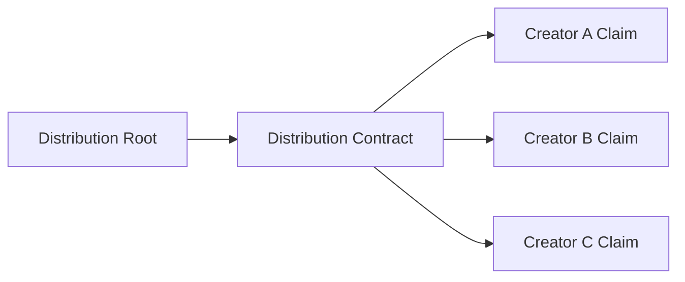

Creatorが必要な時にClaimする方式を検討する。

これにより、分配処理のGas負担や失敗処理を分散できる。

ただし、少額CreatorにGas負担を押し付ける設計にならないよう、Gas Sponsorship等も検討する。

---

## 12.24 Wallet UX

一般の音楽クリエイターや利用者へ、

- Seed Phrase
- Gas Token
- Chain ID
- RPC

を理解することを要求しない。

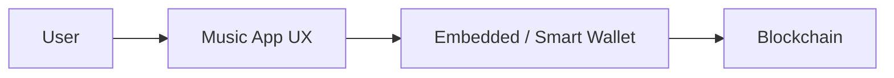

ブロックチェーンはインフラとして利用し、UXでは可能な限り抽象化する。

---

## 12.25 Gas Sponsorship

利用者のガバナンス投票やCreator Claimでは、必要に応じてPlatformがGasをスポンサーする。

月間Gas Sponsorship Costを、

$$
C_{sponsor}
=
N_{sponsored}
\cdot
C_{tx}
$$

とする。

これをCreator/User Participation Costとして事業計画に含める。

---

## 12.26 可用性設計

すべてのコンポーネントを同じ可用性にしない。

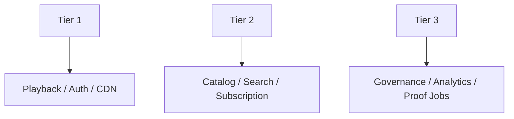

Playbackは最も高い可用性を要求する。

Proof Jobが一時停止しても、音楽再生は継続できる設計にする。

---

## 12.27 Availability と停止時間

Availability $A$ を、

$$
A
=
1-\frac{T_{down}}{T_{total}}
$$

とする。

概算では、

| Availability | 年間停止時間 |
| --- | ---: |
| 99.0% | 約87.6時間 |
| 99.9% | 約8.76時間 |
| 99.95% | 約4.38時間 |
| 99.99% | 約52.6分 |

高可用性は無料ではない。

99.99%を全機能へ要求するのではなく、UXと事業影響から必要な場所を選ぶ。

---

## 12.28 Multi-AZ

本番DB、API等は単一障害点を避ける。

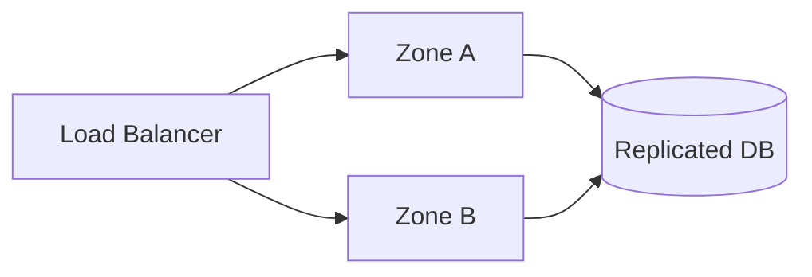

MVPでは単一Region + Multi-AZを基本候補とし、国際展開に応じてMulti-Region化を検討する。

---

## 12.29 Disaster Recovery

RPOとRTOをサービス別に定義する。

例：

| システム | RPO | RTO |
| --- | ---: | ---: |
| Rights / Contract Data | 5分以下 | 1時間以下 |
| Subscription | 5分以下 | 1時間以下 |
| Playback Metadata | 15分以下 | 1時間以下 |
| Analytics | 24時間以下 | 24時間以下 |
| Governance State | Blockchain + Backup | 数時間以内 |
| Audio Masters | 原則データ損失なし | 数時間〜 |

---

## 12.30 Observability

監視はCPU使用率だけでは不十分である。

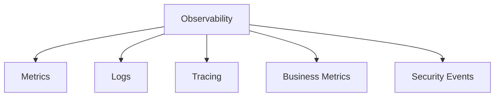

技術指標と事業指標を接続する。

例えば、

- Playback Start p95
- Buffering Ratio
- API Error Rate
- Active Users
- Plays/min
- Fraud Rate
- Proof Queue Length
- Distribution Delay

を同じ運用画面から追跡可能にする。

---

## 12.31 Error Budget

SLOを99.95%とした場合、

$$
E = 1 - 0.9995 = 0.0005
$$

が許容エラー率である。

Error Budgetを使い、

> 新機能開発を優先するか、信頼性改善を優先するか

を判断する。

---

## 12.32 Cost Architecture

月間インフラ費用を、

$$
C_{infra}
=
C_{compute}
+
C_{db}
+
C_{storage}
+
C_{cdn}
+
C_{network}
+
C_{search}
+
C_{observability}
+
C_{security}
+
C_{zk}
+
C_{chain}
+
C_{backup}
$$

とする。

```mermaid
flowchart TD
    COST[Infrastructure Cost]

    COST --> CDN[CDN / Transfer]
    COST --> COMPUTE[Compute]
    COST --> DB[Database]
    COST --> STORAGE[Storage]
    COST --> ZK[ZK Prover]
    COST --> CHAIN[Blockchain]
    COST --> OBS[Monitoring]
    COST --> SEC[Security]
```

---

## 12.33 Fixed Cost と Variable Cost

インフラ費用を、

$$
C_{infra}
=
C_{fixed}
+
C_{variable}
$$

に分ける。

### Fixed Cost

- 最小DB
- Monitoring
- CI/CD
- Backup
- Security Services
- Base Compute

### Variable Cost

- CDN転送
- Playback
- API
- ZK計算
- Blockchain
- Storage増加

利用者数が少ない段階ではFixed Cost比率が高く、成長するとVariable Costが重要になる。

---

## 12.34 1再生あたりコスト

月間再生数を $N_p$ とすると、

$$
C_{play}
=
\frac{C_{infra}}{N_p}
$$

で1再生あたりインフラコストを求められる。

より詳細には、

$$
C_{play}
=
C_{audio}
+
C_{api}
+
C_{event}
+
C_{proof}
+
C_{chain}
$$

と分解する。

---

## 12.35 1ユーザーあたりインフラコスト

MAUを $U$ とすると、

$$
C_{user}
=
\frac{C_{infra}}{U}
$$

である。

有料会員数 $U_p$ を用いる場合、

$$
C_{paid}
=
\frac{C_{infra}}{U_p}
$$

も重要な指標となる。

---

## 12.36 Unit Economics

月額料金を $P$、Creator等への分配率を $r_c$、決済費率を $r_p$、ユーザーあたりインフラコストを $C_u$ とすると、単純化したContribution Marginは、

$$
M
=
P(1-r_c-r_p)-C_u
$$

である。

```mermaid
flowchart LR
    PRICE[Subscription]
    CREATOR[Creator Distribution]
    PAYMENT[Payment Cost]
    INFRA[Infrastructure]
    MARGIN[Contribution Margin]

    PRICE --> CREATOR
    PRICE --> PAYMENT
    PRICE --> INFRA
    PRICE --> MARGIN
```

Creator Firstである以上、Creator分配率を下げることで利益を作るモデルを第一選択にしない。

したがって、

> **インフラ効率を高めること自体がCreatorへの還元余力を増やす**

という考え方を採る。

---

## 12.37 Cost per Listening Hour

音楽サービスでは1再生より再生時間が適切な場合がある。

総インフラコストを $C$、総再生時間を $H$ とすると、

$$
C_h
=
\frac{C}{H}
$$

で1 listening hourあたりコストを算出する。

音質プランごとの帯域差もこの指標へ反映する。

---

## 12.38 事業シナリオ

事業計画では少なくとも3つのシナリオを持つ。

```mermaid
flowchart LR
    S1[MVP]
    S2[Growth]
    S3[Scale]

    S1 --> S2 --> S3
```

| 指標 | MVP | Growth | Scale |
| --- | ---: | ---: | ---: |
| MAU | 10,000 | 100,000 | 1,000,000 |
| 有料会員 | 2,000 | 30,000 | 300,000 |
| 月間再生 | 1,000,000 | 20,000,000 | 300,000,000 |
| 登録Creator | 500 | 10,000 | 100,000 |
| 同時再生Peak | 500 | 10,000 | 100,000 |

これらは予測値ではなく、容量計画を比較するための基準シナリオである。

---

## 12.39 コストモデル例

例えば月間コストを次のように入力する。

| 項目 | MVP | Growth | Scale |
| --- | ---: | ---: | ---: |
| Compute | ¥100,000 | ¥500,000 | ¥3,000,000 |
| Database / Cache | ¥100,000 | ¥400,000 | ¥2,000,000 |
| Storage | ¥30,000 | ¥150,000 | ¥800,000 |
| CDN / Network | ¥100,000 | ¥1,000,000 | ¥10,000,000 |
| Search / Analytics | ¥30,000 | ¥300,000 | ¥2,000,000 |
| Monitoring / Security | ¥100,000 | ¥300,000 | ¥1,500,000 |
| ZK / Proof | ¥0〜¥50,000 | ¥200,000 | ¥1,500,000 |
| Blockchain / L2 | ¥20,000 | ¥100,000 | ¥500,000 |
| Backup / DR | ¥30,000 | ¥100,000 | ¥500,000 |

> [!WARNING]
> この表は料金見積りではなく、予算モデルを作るための**仮置き例**である。音質、地域、CDN契約、クラウド割引、Proof方式、L2、利用パターンによって大きく変化する。

重要なのは数値そのものではなく、これを毎月実績値へ置き換えられる構造にすることである。

---

## 12.40 Revenue Scenario

月額料金を $P$、有料会員を $U_p$ とすると、

$$
R_{subscription}
=
P U_p
$$

である。

例えば月額¥1,000、有料会員30,000人なら、

$$
R_{subscription}
=
1,000 \times 30,000
=
¥30,000,000
$$

/月となる。

ここから、

- Creator / Rights Holder Distribution
- 決済手数料
- Infrastructure
- 人件費
- 権利処理費
- 法務・監査
- マーケティング
- その他運営費

を賄う。

---

## 12.41 Infrastructure Ratio

売上に対するインフラ費率を、

$$
R_{infra}
=
\frac{C_{infra}}{R_{revenue}}
$$

とする。

成長時にこの比率が急上昇する場合、事業モデルがスケールしていない可能性がある。

一方、UXやセキュリティを犠牲にしてインフラ費を下げることも避ける。

---

## 12.42 Creator First Cost Allocation

インフラコストをCreatorごとに単純転嫁しない。

新人Creatorの再生数が少ないために、

> 「固定費を回収できないCreatorは登録できない」

という構造にすると、Creator Firstの理念と矛盾する。

```mermaid
flowchart TD
    PLATFORM[Platform Economy]
    POP[Popular Creators]
    LONG[Long-tail Creators]
    NEW[New Creators]

    PLATFORM --> POP
    PLATFORM --> LONG
    PLATFORM --> NEW
```

共通インフラはプラットフォーム全体で負担し、作品発見の多様性を維持する。

---

## 12.43 FinOps

クラウド費用を経理部門だけの問題にしない。

```mermaid
flowchart LR
    ENGINEER[Engineering]
    FINANCE[Finance]
    PRODUCT[Product]
    FINOPS[FinOps]

    ENGINEER --> FINOPS
    FINANCE --> FINOPS
    PRODUCT --> FINOPS
```

各サービスに、

- Owner
- Cost Center
- Usage Metric
- Budget
- Alert

を設定する。

---

## 12.44 Cost Anomaly Detection

通常のアクセス増加と、攻撃・バグによる異常コストを区別する。

```mermaid
flowchart LR
    USAGE[Usage]
    COST[Cloud Cost]
    MODEL[Expected Cost]
    ANOMALY[Anomaly]
    ALERT[Alert]

    USAGE --> MODEL
    COST --> ANOMALY
    MODEL --> ANOMALY
    ANOMALY --> ALERT
```

例えば無限Retryが発生すると、ユーザー数が増えていないのにAPI費用だけが急増する可能性がある。

---

## 12.45 Autoscaling

負荷に応じてComputeを増減させる。

```mermaid
flowchart LR
    LOAD[Traffic]
    METRIC[Metrics]
    SCALE[Autoscaler]
    COMPUTE[Compute]

    LOAD --> METRIC --> SCALE --> COMPUTE
```

ただし、AutoscalingだけではDDoS時に「攻撃者のためにクラウド費用を増やす」可能性があるため、WAF・Rate Limitと組み合わせる。

---

## 12.46 Capacity Planning

必要容量を、

$$
Q_{required}
=
Q_{peak}
\times
S
$$

とする。

$S$ は安全余裕係数である。

例えばPeak 10,000 req/sに対し $S=1.5$ なら、

$$
Q_{required}
=
15,000 \text{ req/s}
$$

を設計容量とする。

---

## 12.47 Load Test

本番開始前に、

- API Load Test
- Playback Start Test
- CDN Test
- Event Ingestion Test
- Database Failover Test
- Proof Queue Test

を実施する。

```mermaid
flowchart LR
    MODEL[Expected Traffic]
    TEST[Load Test]
    BOTTLENECK[Bottleneck]
    FIX[Optimization]
    RETEST[Retest]

    MODEL --> TEST --> BOTTLENECK --> FIX --> RETEST
```

---

## 12.48 Performance Budget

新機能ごとに性能Budgetを持つ。

例えば再生開始時間1.5秒を、

$$
1.5s
=
0.2s_{UI}
+
0.2s_{API}
+
0.3s_{manifest}
+
0.5s_{network}
+
0.3s_{buffer}
$$

のように分配する。

新機能がBudgetを超える場合は、他の処理を改善するか設計を見直す。

---

## 12.49 Search と Discovery

第8章の発見機能はUX上重要である。

検索では、

$$
T_{search,p95} \leq 500\text{ ms}
$$

を初期目標とする。

Recommendationは検索より重い処理になり得るため、事前計算とリアルタイム計算を組み合わせる。

```mermaid
flowchart LR
    DATA[Usage / Content]
    BATCH[Batch Recommendation]
    REAL[Real-time Signals]
    CACHE[Recommendation Cache]
    USER[User]

    DATA --> BATCH --> CACHE
    REAL --> CACHE
    CACHE --> USER
```

---

## 12.50 Recommendation Cost

AI推薦はモデルサイズを大きくすれば必ず良くなるわけではない。

評価指標を、

$$
V_{rec}
=
\frac{\Delta E}{C_{rec}}
$$

と考える。

- $\Delta E$：EngagementやDiscovery価値の改善
- $C_{rec}$：推薦計算コスト

Creator Firstでは、クリック率だけでなく、

- 新人発見
- Creator Diversity
- Long Tail Exposure

も価値指標へ含める。

---

## 12.51 Privacy とAnalytics Cost

すべての生ログを永久保存しない。

```mermaid
flowchart LR
    RAW[Raw Events]
    HOT[Hot Storage]
    AGG[Aggregated Data]
    ARCHIVE[Archive]
    DELETE[Delete]

    RAW --> HOT --> AGG
    HOT --> ARCHIVE
    HOT --> DELETE
```

Retention PolicyはプライバシーだけでなくStorage Cost削減にも寄与する。

---

## 12.52 Development / Staging / Production

環境を分離する。

```mermaid
flowchart LR
    DEV[Development]
    STAGE[Staging]
    PROD[Production]

    DEV --> STAGE --> PROD
```

ただしStagingをProductionと完全同一規模にすると費用が大きい。

構成は近づけつつ、データ量・Compute規模を縮小する。

---

## 12.53 Infrastructure as Code

インフラ設定を手作業だけで管理しない。

```mermaid
flowchart LR
    GIT[Git]
    REVIEW[Review]
    IAC[Infrastructure as Code]
    PLAN[Plan]
    APPLY[Apply]
    CLOUD[Cloud]

    GIT --> REVIEW --> IAC --> PLAN --> APPLY --> CLOUD
```

これにより、

- 再現性
- 監査
- Disaster Recovery
- AI Agentによる支援

を容易にする。

---

## 12.54 AI Agent とインフラ運用

AI Agentは、

- Terraform等の変更案
- CI/CD設定
- Cost Report
- Log Analysis
- Performance Regression検出
- Documentation更新

を支援できる。

しかし、

```mermaid
flowchart LR
    AI[AI Agent]
    PR[Pull Request]
    TEST[Automated Checks]
    HUMAN[Human / Governance Review]
    PROD[Production]

    AI --> PR --> TEST --> HUMAN --> PROD
```

とし、AIが本番Treasuryや重要Infrastructureを無制限に直接変更する構造にはしない。

---

## 12.55 GitHub とインフラ

Whitepaper、Protocol Specification、Smart Contract、Infrastructure DefinitionをGitHubで関連付ける。

```text
creator-first-platform/
├── docs/
│   └── whitepaper/
├── protocol/
├── contracts/
├── apps/
├── services/
├── infrastructure/
├── monitoring/
└── .github/
```

将来的には、ホワイトペーパーの性能要件と実装上のSLOを同じRepositoryで追跡可能にする。

---

## 12.56 Infrastructure Governance

重要なインフラ変更をすべて二院制投票にかける必要はない。

```mermaid
flowchart TD
    CHANGE[Infrastructure Change]

    CHANGE --> OPS[Operational]
    CHANGE --> PROTOCOL[Protocol Critical]
    CHANGE --> ECON[Economic / Governance Critical]

    OPS --> TEAM[Engineering]
    PROTOCOL --> REVIEW[Protocol Review]
    ECON --> GOV[Creator + User Governance]
```

例えばDBのIndex追加はEngineering判断でよい。

一方、

- Distribution Algorithm
- Proof Verification
- Treasury
- Governance Executor

に影響する変更はProtocol Governanceと接続する。

---

## 12.57 Performance Governance

ユーザー体験を憲章上の理念と接続する。

Creator Firstであっても、サービスが遅く使いにくければ利用者が増えず、結果としてCreatorへの還元も成立しない。

```mermaid
flowchart LR
    UX[Good UX]
    USERS[User Growth / Retention]
    REVENUE[Revenue]
    CREATOR[Creator Sustainability]

    UX --> USERS --> REVENUE --> CREATOR
```

したがって性能は単なる技術問題ではなく、Creator Economyの基盤である。

---

## 12.58 Business Dashboard

経営とEngineeringが共通して見るDashboardを用意する。

```mermaid
flowchart TD
    DASH[Creator First Dashboard]

    DASH --> UX[Playback p95]
    DASH --> USER[MAU / Paid Users]
    DASH --> CREATOR[Active Creators]
    DASH --> PLAY[Listening Hours]
    DASH --> COST[Infrastructure Cost]
    DASH --> UNIT[Cost / User]
    DASH --> MARGIN[Contribution Margin]
    DASH --> PROOF[Proof Cost]
    DASH --> FRAUD[Fraud Rate]
```

技術KPIと事業KPIを別々の世界にしない。

---

## 12.59 KPI

初期KPIとして、

### UX

- Playback Start p50 / p95 / p99
- Buffering Ratio
- Playback Error Rate
- Search Latency

### Reliability

- Availability
- Error Rate
- MTTR
- Error Budget

### Scale

- Concurrent Users
- Plays/s
- Events/s
- Proofs/day

### Cost

- Cost / MAU
- Cost / Paid User
- Cost / Play
- Cost / Listening Hour
- CDN Cost / Listening Hour
- ZK Cost / Distribution Cycle

### Creator Economy

- Creator Distribution Ratio
- Long Tail Listening Ratio
- Active Creator Count
- New Creator Discovery Rate

を継続監視する。

---

## 12.60 Scale Trigger

「ユーザーが増えそうだから」インフラを複雑化するのではなく、Triggerを定義する。

```mermaid
flowchart LR
    KPI[KPI Threshold]
    REVIEW[Architecture Review]
    SCALE[Scale Decision]
    CHANGE[Infrastructure Change]

    KPI --> REVIEW --> SCALE --> CHANGE
```

例えば、

- DB CPU p95 > 70%
- API p95 > 300 ms
- Queue Lag > 許容値
- CDN Hit Ratio低下
- Proof Queueが分配期限を超える

などをTriggerにする。

---

## 12.61 MVP Infrastructure

MVPでは構成を意図的に小さくする。

```mermaid
flowchart TD
    USER[Users]
    CDN[CDN]
    APP[App / API]
    DB[(Managed DB)]
    OBJECT[Object Storage]
    EVENT[Managed Queue]
    MON[Monitoring]

    USER --> CDN
    USER --> APP
    APP --> DB
    CDN --> OBJECT
    APP --> EVENT
    APP --> MON
```

Managed Serviceを優先し、少人数チームがKubernetes等の複雑な基盤運用に時間を奪われないようにする。

---

## 12.62 Growth Infrastructure

利用規模拡大後、

```mermaid
flowchart TD
    EDGE[Global CDN / Edge]
    API[Autoscaled API]
    CACHE[Distributed Cache]
    DB[(HA Database)]
    SEARCH[Search]
    STREAM[Event Streaming]
    ANALYTICS[Analytics]
    PROVER[ZK Prover Pool]
    L2[L2]

    EDGE --> API
    API --> CACHE
    API --> DB
    API --> SEARCH
    API --> STREAM
    STREAM --> ANALYTICS
    ANALYTICS --> PROVER --> L2
```

へ段階的に拡張する。

---

## 12.63 Global Infrastructure

国際展開時には、

- CDN Edge
- Data Residency
- Latency
- Rights Territory
- Payment Region
- Privacy Regulation

を同時に考慮する。

```mermaid
flowchart TD
    GLOBAL[Global Service]
    GLOBAL --> JP[Japan]
    GLOBAL --> EU[Europe]
    GLOBAL --> US[North America]

    JP --> EDGE1[Regional Edge]
    EU --> EDGE2[Regional Edge]
    US --> EDGE3[Regional Edge]

    GLOBAL --> CONTROL[Global Protocol / Governance]
```

音声配信はEdgeへ分散しつつ、法務・権利・個人情報上必要なデータ境界を維持する。

---

## 12.64 Build vs Buy

すべてを自作しない。

```mermaid
flowchart LR
    FUNCTION[Function]
    DIFFERENTIATOR{Creator Firstの<br/>競争力か?}

    FUNCTION --> DIFFERENTIATOR
    DIFFERENTIATOR -->|Yes| BUILD[Build]
    DIFFERENTIATOR -->|No| BUY[Managed / Partner]
```

自作価値が高い候補：

- Creator Economy
- Rights Graph
- Distribution Logic
- Governance
- Usage Proof

外部サービス活用候補：

- CDN
- Object Storage
- Authentication
- Monitoring
- Email
- 決済
- 一般的なCloud Infrastructure

---

## 12.65 コスト最適化の原則

コスト削減は、

1. 不要な処理をしない
2. 不要なデータを保存しない
3. Batch化する
4. Cacheする
5. Managed Serviceを適切に使う
6. Scale-to-zero可能なJobを分離する
7. オンチェーン処理を最小化する
8. 実測してから最適化する

という順で行う。

```mermaid
flowchart LR
    MEASURE[Measure]
    IDENTIFY[Identify]
    OPT[Optimize]
    VERIFY[Verify UX]
    SAVE[Cost Saving]

    MEASURE --> IDENTIFY --> OPT --> VERIFY --> SAVE
```

---

## 12.66 コスト削減の禁止領域

以下を安易なコスト削減対象にしない。

- Backup
- Security Monitoring
- Rights Data Integrity
- Creator Payout Accuracy
- Critical Audit Logs
- Smart Contract Audit
- Incident Response

短期的なクラウド費削減のために、事業存続リスクを増やさない。

---

## 12.67 3つの憲章との関係

インフラは3つの憲章を技術的に支える。

```mermaid
flowchart TD
    CONST[3つの憲章]

    CONST --> CREATOR[Creator Sustainability]
    CONST --> USER[User Experience / Autonomy]
    CONST --> FAIR[Fair Ecosystem]

    CREATOR --> INFRA[Infrastructure]
    USER --> INFRA
    FAIR --> INFRA
```

### Creator

低コストで正確な分配を可能にする。

### User

高速で安定した音楽体験とプライバシーを提供する。

### Ecosystem

新人・Long Tail作品を含めてスケール可能な基盤を提供する。

---

## 12.68 全体構成

```mermaid
flowchart TD
    USER[Users]
    CREATOR[Creators]

    USER --> EDGE[CDN / Edge]
    CREATOR --> APP[Creator App]

    EDGE --> PLAYER[Player]
    PLAYER --> API[Application API]
    APP --> API

    API --> DB[(Operational DB)]
    API --> SEARCH[Search]
    API --> OBJECT[Object Storage]

    PLAYER --> EVENTS[Usage Events]
    EVENTS --> STREAM[Event Stream]
    STREAM --> VALID[Validation / Fraud Detection]
    VALID --> ANALYTICS[Analytics / Aggregation]

    ANALYTICS --> ROOT[Merkle Commitment]
    ANALYTICS --> PROVER[ZK / STARK Prover]

    ROOT --> L2[Blockchain / L2]
    PROVER --> L2

    L2 --> DIST[Distribution]
    L2 --> GOV[Governance]
    L2 --> TREASURY[Treasury]

    OBS[Observability / FinOps] --> API
    OBS --> STREAM
    OBS --> PROVER
    OBS --> L2
```

---

## 12.69 事業計画との接続

最終的に、インフラ計画は次の関係を継続的に測定する。

$$
\text{Users}
\rightarrow
\text{Listening}
\rightarrow
\text{Infrastructure Load}
\rightarrow
\text{Cost}
\rightarrow
\text{Revenue}
\rightarrow
\text{Creator Distribution}
$$

```mermaid
flowchart LR
    USERS[Users]
    LISTEN[Listening]
    LOAD[Infrastructure Load]
    COST[Cost]
    REV[Revenue]
    DIST[Creator Distribution]

    USERS --> LISTEN --> LOAD --> COST
    USERS --> REV --> DIST
    COST --> REV
```

事業成長によって売上だけでなくCreatorへの分配余力が増える構造を目指す。

---

## 12.70 本章のまとめ

Creator First Platform のインフラは、

> **高速な音楽サービス**

だけでも、

> **分散型プロトコル**

だけでもない。

音楽再生のリアルタイム処理、Rights Management、Usage Pipeline、ZK Proof、Blockchain、Governance、Treasuryを、それぞれ異なる性能・信頼性・コスト要件で組み合わせる。

基本原則は、

- PlaybackをBlockchainやZKの待ち時間から分離する
- AudioはObject Storage + CDNで配信する
- Usage Eventは非同期処理する
- 個別再生をオンチェーン化せずBatch + Commitment + Proofを利用する
- ZK/STARKは段階導入する
- Blockchain処理を必要最小限にする
- p50/p95/p99とSLOでUXを管理する
- Cost / User、Cost / Play、Cost / Listening Hourを測る
- Creator DistributionとInfrastructure Costを同じ事業モデルで管理する
- 成長に応じて段階的にInfrastructureを拡張する

ことである。

```mermaid
flowchart LR
    UX[User Experience]
    SCALE[Scalability]
    VERIFY[Verifiability]
    COST[Cost Efficiency]
    CREATOR[Creator Sustainability]

    UX --> CREATOR
    SCALE --> CREATOR
    VERIFY --> CREATOR
    COST --> CREATOR
```

Creator First Platform において、インフラ効率は単なる技術上の最適化ではない。

> **同じ利用料金から、より多くをCreatorへ還元しながら、利用者には高速で安定したサービスを提供するための事業設計そのもの**

である。

---

## 12.71 次段階の数値モデル

本章の数式を実際の事業計画へ利用するため、次段階ではSpreadsheet等で、

- MAU
- Paid Users
- 月額料金
- Listening Hours
- 平均Bitrate
- CDN単価
- Cloud Compute
- Database
- ZK Proof Cost
- L2 Gas
- Creator Distribution Ratio
- 決済手数料
- 人件費

を変数として持つ。

そこから、

$$
Revenue
$$

$$
Infrastructure\ Cost
$$

$$
Creator\ Distribution
$$

$$
Contribution\ Margin
$$

$$
Cost\ per\ User
$$

$$
Cost\ per\ Listening\ Hour
$$

を自動計算する。

これによりホワイトペーパーの技術仕様を、資金調達・STO・経営判断に利用できる定量的な事業モデルへ接続する。
