# 12. インフラ・デモ・コスト

> [!NOTE]
> 本章の金額は、特定クラウド事業者の価格表を固定的に採用するものではなく、事業計画を更新可能にするための**コストモデル**として示す。実際の予算策定時には、CDN、クラウド、L2、ZK基盤、決済事業者等の最新料金を入力して再計算する。

## 12.1 本章の目的

Creator First Platform のインフラ設計では、単に「サーバーを動かす」ことを目的としない。

同時に満たすべきものは、

- 音楽サービスとして快適なユーザ体験
- 音楽クリエーターへの正確で検証可能な分配
- 利用実績オラクルと ZK 証明の検証可能性
- スマートコントラクトの安全な実行
- 成長に応じたスケーラビリティ
- 事業として持続可能なコスト構造

である。

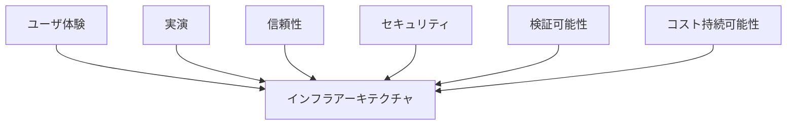

本章では、技術性能を事業計画と切り離さず、

> **1ユーザ、1再生、1音楽クリエーター、1分配あたりのコストを把握できるインフラ**

を目標とする。

---

## 12.2 インフラの基本方針

Creator First Platform は、すべてをブロックチェーン上で実行するシステムではない。

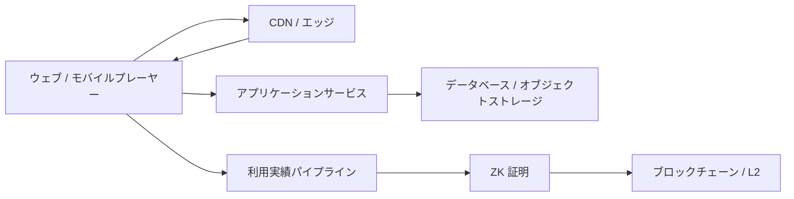

大量・低遅延の処理はオフチェーンで行い、

- コミットメント
- 証明
- 分配状態
- ガバナンス状態

など、検証可能性が必要な情報をオンチェーンへ接続する。

---

## 12.3 ユーザ体験を性能要件の起点にする

性能目標はサーバー側の都合ではなく、ユーザが感じる品質から逆算する。

音楽サービスで重要なのは、

1. ページが速く開く
2. 検索結果がすぐ出る
3. 再生ボタンを押すとすぐ音が出る
4. 曲の途中で止まらない
5. 次曲への遷移が自然
6. 障害時にも可能な範囲で再生を継続できる

ことである。


ブロックチェーン確認時間やZK 証明生成時間を音楽再生のクリティカルパスへ入れない。

---

## 12.4 実演 SLO

初期のサービス目標として以下を設定する。

| 指標 | 目標 |
| --- | ---: |
| API 参照 p50 | 100 ms以下 |
| API 参照 p95 | 300 ms以下 |
| API 参照 p99 | 1 s以下 |
| 検索 p95 | 500 ms以下 |
| 再生開始 p50 | 500 ms以下 |
| 再生開始 p95 | 1.5 s以下 |
| 再生開始 p99 | 3 s以下 |
| 楽曲 Transition | 500 ms以下を目標 |
| 再生可用性 | 99.95%以上 |
| Core API 可用性 | 99.9%以上 |
| ガバナンス / 音楽クリエーターConsole | 99.9%以上 |

これらは初期設計値であり、実測に基づいて改訂する。

---

## 12.5 p95 と p99

平均値だけではUXを評価しない。

例えば100回のAPIアクセスのうち95回が300 ms以内なら、

$$
L_{p95} \leq 300\text{ ms}
$$

と表す。

平均が速くても、一部のユーザが数秒待たされるサービスは快適ではない。

したがって、

> **p50 / p95 / p99**

を継続監視する。

---

## 12.6 再生開始時間

再生開始時間を、

$$
T_{play}
=
T_{UI}
+
T_{auth}
+
T_{manifest}
+
T_{network}
+
T_{buffer}
+
T_{decode}
$$

と分解する。

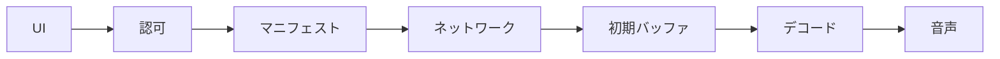

どの要素が遅延を生んでいるかを測定可能にする。

---

## 12.7 音源配信

本番規模拡大では、音源ファイルを一般的なアプリケーション API 手続から直接配信しない。


オブジェクトストレージ + CDNを基本構成とする。

これにより、

- アプリケーションサーバー負荷
- 帯域コスト
- 世界各地への遅延

を抑える。

ただし、最初の最小縦断実装では、実際のHTTP 範囲、Seek、トランスコード、サブスクリプション認可および再生証跡を小さな構成で検証するため、ストリーミングゲートウェイがNavidromeの対応を逐次中継する。


このMVP構成では、音声全体をゲートウェイ Memoryへバッファせず、Backpressure、範囲対応およびクライアント Cancellationを維持する。

ゲートウェイ Relayは帯域とConnectionを消費するため、少なくとも次を規模拡大 Triggerとして計測する。

- 同時ストリーム数
- ゲートウェイ egress帯域
- 再生開始 Time p95 / p99
- Navidrome同時Transcode数
- CPU、MemoryおよびTranscode キャッシュ
- オリジン Errorおよびクライアント Abort率
- 1 聴取 Hour当たりのRelay コスト

定義した閾値を超えた場合、音声 Byte 配信をオブジェクトストレージ + CDN + Short-lived Signed URLへ移す。サブスクリプション、権利および再生セッションは引き続きゲートウェイが判定し、CDNへ渡す許可を短時間トークンとして表現する。

したがって、MVPのゲートウェイ Relayと本番のCDN 配信は矛盾する方式ではなく、同じ認可境界を維持した段階的実装である。詳細は[ADR-0009](/adr/ADR-0009-navidrome-streaming-gateway)を参照する。

---

## 12.8 適応型ストリーミング

通信環境に応じて複数の品質を提供する。

例として、

- 96 kbps
- 160 kbps
- 256 kbps
- ロスレス

等を用意し、ネットワーク状況や契約プランに応じて選択する。

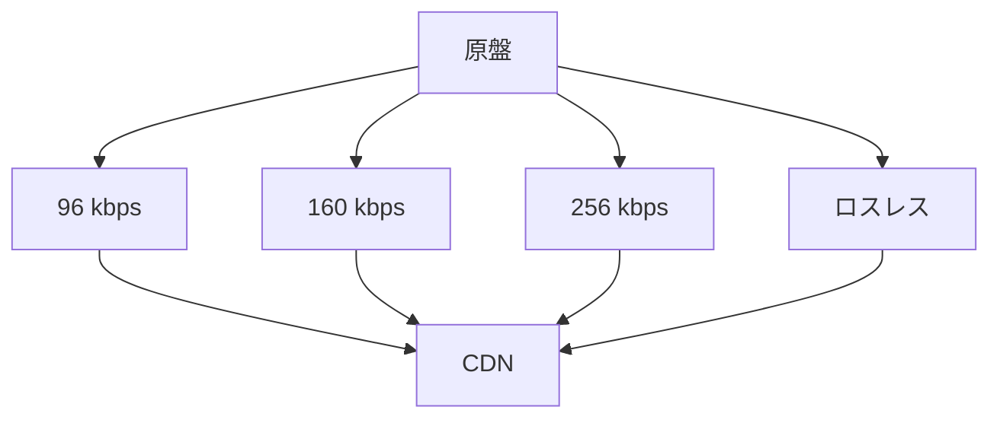

---

## 12.9 1再生あたりのデータ量

平均ビットレートを $b$ bit/s、平均再生時間を $t$ 秒とすると、

$$
D_{play}
=
\frac{b t}{8}
$$

である。

例えば160 kbpsで4分再生する場合、

$$
D_{play}
=
\frac{160,000 \times 240}{8}
=
4.8\text{ MB}
$$

程度になる。

100万再生なら単純計算で、

$$
4.8\text{ MB} \times 10^6
=
4.8\text{ TB}
$$

となる。

音楽サービスでは、APIより**音声転送量**がコストの大きな要素になり得る。

---

## 12.10 CDNキャッシュヒット率

CDNのキャッシュヒット Ratioを、

$$
H
=
\frac{R_{cache}}{R_{total}}
$$

とする。

$H$ を高くすることで、

- オリジン負荷
- オリジン帯域
- レイテンシ

を削減する。

人気曲だけでなくLong Tail作品も扱うCreator First Platformでは、キャッシュ戦略が重要になる。

---

## 12.11 ロングテールとコスト

Creator First Platform は有名曲だけでなく、新人・小規模音楽クリエーターの作品発見を重視する。

そのため、

> 人気上位1%の曲だけを効率良く配信できる設計

では不十分である。

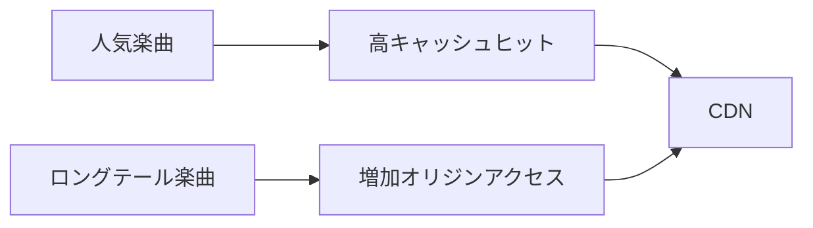

Long Tail比率を事業KPIと同時にインフラKPIとして監視する。

---

## 12.12 API アーキテクチャ

初期段階では、必要以上にMicroservices化しない。

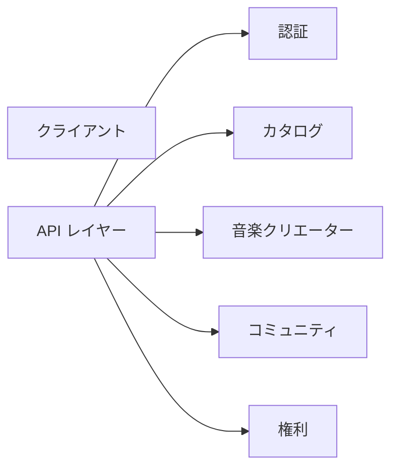

MVPではModular Monolithまたは少数サービスから開始し、負荷特性や組織規模に応じて分割する。

> **Microservicesはスケーラビリティ技術であると同時に、運用コストを増加させる技術でもある。**

---

## 12.13 データベース

用途に応じてデータを分離する。

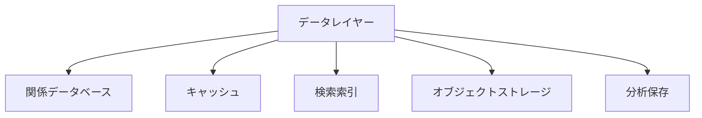

### 関係データベース

- ユーザ
- 音楽クリエーター
- 権利
- サブスクリプション
- コントラクトメタデータ

### キャッシュ

- セッション
- ホットメタデータ
- 推薦キャッシュ

### 検索索引

- アーティスト
- 楽曲
- Album
- コミュニティコンテンツ

### オブジェクトストレージ

- 音声
- Artwork
- Documents

### 分析保存

- 再生イベント
- 集約利用実績

---

## 12.14 再生イベントパイプライン

再生イベントを同期的にDBへ書き込んでから音楽を再生する設計にはしない。


イベント処理を非同期化することで、利用実績パイプライン障害が再生へ波及するのを防ぐ。

---

## 12.15 イベント処理量

同時ユーザ数を $U_c$、1ユーザあたり平均イベント発生率を $r_e$ events/s とすると、

$$
TPS_{event}
=
U_c r_e
$$

である。

例えば同時ユーザ10万人が平均30秒に1イベント送信するなら、

$$
TPS_{event}
=
100,000 \times \frac{1}{30}
\approx 3,333
$$

events/sとなる。

ピーク設計では平均ではなくPeak Factor $k_p$ を掛け、

$$
TPS_{peak}
=
k_p TPS_{event}
$$

を容量計画に用いる。

---

## 12.16 利用実績イベントをオンチェーンへ直接送らない

各再生イベントをブロックチェーンへ送る構造は採用しない。

仮に1日1億再生なら、

$$
10^8
$$

件/日のオンチェーントランザクションが必要になる。

代わりに、

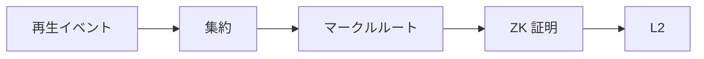

とする。

---

## 12.17 バッチ処理

期間 $t$ のイベント集合を、

$$
E_t = \{e_1,e_2,\ldots,e_n\}
$$

とする。

そこから、

$$
R_t = \operatorname{MerkleRoot}(E_t)
$$

を生成し、集計結果と証明をまとめてオンチェーンへ提出する。

バッチ Sizeを大きくすると1イベントあたりのブロックチェーンコストは低下する。

---

## 12.18 ZK/STARK インフラ

ZK 証明生成は、通常のウェブ APIとは異なる計算負荷を持つ。

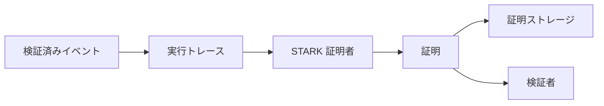

証明者はCPU、RAM、場合によってはGPUを多く使用するため、常時最大構成で稼働させるのではなく、バッチ Jobとしてスケールさせる。

---

## 12.19 証明遅延

ZK 証明は再生開始に必要ない。

したがって、

$$
T_{proof} \notin T_{play}
$$

とする。

証明生成には数分以上かかっても、分配周期内に完了すればよい。

例えば、

- 再生：1秒単位
- 利用実績集約：分〜時間単位
- 証明：時間単位
- 分配：日次〜月次

という異なる時間軸を許容する。


---

## 12.20 段階的 ZK デプロイ

MVPから完全なSTARK基盤を構築する必要はない。


これにより、事業検証前にZK インフラへ過剰投資することを避ける。

---

## 12.21 ブロックチェーン / L2

オンチェーン処理は、

- 分配ルート
- 主張
- 資金庫
- ガバナンス
- プロトコル版
- ZK 検証

等へ限定する。

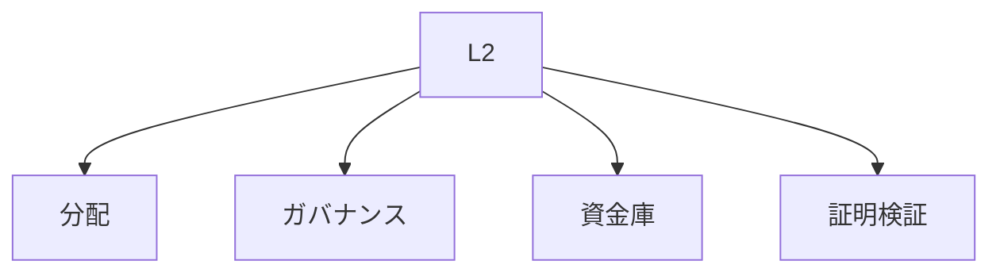

Ethereum Mainnetへすべて直接書き込むのではなく、要件に応じてL2を利用する。

---

## 12.22 ガスコストモデル

期間あたりのオンチェーンコストを、

$$
C_{chain}
=
N_{tx}
\cdot
G_{avg}
\cdot
P_{gas}
$$

とする。

- $N_{tx}$：トランザクション数
- $G_{avg}$：平均ガス使用量
- $P_{gas}$：ガス単価を通貨換算した値

バッチ化によって $N_{tx}$ を抑えることが重要である。

---

## 12.23 主張型分配

多数の音楽クリエーターへプラットフォームが一括Push送金するより、

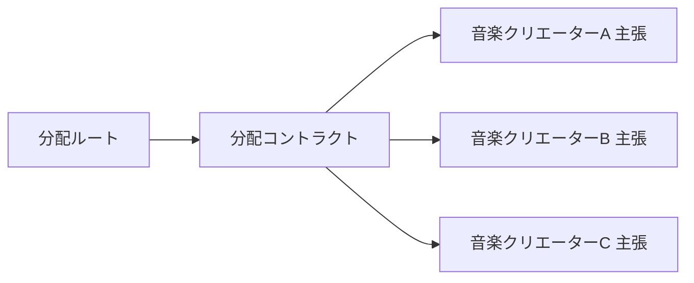

音楽クリエーターが必要な時に主張する方式を検討する。

これにより、分配処理のガス負担や失敗処理を分散できる。

ただし、少額音楽クリエーターにガス負担を押し付ける設計にならないよう、ガス代支援等も検討する。

---

## 12.24 ウォレット UX

一般の音楽クリエーターやユーザへ、

- Seed Phrase
- ガストークン
- チェーン ID
- RPC

を理解することを要求しない。


ブロックチェーンはインフラとして利用し、UXでは可能な限り抽象化する。

---

## 12.25 ガス代支援

ユーザのサブスクリプション決済、初期サポーター SBT発行、ガバナンス投票または音楽クリエーター主張では、必要に応じてプラットフォームがリレイヤーまたはペイマスターを通じてガスをスポンサーする。

月間ガス代支援コストを、

$$
C_{sponsor}
=
N_{sponsored}
\cdot
C_{tx}
$$

とする。

これを音楽クリエーター／ユーザ参加コストとして事業計画に含める。

ガス代支援コストはJPYC等で表示するサブスクリプション価格と分離し、ユーザがETH等でサービス料金を支払ったものとして記録しない。テスト系ではFaucet由来のテストネットガストークンだけを使用し、`MockJPYC`決済とSBT発行を無料で検証する。本番系ではSponsorship上限、対象運用、率制限、失敗時の再送、秘密鍵管理および会計処理を承認済みポリシーとして定義する。

---

## 12.26 可用性設計

すべてのコンポーネントを同じ可用性にしない。

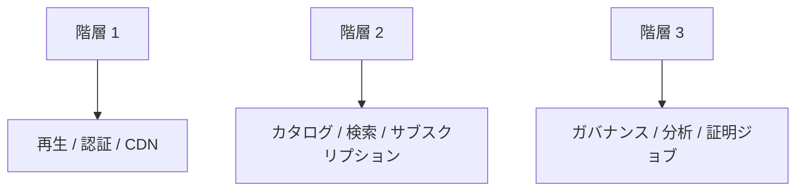

再生は最も高い可用性を要求する。

証明 Jobが一時停止しても、音楽再生は継続できる設計にする。

---

## 12.27 可用性と停止時間

可用性 $A$ を、

$$
A
=
1-\frac{T_{down}}{T_{total}}
$$

とする。

概算では、

| 可用性 | 年間停止時間 |
| --- | ---: |
| 99.0% | 約87.6時間 |
| 99.9% | 約8.76時間 |
| 99.95% | 約4.38時間 |
| 99.99% | 約52.6分 |

高可用性は無料ではない。

99.99%を全機能へ要求するのではなく、UXと事業影響から必要な場所を選ぶ。

---

## 12.28 Multi-AZ

本番DB、API等は単一障害点を避ける。

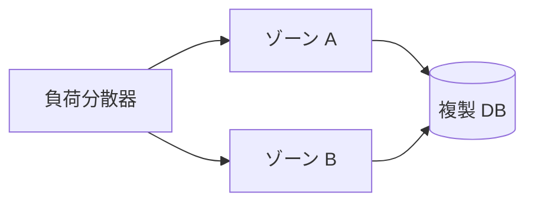

MVPでは単一地域 + Multi-AZを基本候補とし、国際展開に応じてMulti-Region化を検討する。

---

## 12.29 災害復旧

RPOとRTOをサービス別に定義する。

例：

| システム | RPO | RTO |
| --- | ---: | ---: |
| 権利 / コントラクトデータ | 5分以下 | 1時間以下 |
| サブスクリプション | 5分以下 | 1時間以下 |
| 再生メタデータ | 15分以下 | 1時間以下 |
| 分析 | 24時間以下 | 24時間以下 |
| ガバナンス状態 | ブロックチェーン + バックアップ | 数時間以内 |
| 音声 Masters | 原則データ損失なし | 数時間〜 |

---

## 12.30 可観測性

監視はCPU使用率だけでは不十分である。

```mermaid
flowchart TD
    OBS[可観測性]

    OBS --> METRIC[指標]
    OBS --> LOG[ログ]
    OBS --> TRACE[トレーシング]
    OBS --> BIZ[事業指標]
    OBS --> SEC[セキュリティイベント]
```

技術指標と事業指標を接続する。

例えば、

- 再生開始 p95
- Buffering Ratio
- API Error 率
- 有効ユーザ
- 再生回数/min
- 不正率
- 証明一覧 Length
- 分配 Delay

を同じ運用画面から追跡可能にする。

---

## 12.31 エラー予算

SLOを99.95%とした場合、

$$
E = 1 - 0.9995 = 0.0005
$$

が許容エラー率である。

Error 予算を使い、

> 新機能開発を優先するか、信頼性改善を優先するか

を判断する。

---

## 12.32 コストアーキテクチャ

月間インフラ費用を、

$$
C_{infra}
=
C_{compute}
+
C_{db}
+
C_{storage}
+
C_{cdn}
+
C_{network}
+
C_{search}
+
C_{observability}
+
C_{security}
+
C_{zk}
+
C_{chain}
+
C_{backup}
$$

とする。

```mermaid
flowchart TD
    COST[インフラコスト]

    COST --> CDN[CDN / 転送]
    COST --> COMPUTE[コンピュート]
    COST --> DB[データベース]
    COST --> STORAGE[ストレージ]
    COST --> ZK[ZK 証明者]
    COST --> CHAIN[ブロックチェーン]
    COST --> OBS[監視]
    COST --> SEC[セキュリティ]
```

---

## 12.33 固定費と変動費

インフラ費用を、

$$
C_{infra}
=
C_{fixed}
+
C_{variable}
$$

に分ける。

### 固定費

- 最小DB
- 監視
- CI/CD
- バックアップ
- セキュリティサービス
- Base コンピュート

### 変動費

- CDN転送
- 再生
- API
- ZK計算
- ブロックチェーン
- ストレージ増加

ユーザ数が少ない段階ではFixed コスト比率が高く、成長するとVariable コストが重要になる。

---

## 12.34 1再生あたりコスト

月間再生数を $N_p$ とすると、

$$
C_{play}
=
\frac{C_{infra}}{N_p}
$$

で1再生あたりインフラコストを求められる。

より詳細には、

$$
C_{play}
=
C_{audio}
+
C_{api}
+
C_{event}
+
C_{proof}
+
C_{chain}
$$

と分解する。

---

## 12.35 1ユーザあたりインフラコスト

MAUを $U$ とすると、

$$
C_{user}
=
\frac{C_{infra}}{U}
$$

である。

有料会員数 $U_p$ を用いる場合、

$$
C_{paid}
=
\frac{C_{infra}}{U_p}
$$

も重要な指標となる。

---

## 12.36 単位経済性

月額料金を $P$、音楽クリエーター等への分配率を $r_c$、決済費率を $r_p$、ユーザあたりインフラコストを $C_u$ とすると、単純化した貢献利益幅は、

$$
M
=
P(1-r_c-r_p)-C_u
$$

である。

```mermaid
flowchart LR
    PRICE[サブスクリプション]
    CREATOR[音楽クリエーター分配]
    PAYMENT[決済コスト]
    INFRA[インフラ]
    MARGIN[貢献利益幅]

    PRICE --> CREATOR
    PRICE --> PAYMENT
    PRICE --> INFRA
    PRICE --> MARGIN
```

音楽クリエーター中心である以上、音楽クリエーター分配率を下げることで利益を作るモデルを第一選択にしない。

したがって、

> **インフラ効率を高めること自体が音楽クリエーターへの還元余力を増やす**

という考え方を採る。

---

## 12.37 聴取1時間あたりのコスト

音楽サービスでは1再生より再生時間が適切な場合がある。

総インフラコストを $C$、総再生時間を $H$ とすると、

$$
C_h
=
\frac{C}{H}
$$

で1 listening hourあたりコストを算出する。

音質プランごとの帯域差もこの指標へ反映する。

---

## 12.38 事業シナリオ

事業計画では少なくとも3つのシナリオを持つ。

```mermaid
flowchart LR
    S1[MVP]
    S2[成長]
    S3[規模拡大]

    S1 --> S2 --> S3
```

| 指標 | MVP | 成長 | 規模拡大 |
| --- | ---: | ---: | ---: |
| MAU | 10,000 | 100,000 | 1,000,000 |
| 有料会員 | 2,000 | 30,000 | 300,000 |
| 月間再生 | 1,000,000 | 20,000,000 | 300,000,000 |
| 登録音楽クリエーター | 500 | 10,000 | 100,000 |
| 同時再生Peak | 500 | 10,000 | 100,000 |

これらは予測値ではなく、容量計画を比較するための基準シナリオである。

---

## 12.39 コストモデル例

例えば月間コストを次のように入力する。

| 項目 | MVP | 成長 | 規模拡大 |
| --- | ---: | ---: | ---: |
| コンピュート | ¥100,000 | ¥500,000 | ¥3,000,000 |
| データベース / キャッシュ | ¥100,000 | ¥400,000 | ¥2,000,000 |
| ストレージ | ¥30,000 | ¥150,000 | ¥800,000 |
| CDN / ネットワーク | ¥100,000 | ¥1,000,000 | ¥10,000,000 |
| 検索 / 分析 | ¥30,000 | ¥300,000 | ¥2,000,000 |
| 監視 / セキュリティ | ¥100,000 | ¥300,000 | ¥1,500,000 |
| ZK / 証明 | ¥0〜¥50,000 | ¥200,000 | ¥1,500,000 |
| ブロックチェーン / L2 | ¥20,000 | ¥100,000 | ¥500,000 |
| バックアップ / DR | ¥30,000 | ¥100,000 | ¥500,000 |

> [!WARNING]
> この表は料金見積りではなく、予算モデルを作るための**仮置き例**である。音質、地域、CDN契約、クラウド割引、証明方式、L2、利用パターンによって大きく変化する。

重要なのは数値そのものではなく、これを毎月実績値へ置き換えられる構造にすることである。

---

## 12.40 収益シナリオ

月額料金を $P$、有料会員を $U_p$ とすると、

$$
R_{subscription}
=
P U_p
$$

である。

例えば月額¥1,000、有料会員30,000人なら、

$$
R_{subscription}
=
1,000 \times 30,000
=
¥30,000,000
$$

/月となる。

ここから、

- 音楽クリエーター／権利者分配
- 決済手数料
- インフラ
- 人件費
- 権利処理費
- 法務・監査
- マーケティング
- その他運営費

を賄う。

---

## 12.41 インフラ比率

売上に対するインフラ費率を、

$$
R_{infra}
=
\frac{C_{infra}}{R_{revenue}}
$$

とする。

成長時にこの比率が急上昇する場合、事業モデルがスケールしていない可能性がある。

一方、UXやセキュリティを犠牲にしてインフラ費を下げることも避ける。

---

## 12.42 音楽クリエーター中心コスト配分

インフラコストを音楽クリエーターごとに単純転嫁しない。

新人音楽クリエーターの再生数が少ないために、

> 「固定費を回収できない音楽クリエーターは登録できない」

という構造にすると、音楽クリエーター中心の理念と矛盾する。

```mermaid
flowchart TD
    PLATFORM[プラットフォーム経済]
    POP[人気音楽クリエーター]
    LONG[ロングテール音楽クリエーター]
    NEW[新人音楽クリエーター]

    PLATFORM --> POP
    PLATFORM --> LONG
    PLATFORM --> NEW
```

共通インフラはプラットフォーム全体で負担し、作品発見の多様性を維持する。

---

## 12.43 FinOps

クラウド費用を経理部門だけの問題にしない。

```mermaid
flowchart LR
    ENGINEER[エンジニアリング]
    FINANCE[財務]
    PRODUCT[プロダクト]
    FINOPS[FinOps]

    ENGINEER --> FINOPS
    FINANCE --> FINOPS
    PRODUCT --> FINOPS
```

各サービスに、

- Owner
- コスト Center
- 利用実績 Metric
- 予算
- 警告

を設定する。

---

## 12.44 コスト異常検知

通常のアクセス増加と、攻撃・バグによる異常コストを区別する。

```mermaid
flowchart LR
    USAGE[利用実績]
    COST[クラウドコスト]
    MODEL[予想コスト]
    ANOMALY[異常]
    ALERT[警告]

    USAGE --> MODEL
    COST --> ANOMALY
    MODEL --> ANOMALY
    ANOMALY --> ALERT
```

例えば無限Retryが発生すると、ユーザ数が増えていないのにAPI費用だけが急増する可能性がある。

---

## 12.45 自動スケーリング

負荷に応じてコンピュートを増減させる。

```mermaid
flowchart LR
    LOAD[トラフィック]
    METRIC[指標]
    SCALE[自動スケーラー]
    COMPUTE[コンピュート]

    LOAD --> METRIC --> SCALE --> COMPUTE
```

ただし、AutoscalingだけではDDoS時に「攻撃者のためにクラウド費用を増やす」可能性があるため、WAF・率制限と組み合わせる。

---

## 12.46 容量計画

必要容量を、

$$
Q_{required}
=
Q_{peak}
\times
S
$$

とする。

$S$ は安全余裕係数である。

例えばPeak 10,000 req/sに対し $S=1.5$ なら、

$$
Q_{required}
=
15,000 \text{ req/s}
$$

を設計容量とする。

---

## 12.47 負荷テスト

本番開始前に、

- API 負荷テスト
- 再生開始テスト
- CDN テスト
- イベント取込みテスト
- データベース Failover テスト
- 証明一覧テスト

を実施する。

```mermaid
flowchart LR
    MODEL[予想トラフィック]
    TEST[負荷テスト]
    BOTTLENECK[ボトルネック]
    FIX[最適化]
    RETEST[再テスト]

    MODEL --> TEST --> BOTTLENECK --> FIX --> RETEST
```

---

## 12.48 実演予算

新機能ごとに性能予算を持つ。

例えば再生開始時間1.5秒を、

$$
1.5s
=
0.2s_{UI}
+
0.2s_{API}
+
0.3s_{manifest}
+
0.5s_{network}
+
0.3s_{buffer}
$$

のように分配する。

新機能が予算を超える場合は、他の処理を改善するか設計を見直す。

---

## 12.49 検索と発見

第8章の発見機能はUX上重要である。

検索では、

$$
T_{search,p95} \leq 500\text{ ms}
$$

を初期目標とする。

推薦は検索より重い処理になり得るため、事前計算とリアルタイム計算を組み合わせる。

```mermaid
flowchart LR
    DATA[利用実績 / コンテンツ]
    BATCH[バッチ推薦]
    REAL[リアルタイムシグナル]
    CACHE[推薦キャッシュ]
    USER[ユーザ]

    DATA --> BATCH --> CACHE
    REAL --> CACHE
    CACHE --> USER
```

---

## 12.50 推薦コスト

AI推薦はモデルサイズを大きくすれば必ず良くなるわけではない。

評価指標を、

$$
V_{rec}
=
\frac{\Delta E}{C_{rec}}
$$

と考える。

- $\Delta E$：Engagementや発見価値の改善
- $C_{rec}$：推薦計算コスト

音楽クリエーター中心では、クリック率だけでなく、

- 新人発見
- 音楽クリエーターの多様性
- Long Tail Exposure

も価値指標へ含める。

---

## 12.51 プライバシーと分析コスト

すべての生ログを永久保存しない。

```mermaid
flowchart LR
    RAW[生のイベント]
    HOT[ホットストレージ]
    AGG[集約データ]
    ARCHIVE[アーカイブ]
    DELETE[削除]

    RAW --> HOT --> AGG
    HOT --> ARCHIVE
    HOT --> DELETE
```

保存期間ポリシーはプライバシーだけでなくストレージコスト削減にも寄与する。

---

## 12.52 開発・ステージング・本番

環境を分離する。

```mermaid
flowchart LR
    DEV[開発]
    STAGE[ステージング]
    PROD[本番]

    DEV --> STAGE --> PROD
```

ただしステージングを本番と完全同一規模にすると費用が大きい。

構成は近づけつつ、データ量・コンピュート規模を縮小する。

---

## 12.53 インフラ as コード

インフラ設定を手作業だけで管理しない。

```mermaid
flowchart LR
    GIT[Git]
    REVIEW[レビュー]
    IAC[インフラ as コード]
    PLAN[計画]
    APPLY[適用]
    CLOUD[クラウド]

    GIT --> REVIEW --> IAC --> PLAN --> APPLY --> CLOUD
```

これにより、

- 再現性
- 監査
- 災害復旧
- AI エージェントによる支援

を容易にする。

---

## 12.54 AI エージェントとインフラ運用

AI エージェントは、

- Terraform等の変更案
- CI/CD設定
- コスト報告
- Log Analysis
- 実演 Regression検出
- 文書更新

を支援できる。

しかし、

```mermaid
flowchart LR
    AI[AI エージェント]
    PR[プルリクエスト]
    TEST[自動検査]
    HUMAN[人間 / ガバナンスレビュー]
    PROD[本番]

    AI --> PR --> TEST --> HUMAN --> PROD
```

とし、AIが本番資金庫や重要インフラを無制限に直接変更する構造にはしない。

---

## 12.55 GitHub とインフラ

ホワイトペーパー、プロトコル仕様、スマートコントラクト、インフラ DefinitionをGitHubで関連付ける。

```text
creator-first-platform/
├── docs/
│   └── whitepaper/
├── protocol/
├── contracts/
├── apps/
├── services/
├── infrastructure/
├── monitoring/
└── .github/
```

将来的には、ホワイトペーパーの性能要件と実装上のSLOを同じリポジトリで追跡可能にする。

---

## 12.56 インフラガバナンス

重要なインフラ変更をすべて二院制投票にかける必要はない。

```mermaid
flowchart TD
    CHANGE[インフラ変更]

    CHANGE --> OPS[運用事項]
    CHANGE --> PROTOCOL[プロトコル重大]
    CHANGE --> ECON[経済 / ガバナンス重大]

    OPS --> TEAM[エンジニアリング]
    PROTOCOL --> REVIEW[プロトコルレビュー]
    ECON --> GOV[音楽クリエーター + ユーザガバナンス]
```

例えばDBの索引追加はエンジニアリング判断でよい。

一方、

- 分配アルゴリズム
- 証明検証
- 資金庫
- ガバナンス実行者

に影響する変更はプロトコルガバナンスと接続する。

---

## 12.57 実演ガバナンス

ユーザ体験を憲章上の理念と接続する。

音楽クリエーター中心であっても、サービスが遅く使いにくければユーザが増えず、結果として音楽クリエーターへの還元も成立しない。

```mermaid
flowchart LR
    UX[良好な UX]
    USERS[ユーザ成長 / 保存期間]
    REVENUE[収益]
    CREATOR[音楽クリエーターの持続可能性]

    UX --> USERS --> REVENUE --> CREATOR
```

したがって性能は単なる技術問題ではなく、音楽クリエーター経済の基盤である。

---

## 12.58 事業ダッシュボード

経営とエンジニアリングが共通して見るダッシュボードを用意する。

```mermaid
flowchart TD
    DASH[音楽クリエーター中心ダッシュボード]

    DASH --> UX[再生 p95]
    DASH --> USER[MAU / 有料ユーザ]
    DASH --> CREATOR[有効音楽クリエーター]
    DASH --> PLAY[聴取時間]
    DASH --> COST[インフラコスト]
    DASH --> UNIT[コスト / ユーザ]
    DASH --> MARGIN[貢献利益幅]
    DASH --> PROOF[証明コスト]
    DASH --> FRAUD[不正率]
```

技術KPIと事業KPIを別々の世界にしない。

---

## 12.59 KPI

初期KPIとして、

### UX

- 再生開始 p50 / p95 / p99
- Buffering Ratio
- 再生 Error 率
- 検索 Latency

### 信頼性

- 可用性
- Error 率
- MTTR
- Error 予算

### 規模拡大

- Concurrent ユーザ
- 再生回数/s
- イベント/s
- Proofs/day

### コスト

- コスト / MAU
- コスト / 有料ユーザ
- コスト / Play
- コスト / 聴取 Hour
- CDN コスト / 聴取 Hour
- ZK コスト / 分配 Cycle

### 音楽クリエーター経済

- 音楽クリエーター分配 Ratio
- Long Tail 聴取 Ratio
- 有効音楽クリエーターCount
- 新人音楽クリエーター発見率

を継続監視する。

---

## 12.60 規模拡大の判断条件

「ユーザが増えそうだから」インフラを複雑化するのではなく、Triggerを定義する。

```mermaid
flowchart LR
    KPI[KPI しきい値]
    REVIEW[アーキテクチャレビュー]
    SCALE[規模拡大決定]
    CHANGE[インフラ変更]

    KPI --> REVIEW --> SCALE --> CHANGE
```

例えば、

- DB CPU p95 > 70%
- API p95 > 300 ms
- 一覧 Lag > 許容値
- CDN ヒット Ratio低下
- 証明一覧が分配期限を超える

などをTriggerにする。

---

## 12.61 MVP インフラ

MVPでは構成を意図的に小さくする。

```mermaid
flowchart TD
    USER[ユーザ]
    CDN[CDN]
    APP[アプリ / API]
    DB[(マネージド DB)]
    OBJECT[オブジェクトストレージ]
    EVENT[マネージド一覧]
    MON[監視]

    USER --> CDN
    USER --> APP
    APP --> DB
    CDN --> OBJECT
    APP --> EVENT
    APP --> MON
```

マネージドサービスを優先し、少人数チームがKubernetes等の複雑な基盤運用に時間を奪われないようにする。

---

## 12.62 成長インフラ

利用規模拡大後、

```mermaid
flowchart TD
    EDGE[国際 CDN / エッジ]
    API[自動スケール API]
    CACHE[分散キャッシュ]
    DB[(HA データベース)]
    SEARCH[検索]
    STREAM[イベントストリーミング]
    ANALYTICS[分析]
    PROVER[ZK 証明者プール]
    L2[L2]

    EDGE --> API
    API --> CACHE
    API --> DB
    API --> SEARCH
    API --> STREAM
    STREAM --> ANALYTICS
    ANALYTICS --> PROVER --> L2
```

へ段階的に拡張する。

---

## 12.63 国際インフラ

国際展開時には、

- CDN エッジ
- データ Residency
- Latency
- 権利地域
- 決済地域
- プライバシー規制

を同時に考慮する。

```mermaid
flowchart TD
    GLOBAL[国際サービス]
    GLOBAL --> JP[日本]
    GLOBAL --> EU[欧州]
    GLOBAL --> US[北米]

    JP --> EDGE1[地域エッジ]
    EU --> EDGE2[地域エッジ]
    US --> EDGE3[地域エッジ]

    GLOBAL --> CONTROL[国際プロトコル / ガバナンス]
```

音声配信はエッジへ分散しつつ、法務・権利・個人情報上必要なデータ境界を維持する。

---

## 12.64 自社構築と外部調達

すべてを自作しない。

```mermaid
flowchart LR
    FUNCTION[機能]
    DIFFERENTIATOR{音楽クリエーター中心の<br/>競争力か?}

    FUNCTION --> DIFFERENTIATOR
    DIFFERENTIATOR -->|はい| BUILD[ビルド]
    DIFFERENTIATOR -->|No| BUY[マネージド / パートナー]
```

自作価値が高い候補：

- 音楽クリエーター経済
- 権利 Graph
- 分配 Logic
- ガバナンス
- 利用実績証明

外部サービス活用候補：

- CDN
- オブジェクトストレージ
- 認証
- 監視
- Email
- 決済
- 一般的なクラウドインフラ

---

## 12.65 コスト最適化の原則

コスト削減は、

1. 不要な処理をしない
2. 不要なデータを保存しない
3. バッチ化する
4. キャッシュする
5. マネージドサービスを適切に使う
6. Scale-to-zero可能なJobを分離する
7. オンチェーン処理を最小化する
8. 実測してから最適化する

という順で行う。

```mermaid
flowchart LR
    MEASURE[測定]
    IDENTIFY[特定]
    OPT[最適化]
    VERIFY[検証 UX]
    SAVE[コスト削減]

    MEASURE --> IDENTIFY --> OPT --> VERIFY --> SAVE
```

---

## 12.66 コスト削減の禁止領域

以下を安易なコスト削減対象にしない。

- バックアップ
- セキュリティ監視
- 権利データ完全性
- 音楽クリエーター支払 Accuracy
- 重大監査ログ
- スマートコントラクト監査
- インシデント対応

短期的なクラウド費削減のために、事業存続リスクを増やさない。

---

## 12.67 3つの憲章との関係

インフラは3つの憲章を技術的に支える。

```mermaid
flowchart TD
    CONST[3つの憲章]

    CONST --> CREATOR[音楽クリエーターの持続可能性]
    CONST --> USER[ユーザ体験 / 自律性]
    CONST --> FAIR[公正なエコシステム]

    CREATOR --> INFRA[インフラ]
    USER --> INFRA
    FAIR --> INFRA
```

### 音楽クリエーター

低コストで正確な分配を可能にする。

### ユーザ

高速で安定した音楽体験とプライバシーを提供する。

### エコシステム

新人・Long Tail作品を含めてスケール可能な基盤を提供する。

---

## 12.68 全体構成

```mermaid
flowchart TD
    USER[ユーザ]
    CREATOR[音楽クリエーター]

    USER --> EDGE[CDN / エッジ]
    CREATOR --> APP[音楽クリエーターアプリ]

    EDGE --> PLAYER[プレーヤー]
    PLAYER --> API[アプリケーション API]
    APP --> API

    API --> DB[(運用事項 DB)]
    API --> SEARCH[検索]
    API --> OBJECT[オブジェクトストレージ]

    PLAYER --> EVENTS[利用実績イベント]
    EVENTS --> STREAM[イベントストリーム]
    STREAM --> VALID[検証 / 不正検知]
    VALID --> ANALYTICS[分析 / 集約]

    ANALYTICS --> ROOT[Merkle コミットメント]
    ANALYTICS --> PROVER[ZK / STARK 証明者]

    ROOT --> L2[ブロックチェーン / L2]
    PROVER --> L2

    L2 --> DIST[分配]
    L2 --> GOV[ガバナンス]
    L2 --> TREASURY[資金庫]

    OBS[可観測性 / FinOps] --> API
    OBS --> STREAM
    OBS --> PROVER
    OBS --> L2
```

---

## 12.69 事業計画との接続

最終的に、インフラ計画は次の関係を継続的に測定する。

$$
\text{ユーザ}
\rightarrow
\text{聴取}
\rightarrow
\text{インフラ負荷}
\rightarrow
\text{コスト}
\rightarrow
\text{収益}
\rightarrow
\text{音楽クリエーター分配}
$$

```mermaid
flowchart LR
    USERS[ユーザ]
    LISTEN[聴取]
    LOAD[インフラ負荷]
    COST[コスト]
    REV[収益]
    DIST[音楽クリエーター分配]

    USERS --> LISTEN --> LOAD --> COST
    USERS --> REV --> DIST
    COST --> REV
```

事業成長によって売上だけでなく音楽クリエーターへの分配余力が増える構造を目指す。

---

## 12.70 本章のまとめ

Creator First Platform のインフラは、

> **高速な音楽サービス**

だけでも、

> **分散型プロトコル**

だけでもない。

音楽再生のリアルタイム処理、権利管理、利用実績パイプライン、ZK 証明、ブロックチェーン、ガバナンス、資金庫を、それぞれ異なる性能・信頼性・コスト要件で組み合わせる。

基本原則は、

- 再生をブロックチェーンやZKの待ち時間から分離する
- 音声はオブジェクトストレージ + CDNで配信する
- 利用実績イベントは非同期処理する
- 個別再生をオンチェーン化せずバッチ + コミットメント + 証明を利用する
- ZK/STARKは段階導入する
- ブロックチェーン処理を必要最小限にする
- p50/p95/p99とSLOでUXを管理する
- コスト / ユーザ、コスト / Play、コスト / 聴取 Hourを測る
- 音楽クリエーター分配とインフラコストを同じ事業モデルで管理する
- 成長に応じて段階的にインフラを拡張する

ことである。

```mermaid
flowchart LR
    UX[ユーザ体験]
    SCALE[拡張性]
    VERIFY[検証可能性]
    COST[コスト効率]
    CREATOR[音楽クリエーターの持続可能性]

    UX --> CREATOR
    SCALE --> CREATOR
    VERIFY --> CREATOR
    COST --> CREATOR
```

Creator First Platform において、インフラ効率は単なる技術上の最適化ではない。

> **同じ利用料金から、より多くを音楽クリエーターへ還元しながら、ユーザには高速で安定したサービスを提供するための事業設計そのもの**

である。

---

## 12.71 次段階の数値モデル

本章の数式を実際の事業計画へ利用するため、次段階ではSpreadsheet等で、

- MAU
- 有料ユーザ
- 月額料金
- 聴取時間
- 平均Bitrate
- CDN単価
- クラウドコンピュート
- データベース
- ZK 証明コスト
- L2 ガス
- 音楽クリエーター分配 Ratio
- 決済手数料
- 人件費

を変数として持つ。

そこから、

$$
収益
$$

$$
インフラ\ コスト
$$

$$
音楽クリエーター\ 分配
$$

$$
貢献\ 利益幅
$$

$$
コスト\ per\ ユーザ
$$

$$
コスト\ per\ 聴取\ Hour
$$

を自動計算する。

これによりホワイトペーパーの技術仕様を、資金調達・STO・経営判断に利用できる定量的な事業モデルへ接続する。
