# 13. ロードマップ — Roadmap

> [!NOTE]
> 本章は Creator First Platform の理念、権利、経済、技術、ガバナンス、法務、セキュリティ、インフラを実装へ接続するロードマップである。
>
> 本ロードマップは固定日程ではなく、各段階の成立条件を確認して次へ進む **Stage-Gate方式**を採用する。

## 13.1 ロードマップの基本思想

Creator First Platformは、最初から完成したDAO、STO、Zero-Knowledge基盤、国際サービスを一度に構築するものではない。

基本順序を、

> **理念・憲章 → 法的基盤 → Music MVP → Creator Economy → Verifiable Platform → 抽選議会と熟議 → Protocol Governance → STO & Scale → International Expansion**

とする。

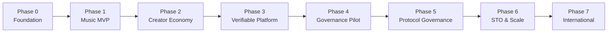

---

## 13.2 最終的な統治モデル

ロードマップ全体が目指すGovernanceの中心構造は、

> **Creator/User → 抽選議会 → 熟議 → Protocol Specification → Smart Contract → 自動執行**

である。

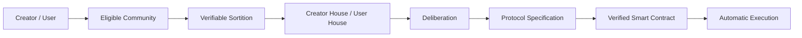

ただし、この構造をサービス開始時から全面稼働させるのではない。

実際のCreator/User Communityが成立し、代表性、抽選、熟議、安全なコード執行を検証した後に段階的に権限を移す。

---

## 13.3 主権と議会

Creator HouseとUser Houseは主権者そのものではない。

主権の源泉は、

- Creator Community
- User Community

にある。

抽選議会は、一定期間だけ統治機能を委ねられた熟議機関である。

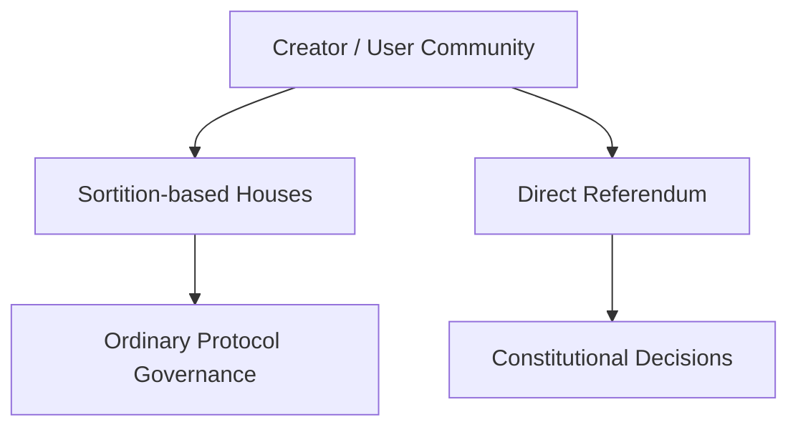

通常のProtocol変更は議会が担当し、憲章変更などの重大事項ではCommunity全体によるReferendumを利用する。

---

## 13.4 規範の階層

すべてのPhaseで次の関係を維持する。

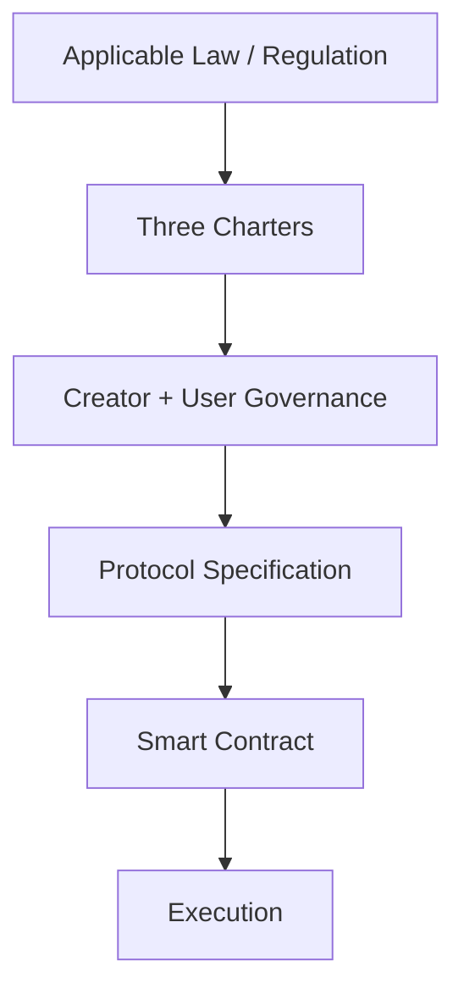

すなわち、

> **Law > Three Charters > Governance > Protocol Specification > Code**

である。

Codeの正統性はCode自身ではなく、その上位にある正統なGovernance Processから生じる。

---

## 13.5 Phase 0 — Foundation

Phase 0では、何を作るかだけでなく、**誰が責任を持ち、誰が将来統治するのか**を定義する。

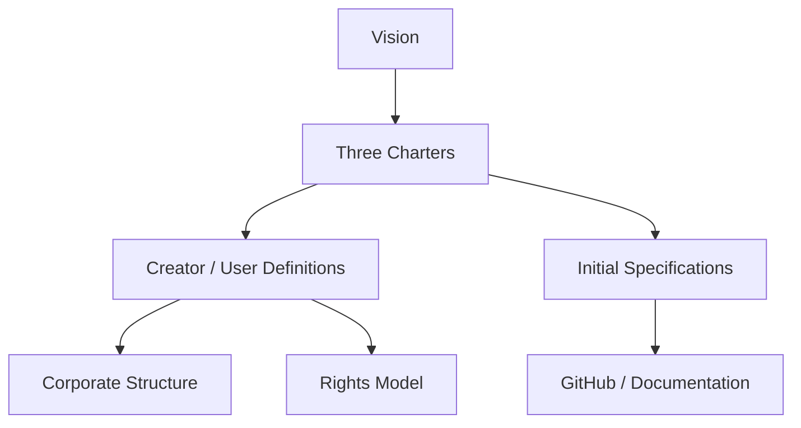

### 主な成果物

- Whitepaper v1.0
- Creator Charter
- User Charter
- Ecosystem Charter
- Creator / Rights Holderの定義
- User / Governance Eligible User / Governance Memberの定義
- 株式会社の基本設計
- Creator Agreement案
- 利用規約案
- Privacy Policy案
- Rights Model
- Protocol Specificationの初期構造
- GitHub Repository
- VitePress公開文書
- AI共同開発ルール

---

## 13.6 3つの憲章

3つの憲章はPlatform内部の最上位規範である。

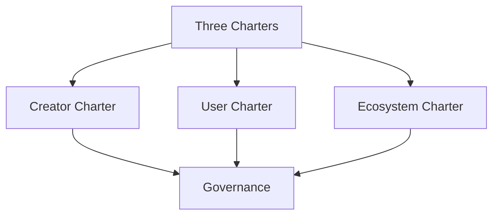

通常のGovernance Proposalによって憲章を実質的に無効化できない制度を構築する。

---

## 13.7 CreatorとUserを先に定義する

Governanceを設計する前に、Governanceの正統性の源泉となる主体を定義する。

### Creator

作品の創作・制作に実質的に関与し、所定の登録・検証を経た参加者。

CreatorとRights Holderは区別する。

### User

Platformを利用してコンテンツを聴取、発見、評価、共有、支援等する参加者。

### Governance Eligible User

実利用、Sybil耐性等の条件を満たし、User Houseの抽選母集団へ参加できるUser。

### Governance Member

Eligible Communityから抽選され、一定期間だけ熟議と意思決定を委ねられた代表者。

---

## 13.8 WhitepaperからCodeへ

開発フローを、

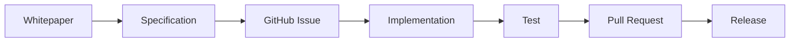

とする。

将来Governanceが稼働した後は、

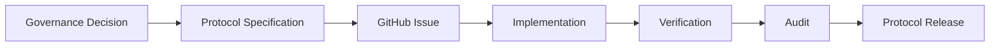

へ発展させる。

---

## 13.9 Phase 0 Gate

Phase 1へ進む条件は、

- Visionが明文化されている
- 3つの憲章が定義されている
- Creator/User等の主体定義がある
- Rights Modelが説明できる
- Corporate GovernanceとProtocol Governanceが区別されている
- MVP Scopeが定義されている
- RepositoryとCIが動作する
- 法務上の主要論点が整理されている
- MVP予算の概算がある

ことである。

---

## 13.10 Phase 1 — Music MVP

Phase 1では音楽サービスとしての価値を検証する。

> BlockchainやGovernanceを実装することではなく、CreatorとUserが実際に利用したいサービスを成立させることが目的である。

実装は、**Local Mock → 公開Testnetデモ → Review／Audit → 本番系**の順序で進める。本番系を先行実装したり、Testnet用の鍵、Contract、Token、Rights Fixture、運用権限をそのまま本番へ流用したりしない。

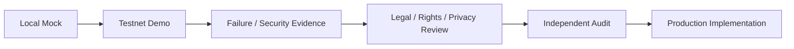

Testnetデモでは、金銭的価値を持たないAsset、合成Account、Mock Rights、公開可能な音源Fixtureを使用する。対象Network、Contract Address、Source Commit、既知の制約を公開し、利用者が本番サービスと誤認しない表示を行う。

現在のLocal MockはPhase 1のPlayer／Gateway再生境界と署名UIに加え、Hardhat 3上のTestnet専用MockJPYC決済、Treasury、Supporter SBTおよびCreator Registry Contractの一部を検証している。決済・SBT ContractはEthereum Sepoliaへデプロイし、公開Test User JourneyからMockJPYC Subscriptionを操作できる。Test Creator JourneyとCreator Registryは、仮名Profileと作品／権利自己申告Commitmentだけを扱い、追加Deployment待ちである。いずれも本番Account、Rights、Payeeまたは配信公開の代替ではなく、Gateway／Indexerも未接続であるため、Authenticator、本番決済、Rights／Credential Read Model、Usage／Distribution連携を完了したものとして数えない。

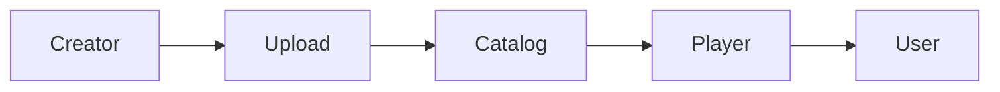

---

## 13.11 MVP機能

### User

- アカウント
- 楽曲検索
- 楽曲再生
- Playlist
- Creatorページ
- Subscription

### Creator

- Creator登録
- 作品登録
- Rights Metadata
- Artwork / Audio Upload
- 基本Analytics

### Platform

- Catalog
- Audio Delivery
- Usage Event
- Admin
- Monitoring

---

## 13.12 MVPで実装を急がないもの

初期MVPでは、

- 完全オンチェーン分配
- 本格的Zero-Knowledge Proof
- 完全な二院制Protocol Governance
- STO
- 世界同時展開

を必須条件としない。

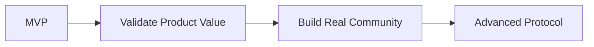

Governanceを先に作るのではなく、Governanceが代表すべき実際のCreator/User Communityを先に成立させる。

---

## 13.13 MVPで測定するもの

- Active Users
- Paid Conversion
- Listening Hours
- Playback Start p95
- Buffering Ratio
- Creator登録数
- Active Creators
- Upload数
- Repeat Listening
- New Creator Discovery

を測る。

この段階から将来のGovernance設計のため、

- User Activity Distribution
- Creator Activity Distribution
- 地域的分布
- 利用形態

も匿名性・Privacyに配慮しながら分析する。

---

## 13.14 Phase 1 Gate

Phase 2へ進む条件は、

> **音楽サービスとして継続利用される兆候と、実際のCreator/User Communityが存在すること**

である。

加えて、本番系の実装へ進む前に、Testnetデモの再現可能なSource Commit、Network／Contract情報、失敗試験、Security Review、Rights／Legal／Privacy上の承認条件、鍵と権限の本番分離を確認する。

---

## 13.15 Phase 2 — Creator Economy

Phase 2ではCreatorへの経済的価値還元を実装する。

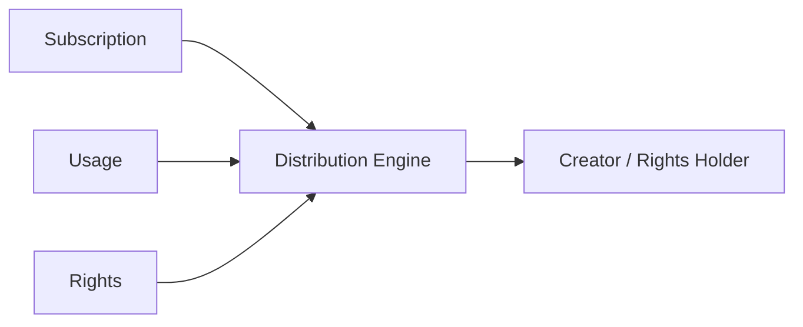

---

## 13.16 Rights Registry

Creator情報と法的Rights情報を区別して管理する。

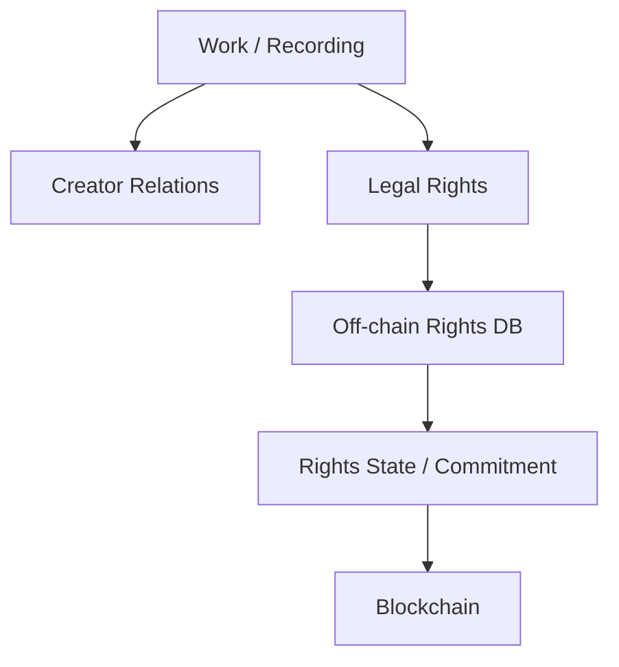

個人情報、契約全文、税務情報等を無条件にBlockchainへ保存しない。

---

## 13.17 Distribution Engine

第6章の経済モデルを実装する。

考慮対象には、

- Usage
- Rights
- Fraud Detection
- Discovery
- Creator Support
- Community Policy

を含む。

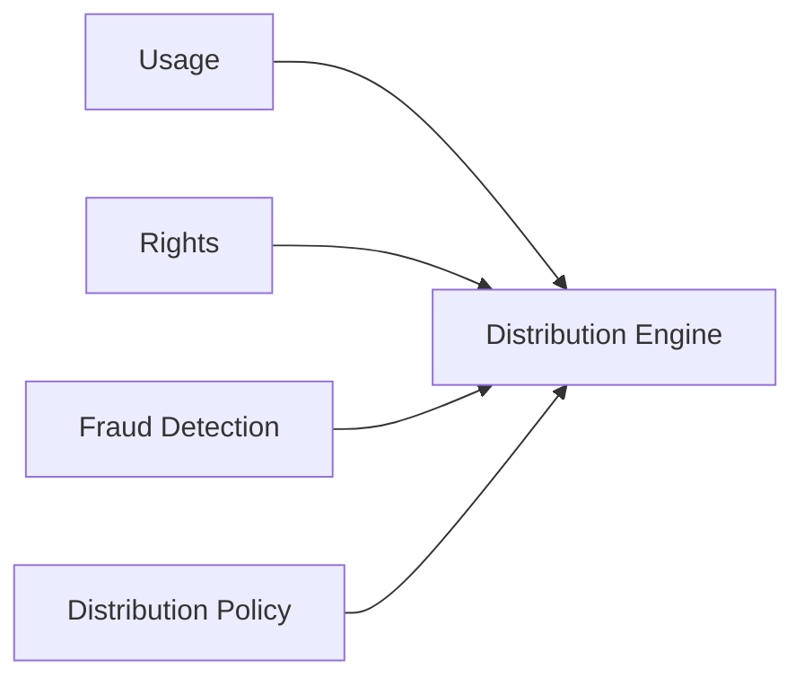

この段階ではDistribution Policyの最終決定権を直ちに抽選議会へ移さず、Community Consultationを開始する。

---

## 13.18 Community Consultation

Creator Economyの運用開始と同時に、将来のGovernanceのための公開Consultationを行う。

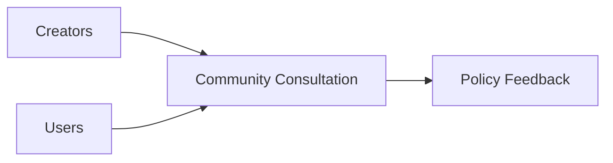

ここで、

- 分配への理解
- Creator/Userの利害対立
- Governanceへの参加意欲
- 重要と考える政策領域

を観察する。

---

## 13.19 Phase 2 Gate

Phase 3へ進む条件は、

- Rights Registryが実運用できる
- Creatorへの分配が正確
- 会計照合が可能
- Fraud Detectionが機能
- Creatorの理解と信頼が得られる
- Unit Economicsを計測できる
- Governance対象となる実際の政策課題が見えている

ことである。

---

## 13.20 Phase 3 — Verifiable Platform

Phase 3では、

> **Platformを信用してください**

から、

> **Platformの重要な計算を検証できます**

へ進む。

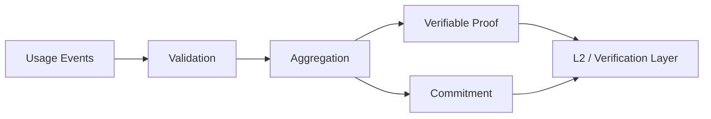

---

## 13.21 Auditable Ledger

最初にUsage Eventと分配計算を再現可能にする。

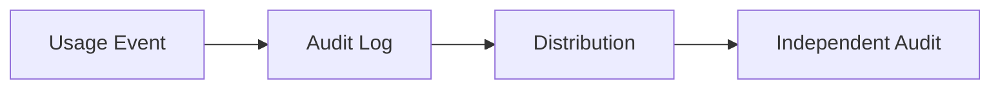

---

## 13.22 Commitment

Usage集合等についてCommitmentを生成する。

例えば、

$$
R_t = \operatorname{MerkleRoot}(E_t)
$$

により、後からイベント集合の整合性を検証可能にする。

---

## 13.23 Zero-Knowledge Proof

要求仕様は、

> **Privacy-preserving Verifiable Usage / Distribution**

である。

zk-STARKは現時点での有力な実装候補だが、特定方式を憲章上の必須技術とはしない。

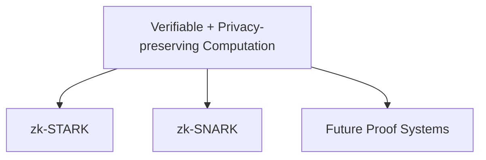

Proof SystemはSecurity、Cost、Privacy、Performance、長期保守性を比較して選択する。

---

## 13.24 Phase 3 Gate

Phase 4へ進む条件は、

- Usage Pipelineが安定
- Commitmentが再現可能
- Distribution Calculationが監査可能
- Proof Systemの実証がある
- Proof Costが許容範囲
- Security Reviewが完了
- Governanceに必要なデータの検証可能性が確立し始めている

ことである。

---

## 13.25 Phase 4 — Governance Pilot

ここから抽選議会を実証する。

最初からSmart Contract変更権限を与えず、**Advisory Governance**として開始する。

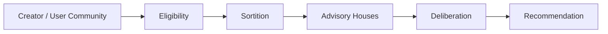

---

## 13.26 Eligibilityの実証

User Houseでは、

```text
User
 ↓
Active / Verified User
 ↓
Governance Eligible User
```

という資格体系を実証する。

Creator Houseでは、

```text
Creator
 ↓
Verified Creator
 ↓
Governance Eligible Creator
```

とする。

目的は政治参加を狭めることではなく、

- Sybil Attack
- Bot
- 架空Creator
- 資本による大量アカウント支配

を防ぎながら、通常のCreator/Userが参加できる母集団を形成することである。

---

## 13.27 Verifiable Sortition

抽選は運営会社の非公開処理にしない。

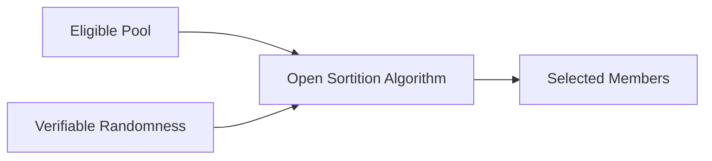

抽選母集団、Randomness、Algorithm、結果を可能な範囲で検証可能にする。

---

## 13.28 抽選議会

Pilotでは、

- Creator House
- User House

を一定人数で構成し、任期制とする。

MemberはGovernance専門家である必要はない。

Platform側は、

- Orientation
- Technical Briefing
- Legal Briefing
- Economic Simulation
- Neutral Secretariat
- AI Assistance

を提供する。

---

## 13.29 熟議の実証

```mermaid
flowchart LR
    PROP[Proposal]
    INFO[Evidence / Briefing]
    HEAR[Stakeholder Hearing]
    SIM[Simulation]
    DELIB[Deliberation]
    REC[Recommendation]

    PROP --> INFO --> HEAR --> SIM --> DELIB --> REC
```

このPhaseでは、

> 「抽選で選ばれた普通のCreator/Userが、十分な情報提供によって合理的な熟議を行えるか」

を検証する。

---

## 13.30 Representation Audit

抽選結果がCommunityを極端に歪めていないか監査する。

User Houseでは、

- 利用頻度
- 地域
- Subscription形態
- 利用傾向

Creator Houseでは、

- Creator Role
- 活動規模
- Genre
- 地域

等の偏りを評価する。

必要なら層化抽選等を導入する。

---

## 13.31 Governance Pilot KPI

- Member Participation
- Deliberation Completion
- Community Trust
- Representation
- Member Turnover
- Proposal理解度
- Recommendation Quality
- Governance Cost
- Sybil Resistance

を評価する。

---

## 13.32 Phase 4 Gate

本格的Protocol Governanceへ進む条件は、

- Eligibilityが機能
- 抽選が検証可能
- Creator/User代表性が許容範囲
- Memberが熟議へ参加できる
- 利益相反管理が機能
- Sybil対策がある
- Governance Costが持続可能
- Communityから一定の正統性が認められる

ことである。

---

## 13.33 Phase 5 — Protocol Governance

Phase 5で抽選議会へ実際のProtocol Governance権限を段階的に移す。

```mermaid
flowchart TD
    CHARTER[Three Charters]
    CREATOR[Creator Community]
    USER[User Community]

    CREATOR --> CSORT[Sortition]
    USER --> USORT[Sortition]

    CSORT --> CH[Creator House]
    USORT --> UH[User House]

    CH --> DELIB[Joint Deliberation]
    UH --> DELIB

    CHARTER --> DELIB

    DELIB --> SPEC[Protocol Specification]
    SPEC --> CODE[Verified Code]
    CODE --> EXEC[Automatic Execution]
```

---

## 13.34 権限移譲の順序

いきなりSmart Contract Upgrade権限を移さない。

```mermaid
flowchart LR
    COMMUNITY[Community Policy]
    DISCOVERY[Discovery Policy]
    ECON[Economic Parameters]
    TREASURY[Treasury]
    PROTOCOL[Protocol Changes]
    CODE[Code Governance]

    COMMUNITY --> DISCOVERY --> ECON --> TREASURY --> PROTOCOL --> CODE
```

低リスク領域から実績を積む。

---

## 13.35 Protocol Specification First

議会が直接Source Codeを編集するのではない。

```mermaid
flowchart LR
    DELIB[Deliberation]
    DECISION[Decision]
    SPEC[Protocol Specification]
    DEV[Implementation]
    TEST[Test / Formal Verification]
    AUDIT[Audit]
    TIME[Timelock]
    DEPLOY[Deployment]

    DELIB --> DECISION --> SPEC --> DEV --> TEST --> AUDIT --> TIME --> DEPLOY
```

Governanceは「何を実現するか」を決め、Software Engineering Processが「安全にどう実装するか」を担う。

---

## 13.36 株式会社によるReview

両院承認後、株式会社は自由な政策拒否権を持つのではなく、

- Legal
- Contractual
- Security
- Technical Safety

の観点から執行可能性を確認する。

```mermaid
flowchart TD
    APPROVE[Two-House Approval]
    REVIEW[Legal / Security Review]

    APPROVE --> REVIEW
    REVIEW -->|Executable| IMPLEMENT[Implement]
    REVIEW -->|Illegal / Unsafe| RETURN[Reasoned Return]
    RETURN --> DELIB[Re-deliberation]
```

執行停止時には理由を公開する。

---

## 13.37 Referendum

3つの憲章等の重大事項は抽選議会だけで変更しない。

```mermaid
flowchart TD
    CHANGE[Constitutional Proposal]
    CH[Creator House Supermajority]
    UH[User House Supermajority]
    CR[Creator Referendum]
    UR[User Referendum]

    CHANGE --> CH
    CHANGE --> UH
    CH --> CR
    UH --> UR
    CR --> FINAL[Constitutional Approval]
    UR --> FINAL
```

これにより議会は熟議機関でありながら、主権の源泉をCommunityに残す。

---

## 13.38 Emergency Governance

攻撃等に対する限定的Emergency Authorityを整備する。

```mermaid
flowchart LR
    INCIDENT[Critical Incident]
    PAUSE[Limited Pause]
    DISCLOSE[Disclosure]
    REVIEW[House Review]
    DECIDE[Resume / Upgrade]

    INCIDENT --> PAUSE --> DISCLOSE --> REVIEW --> DECIDE
```

Pause権限、最大期間、再開条件をProtocol Specificationに記述する。

---

## 13.39 AIとProtocol Governance

AI Agentは、

- Proposal Analysis
- Simulation
- Specification Draft
- Code Generation
- Test Generation
- Security Analysis

を支援できる。

しかし、

```mermaid
flowchart LR
    HUMAN[Creator / User Governance]
    SPEC[Approved Specification]
    AI[AI Implementation Support]
    REVIEW[Human + Automated Review]
    CODE[Code]

    HUMAN --> SPEC --> AI --> REVIEW --> CODE
```

とし、AI自身を主権者・議員・最終承認者にはしない。

---

## 13.40 Phase 5 Gate

STO & Scaleへ進む条件は、

- Creator Houseが実運用
- User Houseが実運用
- 抽選とEligibilityが検証可能
- Representation Auditが機能
- 複数のProposal実績
- Specification → Codeの追跡が可能
- Timelock / Emergency Processが機能
- Governance Attack対策がある
- CommunityがGovernanceを正統なものとして受け入れている

ことである。

---

## 13.41 Phase 6 — STO & Scale

STOはPlatform Governanceを作るための前提ではない。

> **事業・Creator Economy・検証可能性・Governanceが実証された後の成長資金調達手段**

として位置付ける。

```mermaid
flowchart LR
    MVP[MVP]
    ECON[Creator Economy]
    VERIFY[Verifiability]
    GOV[Governance]
    STO[STO]
    SCALE[Scale]

    MVP --> ECON --> VERIFY --> GOV --> STO --> SCALE
```

---

## 13.42 STOとProtocol支配を分離する

STO後も、

```mermaid
flowchart TD
    INVESTORS[Shareholders / STO Investors]
    COMPANY[Corporate Governance]

    CREATORS[Creators]
    USERS[Users]

    CREATORS --> CH[Creator House]
    USERS --> UH[User House]

    INVESTORS --> COMPANY

    CH --> PROTOCOL[Protocol Governance]
    UH --> PROTOCOL
```

を維持する。

株式を多く取得したことを理由にUser HouseやCreator Houseの投票力を増加させない。

---

## 13.43 STO準備

STO前に、

- 株式会社の事業実績
- 財務情報
- Creator Economy
- Governance実績
- Security
- Legal Structure
- Tokenと株主権の関係
- 資金使途

を明確化する。

---

## 13.44 Scale Infrastructure

成長資金は需要に応じて、

- Global CDN
- Autoscaling
- Event Infrastructure
- Rights Infrastructure
- Proof Infrastructure
- Security
- Observability

へ投資する。

第12章で定義した、

- Cost / User
- Cost / Play
- Cost / Listening Hour

を監視しながらScaleする。

---

## 13.45 Phase 6 Gate

国際展開へ進む条件は、

- 国内事業モデルが成立
- Creator Distributionが持続可能
- Governanceが安定
- InfrastructureがScale可能
- Security Incident Responseが成熟
- 国際展開資金が確保
- 国際Governanceの設計方針がある

ことである。

---

## 13.46 Phase 7 — International Expansion

国際展開では、

- Rights
- Tax
- Payments
- Privacy
- Financial Regulation
- Creator Community
- Governance Representation

を地域ごとに検討する。

```mermaid
flowchart TD
    GLOBAL[International Expansion]

    GLOBAL --> RIGHTS[Rights]
    GLOBAL --> TAX[Tax]
    GLOBAL --> PAY[Payments]
    GLOBAL --> PRIVACY[Privacy]
    GLOBAL --> FIN[Financial Regulation]
    GLOBAL --> GOV[Governance Representation]
```

---

## 13.47 Global Governance

Creator House/User Houseが国際化すると、単純な世界一律抽選では代表性の問題が起こり得る。

```mermaid
flowchart TD
    GLOBAL[Global Eligible Community]

    GLOBAL --> REGION[Regional Representation]
    GLOBAL --> LANGUAGE[Language Access]
    GLOBAL --> CREATOR[Creator Diversity]
    GLOBAL --> USER[User Diversity]

    REGION --> SORT[Stratified / Verifiable Sortition]
    LANGUAGE --> SORT
    CREATOR --> SORT
    USER --> SORT
```

地域、言語、利用形態等を考慮しながら、抽選制の原則を維持する。

---

## 13.48 技術ロードマップ

```mermaid
flowchart LR
    DOC[Whitepaper]
    MVP[MVP]
    EVENT[Usage Pipeline]
    RIGHTS[Rights Graph]
    DIST[Distribution]
    COMMIT[Commitment]
    ZK[Verifiable Proof]
    GOV[Governance Infrastructure]
    CODE[Protocol Code Governance]
    GLOBAL[Global Scale]

    DOC --> MVP --> EVENT --> RIGHTS --> DIST --> COMMIT --> ZK --> GOV --> CODE --> GLOBAL
```

---

## 13.49 Governanceロードマップ

```mermaid
flowchart LR
    CHARTER[Three Charters]
    CONSULT[Community Consultation]
    ELIG[Eligibility]
    SORT[Advisory Sortition]
    DELIB[Deliberative Houses]
    POLICY[Policy Governance]
    ECON[Economic Governance]
    CODE[Code Governance]

    CHARTER --> CONSULT --> ELIG --> SORT --> DELIB --> POLICY --> ECON --> CODE
```

ここが従来のロードマップからの重要な変更点である。

**二院制を宣言して即座に権限を渡すのではなく、代表性と熟議能力を実証してからCode Governanceへ進む。**

---

## 13.50 Creatorロードマップ

```mermaid
flowchart LR
    EARLY[Early Creators]
    VERIFIED[Verified Creators]
    ECON[Creator Economy]
    CONSULT[Governance Consultation]
    SORT[Sortition Pool]
    HOUSE[Creator House]
    GLOBAL[Global Creator Network]

    EARLY --> VERIFIED --> ECON --> CONSULT --> SORT --> HOUSE --> GLOBAL
```

---

## 13.51 Userロードマップ

```mermaid
flowchart LR
    ALPHA[Alpha Users]
    ACTIVE[Active Users]
    PAID[Paid / Active Community]
    ELIG[Governance Eligible Users]
    SORT[Sortition Pool]
    HOUSE[User House]
    GLOBAL[Global User Community]

    ALPHA --> ACTIVE --> PAID --> ELIG --> SORT --> HOUSE --> GLOBAL
```

User Houseは架空アカウントや資本保有者の集合ではなく、実際のUser Communityから形成する。

---

## 13.52 法務ロードマップ

```mermaid
flowchart LR
    STRUCT[Legal Structure]
    TERMS[Contracts / Terms]
    RIGHTS[Rights Compliance]
    PAY[Payment Compliance]
    GOV[Governance Legal Design]
    STO[STO Compliance]
    GLOBAL[International Compliance]

    STRUCT --> TERMS --> RIGHTS --> PAY --> GOV --> STO --> GLOBAL
```

法務は最後に確認するものではなく、すべてのPhaseと並行する。

---

## 13.53 Securityロードマップ

```mermaid
flowchart LR
    BASE[Secure Development]
    IAM[IAM / Secrets]
    AUDIT[Audit Logs]
    CONTRACT[Contract Audit]
    PROOF[Proof System Review]
    SORT[Sortition Security]
    GOV[Governance Security]
    RED[Incident Drills]

    BASE --> IAM --> AUDIT --> CONTRACT --> PROOF --> SORT --> GOV --> RED
```

GovernanceがProtocol権限を持つ段階では、Governance Attack自体がSecurity Threatになる。

---

## 13.54 Infrastructureロードマップ

```mermaid
flowchart LR
    SIMPLE[Managed MVP]
    SCALE[Autoscaling]
    STREAM[Event Streaming]
    PROOF[Proof Infrastructure]
    GOV[Governance Infrastructure]
    HA[High Availability]
    GLOBAL[Multi-region / Global Edge]

    SIMPLE --> SCALE --> STREAM --> PROOF --> GOV --> HA --> GLOBAL
```

---

## 13.55 AI共同開発ロードマップ

AIは、

- Documentation
- Requirements
- Specification
- Coding
- Testing
- Security Review支援
- Operations
- Governance Analysis

へ利用する。

```mermaid
flowchart LR
    DOC[Documentation AI]
    SPEC[Specification AI]
    DEV[Development AI]
    TEST[Test AI]
    OPS[Operations AI]
    GOV[Governance Support AI]

    DOC --> SPEC --> DEV --> TEST --> OPS --> GOV
```

ただしAIはCreator/UserからGovernanceの正統性を奪わない。

---

## 13.56 GitHubを制度とCodeの履歴にする

GitHubには、

- Whitepaper
- Charters
- Governance Proposals
- Governance Decisions
- Protocol Specifications
- ADR
- Smart Contracts
- Tests
- Infrastructure

を保存する。

```mermaid
flowchart TD
    GIT[GitHub]

    GIT --> WP[Whitepaper]
    GIT --> CHARTER[Charters]
    GIT --> GOV[Governance]
    GIT --> SPEC[Specifications]
    GIT --> ADR[ADR]
    GIT --> CODE[Code]
    GIT --> TEST[Tests]
```

理念から実行Codeまで変更理由を追跡できるようにする。

---

## 13.57 推奨Repository構造

```text
creator-first-platform/
├── docs/
│   └── whitepaper/
├── charters/
├── governance/
│   ├── proposals/
│   ├── decisions/
│   ├── sortition/
│   └── referendums/
├── protocol/
│   ├── specifications/
│   └── versions/
├── docs/
│   └── adr/
├── contracts/
├── apps/
├── services/
├── infrastructure/
├── tests/
└── .github/
```

将来、Governance Decisionと実装Commitを機械的に関連付けられる構造を目指す。

---

## 13.58 Versioning

Whitepaper、Charters、ProtocolをVersion管理する。

```text
Whitepaper v1.0
Charters v1.0
Protocol v0.1

Whitepaper v1.1
Protocol v0.2

Protocol v1.0
```

重要変更は、

```mermaid
flowchart LR
    PROP[Proposal]
    DELIB[Deliberation]
    DECISION[Decision]
    SPEC[Specification]
    PR[Pull Request]
    REVIEW[Verification]
    VERSION[Protocol Version]

    PROP --> DELIB --> DECISION --> SPEC --> PR --> REVIEW --> VERSION
```

として追跡する。

---

## 13.59 WhitepaperはLiving Document

Whitepaperは完成後変更しない宣言文ではない。

> **理念を維持しながら、実証、法律、技術、Creator/User Communityの変化を反映するLiving Document**

とする。

ただし過去Versionを保存し、重要な思想変更を履歴から消さない。

---

## 13.60 Phase別KPI

| Phase | 主要KPI |
| --- | --- |
| Foundation | 仕様完成度・法務論点・開発準備 |
| Music MVP | Active Users・Listening・UX・Active Creators |
| Creator Economy | Creator収益・Rights精度・Unit Economics |
| Verifiable Platform | Auditability・Proof Cost・Fraud Rate |
| Governance Pilot | Representation・Participation・Deliberation Quality |
| Protocol Governance | Proposal Quality・Execution Safety・Community Trust |
| STO & Scale | Growth・資本効率・Infrastructure Efficiency |
| International | 地域別Users・Creators・Rights Coverage・Representation |

---

## 13.61 Governance Health KPI

特にGovernanceでは、

- Representation
- Participation
- Deliberation Quality
- Member Turnover
- Sybil Resistance
- Delegation Concentration
- Proposal Completion
- Execution Safety
- Community Trust

を追跡する。

単に投票数が多いことを成功とはしない。

---

## 13.62 North Star

Creator First PlatformのNorth Starは、再生回数や企業価値だけではない。

```mermaid
flowchart TD
    VALUE[Sustainable Creator-User Ecosystem]

    VALUE --> CREATOR[Creator Sustainability]
    VALUE --> USER[User Value & Autonomy]
    VALUE --> DISCOVERY[Discovery / Diversity]
    VALUE --> TRUST[Trust / Verifiability]
    VALUE --> GOV[Democratic Legitimacy]
```

---

## 13.63 Kill / Pivot Criteria

各Phaseでは進む条件だけでなく、見直す条件を定める。

例えば、

- Creatorが価値を感じない
- User Retentionが成立しない
- Rights Costが持続不能
- Infrastructure Costが収益を超える
- 抽選議会の代表性が成立しない
- Governance参加が維持できない
- Protocol Governanceが安全に運用できない

場合は自動的に次Phaseへ進まない。

```mermaid
flowchart LR
    RESULT[Measured Result]
    CHECK{Sustainable?}
    NEXT[Next Phase]
    PIVOT[Redesign]
    STOP[Stop]

    RESULT --> CHECK
    CHECK -->|Yes| NEXT
    CHECK -->|Needs Change| PIVOT
    CHECK -->|No| STOP
```

---

## 13.64 ロードマップ全体

```mermaid
flowchart TD
    VISION[Vision]
    CHARTER[Three Charters]

    VISION --> CHARTER
    CHARTER --> FOUNDATION[Phase 0 Foundation]
    FOUNDATION --> MVP[Phase 1 Music MVP]
    MVP --> ECON[Phase 2 Creator Economy]
    ECON --> VERIFY[Phase 3 Verifiable Platform]
    VERIFY --> PILOT[Phase 4 Governance Pilot]
    PILOT --> GOV[Phase 5 Protocol Governance]
    GOV --> STO[Phase 6 STO & Scale]
    STO --> GLOBAL[Phase 7 International]

    PILOT --> SORT[Eligibility + Sortition]
    GOV --> HOUSES[Creator House + User House]
    HOUSES --> DELIB[Deliberation]
    DELIB --> SPEC[Protocol Specification]
    SPEC --> CODE[Smart Contract]
```

---

## 13.65 最終アーキテクチャ

```mermaid
flowchart TD
    LAW[Applicable Law]
    CHARTER[Three Charters]

    LAW --> CHARTER

    CREATOR[Creator Community]
    USER[User Community]

    CREATOR --> CELIG[Eligible Creators]
    USER --> UELIG[Eligible Users]

    CELIG --> CSORT[Verifiable Sortition]
    UELIG --> USORT[Verifiable Sortition]

    CSORT --> CH[Creator House]
    USORT --> UH[User House]

    CH --> DELIB[Joint Deliberation]
    UH --> DELIB

    CHARTER --> DELIB

    DELIB --> SPEC[Protocol Specification]
    SPEC --> REVIEW[Legal / Security Review]
    REVIEW --> CODE[Verified Smart Contract]
    CODE --> EXEC[Automatic Execution]

    CREATOR --> REFERENDUM[Constitutional Referendum]
    USER --> REFERENDUM
    CHARTER --> REFERENDUM

    CORP[Corporation]
    CORP --> LEGAL[Legal / Rights / Business Responsibility]
    LEGAL --> PLATFORM[Music Platform]

    EXEC --> PLATFORM
```

株式会社は現実社会で責任を負い、Creator/User CommunityはProtocol Governanceの正統性を生み、抽選議会は熟議し、SpecificationがRuleを定義し、Smart Contractがそれを執行する。

---

## 13.66 成功の定義

Creator First Platformの成功とは、

1. Creatorが持続可能な収益を得られる
2. Userが高品質な音楽体験を得られる
3. 新人・Long Tail Creatorが発見される
4. Rightsと分配が透明である
5. Platformの重要な計算が検証可能である
6. Creator/UserがGovernanceの主権の源泉であり続ける
7. 抽選された代表が十分な情報のもとで熟議できる
8. Governance DecisionがSpecificationとCodeへ追跡可能に変換される
9. 株式会社が現実社会で法的責任を果たす
10. 資本保有がProtocol支配へ直結しない
11. 事業として持続可能である

状態である。

---

## 13.67 本章のまとめ

Creator First Platformのロードマップは、

```text
Vision
  ↓
Three Charters
  ↓
Foundation
  ↓
Music MVP
  ↓
Creator Economy
  ↓
Verifiable Platform
  ↓
Governance Pilot
  ↓
Creator/User
  ↓
Eligibility
  ↓
Verifiable Sortition
  ↓
Creator House / User House
  ↓
Deliberation
  ↓
Protocol Specification
  ↓
Verified Smart Contract
  ↓
Automatic Execution
  ↓
STO & Scale
  ↓
International Expansion
```

という順序を採る。

重要なのは、GovernanceをWhitepaper上で宣言するだけではなく、

> **実際のCreator/User Communityから正統性を形成し、抽選と熟議を実証してからProtocol Codeの統治へ進む**

ことである。

Blockchain、Zero-Knowledge Proof、DAO、STO、AIは目的ではない。

これらは、

> **CreatorとUserが、自ら参加するデジタル空間のルールを共同形成し、そのルールを透明かつ検証可能に実行する**

ための手段である。

---

## 13.68 Whitepaper v1.0から次の段階へ

Whitepaper v1.0確定後は、内容を実装可能な仕様へ変換する。

```mermaid
flowchart LR
    WP[Whitepaper v1.0]
    CHARTER[Charters]
    REQ[Requirements]
    SPEC[Protocol Specifications]
    ADR[Architecture Decisions]
    BACKLOG[Development Backlog]
    MVP[MVP]

    WP --> CHARTER --> REQ --> SPEC --> ADR --> BACKLOG --> MVP
```

次の成果物候補は、

```text
charters/
├── creator-charter.md
├── user-charter.md
└── ecosystem-charter.md

protocol/
├── architecture.md
├── identity-and-eligibility.md
├── rights-model.md
├── distribution-spec.md
├── governance-spec.md
├── sortition-spec.md
├── referendum-spec.md
└── usage-oracle-spec.md

docs/adr/
```

である。

特に、

- `identity-and-eligibility.md`
- `sortition-spec.md`
- `governance-spec.md`

によって、

> **誰がCreator/Userなのか → 誰が抽選母集団に入るのか → どう抽選するのか → どう熟議するのか → どうCodeへ変換するのか**

を実装可能な仕様へ落とし込む。

これがWhitepaperからCreator First Platformの実装へ移行する次の段階となる。
