# 13. ロードマップ — Roadmap

> [!NOTE]
> 本章は Creator First Platform のビジョン、権利・資金、アーキテクチャ、クリエイター登録、経済モデル、ガバナンス、コミュニティ、技術、セキュリティ、法務・STO・税務、インフラ・コストを、実行可能な開発・事業ロードマップへ統合する。
>
> 日付を固定した工程表ではなく、**各段階の成立条件を満たしてから次へ進む Stage-Gate 型ロードマップ**を基本とする。

## 13.1 ロードマップの目的

Creator First Platform は、最初から完成したDAO、STO、ZK基盤、グローバル音楽サービスを一度に構築するプロジェクトではない。

順序を誤ると、

- ユーザーがいないのに複雑なBlockchain基盤を構築する
- Creator Economyが成立していないのにSTOを行う
- 権利処理が確立していないのに自動分配する
- Governanceの実績がないのにコード変更権限を全面移譲する
- Product-Market Fit前に高コストなZK基盤へ投資する

といった問題が起こる。

したがって本プロジェクトでは、

> **理念 → 法的基盤 → MVP → Creator Economy → 検証可能性 → コード統治 → 資金調達 → 国際展開**

の順に成熟させる。

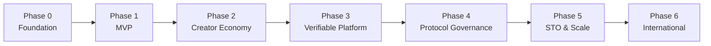

---

# 13.2 ロードマップの基本原則

各Phaseは単なる開発工程ではなく、

- Product
- Creator
- Rights
- Technology
- Governance
- Legal
- Business
- Infrastructure

の成熟度を同時に確認する。

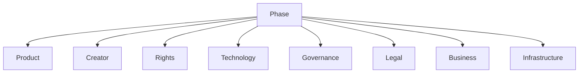

一つの領域だけが先行しすぎないようにする。

---

# 13.3 Stage-Gate方式

Phase移行は日付だけで決めない。

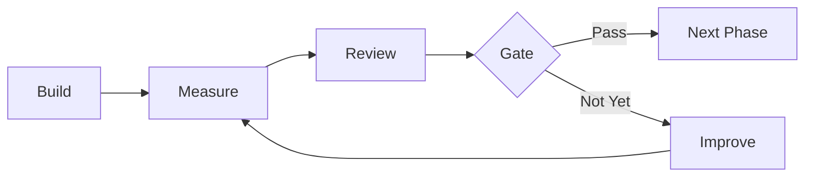

各Gateでは、

> **技術的に作れたか**

だけでなく、

> **利用されているか、Creatorに価値があるか、法的に運営できるか、経済的に継続可能か**

を確認する。

---

# 13.4 Phase 0 — Foundation

Phase 0では、プロジェクトの「何を作るか」と「誰が責任を持つか」を確立する。

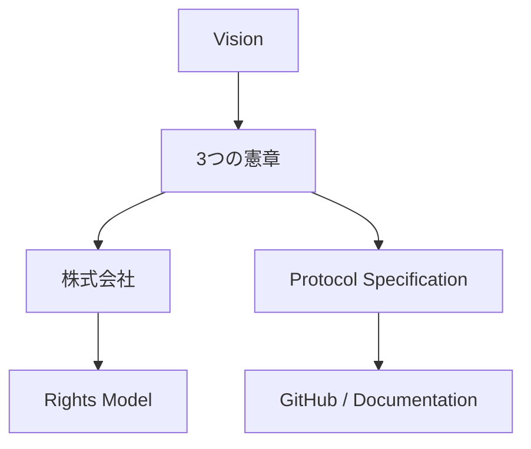

### 主な成果物

- 3つの憲章
- Whitepaper v1
- 株式会社の基本設計
- Creator Agreement案
- 利用規約案
- Privacy Policy案
- Rights Model
- Protocol Specification
- GitHub Repository
- VitePressによる公開文書
- 開発ルール
- AI共同開発ルール

---

# 13.5 3つの憲章を最初に確定する

コードを書く前に、

> **何を最適化し、何を犠牲にしてはいけないか**

を定義する。

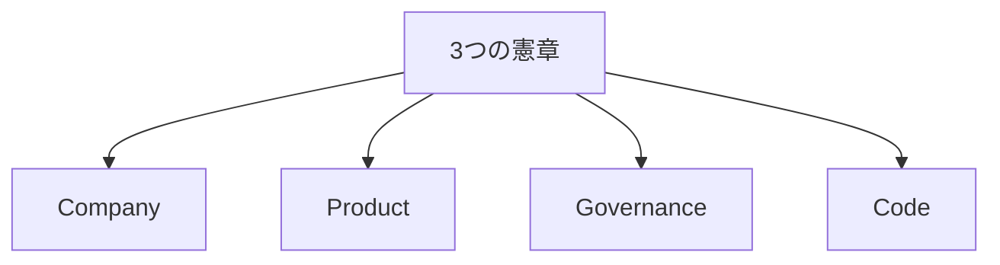

憲章は後の二院制ガバナンスにおける上位原則となる。

---

# 13.6 法的主体の準備

初期段階から、将来の株式会社化を前提に、

- 知的財産
- 契約
- Creatorとの関係
- 開発成果物
- 資金
- 責任

の帰属を整理する。

法人設立の具体的時期は、契約・資金調達・サービス開始の必要性に応じて決定する。

---

# 13.7 AI共同開発環境

Phase 0でAIと人間が共同作業できるRepository構造を整える。

```text
creator-first-platform/
├── docs/
│   └── whitepaper/
├── protocol/
├── contracts/
├── apps/
├── services/
├── infrastructure/
├── tests/
├── governance/
└── .github/
```

Whitepaperとコードを別世界にしない。

---

# 13.8 Whitepaper → Specification → Code

開発フローは、


とする。

AI Agentはこの流れの各段階を支援できるが、重要な仕様・法務・本番変更は人間のレビューを通す。

---

# 13.9 Phase 0 Gate

Phase 1へ進む条件として、

- Visionが明文化されている
- 3つの憲章が定義されている
- Rights Modelが説明できる
- MVP Scopeが定義されている
- RepositoryとCIが動作する
- 法務上の主要論点が列挙されている
- MVP予算の概算がある

ことを確認する。

---

# 13.10 Phase 1 — Music Service MVP

Phase 1では、まず音楽サービスとして価値があるかを検証する。

> **Blockchainを使うことではなく、CreatorとUserが使いたいサービスを作ることが目的である。**

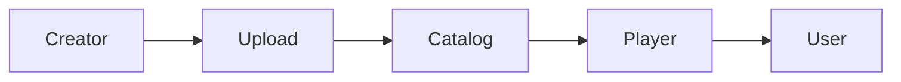

---

# 13.11 MVP機能

最初のMVPでは、

### User

- アカウント
- 楽曲検索
- 楽曲再生
- Playlist
- Creatorページ
- Subscription

### Creator

- Creator登録
- 作品登録
- Rights Metadata
- Artwork / Audio Upload
- 基本Analytics

### Platform

- Catalog
- Audio Delivery
- Usage Event
- Admin
- Monitoring

を実装する。

---

# 13.12 MVPで実装しないもの

初期MVPでは、

- 完全オンチェーン分配
- 本格的STARK Prover
- 完全DAO
- STO
- 世界同時展開

を必須条件としない。

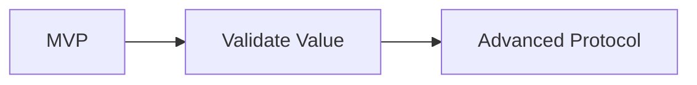

複雑な技術は価値検証後に導入する。

---

# 13.13 MVPインフラ

MVPはManaged Serviceを中心に小さく始める。

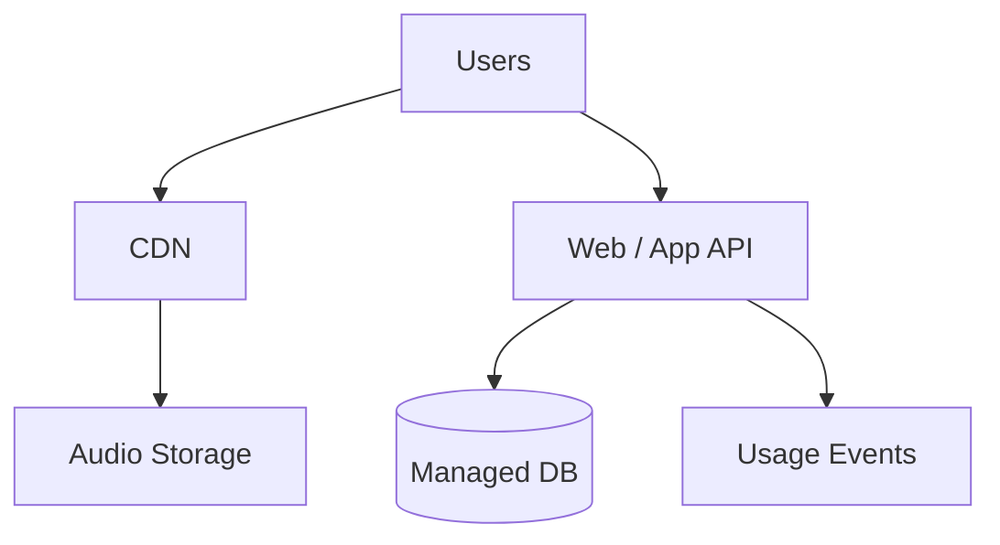

性能目標は第12章のSLOを基準とする。

---

# 13.14 MVPで測るもの

単なる登録者数ではなく、

- Active Users
- Paid Conversion
- Listening Hours
- Playback Start p95
- Buffering Ratio
- Creator登録数
- Active Creators
- Upload数
- Repeat Listening
- New Creator Discovery

を測る。

---

# 13.15 Phase 1 Gate

Phase 2への移行は、

> **音楽サービスとして継続利用される兆候があること**

を条件とする。

具体的閾値は実証運用開始時に設定し、Whitepaperに固定しない。

---

# 13.16 Phase 2 — Creator Economy

Phase 2ではCreatorへの経済的価値還元を実装する。

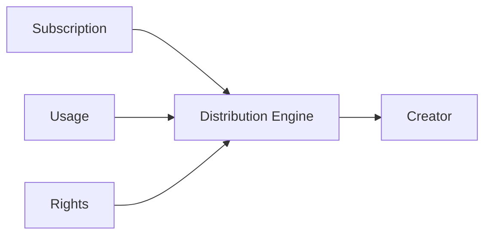

---

# 13.17 Rights Registry

Creator登録情報を、分配可能なRights Graphへ発展させる。

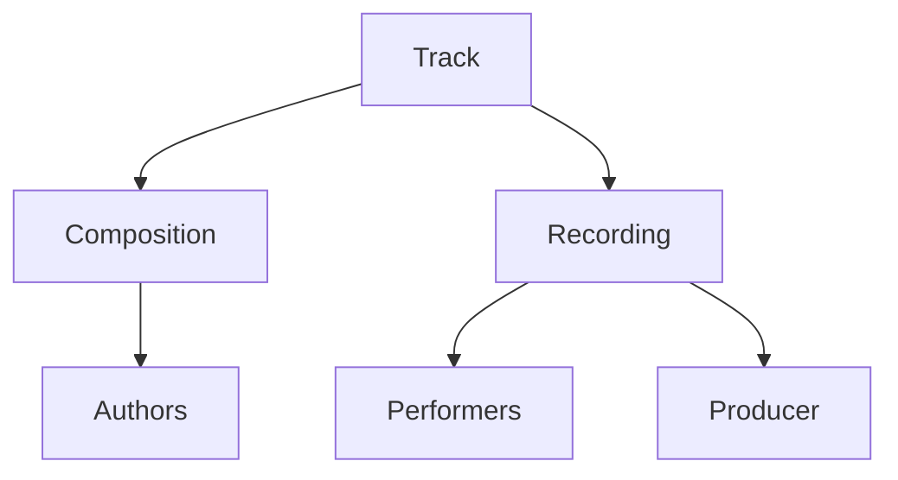

作品単位ではなく権利単位で分配できる構造を作る。

---

# 13.18 Distribution Engine

第6章の経済モデルを実装する。

単純な再生回数比例だけではなく、

- Listening
- Rights
- Anti-Fraud
- Discovery
- Creator Support
- Community

等を考慮する。

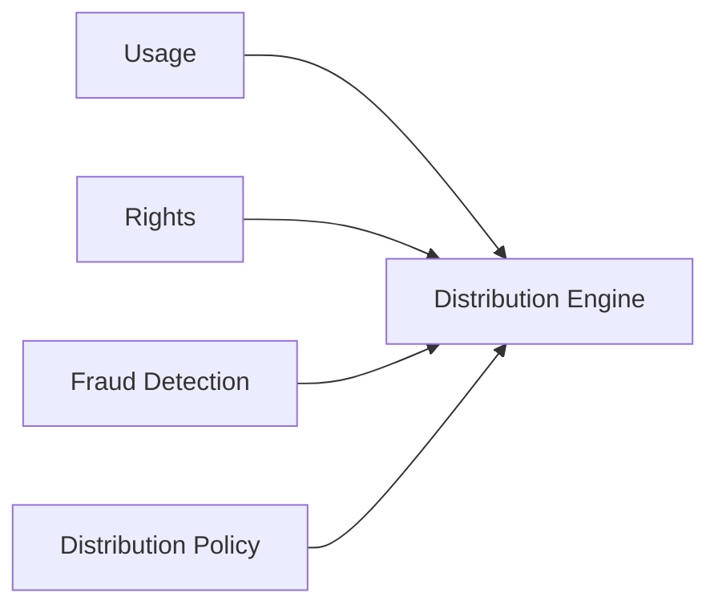

---

# 13.19 Stablecoin Pilot

法務・会計・決済事業者との確認後、必要に応じてステーブルコイン決済・分配を限定的に導入する。

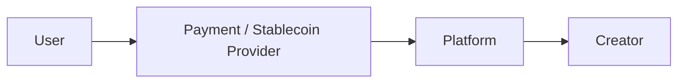

最初からPlatform自身が金融仲介機能をすべて持つことは前提としない。

---

# 13.20 Tax-aware Distribution

分配システムは、

$$
N_i = G_i - W_i - A_i
$$

を扱える構造とする。

- $G_i$：Gross Distribution
- $W_i$：必要な源泉徴収等
- $A_i$：調整
- $N_i$：Net Distribution

会計・税務を後付けにしない。

---

# 13.21 Phase 2 Gate

Phase 3へ進む条件は、

- Rights Registryが実運用できる
- Creatorへの分配が正確である
- 会計照合が可能である
- Fraud Detectionが機能する
- 分配に対するCreatorの理解と信頼が得られる
- Unit Economicsを計測できる

ことである。

---

# 13.22 Phase 3 — Verifiable Platform

Phase 3では、

> **Platformを信頼してください**

から、

> **Platformの計算を検証できます**

へ進む。

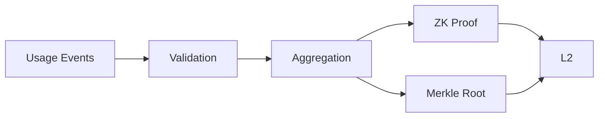

---

# 13.23 Step 1 — Auditable Ledger

まずUsage Eventと分配計算を監査可能にする。

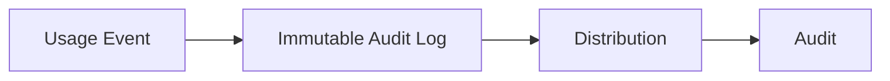

ZK導入前でも、計算過程を再現できることを優先する。

---

# 13.24 Step 2 — Merkle Commitment

次にUsage集合のCommitmentを生成する。

$$
R_t = \operatorname{MerkleRoot}(E_t)
$$

これにより後からイベント集合が改ざんされていないことを検証できる。

---

# 13.25 Step 3 — zk-STARK

十分なイベント量と経済的必要性が確認された段階でzk-STARKを導入する。

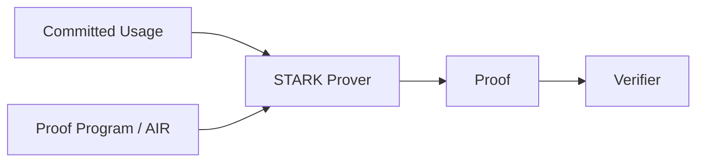

証明対象には、

- 有効な再生条件
- 集計
- Fraud Filter
- 分配計算

等を段階的に含める。

---

# 13.26 ZK導入判断

ZKは「先進的だから」導入しない。

導入価値を、

$$
V_{zk}
=
B_{trust}
+
B_{audit}
+
B_{privacy}
-
C_{proof}
-
C_{complexity}
$$

のように考える。

$V_{zk}$ が十分に正になる領域から導入する。

---

# 13.27 Phase 3 Gate

Phase 4へ進む条件として、

- Usage Pipelineが安定している
- Commitmentが再現可能
- Proof Programが監査されている
- Proof Costが事業上許容できる
- DistributionとProofが整合する
- セキュリティレビューが完了している

ことを確認する。

---

# 13.28 Phase 4 — Protocol Governance

Phase 4で二院制のコード統治を本格導入する。

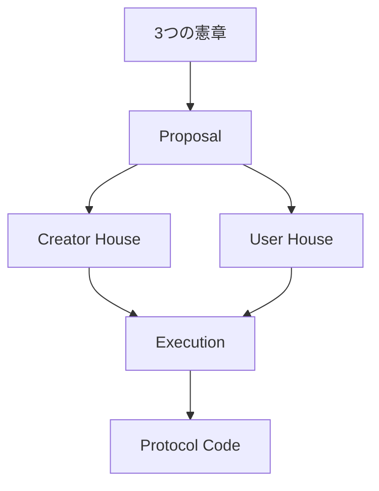

CreatorとUserの双方が承認する仕組みを基本とする。

---

# 13.29 Creator House

Creator Houseは、

- 分配
- Rights
- Creator Onboarding
- Creator Economy
- Creator Protection

等について主要な役割を持つ。

---

# 13.30 User House

User Houseは、

- Subscription
- Privacy
- Discovery
- Recommendation
- Community
- User Experience

等について主要な役割を持つ。

---

# 13.31 二院制の目的

単一Tokenの保有量だけで意思決定すると、資本集中がコード支配につながる可能性がある。

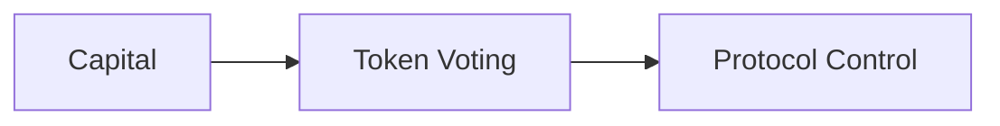

Creator First Platformではこれを避け、

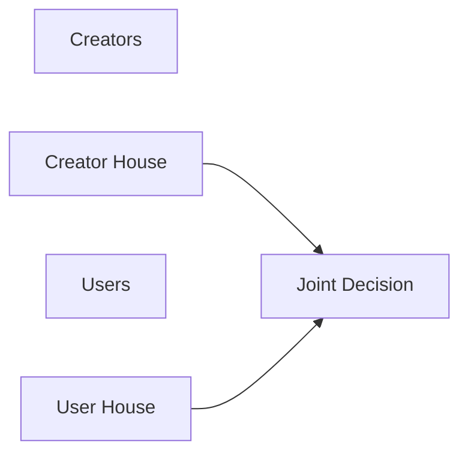

とする。

---

# 13.32 Governance Sandbox

最初から本番Smart Contractを直接変更できるようにしない。

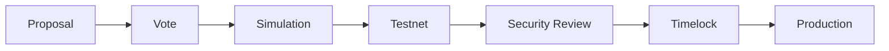

投票結果と安全な実行を分離する。

---

# 13.33 Governance Scopeの段階拡大

初期には、

- Community Policy
- Discovery Parameters
- Creator Programs

などから開始する。

その後、

- Distribution Policy
- Treasury
- Smart Contract Upgrade

へ権限を広げる。

```mermaid
flowchart LR
    COMMUNITY[Community]
    POLICY[Policy]
    ECON[Economics]
    TREASURY[Treasury]
    CODE[Code]

    COMMUNITY --> POLICY --> ECON --> TREASURY --> CODE
```

---

# 13.34 憲章適合性

通常の多数決で3つの憲章を容易に無効化できない構造を設計する。

```mermaid
flowchart LR
    PROP[Proposal]
    CHECK[Charter Check]
    HOUSES[Two Houses]
    EXEC[Execution]

    PROP --> CHECK --> HOUSES --> EXEC
```

憲章変更自体には通常提案より高い成立要件を設ける。

---

# 13.35 Phase 4 Gate

Phase 5へ進む条件として、

- Creator Houseが機能している
- User Houseが機能している
- Sybil対策がある
- 投票参加率を測定できる
- Governance Attackへの対策がある
- Timelock / Emergency Processがある
- 実際の提案が安全に実行された実績がある

ことを確認する。

---

# 13.36 Phase 5 — STO & Scale

STOはプロジェクト開始時の目的ではなく、

> **事業とProtocol Governanceが実証された後の成長資金調達手段**

として位置付ける。

```mermaid
flowchart LR
    MVP[MVP]
    ECON[Creator Economy]
    VERIFY[Verifiability]
    GOV[Governance]
    STO[STO]
    SCALE[Scale]

    MVP --> ECON --> VERIFY --> GOV --> STO --> SCALE
```

---

# 13.37 STO準備

STO前に、

- 株式会社の事業実績
- 財務情報
- Creator Economy
- Governance実績
- Security
- Legal Structure
- Tokenと株主権の関係
- 資金使途

を明確にする。

---

# 13.38 STOの資金使途

資金調達を行う場合の候補は、

```mermaid
flowchart TD
    STO[STO Proceeds]

    STO --> PRODUCT[Product Development]
    STO --> CREATOR[Creator Acquisition / Support]
    STO --> INFRA[Infrastructure]
    STO --> ZK[ZK / Protocol R&D]
    STO --> GLOBAL[International Expansion]
    STO --> LEGAL[Legal / Rights Infrastructure]
```

である。

STO資金を短期的なToken価格維持のために使う設計にはしない。

---

# 13.39 株主とProtocol Governance

STO後も、

```mermaid
flowchart TD
    COMPANY[株式会社]

    COMPANY --> SHARE[Shareholder Governance]
    COMPANY --> PROTOCOL[Protocol Governance]

    SHARE --> BOARD[Board / Corporate Decisions]

    PROTOCOL --> CH[Creator House]
    PROTOCOL --> UH[User House]

    CH --> CODE[Code]
    UH --> CODE
```

を維持する。

資本提供者とProtocol参加者の役割を分離する。

---

# 13.40 Scale Infrastructure

STO等による成長資金は、需要に応じてInfrastructure拡張へ利用する。

```mermaid
flowchart LR
    EDGE[Global CDN]
    API[Autoscaled API]
    DATA[HA Data]
    EVENTS[Event Streaming]
    ZK[Prover Pool]
    L2[L2]
    OBS[Observability]

    EDGE --> API --> DATA
    API --> EVENTS --> ZK --> L2
    OBS --> API
    OBS --> ZK
```

第12章のCost / User、Cost / Listening Hourを監視しながら拡張する。

---

# 13.41 Phase 5 Gate

国際展開へ進む条件として、

- 国内事業モデルが成立している
- Creator Distributionが持続可能
- Governanceが機能している
- InfrastructureがScale可能
- Security Incident Responseが成熟している
- 国際展開資金が確保されている

ことを確認する。

---

# 13.42 Phase 6 — International Expansion

国際展開は「Webサイトを海外から見られるようにすること」ではない。

```mermaid
flowchart TD
    GLOBAL[International Expansion]

    GLOBAL --> RIGHTS[Rights]
    GLOBAL --> TAX[Tax]
    GLOBAL --> PAYMENT[Payments]
    GLOBAL --> PRIVACY[Privacy]
    GLOBAL --> FIN[Financial Regulation]
    GLOBAL --> CULTURE[Creator Community]
```

地域ごとに制度と市場を確認する。

---

# 13.43 地域別展開

```mermaid
flowchart LR
    JP[Japan]
    R1[Selected Region A]
    R2[Selected Region B]
    GLOBAL[Broader Global]

    JP --> R1 --> R2 --> GLOBAL
```

一度に全世界へ展開せず、権利処理・決済・Creator Communityを確立できる地域から進める。

---

# 13.44 Global Rights Graph

国際展開ではRights Registryを地域情報へ拡張する。

```mermaid
flowchart TD
    TRACK[Track]
    RIGHTS[Rights Graph]

    TRACK --> RIGHTS
    RIGHTS --> JP[Japan Rights]
    RIGHTS --> EU[EU Rights]
    RIGHTS --> US[US Rights]
    RIGHTS --> OTHER[Other Territories]
```

同一作品でも地域ごとに権利状態が異なる可能性を扱う。

---

# 13.45 Global Governance

Creator House / User Houseが国際化した場合、

- 言語
- 地域
- 法制度
- 文化
- Creator規模

の偏りを考慮する。

```mermaid
flowchart TD
    GLOBAL[Global Governance]

    GLOBAL --> REGION[Regional Representation]
    GLOBAL --> CREATOR[Creator Diversity]
    GLOBAL --> USER[User Diversity]
    GLOBAL --> LANGUAGE[Language Access]
```

単純な世界一票制だけで公平性が実現するとは限らない。

---

# 13.46 技術ロードマップ

技術面だけを抜き出すと、

```mermaid
flowchart LR
    DOC[Whitepaper]
    MVP[MVP]
    EVENT[Usage Pipeline]
    RIGHTS[Rights Graph]
    DIST[Distribution]
    MERKLE[Merkle]
    STARK[zk-STARK]
    L2[L2 Protocol]
    GOV[Governance]
    GLOBAL[Global Scale]

    DOC --> MVP --> EVENT --> RIGHTS --> DIST --> MERKLE --> STARK --> L2 --> GOV --> GLOBAL
```

となる。

---

# 13.47 事業ロードマップ

```mermaid
flowchart LR
    IDEA[Concept]
    PILOT[Pilot]
    PMF[Product-Market Fit]
    ECON[Creator Economy]
    SCALE[Scale]
    STO[Growth Financing]
    GLOBAL[International]

    IDEA --> PILOT --> PMF --> ECON --> SCALE --> STO --> GLOBAL
```

STOは事業価値を作る前の代替物ではない。

---

# 13.48 法務ロードマップ

```mermaid
flowchart LR
    STRUCT[Legal Structure]
    TERMS[Contracts / Terms]
    RIGHTS[Rights Compliance]
    PAY[Payment Compliance]
    GOV[Governance Legal Design]
    STO[STO Compliance]
    GLOBAL[International Compliance]

    STRUCT --> TERMS --> RIGHTS --> PAY --> GOV --> STO --> GLOBAL
```

技術実装より後に法務を確認するのではなく、各Phaseで並行する。

---

# 13.49 Governance Roadmap

```mermaid
flowchart LR
    CHARTER[3つの憲章]
    COMMUNITY[Community Consultation]
    ADVISORY[Advisory Voting]
    HOUSES[Two Houses]
    POLICY[Policy Governance]
    ECON[Economic Governance]
    CODE[Code Governance]

    CHARTER --> COMMUNITY --> ADVISORY --> HOUSES --> POLICY --> ECON --> CODE
```

Governanceも段階導入する。

---

# 13.50 Security Roadmap

```mermaid
flowchart LR
    BASE[Secure Development]
    IAM[IAM / Secrets]
    AUDIT[Audit Logs]
    CONTRACT[Contract Audit]
    ZK[ZK Review]
    GOV[Governance Security]
    RED[Red Team / Incident Drills]

    BASE --> IAM --> AUDIT --> CONTRACT --> ZK --> GOV --> RED
```

価値が増えるほど攻撃インセンティブも増えるため、Security Budgetも成長させる。

---

# 13.51 Infrastructure Roadmap

```mermaid
flowchart LR
    SIMPLE[Managed MVP]
    SCALE[Autoscaling]
    STREAM[Event Streaming]
    PROVER[ZK Prover]
    HA[High Availability]
    GLOBAL[Multi-region / Global Edge]

    SIMPLE --> SCALE --> STREAM --> PROVER --> HA --> GLOBAL
```

最初から最終構成を作らない。

---

# 13.52 Creator Roadmap

Creatorとの関係も段階的に深化させる。

```mermaid
flowchart LR
    EARLY[Early Creators]
    PILOT[Pilot Community]
    ECON[Revenue Distribution]
    HOUSE[Creator House]
    GLOBAL[Global Creator Network]

    EARLY --> PILOT --> ECON --> HOUSE --> GLOBAL
```

Creatorを完成後に集めるのではなく、仕様策定段階から参加してもらう。

---

# 13.53 User Roadmap

```mermaid
flowchart LR
    TEST[Alpha Users]
    BETA[Beta Community]
    PAID[Paid Users]
    ADVISORY[Advisory Governance]
    HOUSE[User House]
    GLOBAL[Global Users]

    TEST --> BETA --> PAID --> ADVISORY --> HOUSE --> GLOBAL
```

User Houseも、利用実態のないアカウントだけで構成しない。

---

# 13.54 AI Roadmap

AIは開発だけでなく、

- Documentation
- Testing
- Security Review支援
- Rights Metadata支援
- Recommendation
- Fraud Detection
- Governance Analysis
- Operations

へ段階的に利用する。

```mermaid
flowchart LR
    DOC[Documentation AI]
    DEV[Development AI]
    TEST[Test AI]
    OPS[Operations AI]
    DISC[Discovery AI]
    GOV[Governance Support AI]

    DOC --> DEV --> TEST --> OPS --> DISC --> GOV
```

ただし最終的な権利判断、法的判断、重要な本番変更をAIへ無条件に委任しない。

---

# 13.55 GitHubをプロジェクトの履歴にする

GitHubにはコードだけでなく、

- Whitepaper
- Specifications
- Architecture Decision Records
- Governance Proposals
- Smart Contracts
- Infrastructure
- Tests

を保存する。

```mermaid
flowchart TD
    GIT[GitHub]

    GIT --> WP[Whitepaper]
    GIT --> SPEC[Specs]
    GIT --> ADR[ADR]
    GIT --> GOV[Governance]
    GIT --> CODE[Code]
    GIT --> TEST[Tests]
```

これにより、理念からコードまでの変更理由を追跡できる。

---

# 13.56 Versioning

WhitepaperとProtocolをVersion管理する。

例：

```text
Whitepaper v1.0
Protocol v0.1
MVP v0.1

Whitepaper v1.1
Protocol v0.2
MVP v0.2

Protocol v1.0
```

重要な変更は、

```mermaid
flowchart LR
    ISSUE[Issue]
    DISCUSS[Discussion]
    PR[Pull Request]
    REVIEW[Review]
    MERGE[Merge]
    VERSION[Version]

    ISSUE --> DISCUSS --> PR --> REVIEW --> MERGE --> VERSION
```

として記録する。

---

# 13.57 Whitepaperを固定文書にしない

Creator First PlatformのWhitepaperは、

> 完成後変更しない宣言文

ではなく、

> **理念を維持しながら、実証・法律・技術・コミュニティの変化を反映するLiving Document**

とする。

ただし過去Versionは保存する。

---

# 13.58 KPIとPhase

各Phaseで見るKPIは異なる。

| Phase | 主要KPI |
| --- | --- |
| Foundation | 仕様完成度・法務論点・開発準備 |
| MVP | Active Users・Listening・UX |
| Creator Economy | Creator収益・Rights精度・Unit Economics |
| Verifiable Platform | Proof Cost・Auditability・Fraud Rate |
| Governance | Participation・Proposal Quality・Execution Safety |
| STO & Scale | Growth・資本効率・Infrastructure Efficiency |
| International | 地域別Users・Creators・Rights Coverage |

---

# 13.59 North Star Metrics

短期的な再生数だけを最上位指標にしない。

Creator First Platformでは、

```mermaid
flowchart TD
    VALUE[Sustainable Creator Ecosystem]

    VALUE --> CREATOR[Creator Sustainability]
    VALUE --> USER[User Value]
    VALUE --> DIVERSITY[Discovery / Diversity]
    VALUE --> TRUST[Trust / Verifiability]
```

を総合的に評価する。

---

# 13.60 ロードマップと予算

各Phaseで投資対象を変える。

```mermaid
flowchart LR
    P0[Foundation]
    P1[MVP]
    P2[Economy]
    P3[ZK]
    P4[Governance]
    P5[Scale]
    P6[Global]

    P0 --> P1 --> P2 --> P3 --> P4 --> P5 --> P6
```

### Foundation

文書、法務、設計、Prototype。

### MVP

Product DevelopmentとCreator Pilot。

### Creator Economy

Rights、Payment、Accounting、Distribution。

### Verifiable Platform

Usage Pipeline、ZK/STARK、L2。

### Governance

Voting、Identity/Sybil対策、Execution Security。

### Scale

Infrastructure、Creator Acquisition、組織拡大。

### Global

Rights、Localization、Compliance、Regional Infrastructure。

---

# 13.61 資金調達も段階化する

```mermaid
flowchart LR
    FOUNDER[Founder / Initial Capital]
    SEED[Seed]
    STRATEGIC[Strategic Partners]
    REVENUE[Service Revenue]
    STO[STO]
    SCALE[Growth Capital]

    FOUNDER --> SEED --> STRATEGIC --> REVENUE --> STO --> SCALE
```

すべての資金をSTOに依存しない。

事業収益そのものを重要な資金源とする。

---

# 13.62 Kill / Pivot Criteria

ロードマップには「進む条件」だけでなく「止める条件」も必要である。

例えば、

- Creatorが価値を感じない
- User Retentionが成立しない
- Rights Costが事業モデルを超える
- Infrastructure Costが収益に対して持続不能
- Governance参加が成立しない

場合には、次Phaseへ自動的に進まず設計を見直す。

```mermaid
flowchart LR
    RESULT[Measured Result]
    CHECK{Sustainable?}
    NEXT[Next Phase]
    PIVOT[Pivot]
    STOP[Stop]

    RESULT --> CHECK
    CHECK -->|Yes| NEXT
    CHECK -->|Needs Change| PIVOT
    CHECK -->|No| STOP
```

---

# 13.63 ロードマップ全体

```mermaid
flowchart TD
    VISION[Vision + 3つの憲章]

    VISION --> FOUNDATION[Phase 0<br/>Foundation]
    FOUNDATION --> MVP[Phase 1<br/>Music MVP]
    MVP --> ECON[Phase 2<br/>Creator Economy]
    ECON --> VERIFY[Phase 3<br/>Verifiable Platform]
    VERIFY --> GOV[Phase 4<br/>Two-House Governance]
    GOV --> STO[Phase 5<br/>STO & Scale]
    STO --> GLOBAL[Phase 6<br/>International]

    FOUNDATION --> CORP[Legal Entity / Rights]
    MVP --> UX[User Experience]
    ECON --> DIST[Rights + Distribution]
    VERIFY --> ZK[Usage Oracle + zk-STARK]
    GOV --> CODE[Code Governance]
    STO --> CAPITAL[Growth Capital]
    GLOBAL --> NETWORK[Global Creator Network]
```

---

# 13.64 最終的に目指す構造

ロードマップの到達点は単なる音楽アプリではない。

```mermaid
flowchart TD
    CHARTER[3つの憲章]

    CHARTER --> CORP[株式会社]
    CHARTER --> PARL[Creator House + User House]

    CORP --> LEGAL[Legal / Rights / Business]
    PARL --> GOV[Protocol Governance]

    GOV --> CODE[Smart Contracts]
    LEGAL --> SERVICE[Music Platform]
    CODE --> SERVICE

    SERVICE --> USERS[Users]
    SERVICE --> CREATORS[Creators]

    USERS --> PARL
    CREATORS --> PARL

    SERVICE --> USAGE[Usage Oracle]
    USAGE --> ZK[zk-STARK]
    ZK --> CODE

    CODE --> DIST[Transparent Distribution]
    DIST --> CREATORS
```

株式会社は現実社会で責任を負い、

Creator HouseとUser HouseはProtocolを共同統治し、

Usage Oracleとzk-STARKは計算の検証可能性を提供し、

Smart Contractは承認されたルールを実行する。

---

# 13.65 成功の定義

Creator First Platformの成功を、

> ユーザー数

だけでは定義しない。

成功とは、

1. Creatorが持続可能な収益を得られる
2. Userが高品質な音楽体験を得られる
3. 新人・Long Tail Creatorが発見される
4. Rightsと分配が透明である
5. Platform計算が検証可能である
6. CreatorとUserが重要なコードを共同統治できる
7. 株式会社が法的責任を果たす
8. 事業として持続可能である

状態である。

---

# 13.66 本章のまとめ

Creator First Platform のロードマップは、

```text
理念
 ↓
法的・技術的基盤
 ↓
音楽サービス
 ↓
Creator Economy
 ↓
検証可能なUsage / Distribution
 ↓
二院制コードガバナンス
 ↓
STOによる成長資金調達
 ↓
国際的Creator Platform
```

という順序を採る。

重要なのは、

> **Blockchain、DAO、ZK、STOを最初から目的化しない**

ことである。

これらはすべて、

> **Creatorの権利と利益を守りながら、Userに優れた体験を提供し、そのルールを両者が共同で統治する**

という目的を実現するための手段である。

そして各Phaseは、技術完成ではなく、

> **Product × Creator × Rights × Governance × Legal × Business × Infrastructure**

の成立を確認してから次へ進む。

このStage-Gate方式によって、Creator First Platformは理念だけのDAOでも、技術だけのBlockchain Projectでも、従来型の中央集権的Streaming Serviceでもない、持続可能なCreator中心のデジタルプラットフォームへ段階的に発展する。

---

## 13.67 Whitepaper v1 から実装フェーズへ

第1章から第13章までが揃った段階で、次の作業はWhitepaperをさらに長くすることではなく、内容を実装可能な仕様へ変換することである。

```mermaid
flowchart LR
    WP[Whitepaper v1]
    REQUIRE[Requirements]
    SPEC[Protocol / System Specs]
    ADR[Architecture Decisions]
    BACKLOG[Development Backlog]
    MVP[MVP]

    WP --> REQUIRE --> SPEC --> ADR --> BACKLOG --> MVP
```

次の成果物として、

- `protocol/README.md`
- `protocol/architecture.md`
- `protocol/rights-model.md`
- `protocol/distribution-spec.md`
- `protocol/governance-spec.md`
- `protocol/usage-oracle-spec.md`
- `docs/adr/`
- GitHub Issues / Milestones

を作成する。

これによりWhitepaperを「説明文書」から、AIと人間が共同開発できる**プロジェクトの上位仕様**へ接続する。
