# 13. ロードマップ

> [!NOTE]
> 本章は Creator First Platform の理念、権利、経済、技術、ガバナンス、法務、セキュリティ、インフラを実装へ接続するロードマップである。
>
> 本ロードマップは固定日程ではなく、各段階の成立条件を確認して次へ進む **Stage-Gate方式**を採用する。

## 13.1 ロードマップの基本思想

Creator First Platformは、最初から完成したDAO、STO、ゼロ知識基盤、国際サービスを一度に構築するものではない。

基本順序を、

> **理念・憲章 → 法的基盤 → 音楽 MVP → 音楽クリエーター経済 → 検証可能プラットフォーム → 抽選議会と熟議 → プロトコルガバナンス → STO & 規模拡大 → 国際展開**

とする。

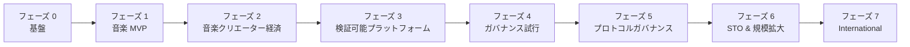

---

## 13.2 最終的な統治モデル

ロードマップ全体が目指すガバナンスの中心構造は、

> **音楽クリエーター／ユーザ → 抽選議会 → 熟議 → プロトコル仕様 → スマートコントラクト → 自動執行**

である。

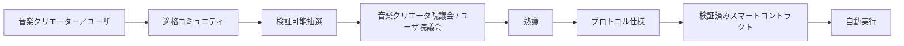

ただし、この構造をサービス開始時から全面稼働させるのではない。

実際の音楽クリエーター／ユーザコミュニティが成立し、代表性、抽選、熟議、安全なコード執行を検証した後に段階的に権限を移す。

---

## 13.3 主権と議会

音楽クリエータ院議会とユーザ院議会は主権者そのものではない。

主権の源泉は、

- 音楽クリエーターコミュニティ
- ユーザコミュニティ

にある。

抽選議会は、一定期間だけ統治機能を委ねられた熟議機関である。

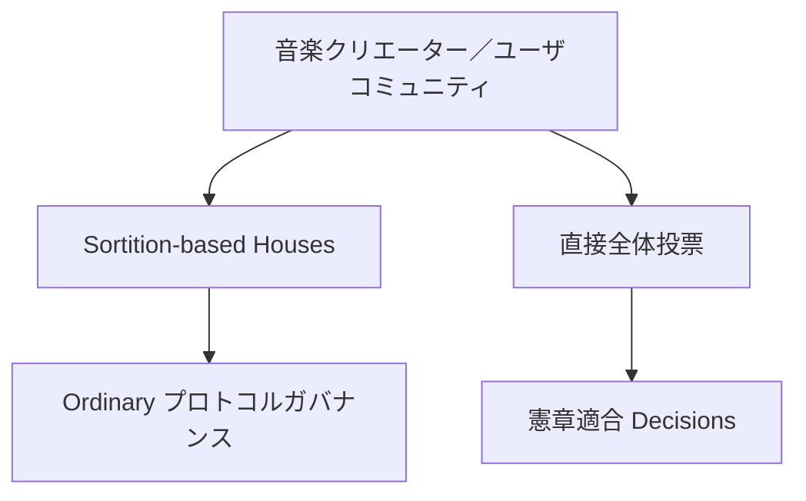

通常のプロトコル変更は議会が担当し、憲章変更などの重大事項ではコミュニティ全体による全体投票を利用する。

---

## 13.4 規範の階層

すべてのフェーズで次の関係を維持する。

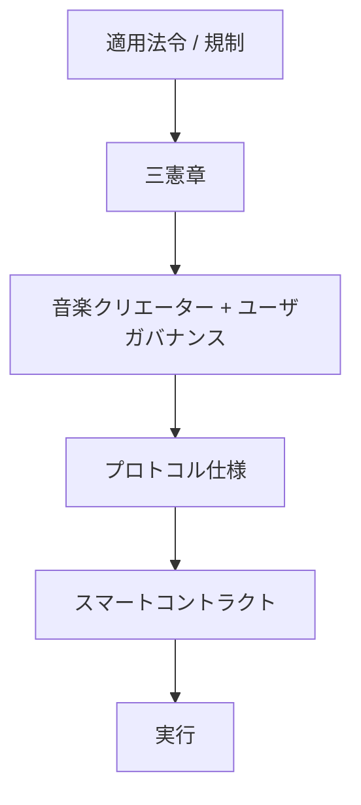

すなわち、

> **法令 > 三憲章 > ガバナンス > プロトコル仕様 > コード**

である。

コードの正統性はコード自身ではなく、その上位にある正統なガバナンス手続から生じる。

---

## 13.5 フェーズ 0 — 基盤

フェーズ 0では、何を作るかだけでなく、**誰が責任を持ち、誰が将来統治するのか**を定義する。

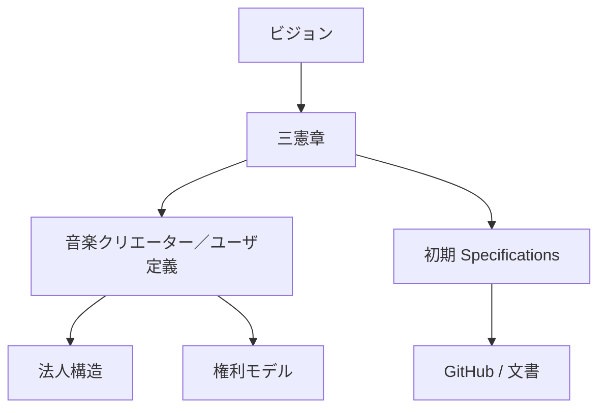

### 主な成果物

- ホワイトペーパー v1.0
- 音楽クリエーター憲章
- ユーザ憲章
- エコシステム憲章
- 音楽クリエーター／権利者の定義
- ユーザ / ガバナンス適格ユーザ / ガバナンス議員の定義
- 株式会社の基本設計
- 音楽クリエーター契約案
- 利用規約案
- プライバシーポリシー案
- 権利モデル
- プロトコル仕様の初期構造
- GitHub リポジトリ
- VitePress公開文書
- AI共同開発ルール

---

## 13.6 3つの憲章

3つの憲章はプラットフォーム内部の最上位規範である。

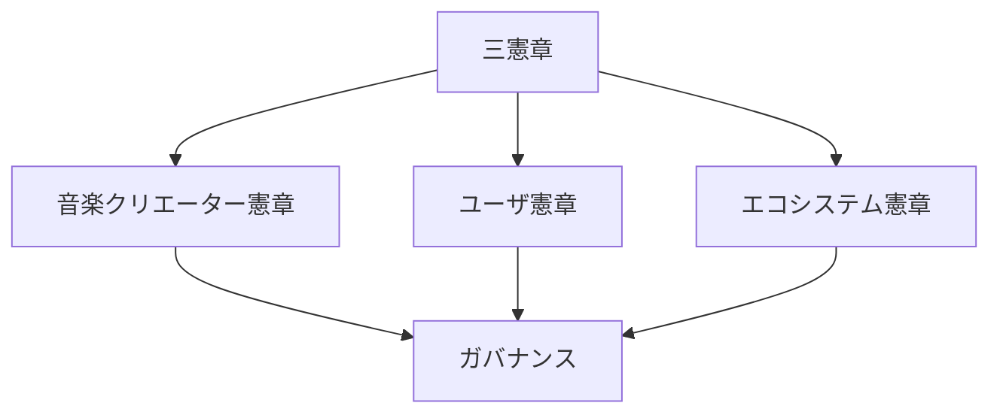

通常のガバナンス提案によって憲章を実質的に無効化できない制度を構築する。

---

## 13.7 音楽クリエーターとユーザを先に定義する

ガバナンスを設計する前に、ガバナンスの正統性の源泉となる主体を定義する。

### 音楽クリエーター

作品の創作・制作に実質的に関与し、所定の登録・検証を経た参加者。

音楽クリエーターと権利者は区別する。

### ユーザ

プラットフォームを利用してコンテンツを聴取、発見、評価、共有、支援等する参加者。

### ガバナンス適格ユーザ

実利用、シビル耐性等の条件を満たし、ユーザ院議会の抽選母集団へ参加できるユーザ。

### ガバナンス議員

適格コミュニティから抽選され、一定期間だけ熟議と意思決定を委ねられた代表者。

---

## 13.8 ホワイトペーパーからコードへ

開発フローを、


とする。

将来ガバナンスが稼働した後は、


へ発展させる。

---

## 13.9 フェーズ 0 ゲート

フェーズ 1へ進む条件は、

- ビジョンが明文化されている
- 3つの憲章が定義されている
- 音楽クリエーター／ユーザ等の主体定義がある
- 権利モデルが説明できる
- 法人ガバナンスとプロトコルガバナンスが区別されている
- MVP 範囲が定義されている
- リポジトリとCIが動作する
- 法務上の主要論点が整理されている
- MVP予算の概算がある

ことである。

---

## 13.10 フェーズ 1 — 音楽 MVP

フェーズ 1では音楽サービスとしての価値を検証する。

> ブロックチェーンやガバナンスを実装することではなく、音楽クリエーターとユーザが実際に利用したいサービスを成立させることが目的である。

実装は、**ローカルモック → 公開テストネットデモ → レビュー／監査 → 本番系**の順序で進める。本番系を先行実装したり、テストネット用の鍵、コントラクト、トークン、権利 Fixture、運用権限をそのまま本番へ流用したりしない。

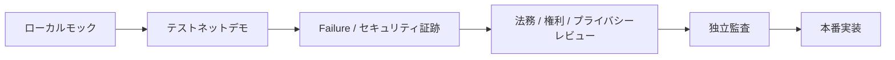

テストネットデモでは、金銭的価値を持たない資産、合成アカウント、モック権利、公開可能な音源Fixtureを使用する。対象ネットワーク、コントラクトアドレス、ソースコミット、既知の制約を公開し、ユーザが本番サービスと誤認しない表示を行う。

現在のローカルモックはフェーズ 1のプレーヤー／ゲートウェイ再生境界と署名UIに加え、Hardhat 3上のテストネット専用MockJPYC決済、資金庫、サポーター SBT、音楽クリエーター登録台帳、二院制ガバナーおよびガバナンス対象デモポリシーを検証している。公開マニフェストに記録したテストネット専用コントラクトはPolygon Amoyへデプロイ済みであり、公開テストユーザ利用フローからMockJPYC サブスクリプション、テスト音楽クリエーター利用フローから仮名音楽クリエーターと作品／権利自己申告コミットメント、ガバナンス画面から二院制の提案・投票境界を確認できる。

これらはいずれも本番アカウント、権利、受取人、配信公開または実運用の議決を代替しない。ゲートウェイ／音楽クリエーターBFF／インデクサーは未接続であり、会期・議員・提案の公開運用、検証可能な抽選、本人性・重複防止、秘密投票、異議申立ても未実証である。そのため、認証器、本番決済、権利／資格証明参照モデル、利用実績／分配連携または運用ガバナンスを完了したものとして数えない。

[ADR-0019](/adr/ADR-0019-jpki-passkey-wallet-binding-testnet)に従う最初のアカウント実証として、モックJPKI、FIDO2／WebAuthnパスキーおよびMetaMaskウォレットをアカウント・トラストサービスで分離して結合するローカル同一オリジン実装を追加した。サーバはWebAuthnのchallenge、origin、RP ID、署名およびユーザ検証を確認し、ウォレットはPolygon Amoy限定のEIP-712結合意思へ署名する。公開GitHub Pagesでは操作を無効にしている。次段階ではCFP管理の専用HTTPSドメインへAPIを配置し、無料のデジタル認証サービス認証APIについて申込み、契約、審査およびサンドボックス接続を行う。実カードは20〜50人の招待制パイロット、明示同意および個人情報保護レビュー後に限定して使用し、初期段階では有料の署名APIや認定プラットフォーム事業者接続を必須にしない。NPO実証から株式会社の本番サービスへはアカウントを自動移管せず、再同意・再認証・再結合を行う。

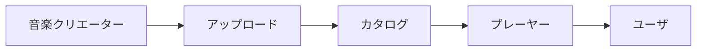

---

## 13.11 MVP機能

### ユーザ

- アカウント
- 楽曲検索
- 楽曲再生
- プレイリスト
- 音楽クリエーターページ
- サブスクリプション

### 音楽クリエーター

- 音楽クリエーター登録
- 作品登録
- 権利メタデータ
- Artwork / 音声アップロード
- 基本分析

### プラットフォーム

- カタログ
- 音声配信
- 利用実績イベント
- 管理
- 監視

---

## 13.12 MVPで実装を急がないもの

初期MVPでは、

- 完全オンチェーン分配
- 本格的ゼロ知識証明
- 完全な二院制プロトコルガバナンス
- STO
- 世界同時展開

を必須条件としない。


ガバナンスを先に作るのではなく、ガバナンスが代表すべき実際の音楽クリエーター／ユーザコミュニティを先に成立させる。

---

## 13.13 MVPで測定するもの

- 有効ユーザ
- 有料 Conversion
- 聴取時間
- 再生開始 p95
- Buffering Ratio
- 音楽クリエーター登録数
- 有効音楽クリエーター
- アップロード数
- Repeat 聴取
- 新人音楽クリエーター発見

を測る。

この段階から将来のガバナンス設計のため、

- ユーザ活動分配
- 音楽クリエーター活動分配
- 地域的分布
- 利用形態

も匿名性・プライバシーに配慮しながら分析する。

---

## 13.14 フェーズ 1 ゲート

フェーズ 2へ進む条件は、

> **音楽サービスとして継続利用される兆候と、実際の音楽クリエーター／ユーザコミュニティが存在すること**

である。

加えて、本番系の実装へ進む前に、テストネットデモの再現可能なソースコミット、ネットワーク／コントラクト情報、失敗試験、セキュリティレビュー、権利／法務／プライバシー上の承認条件、鍵と権限の本番分離を確認する。

---

## 13.15 フェーズ 2 — 音楽クリエーター経済

フェーズ 2では音楽クリエーターへの経済的価値還元を実装する。

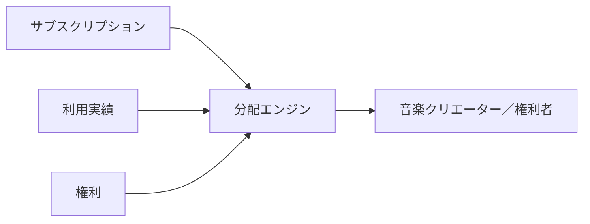

---

## 13.16 権利登録台帳

音楽クリエーター情報と法的権利情報を区別して管理する。

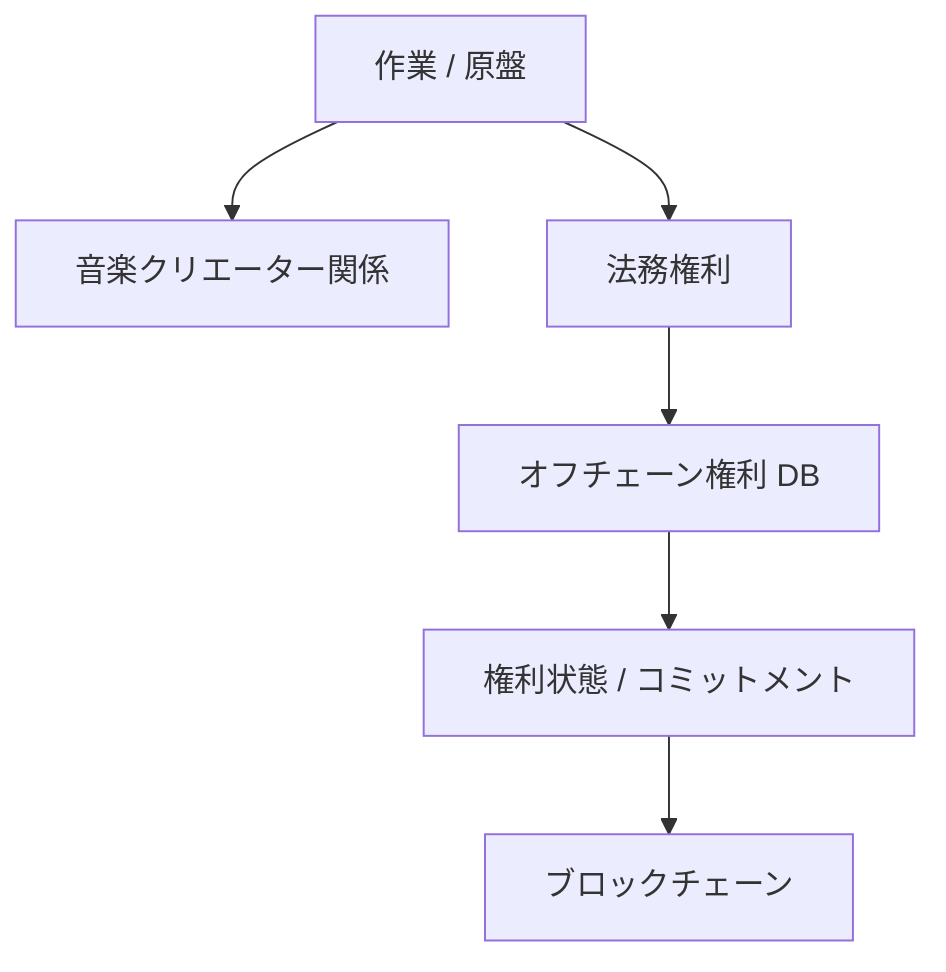

個人情報、契約全文、税務情報等を無条件にブロックチェーンへ保存しない。

---

## 13.17 分配エンジン

第6章の経済モデルを実装する。

考慮対象には、

- 利用実績
- 権利
- 不正検知
- 発見
- 音楽クリエーター支援
- コミュニティポリシー

を含む。

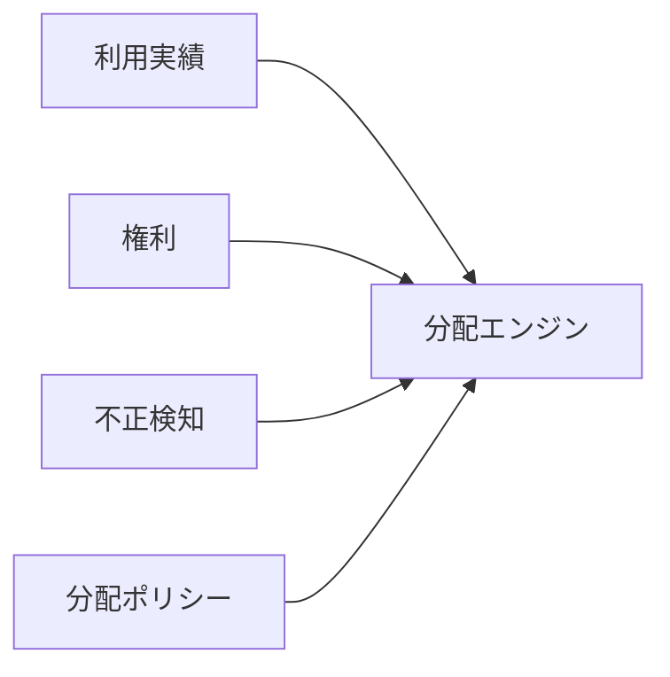

この段階では分配ポリシーの最終決定権を直ちに抽選議会へ移さず、コミュニティ協議を開始する。

---

## 13.18 コミュニティ協議

音楽クリエーター経済の運用開始と同時に、将来のガバナンスのための公開協議を行う。

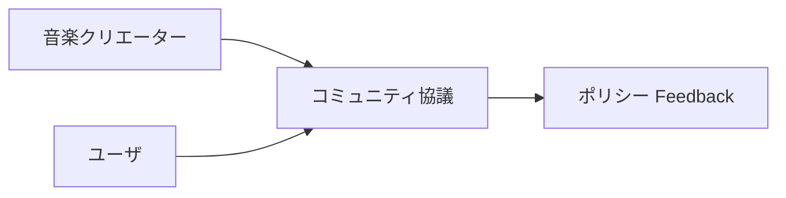

ここで、

- 分配への理解
- 音楽クリエーター／ユーザの利害対立
- ガバナンスへの参加意欲
- 重要と考える政策領域

を観察する。

---

## 13.19 フェーズ 2 ゲート

フェーズ 3へ進む条件は、

- 権利登録台帳が実運用できる
- 音楽クリエーターへの分配が正確
- 会計照合が可能
- 不正検知が機能
- 音楽クリエーターの理解と信頼が得られる
- Unit Economicsを計測できる
- ガバナンス対象となる実際の政策課題が見えている

ことである。

---

## 13.20 フェーズ 3 — 検証可能プラットフォーム

フェーズ 3では、

> **プラットフォームを信用してください**

から、

> **プラットフォームの重要な計算を検証できます**

へ進む。

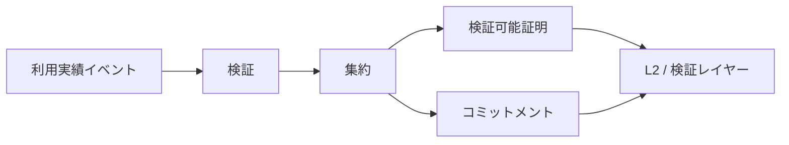

---

## 13.21 監査可能な台帳

最初に利用実績イベントと分配計算を再現可能にする。

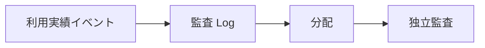

---

## 13.22 コミットメント

利用実績集合等についてコミットメントを生成する。

例えば、

$$
R_t = \operatorname{MerkleRoot}(E_t)
$$

により、後からイベント集合の整合性を検証可能にする。

---

## 13.23 ゼロ知識証明

要求仕様は、

> **Privacy-preserving 検証可能利用実績 / 分配**

である。

信頼できるセットアップを必要としない透明型ゼロ知識証明を優先的に評価するが、特定の証明方式を憲章上の必須技術とはしない。

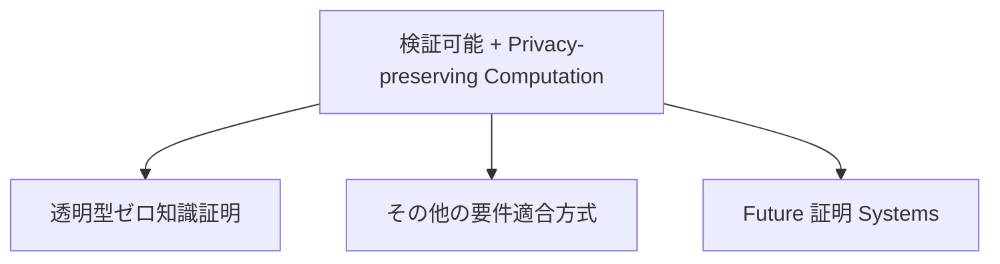

証明システムはセキュリティ、コスト、プライバシー、実演、長期保守性を比較して選択する。

現在のテストネット実装は、交換可能な検証者インターフェース、証明プログラム／公開入力ハッシュ、チェーン拘束受付ID、再実行拒否、プロファイル廃止および停止を、暗号学的ZKではない明示的モック検証者で確認する段階である。モック検証者と受付台帳はPolygon Amoyへデプロイし、アドレス、デプロイトランザクション、モックプロファイル登録およびソースコミットを公開マニフェストへ記録したが、これは証明方式の実証には数えない。

本番mainnetはテストネットの延長デプロイではない。監査済み証明プログラムと不変検証者、版管理された証明ルーター、複数の証明者、異議申立て・停止・移行手順、二院制ガバナンス、株式会社の承認、タイムロックおよび新しい本番鍵を別に成立させる。

---

## 13.24 フェーズ 3 ゲート

フェーズ 4へ進む条件は、

- 利用実績パイプラインが安定
- コミットメントが再現可能
- 分配計算が監査可能
- 証明システムの実証がある
- テストネットモックではなく、候補となる透明型証明方式の否定試験と独立検証がある
- 証明コストが許容範囲
- セキュリティレビューが完了
- [SPEC-ZK-001](/protocol/specs/transparent-zk-verification)のmainnet受入条件と[ADR-0017](/adr/ADR-0017-transparent-zk-testnet-mainnet-boundary)の移行ゲートが成立している
- ガバナンスに必要なデータの検証可能性が確立し始めている

ことである。

---

## 13.25 フェーズ 4 — ガバナンス試行

ここから抽選議会を実証する。

最初からスマートコントラクト変更権限を与えず、**助言型ガバナンス**として開始する。

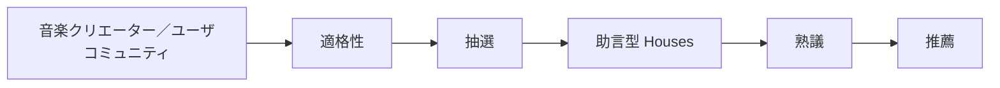

---

## 13.26 適格性の実証

ユーザ院議会では、

```text
ユーザ
 ↓
有効 / 検証済みユーザ
 ↓
ガバナンス適格ユーザ
```

という資格体系を実証する。

音楽クリエータ院議会では、

```text
音楽クリエーター
 ↓
検証済み音楽クリエーター
 ↓
ガバナンス適格音楽クリエーター
```

とする。

目的は政治参加を狭めることではなく、

- シビル攻撃
- ボット
- 架空音楽クリエーター
- 資本による大量アカウント支配

を防ぎながら、通常の音楽クリエーター／ユーザが参加できる母集団を形成することである。

---

## 13.27 検証可能抽選

抽選は運営会社の非公開処理にしない。

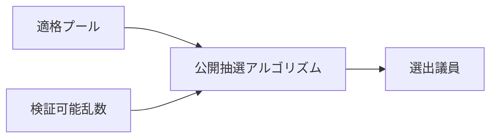

抽選母集団、乱数、アルゴリズム、結果を可能な範囲で検証可能にする。

---

## 13.28 抽選議会

試行では、

- 音楽クリエータ院議会
- ユーザ院議会

を一定人数で構成し、任期制とする。

Memberはガバナンス専門家である必要はない。

プラットフォーム側は、

- Orientation
- 技術 Briefing
- 法務 Briefing
- 経済シミュレーション
- Neutral Secretariat
- AI 支援

を提供する。

---

## 13.29 熟議の実証

```mermaid
flowchart LR
    PROP[提案]
    INFO[証跡 / Briefing]
    HEAR[利害関係者ヒアリング]
    SIM[シミュレーション]
    DELIB[熟議]
    REC[推薦]

    PROP --> INFO --> HEAR --> SIM --> DELIB --> REC
```

このフェーズでは、

> 「抽選で選ばれた普通の音楽クリエーター／ユーザが、十分な情報提供によって合理的な熟議を行えるか」

を検証する。

---

## 13.30 代表性監査

抽選結果がコミュニティを極端に歪めていないか監査する。

ユーザ院議会では、

- 利用頻度
- 地域
- サブスクリプション形態
- 利用傾向

音楽クリエータ院議会では、

- 音楽クリエーター役割
- 活動規模
- ジャンル
- 地域

等の偏りを評価する。

必要なら層化抽選等を導入する。

---

## 13.31 ガバナンス試行 KPI

- Member 参加
- 熟議 Completion
- コミュニティ信頼
- 代表性
- Member Turnover
- 提案理解度
- 推薦品質
- ガバナンスコスト
- シビル耐性

を評価する。

---

## 13.32 フェーズ 4 ゲート

本格的プロトコルガバナンスへ進む条件は、

- 適格性が機能
- 抽選が検証可能
- 音楽クリエーター／ユーザ代表性が許容範囲
- Memberが熟議へ参加できる
- 利益相反管理が機能
- シビル対策がある
- ガバナンスコストが持続可能
- コミュニティから一定の正統性が認められる

ことである。

---

## 13.33 フェーズ 5 — プロトコルガバナンス

フェーズ 5で抽選議会へ実際のプロトコルガバナンス権限を段階的に移す。

```mermaid
flowchart TD
    CHARTER[三憲章]
    CREATOR[音楽クリエーターコミュニティ]
    USER[ユーザコミュニティ]

    CREATOR --> CSORT[抽選]
    USER --> USORT[抽選]

    CSORT --> CH[音楽クリエータ院議会]
    USORT --> UH[ユーザ院議会]

    CH --> DELIB[共同熟議]
    UH --> DELIB

    CHARTER --> DELIB

    DELIB --> SPEC[プロトコル仕様]
    SPEC --> CODE[検証済みコード]
    CODE --> EXEC[自動実行]
```

---

## 13.34 権限移譲の順序

いきなりスマートコントラクトアップグレード権限を移さない。

```mermaid
flowchart LR
    COMMUNITY[コミュニティポリシー]
    DISCOVERY[発見ポリシー]
    ECON[経済パラメータ]
    TREASURY[資金庫]
    PROTOCOL[プロトコル Changes]
    CODE[コードガバナンス]

    COMMUNITY --> DISCOVERY --> ECON --> TREASURY --> PROTOCOL --> CODE
```

低リスク領域から実績を積む。

---

## 13.35 プロトコル仕様優先

議会が直接ソースコードを編集するのではない。

```mermaid
flowchart LR
    DELIB[熟議]
    DECISION[決定]
    SPEC[プロトコル仕様]
    DEV[実装]
    TEST[テスト / 形式検証]
    AUDIT[監査]
    TIME[タイムロック]
    DEPLOY[デプロイ]

    DELIB --> DECISION --> SPEC --> DEV --> TEST --> AUDIT --> TIME --> DEPLOY
```

ガバナンスは「何を実現するか」を決め、Software エンジニアリング手続が「安全にどう実装するか」を担う。

---

## 13.36 株式会社によるレビュー

両院承認後、株式会社は自由な政策拒否権を持つのではなく、

- 法務
- Contractual
- セキュリティ
- 技術安全性

の観点から執行可能性を確認する。

```mermaid
flowchart TD
    APPROVE[両院承認]
    REVIEW[法務 / セキュリティレビュー]

    APPROVE --> REVIEW
    REVIEW -->|Executable| IMPLEMENT[Implement]
    REVIEW -->|Illegal / Unsafe| RETURN[理由付き差戻し]
    RETURN --> DELIB[再熟議]
```

執行停止時には理由を公開する。

---

## 13.37 全体投票

3つの憲章等の重大事項は抽選議会だけで変更しない。

```mermaid
flowchart TD
    CHANGE[憲章適合提案]
    CH[音楽クリエータ院議会の特別多数]
    UH[ユーザ院議会の特別多数]
    CR[音楽クリエーターコミュニティ直接投票]
    UR[ユーザコミュニティ直接投票]

    CHANGE --> CH
    CHANGE --> UH
    CH --> CR
    UH --> UR
    CR --> FINAL[憲章適合承認]
    UR --> FINAL
```

これにより議会は熟議機関でありながら、主権の源泉をコミュニティに残す。

---

## 13.38 緊急ガバナンス

攻撃等に対する限定的緊急権限を整備する。

```mermaid
flowchart LR
    INCIDENT[重大インシデント]
    PAUSE[限定停止]
    DISCLOSE[開示]
    REVIEW[House レビュー]
    DECIDE[再開 / アップグレード]

    INCIDENT --> PAUSE --> DISCLOSE --> REVIEW --> DECIDE
```

停止権限、最大期間、再開条件をプロトコル仕様に記述する。

---

## 13.39 AIとプロトコルガバナンス

AI エージェントは、

- 提案 Analysis
- シミュレーション
- 仕様草案
- コード世代
- テスト世代
- セキュリティ Analysis

を支援できる。

しかし、

```mermaid
flowchart LR
    HUMAN[音楽クリエーター／ユーザガバナンス]
    SPEC[承認済み仕様]
    AI[AI 実装支援]
    REVIEW[人間 + 自動レビュー]
    CODE[コード]

    HUMAN --> SPEC --> AI --> REVIEW --> CODE
```

とし、AI自身を主権者・議員・最終承認者にはしない。

---

## 13.40 フェーズ 5 ゲート

STO & 規模拡大へ進む条件は、

- 音楽クリエータ院議会が実運用
- ユーザ院議会が実運用
- 抽選と適格性が検証可能
- 代表性監査が機能
- 複数の提案実績
- 仕様 → コードの追跡が可能
- タイムロック / 緊急手続が機能
- ガバナンス攻撃対策がある
- コミュニティがガバナンスを正統なものとして受け入れている

ことである。

---

## 13.41 フェーズ 6 — STO & 規模拡大

STOはプラットフォームガバナンスを作るための前提ではない。

> **事業・音楽クリエーター経済・検証可能性・ガバナンスが実証された後の成長資金調達手段**

として位置付ける。

```mermaid
flowchart LR
    MVP[MVP]
    ECON[音楽クリエーター経済]
    VERIFY[検証可能性]
    GOV[ガバナンス]
    STO[STO]
    SCALE[規模拡大]

    MVP --> ECON --> VERIFY --> GOV --> STO --> SCALE
```

---

## 13.42 STOとプロトコル支配を分離する

STO後も、

```mermaid
flowchart TD
    INVESTORS[株主 / STO 投資家]
    COMPANY[法人ガバナンス]

    CREATORS[音楽クリエーター]
    USERS[ユーザ]

    CREATORS --> CH[音楽クリエータ院議会]
    USERS --> UH[ユーザ院議会]

    INVESTORS --> COMPANY

    CH --> PROTOCOL[プロトコルガバナンス]
    UH --> PROTOCOL
```

を維持する。

株式を多く取得したことを理由にユーザ院議会や音楽クリエータ院議会の投票力を増加させない。

---

## 13.43 STO準備

STO前に、

- 株式会社の事業実績
- 財務情報
- 音楽クリエーター経済
- ガバナンス実績
- セキュリティ
- 法務構造
- トークンと株主権の関係
- 資金使途

を明確化する。

---

## 13.44 規模拡大インフラ

成長資金は需要に応じて、

- 国際 CDN
- Autoscaling
- イベントインフラ
- 権利インフラ
- 証明インフラ
- セキュリティ
- 可観測性

へ投資する。

第12章で定義した、

- コスト / ユーザ
- コスト / Play
- コスト / 聴取 Hour

を監視しながら規模拡大する。

---

## 13.45 フェーズ 6 ゲート

国際展開へ進む条件は、

- 国内事業モデルが成立
- 音楽クリエーター分配が持続可能
- ガバナンスが安定
- インフラが規模拡大可能
- セキュリティインシデント対応が成熟
- 国際展開資金が確保
- 国際ガバナンスの設計方針がある

ことである。

---

## 13.46 フェーズ 7 — 国際展開

国際展開では、

- 権利
- 税務
- Payments
- プライバシー
- 財務規制
- 音楽クリエーターコミュニティ
- ガバナンス代表性

を地域ごとに検討する。

```mermaid
flowchart TD
    GLOBAL[国際展開]

    GLOBAL --> RIGHTS[権利]
    GLOBAL --> TAX[税務]
    GLOBAL --> PAY[Payments]
    GLOBAL --> PRIVACY[プライバシー]
    GLOBAL --> FIN[財務規制]
    GLOBAL --> GOV[ガバナンス代表性]
```

---

## 13.47 国際ガバナンス

音楽クリエータ院議会/ユーザ院議会が国際化すると、単純な世界一律抽選では代表性の問題が起こり得る。

```mermaid
flowchart TD
    GLOBAL[国際適格コミュニティ]

    GLOBAL --> REGION[地域代表性]
    GLOBAL --> LANGUAGE[Language アクセス]
    GLOBAL --> CREATOR[音楽クリエーターの多様性]
    GLOBAL --> USER[ユーザの多様性]

    REGION --> SORT[Stratified / 検証可能抽選]
    LANGUAGE --> SORT
    CREATOR --> SORT
    USER --> SORT
```

地域、言語、利用形態等を考慮しながら、抽選制の原則を維持する。

---

## 13.48 技術ロードマップ

```mermaid
flowchart LR
    DOC[ホワイトペーパー]
    MVP[MVP]
    EVENT[利用実績パイプライン]
    RIGHTS[権利 Graph]
    DIST[分配]
    COMMIT[コミットメント]
    ZK[検証可能証明]
    GOV[ガバナンスインフラ]
    CODE[プロトコルコードガバナンス]
    GLOBAL[国際規模拡大]

    DOC --> MVP --> EVENT --> RIGHTS --> DIST --> COMMIT --> ZK --> GOV --> CODE --> GLOBAL
```

---

## 13.49 ガバナンスロードマップ

```mermaid
flowchart LR
    CHARTER[三憲章]
    CONSULT[コミュニティ協議]
    ELIG[適格性]
    SORT[助言型抽選]
    DELIB[熟議型 Houses]
    POLICY[ポリシーガバナンス]
    ECON[経済ガバナンス]
    CODE[コードガバナンス]

    CHARTER --> CONSULT --> ELIG --> SORT --> DELIB --> POLICY --> ECON --> CODE
```

ここが従来のロードマップからの重要な変更点である。

**二院制を宣言して即座に権限を渡すのではなく、代表性と熟議能力を実証してからコードガバナンスへ進む。**

---

## 13.50 音楽クリエーターロードマップ

```mermaid
flowchart LR
    EARLY[初期音楽クリエーター]
    VERIFIED[検証済み音楽クリエーター]
    ECON[音楽クリエーター経済]
    CONSULT[ガバナンス協議]
    SORT[抽選プール]
    HOUSE[音楽クリエータ院議会]
    GLOBAL[国際音楽クリエーターネットワーク]

    EARLY --> VERIFIED --> ECON --> CONSULT --> SORT --> HOUSE --> GLOBAL
```

---

## 13.51 ユーザロードマップ

```mermaid
flowchart LR
    ALPHA[Alpha ユーザ]
    ACTIVE[有効ユーザ]
    PAID[有料 / 有効コミュニティ]
    ELIG[ガバナンス適格ユーザ]
    SORT[抽選プール]
    HOUSE[ユーザ院議会]
    GLOBAL[国際ユーザコミュニティ]

    ALPHA --> ACTIVE --> PAID --> ELIG --> SORT --> HOUSE --> GLOBAL
```

ユーザ院議会は架空アカウントや資本保有者の集合ではなく、実際のユーザコミュニティから形成する。

---

## 13.52 法務ロードマップ

```mermaid
flowchart LR
    STRUCT[法務構造]
    TERMS[契約 / 条件]
    RIGHTS[権利法令遵守]
    PAY[決済法令遵守]
    GOV[ガバナンス法務 Design]
    STO[STO 法令遵守]
    GLOBAL[International 法令遵守]

    STRUCT --> TERMS --> RIGHTS --> PAY --> GOV --> STO --> GLOBAL
```

法務は最後に確認するものではなく、すべてのフェーズと並行する。

---

## 13.53 セキュリティロードマップ

```mermaid
flowchart LR
    BASE[安全な開発]
    IAM[IAM / Secrets]
    AUDIT[監査ログ]
    CONTRACT[コントラクト監査]
    PROOF[証明システムレビュー]
    SORT[抽選セキュリティ]
    GOV[ガバナンスセキュリティ]
    RED[インシデント Drills]

    BASE --> IAM --> AUDIT --> CONTRACT --> PROOF --> SORT --> GOV --> RED
```

ガバナンスがプロトコル権限を持つ段階では、ガバナンス攻撃自体がセキュリティ Threatになる。

---

## 13.54 インフラロードマップ

```mermaid
flowchart LR
    SIMPLE[マネージド MVP]
    SCALE[Autoscaling]
    STREAM[イベントストリーミング]
    PROOF[証明インフラ]
    GOV[ガバナンスインフラ]
    HA[高可用性]
    GLOBAL[Multi-region / 国際エッジ]

    SIMPLE --> SCALE --> STREAM --> PROOF --> GOV --> HA --> GLOBAL
```

---

## 13.55 AI共同開発ロードマップ

AIは、

- 文書
- 要件
- 仕様
- Coding
- Testing
- セキュリティレビュー支援
- 運用
- ガバナンス Analysis

へ利用する。

```mermaid
flowchart LR
    DOC[文書 AI]
    SPEC[仕様 AI]
    DEV[開発 AI]
    TEST[テスト AI]
    OPS[運用 AI]
    GOV[ガバナンス支援 AI]

    DOC --> SPEC --> DEV --> TEST --> OPS --> GOV
```

ただしAIは音楽クリエーター／ユーザからガバナンスの正統性を奪わない。

---

## 13.56 GitHubを制度とコードの履歴にする

GitHubには、

- ホワイトペーパー
- Charters
- ガバナンス Proposals
- ガバナンス決定s
- プロトコル仕様s
- ADR
- スマートコントラクトs
- テスト
- インフラ

を保存する。

```mermaid
flowchart TD
    GIT[GitHub]

    GIT --> WP[ホワイトペーパー]
    GIT --> CHARTER[Charters]
    GIT --> GOV[ガバナンス]
    GIT --> SPEC[Specifications]
    GIT --> ADR[ADR]
    GIT --> CODE[コード]
    GIT --> TEST[テスト]
```

理念から実行コードまで変更理由を追跡できるようにする。

---

## 13.57 推奨リポジトリ構造

```text
creator-first-platform/
├── docs/
│   └── whitepaper/
├── charters/
├── governance/
│   ├── proposals/
│   ├── decisions/
│   ├── sortition/
│   └── referendums/
├── protocol/
│   ├── specifications/
│   └── versions/
├── docs/
│   └── adr/
├── contracts/
├── apps/
├── services/
├── infrastructure/
├── tests/
└── .github/
```

将来、ガバナンス決定と実装コミットを機械的に関連付けられる構造を目指す。

---

## 13.58 バージョン管理

ホワイトペーパー、Charters、プロトコルを版管理する。

```text
ホワイトペーパー v1.0
Charters v1.0
プロトコル v0.1

ホワイトペーパー v1.1
プロトコル v0.2

プロトコル v1.0
```

重要変更は、

```mermaid
flowchart LR
    PROP[提案]
    DELIB[熟議]
    DECISION[決定]
    SPEC[仕様]
    PR[プルリクエスト]
    REVIEW[検証]
    VERSION[プロトコル版]

    PROP --> DELIB --> DECISION --> SPEC --> PR --> REVIEW --> VERSION
```

として追跡する。

---

## 13.59 ホワイトペーパーは継続更新文書

ホワイトペーパーは完成後変更しない宣言文ではない。

> **理念を維持しながら、実証、法律、技術、音楽クリエーター／ユーザコミュニティの変化を反映する継続更新文書**

とする。

ただし過去版を保存し、重要な思想変更を履歴から消さない。

---

## 13.60 フェーズ別KPI

| フェーズ | 主要KPI |
| --- | --- |
| 基盤 | 仕様完成度・法務論点・開発準備 |
| 音楽 MVP | 有効ユーザ・聴取・UX・有効音楽クリエーター |
| 音楽クリエーター経済 | 音楽クリエーター収益・権利精度・Unit Economics |
| 検証可能プラットフォーム | 監査可能性・証明コスト・不正率 |
| ガバナンス試行 | 代表性・参加・熟議品質 |
| プロトコルガバナンス | 提案品質・実行安全性・コミュニティ信頼 |
| STO & 規模拡大 | 成長・資本効率・インフラ効率 |
| International | 地域別ユーザ・音楽クリエーター・権利 Coverage・代表性 |

---

## 13.61 ガバナンス健全性 KPI

特にガバナンスでは、

- 代表性
- 参加
- 熟議品質
- Member Turnover
- シビル耐性
- 委任 Concentration
- 提案 Completion
- 実行安全性
- コミュニティ信頼

を追跡する。

単に投票数が多いことを成功とはしない。

---

## 13.62 最重要指標

Creator First Platformの最重要指標は、再生回数や企業価値だけではない。

```mermaid
flowchart TD
    VALUE[Sustainable 音楽クリエーター-ユーザエコシステム]

    VALUE --> CREATOR[音楽クリエーターの持続可能性]
    VALUE --> USER[ユーザ価値 & 自律性]
    VALUE --> DISCOVERY[発見 / 多様性]
    VALUE --> TRUST[信頼 / 検証可能性]
    VALUE --> GOV[Democratic Legitimacy]
```

---

## 13.63 中止・方向転換基準

各フェーズでは進む条件だけでなく、見直す条件を定める。

例えば、

- 音楽クリエーターが価値を感じない
- ユーザ継続率が成立しない
- 権利コストが持続不能
- インフラコストが収益を超える
- 抽選議会の代表性が成立しない
- ガバナンス参加が維持できない
- プロトコルガバナンスが安全に運用できない

場合は自動的に次フェーズへ進まない。

```mermaid
flowchart LR
    RESULT[Measured 結果]
    CHECK{Sustainable?}
    NEXT[Next フェーズ]
    PIVOT[Redesign]
    STOP[Stop]

    RESULT --> CHECK
    CHECK -->|はい| NEXT
    CHECK -->|Needs 変更| PIVOT
    CHECK -->|No| STOP
```

---

## 13.64 ロードマップ全体

```mermaid
flowchart TD
    VISION[ビジョン]
    CHARTER[三憲章]

    VISION --> CHARTER
    CHARTER --> FOUNDATION[フェーズ 0 基盤]
    FOUNDATION --> MVP[フェーズ 1 音楽 MVP]
    MVP --> ECON[フェーズ 2 音楽クリエーター経済]
    ECON --> VERIFY[フェーズ 3 検証可能プラットフォーム]
    VERIFY --> PILOT[フェーズ 4 ガバナンス試行]
    PILOT --> GOV[フェーズ 5 プロトコルガバナンス]
    GOV --> STO[フェーズ 6 STO & 規模拡大]
    STO --> GLOBAL[フェーズ 7 International]

    PILOT --> SORT[適格性 + 抽選]
    GOV --> HOUSES[音楽クリエータ院議会 + ユーザ院議会]
    HOUSES --> DELIB[熟議]
    DELIB --> SPEC[プロトコル仕様]
    SPEC --> CODE[スマートコントラクト]
```

---

## 13.65 最終アーキテクチャ

```mermaid
flowchart TD
    LAW[適用法令]
    CHARTER[三憲章]

    LAW --> CHARTER

    CREATOR[音楽クリエーターコミュニティ]
    USER[ユーザコミュニティ]

    CREATOR --> CELIG[適格音楽クリエーター]
    USER --> UELIG[適格ユーザ]

    CELIG --> CSORT[検証可能抽選]
    UELIG --> USORT[検証可能抽選]

    CSORT --> CH[音楽クリエータ院議会]
    USORT --> UH[ユーザ院議会]

    CH --> DELIB[共同熟議]
    UH --> DELIB

    CHARTER --> DELIB

    DELIB --> SPEC[プロトコル仕様]
    SPEC --> REVIEW[法務 / セキュリティレビュー]
    REVIEW --> CODE[検証済みスマートコントラクト]
    CODE --> EXEC[自動実行]

    CREATOR --> REFERENDUM[憲章適合全体投票]
    USER --> REFERENDUM
    CHARTER --> REFERENDUM

    CORP[株式会社]
    CORP --> LEGAL[法務 / 権利 / 事業責任]
    LEGAL --> PLATFORM[音楽プラットフォーム]

    EXEC --> PLATFORM
```

株式会社は現実社会で責任を負い、音楽クリエーター／ユーザコミュニティはプロトコルガバナンスの正統性を生み、抽選議会は熟議し、仕様がルールを定義し、スマートコントラクトがそれを執行する。

---

## 13.66 成功の定義

Creator First Platformの成功とは、

1. 音楽クリエーターが持続可能な収益を得られる
2. ユーザが高品質な音楽体験を得られる
3. 新人・Long Tail 音楽クリエーターが発見される
4. 権利と分配が透明である
5. プラットフォームの重要な計算が検証可能である
6. 音楽クリエーター／ユーザがガバナンスの主権の源泉であり続ける
7. 抽選された代表が十分な情報のもとで熟議できる
8. ガバナンス決定が仕様とコードへ追跡可能に変換される
9. 株式会社が現実社会で法的責任を果たす
10. 資本保有がプロトコル支配へ直結しない
11. 事業として持続可能である

状態である。

---

## 13.67 本章のまとめ

Creator First Platformのロードマップは、

```text
ビジョン
  ↓
三憲章
  ↓
基盤
  ↓
音楽 MVP
  ↓
音楽クリエーター経済
  ↓
検証可能プラットフォーム
  ↓
ガバナンス試行
  ↓
音楽クリエーター／ユーザ
  ↓
適格性
  ↓
検証可能抽選
  ↓
音楽クリエータ院議会 / ユーザ院議会
  ↓
熟議
  ↓
プロトコル仕様
  ↓
検証済みスマートコントラクト
  ↓
自動実行
  ↓
STO & 規模拡大
  ↓
国際展開
```

という順序を採る。

重要なのは、ガバナンスをホワイトペーパー上で宣言するだけではなく、

> **実際の音楽クリエーター／ユーザコミュニティから正統性を形成し、抽選と熟議を実証してからプロトコルコードの統治へ進む**

ことである。

ブロックチェーン、ゼロ知識証明、DAO、STO、AIは目的ではない。

これらは、

> **音楽クリエーターとユーザが、自ら参加するデジタル空間のルールを共同形成し、そのルールを透明かつ検証可能に実行する**

ための手段である。

---

## 13.68 ホワイトペーパー v1.0から次の段階へ

ホワイトペーパー v1.0確定後は、内容を実装可能な仕様へ変換する。

```mermaid
flowchart LR
    WP[ホワイトペーパー v1.0]
    CHARTER[Charters]
    REQ[要件]
    SPEC[プロトコル仕様s]
    ADR[アーキテクチャ Decisions]
    BACKLOG[開発 Backlog]
    MVP[MVP]

    WP --> CHARTER --> REQ --> SPEC --> ADR --> BACKLOG --> MVP
```

次の成果物候補は、

```text
charters/
├── creator-charter.md
├── user-charter.md
└── ecosystem-charter.md

protocol/
├── architecture.md
├── identity-and-eligibility.md
├── rights-model.md
├── distribution-spec.md
├── governance-spec.md
├── sortition-spec.md
├── referendum-spec.md
└── usage-oracle-spec.md

docs/adr/
```

である。

特に、

- `identity-and-eligibility.md`
- `sortition-spec.md`
- `governance-spec.md`

によって、

> **誰が音楽クリエーター／ユーザなのか → 誰が抽選母集団に入るのか → どう抽選するのか → どう熟議するのか → どうコードへ変換するのか**

を実装可能な仕様へ落とし込む。

これがホワイトペーパーからCreator First Platformの実装へ移行する次の段階となる。

---

## 13.69 テストネットから本番系への移行

本番系はテストネットのデータやコントラクトを昇格させる環境ではない。テストネットは失敗、再試行、権限、監査および利用体験を検証する証拠を提供し、本番はその証拠を基に独立したアカウント、鍵、ネットワーク、データ、コントラクトおよび運用体制を構築する。

```mermaid
flowchart LR
    TEST[テストネット実証]
    DECIDE[未解決事項の決定]
    LEGAL[法務・権利・税務・決済承認]
    BUILD[独立した本番系構築]
    AUDIT[監査・障害復旧演習]
    PILOT[限定ユーザによる段階公開]
    PROD[本番提供]

    TEST --> DECIDE --> LEGAL --> BUILD --> AUDIT --> PILOT --> PROD
```

本番開始には、少なくとも次の成立証拠を必要とする。

1. ユーザ登録、認証、復旧、閉鎖および個人情報処理
2. アーティストダイレクト適格性、契約、受取人、税務および作品別権利審査
3. JPYC等の対象資産、ネットワーク、返金、会計およびガス支援
4. 非公開メディア配信、短命認可、利用実績検証、権利停止および削除
5. サポーター資格証明、コミュニティ、モデレーション、異議申立ておよび退出
6. 適格コミュニティ、抽選、任期付き議員、両院議決、法人確認およびタイムロック
7. 利用実績、権利、確定収益、分配債務、支払、税務および資金庫の照合
8. 独立監査、負荷試験、バックアップ復元、地域障害、鍵漏えいおよびインシデント対応

Polygon Amoyのプロフィール、MockJPYC、SBT、議員、投票、証明、鍵およびコントラクトアドレスは本番へ移行しない。本番の横断成立条件は[ADR-0018](/adr/ADR-0018-production-service-architecture)と[SPEC-PLATFORM-001](/protocol/specs/production-service-lifecycle)を正本とする。
